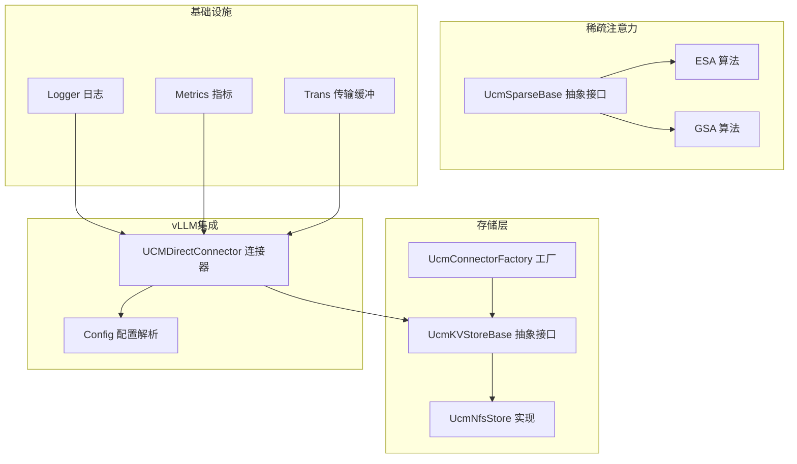
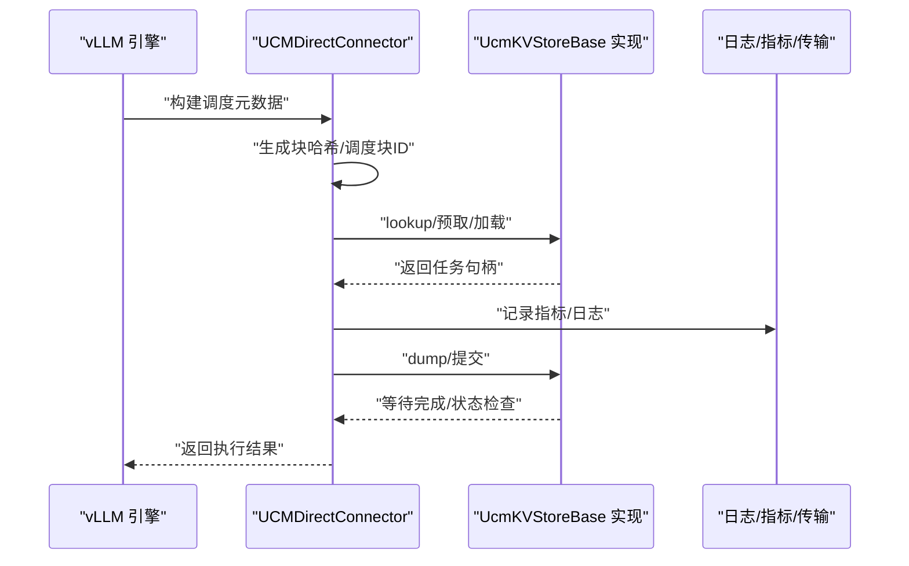
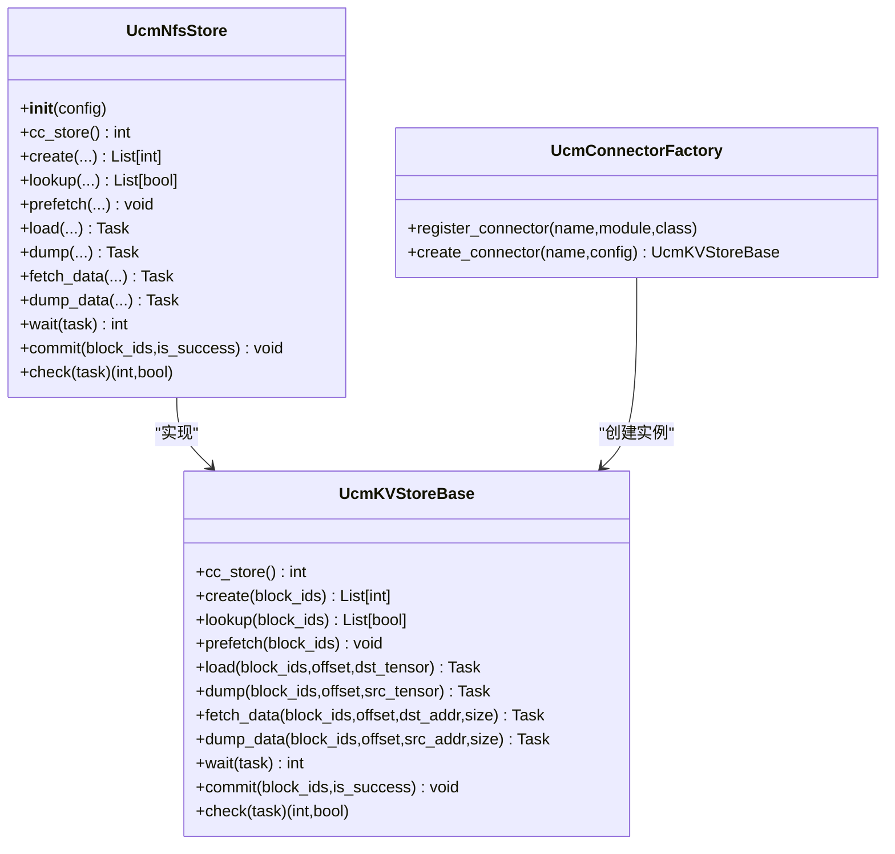

# API参考

<cite>
**本文引用的文件**
- [ucm/store/ucmstore.py](file://ucm/store/ucmstore.py)
- [ucm/store/factory.py](file://ucm/store/factory.py)
- [ucm/store/nfsstore/nfsstore_connector.py](file://ucm/store/nfsstore/nfsstore_connector.py)
- [ucm/integration/vllm/ucm_connector.py](file://ucm/integration/vllm/ucm_connector.py)
- [ucm/sparse/base.py](file://ucm/sparse/base.py)
- [ucm/sparse/esa/esa.py](file://ucm/sparse/esa/esa.py)
- [ucm/sparse/gsa/gsa.py](file://ucm/sparse/gsa/gsa.py)
- [ucm/shared/infra/logger/logger.h](file://ucm/shared/infra/logger/logger.h)
- [ucm/shared/metrics/cc/api/metrics_api.h](file://ucm/shared/metrics/cc/api/metrics_api.h)
- [ucm/shared/trans/buffer.h](file://ucm/shared/trans/buffer.h)
- [ucm/utils.py](file://ucm/utils.py)
- [examples/offline_inference.py](file://examples/offline_inference.py)
- [examples/offline_inference_blend.py](file://examples/offline_inference_blend.py)
</cite>

## 目录
1. [简介](#简介)
2. [项目结构](#项目结构)
3. [核心组件](#核心组件)
4. [架构总览](#架构总览)
5. [详细组件分析](#详细组件分析)
6. [依赖关系分析](#依赖关系分析)
7. [性能考量](#性能考量)
8. [故障排查指南](#故障排查指南)
9. [结论](#结论)
10. [附录](#附录)

## 简介
本文件为UCM（Unified Cache Management）项目的完整API参考，覆盖以下方面：
- 存储接口：KV缓存的读写、后端管理与状态查询
- 稀疏算法API：初始化、参数设置与计算执行
- vLLM集成API：连接器接口、配置管理与数据交换
- 基础设施组件：日志、指标与传输层API
- 每个API的方法签名、参数、返回值、异常处理与使用示例
- 版本兼容性与变更历史说明

## 项目结构
UCM采用模块化设计，按功能域划分：
- 存储层：抽象存储接口与多种后端实现（NFS、PC、Mooncake等）
- 稀疏注意力：ESA、GSA、KVStar、Blend等算法实现
- vLLM集成：KV连接器与元数据调度
- 基础设施：日志、指标、传输缓冲
- 工具与示例：配置解析、示例推理脚本

图表来源
- [ucm/store/ucmstore.py](file://ucm/store/ucmstore.py#L39-L205)
- [ucm/store/nfsstore/nfsstore_connector.py](file://ucm/store/nfsstore/nfsstore_connector.py#L39-L132)
- [ucm/store/factory.py](file://ucm/store/factory.py#L34-L71)
- [ucm/sparse/base.py](file://ucm/sparse/base.py#L127-L323)
- [ucm/sparse/esa/esa.py](file://ucm/sparse/esa/esa.py#L421-L821)
- [ucm/sparse/gsa/gsa.py](file://ucm/sparse/gsa/gsa.py#L475-L1166)
- [ucm/integration/vllm/ucm_connector.py](file://ucm/integration/vllm/ucm_connector.py#L82-L1080)
- [ucm/utils.py](file://ucm/utils.py#L34-L91)
- [ucm/shared/infra/logger/logger.h](file://ucm/shared/infra/logger/logger.h#L28-L52)
- [ucm/shared/metrics/cc/api/metrics_api.h](file://ucm/shared/metrics/cc/api/metrics_api.h#L28-L43)
- [ucm/shared/trans/buffer.h](file://ucm/shared/trans/buffer.h#L32-L48)

章节来源
- [ucm/store/ucmstore.py](file://ucm/store/ucmstore.py#L39-L205)
- [ucm/store/factory.py](file://ucm/store/factory.py#L34-L71)
- [ucm/store/nfsstore/nfsstore_connector.py](file://ucm/store/nfsstore/nfsstore_connector.py#L39-L132)
- [ucm/sparse/base.py](file://ucm/sparse/base.py#L127-L323)
- [ucm/sparse/esa/esa.py](file://ucm/sparse/esa/esa.py#L421-L821)
- [ucm/sparse/gsa/gsa.py](file://ucm/sparse/gsa/gsa.py#L475-L1166)
- [ucm/integration/vllm/ucm_connector.py](file://ucm/integration/vllm/ucm_connector.py#L82-L1080)
- [ucm/utils.py](file://ucm/utils.py#L34-L91)
- [ucm/shared/infra/logger/logger.h](file://ucm/shared/infra/logger/logger.h#L28-L52)
- [ucm/shared/metrics/cc/api/metrics_api.h](file://ucm/shared/metrics/cc/api/metrics_api.h#L28-L43)
- [ucm/shared/trans/buffer.h](file://ucm/shared/trans/buffer.h#L32-L48)

## 核心组件
本节概述各子系统的关键API与职责。

- 存储接口（UcmKVStoreBase）
  - 负责KV缓存的创建、查找、预取、加载、转储、数据搬运、任务等待与提交
  - 提供底层实现指针、任务类型与状态检查能力
- 存储工厂（UcmConnectorFactory）
  - 注册与创建不同存储后端（如NFS、PC、Mooncake）
- vLLM连接器（UCMDirectConnector）
  - 将UCM与vLLM的KV缓存管理对接，负责块哈希、调度元数据构建、加载/保存KV缓存
- 稀疏注意力（UcmSparseBase）
  - 定义调度端与工作端的钩子函数，支持请求生命周期管理与注意力阶段控制
- 基础设施
  - 日志API：统一的日志接口与级别宏
  - 指标API：指标初始化、创建、更新与统计采集
  - 传输缓冲API：设备/主机缓冲区分配与注册

章节来源
- [ucm/store/ucmstore.py](file://ucm/store/ucmstore.py#L39-L205)
- [ucm/store/factory.py](file://ucm/store/factory.py#L34-L71)
- [ucm/integration/vllm/ucm_connector.py](file://ucm/integration/vllm/ucm_connector.py#L82-L1080)
- [ucm/sparse/base.py](file://ucm/sparse/base.py#L127-L323)
- [ucm/shared/infra/logger/logger.h](file://ucm/shared/infra/logger/logger.h#L28-L52)
- [ucm/shared/metrics/cc/api/metrics_api.h](file://ucm/shared/metrics/cc/api/metrics_api.h#L28-L43)
- [ucm/shared/trans/buffer.h](file://ucm/shared/trans/buffer.h#L32-L48)

## 架构总览
UCM通过连接器在vLLM与存储后端之间建立桥接，稀疏注意力算法在工作端按阶段对KV缓存进行检索与加载，基础设施组件提供日志、指标与传输能力。

图表来源
- [ucm/integration/vllm/ucm_connector.py](file://ucm/integration/vllm/ucm_connector.py#L397-L447)
- [ucm/store/ucmstore.py](file://ucm/store/ucmstore.py#L71-L194)
- [ucm/shared/infra/logger/logger.h](file://ucm/shared/infra/logger/logger.h#L28-L52)
- [ucm/shared/metrics/cc/api/metrics_api.h](file://ucm/shared/metrics/cc/api/metrics_api.h#L28-L43)

## 详细组件分析

### 存储接口 API 参考（UcmKVStoreBase）
- 方法概览
  - cc_store(): 返回底层实现指针
  - create(block_ids): 批量创建KV缓存空间
  - lookup(block_ids): 批量查找命中情况
  - prefetch(block_ids): 预取到高速缓存
  - load(block_ids, offset, dst_tensor): 加载到设备张量
  - dump(block_ids, offset, src_tensor): 从设备转储
  - fetch_data(block_ids, offset, dst_addr, size): 加载数据到指定地址
  - dump_data(block_ids, offset, src_addr, size): 从指定地址转储数据
  - wait(task): 等待任务完成
  - commit(block_ids, is_success): 提交并释放或保留块
  - check(task): 检查任务状态（返回码与是否完成）

- 参数与返回
  - block_ids: 块ID列表（字符串/字节）
  - offset: 分片偏移（多TP场景）
  - dst_addr/src_addr: 设备内存地址数组
  - size: 数据大小数组
  - task: 任务对象，用于等待/检查
  - is_success: 是否成功标志

- 异常处理
  - 后端实现可能抛出运行时错误（如IO失败），调用方应捕获并记录

- 使用示例路径
  - [ucm/store/nfsstore/nfsstore_connector.py](file://ucm/store/nfsstore/nfsstore_connector.py#L75-L132)

章节来源
- [ucm/store/ucmstore.py](file://ucm/store/ucmstore.py#L39-L205)
- [ucm/store/nfsstore/nfsstore_connector.py](file://ucm/store/nfsstore/nfsstore_connector.py#L39-L132)

### 存储工厂 API 参考（UcmConnectorFactory）
- 功能
  - register_connector(name, module_path, class_name): 注册存储后端
  - create_connector(connector_name, config): 创建具体存储实例

- 支持的后端
  - UcmNfsStore
  - UcmPcStore
  - UcmMooncakeStore

- 使用示例路径
  - [ucm/store/factory.py](file://ucm/store/factory.py#L34-L71)

章节来源
- [ucm/store/factory.py](file://ucm/store/factory.py#L34-L71)

### vLLM 连接器 API 参考（UCMDirectConnector）
- 关键职责
  - 块哈希生成与映射
  - 调度元数据构建（请求级块ID分发）
  - 加载/等待/保存KV缓存（支持层间重叠与MLA/DSA）
  - 指标上报（加载/保存耗时、吞吐）

- 主要方法
  - register_kv_caches(kv_caches): 注册KV缓存基址
  - get_num_new_matched_tokens(request, num_computed_tokens): 计算外部命中数
  - build_connector_meta(scheduler_output): 生成连接器元数据
  - start_load_kv(forward_context): 触发加载任务
  - wait_for_layer_load(layer_name): 等待某层加载完成
  - save_kv_layer(layer_name, kv_layer, attn_metadata): 保存某层KV
  - wait_for_save(): 等待所有保存完成
  - get_block_ids_with_load_errors(): 获取加载失败的块ID集合

- 参数与返回
  - kv_caches: 层名到KV张量的映射
  - scheduler_output: vLLM调度输出
  - forward_context/attn_metadata: 注意力元数据
  - layer_name: 层名（如“model.layers.1.self_attn”）

- 异常处理
  - 加载/等待过程中捕获运行时错误并记录，维护无效块ID集合

- 使用示例路径
  - [ucm/integration/vllm/ucm_connector.py](file://ucm/integration/vllm/ucm_connector.py#L230-L644)
  - [examples/offline_inference.py](file://examples/offline_inference.py#L18-L44)

章节来源
- [ucm/integration/vllm/ucm_connector.py](file://ucm/integration/vllm/ucm_connector.py#L82-L1080)
- [examples/offline_inference.py](file://examples/offline_inference.py#L18-L44)

### 稀疏注意力 API 参考（UcmSparseBase）
- 角色与职责
  - 调度端：估算所需槽位、更新状态、构建元数据
  - 工作端：在注意力前后钩入，执行检索/加载、FFN/层边界处理

- 核心方法
  - request_begin/request_finished_in_scheduler/request_finished_in_worker
  - estimate_num_slots_sparsed/update_state_after_alloc/build_sparse_meta/allocate_slots
  - execute_begin/execute_finished/attention_begin/attention_finished
  - ffn_begin/ffn_finished/layer_begin/layer_finished

- 元数据与缓冲
  - UcmSparseMetadata：抽象元数据
  - UcmSparseCpuGpuBuffer：CPU/GPU间张量复制辅助

- 使用示例路径
  - [ucm/sparse/base.py](file://ucm/sparse/base.py#L127-L323)

章节来源
- [ucm/sparse/base.py](file://ucm/sparse/base.py#L127-L323)

### ESA 算法 API 参考
- 功能特性
  - 基于表示池与检索的稀疏策略
  - 多层状态管理与任务调度
  - 支持MLA/DSA模型

- 关键类
  - ESASparseMetaData：请求元信息容器
  - ReqStatePerLayer：单请求单层状态机
  - ESA：算法主类，继承自UcmSparseBase

- 方法要点
  - build_sparse_meta：构建当前步的元数据
  - attention_begin/attention_finished：在注意力阶段触发检索与加载
  - estimate_num_slots_sparsed：估算压缩后的序列长度

- 使用示例路径
  - [ucm/sparse/esa/esa.py](file://ucm/sparse/esa/esa.py#L421-L821)

章节来源
- [ucm/sparse/esa/esa.py](file://ucm/sparse/esa/esa.py#L421-L821)

### GSA 算法 API 参考
- 功能特性
  - 基于Top-K与K预取的稀疏策略
  - 支持预填充/解码阶段区分
  - 支持CUDA与Python两种Top-K路径

- 关键类
  - GSAMetaData：请求状态与输入张量组织
  - GSAReqStat：请求状态管理
  - GSA：算法主类，继承自UcmSparseBase

- 方法要点
  - attention_begin/attention_finished：在注意力阶段组织Top-K与K预取
  - last_chunk_topk_cal：最后分块Top-K计算
  - kvcache_init_last_chunk：初始化最后分块的KV缓存

- 使用示例路径
  - [ucm/sparse/gsa/gsa.py](file://ucm/sparse/gsa/gsa.py#L475-L1166)

章节来源
- [ucm/sparse/gsa/gsa.py](file://ucm/sparse/gsa/gsa.py#L475-L1166)

### 基础设施 API 参考

#### 日志 API（Logger）
- 接口
  - Log(level, file, func, line, msg)
  - Setup(path, max_files, max_size)
  - Flush()

- 宏
  - UC_DEBUG/INFO/WARN/ERROR(fmt, ...)

- 使用示例路径
  - [ucm/shared/infra/logger/logger.h](file://ucm/shared/infra/logger/logger.h#L28-L52)

章节来源
- [ucm/shared/infra/logger/logger.h](file://ucm/shared/infra/logger/logger.h#L28-L52)

#### 指标 API（Metrics）
- 接口
  - SetUp(maxVectorLen)
  - CreateStats(name, type)
  - UpdateStats(name, value)/UpdateStats(map)
  - GetAllStatsAndClear()

- 使用示例路径
  - [ucm/shared/metrics/cc/api/metrics_api.h](file://ucm/shared/metrics/cc/api/metrics_api.h#L28-L43)

章节来源
- [ucm/shared/metrics/cc/api/metrics_api.h](file://ucm/shared/metrics/cc/api/metrics_api.h#L28-L43)

#### 传输缓冲 API（Trans Buffer）
- 接口
  - MakeDeviceBuffer/MakeDeviceBuffers/GetDeviceBuffer
  - MakeHostBuffer/MakeHostBuffers/GetHostBuffer
  - RegisterHostBuffer/UnregisterHostBuffer

- 使用示例路径
  - [ucm/shared/trans/buffer.h](file://ucm/shared/trans/buffer.h#L32-L48)

章节来源
- [ucm/shared/trans/buffer.h](file://ucm/shared/trans/buffer.h#L32-L48)

### 配置解析 API（Config）
- 功能
  - 从终端输入或YAML文件加载UCM配置
  - 默认回退至NFS存储

- 方法
  - load_ucm_config_from_yaml(file_path)
  - get_config()

- 使用示例路径
  - [ucm/utils.py](file://ucm/utils.py#L34-L91)

章节来源
- [ucm/utils.py](file://ucm/utils.py#L34-L91)

## 依赖关系分析

图表来源
- [ucm/store/ucmstore.py](file://ucm/store/ucmstore.py#L39-L205)
- [ucm/store/nfsstore/nfsstore_connector.py](file://ucm/store/nfsstore/nfsstore_connector.py#L39-L132)
- [ucm/store/factory.py](file://ucm/store/factory.py#L34-L71)

章节来源
- [ucm/store/ucmstore.py](file://ucm/store/ucmstore.py#L39-L205)
- [ucm/store/nfsstore/nfsstore_connector.py](file://ucm/store/nfsstore/nfsstore_connector.py#L39-L132)
- [ucm/store/factory.py](file://ucm/store/factory.py#L34-L71)

## 性能考量
- 存储层
  - I/O直通、流数量与缓冲数量可调，影响吞吐与延迟
  - 预取与分片偏移有助于减少跨TP通信开销
- vLLM集成
  - 层间重叠加载/保存可提升并发度；需注意同步点
  - 指标上报有助于定位瓶颈
- 稀疏算法
  - Top-K与K预取策略影响检索延迟与带宽占用
  - 表示池大小与检索步长需结合模型规模与显存预算调优

## 故障排查指南
- 存储加载失败
  - 现象：加载/等待阶段抛出运行时错误
  - 处理：检查块ID有效性、后端可用性与权限；记录无效块ID集合
  - 参考路径：[ucm/integration/vllm/ucm_connector.py](file://ucm/integration/vllm/ucm_connector.py#L522-L544)
- 配置缺失
  - 现象：未提供UCM配置文件或字段为空
  - 处理：提供有效YAML或通过终端输入补充配置
  - 参考路径：[ucm/utils.py](file://ucm/utils.py#L63-L86)
- 指标未更新
  - 现象：无指标输出
  - 处理：确认指标配置路径与工作节点ID设置
  - 参考路径：[ucm/integration/vllm/ucm_connector.py](file://ucm/integration/vllm/ucm_connector.py#L142-L156)

章节来源
- [ucm/integration/vllm/ucm_connector.py](file://ucm/integration/vllm/ucm_connector.py#L522-L544)
- [ucm/utils.py](file://ucm/utils.py#L63-L86)

## 结论
UCM提供了从存储抽象到vLLM集成与稀疏注意力的完整链路，具备良好的扩展性与可观测性。通过工厂模式与连接器接口，用户可在不修改上层逻辑的前提下接入不同存储后端，并利用稀疏算法优化长序列推理性能。

## 附录

### 使用示例与模式
- 离线推理（基础）
  - 设置KVTransferConfig并传入UCM连接器名称与模块路径
  - 示例路径：[examples/offline_inference.py](file://examples/offline_inference.py#L18-L44)
- Cache Blend（RAG分块缓存）
  - 通过extra_config配置ucm_connectors与ucm_sparse_config
  - 示例路径：[examples/offline_inference_blend.py](file://examples/offline_inference_blend.py#L87-L135)

章节来源
- [examples/offline_inference.py](file://examples/offline_inference.py#L18-L44)
- [examples/offline_inference_blend.py](file://examples/offline_inference_blend.py#L87-L135)

### 版本兼容性与变更历史
- vLLM连接器
  - 支持直接加载/保存与层间重叠两种模式
  - 自动识别CUDA/NPU平台并选择对应同步机制
- 存储后端
  - NFS后端提供灵活的I/O参数与回收策略配置
- 稀疏算法
  - ESA与GSA均支持MLA/DSA模型；GSA提供CUDA与Python双路径
- 基础设施
  - 日志与指标API保持稳定接口；传输缓冲API提供设备/主机缓冲统一管理

章节来源
- [ucm/integration/vllm/ucm_connector.py](file://ucm/integration/vllm/ucm_connector.py#L105-L162)
- [ucm/store/nfsstore/nfsstore_connector.py](file://ucm/store/nfsstore/nfsstore_connector.py#L48-L66)
- [ucm/sparse/esa/esa.py](file://ucm/sparse/esa/esa.py#L421-L447)
- [ucm/sparse/gsa/gsa.py](file://ucm/sparse/gsa/gsa.py#L500-L512)
- [ucm/shared/infra/logger/logger.h](file://ucm/shared/infra/logger/logger.h#L28-L52)
- [ucm/shared/metrics/cc/api/metrics_api.h](file://ucm/shared/metrics/cc/api/metrics_api.h#L28-L43)
- [ucm/shared/trans/buffer.h](file://ucm/shared/trans/buffer.h#L32-L48)