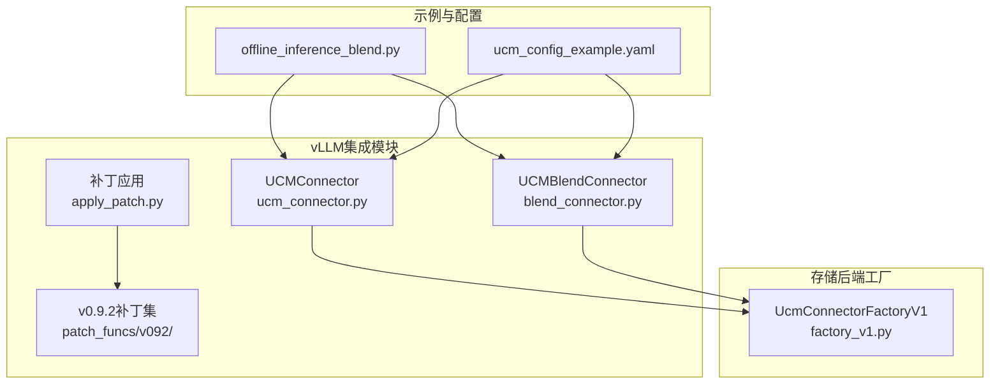
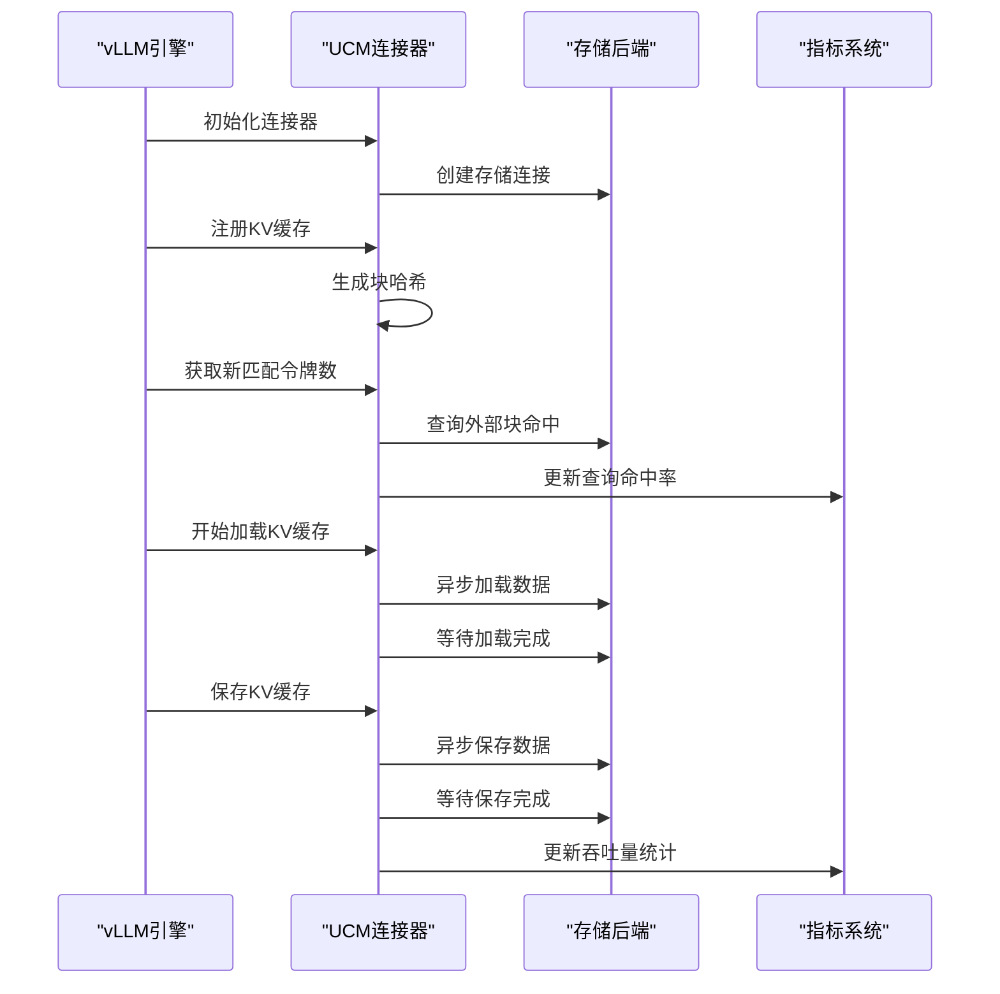
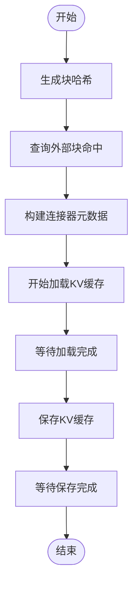
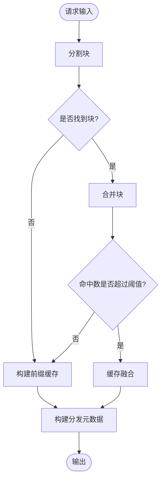
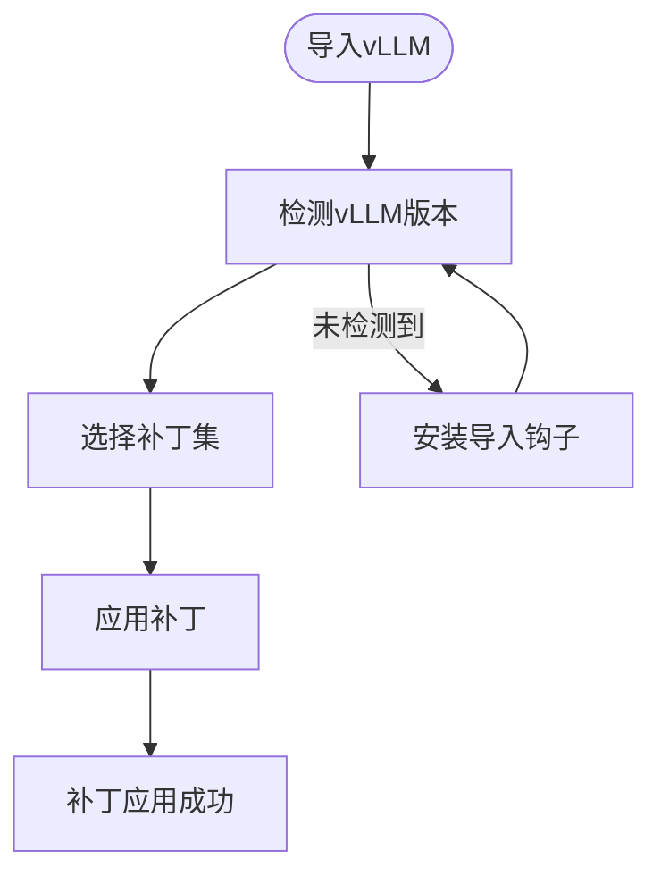
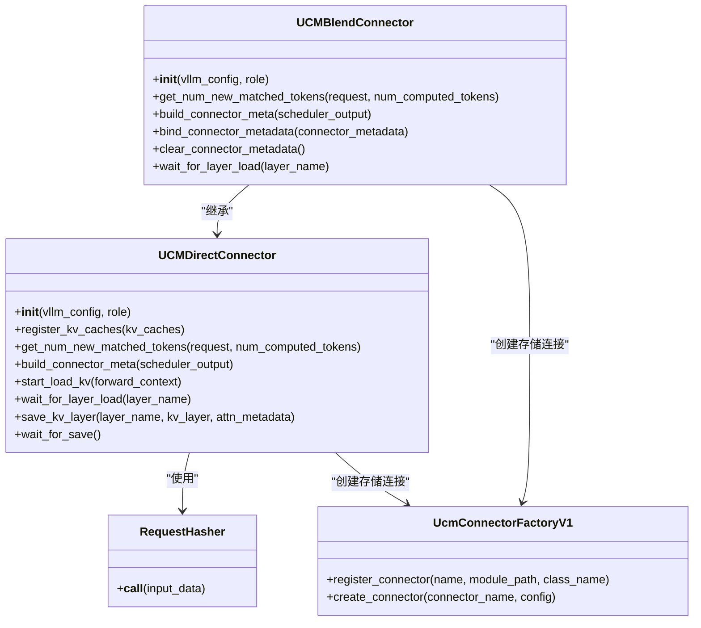

# vLLM集成API

<cite>
**本文档引用的文件**
- [ucm_connector.py](file://ucm/integration/vllm/ucm_connector.py)
- [blend_connector.py](file://ucm/integration/vllm/blend_connector.py)
- [apply_patch.py](file://ucm/integration/vllm/patch/apply_patch.py)
- [v092/vllm_patch.py](file://ucm/integration/vllm/patch/patch_funcs/v092/vllm_patch.py)
- [v092/vllm_rerope_patch.py](file://ucm/integration/vllm/patch/patch_funcs/v092/vllm_rerope_patch.py)
- [v092/vllm_ascend_patch.py](file://ucm/integration/vllm/patch/patch_funcs/v092/vllm_ascend_patch.py)
- [ucm_config_example.yaml](file://examples/ucm_config_example.yaml)
- [quickstart_vllm.md](file://docs/source/getting-started/quickstart_vllm.md)
- [offline_inference_blend.py](file://examples/offline_inference_blend.py)
- [factory_v1.py](file://ucm/store/factory_v1.py)
</cite>

## 目录
1. [简介](#简介)
2. [项目结构](#项目结构)
3. [核心组件](#核心组件)
4. [架构概览](#架构概览)
5. [详细组件分析](#详细组件分析)
6. [依赖关系分析](#依赖关系分析)
7. [性能考虑](#性能考虑)
8. [故障排除指南](#故障排除指南)
9. [结论](#结论)
10. [附录](#附录)

## 简介
本文件为UCM（Unified Cache Management）与vLLM的集成接口提供完整的API文档。重点涵盖以下方面：
- UCMDirectConnector连接器的核心接口：连接建立、配置管理、数据交换方法
- UCMBlendConnector缓存融合连接器的API接口与使用模式
- vLLM版本适配补丁的应用接口说明
- 连接器初始化、参数配置、性能监控与错误处理的完整API参考
- 具体的集成示例与最佳实践
- 不同vLLM版本的兼容性接口差异

## 项目结构
UCM与vLLM的集成主要位于ucm/integration/vllm目录下，包含连接器实现、补丁应用模块以及示例配置文件。



**图表来源**
- [ucm_connector.py](file://ucm/integration/vllm/ucm_connector.py#L82-L166)
- [blend_connector.py](file://ucm/integration/vllm/blend_connector.py#L121-L147)
- [apply_patch.py](file://ucm/integration/vllm/patch/apply_patch.py#L84-L118)
- [factory_v1.py](file://ucm/store/factory_v1.py#L34-L65)

**章节来源**
- [ucm_connector.py](file://ucm/integration/vllm/ucm_connector.py#L1-L1080)
- [blend_connector.py](file://ucm/integration/vllm/blend_connector.py#L1-L499)
- [apply_patch.py](file://ucm/integration/vllm/patch/apply_patch.py#L1-L192)

## 核心组件
本节概述UCM与vLLM集成的关键组件及其职责。

- UCMDirectConnector：直接KV缓存连接器，负责与存储后端进行数据加载与保存操作，支持层间重叠与非重叠两种模式。
- UCMBlendConnector：缓存融合连接器，基于块级哈希与前缀缓存实现混合缓存策略，支持块级增量融合以提升TTFT性能。
- 补丁应用模块：自动检测并应用vLLM版本特定的补丁，确保UCM功能在不同vLLM版本中的兼容性。
- 存储后端工厂：统一管理存储后端的注册与创建，支持多种存储后端如NFS、管道存储等。

**章节来源**
- [ucm_connector.py](file://ucm/integration/vllm/ucm_connector.py#L82-L166)
- [blend_connector.py](file://ucm/integration/vllm/blend_connector.py#L121-L147)
- [apply_patch.py](file://ucm/integration/vllm/patch/apply_patch.py#L84-L118)
- [factory_v1.py](file://ucm/store/factory_v1.py#L34-L65)

## 架构概览
UCM与vLLM的集成通过KV传输接口实现，连接器在推理过程中负责：
- 块哈希生成与请求元数据管理
- KV缓存的加载与保存
- 层间重叠执行优化
- 混合缓存策略的实施



**图表来源**
- [ucm_connector.py](file://ucm/integration/vllm/ucm_connector.py#L293-L348)
- [ucm_connector.py](file://ucm/integration/vllm/ucm_connector.py#L488-L562)
- [ucm_connector.py](file://ucm/integration/vllm/ucm_connector.py#L566-L644)

## 详细组件分析

### UCMDirectConnector连接器API

#### 初始化与配置
- 构造函数参数
  - vllm_config: vLLM配置对象
  - role: 连接器角色（调度器或工作节点）
- 关键配置项
  - engine_id: 引擎唯一标识
  - ucm_connectors: 存储后端配置列表
  - metrics_config_path: 指标配置路径
  - block_size: 块大小设置
  - tensor_parallel_size: 张量并行大小

#### 核心接口方法
- register_kv_caches(kv_caches): 注册KV缓存张量，初始化基地址指针
- get_num_new_matched_tokens(request, num_computed_tokens): 计算新匹配令牌数量
- build_connector_meta(scheduler_output): 构建连接器元数据
- start_load_kv(forward_context): 开始异步加载KV缓存
- wait_for_layer_load(layer_name): 等待指定层的加载完成
- save_kv_layer(layer_name, kv_layer, attn_metadata): 保存指定层的KV缓存
- wait_for_save(): 等待所有保存任务完成

#### 数据交换流程


**图表来源**
- [ucm_connector.py](file://ucm/integration/vllm/ucm_connector.py#L167-L185)
- [ucm_connector.py](file://ucm/integration/vllm/ucm_connector.py#L397-L447)
- [ucm_connector.py](file://ucm/integration/vllm/ucm_connector.py#L488-L562)

**章节来源**
- [ucm_connector.py](file://ucm/integration/vllm/ucm_connector.py#L82-L166)
- [ucm_connector.py](file://ucm/integration/vllm/ucm_connector.py#L230-L292)
- [ucm_connector.py](file://ucm/integration/vllm/ucm_connector.py#L293-L348)
- [ucm_connector.py](file://ucm/integration/vllm/ucm_connector.py#L397-L447)
- [ucm_connector.py](file://ucm/integration/vllm/ucm_connector.py#L488-L562)
- [ucm_connector.py](file://ucm/integration/vllm/ucm_connector.py#L566-L644)

### UCMBlendConnector缓存融合连接器API

#### 初始化与配置
- 支持的融合模式：前缀缓存构建、块缓存构建、缓存融合
- 配置参数：chunk_end_token_id（块结束标记）、min_blend_threshold（最小融合阈值）
- 启用条件：ucm_sparse_config中包含"Blend"配置

#### 核心接口方法
- get_num_new_matched_tokens(request, num_computed_tokens): 计算新匹配令牌数量（HBM不支持）
- build_connector_meta(scheduler_output): 构建融合连接器元数据
- bind_connector_metadata(connector_metadata): 绑定后处理元数据
- clear_connector_metadata(): 清理后处理元数据
- wait_for_layer_load(layer_name): 等待层加载并执行Delta RoPE后处理

#### 缓存融合算法


**图表来源**
- [blend_connector.py](file://ucm/integration/vllm/blend_connector.py#L148-L221)
- [blend_connector.py](file://ucm/integration/vllm/blend_connector.py#L261-L324)
- [blend_connector.py](file://ucm/integration/vllm/blend_connector.py#L411-L467)

**章节来源**
- [blend_connector.py](file://ucm/integration/vllm/blend_connector.py#L121-L147)
- [blend_connector.py](file://ucm/integration/vllm/blend_connector.py#L344-L404)
- [blend_connector.py](file://ucm/integration/vllm/blend_connector.py#L411-L467)
- [blend_connector.py](file://ucm/integration/vllm/blend_connector.py#L468-L499)

### vLLM版本适配补丁API

#### 自动补丁应用
- 版本检测：自动检测vLLM版本并选择对应补丁
- 补丁类型：
  - vllm-adapt.patch：完整UCM集成补丁
  - vllm-adapt-sparse.patch：稀疏注意力补丁
  - vllm-adapt-rerope.patch：ReRoPE支持补丁
  - vllm-ascend-adapt.patch：Ascend平台补丁

#### 补丁应用流程


**图表来源**
- [apply_patch.py](file://ucm/integration/vllm/patch/apply_patch.py#L59-L82)
- [apply_patch.py](file://ucm/integration/vllm/patch/apply_patch.py#L84-L118)
- [apply_patch.py](file://ucm/integration/vllm/patch/apply_patch.py#L139-L192)

**章节来源**
- [apply_patch.py](file://ucm/integration/vllm/patch/apply_patch.py#L24-L118)
- [v092/vllm_patch.py](file://ucm/integration/vllm/patch/patch_funcs/v092/vllm_patch.py#L39-L61)
- [v092/vllm_rerope_patch.py](file://ucm/integration/vllm/patch/patch_funcs/v092/vllm_rerope_patch.py#L36-L50)
- [v092/vllm_ascend_patch.py](file://ucm/integration/vllm/patch/patch_funcs/v092/vllm_ascend_patch.py#L40-L55)

## 依赖关系分析



**图表来源**
- [ucm_connector.py](file://ucm/integration/vllm/ucm_connector.py#L65-L80)
- [ucm_connector.py](file://ucm/integration/vllm/ucm_connector.py#L82-L166)
- [blend_connector.py](file://ucm/integration/vllm/blend_connector.py#L121-L147)
- [factory_v1.py](file://ucm/store/factory_v1.py#L34-L65)

**章节来源**
- [ucm_connector.py](file://ucm/integration/vllm/ucm_connector.py#L65-L80)
- [blend_connector.py](file://ucm/integration/vllm/blend_connector.py#L121-L147)
- [factory_v1.py](file://ucm/store/factory_v1.py#L34-L65)

## 性能考虑
- 层间重叠执行：UCMLayerWiseConnector支持层间重叠加载与保存，提升整体吞吐量
- 异步I/O：连接器使用异步加载与保存机制，减少CPU等待时间
- 指标监控：内置性能指标收集，包括加载/保存速度、命中率等
- 内存优化：支持共享缓冲区与设备特定优化

## 故障排除指南
- 连接器初始化失败：检查ucm_connectors配置是否正确
- 加载错误处理：get_block_ids_with_load_errors()返回失败的块ID集合
- 版本兼容性：确保应用了正确的vLLM补丁版本
- 性能问题：检查指标配置与存储后端性能

**章节来源**
- [ucm_connector.py](file://ucm/integration/vllm/ucm_connector.py#L645-L659)
- [apply_patch.py](file://ucm/integration/vllm/patch/apply_patch.py#L95-L118)

## 结论
UCM与vLLM的集成提供了完整的KV缓存管理解决方案，支持多种存储后端与缓存策略。通过自动补丁应用与灵活的配置选项，用户可以在不同vLLM版本中获得一致的UCM功能体验。连接器的异步I/O与层间重叠执行机制显著提升了推理性能，配合完善的指标监控系统，便于用户进行性能调优与问题诊断。

## 附录

### 集成示例

#### 基础集成示例
```python
# 使用UCMConnector进行基础集成
ktc = KVTransferConfig(
    kv_connector="UCMConnector",
    kv_connector_module_path="ucm.integration.vllm.ucm_connector",
    kv_role="kv_both",
    kv_connector_extra_config={
        "UCM_CONFIG_FILE": "/path/to/config.yaml"
    },
)
```

#### 缓存融合示例
```python
# 使用UCMBlendConnector进行缓存融合
ktc = KVTransferConfig(
    kv_connector="UCMBlendConnector",
    kv_connector_module_path="ucm.integration.vllm.blend_connector",
    kv_role="kv_both",
    kv_connector_extra_config={
        "ucm_connectors": [...],
        "ucm_sparse_config": {
            "Blend": {
                "chunk_end_token_id": 151643,
                "compute_meta": {...}
            }
        }
    }
)
```

#### 配置文件示例
```yaml
ucm_connectors:
  - ucm_connector_name: "UcmNfsStore"
    ucm_connector_config:
      storage_backends: "/mnt/test"
      io_direct: false

# 启用指标监控
metrics_config_path: "/path/to/metrics.yaml"

# 稀疏注意力配置
ucm_sparse_config:
  Blend:
    chunk_end_token_id: 151643
```

**章节来源**
- [quickstart_vllm.md](file://docs/source/getting-started/quickstart_vllm.md#L154-L237)
- [offline_inference_blend.py](file://examples/offline_inference_blend.py#L88-L135)
- [ucm_config_example.yaml](file://examples/ucm_config_example.yaml#L1-L39)

### 最佳实践
- 在生产环境中启用前缀缓存以获得最佳性能
- 根据硬件平台选择合适的存储后端
- 定期监控指标以识别性能瓶颈
- 在升级vLLM版本时及时应用相应补丁
- 对于长序列推理，考虑使用缓存融合策略