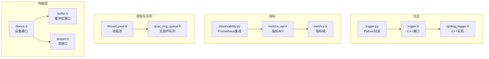
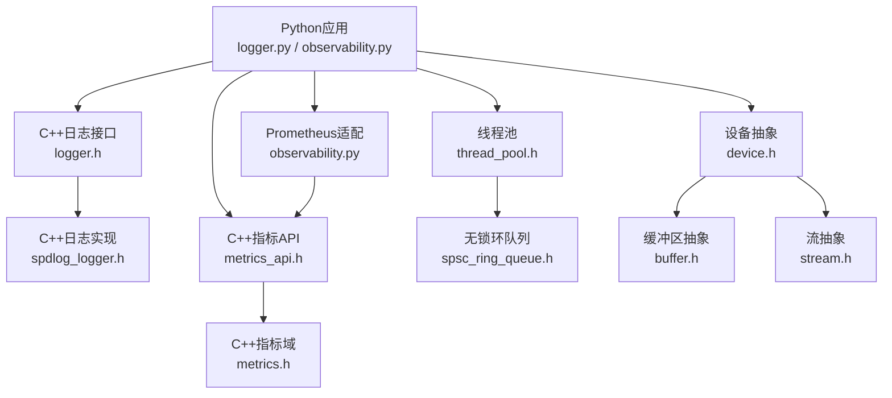
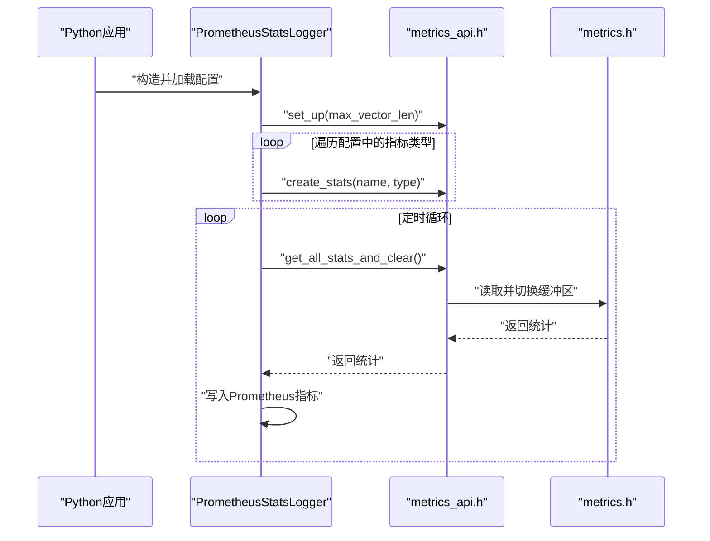
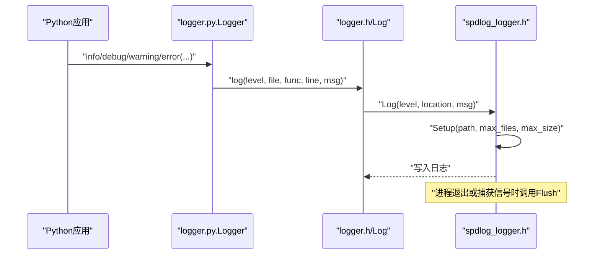
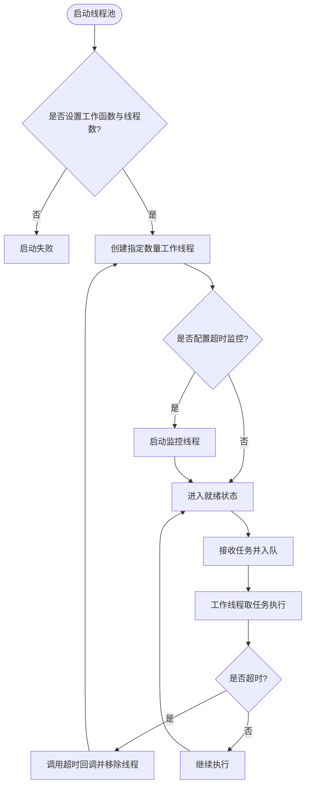
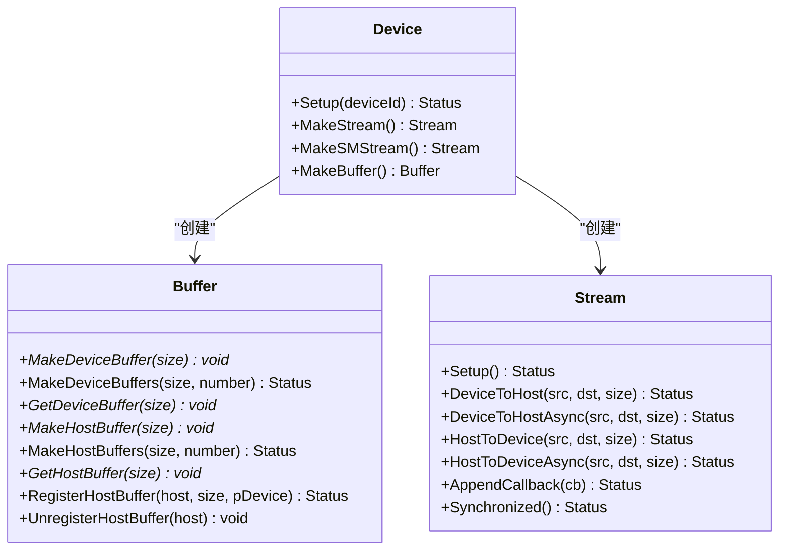
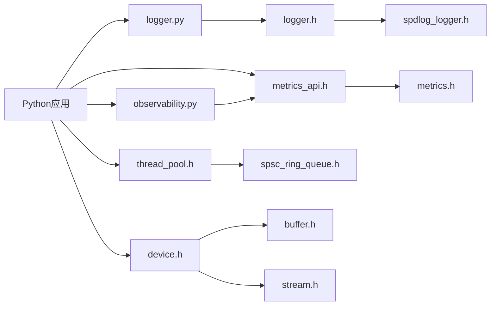

# 基础设施API

<cite>
**本文引用的文件**
- [logger.h](file://ucm/shared/infra/logger/logger.h)
- [spdlog_logger.h](file://ucm/shared/infra/logger/cc/spdlog_logger.h)
- [logger.py](file://ucm/logger.py)
- [metrics_api.h](file://ucm/shared/metrics/cc/api/metrics_api.h)
- [metrics.h](file://ucm/shared/metrics/cc/domain/metrics.h)
- [monitor_stats_example.py](file://ucm/shared/test/example/metrics/monitor_stats_example.py)
- [thread_pool.h](file://ucm/shared/infra/thread/thread_pool.h)
- [spsc_ring_queue.h](file://ucm/shared/infra/template/spsc_ring_queue.h)
- [buffer.h](file://ucm/shared/trans/buffer.h)
- [device.h](file://ucm/shared/trans/device.h)
- [stream.h](file://ucm/shared/trans/stream.h)
- [trans_on_cuda_example.py](file://ucm/shared/test/example/trans/trans_on_cuda_example.py)
- [observability.py](file://ucm/observability.py)
- [utils.py](file://ucm/utils.py)
</cite>

## 目录
1. [简介](#简介)
2. [项目结构](#项目结构)
3. [核心组件](#核心组件)
4. [架构总览](#架构总览)
5. [详细组件分析](#详细组件分析)
6. [依赖关系分析](#依赖关系分析)
7. [性能考虑](#性能考虑)
8. [故障排查指南](#故障排查指南)
9. [结论](#结论)
10. [附录](#附录)

## 简介
本文件为UCM（Unified Cache Management）基础设施组件的完整API参考文档，覆盖以下方面：
- 指标系统：注册、更新与查询接口，以及与Prometheus的集成方式
- 日志系统：日志级别映射、输出配置、异步刷新与信号处理
- 线程池管理：任务提交、线程调度、超时监控与资源回收
- 传输层抽象：设备接口（CUDA、Ascend等）的统一抽象与流操作
- 双语言使用示例：Python与C++侧的典型用法
- 配置参数与性能调优：关键参数说明与优化建议

## 项目结构
基础设施相关代码主要位于以下路径：
- 日志：C++头文件与实现、Python封装
- 指标：C++指标域与API、Python观测与导出
- 线程与队列：通用线程池与无锁环形队列
- 传输层：设备、缓冲区、流的抽象接口及CUDA/Ascend实现

**图表来源**
- [logger.h](file://ucm/shared/infra/logger/logger.h#L28-L50)
- [spdlog_logger.h](file://ucm/shared/infra/logger/cc/spdlog_logger.h#L38-L77)
- [logger.py](file://ucm/logger.py#L40-L76)
- [metrics_api.h](file://ucm/shared/metrics/cc/api/metrics_api.h#L28-L42)
- [metrics.h](file://ucm/shared/metrics/cc/domain/metrics.h#L72-L117)
- [observability.py](file://ucm/observability.py#L40-L197)
- [thread_pool.h](file://ucm/shared/infra/thread/thread_pool.h#L41-L223)
- [spsc_ring_queue.h](file://ucm/shared/infra/template/spsc_ring_queue.h#L36-L117)
- [device.h](file://ucm/shared/trans/device.h#L32-L38)
- [buffer.h](file://ucm/shared/trans/buffer.h#L32-L46)
- [stream.h](file://ucm/shared/trans/stream.h#L32-L53)

**章节来源**
- [logger.h](file://ucm/shared/infra/logger/logger.h#L28-L50)
- [metrics_api.h](file://ucm/shared/metrics/cc/api/metrics_api.h#L28-L42)
- [thread_pool.h](file://ucm/shared/infra/thread/thread_pool.h#L41-L223)
- [device.h](file://ucm/shared/trans/device.h#L32-L38)

## 核心组件
- 指标系统API：提供初始化、指标注册、批量更新、读取并清空统计的能力
- 日志系统API：提供Setup/Flush与宏级别的日志接口，并在信号发生时自动刷新
- 线程池管理API：支持工作函数注入、超时回调、动态扩容与优雅退出
- 传输层抽象：统一的设备、缓冲区与流接口，屏蔽CUDA/Ascend差异

**章节来源**
- [metrics_api.h](file://ucm/shared/metrics/cc/api/metrics_api.h#L30-L40)
- [logger.h](file://ucm/shared/infra/logger/logger.h#L30-L41)
- [thread_pool.h](file://ucm/shared/infra/thread/thread_pool.h#L80-L132)
- [device.h](file://ucm/shared/trans/device.h#L34-L37)

## 架构总览
下图展示基础设施各模块之间的交互关系与职责划分。

**图表来源**
- [logger.py](file://ucm/logger.py#L40-L76)
- [logger.h](file://ucm/shared/infra/logger/logger.h#L28-L50)
- [spdlog_logger.h](file://ucm/shared/infra/logger/cc/spdlog_logger.h#L38-L77)
- [metrics_api.h](file://ucm/shared/metrics/cc/api/metrics_api.h#L28-L42)
- [metrics.h](file://ucm/shared/metrics/cc/domain/metrics.h#L72-L117)
- [observability.py](file://ucm/observability.py#L40-L197)
- [thread_pool.h](file://ucm/shared/infra/thread/thread_pool.h#L41-L223)
- [spsc_ring_queue.h](file://ucm/shared/infra/template/spsc_ring_queue.h#L36-L117)
- [device.h](file://ucm/shared/trans/device.h#L32-L38)
- [buffer.h](file://ucm/shared/trans/buffer.h#L32-L46)
- [stream.h](file://ucm/shared/trans/stream.h#L32-L53)

## 详细组件分析

### 指标系统API
- 初始化与注册
  - 初始化：设置直方图最大长度上限，避免内存膨胀
  - 注册：按名称与类型创建指标（计数器、仪表盘、直方图）
- 更新与查询
  - 单值更新：按名称与数值更新
  - 批量更新：一次提交多个指标键值对
  - 查询并清空：返回当前所有统计并清空缓存，便于周期性导出
- Python侧集成
  - PrometheusStatsLogger：从YAML加载指标配置，注册Prometheus指标，并定期从指标域拉取数据写入

**图表来源**
- [metrics_api.h](file://ucm/shared/metrics/cc/api/metrics_api.h#L30-L40)
- [metrics.h](file://ucm/shared/metrics/cc/domain/metrics.h#L99-L101)
- [observability.py](file://ucm/observability.py#L60-L197)

**章节来源**
- [metrics_api.h](file://ucm/shared/metrics/cc/api/metrics_api.h#L30-L40)
- [metrics.h](file://ucm/shared/metrics/cc/domain/metrics.h#L72-L117)
- [monitor_stats_example.py](file://ucm/shared/test/example/metrics/monitor_stats_example.py#L42-L82)
- [observability.py](file://ucm/observability.py#L60-L197)

### 日志系统API
- C++接口
  - 日志函数：支持通过SourceLocation自动携带文件、函数、行号
  - Setup：配置日志目录、保留文件数量、单文件大小上限
  - Flush：主动刷新缓冲
  - 宏：DEBUG/INFO/WARN/ERROR级别日志宏
- Python封装
  - 将标准logging级别映射到内部Level枚举
  - 自动获取调用者信息并调用C++日志接口
  - atexit注册，确保进程退出前刷新日志
- 信号处理
  - 在SIGSEGV/SIGABRT/SIGFPE/SIGILL/SIGINT等信号触发时自动Flush

**图表来源**
- [logger.py](file://ucm/logger.py#L40-L76)
- [logger.h](file://ucm/shared/infra/logger/logger.h#L30-L41)
- [spdlog_logger.h](file://ucm/shared/infra/logger/cc/spdlog_logger.h#L38-L77)

**章节来源**
- [logger.h](file://ucm/shared/infra/logger/logger.h#L28-L50)
- [spdlog_logger.h](file://ucm/shared/infra/logger/cc/spdlog_logger.h#L38-L77)
- [logger.py](file://ucm/logger.py#L40-L76)

### 线程池管理API
- 关键能力
  - 设置工作函数、初始化函数、退出函数、超时回调
  - 设置工作线程数量、启动线程池
  - 任务推送：支持单任务与任务列表
  - 超时监控：可配置超时阈值与检查间隔，自动移除卡死线程并重建
  - 优雅关闭：析构时通知停止并等待线程退出
- 数据结构
  - Worker：线程ID、停止令牌、当前任务指针、最后任务时间点
  - 任务队列：条件变量+互斥保护的双端队列
  - 监控线程：周期性扫描超时任务并自愈

**图表来源**
- [thread_pool.h](file://ucm/shared/infra/thread/thread_pool.h#L80-L207)

**章节来源**
- [thread_pool.h](file://ucm/shared/infra/thread/thread_pool.h#L41-L223)

### 传输层抽象（设备接口）
- 设备Device
  - Setup：初始化指定设备ID
  - MakeStream/MakeSMStream：创建普通流与SM专用流
  - MakeBuffer：创建缓冲区对象
- 缓冲区Buffer
  - 设备/主机侧缓冲区的创建与注册接口
- 流Stream
  - 同步/异步的主机与设备间数据搬运
  - 批量散射/汇聚与多指针搬运
  - 回调与同步原语

**图表来源**
- [device.h](file://ucm/shared/trans/device.h#L32-L38)
- [buffer.h](file://ucm/shared/trans/buffer.h#L32-L46)
- [stream.h](file://ucm/shared/trans/stream.h#L32-L53)

**章节来源**
- [device.h](file://ucm/shared/trans/device.h#L32-L38)
- [buffer.h](file://ucm/shared/trans/buffer.h#L32-L46)
- [stream.h](file://ucm/shared/trans/stream.h#L32-L53)

### Python与C++双语言使用示例

- 指标系统（Python）
  - 初始化直方图上限
  - 注册计数器/仪表盘/直方图
  - 更新单值与批量值
  - 获取并清空统计
  - 示例路径：[monitor_stats_example.py](file://ucm/shared/test/example/metrics/monitor_stats_example.py#L42-L82)

- 传输层（CUDA，Python）
  - 创建设备与流
  - 主机到设备散射/批量搬运
  - 设备到主机汇聚/批量搬运
  - 异步搬运与同步
  - 示例路径：[trans_on_cuda_example.py](file://ucm/shared/test/example/trans/trans_on_cuda_example.py#L85-L261)

- 日志系统（Python）
  - 使用标准logging级别映射到内部日志级别
  - 自动获取调用者信息并输出
  - 示例路径：[logger.py](file://ucm/logger.py#L78-L83)

**章节来源**
- [monitor_stats_example.py](file://ucm/shared/test/example/metrics/monitor_stats_example.py#L42-L82)
- [trans_on_cuda_example.py](file://ucm/shared/test/example/trans/trans_on_cuda_example.py#L85-L261)
- [logger.py](file://ucm/logger.py#L78-L83)

## 依赖关系分析
- 日志
  - Python侧依赖C++日志接口；C++侧依赖spdlog实现
- 指标
  - Python侧通过PrometheusStatsLogger与C++指标API交互；指标域负责线程安全与缓冲切换
- 线程池
  - 与无锁环队列配合，支撑高并发任务分发
- 传输层
  - 设备/缓冲区/流形成统一抽象，上层无需感知底层硬件差异

**图表来源**
- [logger.py](file://ucm/logger.py#L30-L47)
- [logger.h](file://ucm/shared/infra/logger/logger.h#L27-L41)
- [spdlog_logger.h](file://ucm/shared/infra/logger/cc/spdlog_logger.h#L28-L61)
- [metrics_api.h](file://ucm/shared/metrics/cc/api/metrics_api.h#L26-L42)
- [metrics.h](file://ucm/shared/metrics/cc/domain/metrics.h#L72-L117)
- [observability.py](file://ucm/observability.py#L34-L96)
- [thread_pool.h](file://ucm/shared/infra/thread/thread_pool.h#L41-L223)
- [spsc_ring_queue.h](file://ucm/shared/infra/template/spsc_ring_queue.h#L36-L117)
- [device.h](file://ucm/shared/trans/device.h#L27-L38)
- [buffer.h](file://ucm/shared/trans/buffer.h#L27-L46)
- [stream.h](file://ucm/shared/trans/stream.h#L27-L53)

**章节来源**
- [logger.py](file://ucm/logger.py#L30-L47)
- [metrics_api.h](file://ucm/shared/metrics/cc/api/metrics_api.h#L26-L42)
- [thread_pool.h](file://ucm/shared/infra/thread/thread_pool.h#L41-L223)
- [device.h](file://ucm/shared/trans/device.h#L27-L38)

## 性能考虑
- 指标系统
  - 合理设置直方图最大长度，避免过大导致内存压力
  - 使用批量更新减少锁竞争与上下文切换
  - 定期清理统计，防止累积增长
- 日志系统
  - 控制单文件大小与保留数量，结合磁盘空间规划
  - 在高频日志场景中优先使用异步接口，必要时降低日志级别
- 线程池
  - 根据CPU核数与I/O特性设置线程数
  - 启用超时监控以避免长尾任务阻塞
  - 使用无锁环队列提升吞吐
- 传输层
  - 优先使用散射/汇聚与批量搬运，减少系统调用次数
  - 异步搬运后及时同步，避免数据竞争
  - 合理复用缓冲区与流，减少频繁分配释放

[本节为通用指导，不直接分析具体文件]

## 故障排查指南
- 指标未导出或为空
  - 检查是否已调用初始化并设置直方图上限
  - 确认指标类型与名称一致，且已注册
  - 核对周期性拉取逻辑是否正常运行
  - 参考：[metrics_api.h](file://ucm/shared/metrics/cc/api/metrics_api.h#L30-L40)，[metrics.h](file://ucm/shared/metrics/cc/domain/metrics.h#L99-L101)，[observability.py](file://ucm/observability.py#L177-L186)
- 日志不输出或丢失
  - 确认Setup参数（目录、文件数、大小）合理
  - 进程异常退出时检查信号处理是否触发Flush
  - 参考：[logger.h](file://ucm/shared/infra/logger/logger.h#L40-L41)，[spdlog_logger.h](file://ucm/shared/infra/logger/cc/spdlog_logger.h#L49-L57)
- 线程池卡死或吞吐下降
  - 检查超时阈值与检查间隔设置
  - 查看是否有长时间阻塞任务
  - 参考：[thread_pool.h](file://ucm/shared/infra/thread/thread_pool.h#L179-L207)
- 传输层性能异常
  - 对比同步/异步接口，确认是否正确调用Synchronized
  - 检查散射/汇聚与批量搬运参数是否匹配
  - 参考：[stream.h](file://ucm/shared/trans/stream.h#L37-L52)，[trans_on_cuda_example.py](file://ucm/shared/test/example/trans/trans_on_cuda_example.py#L120-L152)

**章节来源**
- [metrics_api.h](file://ucm/shared/metrics/cc/api/metrics_api.h#L30-L40)
- [metrics.h](file://ucm/shared/metrics/cc/domain/metrics.h#L99-L101)
- [observability.py](file://ucm/observability.py#L177-L186)
- [logger.h](file://ucm/shared/infra/logger/logger.h#L40-L41)
- [spdlog_logger.h](file://ucm/shared/infra/logger/cc/spdlog_logger.h#L49-L57)
- [thread_pool.h](file://ucm/shared/infra/thread/thread_pool.h#L179-L207)
- [stream.h](file://ucm/shared/trans/stream.h#L37-L52)
- [trans_on_cuda_example.py](file://ucm/shared/test/example/trans/trans_on_cuda_example.py#L120-L152)

## 结论
本文档梳理了UCM基础设施的关键API与使用方式，涵盖指标、日志、线程池与传输层抽象，并提供了Python与C++双语言示例与性能调优建议。建议在生产环境中：
- 明确配置参数边界（如直方图长度、日志大小、线程数）
- 建立周期性导出与健康检查机制
- 在高并发场景下优先采用异步与批处理策略

[本节为总结性内容，不直接分析具体文件]

## 附录

### 配置参数与调优要点
- 指标系统
  - 直方图最大长度：控制内存占用与导出性能
  - 导出周期：平衡实时性与开销
  - 参考：[observability.py](file://ucm/observability.py#L67-L71)，[metrics_api.h](file://ucm/shared/metrics/cc/api/metrics_api.h#L30-L30)
- 日志系统
  - 日志目录、保留文件数、单文件大小（MB）
  - 参考：[logger.py](file://ucm/logger.py#L43-L46)，[spdlog_logger.h](file://ucm/shared/infra/logger/cc/spdlog_logger.h#L71-L73)
- 线程池
  - 工作线程数、超时阈值（ms）、检查间隔（ms）
  - 参考：[thread_pool.h](file://ucm/shared/infra/thread/thread_pool.h#L103-L102)
- 传输层
  - 批次大小与数据类型，异步搬运后务必Synchronized
  - 参考：[stream.h](file://ucm/shared/trans/stream.h#L37-L52)，[trans_on_cuda_example.py](file://ucm/shared/test/example/trans/trans_on_cuda_example.py#L120-L133)

**章节来源**
- [observability.py](file://ucm/observability.py#L67-L71)
- [logger.py](file://ucm/logger.py#L43-L46)
- [spdlog_logger.h](file://ucm/shared/infra/logger/cc/spdlog_logger.h#L71-L73)
- [thread_pool.h](file://ucm/shared/infra/thread/thread_pool.h#L95-L102)
- [stream.h](file://ucm/shared/trans/stream.h#L37-L52)
- [trans_on_cuda_example.py](file://ucm/shared/test/example/trans/trans_on_cuda_example.py#L120-L133)