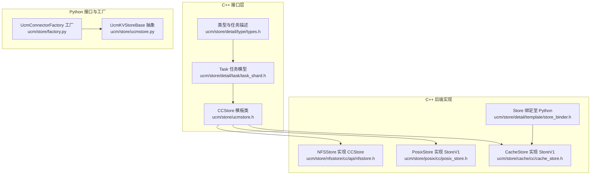
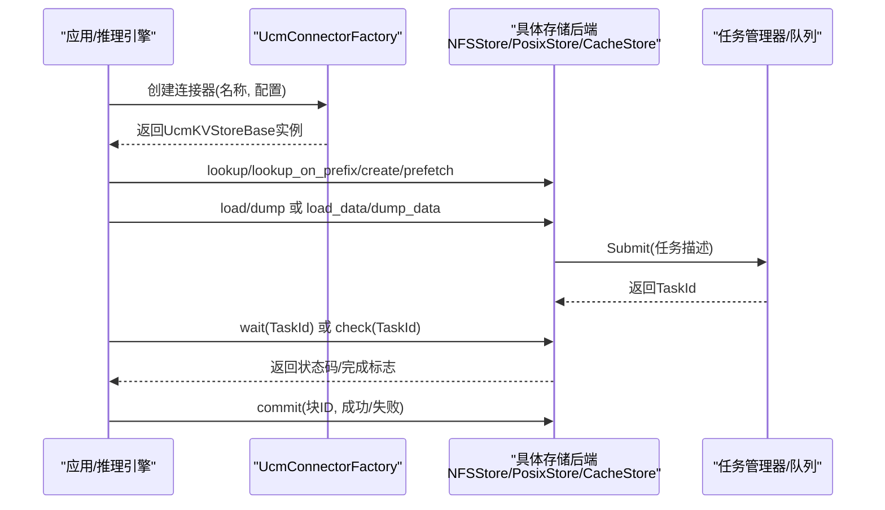
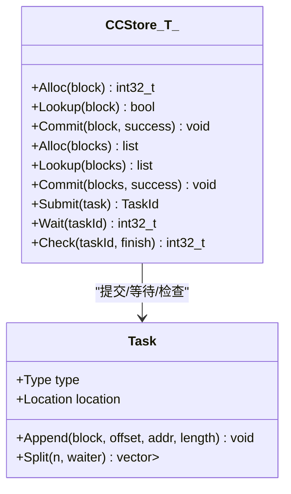
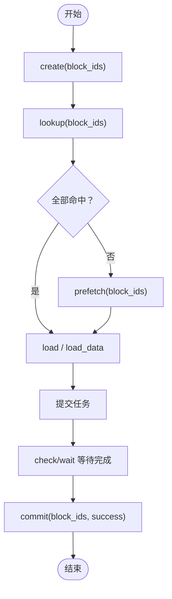
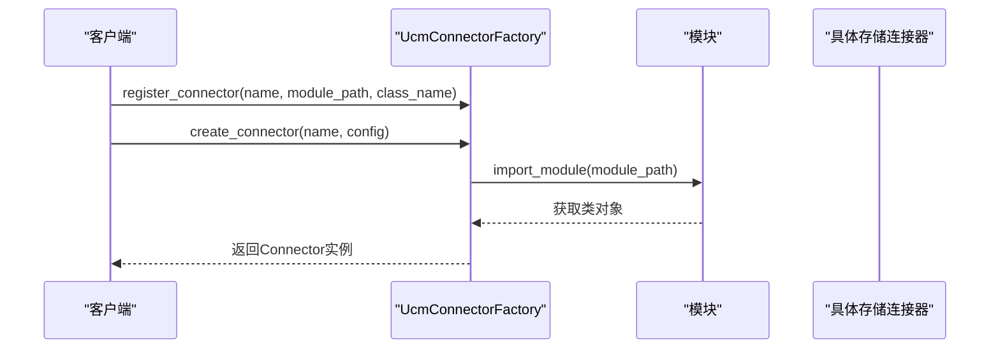
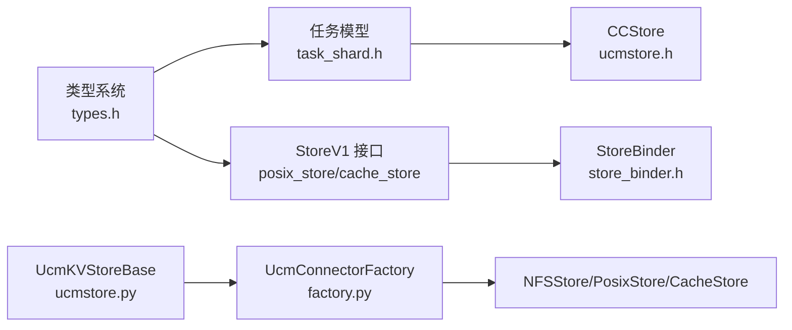

# 存储接口API

<cite>
**本文引用的文件**
- [ucm/store/ucmstore.h](file://ucm/store/ucmstore.h)
- [ucm/store/ucmstore.py](file://ucm/store/ucmstore.py)
- [ucm/store/detail/task/task_shard.h](file://ucm/store/detail/task/task_shard.h)
- [ucm/store/detail/type/types.h](file://ucm/store/detail/type/types.h)
- [ucm/store/factory.py](file://ucm/store/factory.py)
- [ucm/store/nfsstore/cc/api/nfsstore.h](file://ucm/store/nfsstore/cc/api/nfsstore.h)
- [ucm/store/posix/cc/posix_store.h](file://ucm/store/posix/cc/posix_store.h)
- [ucm/store/cache/cc/cache_store.h](file://ucm/store/cache/cc/cache_store.h)
- [ucm/store/detail/template/store_binder.h](file://ucm/store/detail/template/store_binder.h)
- [ucm/store/test/e2e/posixstore_embed.py](file://ucm/store/test/e2e/posixstore_embed.py)
- [ucm/store/test/e2e/nfsstore_fetch.py](file://ucm/store/test/e2e/nfsstore_fetch.py)
- [ucm/store/test/e2e/pcstore_fetch.py](file://ucm/store/test/e2e/pcstore_fetch.py)
</cite>

## 目录
1. [简介](#简介)
2. [项目结构](#项目结构)
3. [核心组件](#核心组件)
4. [架构总览](#架构总览)
5. [详细组件分析](#详细组件分析)
6. [依赖关系分析](#依赖关系分析)
7. [性能与并发特性](#性能与并发特性)
8. [故障排查指南](#故障排查指南)
9. [结论](#结论)
10. [附录：示例与最佳实践](#附录示例与最佳实践)

## 简介
本文件面向UCM（统一KV缓存）存储接口的使用者与维护者，系统化梳理CCStore模板类与UcmKVStoreBase抽象接口的职责边界、方法语义、参数与返回值约定，并结合工厂模式的注册与创建流程，给出KV缓存读写（创建、查找、预取、加载、转储）与任务管理（提交、等待、检查）的完整API说明。同时提供C++与Python双栈用法指引、线程安全与性能考量、常见错误与异常处理建议。

## 项目结构
围绕存储接口的关键目录与文件如下：
- C++接口与实现
  - ucm/store/ucmstore.h：定义CCStore模板类（KV块级分配、查找、提交与批量操作；任务提交、等待、检查）
  - ucm/store/detail/task/task_shard.h：定义Task及其分片结构，用于描述加载/转储任务
  - ucm/store/detail/type/types.h：定义BlockId、TaskHandle等类型别名与任务描述结构
  - ucm/store/nfsstore/cc/api/nfsstore.h：NFS后端对CCStore的实现示例
  - ucm/store/posix/cc/posix_store.h：POSIX后端对StoreV1的实现示例
  - ucm/store/cache/cc/cache_store.h：缓存后端StoreV1实现示例
  - ucm/store/detail/template/store_binder.h：StoreV1到Python的绑定封装
- Python接口与工厂
  - ucm/store/ucmstore.py：UcmKVStoreBase抽象接口（KV缓存读写与任务管理）
  - ucm/store/factory.py：UcmConnectorFactory工厂（按名称动态注册与创建存储连接器）

图表来源
- [ucm/store/ucmstore.h](file://ucm/store/ucmstore.h#L31-L47)
- [ucm/store/detail/task/task_shard.h](file://ucm/store/detail/task/task_shard.h#L40-L144)
- [ucm/store/detail/type/types.h](file://ucm/store/detail/type/types.h#L31-L67)
- [ucm/store/nfsstore/cc/api/nfsstore.h](file://ucm/store/nfsstore/cc/api/nfsstore.h#L32-L97)
- [ucm/store/posix/cc/posix_store.h](file://ucm/store/posix/cc/posix_store.h#L32-L48)
- [ucm/store/cache/cc/cache_store.h](file://ucm/store/cache/cc/cache_store.h#L32-L48)
- [ucm/store/detail/template/store_binder.h](file://ucm/store/detail/template/store_binder.h#L34-L155)
- [ucm/store/ucmstore.py](file://ucm/store/ucmstore.py#L39-L205)
- [ucm/store/factory.py](file://ucm/store/factory.py#L34-L71)

章节来源
- [ucm/store/ucmstore.h](file://ucm/store/ucmstore.h#L31-L47)
- [ucm/store/ucmstore.py](file://ucm/store/ucmstore.py#L39-L205)
- [ucm/store/factory.py](file://ucm/store/factory.py#L34-L71)

## 核心组件
本节聚焦两类接口族：C++侧的CCStore模板类与C++/Python侧的UcmKVStoreBase抽象接口。

- CCStore<T> 模板类（C++）
  - 职责：KV缓存块级生命周期管理与异步任务调度
  - 关键方法
    - Alloc：单块或批量分配，返回状态码或分配结果列表
    - Lookup：单块或批量查找，返回命中布尔或命中列表
    - Commit：单块或批量提交，标记成功/失败以决定回收或释放
    - Submit/Wait/Check：提交任务、阻塞等待、非阻塞检查任务完成状态
  - 适用场景：直接面向块ID的KV缓存读写与任务编排

- UcmKVStoreBase 抽象接口（Python/C++桥接）
  - 职责：统一KV缓存读写与任务管理的高层API
  - 关键方法
    - cc_store：返回底层Store指针（C++侧）
    - create/lookup/prefetch/load/dump/load_data/dump_data：创建空间、查找命中、预取、加载/转储张量或数据缓冲区
    - wait/check/commit：等待任务完成、检查任务状态、提交块
  - 适用场景：通过工厂创建具体存储后端，面向上层推理系统的KV缓存流水线

章节来源
- [ucm/store/ucmstore.h](file://ucm/store/ucmstore.h#L36-L47)
- [ucm/store/ucmstore.py](file://ucm/store/ucmstore.py#L39-L205)

## 架构总览
下图展示了从应用到存储后端的调用路径与职责划分：

图表来源
- [ucm/store/factory.py](file://ucm/store/factory.py#L50-L57)
- [ucm/store/nfsstore/cc/api/nfsstore.h](file://ucm/store/nfsstore/cc/api/nfsstore.h#L69-L93)
- [ucm/store/posix/cc/posix_store.h](file://ucm/store/posix/cc/posix_store.h#L36-L44)
- [ucm/store/cache/cc/cache_store.h](file://ucm/store/cache/cc/cache_store.h#L36-L44)
- [ucm/store/ucmstore.py](file://ucm/store/ucmstore.py#L169-L204)

## 详细组件分析

### CCStore<T> 模板类（C++）
- 类型别名
  - BlockId：字符串形式的块标识
  - TaskId：大小整数的任务句柄
- 方法语义
  - Alloc：分配块空间，支持单个与批量两种签名
  - Lookup：查询块是否存在，支持单个与批量
  - Commit：提交块，根据success决定是否可复用或回收
  - Submit/Wait/Check：提交任务、阻塞等待、非阻塞检查
- 设计要点
  - 批量接口与单个接口成对出现，便于上层按需选择
  - 任务模型由Task类承载，包含分片、类型（加载/转储）、位置（主机/设备）等信息

图表来源
- [ucm/store/ucmstore.h](file://ucm/store/ucmstore.h#L31-L47)
- [ucm/store/detail/task/task_shard.h](file://ucm/store/detail/task/task_shard.h#L40-L144)

章节来源
- [ucm/store/ucmstore.h](file://ucm/store/ucmstore.h#L36-L47)
- [ucm/store/detail/task/task_shard.h](file://ucm/store/detail/task/task_shard.h#L40-L144)

### UcmKVStoreBase 抽象接口（Python/C++桥接）
- 方法族
  - 基础能力：cc_store、create、lookup、prefetch
  - 数据传输：load、dump（张量接口），load_data、dump_data（数据缓冲区接口）
  - 任务管理：wait、check、commit
- 参数与返回值约定
  - block_ids：块ID列表
  - offsets：张量切片偏移（多层时累加）
  - dst_tensor/src_tensor：目标/源设备张量地址
  - dst_addr/src_addr/size：目标/源缓冲区地址与尺寸
  - wait/check：返回状态码或(状态码, 完成标志)
  - commit：根据is_success决定回收策略

图表来源
- [ucm/store/ucmstore.py](file://ucm/store/ucmstore.py#L57-L204)

章节来源
- [ucm/store/ucmstore.py](file://ucm/store/ucmstore.py#L39-L205)

### 存储后端工厂模式
- 注册机制
  - UcmConnectorFactory.register_connector(name, module_path, class_name)：延迟导入模块并注册类
  - 支持的后端：NFSStore、UcmPcStore、UcmMooncakeStore
- 创建流程
  - create_connector(connector_name, config)：按名称查找注册项，实例化对应类并传入配置

图表来源
- [ucm/store/factory.py](file://ucm/store/factory.py#L38-L57)

章节来源
- [ucm/store/factory.py](file://ucm/store/factory.py#L34-L71)

### 具体后端实现（示例）
- NFSStore（CCStore实现）
  - 提供Setup(Config)初始化，转发Alloc/Lookup/Commit与任务管理到内部实现
- PosixStore/CacheStore（StoreV1实现）
  - 提供Setup、Readme、Lookup/LookupOnPrefix、Prefetch、Load/Dump、Check、Wait等
  - 通过StoreBinder将StoreV1暴露给Python

章节来源
- [ucm/store/nfsstore/cc/api/nfsstore.h](file://ucm/store/nfsstore/cc/api/nfsstore.h#L63-L97)
- [ucm/store/posix/cc/posix_store.h](file://ucm/store/posix/cc/posix_store.h#L32-L48)
- [ucm/store/cache/cc/cache_store.h](file://ucm/store/cache/cc/cache_store.h#L32-L48)
- [ucm/store/detail/template/store_binder.h](file://ucm/store/detail/template/store_binder.h#L68-L124)

## 依赖关系分析
- 接口耦合
  - CCStore<T> 依赖 Task 任务模型与任务分片
  - StoreV1（POSIX/Cache/NFS）依赖类型系统（BlockId、TaskHandle、TaskDesc/Shard）
  - UcmKVStoreBase 作为高层抽象，屏蔽不同后端差异
- 外部依赖
  - Python侧通过pybind11绑定StoreV1，提供数组视图与异常转换
  - 工厂通过importlib动态导入模块，避免静态耦合

图表来源
- [ucm/store/detail/type/types.h](file://ucm/store/detail/type/types.h#L31-L67)
- [ucm/store/detail/task/task_shard.h](file://ucm/store/detail/task/task_shard.h#L40-L144)
- [ucm/store/ucmstore.h](file://ucm/store/ucmstore.h#L31-L47)
- [ucm/store/posix/cc/posix_store.h](file://ucm/store/posix/cc/posix_store.h#L32-L48)
- [ucm/store/cache/cc/cache_store.h](file://ucm/store/cache/cc/cache_store.h#L32-L48)
- [ucm/store/detail/template/store_binder.h](file://ucm/store/detail/template/store_binder.h#L34-L155)
- [ucm/store/ucmstore.py](file://ucm/store/ucmstore.py#L39-L205)
- [ucm/store/factory.py](file://ucm/store/factory.py#L34-L71)

## 性能与并发特性
- 并发与批处理
  - 批量接口（Alloc/Lookup/Commit、Load/Dump）可减少上下文切换与系统调用开销
  - StoreV1的Prefetch与LookupOnPrefix支持前缀匹配与预取，提升命中率与吞吐
- 任务拆分与统计
  - Task::Split将任务分片并设置回调，便于并行执行与统计带宽
- I/O与内存对齐
  - 示例脚本中演示了对齐数组构造与设备缓冲区对齐，有助于提高DMA效率
- 线程安全
  - Task::Id与统计字段使用原子/时间戳，避免竞态
  - StoreBinder在Wait期间释放GIL，避免阻塞其他Python线程

章节来源
- [ucm/store/detail/task/task_shard.h](file://ucm/store/detail/task/task_shard.h#L95-L132)
- [ucm/store/detail/template/store_binder.h](file://ucm/store/detail/template/store_binder.h#L116-L124)
- [ucm/store/test/e2e/posixstore_embed.py](file://ucm/store/test/e2e/posixstore_embed.py#L53-L125)

## 故障排查指南
- 常见错误与处理
  - 参数维度不一致：MakeTaskDesc会校验ids/indexes/addrs维度，不一致时抛出无效参数异常
  - 任务未完成：check/wait返回非零状态码或finish=false，需重试或检查后端配置
  - 提交失败：commit传入is_success=false时，后端可能释放资源而非复用
  - 工厂未注册：create_connector找不到名称将抛出“不支持的连接器类型”
- 日志与可观测性
  - StoreBinder在失败时抛出运行时异常，可通过日志级别定位问题
  - PosixStore/CacheStore/PosixStore提供Readme与统计信息，便于诊断

章节来源
- [ucm/store/detail/template/store_binder.h](file://ucm/store/detail/template/store_binder.h#L140-L154)
- [ucm/store/factory.py](file://ucm/store/factory.py#L50-L57)

## 结论
CCStore<T>与UcmKVStoreBase分别面向底层块级KV缓存与高层推理系统，二者通过工厂模式与类型系统协同工作。通过批量接口、任务拆分与预取机制，可在多后端（NFS/POSIX/Cache）上获得稳定且高性能的KV缓存读写体验。建议在生产环境中结合日志与统计信息，持续优化I/O参数与任务粒度。

## 附录：示例与最佳实践

### C++ 使用要点（概念性说明）
- 分配与查找
  - 单块：Alloc/Lookup/Commit
  - 批量：Alloc/Lookup/Commit（列表版本）
- 任务管理
  - Submit提交任务，Wait阻塞等待，Check非阻塞轮询
- 注意事项
  - 成功路径调用Commit(success=true)，失败路径调用Commit(success=false)以便回收
  - 批量接口一次提交多个块，减少系统调用次数

章节来源
- [ucm/store/ucmstore.h](file://ucm/store/ucmstore.h#L36-L47)
- [ucm/store/detail/task/task_shard.h](file://ucm/store/detail/task/task_shard.h#L95-L113)

### Python 使用要点（基于示例脚本）
- 工厂创建
  - 通过UcmConnectorFactory按名称创建具体存储连接器（如NFS/PC/Mooncake）
- KV缓存读写
  - lookup/lookup_on_prefix：先查命中再决定是否需要dump
  - dump_data/load_data：将主机/设备缓冲区对齐后提交任务
  - wait：等待任务完成，返回状态码
  - commit：提交块，决定是否复用
- 最佳实践
  - 对齐缓冲区地址与长度，减少DMA失败
  - 批量提交，合并小任务，提升吞吐
  - 使用prefetch提前拉取热点块

章节来源
- [ucm/store/factory.py](file://ucm/store/factory.py#L50-L57)
- [ucm/store/test/e2e/posixstore_embed.py](file://ucm/store/test/e2e/posixstore_embed.py#L62-L125)
- [ucm/store/test/e2e/nfsstore_fetch.py](file://ucm/store/test/e2e/nfsstore_fetch.py#L73-L91)
- [ucm/store/test/e2e/pcstore_fetch.py](file://ucm/store/test/e2e/pcstore_fetch.py#L75-L93)