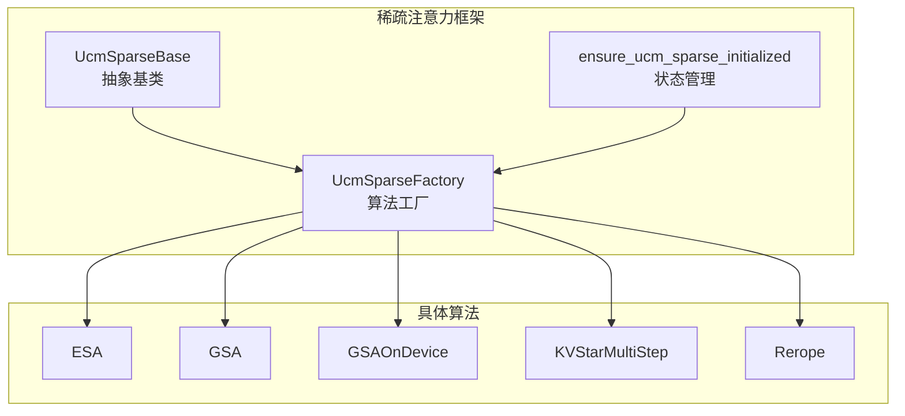
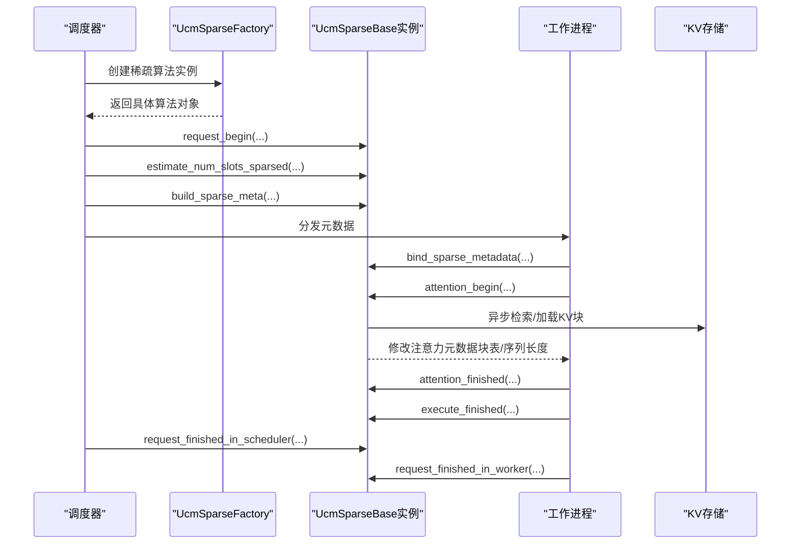
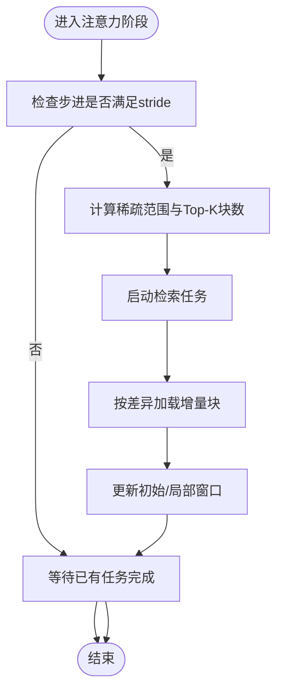
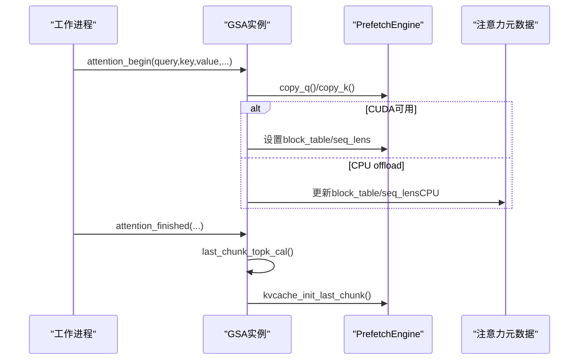
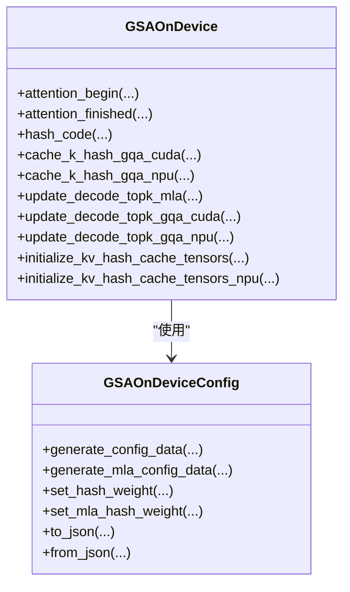
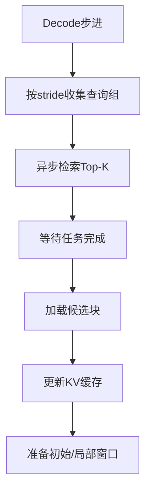
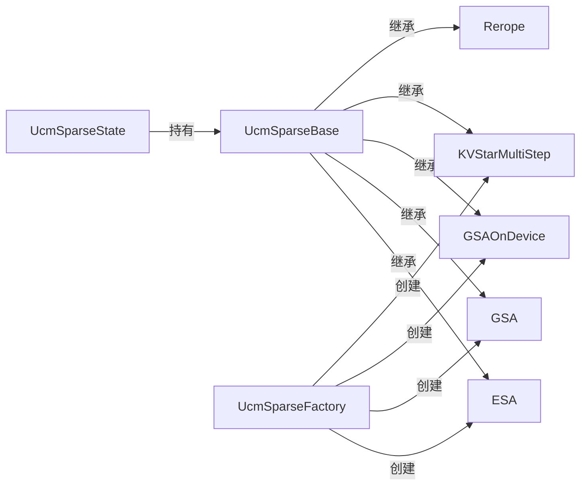

# 稀疏算法API

<cite>
**本文引用的文件**
- [ucm/sparse/base.py](file://ucm/sparse/base.py)
- [ucm/sparse/factory.py](file://ucm/sparse/factory.py)
- [ucm/sparse/state.py](file://ucm/sparse/state.py)
- [ucm/sparse/esa/esa.py](file://ucm/sparse/esa/esa.py)
- [ucm/sparse/gsa/gsa.py](file://ucm/sparse/gsa/gsa.py)
- [ucm/sparse/gsa_on_device/gsa_on_device.py](file://ucm/sparse/gsa_on_device/gsa_on_device.py)
- [ucm/sparse/gsa_on_device/gsa_on_device_config.py](file://ucm/sparse/gsa_on_device/gsa_on_device_config.py)
- [ucm/sparse/kvstar/multistep.py](file://ucm/sparse/kvstar/multistep.py)
- [ucm/sparse/rerope/rerope_utils.py](file://ucm/sparse/rerope/rerope_utils.py)
- [ucm/sparse/utils.py](file://ucm/sparse/utils.py)
- [ucm/integration/vllm/ucm_connector.py](file://ucm/integration/vllm/ucm_connector.py)
- [examples/offline_inference_esa.py](file://examples/offline_inference_esa.py)
- [examples/offline_inference_gsaondevice.py](file://examples/offline_inference_gsaondevice.py)
- [examples/ucm_config_example.yaml](file://examples/ucm_config_example.yaml)
- [docs/source/user-guide/sparse-attention/esa.md](file://docs/source/user-guide/sparse-attention/esa.md)
- [docs/source/user-guide/sparse-attention/gsa.md](file://docs/source/user-guide/sparse-attention/gsa.md)
</cite>

## 目录
1. [简介](#简介)
2. [项目结构](#项目结构)
3. [核心组件](#核心组件)
4. [架构总览](#架构总览)
5. [详细组件分析](#详细组件分析)
6. [依赖关系分析](#依赖关系分析)
7. [性能与适用性](#性能与适用性)
8. [故障排查指南](#故障排查指南)
9. [结论](#结论)
10. [附录](#附录)

## 简介
本文件为UCM稀疏注意力算法的完整API参考文档，覆盖稀疏算法基类接口、工厂注册机制、调度器与工作进程的生命周期钩子、以及ESA、GSA、GSA On Device、KVStar、Rerope等具体算法的初始化参数、配置选项、计算执行流程、输入输出格式、性能特征与适用场景，并提供算法切换与参数调优的使用示例、状态管理与结果获取方法，以及算法间的兼容性与组合使用建议。

## 项目结构
UCM稀疏注意力模块位于ucm/sparse目录下，采用“按功能域分层”的组织方式：
- 基类与工厂：定义通用接口与动态工厂注册
- 具体算法：ESA、GSA、GSAOnDevice、KVStar、Rerope
- 工具与配置：通用工具函数、GSA配置、Rerope补丁配置
- 集成桥接：vLLM集成与KV传输桥接

图表来源
- [ucm/sparse/base.py](file://ucm/sparse/base.py#L127-L323)
- [ucm/sparse/factory.py](file://ucm/sparse/factory.py#L13-L57)
- [ucm/sparse/state.py](file://ucm/sparse/state.py#L27-L76)

章节来源
- [ucm/sparse/base.py](file://ucm/sparse/base.py#L1-L323)
- [ucm/sparse/factory.py](file://ucm/sparse/factory.py#L1-L57)
- [ucm/sparse/state.py](file://ucm/sparse/state.py#L1-L110)

## 核心组件
- 抽象基类UcmSparseBase：定义稀疏注意力算法在调度器侧与工作进程侧的统一接口，包括请求生命周期钩子、注意力前后钩子、FFN前后钩子、层前后钩子、元数据构建与槽位分配等。
- 工厂UcmSparseFactory：通过名称注册与延迟加载机制创建具体算法实例；当前已注册ESA、GSAOnDevice、KVStarMultiStep、Blend。
- 状态管理ensure_ucm_sparse_initialized：全局单例代理模式，按角色（调度器/工作进程）初始化并持有当前启用的稀疏算法实例，提供可选调用封装。

关键接口概览（以路径标注代替代码片段）
- 调度器侧：request_begin、estimate_num_slots_sparsed、update_state_after_alloc、build_sparse_meta、allocate_slots
- 工作进程侧：execute_begin、execute_finished、attention_begin、attention_finished、ffn_begin、ffn_finished、layer_begin、layer_finished、request_finished_in_worker
- 元数据：UcmSparseMetadata及其派生类型（如ESASparseMetaData、GSAMetaData、KVStarMultiStepSparseMetaData）

章节来源
- [ucm/sparse/base.py](file://ucm/sparse/base.py#L127-L323)
- [ucm/sparse/factory.py](file://ucm/sparse/factory.py#L13-L57)
- [ucm/sparse/state.py](file://ucm/sparse/state.py#L27-L76)

## 架构总览
UCM稀疏注意力在vLLM运行时通过UCMConnector桥接到存储后端，稀疏算法在调度器侧估算块数、构建元数据，在工作进程侧绑定元数据、在注意力前/后钩子中执行异步检索与KV块加载/卸载、更新注意力元数据以实现零拷贝或近零拷贝的稀疏选择。

图表来源
- [ucm/sparse/factory.py](file://ucm/sparse/factory.py#L30-L44)
- [ucm/sparse/state.py](file://ucm/sparse/state.py#L27-L76)
- [ucm/sparse/base.py](file://ucm/sparse/base.py#L185-L237)
- [ucm/integration/vllm/ucm_connector.py](file://ucm/integration/vllm/ucm_connector.py#L61-L63)

## 详细组件分析

### 基类接口与扩展点（UcmSparseBase）
- 角色枚举：SCHEDULER、WORKER
- 工作进程侧钩子
  - execute_begin/execute_finished：模型执行前后
  - attention_begin/attention_finished：注意力计算前后，支持修改注意力元数据
  - ffn_begin/ffn_finished、layer_begin/layer_finished：FFN与层级前后
  - request_finished_in_worker：释放资源
- 调度器侧钩子
  - request_begin：请求开始
  - estimate_num_slots_sparsed：估算所需块数
  - update_state_after_alloc：分配后更新状态
  - build_sparse_meta：构建当前步元数据
  - allocate_slots：分配槽位
- 元数据绑定：bind_sparse_metadata/clear_sparse_metadata

章节来源
- [ucm/sparse/base.py](file://ucm/sparse/base.py#L39-L323)

### 工厂与注册（UcmSparseFactory）
- 注册机制：register_sparse_method(name, module_path, class_name)
- 实例化：create_sparse_method(config, role)从ucm_sparse_config中读取首个键作为算法名
- 当前注册项：ESA、GSAOnDevice、KVStarMultiStep、Blend

章节来源
- [ucm/sparse/factory.py](file://ucm/sparse/factory.py#L13-L57)

### 状态管理（ensure_ucm_sparse_initialized）
- 单例代理：_UCM_SPARSE_AGENT
- 初始化条件：存在kv_transfer_config且包含ucm_sparse_config
- 提供maybe_execute_*系列便捷调用，若未初始化则直接透传

章节来源
- [ucm/sparse/state.py](file://ucm/sparse/state.py#L27-L110)

### ESA（简单稀疏注意力）
- 功能概述：基于块表示的Top-K检索，异步加载KV块，支持MLA与非MLA两种模式
- 关键配置（ucm_sparse_config["ESA"]）
  - init_window_sz：初始窗口大小（块数）
  - local_window_sz：局部窗口大小（块数）
  - min_blocks：最小块数阈值（超过此阈才启用）
  - sparse_ratio：稀疏比例（用于计算Top-K块数）
  - retrieval_stride：检索步长（每隔几步触发一次检索）
- 输入输出
  - 输入：query/key/value、ForwardContext、层名、阶段phase（prefill/decode）
  - 输出：返回修改后的query/key/value与注意力输出（若需要）
- 执行流程要点
  - 在attention_begin中按stride周期性启动检索与加载任务
  - 在attention_finished中推进步进、等待任务完成并更新缓存
  - 预填充末尾阶段构造初始窗口与局部窗口快照
- 性能与适用性
  - 适合长上下文、高前缀命中率场景
  - 可显著降低Decode阶段KV访问开销
- 示例与配置
  - 示例脚本展示了如何在KVTransferConfig中设置ucm_sparse_config["ESA"]

图表来源
- [ucm/sparse/esa/esa.py](file://ucm/sparse/esa/esa.py#L364-L418)
- [ucm/sparse/esa/esa.py](file://ucm/sparse/esa/esa.py#L523-L607)

章节来源
- [ucm/sparse/esa/esa.py](file://ucm/sparse/esa/esa.py#L421-L800)
- [examples/offline_inference_esa.py](file://examples/offline_inference_esa.py#L65-L104)
- [docs/source/user-guide/sparse-attention/esa.md](file://docs/source/user-guide/sparse-attention/esa.md#L1-L42)

### GSA（组块稀疏注意力）
- 功能概述：预计算块表示与Top-K，跨硬件支持（CPU offload），Decode阶段异步Top-K与KV过渡
- 关键配置（ucm_sparse_config["GSA"]）
  - 通过gsa_config动态调整init_windows_size、num_prefetch_blocks、min/max_topk_len等
- 输入输出
  - attention_begin：复制Q到离线缓存或GPU，准备K均值表示
  - attention_finished：在最后块计算Top-K并初始化KV缓存
- 执行流程要点
  - init_topk_cal：初始化离线Top-K计算引擎与K均值缓存
  - copy_q/copy_k：按层复制Q/K至缓存
  - last_chunk_topk_cal：在最后块计算Top-K索引
  - kvcache_init_last_chunk：根据Top-K索引初始化块表与序列长度
- 性能与适用性
  - 适用于HBM受限、需提升并发的场景
  - 支持CUDA与CPU offload两种Top-K路径
- 示例与配置
  - 示例脚本展示了如何启用GSA（通过ucm_sparse_config["GSA"]）

图表来源
- [ucm/sparse/gsa/gsa.py](file://ucm/sparse/gsa/gsa.py#L523-L581)
- [ucm/sparse/gsa/gsa.py](file://ucm/sparse/gsa/gsa.py#L627-L736)
- [ucm/sparse/utils.py](file://ucm/sparse/utils.py#L18-L50)

章节来源
- [ucm/sparse/gsa/gsa.py](file://ucm/sparse/gsa/gsa.py#L475-L1166)
- [ucm/sparse/utils.py](file://ucm/sparse/utils.py#L1-L65)
- [docs/source/user-guide/sparse-attention/gsa.md](file://docs/source/user-guide/sparse-attention/gsa.md#L17-L57)

### GSA On Device（设备内稀疏注意力）
- 功能概述：在设备侧（CUDA/NPU）直接进行哈希编码与汉明距离Top-K，减少主机内存带宽压力
- 关键配置（ucm_sparse_config["GSAOnDevice"]）
  - 自动模型检测并加载对应JSON配置
  - 核心参数：seq_len_threshhold、vllm_hash_attention_topk、vllm_hash_attention_skip_layers、rollback_layers等
- 输入输出
  - attention_begin：在MLA/GQA模式下分别缓存哈希并更新注意力元数据
  - attention_finished：恢复原始块表/序列长度
- 执行流程要点
  - hash_code：对key/query进行哈希编码（MLA使用nope+rope拼接）
  - cache_k_hash_*：将哈希写入KV缓存
  - update_decode_topk_*：计算汉明距离Top-K并更新块表/序列长度
- 性能与适用性
  - 适合长上下文、高吞吐Decode场景，尤其NPU平台
  - 对MLA与GQA模型均有支持
- 示例与配置
  - 示例脚本展示了如何启用GSAOnDevice并设置ucm_sparse_config["GSAOnDevice"]

图表来源
- [ucm/sparse/gsa_on_device/gsa_on_device.py](file://ucm/sparse/gsa_on_device/gsa_on_device.py#L99-L800)
- [ucm/sparse/gsa_on_device/gsa_on_device_config.py](file://ucm/sparse/gsa_on_device/gsa_on_device_config.py#L36-L279)

章节来源
- [ucm/sparse/gsa_on_device/gsa_on_device.py](file://ucm/sparse/gsa_on_device/gsa_on_device.py#L1-L964)
- [ucm/sparse/gsa_on_device/gsa_on_device_config.py](file://ucm/sparse/gsa_on_device/gsa_on_device_config.py#L1-L279)
- [examples/offline_inference_gsaondevice.py](file://examples/offline_inference_gsaondevice.py#L64-L102)

### KVStar（多步稀疏注意力）
- 功能概述：长预填充、短Decode场景下的多步检索与块交换策略，支持异步检索与CPU后端
- 关键配置（ucm_sparse_config["KVStarMultiStep"]）
  - init_window_sz、local_window_sz、sparse_ratio、retrieval_stride等
- 输入输出
  - attention_begin：在Decode阶段按stride周期性检索候选块并异步加载
  - attention_finished：在特定步进加载检索结果并更新KV缓存
- 执行流程要点
  - extract_block_repre：提取块表示（可裁剪通道维度）
  - retrieval_async：CPU异步检索Top-K
  - load_retrieve_result_async：按记录等待并加载块
  - prepare_init_and_local_window：恢复初始/局部窗口
- 性能与适用性
  - 适合长预填充、短Decode的混合工作负载
  - 通过异步检索降低Decode阶段延迟

图表来源
- [ucm/sparse/kvstar/multistep.py](file://ucm/sparse/kvstar/multistep.py#L356-L494)
- [ucm/sparse/kvstar/multistep.py](file://ucm/sparse/kvstar/multistep.py#L547-L576)

章节来源
- [ucm/sparse/kvstar/multistep.py](file://ucm/sparse/kvstar/multistep.py#L1-L937)

### Rerope（重ROPE扩展）
- 功能概述：通过环境变量控制REROPE窗口与训练长度，配合vLLM补丁实现长序列位置编码扩展
- 关键配置
  - REROPE_WINDOW：REROPE窗口大小
  - TRAINING_LENGTH：训练长度
- 适用性
  - 与稀疏注意力结合使用，提升超长上下文下的位置信息表达能力

章节来源
- [ucm/sparse/rerope/rerope_utils.py](file://ucm/sparse/rerope/rerope_utils.py#L1-L16)

## 依赖关系分析
- 组件耦合
  - UcmSparseBase为所有算法的共同契约，确保调度器与工作进程接口一致
  - UcmSparseFactory通过字符串名与模块路径解耦具体算法实现
  - UcmSparseState提供全局单例代理，避免重复初始化
- 外部依赖
  - vLLM注意力元数据结构（block_table、seq_lens、slot_mapping等）
  - 存储后端（NFS/Posix/Pipeline等）通过UCMConnector桥接
- 潜在循环依赖
  - 算法与工厂、状态之间为单向依赖，无循环

图表来源
- [ucm/sparse/base.py](file://ucm/sparse/base.py#L127-L323)
- [ucm/sparse/factory.py](file://ucm/sparse/factory.py#L13-L57)
- [ucm/sparse/state.py](file://ucm/sparse/state.py#L23-L76)

章节来源
- [ucm/sparse/base.py](file://ucm/sparse/base.py#L1-L323)
- [ucm/sparse/factory.py](file://ucm/sparse/factory.py#L1-L57)
- [ucm/sparse/state.py](file://ucm/sparse/state.py#L1-L110)

## 性能与适用性
- ESA
  - 优点：实现简单、易于理解；适合长上下文、高前缀命中率
  - 注意：需合理设置retrieval_stride与sparse_ratio，避免频繁检索
- GSA
  - 优点：预计算Top-K，Decode阶段零开销；支持CPU offload
  - 注意：CUDA路径与CPU offload路径在注意力元数据更新上略有差异
- GSAOnDevice
  - 优点：设备内哈希与Top-K，显著降低主机内存带宽
  - 注意：需匹配模型配置文件，确保head维度与块大小整除
- KVStar
  - 优点：多步检索策略，适合长预填充/短Decode
  - 注意：异步检索依赖CPU后端，需合理设置stride
- Rerope
  - 优点：扩展位置编码窗口，提升长上下文建模能力
  - 注意：需与稀疏注意力参数协同调优

[本节为通用指导，无需列出具体文件来源]

## 故障排查指南
- 算法未生效
  - 检查是否设置了ENABLE_SPARSE=true与ucm_sparse_config
  - 确认UcmSparseFactory已注册目标算法名称
- 无法创建算法实例
  - 检查ucm_sparse_config中的算法名是否正确
  - 查看日志中“Unsupported sparse method type”错误
- 注意力元数据异常
  - 确保在attention_begin中正确更新block_table/seq_lens
  - 检查MLA/GQA分支的元数据字段差异
- KV加载失败
  - 检查块哈希生成与映射是否一致
  - 确认存储后端连接配置正确
- GSAOnDevice配置错误
  - 校验seq_len_threshhold与vllm_hash_attention_topk的约束
  - 确认模型配置文件存在且路径正确

章节来源
- [ucm/sparse/factory.py](file://ucm/sparse/factory.py#L30-L44)
- [ucm/sparse/gsa_on_device/gsa_on_device.py](file://ucm/sparse/gsa_on_device/gsa_on_device.py#L46-L97)
- [ucm/integration/vllm/ucm_connector.py](file://ucm/integration/vllm/ucm_connector.py#L167-L185)

## 结论
UCM稀疏注意力通过统一的基类接口与工厂注册机制，实现了对多种稀疏策略的灵活接入与组合。开发者可根据工作负载特征选择ESA、GSA、GSAOnDevice、KVStar或多者组合，并通过环境变量与配置文件进行参数调优，从而在长上下文推理中取得更好的吞吐与延迟平衡。

[本节为总结性内容，无需列出具体文件来源]

## 附录

### API使用示例（路径引用）
- 启用ESA并设置参数
  - 示例脚本：[examples/offline_inference_esa.py](file://examples/offline_inference_esa.py#L65-L104)
  - 配置样例：[examples/ucm_config_example.yaml](file://examples/ucm_config_example.yaml#L20-L33)
- 启用GSAOnDevice并设置参数
  - 示例脚本：[examples/offline_inference_gsaondevice.py](file://examples/offline_inference_gsaondevice.py#L64-L102)
  - 模型配置自动检测：[ucm/sparse/gsa_on_device/gsa_on_device.py](file://ucm/sparse/gsa_on_device/gsa_on_device.py#L46-L97)

### 参数调优建议
- ESA
  - retrieval_stride：建议从5~10起调，观察检索与加载耗时权衡
  - sparse_ratio：建议0.2~0.4，结合前缀命中率调整
- GSA
  - gsa_config的min_topk_len/max_topk_len与num_prefetch_blocks需随block_size缩放
- GSAOnDevice
  - seq_len_threshhold：建议不低于2048，确保收益大于开销
  - vllm_hash_attention_topk：必须为128的倍数
- KVStar
  - retrieval_stride：建议与sparse_ratio协同，避免过度检索

章节来源
- [ucm/sparse/esa/esa.py](file://ucm/sparse/esa/esa.py#L82-L88)
- [ucm/sparse/gsa/gsa.py](file://ucm/sparse/gsa/gsa.py#L523-L581)
- [ucm/sparse/gsa_on_device/gsa_on_device.py](file://ucm/sparse/gsa_on_device/gsa_on_device.py#L140-L154)
- [ucm/sparse/kvstar/multistep.py](file://ucm/sparse/kvstar/multistep.py#L329-L355)