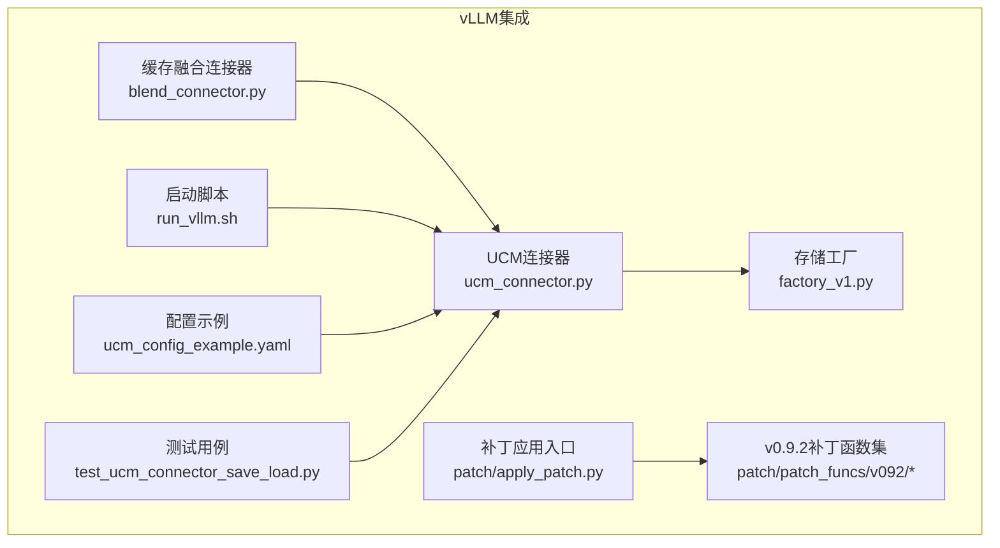
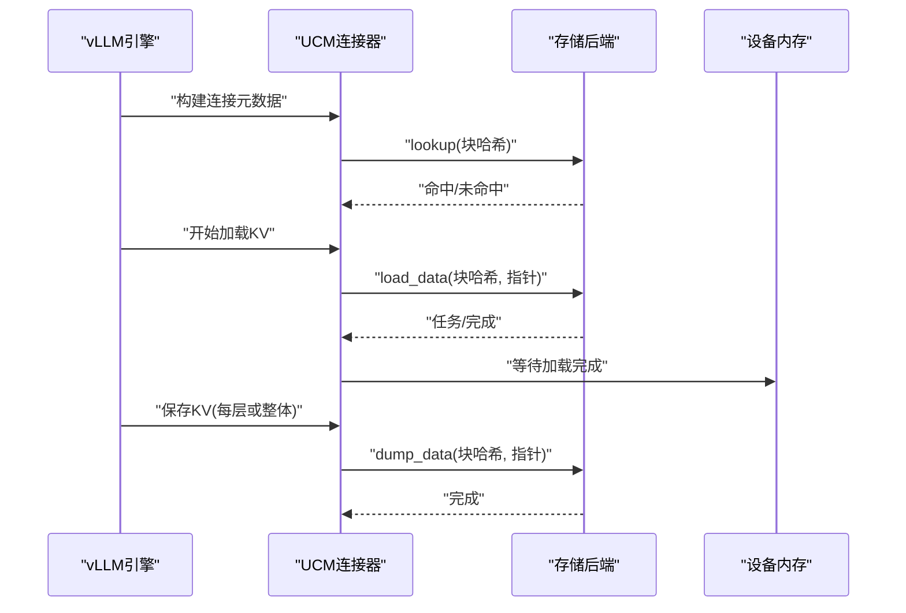
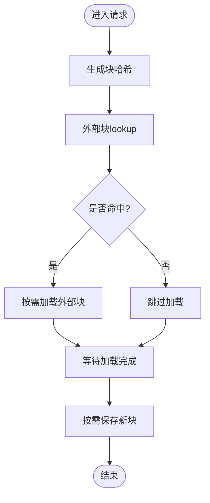
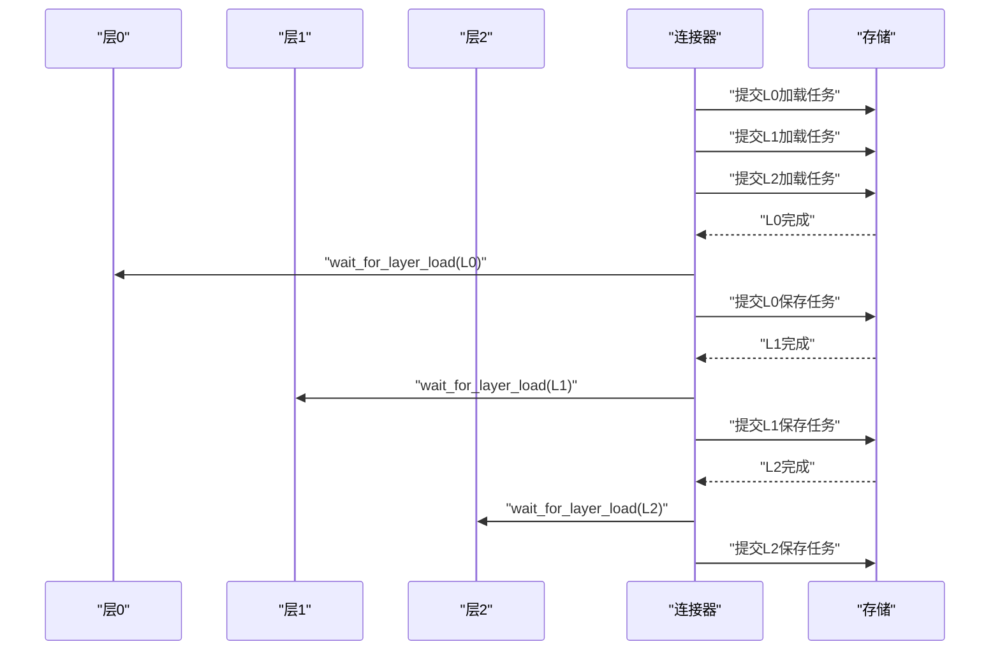
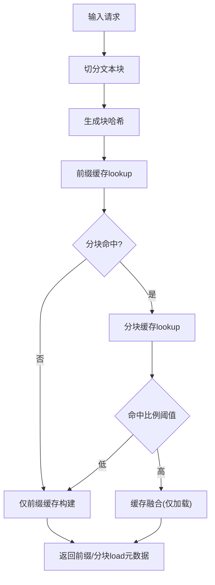
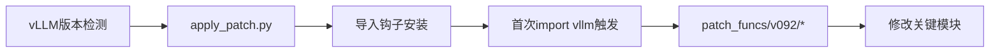
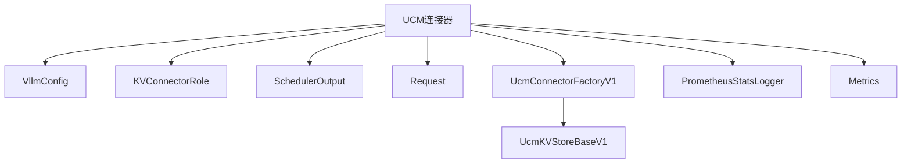

# vLLM集成

<cite>
**本文引用的文件**
- [ucm_connector.py](file://ucm/integration/vllm/ucm_connector.py)
- [blend_connector.py](file://ucm/integration/vllm/blend_connector.py)
- [apply_patch.py](file://ucm/integration/vllm/patch/apply_patch.py)
- [v092/vllm_patch.py](file://ucm/integration/vllm/patch/patch_funcs/v092/vllm_patch.py)
- [v092/vllm_rerope_patch.py](file://ucm/integration/vllm/patch/patch_funcs/v092/vllm_rerope_patch.py)
- [v092/vllm_ascend_patch.py](file://ucm/integration/vllm/patch/patch_funcs/v092/vllm_ascend_patch.py)
- [run_vllm.sh](file://examples/deployments/scripts/vllm/run_vllm.sh)
- [quickstart_vllm.md](file://docs/source/getting-started/quickstart_vllm.md)
- [ucm_config_example.yaml](file://examples/ucm_config_example.yaml)
- [factory_v1.py](file://ucm/store/factory_v1.py)
- [test_ucm_connector_save_load.py](file://test/test_ucm_connector_save_load.py)
</cite>

## 目录
1. [简介](#简介)
2. [项目结构](#项目结构)
3. [核心组件](#核心组件)
4. [架构总览](#架构总览)
5. [组件详解](#组件详解)
6. [依赖关系分析](#依赖关系分析)
7. [性能考量](#性能考量)
8. [故障排除指南](#故障排除指南)
9. [结论](#结论)
10. [附录](#附录)

## 简介
本技术文档面向UCM与vLLM的集成，系统阐述连接器架构设计、两种连接器的工作模式（同步直连与分层重叠）、缓存融合连接器（Blend）能力、vLLM版本适配补丁机制与自动应用流程，并提供配置项、性能调优参数、最佳实践、集成示例、兼容性矩阵与升级迁移指导。

## 项目结构
围绕vLLM集成的关键目录与文件：
- 连接器实现：ucm/integration/vllm/ucm_connector.py、ucm/integration/vllm/blend_connector.py
- 补丁系统：ucm/integration/vllm/patch/apply_patch.py 及各版本补丁函数
- 启动脚本与快速入门：examples/deployments/scripts/vllm/run_vllm.sh、docs/source/getting-started/quickstart_vllm.md
- 配置示例：examples/ucm_config_example.yaml
- 存储后端工厂：ucm/store/factory_v1.py
- 测试用例：test/test_ucm_connector_save_load.py

图表来源
- [ucm_connector.py](file://ucm/integration/vllm/ucm_connector.py#L1-L1080)
- [blend_connector.py](file://ucm/integration/vllm/blend_connector.py#L1-L499)
- [apply_patch.py](file://ucm/integration/vllm/patch/apply_patch.py#L1-L192)
- [v092/vllm_patch.py](file://ucm/integration/vllm/patch/patch_funcs/v092/vllm_patch.py#L1-L800)
- [run_vllm.sh](file://examples/deployments/scripts/vllm/run_vllm.sh#L1-L116)
- [ucm_config_example.yaml](file://examples/ucm_config_example.yaml#L1-L39)
- [factory_v1.py](file://ucm/store/factory_v1.py#L1-L66)
- [test_ucm_connector_save_load.py](file://test/test_ucm_connector_save_load.py#L120-L201)

章节来源
- [ucm_connector.py](file://ucm/integration/vllm/ucm_connector.py#L1-L1080)
- [blend_connector.py](file://ucm/integration/vllm/blend_connector.py#L1-L499)
- [apply_patch.py](file://ucm/integration/vllm/patch/apply_patch.py#L1-L192)
- [v092/vllm_patch.py](file://ucm/integration/vllm/patch/patch_funcs/v092/vllm_patch.py#L1-L800)
- [run_vllm.sh](file://examples/deployments/scripts/vllm/run_vllm.sh#L1-L116)
- [ucm_config_example.yaml](file://examples/ucm_config_example.yaml#L1-L39)
- [factory_v1.py](file://ucm/store/factory_v1.py#L1-L66)
- [test_ucm_connector_save_load.py](file://test/test_ucm_connector_save_load.py#L120-L201)

## 核心组件
- UCMDirectConnector：直接同步连接器，负责KV缓存的加载与保存，按请求块进行查找、加载、等待与保存，支持MLA/DSA/GQA形态。
- UCMLayerWiseConnector：分层重叠连接器，在每层前加载对应层的KV缓存，实现层间重叠以提升吞吐。
- UCMBlendConnector：缓存融合连接器，基于块哈希与前缀缓存/分块缓存策略，支持“缓存融合”以降低TTFT。
- 补丁系统：自动检测vLLM版本并应用相应补丁，覆盖调度输出、注意力算子、MLA后端、模型层等关键路径。
- 存储工厂：统一注册与创建存储后端（如NFS、Pipeline），供连接器使用。

章节来源
- [ucm_connector.py](file://ucm/integration/vllm/ucm_connector.py#L82-L1080)
- [blend_connector.py](file://ucm/integration/vllm/blend_connector.py#L121-L499)
- [apply_patch.py](file://ucm/integration/vllm/patch/apply_patch.py#L84-L192)
- [factory_v1.py](file://ucm/store/factory_v1.py#L34-L66)

## 架构总览
UCM通过KV传输配置接入vLLM，连接器在前向执行前后与外部存储交互，实现KV缓存的异步加载与保存。补丁系统确保连接器与vLLM关键模块的无缝对接。

图表来源
- [ucm_connector.py](file://ucm/integration/vllm/ucm_connector.py#L397-L644)
- [blend_connector.py](file://ucm/integration/vllm/blend_connector.py#L411-L466)

## 组件详解

### UCMDirectConnector（同步直连模式）
- 设计要点
  - 基于请求生成块哈希，先查HBM命中，再对剩余外部块发起lookup。
  - 生成vLLM块指针矩阵，按层数与K/V布局组织，支持MLA/DSA/GQA。
  - 支持按请求构建加载/保存元数据，区分已处理token与新块。
  - 提供错误块ID收集接口，便于后续重试或降级。
- 关键流程
  - get_num_new_matched_tokens：计算外部命中tokens数。
  - build_connector_meta：汇总请求的load/dump块集合。
  - start_load_kv/wait_for_layer_load/save_kv_layer：异步加载、等待与保存。
- 特殊形态
  - MLA/DSA：通过is_mla/is_dsa标志切换K/V合并或分离加载；DSA额外维护rope存储。

图表来源
- [ucm_connector.py](file://ucm/integration/vllm/ucm_connector.py#L293-L447)
- [ucm_connector.py](file://ucm/integration/vllm/ucm_connector.py#L488-L644)

章节来源
- [ucm_connector.py](file://ucm/integration/vllm/ucm_connector.py#L82-L1080)

### UCMLayerWiseConnector（分层重叠模式）
- 设计要点
  - 每层独立发起load任务，等待当前层完成后再进入下一层，实现层间流水线重叠。
  - 对MLA/DSA/GQA分别构造K/V指针，DSA同时加载rope。
  - 仅在特定rank保存，避免重复写入。
- 关键流程
  - start_load_kv：逐层提交load任务。
  - wait_for_layer_load：按层等待对应任务完成。
  - save_kv_layer：按层提交dump任务。

图表来源
- [ucm_connector.py](file://ucm/integration/vllm/ucm_connector.py#L679-L800)

章节来源
- [ucm_connector.py](file://ucm/integration/vllm/ucm_connector.py#L661-L800)

### UCMBlendConnector（缓存融合连接器）
- 功能概述
  - 将请求切分为文本块，识别以特定token结尾的“分块”，优先匹配前缀缓存，再对分块进行缓存命中评估。
  - 当分块命中比例低于阈值时，回退到前缀缓存构建；当命中足够高时，执行“缓存融合”以加速首Token时间。
  - 在加载后对分块K缓存执行Delta RoPE后处理，保证位置编码一致性。
- 关键流程
  - _process_req：切分块并生成块哈希。
  - _get_req_chunk_hit：先前缀缓存后分块缓存的混合命中统计。
  - build_connector_meta：根据阶段生成load/dump元数据。
  - bind_connector_metadata：绑定分块后处理所需的位置与VLLM块ID映射。
  - wait_for_layer_load：执行块级RoPE后处理。

图表来源
- [blend_connector.py](file://ucm/integration/vllm/blend_connector.py#L148-L260)
- [blend_connector.py](file://ucm/integration/vllm/blend_connector.py#L411-L466)

章节来源
- [blend_connector.py](file://ucm/integration/vllm/blend_connector.py#L1-L499)

### 补丁系统与版本适配
- 自动化应用
  - 通过apply_patch.py检测vLLM版本，安装导入钩子拦截首次import vllm时自动应用补丁。
  - 支持v0.9.2及ReRoPE场景，可按环境变量选择Ascend或REROPE路径。
- 补丁范围
  - 调度输出扩展：新增UCM稀疏相关字段。
  - 注意力算子增强：统一注意力op包装，注入等待/保存KV层逻辑。
  - MLA后端适配：MLACommonImpl前向中写入KV缓存并支持稀疏插桩。
  - 模型层适配：Qwen系列注意力前向中加入REROPE缩放与双查询路径。
  - Ascend平台：vllm-ascend后端的注意力与MLA适配。
- 应用方式
  - 手动git apply对应补丁。
  - 或通过自动补丁应用入口，按版本自动加载补丁函数。

图表来源
- [apply_patch.py](file://ucm/integration/vllm/patch/apply_patch.py#L59-L192)
- [v092/vllm_patch.py](file://ucm/integration/vllm/patch/patch_funcs/v092/vllm_patch.py#L63-L138)
- [v092/vllm_rerope_patch.py](file://ucm/integration/vllm/patch/patch_funcs/v092/vllm_rerope_patch.py#L52-L800)
- [v092/vllm_ascend_patch.py](file://ucm/integration/vllm/patch/patch_funcs/v092/vllm_ascend_patch.py#L40-L176)

章节来源
- [apply_patch.py](file://ucm/integration/vllm/patch/apply_patch.py#L1-L192)
- [v092/vllm_patch.py](file://ucm/integration/vllm/patch/patch_funcs/v092/vllm_patch.py#L1-L800)
- [v092/vllm_rerope_patch.py](file://ucm/integration/vllm/patch/patch_funcs/v092/vllm_rerope_patch.py#L1-L800)
- [v092/vllm_ascend_patch.py](file://ucm/integration/vllm/patch/patch_funcs/v092/vllm_ascend_patch.py#L1-L800)

## 依赖关系分析
- 连接器依赖
  - vLLM核心类型：VllmConfig、KVConnectorRole、SchedulerOutput、Request、KVCacheBlocks。
  - UCM内部：UcmKVStoreBaseV1、UcmConnectorFactoryV1、PrometheusStatsLogger、Metrics。
- 存储后端
  - 工厂注册：UcmNfsStore、UcmPipelineStore等，按名称动态加载类实例。
- 补丁依赖
  - 通过monkey patch修改vLLM内部模块，确保注意力op与MLA后端能与连接器协作。

图表来源
- [ucm_connector.py](file://ucm/integration/vllm/ucm_connector.py#L10-L28)
- [factory_v1.py](file://ucm/store/factory_v1.py#L34-L66)

章节来源
- [ucm_connector.py](file://ucm/integration/vllm/ucm_connector.py#L1-L1080)
- [factory_v1.py](file://ucm/store/factory_v1.py#L1-L66)

## 性能考量
- 分层加载vs整体加载
  - LayerWise适合长序列与多层模型，减少等待时间；Direct适合简单场景与较低延迟需求。
- I/O并发与队列
  - Pipeline/NFS等存储后端支持stream_number/buffer_number/waiting_queue_depth/running_queue_depth等参数，建议结合num_gpu_blocks与层数调整。
- 设备与平台
  - CUDA/NPU平台均受支持，注意设备流同步与rope/DSA形态下的额外开销。
- 命中率与块大小
  - block_size=128通常获得较好吞吐；命中率可通过MockConnector进行压测验证。

章节来源
- [quickstart_vllm.md](file://docs/source/getting-started/quickstart_vllm.md#L1-L237)
- [test_ucm_connector_save_load.py](file://test/test_ucm_connector_save_load.py#L120-L201)

## 故障排除指南
- 启动失败（vLLM未安装或版本不匹配）
  - 现象：无法检测vLLM版本或提示不支持。
  - 处理：确认vLLM已安装且版本在支持列表；必要时手动应用补丁。
- 连接器初始化异常
  - 现象：无存储后端配置或配置项缺失。
  - 处理：检查ucm_connectors配置，确保storage_backends与唯一ID设置正确。
- 加载/保存错误
  - 现象：日志出现load/dump失败或索引错误。
  - 处理：检查无效块ID集合，定位具体请求与块ID，排查存储后端可用性与权限。
- 分层加载等待超时
  - 现象：wait_for_layer_load报错。
  - 处理：确认每层任务提交顺序与等待时机一致，检查设备流同步与rank权限。

章节来源
- [apply_patch.py](file://ucm/integration/vllm/patch/apply_patch.py#L84-L118)
- [ucm_connector.py](file://ucm/integration/vllm/ucm_connector.py#L530-L544)
- [ucm_connector.py](file://ucm/integration/vllm/ucm_connector.py#L734-L750)

## 结论
UCM与vLLM的集成通过连接器与补丁系统实现了KV缓存的高效加载与保存，并提供了分层重叠与缓存融合两种优化模式。配合灵活的存储后端与完善的监控指标，可在多平台、多形态模型上获得稳定性能收益。建议在生产部署中结合实际负载选择合适的连接器模式与存储后端参数，并持续关注版本适配与补丁更新。

## 附录

### 集成示例
- 快速启动vLLM服务并启用UCM
  - 使用示例脚本传入KV传输配置，指定连接器模块与配置文件路径。
- 离线推理
  - 在示例脚本中设置UCM_CONFIG_FILE，构建带UCM的LLM对象进行离线推理。

章节来源
- [run_vllm.sh](file://examples/deployments/scripts/vllm/run_vllm.sh#L99-L112)
- [quickstart_vllm.md](file://docs/source/getting-started/quickstart_vllm.md#L154-L237)

### 配置项与参数
- 连接器配置（ucm_connectors）
  - ucm_connector_name：存储后端名称（如UcmNfsStore、UcmPipelineStore）。
  - ucm_connector_config：后端参数（storage_backends、io_direct、stream_number、buffer_number、waiting_queue_depth、running_queue_depth、timeout_ms等）。
- 指标与监控
  - metrics_config_path：Prometheus指标配置路径，用于在线观测加载/保存速度与请求量。
- 稀疏注意力与ReRoPE
  - ENABLE_SPARSE、VLLM_USE_REROPE等环境变量控制功能开关与路径选择。

章节来源
- [ucm_config_example.yaml](file://examples/ucm_config_example.yaml#L10-L39)
- [quickstart_vllm.md](file://docs/source/getting-started/quickstart_vllm.md#L133-L153)

### 兼容性矩阵与版本适配
- 支持的vLLM版本
  - v0.9.2：完整补丁（含稀疏、Ascend、REROPE可选）。
  - v0.11.0：稀疏注意力补丁。
- 自动补丁应用
  - 通过apply_patch.py检测版本并自动应用；若未安装vLLM则安装导入钩子拦截首次import。

章节来源
- [apply_patch.py](file://ucm/integration/vllm/patch/apply_patch.py#L79-L118)
- [quickstart_vllm.md](file://docs/source/getting-started/quickstart_vllm.md#L81-L117)

### 升级迁移指导
- 从v0.9.1/0.9.2迁移到更高版本
  - 若存在自定义补丁，优先采用自动补丁应用入口；若仍需手动补丁，请对照patch_funcs中的修改点逐项比对。
- 连接器模式切换
  - 由Direct切换至LayerWise时，需评估I/O队列与缓冲区参数，确保与层数匹配。
- 存储后端迁移
  - 切换后端时，校验storage_backends路径、权限与容量，确保块哈希一致。

章节来源
- [apply_patch.py](file://ucm/integration/vllm/patch/apply_patch.py#L139-L192)
- [factory_v1.py](file://ucm/store/factory_v1.py#L60-L66)