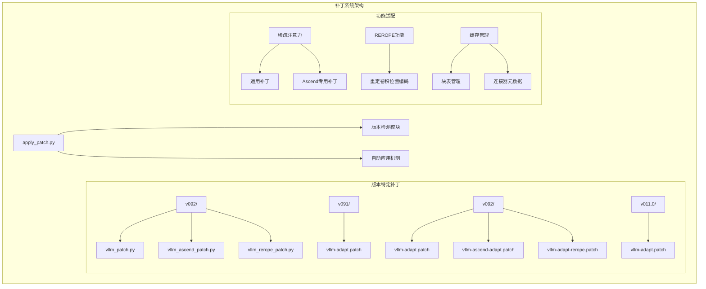
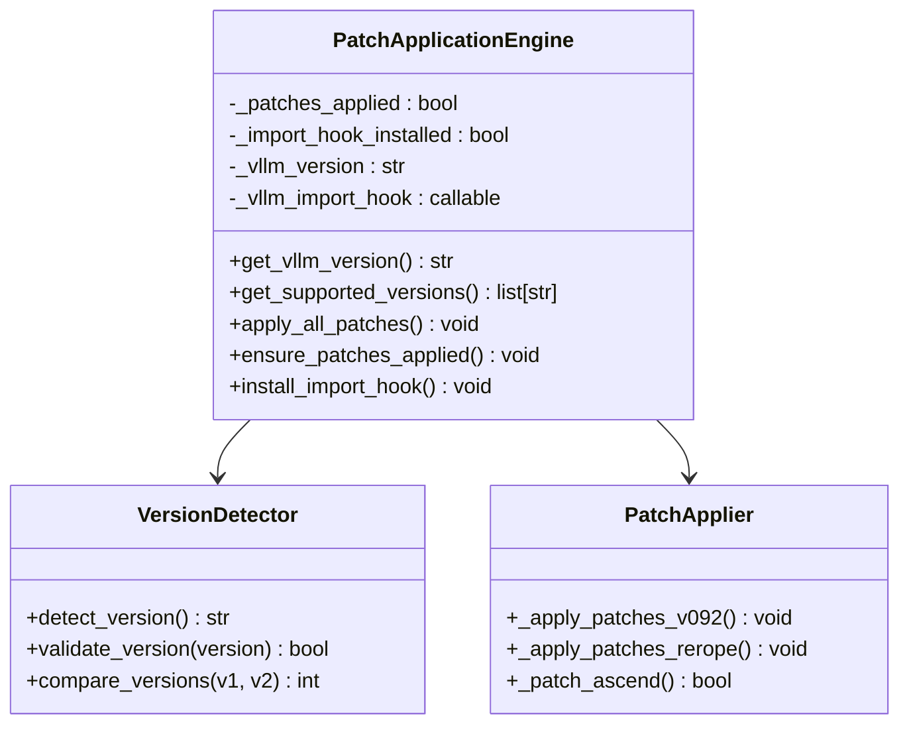
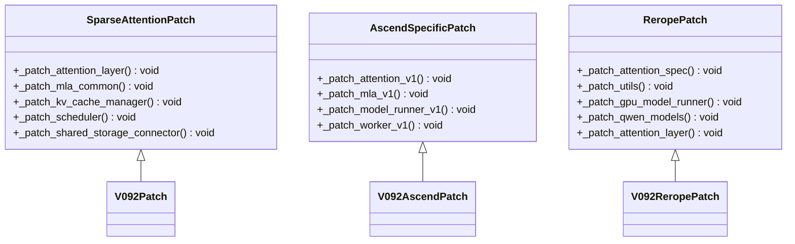
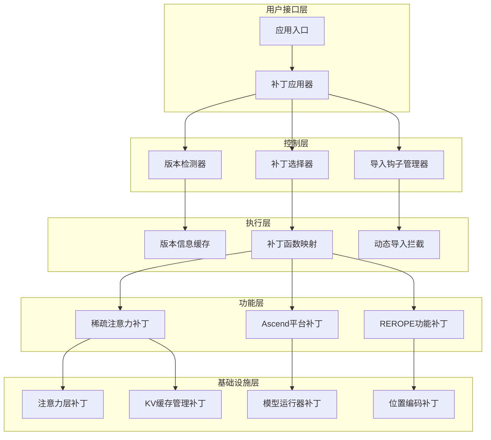
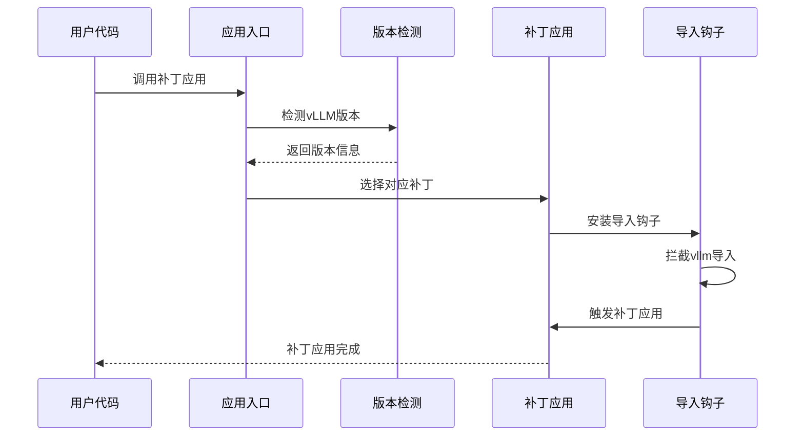
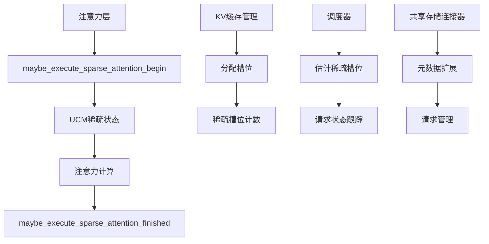
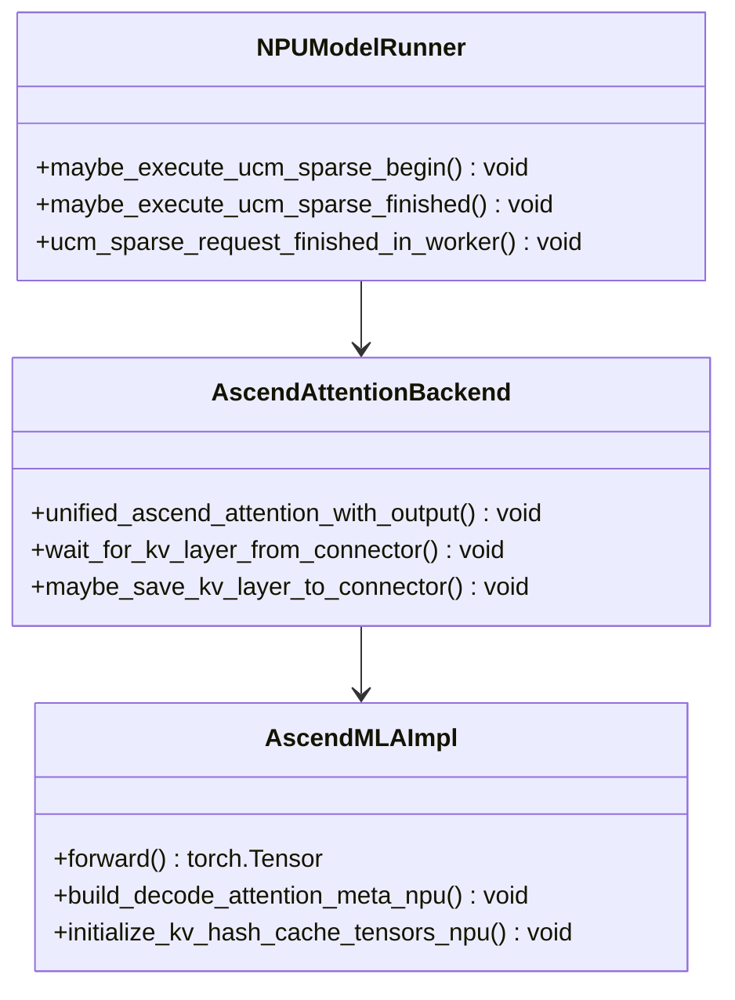
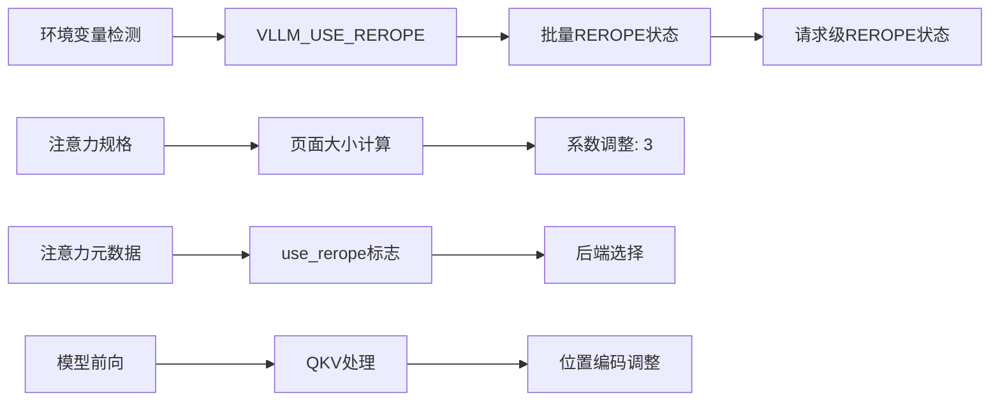
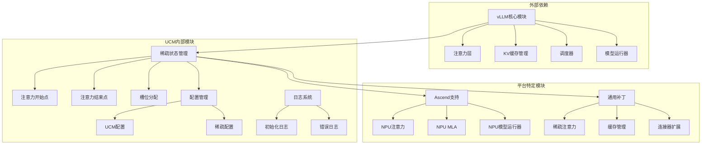
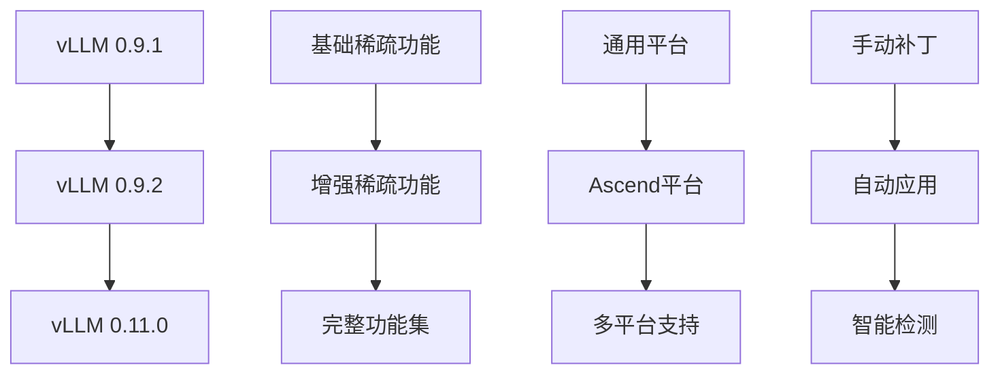

# 版本补丁系统

<cite>
**本文档引用的文件**
- [apply_patch.py](file://ucm/integration/vllm/patch/apply_patch.py)
- [vllm_patch.py](file://ucm/integration/vllm/patch/patch_funcs/v092/vllm_patch.py)
- [vllm_ascend_patch.py](file://ucm/integration/vllm/patch/patch_funcs/v092/vllm_ascend_patch.py)
- [vllm_rerope_patch.py](file://ucm/integration/vllm/patch/patch_funcs/v092/vllm_rerope_patch.py)
- [vllm-adapt.patch](file://ucm/integration/vllm/patch/0.9.1/vllm-adapt.patch)
- [vllm-adapt.patch](file://ucm/integration/vllm/patch/0.9.2/vllm-adapt.patch)
- [vllm-ascend-adapt.patch](file://ucm/integration/vllm/patch/0.9.2/vllm-ascend-adapt.patch)
- [vllm-adapt-rerope.patch](file://ucm/integration/vllm/patch/0.9.2/vllm-adapt-rerope.patch)
- [vllm-adapt.patch](file://ucm/integration/vllm/patch/0.11.0/vllm-adapt.patch)
</cite>

## 目录
1. [简介](#简介)
2. [项目结构](#项目结构)
3. [核心组件](#核心组件)
4. [架构概览](#架构概览)
5. [详细组件分析](#详细组件分析)
6. [依赖关系分析](#依赖关系分析)
7. [性能考虑](#性能考虑)
8. [故障排除指南](#故障排除指南)
9. [结论](#结论)
10. [附录](#附录)

## 简介

UCM版本补丁系统是一个智能的vLLM版本适配框架，旨在为不同版本的vLLM提供无缝的兼容性和功能增强。该系统通过自动检测vLLM版本并应用相应的补丁来实现跨版本的统一支持。

系统的核心特性包括：
- 自动版本检测和补丁应用
- 多版本兼容性矩阵支持
- 智能导入钩子机制
- 支持稀疏注意力和REROPE功能
- Ascend平台特定优化

## 项目结构

补丁系统采用模块化设计，按照版本和功能进行组织：



**图表来源**
- [apply_patch.py](file://ucm/integration/vllm/patch/apply_patch.py#L1-L192)
- [vllm_patch.py](file://ucm/integration/vllm/patch/patch_funcs/v092/vllm_patch.py#L1-L800)

**章节来源**
- [apply_patch.py](file://ucm/integration/vllm/patch/apply_patch.py#L1-L192)
- [vllm_patch.py](file://ucm/integration/vllm/patch/patch_funcs/v092/vllm_patch.py#L1-L800)

## 核心组件

### 版本检测与应用引擎

补丁系统的核心是`apply_patch.py`模块，它提供了完整的版本检测和自动应用机制：



**图表来源**
- [apply_patch.py](file://ucm/integration/vllm/patch/apply_patch.py#L59-L192)

### 功能补丁模块

每个版本都包含专门的功能补丁模块，负责实现特定的功能增强：



**图表来源**
- [vllm_patch.py](file://ucm/integration/vllm/patch/patch_funcs/v092/vllm_patch.py#L39-L800)
- [vllm_ascend_patch.py](file://ucm/integration/vllm/patch/patch_funcs/v092/vllm_ascend_patch.py#L40-L800)
- [vllm_rerope_patch.py](file://ucm/integration/vllm/patch/patch_funcs/v092/vllm_rerope_patch.py#L36-L800)

**章节来源**
- [apply_patch.py](file://ucm/integration/vllm/patch/apply_patch.py#L84-L192)
- [vllm_patch.py](file://ucm/integration/vllm/patch/patch_funcs/v092/vllm_patch.py#L1-L800)
- [vllm_ascend_patch.py](file://ucm/integration/vllm/patch/patch_funcs/v092/vllm_ascend_patch.py#L1-L800)
- [vllm_rerope_patch.py](file://ucm/integration/vllm/patch/patch_funcs/v092/vllm_rerope_patch.py#L1-L800)

## 架构概览

补丁系统采用分层架构设计，确保了良好的可扩展性和维护性：



**图表来源**
- [apply_patch.py](file://ucm/integration/vllm/patch/apply_patch.py#L139-L192)
- [vllm_patch.py](file://ucm/integration/vllm/patch/patch_funcs/v092/vllm_patch.py#L39-L800)

### 自动应用机制流程



**图表来源**
- [apply_patch.py](file://ucm/integration/vllm/patch/apply_patch.py#L139-L192)

**章节来源**
- [apply_patch.py](file://ucm/integration/vllm/patch/apply_patch.py#L139-L192)

## 详细组件分析

### 版本兼容性矩阵

补丁系统支持以下vLLM版本：

| 版本 | 支持状态 | 功能特性 | 平台支持 |
|------|----------|----------|----------|
| 0.9.1 | ✅ 基础支持 | 稀疏注意力 | 通用 |
| 0.9.2 | ✅ 完整支持 | 稀疏注意力、REROPE、Ascend | 通用、Ascend |
| 0.11.0 | ✅ 完整支持 | 稀疏注意力 | 通用 |

### 稀疏注意力补丁详解

稀疏注意力补丁是系统的核心功能之一，通过多个组件协同工作实现：



**图表来源**
- [vllm_patch.py](file://ucm/integration/vllm/patch/patch_funcs/v092/vllm_patch.py#L64-L800)

#### 注意力层补丁实现

注意力层补丁通过包装原始的注意力操作来集成稀疏功能：

**章节来源**
- [vllm_patch.py](file://ucm/integration/vllm/patch/patch_funcs/v092/vllm_patch.py#L140-L400)

### Ascend平台特定补丁

Ascend平台补丁针对华为昇腾硬件进行了专门优化：



**图表来源**
- [vllm_ascend_patch.py](file://ucm/integration/vllm/patch/patch_funcs/v092/vllm_ascend_patch.py#L57-L800)

**章节来源**
- [vllm_ascend_patch.py](file://ucm/integration/vllm/patch/patch_funcs/v092/vllm_ascend_patch.py#L1-L800)

### REROPE功能补丁

REROPE（重定卷积位置编码）功能补丁为长上下文推理提供了特殊支持：



**图表来源**
- [vllm_rerope_patch.py](file://ucm/integration/vllm/patch/patch_funcs/v092/vllm_rerope_patch.py#L52-L800)

**章节来源**
- [vllm_rerope_patch.py](file://ucm/integration/vllm/patch/patch_funcs/v092/vllm_rerope_patch.py#L1-L800)

## 依赖关系分析

补丁系统具有清晰的依赖层次结构：



**图表来源**
- [apply_patch.py](file://ucm/integration/vllm/patch/apply_patch.py#L29-L56)
- [vllm_patch.py](file://ucm/integration/vllm/patch/patch_funcs/v092/vllm_patch.py#L26-L32)

### 版本升级路径



**图表来源**
- [apply_patch.py](file://ucm/integration/vllm/patch/apply_patch.py#L79-L118)

**章节来源**
- [apply_patch.py](file://ucm/integration/vllm/patch/apply_patch.py#L79-L118)

## 性能考虑

补丁系统在设计时充分考虑了性能影响：

### 内存管理优化
- KV缓存系数调整：从2调整为3（REROPE场景）
- 智能槽位分配避免内存浪费
- 异步KV传输减少等待时间

### 计算效率优化
- 条件补丁应用仅在需要时执行
- 缓存版本检测结果避免重复检测
- 批量操作减少函数调用开销

### 平台特定优化
- Ascend平台使用NPU优化内核
- 条件编译避免不必要的计算
- 流水线并行提高吞吐量

## 故障排除指南

### 常见问题及解决方案

| 问题类型 | 症状 | 解决方案 |
|----------|------|----------|
| 版本不兼容 | 补丁应用失败 | 检查vLLM版本是否在支持列表中 |
| 导入钩子失效 | 补丁未应用 | 手动调用`ensure_patches_applied()` |
| 平台检测错误 | Ascend功能不可用 | 设置`PLATFORM=ascend`环境变量 |
| 稀疏注意力异常 | 性能下降或错误 | 检查`ENABLE_SPARSE`环境变量 |
| REROPE功能失效 | 长上下文处理异常 | 设置`VLLM_USE_REROPE=true` |

### 调试工具

系统提供了多种调试和诊断工具：

```python
# 启用详细日志
import logging
logging.getLogger('ucm').setLevel(logging.DEBUG)

# 检查当前版本
from ucm.integration.vllm.patch.apply_patch import get_vllm_version
print(f"vLLM版本: {get_vllm_version()}")

# 验证补丁应用状态
from ucm.integration.vllm.patch.apply_patch import _patches_applied
print(f"补丁已应用: {_patches_applied}")
```

**章节来源**
- [apply_patch.py](file://ucm/integration/vllm/patch/apply_patch.py#L183-L192)

## 结论

UCM版本补丁系统通过智能化的设计实现了对多个vLLM版本的全面支持。系统的核心优势包括：

1. **自动化程度高**：自动检测版本并应用相应补丁
2. **扩展性强**：模块化设计便于添加新版本支持
3. **性能优化**：针对不同平台和功能进行专门优化
4. **易用性好**：透明的应用机制无需用户干预

该系统为UCM在不同vLLM版本间的迁移提供了平滑的过渡路径，确保了功能的一致性和性能的最优化。

## 附录

### 环境变量配置

| 变量名 | 默认值 | 用途 |
|--------|--------|------|
| `PLATFORM` | `""` | 指定目标平台（如`ascend`） |
| `ENABLE_SPARSE` | `""` | 启用稀疏注意力功能 |
| `VLLM_USE_REROPE` | `"0"` | 启用REROPE功能 |
| `VLLM_HASH_ATTENTION` | `"0"` | 启用哈希注意力（KVComp） |

### 扩展指南

要为新版本添加补丁支持：

1. **创建版本目录**：在`ucm/integration/vllm/patch/`下创建新版本目录
2. **实现补丁函数**：编写对应版本的补丁应用函数
3. **更新版本检测**：在`get_supported_versions()`中添加新版本
4. **测试验证**：确保补丁在目标版本上正常工作

### 回滚机制

系统提供了简单的回滚能力：

```python
# 检查补丁应用状态
if not _patches_applied:
    # 尝试重新应用
    apply_all_patches()
else:
    # 清理现有补丁
    # 重新安装导入钩子
    install_import_hook()
```