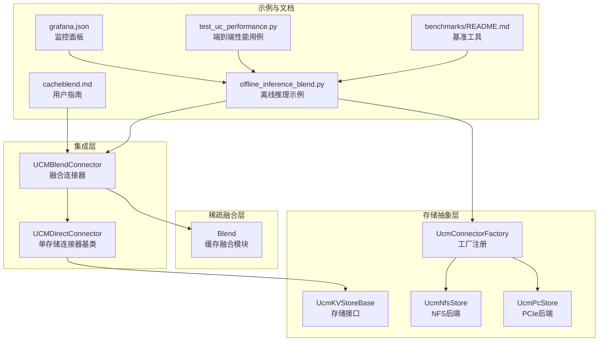
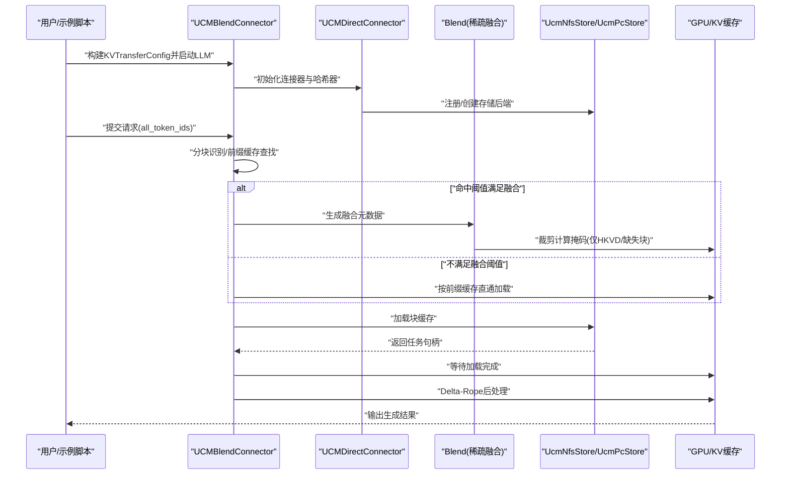
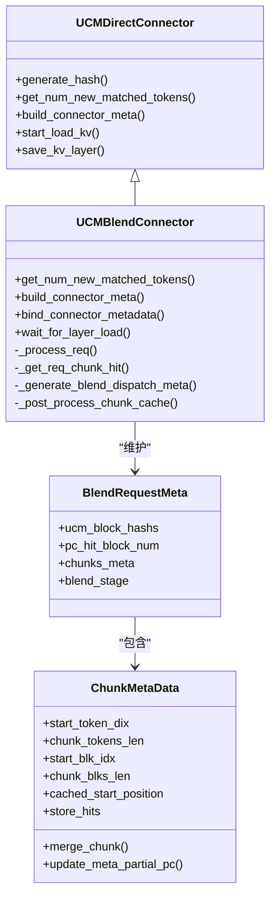
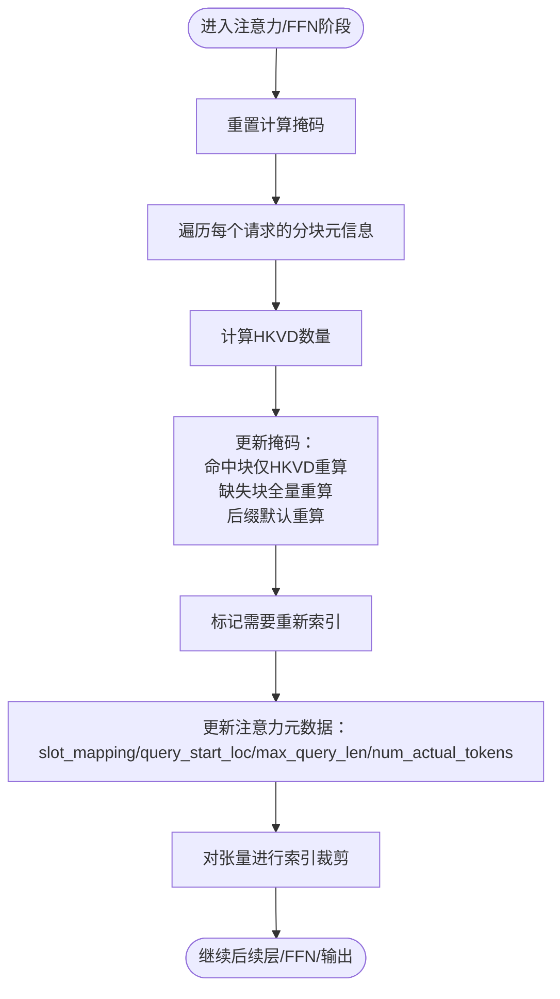
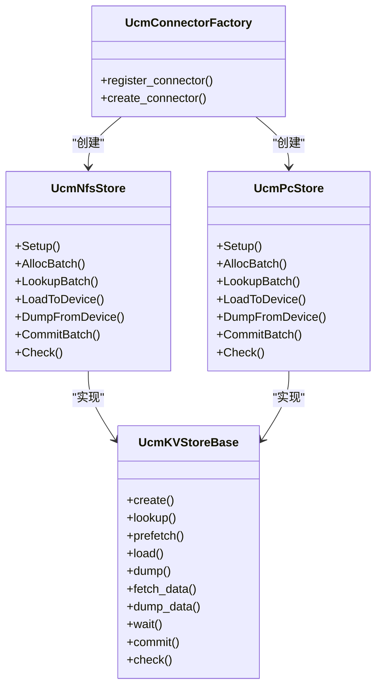
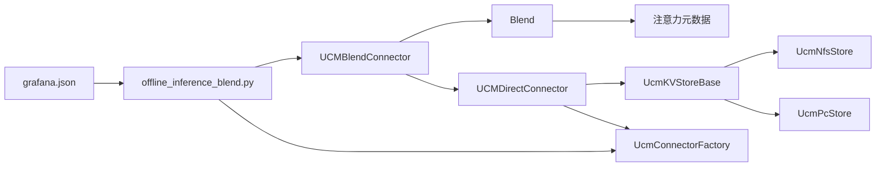

# 缓存融合连接器

<cite>
**本文引用的文件**
- [blend_connector.py](file://ucm/integration/vllm/blend_connector.py)
- [ucm_connector.py](file://ucm/integration/vllm/ucm_connector.py)
- [blend.py](file://ucm/sparse/blend/blend.py)
- [ucmstore.py](file://ucm/store/ucmstore.py)
- [factory.py](file://ucm/store/factory.py)
- [nfsstore_connector.py](file://ucm/store/nfsstore/nfsstore_connector.py)
- [pcstore_connector.py](file://ucm/store/pcstore/pcstore_connector.py)
- [offline_inference_blend.py](file://examples/offline_inference_blend.py)
- [cacheblend.md](file://docs/source/user-guide/sparse-attention/cacheblend.md)
- [README.md（基准测试）](file://benchmarks/README.md)
- [test_uc_performance.py](file://test/suites/E2E/test_uc_performance.py)
- [grafana.json](file://examples/metrics/grafana.json)
</cite>

## 目录
1. [简介](#简介)
2. [项目结构](#项目结构)
3. [核心组件](#核心组件)
4. [架构总览](#架构总览)
5. [详细组件分析](#详细组件分析)
6. [依赖关系分析](#依赖关系分析)
7. [性能考量](#性能考量)
8. [故障排查指南](#故障排查指南)
9. [结论](#结论)
10. [附录](#附录)

## 简介
本技术文档聚焦于UCM缓存融合连接器（UCMBlendConnector），系统阐述其设计目标、工作机制与实现细节，重点覆盖以下方面：
- 多存储后端融合管理：通过统一接口抽象，支持将不同后端（如NFS、PCIe等）作为KV缓存存储层协同工作。
- 缓存融合机制：基于“块级分块”与“前缀缓存优先”的策略，结合Delta-Rope后处理与HKVD最小重算，显著降低首次令牌耗时（TTFT）并提升吞吐。
- 配置选项与性能调优：涵盖连接器配置、稀疏注意力融合参数、监控指标与观测体系。
- 与单存储连接器的差异与优势：对比UCMDirectConnector，展示融合连接器在长序列RAG场景下的加速与质量保障。
- 最佳实践与常见问题：提供使用示例、性能基准方法与排障建议。

## 项目结构
围绕缓存融合连接器的关键目录与文件如下：
- 连接器与调度层：ucm/integration/vllm/blend_connector.py、ucm/integration/vllm/ucm_connector.py
- 稀疏注意力融合模块：ucm/sparse/blend/blend.py
- 存储抽象与工厂：ucm/store/ucmstore.py、ucm/store/factory.py
- 典型存储后端实现：ucm/store/nfsstore/nfsstore_connector.py、ucm/store/pcstore/pcstore_connector.py
- 使用示例与用户指南：examples/offline_inference_blend.py、docs/source/user-guide/sparse-attention/cacheblend.md
- 基准测试与性能评估：benchmarks/README.md、test/suites/E2E/test_uc_performance.py
- 监控与可视化：examples/metrics/grafana.json

图表来源
- [blend_connector.py](file://ucm/integration/vllm/blend_connector.py#L121-L147)
- [ucm_connector.py](file://ucm/integration/vllm/ucm_connector.py#L82-L120)
- [blend.py](file://ucm/sparse/blend/blend.py#L149-L176)
- [ucmstore.py](file://ucm/store/ucmstore.py#L39-L205)
- [factory.py](file://ucm/store/factory.py#L34-L71)
- [nfsstore_connector.py](file://ucm/store/nfsstore/nfsstore_connector.py#L39-L71)
- [pcstore_connector.py](file://ucm/store/pcstore/pcstore_connector.py#L39-L62)
- [offline_inference_blend.py](file://examples/offline_inference_blend.py#L88-L135)
- [cacheblend.md](file://docs/source/user-guide/sparse-attention/cacheblend.md#L1-L98)
- [benchmarks/README.md](file://benchmarks/README.md#L1-L129)
- [test_uc_performance.py](file://test/suites/E2E/test_uc_performance.py#L1-L186)
- [grafana.json](file://examples/metrics/grafana.json#L1-L53)

章节来源
- [blend_connector.py](file://ucm/integration/vllm/blend_connector.py#L121-L147)
- [ucm_connector.py](file://ucm/integration/vllm/ucm_connector.py#L82-L120)
- [blend.py](file://ucm/sparse/blend/blend.py#L149-L176)
- [ucmstore.py](file://ucm/store/ucmstore.py#L39-L205)
- [factory.py](file://ucm/store/factory.py#L34-L71)
- [offline_inference_blend.py](file://examples/offline_inference_blend.py#L88-L135)

## 核心组件
- UCMBlendConnector：负责请求级的分块识别、前缀缓存与块缓存的联合查找、融合阶段决策与调度元数据生成，并在加载完成后对块缓存执行Delta-Rope后处理。
- UCMDirectConnector：单存储连接器基类，提供通用的哈希分块、查找、加载/保存任务构建与等待、错误块追踪等能力，是融合连接器的基础。
- Blend（稀疏融合模块）：在注意力与FFN等多阶段对计算掩码进行裁剪，仅保留必要的HKVD与缺失块，从而减少实际计算量。
- UcmKVStoreBase与具体后端（NFS/PCIe）：统一的KV缓存存储接口与实现，支持批量查找、预取、设备间传输、等待与提交。
- UcmConnectorFactory：动态注册与创建存储连接器实例，便于扩展新的存储后端。

章节来源
- [blend_connector.py](file://ucm/integration/vllm/blend_connector.py#L121-L147)
- [ucm_connector.py](file://ucm/integration/vllm/ucm_connector.py#L82-L120)
- [blend.py](file://ucm/sparse/blend/blend.py#L149-L176)
- [ucmstore.py](file://ucm/store/ucmstore.py#L39-L205)
- [factory.py](file://ucm/store/factory.py#L34-L71)

## 架构总览
下图展示了从请求输入到缓存融合与后处理的整体流程，以及与存储后端的交互：

图表来源
- [blend_connector.py](file://ucm/integration/vllm/blend_connector.py#L360-L404)
- [blend.py](file://ucm/sparse/blend/blend.py#L238-L338)
- [nfsstore_connector.py](file://ucm/store/nfsstore/nfsstore_connector.py#L84-L102)
- [pcstore_connector.py](file://ucm/store/pcstore/pcstore_connector.py#L75-L87)

## 详细组件分析

### 组件A：UCMBlendConnector（融合连接器）
- 设计目标
  - 将长序列RAG文本切分为块（chunk），利用块缓存与前缀缓存的联合查找，最大化复用已缓存部分。
  - 在满足最小融合阈值的前提下，仅对高KV偏差（HKVD）与缺失块进行少量重算，显著缩短TTFT并提升吞吐。
- 关键机制
  - 分块识别：以特定结束标记识别块边界，确保块大小对齐。
  - 前缀缓存优先：先进行前缀缓存查找，再进行块缓存查找，合并命中信息用于后续融合。
  - 融合阶段判定：当块缓存命中数低于阈值时回退为前缀缓存构建；否则进入缓存融合阶段。
  - 后处理：对加载的块缓存执行Delta-Rope校正，使其适配新请求的位置偏移。
- 数据结构
  - 请求级元数据：包含块哈希、前缀命中数、块级命中掩码、分块元信息等。
  - 调度元数据：区分加载/丢弃块集合，用于后续任务构建与等待。
- 与单存储连接器的差异
  - 单存储连接器（UCMDirectConnector）仅面向单一后端，采用统一哈希与查找；融合连接器在此基础上引入分块、阈值与后处理，形成“块缓存+前缀缓存”的协同策略。

图表来源
- [ucm_connector.py](file://ucm/integration/vllm/ucm_connector.py#L82-L120)
- [blend_connector.py](file://ucm/integration/vllm/blend_connector.py#L100-L147)

章节来源
- [blend_connector.py](file://ucm/integration/vllm/blend_connector.py#L121-L147)
- [blend_connector.py](file://ucm/integration/vllm/blend_connector.py#L360-L404)
- [blend_connector.py](file://ucm/integration/vllm/blend_connector.py#L411-L466)
- [blend_connector.py](file://ucm/integration/vllm/blend_connector.py#L468-L499)

### 组件B：Blend（稀疏融合模块）
- 设计目标
  - 在注意力与FFN等阶段，基于块命中掩码与HKVD选择，动态裁剪计算掩码，仅对必要区域进行重算。
- 关键机制
  - 计算掩码更新：对块命中区域仅重算HKVD比例的令牌，对缺失块直接重算，对后缀区域默认重算。
  - 查询长度与索引：根据裁剪后的掩码更新查询起止位置、最大查询长度与实际令牌数。
  - 层内索引：在注意力/FFN/层间阶段对张量进行索引裁剪，保证后续计算只作用于必要片段。
- 性能收益
  - 显著减少前向计算量，尤其在长序列RAG场景中，可获得2.2~3.3倍TTFT加速与2.8~5倍吞吐提升。

图表来源
- [blend.py](file://ucm/sparse/blend/blend.py#L202-L222)
- [blend.py](file://ucm/sparse/blend/blend.py#L245-L338)
- [blend.py](file://ucm/sparse/blend/blend.py#L340-L384)

章节来源
- [blend.py](file://ucm/sparse/blend/blend.py#L149-L176)
- [blend.py](file://ucm/sparse/blend/blend.py#L202-L222)
- [blend.py](file://ucm/sparse/blend/blend.py#L245-L338)
- [blend.py](file://ucm/sparse/blend/blend.py#L340-L384)

### 组件C：存储抽象与工厂
- UcmKVStoreBase
  - 定义统一接口：创建、查找、预取、加载/保存数据、等待与提交等。
- 具体后端
  - NFS：支持块分配、批量查找、设备间传输、等待与提交。
  - PCIe：支持块分配、批量查找、设备间传输、等待与提交。
- 工厂注册
  - 通过UcmConnectorFactory注册与创建存储连接器，便于扩展新后端。

图表来源
- [ucmstore.py](file://ucm/store/ucmstore.py#L39-L205)
- [nfsstore_connector.py](file://ucm/store/nfsstore/nfsstore_connector.py#L39-L71)
- [pcstore_connector.py](file://ucm/store/pcstore/pcstore_connector.py#L39-L62)
- [factory.py](file://ucm/store/factory.py#L34-L71)

章节来源
- [ucmstore.py](file://ucm/store/ucmstore.py#L39-L205)
- [nfsstore_connector.py](file://ucm/store/nfsstore/nfsstore_connector.py#L39-L71)
- [pcstore_connector.py](file://ucm/store/pcstore/pcstore_connector.py#L39-L62)
- [factory.py](file://ucm/store/factory.py#L34-L71)

### 组件D：与单存储连接器的差异与优势
- 单存储连接器（UCMDirectConnector）
  - 适用于单一后端场景，提供统一的哈希分块、查找与加载/保存流程。
- 融合连接器（UCMBlendConnector）
  - 引入分块与阈值策略，结合前缀缓存与块缓存的联合查找，支持Delta-Rope后处理与稀疏融合，显著降低TTFT并提升吞吐。
- 适用场景
  - 长序列RAG：通过块缓存与HKVD最小重算，实现快速响应。
  - 多后端协同：通过统一接口与工厂模式，灵活接入NFS/PCIe等后端。

章节来源
- [ucm_connector.py](file://ucm/integration/vllm/ucm_connector.py#L82-L120)
- [blend_connector.py](file://ucm/integration/vllm/blend_connector.py#L121-L147)
- [cacheblend.md](file://docs/source/user-guide/sparse-attention/cacheblend.md#L13-L36)

## 依赖关系分析
- 组件耦合
  - UCMBlendConnector依赖UCMDirectConnector提供的哈希与基础调度能力，并在其之上扩展分块与融合逻辑。
  - Blend模块依赖注意力元数据与请求分块元信息，动态裁剪计算掩码。
  - 存储层通过UcmKVStoreBase抽象屏蔽后端差异，工厂模式实现后端可插拔。
- 外部依赖
  - vLLM引擎：请求调度、注意力元数据与前向上下文。
  - Prometheus/Grafana：指标采集与可视化。

图表来源
- [blend_connector.py](file://ucm/integration/vllm/blend_connector.py#L121-L147)
- [ucm_connector.py](file://ucm/integration/vllm/ucm_connector.py#L82-L120)
- [blend.py](file://ucm/sparse/blend/blend.py#L149-L176)
- [factory.py](file://ucm/store/factory.py#L34-L71)
- [offline_inference_blend.py](file://examples/offline_inference_blend.py#L88-L135)
- [grafana.json](file://examples/metrics/grafana.json#L1-L53)

章节来源
- [blend_connector.py](file://ucm/integration/vllm/blend_connector.py#L121-L147)
- [ucm_connector.py](file://ucm/integration/vllm/ucm_connector.py#L82-L120)
- [blend.py](file://ucm/sparse/blend/blend.py#L149-L176)
- [factory.py](file://ucm/store/factory.py#L34-L71)
- [offline_inference_blend.py](file://examples/offline_inference_blend.py#L88-L135)
- [grafana.json](file://examples/metrics/grafana.json#L1-L53)

## 性能考量
- 分块与阈值
  - 合理设置块大小与融合阈值，可在命中率与重算开销之间取得平衡。
- HKVD比例
  - 通过稀疏融合模块的HKVD比例参数，控制重算比例，兼顾速度与质量。
- 存储后端
  - 选择合适的后端（如NFS/PCIe）并优化IO参数（如流数量、缓冲区数量、直通IO等）可提升加载/保存吞吐。
- 指标监控
  - 利用Prometheus/Grafana面板监控加载/保存速率、命中率与关键延迟指标，指导调优。

章节来源
- [blend.py](file://ucm/sparse/blend/blend.py#L149-L176)
- [nfsstore_connector.py](file://ucm/store/nfsstore/nfsstore_connector.py#L48-L66)
- [pcstore_connector.py](file://ucm/store/pcstore/pcstore_connector.py#L48-L58)
- [grafana.json](file://examples/metrics/grafana.json#L37-L53)

## 故障排查指南
- 初始化失败
  - 若未正确配置ucm_sparse_config或未指定“Blend”，融合连接器初始化会报错。请检查KVTransferConfig中的ucm_sparse_config与ucm_connectors配置。
- 加载/保存异常
  - 当存储后端返回错误或任务等待失败时，连接器会记录错误并更新无效块集合。可通过获取无效块ID进行定位与重试。
- 后处理异常
  - 若未正确注册模型的cos/sin缓存，后处理阶段会抛出异常。请确保在setup_model中完成缓存注册。
- 监控与日志
  - 结合Prometheus指标与Grafana面板，观察加载/保存速率、命中率与关键延迟，辅助定位瓶颈。

章节来源
- [blend_connector.py](file://ucm/integration/vllm/blend_connector.py#L126-L136)
- [ucm_connector.py](file://ucm/integration/vllm/ucm_connector.py#L512-L544)
- [ucm_connector.py](file://ucm/integration/vllm/ucm_connector.py#L617-L627)
- [blend_connector.py](file://ucm/integration/vllm/blend_connector.py#L334-L340)

## 结论
UCM缓存融合连接器通过“块缓存+前缀缓存”的协同与稀疏融合策略，在长序列RAG场景中实现了显著的TTFT与吞吐提升。依托统一的存储抽象与工厂模式，系统具备良好的可扩展性与可观测性。配合合理的配置与监控，可在不同硬件与后端环境下获得稳定且高效的推理性能。

## 附录

### 使用示例与配置要点
- 示例脚本
  - 使用UCMBlendConnector进行离线推理，包含KVTransferConfig构建、分块填充与缓存融合流程演示。
- 关键配置项
  - ucm_connectors：指定存储后端名称与配置（如storage_backends、use_direct等）。
  - ucm_sparse_config.Blend：指定分块结束标记与各层HKVD比例等稀疏融合参数。
- 参考路径
  - [offline_inference_blend.py](file://examples/offline_inference_blend.py#L88-L135)
  - [cacheblend.md](file://docs/source/user-guide/sparse-attention/cacheblend.md#L51-L83)

章节来源
- [offline_inference_blend.py](file://examples/offline_inference_blend.py#L88-L135)
- [cacheblend.md](file://docs/source/user-guide/sparse-attention/cacheblend.md#L51-L83)

### 性能基准测试与评估
- TraceReplay工具
  - 支持基于历史轨迹或数据集的请求重放，输出TTFT、TPOT、ITL、吞吐等关键指标。
- 端到端性能测试
  - 提供合成与对话等场景的性能评估用例，便于对比不同缓存策略的效果。
- 参考路径
  - [benchmarks/README.md](file://benchmarks/README.md#L1-L129)
  - [test_uc_performance.py](file://test/suites/E2E/test_uc_performance.py#L1-L186)

章节来源
- [benchmarks/README.md](file://benchmarks/README.md#L1-L129)
- [test_uc_performance.py](file://test/suites/E2E/test_uc_performance.py#L1-L186)