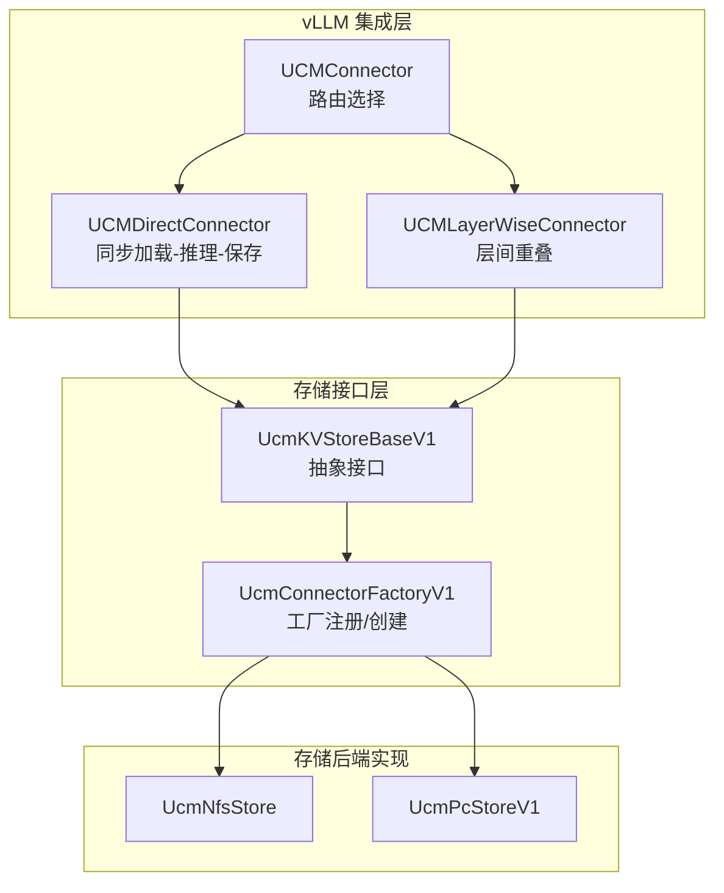
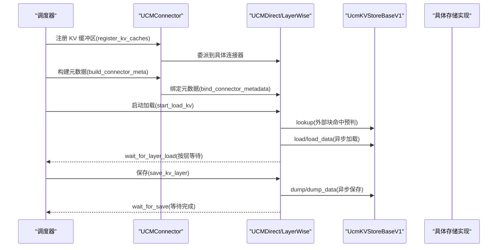
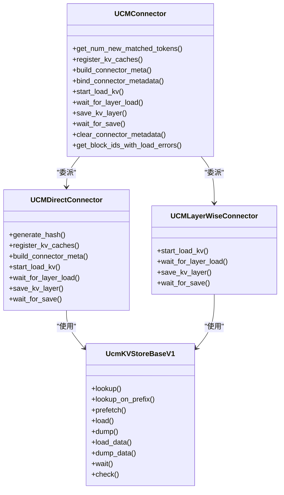
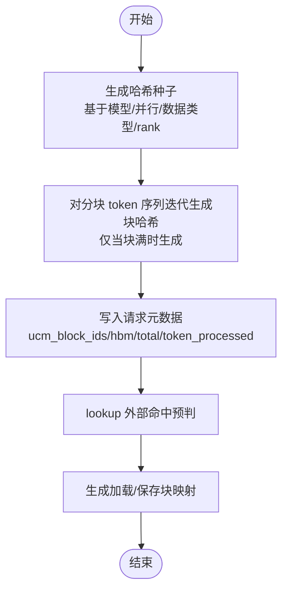
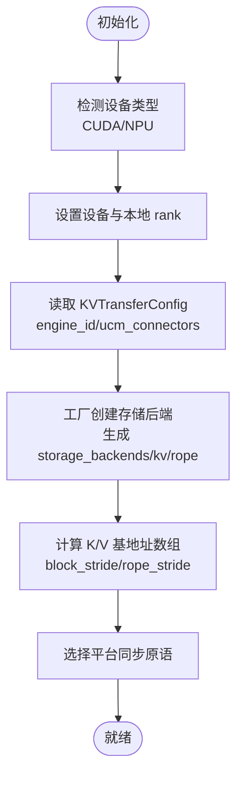
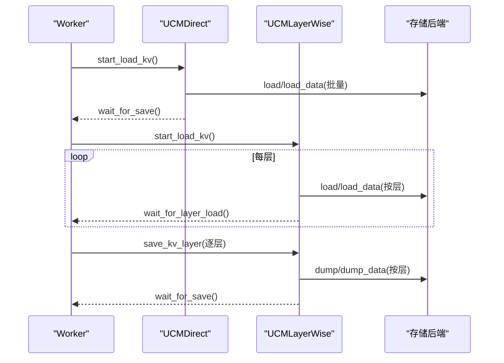
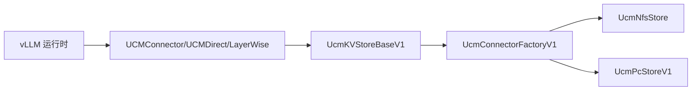

# 连接器架构

<cite>
**本文引用的文件**
- [ucm/integration/vllm/ucm_connector.py](file://ucm/integration/vllm/ucm_connector.py)
- [ucm/store/ucmstore_v1.py](file://ucm/store/ucmstore_v1.py)
- [ucm/store/factory_v1.py](file://ucm/store/factory_v1.py)
- [ucm/store/nfsstore/nfsstore_connector.py](file://ucm/store/nfsstore/nfsstore_connector.py)
- [ucm/store/pcstore/pcstore_connector_v1.py](file://ucm/store/pcstore/pcstore_connector_v1.py)
- [examples/ucm_config_example.yaml](file://examples/ucm_config_example.yaml)
- [test/test_ucm_connector_save_load.py](file://test/test_ucm_connector_save_load.py)
</cite>

## 目录
1. [引言](#引言)
2. [项目结构](#项目结构)
3. [核心组件](#核心组件)
4. [架构总览](#架构总览)
5. [详细组件分析](#详细组件分析)
6. [依赖关系分析](#依赖关系分析)
7. [性能考量](#性能考量)
8. [故障排查指南](#故障排查指南)
9. [结论](#结论)
10. [附录](#附录)

## 引言
本技术文档聚焦于统一缓存管理（Unified Cache Management, UCM）在 vLLM 集成中的连接器架构，系统性阐述 KVConnectorBase_V1 的继承体系与核心接口，详解 UCMDirectConnector 与 UCMLayerWiseConnector 的工作模式差异（同步加载-推理-保存 vs 层间重叠），并覆盖初始化流程、配置参数、设备抽象、请求元数据管理、块 ID 生成与哈希算法、连接器选择指南与性能对比，以及配置示例与最佳实践。

## 项目结构
UCM 连接器位于 vLLM 集成层，围绕 KVConnectorBase_V1 抽象构建，通过工厂模式动态创建具体存储后端（如 NFS、PC 等）。关键模块职责如下：
- 连接器实现：ucm/integration/vllm/ucm_connector.py
- 存储后端接口：ucm/store/ucmstore_v1.py
- 工厂注册与创建：ucm/store/factory_v1.py
- 典型存储后端实现：nfsstore、pcstore
- 示例配置：examples/ucm_config_example.yaml
- 性能测试用例：test/test_ucm_connector_save_load.py

图表来源
- [ucm/integration/vllm/ucm_connector.py](file://ucm/integration/vllm/ucm_connector.py#L909-L1080)
- [ucm/store/ucmstore_v1.py](file://ucm/store/ucmstore_v1.py#L41-L202)
- [ucm/store/factory_v1.py](file://ucm/store/factory_v1.py#L34-L66)

章节来源
- [ucm/integration/vllm/ucm_connector.py](file://ucm/integration/vllm/ucm_connector.py#L1-L120)
- [ucm/store/ucmstore_v1.py](file://ucm/store/ucmstore_v1.py#L1-L60)
- [ucm/store/factory_v1.py](file://ucm/store/factory_v1.py#L1-L66)

## 核心组件
- KVConnectorBase_V1 抽象：定义连接器生命周期与接口契约（注册 KV 缓冲区、构建元数据、启动加载/等待加载、保存/等待保存等）。
- UCMConnector：根据配置动态选择 UCMDirectConnector 或 UCMLayerWiseConnector，作为对外统一入口。
- UCMDirectConnector：严格同步的“加载-推理-保存”流水线，适合通用场景与简单部署。
- UCMLayerWiseConnector：按层重叠执行加载/保存，提升吞吐与带宽利用率，适用于高并发与大模型场景。
- UcmKVStoreBaseV1：存储后端抽象，定义 lookup、load/dump、load_data/dump_data、wait/check 等方法。
- UcmConnectorFactoryV1：基于名称注册并创建具体存储后端实例。

章节来源
- [ucm/integration/vllm/ucm_connector.py](file://ucm/integration/vllm/ucm_connector.py#L82-L166)
- [ucm/integration/vllm/ucm_connector.py](file://ucm/integration/vllm/ucm_connector.py#L661-L833)
- [ucm/integration/vllm/ucm_connector.py](file://ucm/integration/vllm/ucm_connector.py#L909-L1080)
- [ucm/store/ucmstore_v1.py](file://ucm/store/ucmstore_v1.py#L41-L202)
- [ucm/store/factory_v1.py](file://ucm/store/factory_v1.py#L34-L66)

## 架构总览
下图展示从 vLLM 调度到存储后端的完整调用链路与数据流：

图表来源
- [ucm/integration/vllm/ucm_connector.py](file://ucm/integration/vllm/ucm_connector.py#L397-L447)
- [ucm/integration/vllm/ucm_connector.py](file://ucm/integration/vllm/ucm_connector.py#L488-L644)
- [ucm/integration/vllm/ucm_connector.py](file://ucm/integration/vllm/ucm_connector.py#L661-L833)
- [ucm/store/ucmstore_v1.py](file://ucm/store/ucmstore_v1.py#L102-L180)

## 详细组件分析

### 继承体系与核心接口
- KVConnectorBase_V1：定义连接器基类接口，UCMConnector 作为外观模式封装，内部委派给 UCMDirectConnector 或 UCMLayerWiseConnector。
- UCMConnectorMetadata：承载每请求的块 ID 映射与调度信息，用于构建连接器元数据。
- UcmKVStoreBaseV1：定义存储后端统一接口，支持高层 API（load/dump）与低层 API（load_data/dump_data），并提供任务等待/轮询能力。

图表来源
- [ucm/integration/vllm/ucm_connector.py](file://ucm/integration/vllm/ucm_connector.py#L82-L166)
- [ucm/integration/vllm/ucm_connector.py](file://ucm/integration/vllm/ucm_connector.py#L661-L833)
- [ucm/integration/vllm/ucm_connector.py](file://ucm/integration/vllm/ucm_connector.py#L909-L1080)
- [ucm/store/ucmstore_v1.py](file://ucm/store/ucmstore_v1.py#L41-L202)

章节来源
- [ucm/integration/vllm/ucm_connector.py](file://ucm/integration/vllm/ucm_connector.py#L60-L166)
- [ucm/store/ucmstore_v1.py](file://ucm/store/ucmstore_v1.py#L41-L202)

### 请求元数据管理与块 ID 生成
- 请求元数据结构：记录每个请求的 vLLM 块 ID、UCM 块 ID 列表、HBM 命中块数、总命中块数、已处理 token 数等。
- 块 ID 生成：基于输入数据与元信息（模型、并行规模、数据类型、rank）计算 MD5 哈希，形成稳定且可复现的块标识；支持分块 token 序列的链式哈希以保证连续性。
- 命中判定与调度：通过 lookup 预判外部命中，结合 HBM 命中与外部命中，生成加载/保存的块 ID 对应关系，驱动后续异步传输。

图表来源
- [ucm/integration/vllm/ucm_connector.py](file://ucm/integration/vllm/ucm_connector.py#L65-L80)
- [ucm/integration/vllm/ucm_connector.py](file://ucm/integration/vllm/ucm_connector.py#L167-L185)
- [ucm/integration/vllm/ucm_connector.py](file://ucm/integration/vllm/ucm_connector.py#L293-L348)
- [ucm/integration/vllm/ucm_connector.py](file://ucm/integration/vllm/ucm_connector.py#L355-L396)

章节来源
- [ucm/integration/vllm/ucm_connector.py](file://ucm/integration/vllm/ucm_connector.py#L41-L58)
- [ucm/integration/vllm/ucm_connector.py](file://ucm/integration/vllm/ucm_connector.py#L65-L80)
- [ucm/integration/vllm/ucm_connector.py](file://ucm/integration/vllm/ucm_connector.py#L293-L348)

### 设备抽象与初始化流程
- 设备检测：优先 CUDA，其次 NPU，其他平台不支持；根据 world group 的 local rank 与当前平台设置设备。
- 初始化参数：从 vLLM 的 KVTransferConfig 中读取引擎 ID、连接器配置列表；为每个连接器生成 storage_backends 子目录（kv/rope）；根据是否共享缓冲（DSA/MLA）决定 shard 参数与本地 rank 尺寸。
- 同步原语：根据平台选择对应的流同步函数，确保跨层保存前的数据一致性。
- 指针基地址：为 K/V 缓冲区计算基地址数组，用于按层/张量生成目标地址矩阵，支撑 load_data/dump_data 的零拷贝直传。

图表来源
- [ucm/integration/vllm/ucm_connector.py](file://ucm/integration/vllm/ucm_connector.py#L88-L166)
- [ucm/integration/vllm/ucm_connector.py](file://ucm/integration/vllm/ucm_connector.py#L187-L221)
- [ucm/integration/vllm/ucm_connector.py](file://ucm/integration/vllm/ucm_connector.py#L253-L292)

章节来源
- [ucm/integration/vllm/ucm_connector.py](file://ucm/integration/vllm/ucm_connector.py#L88-L166)
- [ucm/integration/vllm/ucm_connector.py](file://ucm/integration/vllm/ucm_connector.py#L187-L221)
- [ucm/integration/vllm/ucm_connector.py](file://ucm/integration/vllm/ucm_connector.py#L253-L292)

### 工作模式差异：UCMDirectConnector vs UCMLayerWiseConnector
- UCMDirectConnector（同步加载-推理-保存）
  - 加载阶段：按请求批量发起 load/load_data，等待所有任务完成。
  - 推理阶段：直接使用已加载的 KV 数据。
  - 保存阶段：在每层结束后按层或整体会聚，发起 dump/dump_data 并等待完成。
- UCMLayerWiseConnector（层间重叠）
  - 加载阶段：逐层提交 load/load_data 任务，按层等待完成。
  - 推理阶段：每层完成后立即进入下一层加载，实现层间重叠。
  - 保存阶段：逐层提交 dump/dump_data，按层等待完成，避免跨层覆盖。

图表来源
- [ucm/integration/vllm/ucm_connector.py](file://ucm/integration/vllm/ucm_connector.py#L488-L644)
- [ucm/integration/vllm/ucm_connector.py](file://ucm/integration/vllm/ucm_connector.py#L661-L833)

章节来源
- [ucm/integration/vllm/ucm_connector.py](file://ucm/integration/vllm/ucm_connector.py#L82-L166)
- [ucm/integration/vllm/ucm_connector.py](file://ucm/integration/vllm/ucm_connector.py#L661-L833)

### 存储后端接口与工厂
- UcmKVStoreBaseV1：统一的存储后端接口，支持高层 API（load/dump）与低层 API（load_data/dump_data），并提供 wait/check。
- UcmConnectorFactoryV1：通过名称注册具体存储实现，按配置创建实例；支持 NFS、PC 等后端。
- 典型实现：
  - UcmNfsStore：面向网络文件系统的 KV 缓存存储，提供 batch 查找、加载、转储与等待。
  - UcmPcStoreV1：面向高性能本地存储的 KV 缓存存储，支持扁平化张量指针打包与低层地址直传。

章节来源
- [ucm/store/ucmstore_v1.py](file://ucm/store/ucmstore_v1.py#L41-L202)
- [ucm/store/factory_v1.py](file://ucm/store/factory_v1.py#L34-L66)
- [ucm/store/nfsstore/nfsstore_connector.py](file://ucm/store/nfsstore/nfsstore_connector.py#L39-L132)
- [ucm/store/pcstore/pcstore_connector_v1.py](file://ucm/store/pcstore/pcstore_connector_v1.py#L40-L248)

## 依赖关系分析
- 连接器依赖 vLLM 的 KVConnectorRole、VllmConfig、SchedulerOutput 等运行时上下文。
- 存储后端通过工厂按名称动态创建，降低耦合度，便于扩展新后端。
- 指针地址计算与张量布局紧密相关，需与 vLLM 的 KV 缓冲区布局保持一致。

图表来源
- [ucm/integration/vllm/ucm_connector.py](file://ucm/integration/vllm/ucm_connector.py#L1-L38)
- [ucm/store/factory_v1.py](file://ucm/store/factory_v1.py#L34-L66)
- [ucm/store/ucmstore_v1.py](file://ucm/store/ucmstore_v1.py#L41-L202)

章节来源
- [ucm/integration/vllm/ucm_connector.py](file://ucm/integration/vllm/ucm_connector.py#L1-L38)
- [ucm/store/factory_v1.py](file://ucm/store/factory_v1.py#L34-L66)

## 性能考量
- 带宽与延迟：通过 metrics 统计加载/保存的请求数、块数、耗时与速率；结合不同后端与参数（如 IO 直通、流数量、缓冲数量）进行对比。
- 层间重叠收益：UCMLayerWiseConnector 在多层模型上可减少空闲，提高设备利用率；但需注意跨层等待与错误传播。
- 模型与布局：MLA/DSA/GQA 等布局影响 K/V 指针与 rope 分离，进而影响存储后端的组织与传输路径。
- 测试验证：提供独立脚本对保存/加载进行带宽测试，覆盖不同模型、头数、块大小与流数量组合。

章节来源
- [ucm/integration/vllm/ucm_connector.py](file://ucm/integration/vllm/ucm_connector.py#L545-L644)
- [test/test_ucm_connector_save_load.py](file://test/test_ucm_connector_save_load.py#L242-L423)

## 故障排查指南
- 加载失败：捕获存储后端异常，记录无效块 ID，可通过 get_block_ids_with_load_errors 获取并进行降级处理。
- 等待超时：wait/check 接口用于阻塞/轮询等待任务完成；若返回错误，检查设备/后端状态与资源配额。
- 错误传播：在层间等待时，索引越界或任务句柄异常需定位到具体层与请求，避免全局阻塞。

章节来源
- [ucm/integration/vllm/ucm_connector.py](file://ucm/integration/vllm/ucm_connector.py#L522-L544)
- [ucm/integration/vllm/ucm_connector.py](file://ucm/integration/vllm/ucm_connector.py#L722-L750)
- [ucm/store/ucmstore_v1.py](file://ucm/store/ucmstore_v1.py#L182-L202)

## 结论
UCM 连接器通过清晰的抽象与工厂化设计，实现了与 vLLM 的深度集成与多存储后端的灵活适配。UCMDirectConnector 提供稳定可靠的同步流水线，UCMLayerWiseConnector 则在复杂场景下通过层间重叠显著提升性能。结合完善的元数据管理、哈希算法与设备抽象，UCM 能够在多样化硬件与存储环境中高效运行。

## 附录

### 连接器选择指南
- 通用场景：优先 UCMDirectConnector，部署简单、行为可预测。
- 高并发/大模型：推荐 UCMLayerWiseConnector，充分利用层间重叠提升吞吐。
- 实验与调试：可使用 UCMMockConnector 控制命中率，评估系统在不同命中比下的表现。

章节来源
- [ucm/integration/vllm/ucm_connector.py](file://ucm/integration/vllm/ucm_connector.py#L909-L1080)
- [ucm/integration/vllm/ucm_connector.py](file://ucm/integration/vllm/ucm_connector.py#L836-L868)
- [ucm/integration/vllm/ucm_connector.py](file://ucm/integration/vllm/ucm_connector.py#L870-L907)

### 配置示例与最佳实践
- 示例配置文件展示了如何指定连接器名称与存储后端路径、启用直通 IO 等参数。
- 最佳实践建议：
  - 合理设置块大小与并行规模，使块粒度与模型 head/维度匹配。
  - 在多 rank 场景下开启共享缓冲（DSA/MLA）以减少重复传输。
  - 根据存储后端能力调整流数量与缓冲数量，平衡吞吐与内存占用。
  - 使用 metrics 配置在线监控加载/保存速率与命中率，持续优化。

章节来源
- [examples/ucm_config_example.yaml](file://examples/ucm_config_example.yaml#L10-L38)
- [ucm/integration/vllm/ucm_connector.py](file://ucm/integration/vllm/ucm_connector.py#L187-L221)
- [ucm/store/pcstore/pcstore_connector_v1.py](file://ucm/store/pcstore/pcstore_connector_v1.py#L40-L68)