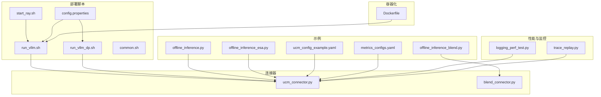
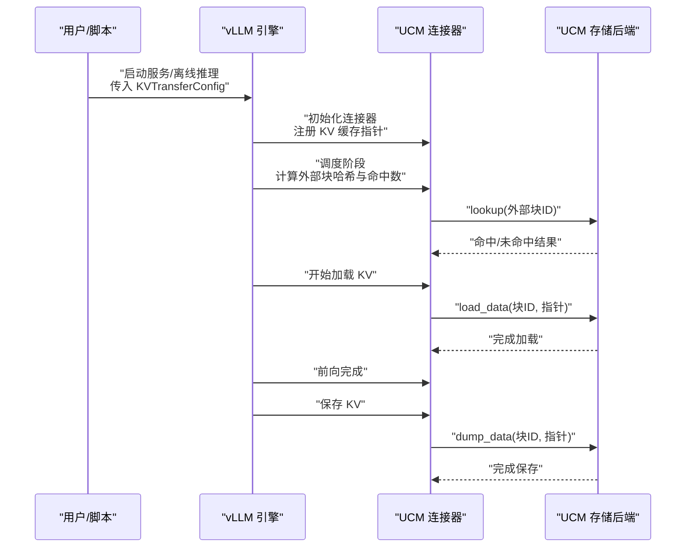
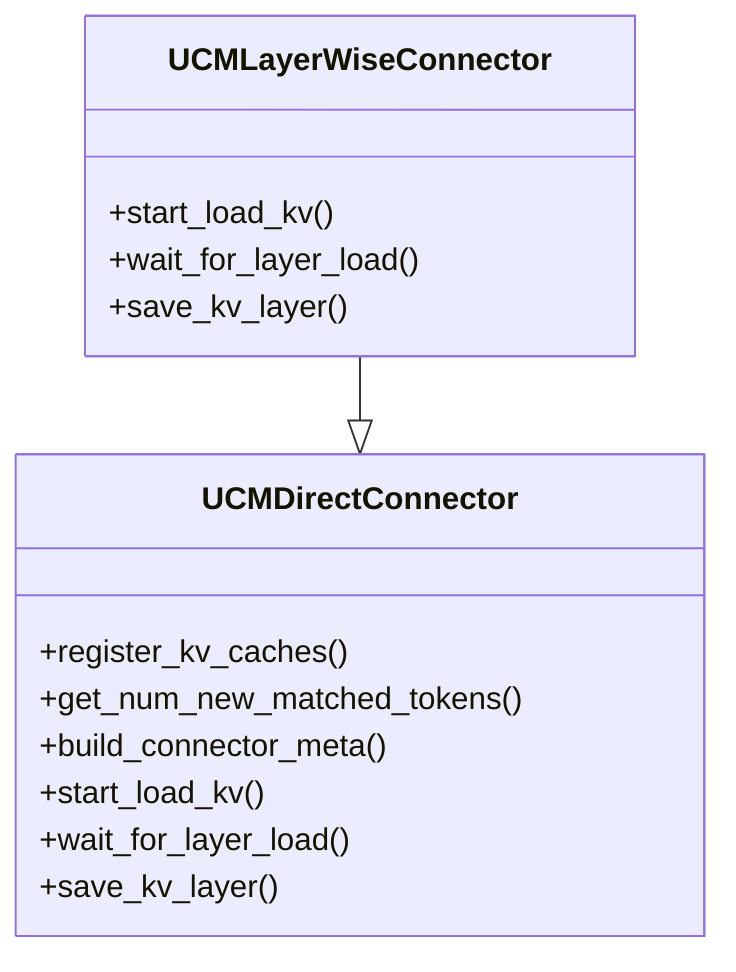
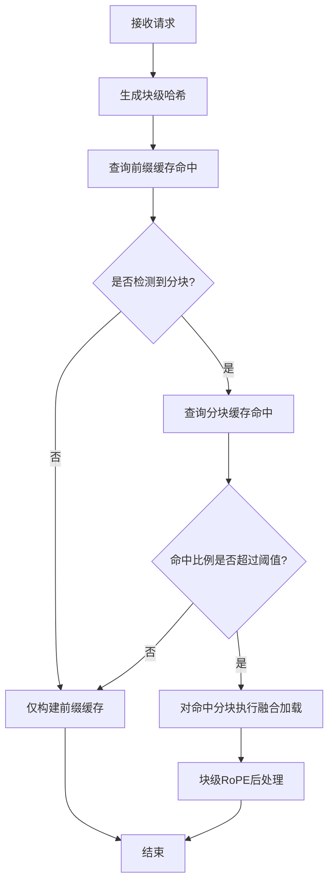
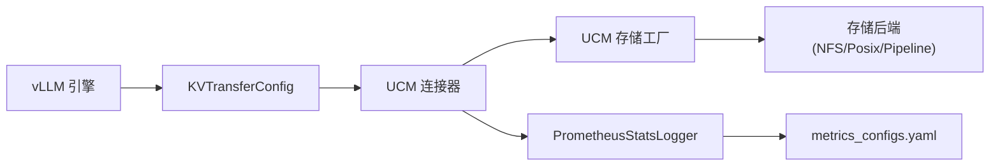

# 集成示例

<cite>
**本文引用的文件**
- [examples/deployments/scripts/vllm/run_vllm.sh](file://examples/deployments/scripts/vllm/run_vllm.sh)
- [examples/deployments/scripts/vllm/run_vllm_dp.sh](file://examples/deployments/scripts/vllm/run_vllm_dp.sh)
- [examples/deployments/scripts/vllm/start_ray.sh](file://examples/deployments/scripts/vllm/start_ray.sh)
- [examples/deployments/scripts/vllm/common.sh](file://examples/deployments/scripts/vllm/common.sh)
- [examples/deployments/scripts/vllm/config.properties](file://examples/deployments/scripts/vllm/config.properties)
- [examples/offline_inference.py](file://examples/offline_inference.py)
- [examples/offline_inference_blend.py](file://examples/offline_inference_blend.py)
- [examples/offline_inference_esa.py](file://examples/offline_inference_esa.py)
- [examples/metrics/metrics_configs.yaml](file://examples/metrics/metrics_configs.yaml)
- [examples/ucm_config_example.yaml](file://examples/ucm_config_example.yaml)
- [ucm/integration/vllm/ucm_connector.py](file://ucm/integration/vllm/ucm_connector.py)
- [ucm/integration/vllm/blend_connector.py](file://ucm/integration/vllm/blend_connector.py)
- [benchmarks/logging_perf_test.py](file://benchmarks/logging_perf_test.py)
- [benchmarks/trace_replay.py](file://benchmarks/trace_replay.py)
- [docker/Dockerfile](file://docker/Dockerfile)
</cite>

## 目录
1. [简介](#简介)
2. [项目结构](#项目结构)
3. [核心组件](#核心组件)
4. [架构总览](#架构总览)
5. [详细组件分析](#详细组件分析)
6. [依赖关系分析](#依赖关系分析)
7. [性能考量](#性能考量)
8. [故障排查指南](#故障排查指南)
9. [结论](#结论)
10. [附录](#附录)

## 简介
本文件面向希望在 vLLM 中集成 UCM（Unified Cache Management）的工程团队，提供从基础连接器到缓存融合再到高级优化的完整实践指南。内容覆盖：
- 基础连接器配置、缓存融合配置与高级优化配置
- 不同连接器模式的使用场景与配置要点
- 离线推理示例、性能测试脚本与部署脚本的详细解析
- 配置参数的含义、默认值与推荐设置
- 常见集成问题的排查方法与解决方案
- 完整部署流程、监控配置与性能调优建议

## 项目结构
该仓库提供了多种运行模式与示例：
- 部署脚本：支持单机/多机、Ray 多节点、Ascend 多数据并行等场景
- 连接器实现：UCM 基础连接器与缓存融合连接器（如 Blend）
- 离线推理示例：涵盖通用 KV 缓存与稀疏注意力（ESA、CacheBlend 等）
- 性能测试：日志性能对比与请求轨迹回放压测
- 监控配置：Prometheus/Grafana 指标配置样例

**图表来源**
- [examples/deployments/scripts/vllm/run_vllm.sh](file://examples/deployments/scripts/vllm/run_vllm.sh#L1-L116)
- [examples/deployments/scripts/vllm/run_vllm_dp.sh](file://examples/deployments/scripts/vllm/run_vllm_dp.sh#L1-L153)
- [examples/deployments/scripts/vllm/start_ray.sh](file://examples/deployments/scripts/vllm/start_ray.sh#L1-L57)
- [examples/deployments/scripts/vllm/common.sh](file://examples/deployments/scripts/vllm/common.sh#L1-L79)
- [examples/deployments/scripts/vllm/config.properties](file://examples/deployments/scripts/vllm/config.properties#L1-L92)
- [examples/offline_inference.py](file://examples/offline_inference.py#L1-L112)
- [examples/offline_inference_blend.py](file://examples/offline_inference_blend.py#L1-L273)
- [examples/offline_inference_esa.py](file://examples/offline_inference_esa.py#L1-L176)
- [examples/ucm_config_example.yaml](file://examples/ucm_config_example.yaml#L1-L39)
- [examples/metrics/metrics_configs.yaml](file://examples/metrics/metrics_configs.yaml#L1-L51)
- [ucm/integration/vllm/ucm_connector.py](file://ucm/integration/vllm/ucm_connector.py#L1-L800)
- [ucm/integration/vllm/blend_connector.py](file://ucm/integration/vllm/blend_connector.py#L1-L499)
- [benchmarks/logging_perf_test.py](file://benchmarks/logging_perf_test.py#L1-L181)
- [benchmarks/trace_replay.py](file://benchmarks/trace_replay.py#L1-L748)
- [docker/Dockerfile](file://docker/Dockerfile#L1-L20)

**章节来源**
- [examples/deployments/scripts/vllm/run_vllm.sh](file://examples/deployments/scripts/vllm/run_vllm.sh#L1-L116)
- [examples/deployments/scripts/vllm/run_vllm_dp.sh](file://examples/deployments/scripts/vllm/run_vllm_dp.sh#L1-L153)
- [examples/deployments/scripts/vllm/start_ray.sh](file://examples/deployments/scripts/vllm/start_ray.sh#L1-L57)
- [examples/deployments/scripts/vllm/common.sh](file://examples/deployments/scripts/vllm/common.sh#L1-L79)
- [examples/deployments/scripts/vllm/config.properties](file://examples/deployments/scripts/vllm/config.properties#L1-L92)

## 核心组件
- UCM 基础连接器（UCMDirectConnector/UCMLayerWiseConnector）
  - 负责 KV 缓存块的哈希生成、查找、加载与保存
  - 支持直接同步与逐层重叠两种调度模式
  - 支持 MLA/DSA 等特殊模型的 K/V 分离处理
- UCM 缓存融合连接器（UCMBlendConnector）
  - 在前缀缓存与分块缓存之间进行融合决策
  - 对命中分块的请求执行增量 RoPE 后处理以提升首 token 时间
- 配置系统
  - 通过 KVTransferConfig 与额外配置传递 UCM 参数
  - YAML 示例配置文件演示存储后端、指标与稀疏注意力配置

**章节来源**
- [ucm/integration/vllm/ucm_connector.py](file://ucm/integration/vllm/ucm_connector.py#L82-L800)
- [ucm/integration/vllm/blend_connector.py](file://ucm/integration/vllm/blend_connector.py#L121-L499)
- [examples/ucm_config_example.yaml](file://examples/ucm_config_example.yaml#L1-L39)

## 架构总览
下图展示了 vLLM 与 UCM 的集成路径：启动时通过 KVTransferConfig 注入 UCM 连接器模块与角色；运行时连接器负责在调度阶段计算需要加载/保存的块 ID，并在前向阶段按需加载与保存 KV 缓存。

**图表来源**
- [ucm/integration/vllm/ucm_connector.py](file://ucm/integration/vllm/ucm_connector.py#L397-L644)
- [examples/deployments/scripts/vllm/run_vllm.sh](file://examples/deployments/scripts/vllm/run_vllm.sh#L99-L107)
- [examples/offline_inference.py](file://examples/offline_inference.py#L18-L44)

## 详细组件分析

### 基础连接器（UCM 基础/逐层）
- 关键职责
  - 块哈希生成：基于请求输入与引擎元信息生成稳定块 ID
  - 命中计算：区分 HBM 命中与外部存储命中，决定新令牌数量
  - 请求分发元数据：为每个请求维护加载/保存块 ID 列表
  - 数据传输：按块 ID 与基地址生成指针，调用存储后端加载/保存
- 模式选择
  - 直接同步（UCMDirectConnector）：load -> forward -> save 顺序执行
  - 逐层重叠（UCMLayerWiseConnector）：按层交错加载/保存，提升并发度
- 设备适配
  - 自动识别 CUDA/NPU 平台，同步流以保证可见性

**图表来源**
- [ucm/integration/vllm/ucm_connector.py](file://ucm/integration/vllm/ucm_connector.py#L82-L800)

**章节来源**
- [ucm/integration/vllm/ucm_connector.py](file://ucm/integration/vllm/ucm_connector.py#L82-L800)

### 缓存融合连接器（Blend）
- 场景与目标
  - 针对长上下文与分块检索问答任务，优先构建前缀缓存，对命中分块执行增量融合
  - 当分块命中比例低于阈值时，回退为前缀缓存
- 工作流
  - 请求预处理：切分文本块，生成块级哈希
  - 命中评估：先查前缀缓存，再查分块缓存
  - 元数据生成：仅对命中分块发起加载，其余走重算
  - 后处理：对命中分块执行块级 RoPE 变换

**图表来源**
- [ucm/integration/vllm/blend_connector.py](file://ucm/integration/vllm/blend_connector.py#L148-L404)

**章节来源**
- [ucm/integration/vllm/blend_connector.py](file://ucm/integration/vllm/blend_connector.py#L121-L499)

### 配置与部署

#### 基础连接器配置
- KVTransferConfig
  - kv_connector: 连接器类名（如 "UCMConnector"）
  - kv_connector_module_path: 连接器模块路径（如 "ucm.integration.vllm.ucm_connector"）
  - kv_role: 角色（如 "kv_both"）
  - kv_connector_extra_config: 额外配置（包含 UCM 配置文件路径或内联配置）
- YAML 示例
  - ucm_connectors: 存储后端列表（如 NFS/管道/Posix 等）
  - metrics_config_path: 指标配置文件路径（启用 Prometheus/Grafana）
  - ucm_sparse_config: 稀疏注意力配置（ESA/GSA/KVStar 等）

**章节来源**
- [examples/offline_inference.py](file://examples/offline_inference.py#L18-L44)
- [examples/ucm_config_example.yaml](file://examples/ucm_config_example.yaml#L10-L39)

#### 缓存融合配置
- 内联配置（离线示例）
  - ucm_connectors: 存储后端配置
  - ucm_sparse_config.Blend.chunk_end_token_id: 分块结束标记
  - compute_meta: 按层指定稀疏比率等参数
- YAML 示例
  - 通过 UCM 配置文件指定存储后端与指标路径

**章节来源**
- [examples/offline_inference_blend.py](file://examples/offline_inference_blend.py#L87-L135)
- [examples/ucm_config_example.yaml](file://examples/ucm_config_example.yaml#L17-L39)

#### 高级优化配置
- 图执行与编译
  - graph_mode: 控制图模式（如 FULL_DECODE_ONLY）
- 推测解码
  - enable_speculative_decoding: 开启推测解码
  - speculative_config: 指定推测模型、token 数与方法
- Ascend 特殊配置
  - enable_ascend_scheduler: 启用 Ascend 调度器
  - torchair_graph_config: 启用 TorchAir 图优化

**章节来源**
- [examples/deployments/scripts/vllm/run_vllm.sh](file://examples/deployments/scripts/vllm/run_vllm.sh#L81-L97)
- [examples/deployments/scripts/vllm/config.properties](file://examples/deployments/scripts/vllm/config.properties#L70-L82)

#### 部署脚本与环境变量
- 单机/多机
  - run_vllm.sh：读取 config.properties，拼装 vllm serve 命令，注入 KVTransferConfig
  - run_vllm_dp.sh：多数据并行场景，设置 HCCL/NCCL 网络接口与本地并行大小
  - start_ray.sh：Ray 多节点启动，设置网络接口与 GPU 数量
- 环境变量
  - CUDA_VISIBLE_DEVICES/ASCEND_RT_VISIBLE_DEVICES：设备可见性
  - RAY_*：Ray 与分布式执行相关变量
  - VLLM_*：vLLM 行为控制变量（如日志级别、图执行等）

**章节来源**
- [examples/deployments/scripts/vllm/run_vllm.sh](file://examples/deployments/scripts/vllm/run_vllm.sh#L1-L116)
- [examples/deployments/scripts/vllm/run_vllm_dp.sh](file://examples/deployments/scripts/vllm/run_vllm_dp.sh#L1-L153)
- [examples/deployments/scripts/vllm/start_ray.sh](file://examples/deployments/scripts/vllm/start_ray.sh#L1-L57)
- [examples/deployments/scripts/vllm/common.sh](file://examples/deployments/scripts/vllm/common.sh#L1-L79)
- [examples/deployments/scripts/vllm/config.properties](file://examples/deployments/scripts/vllm/config.properties#L1-L92)

### 离线推理示例解析

#### 通用 KV 缓存离线推理
- 功能：通过 KVTransferConfig 注入 UCM 连接器，执行两次相同提示的生成，验证缓存复用
- 关键点：禁用前缀缓存，强制外部加载；设置块大小与内存利用率

**章节来源**
- [examples/offline_inference.py](file://examples/offline_inference.py#L18-L112)

#### CacheBlend/分块缓存离线推理
- 功能：构造分块上下文，先缓存各分块，再进行融合推理，对比无缓存、前缀缓存与融合缓存的耗时
- 关键点：分块结束标记、padding 策略、RoPE 后处理

**章节来源**
- [examples/offline_inference_blend.py](file://examples/offline_inference_blend.py#L87-L273)

#### ESA 稀疏注意力离线推理
- 功能：启用稀疏注意力（ESA），结合管道存储后端进行 KV 缓存
- 关键点：ucm_sparse_config.ESA 参数、等待队列深度、分层加载

**章节来源**
- [examples/offline_inference_esa.py](file://examples/offline_inference_esa.py#L63-L176)

### 性能测试脚本解析

#### 日志性能对比
- 目的：对比 Python logging 与 pybind11 spdlog_logger 的开销
- 方法：多线程并发记录，统计每调用耗时与差异百分比

**章节来源**
- [benchmarks/logging_perf_test.py](file://benchmarks/logging_perf_test.py#L102-L181)

#### 请求轨迹回放压测
- 目的：按时间戳回放真实请求轨迹，计算吞吐、TTFT、TPOT、ITL、E2EL 等指标
- 方法：解析 trace 文件生成 prompts，按时间差并发发送请求，汇总指标并导出 Excel

**章节来源**
- [benchmarks/trace_replay.py](file://benchmarks/trace_replay.py#L461-L748)

## 依赖关系分析
- vLLM 引擎通过 KVTransferConfig 与连接器交互
- 连接器依赖 UCM 存储工厂与存储后端（NFS/Pipeline/Posix 等）
- 指标系统通过 PrometheusStatsLogger 与 metrics_configs.yaml 配置

**图表来源**
- [ucm/integration/vllm/ucm_connector.py](file://ucm/integration/vllm/ucm_connector.py#L125-L156)
- [examples/metrics/metrics_configs.yaml](file://examples/metrics/metrics_configs.yaml#L1-L51)

**章节来源**
- [ucm/integration/vllm/ucm_connector.py](file://ucm/integration/vllm/ucm_connector.py#L125-L156)
- [examples/metrics/metrics_configs.yaml](file://examples/metrics/metrics_configs.yaml#L1-L51)

## 性能考量
- 块大小与内存利用率
  - 块大小过小增加管理开销，过大影响命中粒度；GPU 内存利用率过高可能导致 OOM
- 层级加载策略
  - 逐层重叠可提升带宽利用，但需注意跨层同步与错误传播
- 稀疏注意力
  - ESA/GSA/KVStar 等可显著降低 KV 访问频率，需结合具体模型与数据分布调参
- 指标监控
  - 启用指标配置后，可通过 Grafana 展示加载/保存速率、命中率等关键指标

[本节为通用指导，无需列出具体文件来源]

## 故障排查指南
- 启动失败
  - 检查 config.properties 是否正确设置模型路径、并行规模与网络接口
  - 多节点场景确认 HCCL/NCCL 接口与 IP 绑定一致
- UCM 未生效
  - 确认 KVTransferConfig 中 kv_connector 与模块路径正确
  - 若使用 YAML，确保 UCM 配置文件路径存在且格式正确
- 加载/保存异常
  - 查看日志中的 load/save 速度与耗时，定位存储后端瓶颈
  - 检查存储后端权限与磁盘空间
- 指标缺失
  - 确认 metrics_config_path 正确，Prometheus 多进程目录可写

**章节来源**
- [examples/deployments/scripts/vllm/run_vllm.sh](file://examples/deployments/scripts/vllm/run_vllm.sh#L9-L17)
- [examples/deployments/scripts/vllm/run_vllm_dp.sh](file://examples/deployments/scripts/vllm/run_vllm_dp.sh#L36-L47)
- [examples/metrics/metrics_configs.yaml](file://examples/metrics/metrics_configs.yaml#L1-L51)

## 结论
通过本集成示例，可在 vLLM 中无缝启用 UCM 的 KV 缓存与缓存融合能力，并结合稀疏注意力进一步优化长上下文推理性能。配合完善的监控与压测工具，可快速定位瓶颈并持续优化系统表现。

[本节为总结性内容，无需列出具体文件来源]

## 附录

### 配置参数速查与推荐
- 基础参数
  - model：模型路径
  - tp_size/dp_size/pp_size：张量/数据/流水并行规模
  - gpu_memory_utilization：GPU 内存利用率
  - block_size：块大小
- 高级参数
  - graph_mode：图执行模式
  - enable_speculative_decoding/speculative_config：推测解码
  - enable_ascend_scheduler/enable_torchair_graph：Ascend 优化
- UCM 参数
  - ucm_connectors：存储后端配置
  - metrics_config_path：指标配置文件
  - ucm_sparse_config：稀疏注意力配置

**章节来源**
- [examples/deployments/scripts/vllm/config.properties](file://examples/deployments/scripts/vllm/config.properties#L48-L92)
- [examples/ucm_config_example.yaml](file://examples/ucm_config_example.yaml#L10-L39)

### 容器化与补丁应用
- 使用官方 vLLM 镜像为基础，安装 UCM 并应用 vLLM 适配补丁
- 支持 CUDA 与 ENABLE_SPARSE=true 的构建选项

**章节来源**
- [docker/Dockerfile](file://docker/Dockerfile#L1-L20)