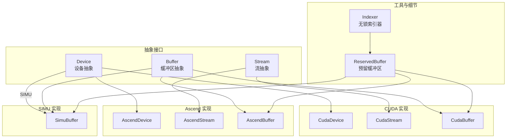
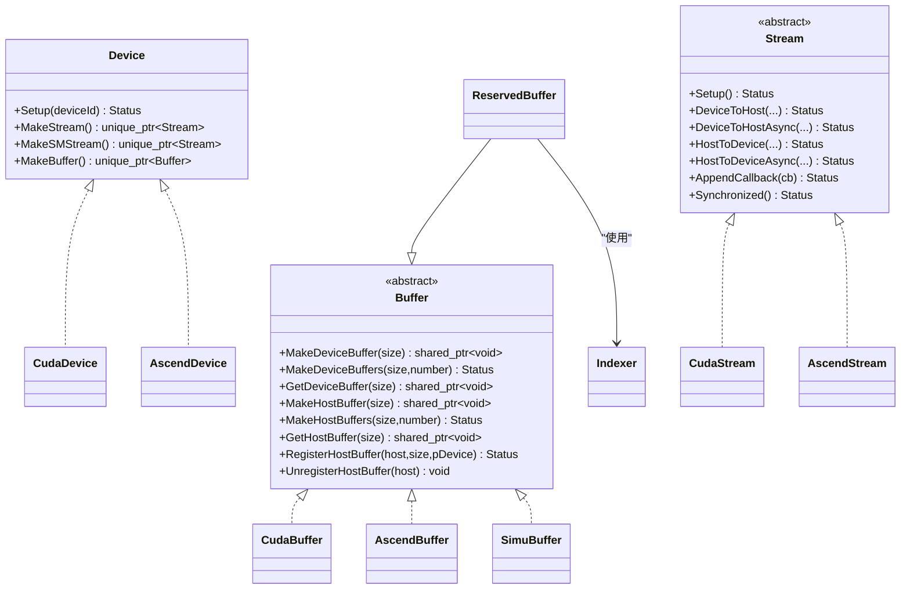
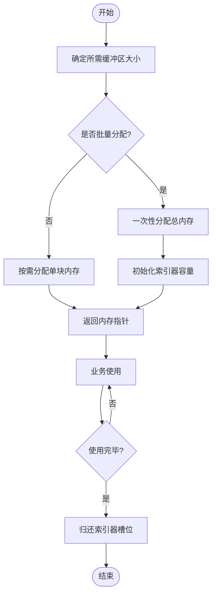
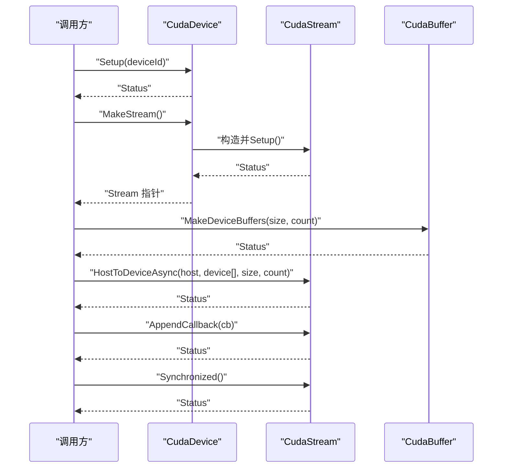
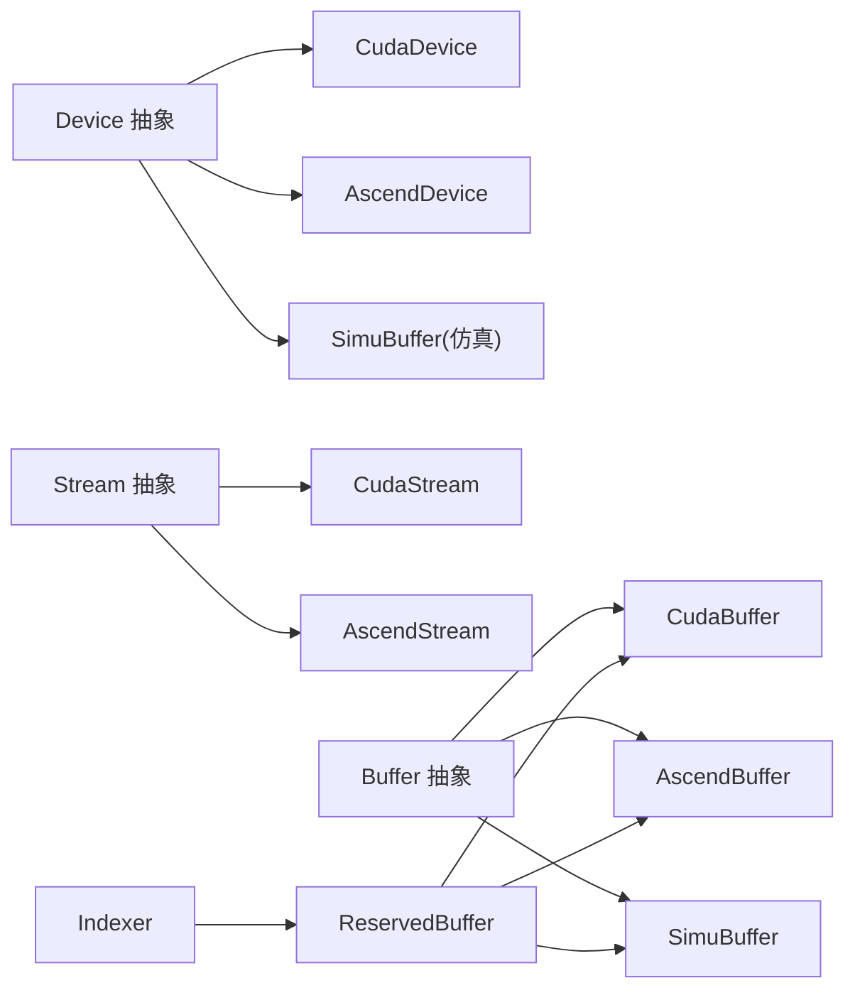

# 传输层抽象

<cite>
**本文引用的文件**
- [ucm/shared/trans/buffer.h](file://ucm/shared/trans/buffer.h)
- [ucm/shared/trans/device.h](file://ucm/shared/trans/device.h)
- [ucm/shared/trans/stream.h](file://ucm/shared/trans/stream.h)
- [ucm/shared/trans/detail/reserved_buffer.h](file://ucm/shared/trans/detail/reserved_buffer.h)
- [ucm/shared/trans/detail/indexer.h](file://ucm/shared/trans/detail/indexer.h)
- [ucm/shared/trans/cuda/cuda_buffer.h](file://ucm/shared/trans/cuda/cuda_buffer.h)
- [ucm/shared/trans/cuda/cuda_buffer.cc](file://ucm/shared/trans/cuda/cuda_buffer.cc)
- [ucm/shared/trans/cuda/cuda_device.cc](file://ucm/shared/trans/cuda/cuda_device.cc)
- [ucm/shared/trans/cuda/cuda_stream.h](file://ucm/shared/trans/cuda/cuda_stream.h)
- [ucm/shared/trans/cuda/cuda_stream.cc](file://ucm/shared/trans/cuda/cuda_stream.cc)
- [ucm/shared/trans/ascend/ascend_buffer.h](file://ucm/shared/trans/ascend/ascend_buffer.h)
- [ucm/shared/trans/ascend/ascend_buffer.cc](file://ucm/shared/trans/ascend/ascend_buffer.cc)
- [ucm/shared/trans/ascend/ascend_device.cc](file://ucm/shared/trans/ascend/ascend_device.cc)
- [ucm/shared/trans/ascend/ascend_stream.h](file://ucm/shared/trans/ascend/ascend_stream.h)
- [ucm/shared/trans/ascend/ascend_stream.cc](file://ucm/shared/trans/ascend/ascend_stream.cc)
- [ucm/shared/trans/simu/simu_buffer.h](file://ucm/shared/trans/simu/simu_buffer.h)
- [ucm/shared/trans/simu/simu_buffer.cc](file://ucm/shared/trans/simu/simu_buffer.cc)
- [ucm/shared/trans/maca/maca_sm_kernel.cu](file://ucm/shared/trans/maca/maca_sm_kernel.cu)
</cite>

## 目录
1. [引言](#引言)
2. [项目结构](#项目结构)
3. [核心组件](#核心组件)
4. [架构总览](#架构总览)
5. [详细组件分析](#详细组件分析)
6. [依赖关系分析](#依赖关系分析)
7. [性能考量](#性能考量)
8. [故障排查指南](#故障排查指南)
9. [结论](#结论)
10. [附录](#附录)

## 引言
本文件系统性阐述 UCM 传输层抽象的设计与实现，覆盖设备抽象、缓冲区管理与流处理机制，并对多硬件平台（CUDA、Ascend、MUSA/MACM、SIMU）进行统一接口设计说明。文档同时给出缓冲区生命周期管理策略、异步执行与事件同步流程、错误处理与性能优化建议，帮助读者在不同 GPU 架构上获得一致且高效的传输体验。

## 项目结构
传输层位于共享模块中，采用“抽象接口 + 平台实现”的分层组织方式：
- 抽象层：定义通用的设备、流、缓冲区接口，屏蔽底层差异
- 平台实现层：针对 CUDA、Ascend、SIMU 等提供具体实现
- 工具与细节：索引器与预留缓冲区复用框架，提升内存与资源利用率

图表来源
- [ucm/shared/trans/device.h](file://ucm/shared/trans/device.h#L32-L38)
- [ucm/shared/trans/stream.h](file://ucm/shared/trans/stream.h#L32-L53)
- [ucm/shared/trans/buffer.h](file://ucm/shared/trans/buffer.h#L32-L46)
- [ucm/shared/trans/cuda/cuda_device.cc](file://ucm/shared/trans/cuda/cuda_device.cc#L41-L80)
- [ucm/shared/trans/ascend/ascend_device.cc](file://ucm/shared/trans/ascend/ascend_device.cc#L31-L60)
- [ucm/shared/trans/cuda/cuda_stream.h](file://ucm/shared/trans/cuda/cuda_stream.h#L32-L55)
- [ucm/shared/trans/ascend/ascend_stream.h](file://ucm/shared/trans/ascend/ascend_stream.h#L34-L60)
- [ucm/shared/trans/cuda/cuda_buffer.h](file://ucm/shared/trans/cuda/cuda_buffer.h#L31-L35)
- [ucm/shared/trans/ascend/ascend_buffer.h](file://ucm/shared/trans/ascend/ascend_buffer.h#L31-L35)
- [ucm/shared/trans/simu/simu_buffer.h](file://ucm/shared/trans/simu/simu_buffer.h#L31-L35)
- [ucm/shared/trans/detail/reserved_buffer.h](file://ucm/shared/trans/detail/reserved_buffer.h#L33-L95)
- [ucm/shared/trans/detail/indexer.h](file://ucm/shared/trans/detail/indexer.h#L34-L94)

章节来源
- [ucm/shared/trans/device.h](file://ucm/shared/trans/device.h#L32-L38)
- [ucm/shared/trans/stream.h](file://ucm/shared/trans/stream.h#L32-L53)
- [ucm/shared/trans/buffer.h](file://ucm/shared/trans/buffer.h#L32-L46)

## 核心组件
- 设备抽象 Device：负责初始化设备、创建流与缓冲区对象，屏蔽平台差异
- 流抽象 Stream：提供主机与设备之间的同步/异步数据传输、回调注册与同步阻塞
- 缓冲区抽象 Buffer：提供统一的设备/主机内存分配、批量分配与注册/注销接口
- 预留缓冲区 ReservedBuffer 与索引器 Indexer：通过固定大小块的池化复用，降低频繁分配释放带来的开销

章节来源
- [ucm/shared/trans/device.h](file://ucm/shared/trans/device.h#L32-L38)
- [ucm/shared/trans/stream.h](file://ucm/shared/trans/stream.h#L32-L53)
- [ucm/shared/trans/buffer.h](file://ucm/shared/trans/buffer.h#L32-L46)
- [ucm/shared/trans/detail/reserved_buffer.h](file://ucm/shared/trans/detail/reserved_buffer.h#L33-L95)
- [ucm/shared/trans/detail/indexer.h](file://ucm/shared/trans/detail/indexer.h#L34-L94)

## 架构总览
传输层以“工厂式”创建设备、流与缓冲区对象，调用方仅依赖抽象接口即可在不同平台上运行。平台特定实现封装底层 API（如 CUDA/ACL），并遵循统一的生命周期与错误处理规范。

图表来源
- [ucm/shared/trans/device.h](file://ucm/shared/trans/device.h#L32-L38)
- [ucm/shared/trans/stream.h](file://ucm/shared/trans/stream.h#L32-L53)
- [ucm/shared/trans/buffer.h](file://ucm/shared/trans/buffer.h#L32-L46)
- [ucm/shared/trans/cuda/cuda_device.cc](file://ucm/shared/trans/cuda/cuda_device.cc#L41-L80)
- [ucm/shared/trans/ascend/ascend_device.cc](file://ucm/shared/trans/ascend/ascend_device.cc#L31-L60)
- [ucm/shared/trans/cuda/cuda_stream.h](file://ucm/shared/trans/cuda/cuda_stream.h#L32-L55)
- [ucm/shared/trans/ascend/ascend_stream.h](file://ucm/shared/trans/ascend/ascend_stream.h#L34-L60)
- [ucm/shared/trans/cuda/cuda_buffer.h](file://ucm/shared/trans/cuda/cuda_buffer.h#L31-L35)
- [ucm/shared/trans/ascend/ascend_buffer.h](file://ucm/shared/trans/ascend/ascend_buffer.h#L31-L35)
- [ucm/shared/trans/simu/simu_buffer.h](file://ucm/shared/trans/simu/simu_buffer.h#L31-L35)
- [ucm/shared/trans/detail/reserved_buffer.h](file://ucm/shared/trans/detail/reserved_buffer.h#L33-L95)
- [ucm/shared/trans/detail/indexer.h](file://ucm/shared/trans/detail/indexer.h#L34-L94)

## 详细组件分析

### 设备抽象 Device
- 职责
  - 初始化目标设备（设置设备号、CPU 亲和等）
  - 创建流对象（常规流与 SM 专用流）
  - 创建缓冲区对象
- 关键点
  - CUDA 使用 NVML 设置 CPU 亲和，提升 NUMA 性能
  - Ascend 对无效设备号进行显式校验
  - SM 流仅 CUDA 平台提供，Ascend 返回空指针表示不支持

章节来源
- [ucm/shared/trans/cuda/cuda_device.cc](file://ucm/shared/trans/cuda/cuda_device.cc#L33-L47)
- [ucm/shared/trans/ascend/ascend_device.cc](file://ucm/shared/trans/ascend/ascend_device.cc#L31-L37)
- [ucm/shared/trans/cuda/cuda_device.cc](file://ucm/shared/trans/cuda/cuda_device.cc#L61-L71)
- [ucm/shared/trans/ascend/ascend_device.cc](file://ucm/shared/trans/ascend/ascend_device.cc#L51)

### 流抽象 Stream
- 同步/异步传输
  - 支持单指针与数组形式的主机/设备间拷贝
  - 提供同步阻塞与回调两种完成通知方式
- 回调与同步
  - CUDA 使用流回调；Ascend 使用回调订阅线程与报告处理
- 错误处理
  - 所有底层调用均返回状态，失败时携带错误码与信息

章节来源
- [ucm/shared/trans/stream.h](file://ucm/shared/trans/stream.h#L32-L53)
- [ucm/shared/trans/cuda/cuda_stream.cc](file://ucm/shared/trans/cuda/cuda_stream.cc#L28-L33)
- [ucm/shared/trans/ascend/ascend_stream.cc](file://ucm/shared/trans/ascend/ascend_stream.cc#L42-L53)

### 缓冲区抽象 Buffer 与预留缓冲区 ReservedBuffer
- 分配策略
  - 单次分配：按需分配设备/主机内存
  - 批量分配：一次性申请连续内存，内部切分为多个固定大小块
- 复用机制
  - 通过索引器获取/归还块索引，避免频繁分配释放
  - 归还时自动触发析构回调，确保生命周期正确
- 注册/注销
  - 支持将已知主机内存注册为可被设备直接访问的缓冲区

图表来源
- [ucm/shared/trans/detail/reserved_buffer.h](file://ucm/shared/trans/detail/reserved_buffer.h#L54-L95)
- [ucm/shared/trans/detail/indexer.h](file://ucm/shared/trans/detail/indexer.h#L51-L88)

章节来源
- [ucm/shared/trans/buffer.h](file://ucm/shared/trans/buffer.h#L32-L46)
- [ucm/shared/trans/detail/reserved_buffer.h](file://ucm/shared/trans/detail/reserved_buffer.h#L33-L95)
- [ucm/shared/trans/detail/indexer.h](file://ucm/shared/trans/detail/indexer.h#L34-L94)

### CUDA 平台实现
- 设备与流
  - 设备初始化包含 NVML CPU 亲和设置
  - 流为非阻塞模式，支持回调与同步
- 缓冲区
  - 设备/主机内存分配与释放封装 CUDA API
  - 支持主机内存注册并查询对应设备指针
- SM 专用内核
  - MACA/MUSA 架构下提供 SM 拷贝内核，提升大批量小块传输效率

章节来源
- [ucm/shared/trans/cuda/cuda_device.cc](file://ucm/shared/trans/cuda/cuda_device.cc#L33-L47)
- [ucm/shared/trans/cuda/cuda_stream.h](file://ucm/shared/trans/cuda/cuda_stream.h#L32-L55)
- [ucm/shared/trans/cuda/cuda_stream.cc](file://ucm/shared/trans/cuda/cuda_stream.cc#L28-L33)
- [ucm/shared/trans/cuda/cuda_buffer.cc](file://ucm/shared/trans/cuda/cuda_buffer.cc#L29-L43)
- [ucm/shared/trans/maca/maca_sm_kernel.cu](file://ucm/shared/trans/maca/maca_sm_kernel.cu#L48-L110)

### Ascend 平台实现
- 设备与流
  - 设备初始化前进行设备号合法性检查
  - 回调通过订阅报告线程与回调函数实现
- 缓冲区
  - 主机/设备内存分配与释放封装 ACL API
  - 支持主机内存映射注册并返回设备侧指针

章节来源
- [ucm/shared/trans/ascend/ascend_device.cc](file://ucm/shared/trans/ascend/ascend_device.cc#L31-L37)
- [ucm/shared/trans/ascend/ascend_stream.h](file://ucm/shared/trans/ascend/ascend_stream.h#L34-L60)
- [ucm/shared/trans/ascend/ascend_stream.cc](file://ucm/shared/trans/ascend/ascend_stream.cc#L42-L53)
- [ucm/shared/trans/ascend/ascend_buffer.cc](file://ucm/shared/trans/ascend/ascend_buffer.cc#L29-L43)

### SIMU 平台实现
- 设备与流
  - 作为仿真平台，未提供流对象（返回空指针）
- 缓冲区
  - 使用标准 malloc/free 进行设备/主机内存分配
  - 主机注册即返回同一地址（本地映射）

章节来源
- [ucm/shared/trans/ascend/ascend_device.cc](file://ucm/shared/trans/ascend/ascend_device.cc#L51)
- [ucm/shared/trans/simu/simu_buffer.cc](file://ucm/shared/trans/simu/simu_buffer.cc#L54-L68)
- [ucm/shared/trans/simu/simu_buffer.cc](file://ucm/shared/trans/simu/simu_buffer.cc#L70-L76)

### 数据传输序列（CUDA）

图表来源
- [ucm/shared/trans/cuda/cuda_device.cc](file://ucm/shared/trans/cuda/cuda_device.cc#L49-L80)
- [ucm/shared/trans/cuda/cuda_stream.cc](file://ucm/shared/trans/cuda/cuda_stream.cc#L103-L127)
- [ucm/shared/trans/cuda/cuda_buffer.cc](file://ucm/shared/trans/cuda/cuda_buffer.cc#L29-L43)

## 依赖关系分析
- 抽象与实现解耦：调用方仅依赖抽象接口，平台差异由具体实现封装
- 工具复用：ReservedBuffer 与 Indexer 在 CUDA/Ascend/SIMU 中复用，减少重复实现
- 平台特性：CUDA 支持 SM 专用拷贝内核；Ascend 不支持 SM 流；SIMU 不提供流对象

图表来源
- [ucm/shared/trans/device.h](file://ucm/shared/trans/device.h#L32-L38)
- [ucm/shared/trans/stream.h](file://ucm/shared/trans/stream.h#L32-L53)
- [ucm/shared/trans/buffer.h](file://ucm/shared/trans/buffer.h#L32-L46)
- [ucm/shared/trans/cuda/cuda_device.cc](file://ucm/shared/trans/cuda/cuda_device.cc#L49-L80)
- [ucm/shared/trans/ascend/ascend_device.cc](file://ucm/shared/trans/ascend/ascend_device.cc#L39-L60)
- [ucm/shared/trans/cuda/cuda_stream.h](file://ucm/shared/trans/cuda/cuda_stream.h#L32-L55)
- [ucm/shared/trans/ascend/ascend_stream.h](file://ucm/shared/trans/ascend/ascend_stream.h#L34-L60)
- [ucm/shared/trans/cuda/cuda_buffer.h](file://ucm/shared/trans/cuda/cuda_buffer.h#L31-L35)
- [ucm/shared/trans/ascend/ascend_buffer.h](file://ucm/shared/trans/ascend/ascend_buffer.h#L31-L35)
- [ucm/shared/trans/simu/simu_buffer.h](file://ucm/shared/trans/simu/simu_buffer.h#L31-L35)
- [ucm/shared/trans/detail/reserved_buffer.h](file://ucm/shared/trans/detail/reserved_buffer.h#L33-L95)
- [ucm/shared/trans/detail/indexer.h](file://ucm/shared/trans/detail/indexer.h#L34-L94)

章节来源
- [ucm/shared/trans/device.h](file://ucm/shared/trans/device.h#L32-L38)
- [ucm/shared/trans/stream.h](file://ucm/shared/trans/stream.h#L32-L53)
- [ucm/shared/trans/buffer.h](file://ucm/shared/trans/buffer.h#L32-L46)

## 性能考量
- 带宽利用率
  - CUDA/Ascend：优先使用异步拷贝与批量传输，减少同步阻塞
  - CUDA SM 内核：在大批量小块场景下显著提升吞吐（MACA/MUSA）
- 延迟优化
  - 将回调与同步分离，尽量在流水线中重叠计算与传输
  - 使用预留缓冲区池化，避免频繁分配导致的抖动
- NUMA 亲和
  - CUDA 设备初始化时设置 CPU 亲和，有助于降低跨 NUMA 带宽瓶颈
- 内存对齐与粒度
  - 批量分配时选择合适的块大小，匹配典型数据块尺寸，减少碎片

[本节为通用性能指导，无需列出章节来源]

## 故障排查指南
- 常见错误类型
  - 设备初始化失败：检查设备号合法性与驱动状态
  - 内存分配失败：确认设备/主机可用内存与注册限制
  - 异步回调未触发：确认平台回调线程或流回调是否正确注册
- 排查步骤
  - 校验 Device::Setup 返回状态
  - 校验 Stream::Setup 与各拷贝接口返回状态
  - 校验 ReservedBuffer::Make*Buffers 的容量与索引器状态
- 平台差异
  - Ascend：回调依赖订阅线程，注意线程生命周期与销毁顺序
  - CUDA：检查流回调与同步调用的错误码字符串

章节来源
- [ucm/shared/trans/cuda/cuda_device.cc](file://ucm/shared/trans/cuda/cuda_device.cc#L41-L47)
- [ucm/shared/trans/ascend/ascend_device.cc](file://ucm/shared/trans/ascend/ascend_device.cc#L31-L37)
- [ucm/shared/trans/cuda/cuda_stream.cc](file://ucm/shared/trans/cuda/cuda_stream.cc#L139-L149)
- [ucm/shared/trans/ascend/ascend_stream.cc](file://ucm/shared/trans/ascend/ascend_stream.cc#L158-L168)
- [ucm/shared/trans/detail/reserved_buffer.h](file://ucm/shared/trans/detail/reserved_buffer.h#L54-L95)

## 结论
传输层抽象通过清晰的接口设计与平台特定实现，实现了对 CUDA、Ascend、MACA/MUSA 以及仿真环境的一致支持。结合预留缓冲区池化与异步流模型，可在多平台上获得稳定的带宽利用率与低延迟表现。建议在实际部署中根据数据块特征选择合适的批量参数与拷贝路径，并充分利用平台提供的 SM 内核以进一步提升吞吐。

[本节为总结性内容，无需列出章节来源]

## 附录
- 配置与使用要点
  - 优先使用批量分配与预留缓冲区，减少分配开销
  - 在 CUDA/Ascend 上启用异步传输并配合回调，避免不必要的同步
  - 对于 MACA/MUSA，优先考虑 SM 拷贝内核路径
- 参考实现位置
  - 设备/流/缓冲区抽象：[ucm/shared/trans/device.h](file://ucm/shared/trans/device.h#L32-L38)，[ucm/shared/trans/stream.h](file://ucm/shared/trans/stream.h#L32-L53)，[ucm/shared/trans/buffer.h](file://ucm/shared/trans/buffer.h#L32-L46)
  - CUDA 实现：[ucm/shared/trans/cuda/cuda_device.cc](file://ucm/shared/trans/cuda/cuda_device.cc#L41-L80)，[ucm/shared/trans/cuda/cuda_stream.cc](file://ucm/shared/trans/cuda/cuda_stream.cc#L28-L156)，[ucm/shared/trans/cuda/cuda_buffer.cc](file://ucm/shared/trans/cuda/cuda_buffer.cc#L29-L56)
  - Ascend 实现：[ucm/shared/trans/ascend/ascend_device.cc](file://ucm/shared/trans/ascend/ascend_device.cc#L31-L60)，[ucm/shared/trans/ascend/ascend_stream.cc](file://ucm/shared/trans/ascend/ascend_stream.cc#L42-L175)，[ucm/shared/trans/ascend/ascend_buffer.cc](file://ucm/shared/trans/ascend/ascend_buffer.cc#L29-L54)
  - SIMU 实现：[ucm/shared/trans/simu/simu_buffer.cc](file://ucm/shared/trans/simu/simu_buffer.cc#L54-L76)
  - SM 内核（MACA/MUSA）：[ucm/shared/trans/maca/maca_sm_kernel.cu](file://ucm/shared/trans/maca/maca_sm_kernel.cu#L48-L110)

[本节为参考清单，无需列出章节来源]