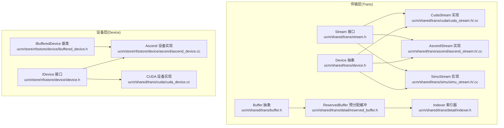
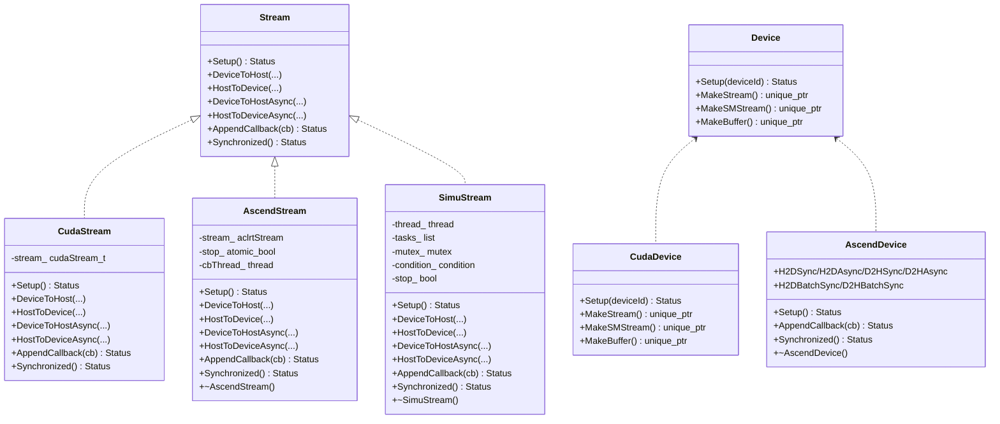
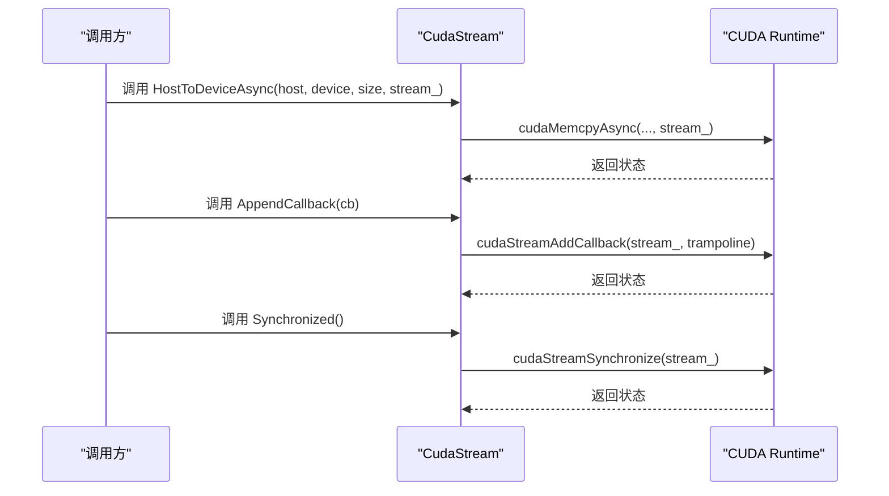
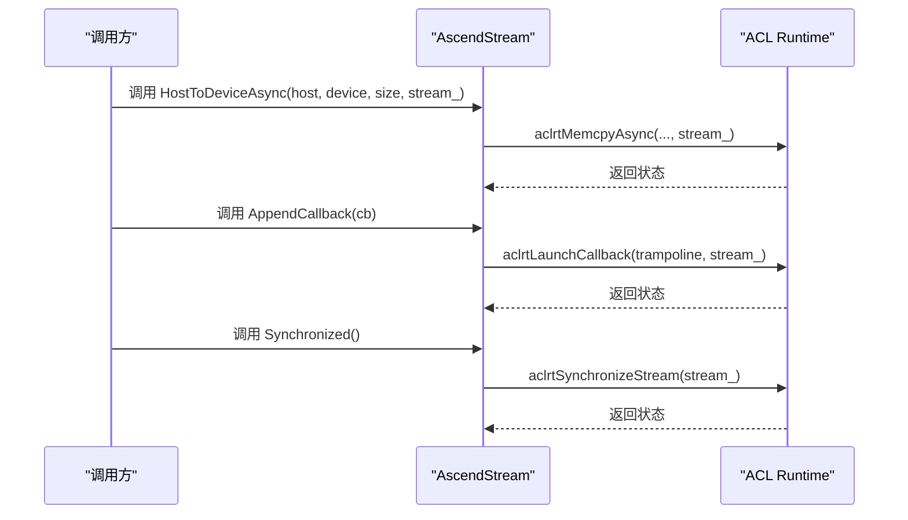
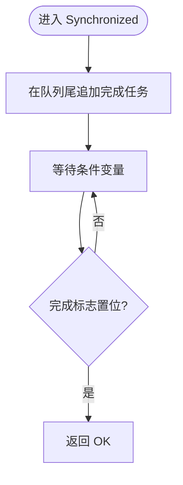
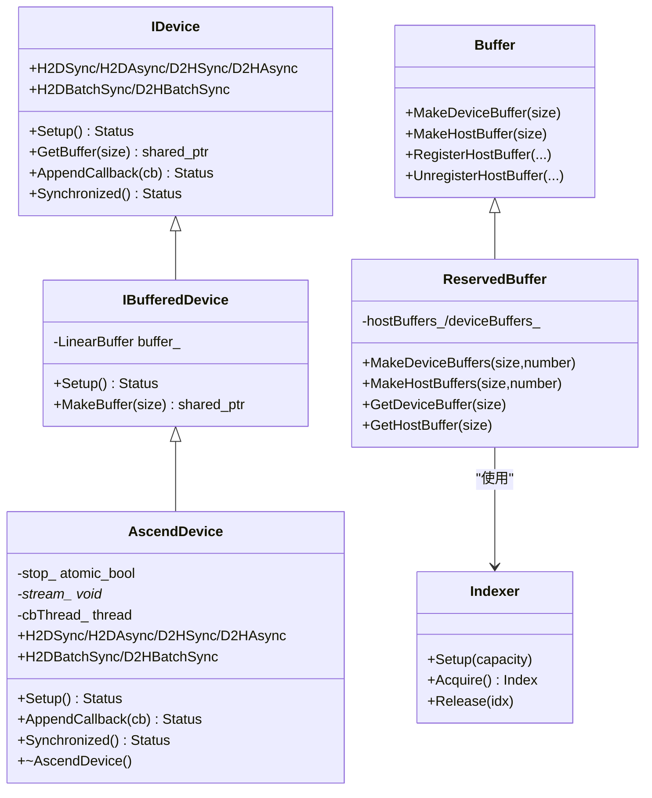
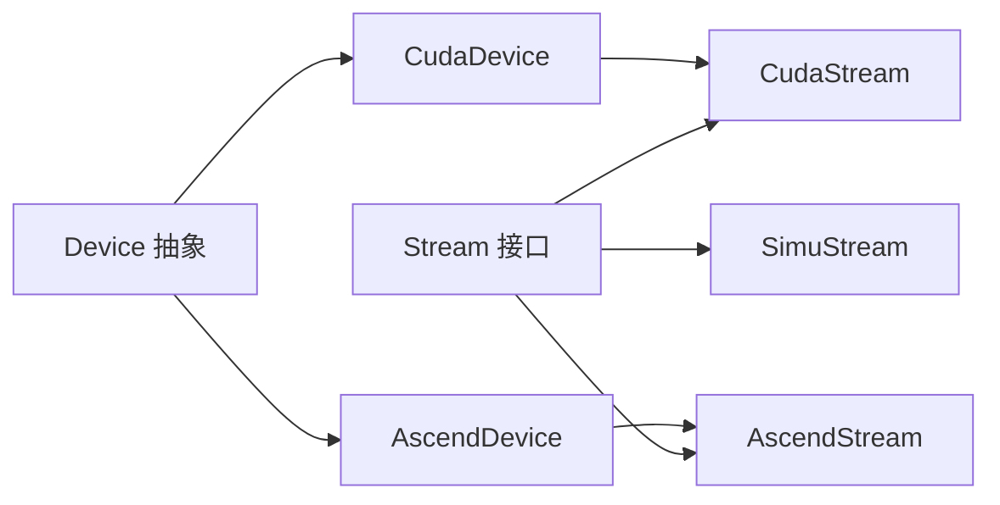

# 流处理机制

<cite>
**本文引用的文件**
- [ucm/shared/trans/stream.h](file://ucm/shared/trans/stream.h)
- [ucm/shared/trans/cuda/cuda_stream.h](file://ucm/shared/trans/cuda/cuda_stream.h)
- [ucm/shared/trans/cuda/cuda_stream.cc](file://ucm/shared/trans/cuda/cuda_stream.cc)
- [ucm/shared/trans/ascend/ascend_stream.h](file://ucm/shared/trans/ascend/ascend_stream.h)
- [ucm/shared/trans/ascend/ascend_stream.cc](file://ucm/shared/trans/ascend/ascend_stream.cc)
- [ucm/shared/trans/simu/simu_stream.h](file://ucm/shared/trans/simu/simu_stream.h)
- [ucm/shared/trans/simu/simu_stream.cc](file://ucm/shared/trans/simu/simu_stream.cc)
- [ucm/shared/trans/device.h](file://ucm/shared/trans/device.h)
- [ucm/shared/trans/cuda/cuda_device.cc](file://ucm/shared/trans/cuda/cuda_device.cc)
- [ucm/store/nfsstore/device/ascend/ascend_device.cc](file://ucm/store/nfsstore/device/ascend/ascend_device.cc)
- [ucm/shared/trans/buffer.h](file://ucm/shared/trans/buffer.h)
- [ucm/shared/trans/detail/indexer.h](file://ucm/shared/trans/detail/indexer.h)
- [ucm/shared/trans/detail/reserved_buffer.h](file://ucm/shared/trans/detail/reserved_buffer.h)
- [ucm/store/nfsstore/device/idevice.h](file://ucm/store/nfsstore/device/idevice.h)
- [ucm/store/nfsstore/device/ibuffered_device.h](file://ucm/store/nfsstore/device/ibuffered_device.h)
</cite>

## 目录
1. [引言](#引言)
2. [项目结构](#项目结构)
3. [核心组件](#核心组件)
4. [架构总览](#架构总览)
5. [详细组件分析](#详细组件分析)
6. [依赖关系分析](#依赖关系分析)
7. [性能考量](#性能考量)
8. [故障排查指南](#故障排查指南)
9. [结论](#结论)
10. [附录](#附录)

## 引言
本技术文档围绕统一缓存管理（UCM）中的“流处理机制”展开，系统性阐述异构计算平台（CUDA、Ascend、仿真模拟）上的流概念、异步执行模型、事件回调与同步机制、流生命周期管理、性能优化策略及调试排障方法。文档以代码为依据，结合类图、时序图与流程图，帮助读者从整体到细节全面理解流在数据传输与任务调度中的作用。

## 项目结构
UCM在“trans”层抽象出通用的流接口，并在不同后端（CUDA、Ascend、仿真）提供具体实现；同时在存储层的设备侧（如Ascend设备）也提供了基于流的内存拷贝与回调能力。关键目录与文件如下：
- 通用流接口：ucm/shared/trans/stream.h
- CUDA实现：ucm/shared/trans/cuda/cuda_stream.h/.cc
- Ascend实现：ucm/shared/trans/ascend/ascend_stream.h/.cc
- 仿真实现：ucm/shared/trans/simu/simu_stream.h/.cc
- 设备工厂与创建：ucm/shared/trans/device.h、ucm/shared/trans/cuda/cuda_device.cc、ucm/store/nfsstore/device/ascend/ascend_device.cc
- 缓冲区与索引器：ucm/shared/trans/buffer.h、ucm/shared/trans/detail/reserved_buffer.h、ucm/shared/trans/detail/indexer.h
- 存储设备接口：ucm/store/nfsstore/device/idevice.h、ucm/store/nfsstore/device/ibuffered_device.h

图表来源
- [ucm/shared/trans/stream.h](file://ucm/shared/trans/stream.h#L32-L53)
- [ucm/shared/trans/cuda/cuda_stream.h](file://ucm/shared/trans/cuda/cuda_stream.h#L32-L55)
- [ucm/shared/trans/ascend/ascend_stream.h](file://ucm/shared/trans/ascend/ascend_stream.h#L34-L60)
- [ucm/shared/trans/simu/simu_stream.h](file://ucm/shared/trans/simu/simu_stream.h#L36-L66)
- [ucm/shared/trans/device.h](file://ucm/shared/trans/device.h#L32-L38)
- [ucm/shared/trans/buffer.h](file://ucm/shared/trans/buffer.h#L32-L46)
- [ucm/shared/trans/detail/indexer.h](file://ucm/shared/trans/detail/indexer.h#L34-L94)
- [ucm/shared/trans/detail/reserved_buffer.h](file://ucm/shared/trans/detail/reserved_buffer.h#L33-L95)
- [ucm/store/nfsstore/device/idevice.h](file://ucm/store/nfsstore/device/idevice.h#L33-L64)
- [ucm/store/nfsstore/device/ibuffered_device.h](file://ucm/store/nfsstore/device/ibuffered_device.h#L31-L67)
- [ucm/shared/trans/cuda/cuda_device.cc](file://ucm/shared/trans/cuda/cuda_device.cc#L41-L82)
- [ucm/store/nfsstore/device/ascend/ascend_device.cc](file://ucm/store/nfsstore/device/ascend/ascend_device.cc#L79-L122)

章节来源
- [ucm/shared/trans/stream.h](file://ucm/shared/trans/stream.h#L32-L53)
- [ucm/shared/trans/device.h](file://ucm/shared/trans/device.h#L32-L38)

## 核心组件
- 流接口（Stream）：定义了设备到主机、主机到设备的同步/异步拷贝，回调追加与流同步等统一能力。
- CUDA流（CudaStream）：基于CUDA runtime的非阻塞流，支持异步拷贝与回调。
- Ascend流（AscendStream）：基于ACL的流，包含回调订阅线程与显式流同步。
- 仿真流（SimuStream）：通过工作线程队列模拟异步行为，用于测试与验证。
- 设备抽象（Device）：提供创建流、SM流、缓冲区的能力；CUDA/Ascend设备分别在各自实现中完成初始化与资源管理。
- 缓冲区与索引器：ReservedBuffer使用Indexer进行零拷贝复用，提升内存利用率与吞吐。

章节来源
- [ucm/shared/trans/stream.h](file://ucm/shared/trans/stream.h#L32-L53)
- [ucm/shared/trans/cuda/cuda_stream.h](file://ucm/shared/trans/cuda/cuda_stream.h#L32-L55)
- [ucm/shared/trans/ascend/ascend_stream.h](file://ucm/shared/trans/ascend/ascend_stream.h#L34-L60)
- [ucm/shared/trans/simu/simu_stream.h](file://ucm/shared/trans/simu/simu_stream.h#L36-L66)
- [ucm/shared/trans/device.h](file://ucm/shared/trans/device.h#L32-L38)
- [ucm/shared/trans/buffer.h](file://ucm/shared/trans/buffer.h#L32-L46)
- [ucm/shared/trans/detail/indexer.h](file://ucm/shared/trans/detail/indexer.h#L34-L94)
- [ucm/shared/trans/detail/reserved_buffer.h](file://ucm/shared/trans/detail/reserved_buffer.h#L33-L95)

## 架构总览
下图展示了跨平台流的统一抽象与具体实现之间的关系，以及设备侧对流的封装与使用。

图表来源
- [ucm/shared/trans/stream.h](file://ucm/shared/trans/stream.h#L32-L53)
- [ucm/shared/trans/cuda/cuda_stream.h](file://ucm/shared/trans/cuda/cuda_stream.h#L32-L55)
- [ucm/shared/trans/ascend/ascend_stream.h](file://ucm/shared/trans/ascend/ascend_stream.h#L34-L60)
- [ucm/shared/trans/simu/simu_stream.h](file://ucm/shared/trans/simu/simu_stream.h#L36-L66)
- [ucm/shared/trans/device.h](file://ucm/shared/trans/device.h#L32-L38)
- [ucm/shared/trans/cuda/cuda_device.cc](file://ucm/shared/trans/cuda/cuda_device.cc#L41-L82)
- [ucm/store/nfsstore/device/ascend/ascend_device.cc](file://ucm/store/nfsstore/device/ascend/ascend_device.cc#L61-L122)

## 详细组件分析

### CUDA流（CudaStream）
- 异步执行模型：使用非阻塞流标志创建流；异步拷贝通过cudaMemcpyAsync发起，回调通过cudaStreamAddCallback注册。
- 同步机制：Synchronized调用cudaStreamSynchronize阻塞等待流内所有操作完成。
- 生命周期：构造时创建流，析构不直接销毁流（由上层管理），但提供完整的Setup/异步/同步接口。
- 批量与分片：支持数组形式的批量拷贝，内部循环逐项异步提交，最终统一同步。

图表来源
- [ucm/shared/trans/cuda/cuda_stream.cc](file://ucm/shared/trans/cuda/cuda_stream.cc#L28-L33)
- [ucm/shared/trans/cuda/cuda_stream.cc](file://ucm/shared/trans/cuda/cuda_stream.cc#L103-L108)
- [ucm/shared/trans/cuda/cuda_stream.cc](file://ucm/shared/trans/cuda/cuda_stream.cc#L139-L149)
- [ucm/shared/trans/cuda/cuda_stream.cc](file://ucm/shared/trans/cuda/cuda_stream.cc#L151-L156)

章节来源
- [ucm/shared/trans/cuda/cuda_stream.h](file://ucm/shared/trans/cuda/cuda_stream.h#L32-L55)
- [ucm/shared/trans/cuda/cuda_stream.cc](file://ucm/shared/trans/cuda/cuda_stream.cc#L28-L33)
- [ucm/shared/trans/cuda/cuda_stream.cc](file://ucm/shared/trans/cuda/cuda_stream.cc#L56-L80)
- [ucm/shared/trans/cuda/cuda_stream.cc](file://ucm/shared/trans/cuda/cuda_stream.cc#L103-L127)
- [ucm/shared/trans/cuda/cuda_stream.cc](file://ucm/shared/trans/cuda/cuda_stream.cc#L139-L149)
- [ucm/shared/trans/cuda/cuda_stream.cc](file://ucm/shared/trans/cuda/cuda_stream.cc#L151-L156)

### Ascend流（AscendStream）
- 异步执行模型：基于ACL的aclrtMemcpyAsync进行异步拷贝；通过回调线程与aclrtProcessReport驱动回调处理。
- 同步机制：Synchronized调用aclrtSynchronizeStream；AppendCallback通过aclrtLaunchCallback在流上下文中触发用户回调。
- 生命周期：析构时取消订阅、停止回调线程并销毁流；Setup阶段创建流并订阅报告。
- 批量与分片：支持数组形式批量拷贝，内部逐项异步提交，最终统一同步。

图表来源
- [ucm/shared/trans/ascend/ascend_stream.cc](file://ucm/shared/trans/ascend/ascend_stream.cc#L123-L128)
- [ucm/shared/trans/ascend/ascend_stream.cc](file://ucm/shared/trans/ascend/ascend_stream.cc#L158-L168)
- [ucm/shared/trans/ascend/ascend_stream.cc](file://ucm/shared/trans/ascend/ascend_stream.cc#L170-L175)

章节来源
- [ucm/shared/trans/ascend/ascend_stream.h](file://ucm/shared/trans/ascend/ascend_stream.h#L34-L60)
- [ucm/shared/trans/ascend/ascend_stream.cc](file://ucm/shared/trans/ascend/ascend_stream.cc#L42-L53)
- [ucm/shared/trans/ascend/ascend_stream.cc](file://ucm/shared/trans/ascend/ascend_stream.cc#L76-L81)
- [ucm/shared/trans/ascend/ascend_stream.cc](file://ucm/shared/trans/ascend/ascend_stream.cc#L123-L128)
- [ucm/shared/trans/ascend/ascend_stream.cc](file://ucm/shared/trans/ascend/ascend_stream.cc#L158-L168)
- [ucm/shared/trans/ascend/ascend_stream.cc](file://ucm/shared/trans/ascend/ascend_stream.cc#L170-L175)

### 仿真流（SimuStream）
- 异步执行模型：通过内部工作线程与条件变量模拟异步任务队列；AppendCallback与Synchronized通过队列执行与等待实现。
- 同步机制：Synchronized在队列尾部追加任务，使用条件变量等待完成信号。
- 生命周期：析构时停止线程并清空队列；Setup创建工作线程。

图表来源
- [ucm/shared/trans/simu/simu_stream.cc](file://ucm/shared/trans/simu/simu_stream.cc#L160-L173)

章节来源
- [ucm/shared/trans/simu/simu_stream.h](file://ucm/shared/trans/simu/simu_stream.h#L36-L66)
- [ucm/shared/trans/simu/simu_stream.cc](file://ucm/shared/trans/simu/simu_stream.cc#L136-L152)
- [ucm/shared/trans/simu/simu_stream.cc](file://ucm/shared/trans/simu/simu_stream.cc#L154-L158)
- [ucm/shared/trans/simu/simu_stream.cc](file://ucm/shared/trans/simu/simu_stream.cc#L160-L173)

### 设备与缓冲区
- 设备抽象（Device）：提供Setup、MakeStream、MakeSMStream、MakeBuffer等工厂方法，具体平台在子类中实现。
- Ascend设备（AscendDevice）：继承IBufferedDevice，负责设置设备、创建流、回调订阅线程、批量H2D/D2H拷贝、回调与同步。
- 缓冲区与索引器（ReservedBuffer/Indexer）：预分配连续内存块，Indexer原子化分配/回收索引，避免频繁分配降低开销。

图表来源
- [ucm/store/nfsstore/device/idevice.h](file://ucm/store/nfsstore/device/idevice.h#L33-L64)
- [ucm/store/nfsstore/device/ibuffered_device.h](file://ucm/store/nfsstore/device/ibuffered_device.h#L31-L67)
- [ucm/store/nfsstore/device/ascend/ascend_device.cc](file://ucm/store/nfsstore/device/ascend/ascend_device.cc#L61-L122)
- [ucm/shared/trans/buffer.h](file://ucm/shared/trans/buffer.h#L32-L46)
- [ucm/shared/trans/detail/reserved_buffer.h](file://ucm/shared/trans/detail/reserved_buffer.h#L33-L95)
- [ucm/shared/trans/detail/indexer.h](file://ucm/shared/trans/detail/indexer.h#L34-L94)

章节来源
- [ucm/shared/trans/device.h](file://ucm/shared/trans/device.h#L32-L38)
- [ucm/shared/trans/cuda/cuda_device.cc](file://ucm/shared/trans/cuda/cuda_device.cc#L41-L82)
- [ucm/store/nfsstore/device/ascend/ascend_device.cc](file://ucm/store/nfsstore/device/ascend/ascend_device.cc#L79-L122)
- [ucm/shared/trans/buffer.h](file://ucm/shared/trans/buffer.h#L32-L46)
- [ucm/shared/trans/detail/reserved_buffer.h](file://ucm/shared/trans/detail/reserved_buffer.h#L54-L95)
- [ucm/shared/trans/detail/indexer.h](file://ucm/shared/trans/detail/indexer.h#L51-L88)

## 依赖关系分析
- 继承与实现：各平台流均实现统一的Stream接口；Ascend/CUDA设备实现各自的Device子类。
- 内聚与耦合：流接口高度内聚，面向对象解耦；Ascend设备对ACL API有直接依赖，CUDA设备对CUDA API有直接依赖。
- 循环依赖：未发现直接循环依赖；仿真设备仅用于测试验证，不参与生产路径。
- 外部依赖：CUDA依赖cuda_runtime.h；Ascend依赖acl/acl.h；仿真依赖标准库线程与条件变量。

图表来源
- [ucm/shared/trans/stream.h](file://ucm/shared/trans/stream.h#L32-L53)
- [ucm/shared/trans/cuda/cuda_stream.h](file://ucm/shared/trans/cuda/cuda_stream.h#L32-L55)
- [ucm/shared/trans/ascend/ascend_stream.h](file://ucm/shared/trans/ascend/ascend_stream.h#L34-L60)
- [ucm/shared/trans/simu/simu_stream.h](file://ucm/shared/trans/simu/simu_stream.h#L36-L66)
- [ucm/shared/trans/device.h](file://ucm/shared/trans/device.h#L32-L38)
- [ucm/shared/trans/cuda/cuda_device.cc](file://ucm/shared/trans/cuda/cuda_device.cc#L41-L82)
- [ucm/store/nfsstore/device/ascend/ascend_device.cc](file://ucm/store/nfsstore/device/ascend/ascend_device.cc#L61-L122)

章节来源
- [ucm/shared/trans/stream.h](file://ucm/shared/trans/stream.h#L32-L53)
- [ucm/shared/trans/device.h](file://ucm/shared/trans/device.h#L32-L38)

## 性能考量
- 流内并行：在同一流内提交多个异步拷贝或任务，可利用硬件并发；注意避免过度竞争导致带宽饱和。
- 跨流同步：当多流协作时，使用Synchronized确保顺序一致性；避免不必要的全局同步。
- 回调与事件：回调用于轻量通知，避免在回调中执行耗时逻辑；必要时将重活转移到后台线程。
- 批量与分片：批量拷贝减少启动开销；合理分片大小平衡吞吐与延迟。
- 缓冲复用：使用ReservedBuffer与Indexer预分配与复用缓冲，降低分配/释放成本。
- 设备亲和：CUDA侧可通过NVML设置CPU亲和，减少迁移抖动带来的性能损失。
- 仿真验证：SimuStream可用于离线验证算法正确性与性能趋势，便于快速迭代。

## 故障排查指南
- 错误码与日志：Ascend设备封装了ASCEND_API宏，失败时记录调用者、文件与行号，便于定位问题。
- 回调异常：若回调未触发，检查是否成功订阅/注册；确认流上下文有效且未被提前销毁。
- 同步阻塞：Synchronized长时间不返回，检查是否存在未完成的任务或死锁；确认流内无异常状态。
- 内存与缓冲：ReservedBuffer分配失败时，检查容量与对齐；Indexer索引越界时，检查Acquire/Release配对。
- 设备状态：Ascend设备析构会重置设备，若出现后续异常，检查设备初始化顺序与资源释放时机。

章节来源
- [ucm/store/nfsstore/device/ascend/ascend_device.cc](file://ucm/store/nfsstore/device/ascend/ascend_device.cc#L34-L46)
- [ucm/shared/trans/ascend/ascend_stream.cc](file://ucm/shared/trans/ascend/ascend_stream.cc#L170-L175)
- [ucm/shared/trans/detail/reserved_buffer.h](file://ucm/shared/trans/detail/reserved_buffer.h#L54-L65)
- [ucm/shared/trans/detail/indexer.h](file://ucm/shared/trans/detail/indexer.h#L75-L88)

## 结论
UCM在“trans”层以统一的Stream接口屏蔽底层差异，在CUDA与Ascend平台上分别提供高性能的异步流实现，并在Ascend设备侧进一步封装了回调与批量拷贝能力。通过ReservedBuffer与Indexer实现缓冲复用，结合合理的批量化与分片策略，可在异构环境中获得稳定的吞吐与低延迟表现。建议在实际部署中结合平台特性选择合适的流数量、回调粒度与同步点，配合监控与日志进行持续优化。

## 附录
- 最佳实践清单
  - 在同一流内聚合相关任务，减少跨流切换。
  - 使用AppendCallback进行轻量通知，重任务放入后台线程。
  - 合理设置批量大小，避免过大导致延迟尖峰。
  - 利用ReservedBuffer与Indexer减少频繁分配。
  - 对CUDA设备启用CPU亲和，降低迁移开销。
  - 在Ascend设备侧，确保回调订阅线程正常运行，避免回调丢失。