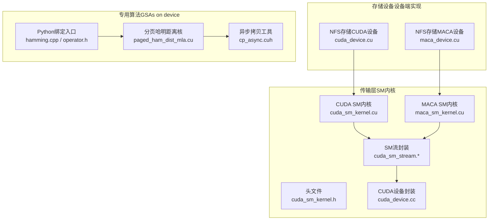
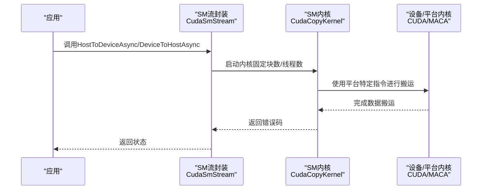
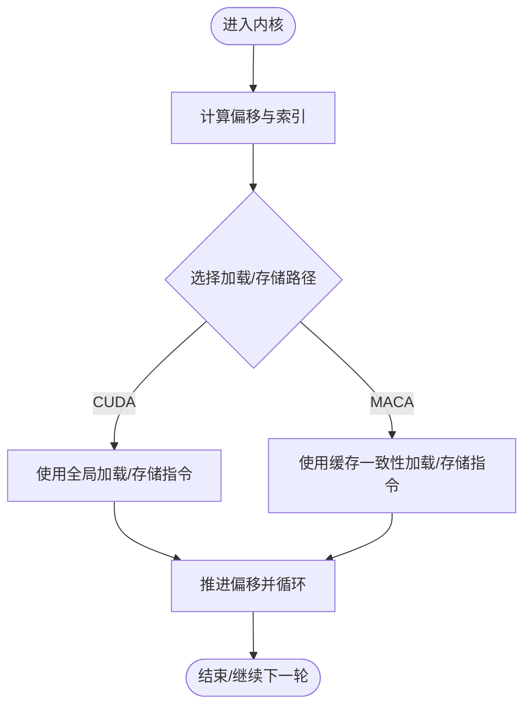
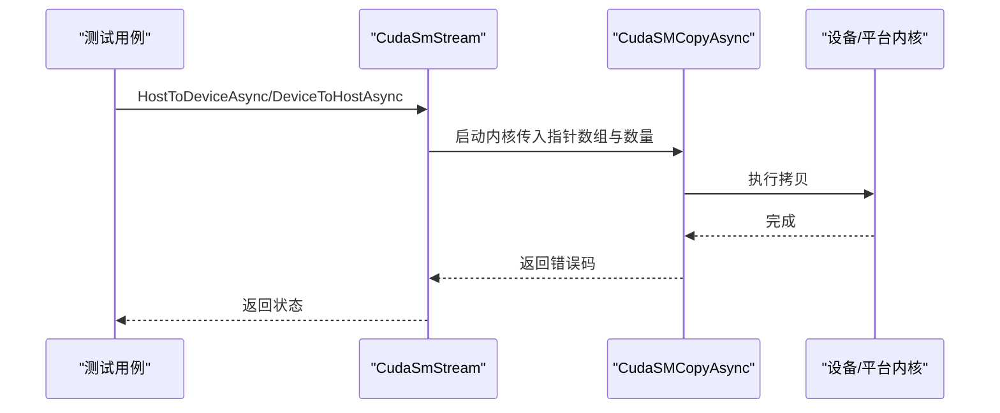
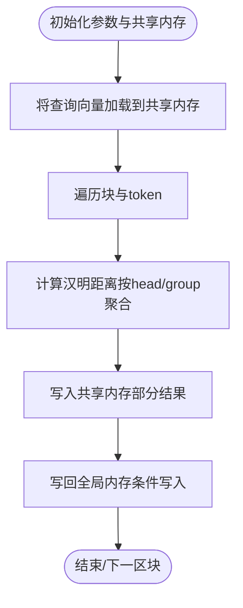
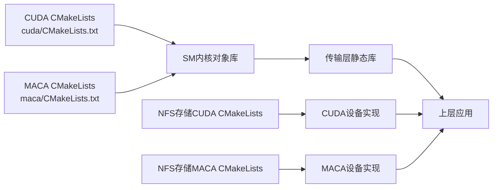

# 硬件内核优化

<cite>
**本文引用的文件**
- [cuda_sm_kernel.cu](file://ucm/shared/trans/cuda/cuda_sm_kernel.cu)
- [cuda_sm_kernel.h](file://ucm/shared/trans/cuda/cuda_sm_kernel.h)
- [maca_sm_kernel.cu](file://ucm/shared/trans/maca/maca_sm_kernel.cu)
- [cuda_sm_stream.h](file://ucm/shared/trans/cuda/cuda_sm_stream.h)
- [cuda_sm_stream.cc](file://ucm/shared/trans/cuda/cuda_sm_stream.cc)
- [cuda_device.cc](file://ucm/shared/trans/cuda/cuda_device.cc)
- [cuda_device.cu](file://ucm/store/nfsstore/device/cuda/cuda_device.cu)
- [maca_device.cu](file://ucm/store/nfsstore/device/maca/maca_device.cu)
- [CMakeLists.txt（CUDA SM内核）](file://ucm/shared/trans/cuda/CMakeLists.txt)
- [CMakeLists.txt（MACA SM内核）](file://ucm/shared/trans/maca/CMakeLists.txt)
- [CMakeLists.txt（NFS存储CUDA设备）](file://ucm/store/nfsstore/device/cuda/CMakeLists.txt)
- [CMakeLists.txt（NFS存储MACA设备）](file://ucm/store/nfsstore/device/maca/CMakeLists.txt)
- [paged_ham_dist_mla.cu](file://ucm/sparse/gsa_on_device/ham_dist/paged_ham_dist_mla.cu)
- [cp_async.cuh](file://ucm/sparse/gsa_on_device/ham_dist/cp_async.cuh)
- [hamming.cpp](file://ucm/sparse/gsa_on_device/ham_dist/cpy/hamming.cpp)
- [operator.h](file://ucm/sparse/gsa_on_device/ham_dist/operator.h)
- [trans_test.cc](file://ucm/shared/test/case/trans/trans_test.cc)
</cite>

## 目录
1. [引言](#引言)
2. [项目结构](#项目结构)
3. [核心组件](#核心组件)
4. [架构总览](#架构总览)
5. [详细组件分析](#详细组件分析)
6. [依赖关系分析](#依赖关系分析)
7. [性能考量](#性能考量)
8. [故障排查指南](#故障排查指南)
9. [结论](#结论)
10. [附录](#附录)

## 引言
本文件面向UCM硬件内核优化，系统性梳理并解读跨平台（CUDA与MACA）的SM内核、异步内存拷贝与专用算法（分页哈明距离计算）的实现与优化策略。重点覆盖：
- 针对不同硬件平台的内核实现差异与适配要点
- 内核函数设计原则：内存访问模式、寄存器与共享内存使用、指令调度与流水化
- 异步内存拷贝机制与设备端计算协同
- 分页哈明距离计算的核函数设计、块表索引与性能调优
- 内核开发最佳实践与常见问题解决

## 项目结构
围绕“硬件内核优化”的关键目录与文件如下：
- 传输层SM内核与流封装：ucm/shared/trans/cuda、ucm/shared/trans/maca
- 存储设备侧设备实现：ucm/store/nfsstore/device/cuda、ucm/store/nfsstore/device/maca
- 专用算法（GSAs on device）：ucm/sparse/gsa_on_device/ham_dist
- 测试用例：ucm/shared/test/case/trans

图表来源
- [cuda_sm_kernel.cu](file://ucm/shared/trans/cuda/cuda_sm_kernel.cu#L1-L117)
- [maca_sm_kernel.cu](file://ucm/shared/trans/maca/maca_sm_kernel.cu#L1-L113)
- [cuda_sm_stream.h](file://ucm/shared/trans/cuda/cuda_sm_stream.h#L1-L42)
- [cuda_device.cc](file://ucm/shared/trans/cuda/cuda_device.cc#L1-L83)
- [cuda_device.cu](file://ucm/store/nfsstore/device/cuda/cuda_device.cu#L1-L242)
- [maca_device.cu](file://ucm/store/nfsstore/device/maca/maca_device.cu#L1-L242)
- [paged_ham_dist_mla.cu](file://ucm/sparse/gsa_on_device/ham_dist/paged_ham_dist_mla.cu#L1-L438)
- [cp_async.cuh](file://ucm/sparse/gsa_on_device/ham_dist/cp_async.cuh#L1-L187)
- [hamming.cpp](file://ucm/sparse/gsa_on_device/ham_dist/cpy/hamming.cpp#L1-L7)
- [operator.h](file://ucm/sparse/gsa_on_device/ham_dist/operator.h#L1-L15)

章节来源
- [cuda_sm_kernel.cu](file://ucm/shared/trans/cuda/cuda_sm_kernel.cu#L1-L117)
- [maca_sm_kernel.cu](file://ucm/shared/trans/maca/maca_sm_kernel.cu#L1-L113)
- [cuda_device.cu](file://ucm/store/nfsstore/device/cuda/cuda_device.cu#L1-L242)
- [maca_device.cu](file://ucm/store/nfsstore/device/maca/maca_device.cu#L1-L242)
- [paged_ham_dist_mla.cu](file://ucm/sparse/gsa_on_device/ham_dist/paged_ham_dist_mla.cu#L1-L438)
- [cp_async.cuh](file://ucm/sparse/gsa_on_device/ham_dist/cp_async.cuh#L1-L187)
- [hamming.cpp](file://ucm/sparse/gsa_on_device/ham_dist/cpy/hamming.cpp#L1-L7)
- [operator.h](file://ucm/sparse/gsa_on_device/ham_dist/operator.h#L1-L15)

## 核心组件
- CUDA SM内核：提供主机到设备/设备到主机的批量异步拷贝，采用固定粒度单元与线程并行推进，支持多种指针数组组合。
- MACA SM内核：在MACA平台上复用相同接口与逻辑，通过平台特定的加载/存储指令实现高效数据搬运。
- 设备端SM流封装：统一暴露HostToDeviceAsync/DeviceToHostAsync等接口，屏蔽底层差异。
- 专用算法（分页哈明距离）：基于CUDA核函数实现连续/非连续键序列的哈明距离评分，支持块表索引与共享内存聚合。

章节来源
- [cuda_sm_kernel.cu](file://ucm/shared/trans/cuda/cuda_sm_kernel.cu#L29-L114)
- [maca_sm_kernel.cu](file://ucm/shared/trans/maca/maca_sm_kernel.cu#L30-L110)
- [cuda_sm_stream.h](file://ucm/shared/trans/cuda/cuda_sm_stream.h#L31-L36)
- [paged_ham_dist_mla.cu](file://ucm/sparse/gsa_on_device/ham_dist/paged_ham_dist_mla.cu#L111-L435)

## 架构总览
下图展示从应用到设备端内核的整体调用链路与数据通路：

图表来源
- [cuda_sm_stream.cc](file://ucm/shared/trans/cuda/cuda_sm_stream.cc#L29-L55)
- [cuda_sm_kernel.cu](file://ucm/shared/trans/cuda/cuda_sm_kernel.cu#L66-L114)
- [maca_sm_kernel.cu](file://ucm/shared/trans/maca/maca_sm_kernel.cu#L48-L110)

## 详细组件分析

### CUDA SM内核与MACA内核对比
- 单元大小与并行策略
  - 固定单元大小：以若干字（如uint4或uint64）为单位，确保访存对齐与吞吐最大化。
  - 线程并行推进：每个线程按固定步长推进，避免分支与同步开销。
- 指令调度差异
  - CUDA：使用全局内存加载/存储指令，结合volatile/st写入保证可见性。
  - MACA：使用平台特定的缓存一致性加载/存储指令，提升带宽与延迟表现。
- 接口一致性
  - 两套内核均提供三类重载接口，分别处理主机数组到设备数组、主机到设备单缓冲、以及相反方向的拷贝。

图表来源
- [cuda_sm_kernel.cu](file://ucm/shared/trans/cuda/cuda_sm_kernel.cu#L34-L50)
- [maca_sm_kernel.cu](file://ucm/shared/trans/maca/maca_sm_kernel.cu#L35-L46)

章节来源
- [cuda_sm_kernel.cu](file://ucm/shared/trans/cuda/cuda_sm_kernel.cu#L29-L114)
- [maca_sm_kernel.cu](file://ucm/shared/trans/maca/maca_sm_kernel.cu#L30-L110)

### 异步内存拷贝机制与设备端计算协同
- 设备端SM流封装
  - 提供HostToDeviceAsync/DeviceToHostAsync等接口，内部调用对应内核启动函数。
  - 错误码捕获与返回，便于上层统一处理。
- 设备端实现（NFS存储）
  - 在设备侧同样提供批量化异步拷贝能力，并通过回调机制通知完成状态。
  - 支持将主机/设备指针数组拷贝至设备端，用于后续核函数直接访问。

图表来源
- [trans_test.cc](file://ucm/shared/test/case/trans/trans_test.cc#L61-L94)
- [cuda_sm_stream.cc](file://ucm/shared/trans/cuda/cuda_sm_stream.cc#L29-L55)
- [cuda_sm_kernel.cu](file://ucm/shared/trans/cuda/cuda_sm_kernel.cu#L94-L114)

章节来源
- [cuda_sm_stream.h](file://ucm/shared/trans/cuda/cuda_sm_stream.h#L31-L36)
- [cuda_sm_stream.cc](file://ucm/shared/trans/cuda/cuda_sm_stream.cc#L29-L55)
- [trans_test.cc](file://ucm/shared/test/case/trans/trans_test.cc#L61-L94)

### 分页哈明距离计算（GSAs on device）
- 核心思想
  - 将查询向量与键编码进行逐位异或并统计1的个数（汉明距离），支持连续与分块两种布局。
  - 使用共享内存聚合每线程的部分结果，减少全局写放大。
- 关键优化点
  - 共享内存划分：一部分存放每线程部分结果，另一部分存放查询向量副本，按需广播。
  - 块表索引：当采用分块布局时，根据块表将全局位置映射到具体块，提高局部性。
  - 条件写入：对sink/recent区域与无效位置设置特殊值，避免无意义计算。
- 异步拷贝辅助
  - 利用cp.async工具在共享内存加载阶段降低延迟，提升吞吐。

图表来源
- [paged_ham_dist_mla.cu](file://ucm/sparse/gsa_on_device/ham_dist/paged_ham_dist_mla.cu#L111-L213)
- [cp_async.cuh](file://ucm/sparse/gsa_on_device/ham_dist/cp_async.cuh#L70-L157)

章节来源
- [paged_ham_dist_mla.cu](file://ucm/sparse/gsa_on_device/ham_dist/paged_ham_dist_mla.cu#L111-L435)
- [cp_async.cuh](file://ucm/sparse/gsa_on_device/ham_dist/cp_async.cuh#L25-L157)

### Python扩展与算子绑定
- Python绑定入口将C++扩展导出为PyTorch算子，便于在推理管线中直接调用。
- 绑定文件负责注册算子名称与函数签名，确保与核函数一致。

章节来源
- [hamming.cpp](file://ucm/sparse/gsa_on_device/ham_dist/cpy/hamming.cpp#L4-L6)
- [operator.h](file://ucm/sparse/gsa_on_device/ham_dist/operator.h#L10-L13)

## 依赖关系分析
- 编译配置
  - CUDA与MACA平台各自独立编译，分别链接平台特定的运行库与头文件。
  - SM内核作为对象库被传输层静态库链接，确保接口一致。
- 运行时依赖
  - 传输层依赖CUDA运行时；设备层在NFS存储场景下提供与内核一致的批处理能力。
  - 专用算法依赖PyTorch扩展框架与CUDA上下文。

图表来源
- [CMakeLists.txt（CUDA SM内核）](file://ucm/shared/trans/cuda/CMakeLists.txt#L1-L20)
- [CMakeLists.txt（MACA SM内核）](file://ucm/shared/trans/maca/CMakeLists.txt#L1-L33)
- [CMakeLists.txt（NFS存储CUDA设备）](file://ucm/store/nfsstore/device/cuda/CMakeLists.txt#L1-L20)
- [CMakeLists.txt（NFS存储MACA设备）](file://ucm/store/nfsstore/device/maca/CMakeLists.txt#L1-L20)

章节来源
- [CMakeLists.txt（CUDA SM内核）](file://ucm/shared/trans/cuda/CMakeLists.txt#L1-L20)
- [CMakeLists.txt（MACA SM内核）](file://ucm/shared/trans/maca/CMakeLists.txt#L1-L33)
- [CMakeLists.txt（NFS存储CUDA设备）](file://ucm/store/nfsstore/device/cuda/CMakeLists.txt#L1-L20)
- [CMakeLists.txt（NFS存储MACA设备）](file://ucm/store/nfsstore/device/maca/CMakeLists.txt#L1-L20)

## 性能考量
- 内存访问模式
  - 对齐与连续访问：固定单元大小确保每次访存对齐，减少bank冲突与带宽浪费。
  - 批量与流水：线程按固定步长推进，形成良好的流水线与吞吐。
- 寄存器与共享内存
  - 查询向量复制到共享内存，减少全局重复读取；共享内存划分需考虑占用与bank冲突。
  - 结果聚合在共享内存中进行，减少全局写放大。
- 指令调度
  - CUDA使用全局内存指令配合volatile/st写入；MACA使用缓存一致性指令，提升吞吐。
  - 专用算法中可结合cp.async进行共享内存预取，降低等待时间。
- 并行度与网格配置
  - 固定块数与线程数，结合任务总量动态决定网格维度，确保充分并行与负载均衡。

## 故障排查指南
- 常见问题
  - 内核启动失败：检查块数/线程数配置与设备能力上限；确认错误码返回。
  - 数据不一致：确认指针数组与数量匹配；检查是否正确使用volatile/st写入。
  - 性能异常：核对共享内存占用与bank冲突；评估是否需要调整单元大小或并行度。
- 调试建议
  - 使用测试用例验证主机到设备/设备到主机的批量拷贝路径。
  - 在设备端实现中添加回调与同步，定位异步执行中的问题。
  - 对专用算法，打印关键中间变量（如块表索引、有效长度）以定位边界条件。

章节来源
- [trans_test.cc](file://ucm/shared/test/case/trans/trans_test.cc#L61-L141)
- [cuda_device.cu](file://ucm/store/nfsstore/device/cuda/cuda_device.cu#L113-L178)
- [maca_device.cu](file://ucm/store/nfsstore/device/maca/maca_device.cu#L113-L178)

## 结论
本文件系统化梳理了UCM在CUDA与MACA平台上的SM内核实现、异步内存拷贝机制与分页哈明距离计算的优化策略。通过统一的接口抽象、平台特定的指令优化、共享内存聚合与流水化设计，实现了高吞吐与低延迟的数据搬运与计算协同。建议在实际部署中结合具体硬件能力与任务特征，进一步微调并行度、共享内存占用与访存模式，以获得最佳性能。

## 附录
- 最佳实践
  - 代码组织：将平台无关的接口与平台特定实现分离，便于维护与移植。
  - 调试技巧：利用测试用例覆盖典型路径；在设备端实现中使用回调与同步定位问题。
  - 性能分析：关注共享内存占用、bank冲突、访存对齐与流水效率；结合cp.async进行预取优化。
- 参考文件
  - [cuda_sm_kernel.cu](file://ucm/shared/trans/cuda/cuda_sm_kernel.cu#L1-L117)
  - [maca_sm_kernel.cu](file://ucm/shared/trans/maca/maca_sm_kernel.cu#L1-L113)
  - [paged_ham_dist_mla.cu](file://ucm/sparse/gsa_on_device/ham_dist/paged_ham_dist_mla.cu#L1-L438)
  - [cp_async.cuh](file://ucm/sparse/gsa_on_device/ham_dist/cp_async.cuh#L1-L187)
  - [hamming.cpp](file://ucm/sparse/gsa_on_device/ham_dist/cpy/hamming.cpp#L1-L7)
  - [operator.h](file://ucm/sparse/gsa_on_device/ham_dist/operator.h#L1-L15)
  - [trans_test.cc](file://ucm/shared/test/case/trans/trans_test.cc#L61-L141)