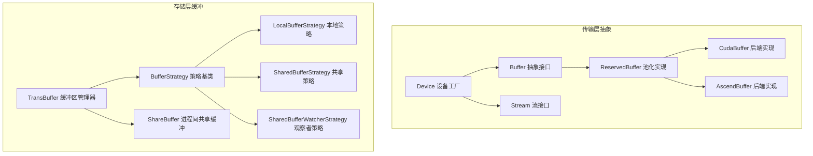
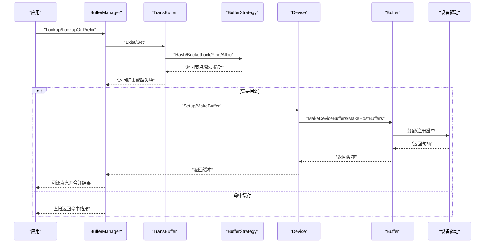
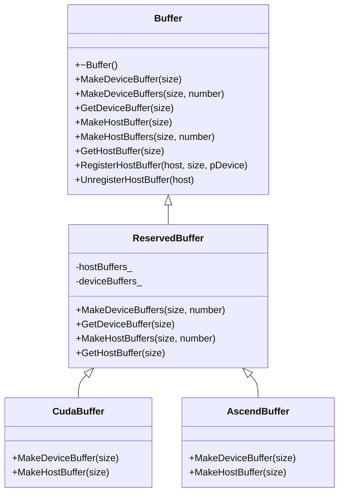
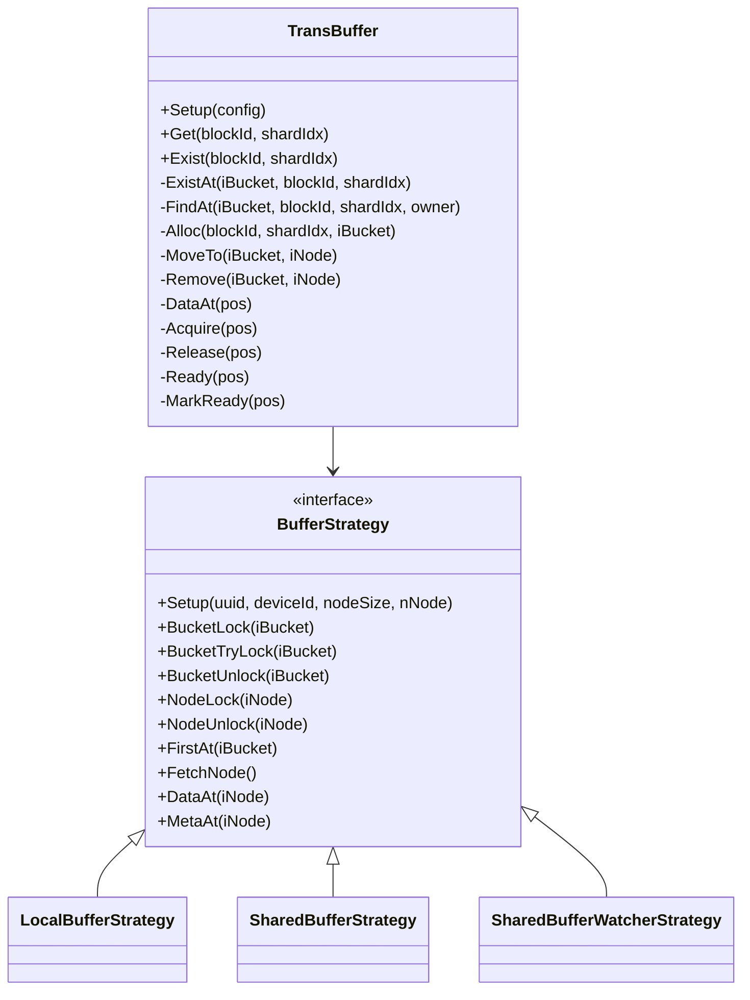
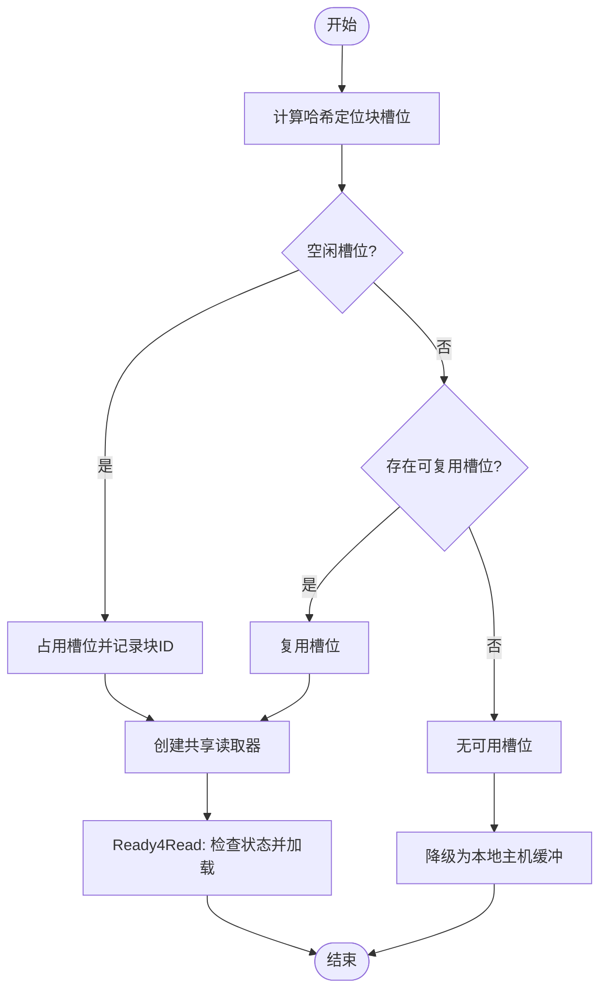
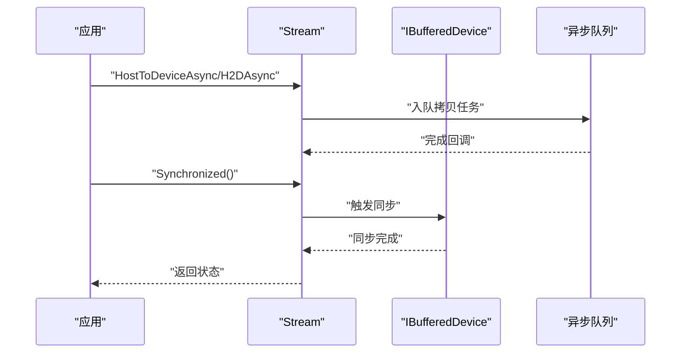
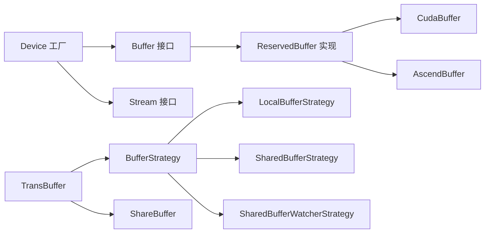

# 缓冲区管理

<cite>
**本文引用的文件**
- [ucm/shared/trans/buffer.h](file://ucm/shared/trans/buffer.h)
- [ucm/shared/trans/detail/reserved_buffer.h](file://ucm/shared/trans/detail/reserved_buffer.h)
- [ucm/shared/trans/cuda/cuda_buffer.h](file://ucm/shared/trans/cuda/cuda_buffer.h)
- [ucm/shared/trans/cuda/cuda_buffer.cc](file://ucm/shared/trans/cuda/cuda_buffer.cc)
- [ucm/shared/trans/ascend/ascend_buffer.h](file://ucm/shared/trans/ascend/ascend_buffer.h)
- [ucm/shared/trans/ascend/ascend_buffer.cc](file://ucm/shared/trans/ascend/ascend_buffer.cc)
- [ucm/shared/trans/device.h](file://ucm/shared/trans/device.h)
- [ucm/shared/trans/stream.h](file://ucm/shared/trans/stream.h)
- [ucm/store/cache/cc/trans_buffer.h](file://ucm/store/cache/cc/trans_buffer.h)
- [ucm/store/cache/cc/trans_buffer.cc](file://ucm/store/cache/cc/trans_buffer.cc)
- [ucm/store/cache/cc/buffer_manager.h](file://ucm/store/cache/cc/buffer_manager.h)
- [ucm/store/pcstore/cc/domain/trans/share_buffer.h](file://ucm/store/pcstore/cc/domain/trans/share_buffer.h)
- [ucm/store/pcstore/cc/domain/trans/share_buffer.cc](file://ucm/store/pcstore/cc/domain/trans/share_buffer.cc)
- [ucm/store/nfsstore/device/ibuffered_device.h](file://ucm/store/nfsstore/device/ibuffered_device.h)
- [ucm/store/nfsstore/device/simu/simu_device.cc](file://ucm/store/nfsstore/device/simu/simu_device.cc)
- [ucm/store/nfsstore/device/musa/musa_device.cc](file://ucm/store/nfsstore/device/musa/musa_device.cc)
- [ucm/sparse/gsa/offload_ops/src/thread_safe_queue.cpp](file://ucm/sparse/gsa/offload_ops/src/thread_safe_queue.cpp)
</cite>

## 目录
1. [简介](#简介)
2. [项目结构](#项目结构)
3. [核心组件](#核心组件)
4. [架构总览](#架构总览)
5. [详细组件分析](#详细组件分析)
6. [依赖关系分析](#依赖关系分析)
7. [性能考虑](#性能考虑)
8. [故障排查指南](#故障排查指南)
9. [结论](#结论)
10. [附录](#附录)

## 简介
本文件面向UCM（Unified Cache Management）缓冲区管理系统，系统性阐述缓冲区抽象接口设计、主机与设备缓冲区的统一管理策略、动态内存分配与池化复用、数据拷贝策略（同步/异步）、生命周期管理（创建/注册/释放/错误处理），以及性能优化建议与调试技巧。目标是帮助开发者在多硬件后端（CUDA、Ascend、MUSA等）下实现一致且高效的缓冲区管理。

## 项目结构
UCM的缓冲区体系由“传输层抽象”和“存储层缓冲”两部分组成：
- 传输层抽象：定义统一的Buffer/Device/Stream接口，并提供各后端的具体实现（如CUDA、Ascend、模拟设备）。
- 存储层缓冲：在缓存与持久化存储之间提供共享/本地缓冲区策略，支持进程内/跨进程共享，以及按块的读取与复用。

**图表来源**
- [ucm/shared/trans/buffer.h](file://ucm/shared/trans/buffer.h#L32-L46)
- [ucm/shared/trans/detail/reserved_buffer.h](file://ucm/shared/trans/detail/reserved_buffer.h#L33-L95)
- [ucm/shared/trans/cuda/cuda_buffer.h](file://ucm/shared/trans/cuda/cuda_buffer.h#L31-L35)
- [ucm/shared/trans/ascend/ascend_buffer.h](file://ucm/shared/trans/ascend/ascend_buffer.h#L31-L35)
- [ucm/shared/trans/device.h](file://ucm/shared/trans/device.h#L32-L38)
- [ucm/shared/trans/stream.h](file://ucm/shared/trans/stream.h#L32-L53)
- [ucm/store/cache/cc/trans_buffer.h](file://ucm/store/cache/cc/trans_buffer.h#L37-L115)
- [ucm/store/cache/cc/trans_buffer.cc](file://ucm/store/cache/cc/trans_buffer.cc#L67-L351)
- [ucm/store/pcstore/cc/domain/trans/share_buffer.h](file://ucm/store/pcstore/cc/domain/trans/share_buffer.h#L36-L92)

**章节来源**
- [ucm/shared/trans/buffer.h](file://ucm/shared/trans/buffer.h#L30-L50)
- [ucm/store/cache/cc/trans_buffer.h](file://ucm/store/cache/cc/trans_buffer.h#L37-L115)

## 核心组件
- 统一缓冲接口：提供主机/设备缓冲的创建、池化获取与主机缓冲注册能力。
- 池化与复用：通过索引器管理固定大小缓冲块，实现快速分配/回收。
- 多后端实现：CUDA/Ascend/MUSA等后端分别提供对应缓冲与设备实现。
- 缓冲区管理器：基于哈希表+链表的LRU风格缓冲管理，支持本地/共享两种策略。
- 进程间共享：通过POSIX共享内存与主机缓冲注册，实现跨进程共享与块级复用。

**章节来源**
- [ucm/shared/trans/buffer.h](file://ucm/shared/trans/buffer.h#L32-L46)
- [ucm/shared/trans/detail/reserved_buffer.h](file://ucm/shared/trans/detail/reserved_buffer.h#L33-L95)
- [ucm/store/cache/cc/trans_buffer.cc](file://ucm/store/cache/cc/trans_buffer.cc#L83-L143)

## 架构总览
下图展示从应用到设备的缓冲调用路径与策略选择：

**图表来源**
- [ucm/store/cache/cc/buffer_manager.h](file://ucm/store/cache/cc/buffer_manager.h#L48-L123)
- [ucm/store/cache/cc/trans_buffer.h](file://ucm/store/cache/cc/trans_buffer.h#L37-L115)
- [ucm/store/cache/cc/trans_buffer.cc](file://ucm/store/cache/cc/trans_buffer.cc#L368-L383)
- [ucm/shared/trans/device.h](file://ucm/shared/trans/device.h#L32-L38)
- [ucm/shared/trans/buffer.h](file://ucm/shared/trans/buffer.h#L32-L46)

## 详细组件分析

### 组件A：统一缓冲接口与池化实现
- Buffer抽象接口：定义主机/设备缓冲创建、批量创建、池化获取与主机缓冲注册/注销。
- ReservedBuffer池化实现：维护主机/设备两套固定大小缓冲池，使用索引器进行分配/回收；若池中无可用块则退化为直接分配。
- CUDA/Ascend后端实现：基于各自运行时分配设备/主机缓冲，并提供主机缓冲注册以供设备直接访问。

**图表来源**
- [ucm/shared/trans/buffer.h](file://ucm/shared/trans/buffer.h#L32-L46)
- [ucm/shared/trans/detail/reserved_buffer.h](file://ucm/shared/trans/detail/reserved_buffer.h#L33-L95)
- [ucm/shared/trans/cuda/cuda_buffer.h](file://ucm/shared/trans/cuda/cuda_buffer.h#L31-L35)
- [ucm/shared/trans/ascend/ascend_buffer.h](file://ucm/shared/trans/ascend/ascend_buffer.h#L31-L35)

**章节来源**
- [ucm/shared/trans/buffer.h](file://ucm/shared/trans/buffer.h#L32-L46)
- [ucm/shared/trans/detail/reserved_buffer.h](file://ucm/shared/trans/detail/reserved_buffer.h#L53-L95)
- [ucm/shared/trans/cuda/cuda_buffer.cc](file://ucm/shared/trans/cuda/cuda_buffer.cc#L29-L56)
- [ucm/shared/trans/ascend/ascend_buffer.cc](file://ucm/shared/trans/ascend/ascend_buffer.cc#L29-L54)

### 组件B：TransBuffer与缓冲策略
- TransBuffer：对外提供Get/Exist接口，内部采用哈希桶+双向链表管理元信息，支持引用计数与就绪标记。
- BufferStrategy：抽象共享/本地策略，负责共享内存映射、锁初始化、节点分配与数据区定位。
- 本地策略：在单进程内使用主机固定缓冲，无需跨进程同步。
- 共享策略：通过POSIX共享内存与主机缓冲注册，实现跨进程共享；提供观察者策略用于仅观察不写入场景。

**图表来源**
- [ucm/store/cache/cc/trans_buffer.h](file://ucm/store/cache/cc/trans_buffer.h#L37-L115)
- [ucm/store/cache/cc/trans_buffer.cc](file://ucm/store/cache/cc/trans_buffer.cc#L67-L351)

**章节来源**
- [ucm/store/cache/cc/trans_buffer.h](file://ucm/store/cache/cc/trans_buffer.h#L37-L115)
- [ucm/store/cache/cc/trans_buffer.cc](file://ucm/store/cache/cc/trans_buffer.cc#L83-L143)
- [ucm/store/cache/cc/trans_buffer.cc](file://ucm/store/cache/cc/trans_buffer.cc#L145-L351)

### 组件C：进程间共享缓冲（PCStore）
- ShareBuffer：在共享内存中维护块头与数据区，支持块级占用/复用与状态机（INIT/LOADING/LOADED/FAILURE）。
- Reader：按块创建读取器，优先尝试共享缓冲，否则使用临时主机缓冲；支持直读IO与共享状态同步。
- 注册主机缓冲：通过Trans::Buffer::RegisterHostBuffer将共享内存数据区注册为可被设备访问的缓冲。

**图表来源**
- [ucm/store/pcstore/cc/domain/trans/share_buffer.cc](file://ucm/store/pcstore/cc/domain/trans/share_buffer.cc#L255-L293)
- [ucm/store/pcstore/cc/domain/trans/share_buffer.cc](file://ucm/store/pcstore/cc/domain/trans/share_buffer.cc#L348-L391)

**章节来源**
- [ucm/store/pcstore/cc/domain/trans/share_buffer.h](file://ucm/store/pcstore/cc/domain/trans/share_buffer.h#L36-L92)
- [ucm/store/pcstore/cc/domain/trans/share_buffer.cc](file://ucm/store/pcstore/cc/domain/trans/share_buffer.cc#L144-L253)
- [ucm/store/pcstore/cc/domain/trans/share_buffer.cc](file://ucm/store/pcstore/cc/domain/trans/share_buffer.cc#L255-L391)

### 组件D：设备与流（同步/异步拷贝）
- Stream接口：统一HostToDevice/DeviceToHost的同步与异步拷贝，支持批量与回调通知。
- IBufferedDevice：在设备侧维护线性缓冲区，按需触发同步并复用内部缓冲。
- 模拟设备：提供异步队列执行与同步等待，便于测试与验证。

**图表来源**
- [ucm/shared/trans/stream.h](file://ucm/shared/trans/stream.h#L32-L53)
- [ucm/store/nfsstore/device/ibuffered_device.h](file://ucm/store/nfsstore/device/ibuffered_device.h#L64-L82)
- [ucm/store/nfsstore/device/simu/simu_device.cc](file://ucm/store/nfsstore/device/simu/simu_device.cc#L64-L101)

**章节来源**
- [ucm/shared/trans/stream.h](file://ucm/shared/trans/stream.h#L32-L53)
- [ucm/store/nfsstore/device/ibuffered_device.h](file://ucm/store/nfsstore/device/ibuffered_device.h#L64-L82)
- [ucm/store/nfsstore/device/simu/simu_device.cc](file://ucm/store/nfsstore/device/simu/simu_device.cc#L64-L101)

## 依赖关系分析
- 低耦合：传输层抽象与具体后端实现解耦，通过Device工厂创建Buffer/Stream。
- 策略模式：TransBuffer通过BufferStrategy在本地与共享策略间切换，避免条件分支散落。
- 资源复用：ReservedBuffer池化减少频繁分配/释放开销；ShareBuffer块级复用降低重复IO。
- 锁粒度：共享策略采用桶锁+节点锁，平衡并发与锁竞争。

**图表来源**
- [ucm/shared/trans/buffer.h](file://ucm/shared/trans/buffer.h#L32-L46)
- [ucm/shared/trans/detail/reserved_buffer.h](file://ucm/shared/trans/detail/reserved_buffer.h#L33-L95)
- [ucm/shared/trans/device.h](file://ucm/shared/trans/device.h#L32-L38)
- [ucm/store/cache/cc/trans_buffer.h](file://ucm/store/cache/cc/trans_buffer.h#L37-L115)
- [ucm/store/pcstore/cc/domain/trans/share_buffer.h](file://ucm/store/pcstore/cc/domain/trans/share_buffer.h#L36-L92)

**章节来源**
- [ucm/shared/trans/buffer.h](file://ucm/shared/trans/buffer.h#L32-L46)
- [ucm/store/cache/cc/trans_buffer.cc](file://ucm/store/cache/cc/trans_buffer.cc#L368-L383)

## 性能考虑
- 内存对齐与页对齐：共享缓冲在元数据与数据区均按页对齐，减少TLB抖动与DMA边界问题。
- 访问模式优化：池化与固定块大小有利于顺序访问与预取；哈希桶数量与负载因子影响冲突概率。
- 带宽利用率：批量拷贝与异步队列可隐藏延迟；共享内存注册避免多次拷贝。
- 并发控制：桶锁+自旋锁在高并发下降低阻塞；合理设置缓冲池大小与块数平衡内存占用与命中率。
- 调试与观测：日志记录拷贝耗时与命中率，结合指标埋点定位瓶颈。

[本节为通用性能建议，不直接分析具体文件]

## 故障排查指南
- 主机缓冲注册失败：检查注册接口返回值与设备指针查询；确认共享内存映射成功。
- 共享缓冲未就绪：观察Magic标志与状态机转换，必要时增加重试间隔与超时。
- 设备同步异常：确认异步队列回调是否触发，或显式调用同步接口等待。
- 线程安全问题：核对桶锁/节点锁使用范围，避免死锁与越界访问。

**章节来源**
- [ucm/store/cache/cc/trans_buffer.cc](file://ucm/store/cache/cc/trans_buffer.cc#L288-L304)
- [ucm/store/pcstore/cc/domain/trans/share_buffer.cc](file://ucm/store/pcstore/cc/domain/trans/share_buffer.cc#L224-L253)
- [ucm/store/nfsstore/device/simu/simu_device.cc](file://ucm/store/nfsstore/device/simu/simu_device.cc#L64-L101)

## 结论
UCM缓冲区管理通过“传输层抽象 + 存储层缓冲 + 多后端实现”的分层设计，在保证跨平台一致性的同时，提供了灵活的池化、共享与异步拷贝能力。借助策略模式与锁粒度优化，系统在高并发与大内存场景下仍具备良好扩展性。建议在实际部署中结合业务访问模式调整缓冲池规模与块大小，并充分利用异步与批处理以提升吞吐。

[本节为总结性内容，不直接分析具体文件]

## 附录
- 配置要点（示例维度）
  - 缓冲池大小与块数：根据模型KV缓存大小与并发请求量估算。
  - 是否启用共享缓冲：多进程/多实例场景建议开启。
  - 设备ID：-1表示仅观察/不写入，>=0表示需要注册主机缓冲给设备使用。
  - IO直读：对大文件块读取可启用直读以减少内核缓冲复制。
- 调试技巧
  - 打开日志级别查看拷贝耗时与命中统计。
  - 使用线程安全队列（如GSA离线算子中的实现）验证异步回调顺序与完整性。
  - 对共享内存文件进行清理，避免残留导致初始化失败。

**章节来源**
- [ucm/store/cache/cc/buffer_manager.h](file://ucm/store/cache/cc/buffer_manager.h#L48-L59)
- [ucm/sparse/gsa/offload_ops/src/thread_safe_queue.cpp](file://ucm/sparse/gsa/offload_ops/src/thread_safe_queue.cpp#L1-L42)