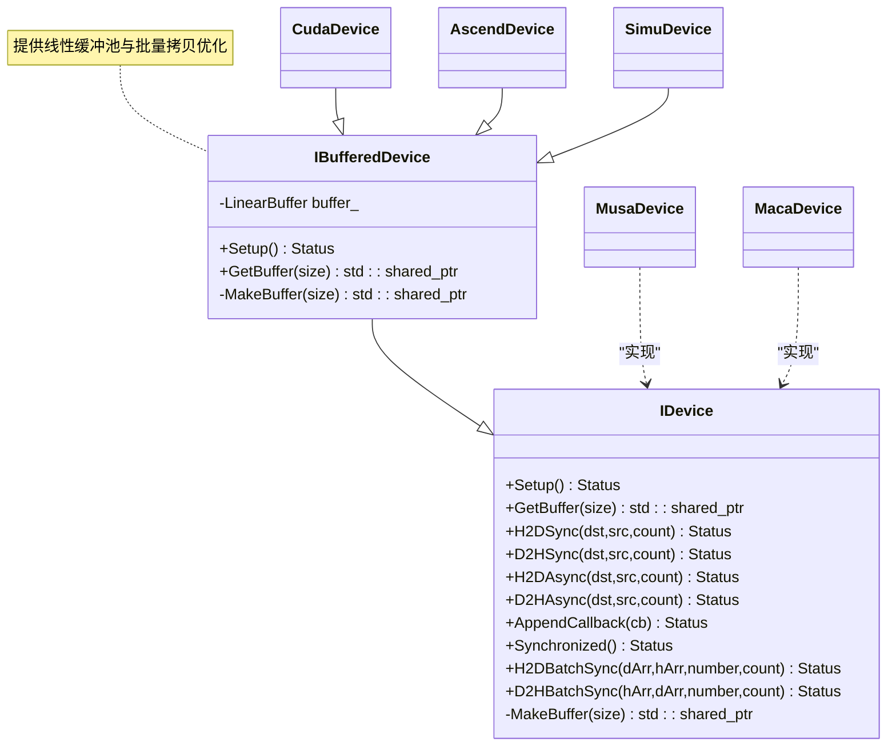
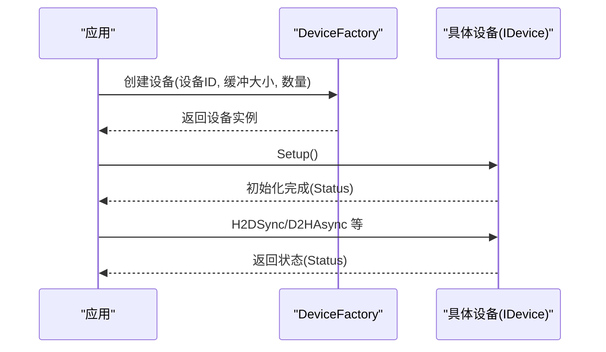
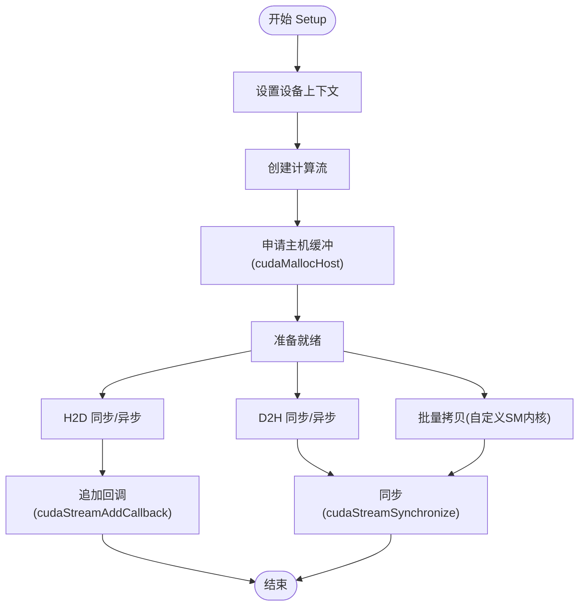
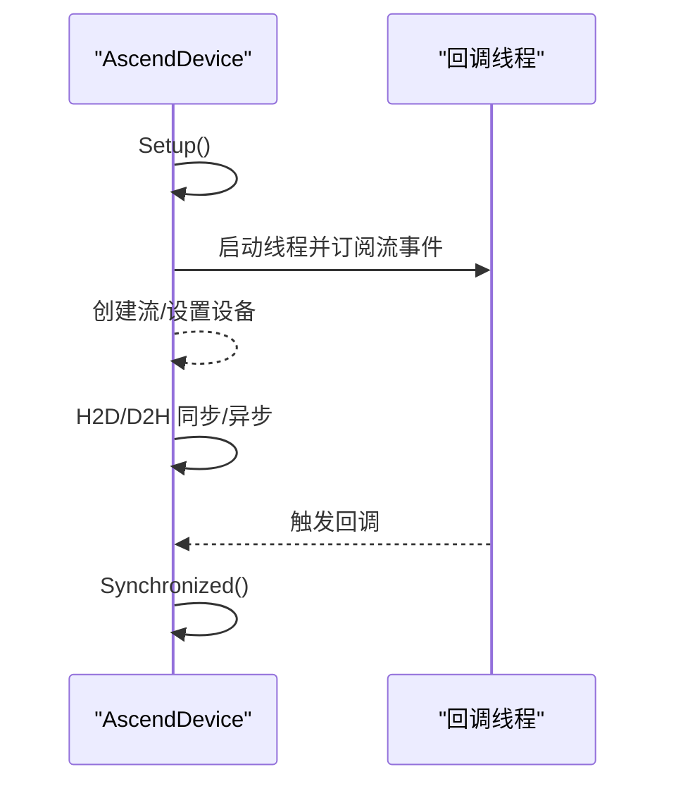
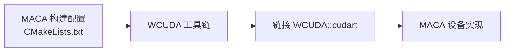
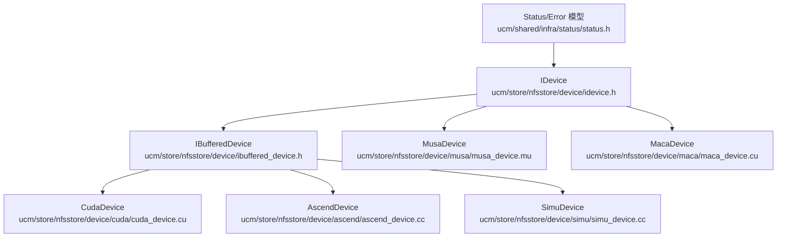

# 设备抽象层

<cite>
**本文引用的文件**
- [ucm/shared/trans/device.h](file://ucm/shared/trans/device.h)
- [ucm/shared/trans/buffer.h](file://ucm/shared/trans/buffer.h)
- [ucm/shared/trans/stream.h](file://ucm/shared/trans/stream.h)
- [ucm/shared/trans/cuda/cuda_device.cc](file://ucm/shared/trans/cuda/cuda_device.cc)
- [ucm/shared/trans/ascend/ascend_device.cc](file://ucm/shared/trans/ascend/ascend_device.cc)
- [ucm/shared/trans/simu/simu_device.cc](file://ucm/shared/trans/simu/simu_device.cc)
- [ucm/shared/trans/maca/CMakeLists.txt](file://ucm/shared/trans/maca/CMakeLists.txt)
- [ucm/store/nfsstore/device/idevice.h](file://ucm/store/nfsstore/device/idevice.h)
- [ucm/store/nfsstore/device/ibuffered_device.h](file://ucm/store/nfsstore/device/ibuffered_device.h)
- [ucm/store/nfsstore/device/cuda/cuda_device.cu](file://ucm/store/nfsstore/device/cuda/cuda_device.cu)
- [ucm/store/nfsstore/device/ascend/ascend_device.cc](file://ucm/store/nfsstore/device/ascend/ascend_device.cc)
- [ucm/store/nfsstore/device/musa/musa_device.mu](file://ucm/store/nfsstore/device/musa/musa_device.mu)
- [ucm/store/nfsstore/device/maca/maca_device.cu](file://ucm/store/nfsstore/device/maca/maca_device.cu)
- [ucm/store/nfsstore/device/simu/simu_device.cc](file://ucm/store/nfsstore/device/simu/simu_device.cc)
- [ucm/store/nfsstore/device/CMakeLists.txt](file://ucm/store/nfsstore/device/CMakeLists.txt)
- [ucm/shared/infra/status/status.h](file://ucm/shared/infra/status/status.h)
</cite>

## 目录
1. [简介](#简介)
2. [项目结构](#项目结构)
3. [核心组件](#核心组件)
4. [架构总览](#架构总览)
5. [组件详解](#组件详解)
6. [依赖关系分析](#依赖关系分析)
7. [性能考量](#性能考量)
8. [故障排查指南](#故障排查指南)
9. [结论](#结论)
10. [附录：扩展新硬件平台指南](#附录扩展新硬件平台指南)

## 简介
本文件系统性阐述UCM设备抽象层的设计理念与实现架构，覆盖统一设备接口定义、多硬件平台适配机制（CUDA、Ascend、MUSA、MACA、SIMU）、设备初始化与资源管理、上下文切换、能力检测与性能特征获取、错误处理最佳实践，并提供扩展新硬件平台的完整指南。

## 项目结构
设备抽象层主要分为两条并行路径：
- Trans层（传输层）：面向通用传输抽象，定义Device/Stream/Buffer三元组，按平台提供具体实现。
- Store层（存储层）：面向KV缓存存储的设备抽象，基于IBufferedDevice封装缓冲池与批量拷贝优化。

```mermaid
graph TB
subgraph "Trans 层"
TDev["Device 抽象<br/>ucm/shared/trans/device.h"]
TBuf["Buffer 抽象<br/>ucm/shared/trans/buffer.h"]
TStr["Stream 抽象<br/>ucm/shared/trans/stream.h"]
TCuda["CUDA 实现<br/>ucm/shared/trans/cuda/cuda_device.cc"]
TAsc["Ascend 实现<br/>ucm/shared/trans/ascend/ascend_device.cc"]
TSimu["SIMU 实现<br/>ucm/shared/trans/simu/simu_device.cc"]
TMaca["MACA 构建配置<br/>ucm/shared/trans/maca/CMakeLists.txt"]
end
subgraph "Store 层"
SDevI["IDevice 接口<br/>ucm/store/nfsstore/device/idevice.h"]
SBufI["IBufferedDevice 接口<br/>ucm/store/nfsstore/device/ibuffered_device.h"]
SCuda["CUDA 设备实现<br/>ucm/store/nfsstore/device/cuda/cuda_device.cu"]
SAsc["Ascend 设备实现<br/>ucm/store/nfsstore/device/ascend/ascend_device.cc"]
SMusa["MUSA 设备实现<br/>ucm/store/nfsstore/device/musa/musa_device.mu"]
SMaca["MACA 设备实现<br/>ucm/store/nfsstore/device/maca/maca_device.cu"]
SSimu["SIMU 设备实现<br/>ucm/store/nfsstore/device/simu/simu_device.cc"]
SEnv["设备子目录选择<br/>ucm/store/nfsstore/device/CMakeLists.txt"]
end
TDev --> TCuda
TDev --> TAsc
TDev --> TSimu
TMaca --> SEnv
SDevI --> SCuda
SDevI --> SAsc
SDevI --> SMusa
SDevI --> SMaca
SDevI --> SSimu
```

图表来源
- [ucm/shared/trans/device.h](file://ucm/shared/trans/device.h#L32-L38)
- [ucm/shared/trans/buffer.h](file://ucm/shared/trans/buffer.h#L32-L46)
- [ucm/shared/trans/stream.h](file://ucm/shared/trans/stream.h#L32-L53)
- [ucm/shared/trans/cuda/cuda_device.cc](file://ucm/shared/trans/cuda/cuda_device.cc#L41-L82)
- [ucm/shared/trans/ascend/ascend_device.cc](file://ucm/shared/trans/ascend/ascend_device.cc#L31-L62)
- [ucm/shared/trans/simu/simu_device.cc](file://ucm/shared/trans/simu/simu_device.cc#L31-L60)
- [ucm/shared/trans/maca/CMakeLists.txt](file://ucm/shared/trans/maca/CMakeLists.txt#L1-L33)
- [ucm/store/nfsstore/device/idevice.h](file://ucm/store/nfsstore/device/idevice.h#L33-L58)
- [ucm/store/nfsstore/device/ibuffered_device.h](file://ucm/store/nfsstore/device/ibuffered_device.h#L31-L82)
- [ucm/store/nfsstore/device/cuda/cuda_device.cu](file://ucm/store/nfsstore/device/cuda/cuda_device.cu#L107-L227)
- [ucm/store/nfsstore/device/ascend/ascend_device.cc](file://ucm/store/nfsstore/device/ascend/ascend_device.cc#L48-L155)
- [ucm/store/nfsstore/device/musa/musa_device.mu](file://ucm/store/nfsstore/device/musa/musa_device.mu#L138-L239)
- [ucm/store/nfsstore/device/maca/maca_device.cu](file://ucm/store/nfsstore/device/maca/maca_device.cu#L1-L200)
- [ucm/store/nfsstore/device/simu/simu_device.cc](file://ucm/store/nfsstore/device/simu/simu_device.cc#L31-L129)
- [ucm/store/nfsstore/device/CMakeLists.txt](file://ucm/store/nfsstore/device/CMakeLists.txt#L1-L19)

章节来源
- [ucm/shared/trans/device.h](file://ucm/shared/trans/device.h#L32-L38)
- [ucm/store/nfsstore/device/idevice.h](file://ucm/store/nfsstore/device/idevice.h#L33-L58)

## 核心组件
- 统一设备接口（Store层）
  - IDevice：定义设备生命周期、同步/异步内存拷贝、回调追加、批量拷贝等统一接口。
  - IBufferedDevice：在IDevice之上提供线性缓冲池，按批次复用主机侧缓冲，降低频繁分配开销。
  - DeviceFactory：按运行时环境选择具体设备实现。
- 传输抽象（Trans层）
  - Device：封装设备上下文设置、流与缓冲区创建。
  - Stream：统一Host<->Device单/批量异步/同步拷贝接口。
  - Buffer：统一设备/主机侧缓冲区创建与注册。

章节来源
- [ucm/store/nfsstore/device/idevice.h](file://ucm/store/nfsstore/device/idevice.h#L33-L58)
- [ucm/store/nfsstore/device/ibuffered_device.h](file://ucm/store/nfsstore/device/ibuffered_device.h#L31-L82)
- [ucm/shared/trans/device.h](file://ucm/shared/trans/device.h#L32-L38)
- [ucm/shared/trans/stream.h](file://ucm/shared/trans/stream.h#L32-L53)
- [ucm/shared/trans/buffer.h](file://ucm/shared/trans/buffer.h#L32-L46)

## 架构总览
设备抽象层通过“接口+工厂+平台实现”的分层设计，实现跨平台一致性：
- 运行时通过环境变量或构建参数选择目标平台，加载对应子目录下的设备实现。
- Store层以IBufferedDevice为核心，提供缓冲池与批量拷贝优化；Trans层以Device/Stream/Buffer为核心，提供更通用的传输抽象。

图表来源
- [ucm/store/nfsstore/device/idevice.h](file://ucm/store/nfsstore/device/idevice.h#L33-L58)
- [ucm/store/nfsstore/device/ibuffered_device.h](file://ucm/store/nfsstore/device/ibuffered_device.h#L31-L82)
- [ucm/store/nfsstore/device/cuda/cuda_device.cu](file://ucm/store/nfsstore/device/cuda/cuda_device.cu#L107-L227)
- [ucm/store/nfsstore/device/ascend/ascend_device.cc](file://ucm/store/nfsstore/device/ascend/ascend_device.cc#L48-L155)
- [ucm/store/nfsstore/device/musa/musa_device.mu](file://ucm/store/nfsstore/device/musa/musa_device.mu#L138-L239)
- [ucm/store/nfsstore/device/maca/maca_device.cu](file://ucm/store/nfsstore/device/maca/maca_device.cu#L1-L200)
- [ucm/store/nfsstore/device/simu/simu_device.cc](file://ucm/store/nfsstore/device/simu/simu_device.cc#L31-L129)

## 组件详解

### 统一设备接口与工厂
- IDevice定义了设备生命周期与数据传输的最小集接口，确保不同平台实现具备一致行为契约。
- IBufferedDevice在IDevice基础上增加线性缓冲池，按批次复用主机侧缓冲，减少频繁分配与释放带来的性能损耗。
- DeviceFactory根据运行时环境选择具体实现类，屏蔽平台差异。

图表来源
- [ucm/store/nfsstore/device/idevice.h](file://ucm/store/nfsstore/device/idevice.h#L33-L58)
- [ucm/store/nfsstore/device/ibuffered_device.h](file://ucm/store/nfsstore/device/ibuffered_device.h#L64-L82)

章节来源
- [ucm/store/nfsstore/device/idevice.h](file://ucm/store/nfsstore/device/idevice.h#L33-L58)
- [ucm/store/nfsstore/device/ibuffered_device.h](file://ucm/store/nfsstore/device/ibuffered_device.h#L31-L82)

### CUDA 平台实现
- 上下文与CPU亲和：Trans层通过NVML设置设备CPU亲和；Store层通过cudaSetDevice设置设备上下文。
- 批量拷贝优化：使用自定义SM内核进行批量H2D/D2H拷贝，提升多指针场景吞吐。
- 异步回调：通过cudaStreamAddCallback实现回调注入，配合Synchronized保证顺序。
- 主机缓冲：使用cudaMallocHost/cudaFreeHost申请可页锁定内存，提高DMA效率。

图表来源
- [ucm/shared/trans/cuda/cuda_device.cc](file://ucm/shared/trans/cuda/cuda_device.cc#L41-L82)
- [ucm/store/nfsstore/device/cuda/cuda_device.cu](file://ucm/store/nfsstore/device/cuda/cuda_device.cu#L142-L227)

章节来源
- [ucm/shared/trans/cuda/cuda_device.cc](file://ucm/shared/trans/cuda/cuda_device.cc#L33-L47)
- [ucm/store/nfsstore/device/cuda/cuda_device.cu](file://ucm/store/nfsstore/device/cuda/cuda_device.cu#L107-L227)

### Ascend 平台实现
- 设备上下文：通过aclrtSetDevice设置设备；销毁时调用aclrtResetDevice重置设备。
- 回调机制：通过独立线程轮询aclrtProcessReport，订阅流事件后触发回调。
- 批量拷贝：采用循环逐个同步拷贝，简化实现但吞吐略低。
- 主机缓冲：使用aclrtMallocHost/aclrtFreeHost。

图表来源
- [ucm/store/nfsstore/device/ascend/ascend_device.cc](file://ucm/store/nfsstore/device/ascend/ascend_device.cc#L79-L122)

章节来源
- [ucm/store/nfsstore/device/ascend/ascend_device.cc](file://ucm/store/nfsstore/device/ascend/ascend_device.cc#L48-L155)

### MUSA 平台实现
- 设备上下文：通过musaSetDevice设置设备；创建musaStream_t。
- 批量拷贝：与CUDA类似，提供H2D/D2H同步/异步与批量拷贝接口。
- 主机缓冲：使用musaMallocHost/musaFreeHost。

章节来源
- [ucm/store/nfsstore/device/musa/musa_device.mu](file://ucm/store/nfsstore/device/musa/musa_device.mu#L138-L239)

### MACA 平台实现
- 构建配置：通过WCUDA桥接CUDA工具链，启用CUDA语言支持，链接WCUDA库。
- 设备实现：与CUDA相似，提供自定义SM拷贝内核与流管理。
- 适配策略：MACA兼容CUDA生态，通过cu-bridge映射到WCUDA，保持代码复用。

图表来源
- [ucm/shared/trans/maca/CMakeLists.txt](file://ucm/shared/trans/maca/CMakeLists.txt#L1-L33)
- [ucm/store/nfsstore/device/maca/maca_device.cu](file://ucm/store/nfsstore/device/maca/maca_device.cu#L1-L200)

章节来源
- [ucm/shared/trans/maca/CMakeLists.txt](file://ucm/shared/trans/maca/CMakeLists.txt#L1-L33)
- [ucm/store/nfsstore/device/maca/maca_device.cu](file://ucm/store/nfsstore/device/maca/maca_device.cu#L1-L200)

### SIMU 平台实现
- 设备上下文：无实际设备，仅返回成功。
- 批量拷贝：通过后台线程池顺序执行，模拟异步回调。
- 主机缓冲：使用标准malloc/free。

章节来源
- [ucm/shared/trans/simu/simu_device.cc](file://ucm/shared/trans/simu/simu_device.cc#L31-L60)
- [ucm/store/nfsstore/device/simu/simu_device.cc](file://ucm/store/nfsstore/device/simu/simu_device.cc#L31-L129)

### 运行时环境选择与构建集成
- Store层设备子目录通过RUNTIME_ENVIRONMENT选择具体平台实现，确保只编译目标平台代码。
- Trans层MACA通过CMake引入WCUDA工具链，实现CUDA兼容。

章节来源
- [ucm/store/nfsstore/device/CMakeLists.txt](file://ucm/store/nfsstore/device/CMakeLists.txt#L1-L19)
- [ucm/shared/trans/maca/CMakeLists.txt](file://ucm/shared/trans/maca/CMakeLists.txt#L1-L33)

## 依赖关系分析
- 接口耦合
  - Store层：IBufferedDevice继承IDevice，统一了缓冲池与传输接口，降低上层对平台差异的感知。
  - Trans层：Device/Stream/Buffer解耦，便于按需组合使用。
- 外部依赖
  - CUDA：cuda_runtime、NVML（Trans层CPU亲和）。
  - Ascend：acl/acl.h。
  - MUSA：musa_runtime。
  - MACA：WCUDA桥接CUDA工具链。
- 错误处理
  - 统一Status/Error模型，所有平台实现均返回Status，便于上层统一处理。

图表来源
- [ucm/shared/infra/status/status.h](file://ucm/shared/infra/status/status.h#L40-L94)
- [ucm/store/nfsstore/device/idevice.h](file://ucm/store/nfsstore/device/idevice.h#L33-L58)
- [ucm/store/nfsstore/device/ibuffered_device.h](file://ucm/store/nfsstore/device/ibuffered_device.h#L31-L82)
- [ucm/store/nfsstore/device/cuda/cuda_device.cu](file://ucm/store/nfsstore/device/cuda/cuda_device.cu#L107-L227)
- [ucm/store/nfsstore/device/ascend/ascend_device.cc](file://ucm/store/nfsstore/device/ascend/ascend_device.cc#L48-L155)
- [ucm/store/nfsstore/device/musa/musa_device.mu](file://ucm/store/nfsstore/device/musa/musa_device.mu#L138-L239)
- [ucm/store/nfsstore/device/maca/maca_device.cu](file://ucm/store/nfsstore/device/maca/maca_device.cu#L1-L200)
- [ucm/store/nfsstore/device/simu/simu_device.cc](file://ucm/store/nfsstore/device/simu/simu_device.cc#L31-L129)

## 性能考量
- 缓冲池复用：IBufferedDevice通过线性缓冲池减少频繁分配，适合高并发小块拷贝场景。
- 批量拷贝优化：CUDA/MACA平台提供自定义SM内核，显著提升多指针批量拷贝吞吐。
- 异步回调：利用平台回调机制避免轮询，降低CPU占用。
- CPU亲和：CUDA Trans层通过NVML设置CPU亲和，有助于降低NUMA跨域开销。
- 主机页锁定：使用cudaMallocHost等页锁定内存，提升DMA效率。

[本节为通用性能建议，不直接分析具体文件]

## 故障排查指南
- 常见错误类型
  - 参数错误：InvalidParam
  - 内存不足：OutOfMemory
  - 系统API错误：OsApiError
  - 超时：Timeout
- 排查步骤
  - 检查设备ID合法性与可用性。
  - 核对运行时环境变量与构建配置是否匹配。
  - 关注平台特定错误码与日志输出（如CUDA/ACL/MUSA错误字符串）。
  - 对于回调失败，确认流状态与回调函数生命周期。
- 最佳实践
  - 统一使用Status判断，避免忽略错误。
  - 在批量操作前后调用Synchronized确保一致性。
  - 遇到OOM优先释放缓冲池或减小batch size。

章节来源
- [ucm/shared/infra/status/status.h](file://ucm/shared/infra/status/status.h#L40-L94)
- [ucm/store/nfsstore/device/cuda/cuda_device.cu](file://ucm/store/nfsstore/device/cuda/cuda_device.cu#L93-L105)
- [ucm/store/nfsstore/device/ascend/ascend_device.cc](file://ucm/store/nfsstore/device/ascend/ascend_device.cc#L34-L46)

## 结论
UCM设备抽象层通过清晰的接口分层与平台适配机制，在保证上层一致性的同时，充分发挥各平台特性。CUDA/MACA在批量拷贝与SM内核方面表现突出；Ascend通过回调线程实现事件驱动；MUSA提供与CUDA相近的编程体验；SIMU用于离线验证与基准测试。结合统一的错误模型与缓冲池优化，可在多硬件平台上获得稳定且高性能的设备抽象能力。

[本节为总结性内容，不直接分析具体文件]

## 附录：扩展新硬件平台指南
- 步骤
  - 在Store层
    - 新增平台目录与设备实现类，继承IBufferedDevice或IDevice。
    - 实现Setup/H2D/D2H/Async/Batch/Callback/Synchronized等接口。
    - 在DeviceFactory中注册新平台。
  - 在Trans层
    - 提供Device::MakeStream/MakeSMStream/MakeBuffer的实现。
    - 如需SM内核，编写对应CUDA内核并在CMake中链接。
  - 构建集成
    - 在Store层device子目录的CMakeLists.txt中添加新平台分支。
    - 如需桥接工具链（如MACA），在Trans层相应CMake中配置。
  - 测试与验证
    - 使用SIMU进行基础功能验证。
    - 在目标硬件上验证性能与稳定性。
- 注意事项
  - 严格遵循Status返回约定，确保错误信息可追溯。
  - 尽量复用现有缓冲池与批量拷贝逻辑，减少重复实现。
  - 保持接口语义一致，避免平台特有行为泄漏到上层。

章节来源
- [ucm/store/nfsstore/device/idevice.h](file://ucm/store/nfsstore/device/idevice.h#L60-L64)
- [ucm/store/nfsstore/device/ibuffered_device.h](file://ucm/store/nfsstore/device/ibuffered_device.h#L64-L82)
- [ucm/store/nfsstore/device/CMakeLists.txt](file://ucm/store/nfsstore/device/CMakeLists.txt#L1-L19)
- [ucm/shared/trans/maca/CMakeLists.txt](file://ucm/shared/trans/maca/CMakeLists.txt#L1-L33)