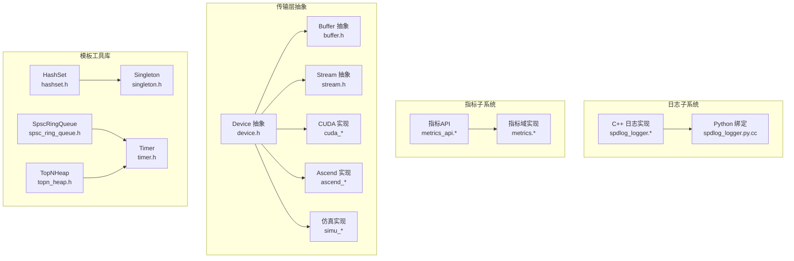
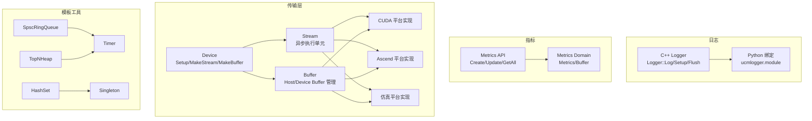
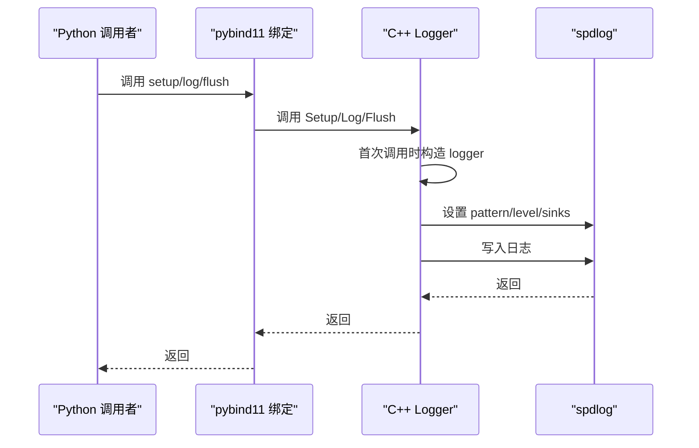
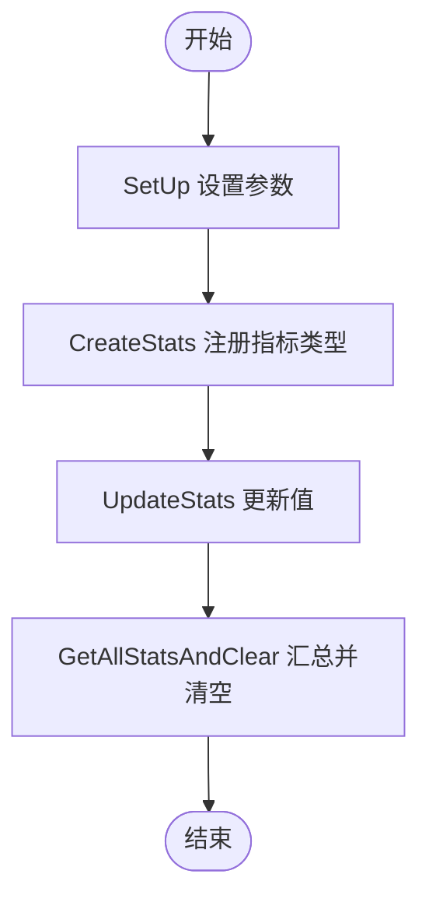
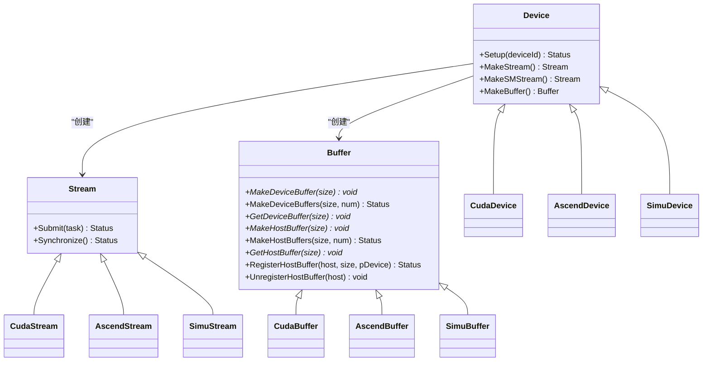
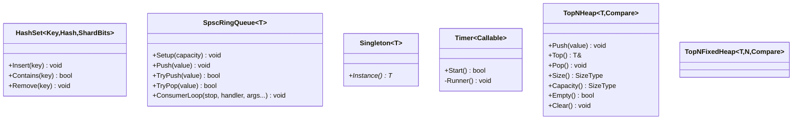
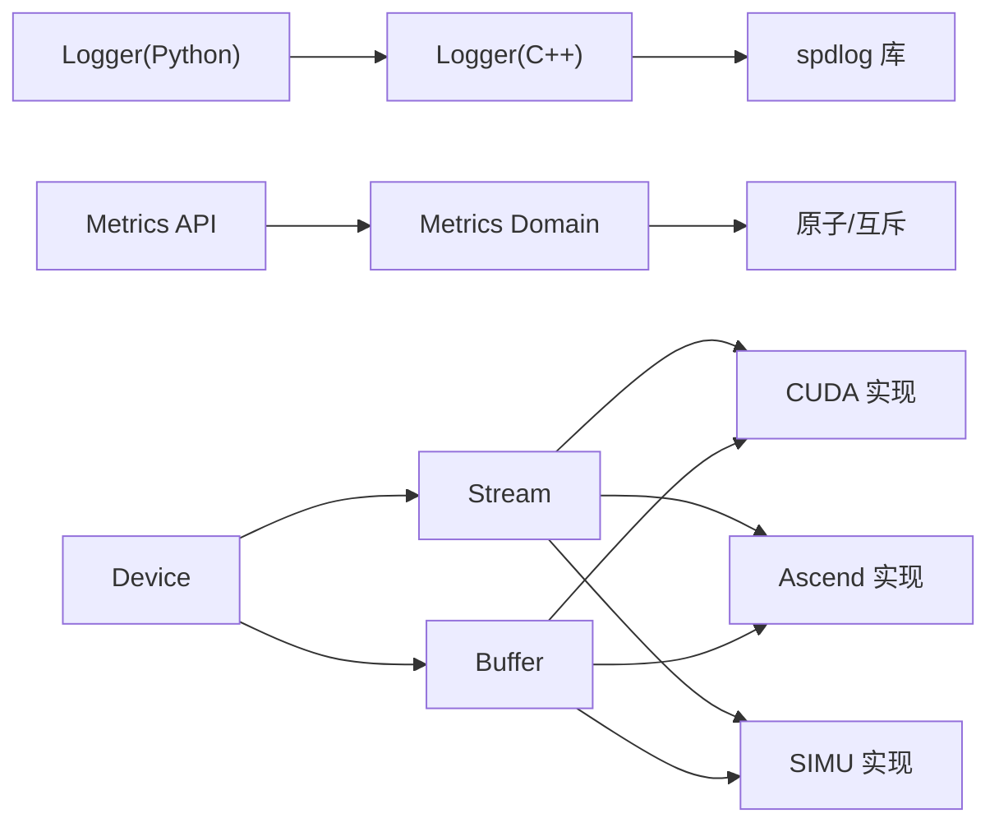

# 基础设施组件

<cite>
**本文引用的文件**
- [spdlog_logger.h](file://ucm/shared/infra/logger/cc/spdlog_logger.h)
- [spdlog_logger.cc](file://ucm/shared/infra/logger/cc/spdlog_logger.cc)
- [spdlog_logger.py.cc](file://ucm/shared/infra/logger/cpy/spdlog_logger.py.cc)
- [metrics.h](file://ucm/shared/metrics/cc/domain/metrics.h)
- [metrics.cc](file://ucm/shared/metrics/cc/domain/metrics.cc)
- [metrics_api.h](file://ucm/shared/metrics/cc/api/metrics_api.h)
- [metrics_api.cc](file://ucm/shared/metrics/cc/api/metrics_api.cc)
- [buffer.h](file://ucm/shared/trans/buffer.h)
- [device.h](file://ucm/shared/trans/device.h)
- [cuda_buffer.h](file://ucm/shared/trans/cuda/cuda_buffer.h)
- [cuda_buffer.cc](file://ucm/shared/trans/cuda/cuda_buffer.cc)
- [cuda_stream.h](file://ucm/shared/trans/cuda/cuda_stream.h)
- [cuda_stream.cc](file://ucm/shared/trans/cuda/cuda_stream.cc)
- [cuda_sm_stream.h](file://ucm/shared/trans/cuda/cuda_sm_stream.h)
- [cuda_sm_stream.cc](file://ucm/shared/trans/cuda/cuda_sm_stream.cc)
- [cuda_device.cc](file://ucm/shared/trans/cuda/cuda_device.cc)
- [ascend_buffer.h](file://ucm/shared/trans/ascend/ascend_buffer.h)
- [ascend_buffer.cc](file://ucm/shared/trans/ascend/ascend_buffer.cc)
- [ascend_stream.h](file://ucm/shared/trans/ascend/ascend_stream.h)
- [ascend_stream.cc](file://ucm/shared/trans/ascend/ascend_stream.cc)
- [ascend_device.cc](file://ucm/shared/trans/ascend/ascend_device.cc)
- [simu_buffer.h](file://ucm/shared/trans/simu/simu_buffer.h)
- [simu_buffer.cc](file://ucm/shared/trans/simu/simu_buffer.cc)
- [simu_stream.h](file://ucm/shared/trans/simu/simu_stream.h)
- [simu_stream.cc](file://ucm/shared/trans/simu/simu_stream.cc)
- [simu_device.cc](file://ucm/shared/trans/simu/simu_device.cc)
- [hashset.h](file://ucm/shared/infra/template/hashset.h)
- [singleton.h](file://ucm/shared/infra/template/singleton.h)
- [spsc_ring_queue.h](file://ucm/shared/infra/template/spsc_ring_queue.h)
- [timer.h](file://ucm/shared/infra/template/timer.h)
- [topn_heap.h](file://ucm/shared/infra/template/topn_heap.h)
</cite>

## 目录
1. [引言](#引言)
2. [项目结构](#项目结构)
3. [核心组件](#核心组件)
4. [架构总览](#架构总览)
5. [详细组件分析](#详细组件分析)
6. [依赖关系分析](#依赖关系分析)
7. [性能考虑](#性能考虑)
8. [故障排查指南](#故障排查指南)
9. [结论](#结论)
10. [附录](#附录)

## 引言
本文件面向UCM基础设施组件，围绕以下主题展开：日志系统（C++与Python双栈）、指标监控（Prometheus集成与采集上报）、线程池与任务队列、传输层抽象（CUDA/Ascend/MUSA等）以及模板工具库（哈希集合、单例、环形队列等）。文档在保证技术深度的同时，力求以渐进方式呈现，便于不同背景读者理解。

## 项目结构
基础设施相关代码主要位于 ucm/shared 目录下，按功能域划分：
- 日志：cc 与 cpy 子目录分别提供C++与Python绑定实现
- 指标：cc 的 domain 与 api 提供指标定义与对外API
- 传输层：trans 下按硬件平台拆分设备/流/缓冲区抽象
- 模板工具：infra/template 提供通用数据结构与并发原语
- 其他：status/status.h 等基础状态类型

图示来源
- [spdlog_logger.h](file://ucm/shared/infra/logger/cc/spdlog_logger.h#L38-L77)
- [metrics.h](file://ucm/shared/metrics/cc/domain/metrics.h#L72-L117)
- [device.h](file://ucm/shared/trans/device.h#L32-L38)
- [buffer.h](file://ucm/shared/trans/buffer.h#L32-L46)
- [hashset.h](file://ucm/shared/infra/template/hashset.h#L37-L132)
- [singleton.h](file://ucm/shared/infra/template/singleton.h#L29-L42)
- [spsc_ring_queue.h](file://ucm/shared/infra/template/spsc_ring_queue.h#L36-L117)
- [timer.h](file://ucm/shared/infra/template/timer.h#L35-L86)
- [topn_heap.h](file://ucm/shared/infra/template/topn_heap.h#L34-L111)

章节来源
- [spdlog_logger.h](file://ucm/shared/infra/logger/cc/spdlog_logger.h#L24-L78)
- [metrics.h](file://ucm/shared/metrics/cc/domain/metrics.h#L24-L120)
- [device.h](file://ucm/shared/trans/device.h#L24-L43)
- [buffer.h](file://ucm/shared/trans/buffer.h#L24-L51)
- [hashset.h](file://ucm/shared/infra/template/hashset.h#L24-L137)
- [singleton.h](file://ucm/shared/infra/template/singleton.h#L24-L47)
- [spsc_ring_queue.h](file://ucm/shared/infra/template/spsc_ring_queue.h#L24-L122)
- [timer.h](file://ucm/shared/infra/template/timer.h#L24-L91)
- [topn_heap.h](file://ucm/shared/infra/template/topn_heap.h#L24-L122)

## 核心组件
- 日志系统：基于spdlog的C++实现，支持控制台与轮转文件输出、信号触发刷新、环境变量动态级别控制；通过pybind11向Python暴露接口
- 指标系统：无锁多缓冲聚合、线程本地缓冲、支持计数器/量表示数/直方图，提供统一API用于注册与更新
- 传输层：Device/Buffer/Stream 抽象，按平台提供具体实现（CUDA/Ascend/SIMU），屏蔽底层差异
- 模板工具：HashSet、SpscRingQueue、Singleton、Timer、TopNHeap 等高性能并发容器与原语

章节来源
- [spdlog_logger.cc](file://ucm/shared/infra/logger/cc/spdlog_logger.cc#L40-L91)
- [metrics.cc](file://ucm/shared/metrics/cc/domain/metrics.cc#L32-L115)
- [device.h](file://ucm/shared/trans/device.h#L32-L38)
- [buffer.h](file://ucm/shared/trans/buffer.h#L32-L46)
- [hashset.h](file://ucm/shared/infra/template/hashset.h#L37-L132)
- [spsc_ring_queue.h](file://ucm/shared/infra/template/spsc_ring_queue.h#L36-L117)
- [singleton.h](file://ucm/shared/infra/template/singleton.h#L29-L42)
- [timer.h](file://ucm/shared/infra/template/timer.h#L35-L86)
- [topn_heap.h](file://ucm/shared/infra/template/topn_heap.h#L34-L111)

## 架构总览
下图展示基础设施组件之间的交互关系与职责边界。

图示来源
- [spdlog_logger.cc](file://ucm/shared/infra/logger/cc/spdlog_logger.cc#L40-L91)
- [metrics_api.cc](file://ucm/shared/metrics/cc/api/metrics_api.cc#L27-L49)
- [device.h](file://ucm/shared/trans/device.h#L32-L38)
- [buffer.h](file://ucm/shared/trans/buffer.h#L32-L46)
- [hashset.h](file://ucm/shared/infra/template/hashset.h#L37-L132)
- [spsc_ring_queue.h](file://ucm/shared/infra/template/spsc_ring_queue.h#L36-L117)
- [singleton.h](file://ucm/shared/infra/template/singleton.h#L29-L42)
- [timer.h](file://ucm/shared/infra/template/timer.h#L35-L86)
- [topn_heap.h](file://ucm/shared/infra/template/topn_heap.h#L34-L111)

## 详细组件分析

### 日志系统（C++ 与 Python 双栈）
- 设计要点
  - 单例Logger，延迟初始化，首次使用时构建spdlog logger实例
  - 支持控制台彩色输出与轮转文件输出，路径按进程隔离
  - 通过环境变量设置日志级别，支持运行时调整
  - 注册信号处理器，在异常信号时强制刷新日志
  - 提供静态API供Python侧调用，通过pybind11导出
- 关键流程
  - 初始化：Setup设置路径与轮转参数，首次Log触发内部构造
  - 记录：Log接收级别、源位置与消息，映射到spdlog级别并写入
  - 刷新：Flush在析构或信号回调中调用
- 输出格式
  - 时间戳、日志名、级别、消息正文、PID/线程ID、源文件与行号等

图示来源
- [spdlog_logger.cc](file://ucm/shared/infra/logger/cc/spdlog_logger.cc#L40-L91)
- [spdlog_logger.py.cc](file://ucm/shared/infra/logger/cpy/spdlog_logger.py.cc#L45-L56)

章节来源
- [spdlog_logger.h](file://ucm/shared/infra/logger/cc/spdlog_logger.h#L31-L74)
- [spdlog_logger.cc](file://ucm/shared/infra/logger/cc/spdlog_logger.cc#L40-L91)
- [spdlog_logger.py.cc](file://ucm/shared/infra/logger/cpy/spdlog_logger.py.cc#L30-L56)

### 指标监控系统（Prometheus 集成与采集）
- 设计要点
  - 多缓冲聚合：每个线程拥有独立缓冲，定期切换读写缓冲，降低全局锁竞争
  - 类型支持：计数器、量表示数、直方图（带上限长度）
  - 线程安全：共享互斥保护类型表，读写缓冲内部使用共享互斥
  - 对外API：SetUp/CreateStats/UpdateStats/GetAllStatsAndClear
- 关键流程
  - 初始化：SetUp设置最大直方图长度
  - 注册：CreateStats声明指标名称与类型
  - 更新：UpdateStats按类型累加/覆盖/追加
  - 汇总：GetAllStatsAndClear合并所有线程缓冲并清空

图示来源
- [metrics_api.cc](file://ucm/shared/metrics/cc/api/metrics_api.cc#L27-L49)
- [metrics.cc](file://ucm/shared/metrics/cc/domain/metrics.cc#L32-L115)

章节来源
- [metrics.h](file://ucm/shared/metrics/cc/domain/metrics.h#L39-L117)
- [metrics.cc](file://ucm/shared/metrics/cc/domain/metrics.cc#L32-L115)
- [metrics_api.h](file://ucm/shared/metrics/cc/api/metrics_api.h#L30-L41)
- [metrics_api.cc](file://ucm/shared/metrics/cc/api/metrics_api.cc#L27-L49)

### 传输层抽象（CUDA/Ascend/MUSA/SIMU）
- 设计要点
  - Device 抽象：提供 Setup、创建 Stream 与 Buffer 的工厂方法
  - Buffer 抽象：统一 Host/Device 缓冲生命周期管理与注册
  - Stream 抽象：异步执行单元，支持常规与特定SM类型的流
  - 平台实现：按硬件提供对应 Device/Stream/Buffer 实现，保持接口一致
- 关键类关系

图示来源
- [device.h](file://ucm/shared/trans/device.h#L32-L38)
- [buffer.h](file://ucm/shared/trans/buffer.h#L32-L46)
- [cuda_device.cc](file://ucm/shared/trans/cuda/cuda_device.cc)
- [cuda_stream.h](file://ucm/shared/trans/cuda/cuda_stream.h)
- [cuda_stream.cc](file://ucm/shared/trans/cuda/cuda_stream.cc)
- [cuda_buffer.h](file://ucm/shared/trans/cuda/cuda_buffer.h)
- [cuda_buffer.cc](file://ucm/shared/trans/cuda/cuda_buffer.cc)
- [ascend_device.cc](file://ucm/shared/trans/ascend/ascend_device.cc)
- [ascend_stream.h](file://ucm/shared/trans/ascend/ascend_stream.h)
- [ascend_stream.cc](file://ucm/shared/trans/ascend/ascend_stream.cc)
- [ascend_buffer.h](file://ucm/shared/trans/ascend/ascend_buffer.h)
- [ascend_buffer.cc](file://ucm/shared/trans/ascend/ascend_buffer.cc)
- [simu_device.cc](file://ucm/shared/trans/simu/simu_device.cc)
- [simu_stream.h](file://ucm/shared/trans/simu/simu_stream.h)
- [simu_stream.cc](file://ucm/shared/trans/simu/simu_stream.cc)
- [simu_buffer.h](file://ucm/shared/trans/simu/simu_buffer.h)
- [simu_buffer.cc](file://ucm/shared/trans/simu/simu_buffer.cc)

章节来源
- [device.h](file://ucm/shared/trans/device.h#L32-L38)
- [buffer.h](file://ucm/shared/trans/buffer.h#L32-L46)
- [cuda_device.cc](file://ucm/shared/trans/cuda/cuda_device.cc)
- [cuda_stream.h](file://ucm/shared/trans/cuda/cuda_stream.h)
- [cuda_stream.cc](file://ucm/shared/trans/cuda/cuda_stream.cc)
- [cuda_buffer.h](file://ucm/shared/trans/cuda/cuda_buffer.h)
- [cuda_buffer.cc](file://ucm/shared/trans/cuda/cuda_buffer.cc)
- [ascend_device.cc](file://ucm/shared/trans/ascend/ascend_device.cc)
- [ascend_stream.h](file://ucm/shared/trans/ascend/ascend_stream.h)
- [ascend_stream.cc](file://ucm/shared/trans/ascend/ascend_stream.cc)
- [ascend_buffer.h](file://ucm/shared/trans/ascend/ascend_buffer.h)
- [ascend_buffer.cc](file://ucm/shared/trans/ascend/ascend_buffer.cc)
- [simu_device.cc](file://ucm/shared/trans/simu/simu_device.cc)
- [simu_stream.h](file://ucm/shared/trans/simu/simu_stream.h)
- [simu_stream.cc](file://ucm/shared/trans/simu/simu_stream.cc)
- [simu_buffer.h](file://ucm/shared/trans/simu/simu_buffer.h)
- [simu_buffer.cc](file://ucm/shared/trans/simu/simu_buffer.cc)

### 模板工具库（通用组件）
- HashSet：分片哈希集合，支持插入/查找/删除，自动扩容与探查
- SpscRingQueue：单生产者单消费者环形队列，自旋+让步策略，支持批量消费
- Singleton：线程安全单例模板
- Timer：周期性定时器，可停止与回收
- TopNHeap/TopNFixedHeap：固定容量Top-K堆，支持比较器定制

图示来源
- [hashset.h](file://ucm/shared/infra/template/hashset.h#L37-L132)
- [spsc_ring_queue.h](file://ucm/shared/infra/template/spsc_ring_queue.h#L36-L117)
- [singleton.h](file://ucm/shared/infra/template/singleton.h#L29-L42)
- [timer.h](file://ucm/shared/infra/template/timer.h#L35-L86)
- [topn_heap.h](file://ucm/shared/infra/template/topn_heap.h#L34-L111)

章节来源
- [hashset.h](file://ucm/shared/infra/template/hashset.h#L37-L132)
- [spsc_ring_queue.h](file://ucm/shared/infra/template/spsc_ring_queue.h#L36-L117)
- [singleton.h](file://ucm/shared/infra/template/singleton.h#L29-L42)
- [timer.h](file://ucm/shared/infra/template/timer.h#L35-L86)
- [topn_heap.h](file://ucm/shared/infra/template/topn_heap.h#L34-L111)

## 依赖关系分析
- 日志子系统
  - C++侧依赖spdlog（异步、颜色控制台、轮转文件、信号处理）
  - Python侧通过pybind11绑定导出C++接口
- 指标子系统
  - API层封装Domain层，Domain层使用原子与互斥实现低开销聚合
- 传输层
  - Device/Buffer/Stream 为上层抽象，各平台实现遵循相同接口契约
- 模板工具
  - HashSet/TopNHeap 等为通用数据结构，被其他模块复用

图示来源
- [spdlog_logger.cc](file://ucm/shared/infra/logger/cc/spdlog_logger.cc#L25-L33)
- [metrics_api.cc](file://ucm/shared/metrics/cc/api/metrics_api.cc#L24-L25)
- [metrics.cc](file://ucm/shared/metrics/cc/domain/metrics.cc#L24-L25)
- [device.h](file://ucm/shared/trans/device.h#L32-L38)
- [buffer.h](file://ucm/shared/trans/buffer.h#L32-L46)
- [cuda_stream.h](file://ucm/shared/trans/cuda/cuda_stream.h)
- [ascend_stream.h](file://ucm/shared/trans/ascend/ascend_stream.h)
- [simu_stream.h](file://ucm/shared/trans/simu/simu_stream.h)

章节来源
- [spdlog_logger.cc](file://ucm/shared/infra/logger/cc/spdlog_logger.cc#L25-L33)
- [metrics.cc](file://ucm/shared/metrics/cc/domain/metrics.cc#L24-L25)
- [device.h](file://ucm/shared/trans/device.h#L32-L38)
- [buffer.h](file://ucm/shared/trans/buffer.h#L32-L46)

## 性能考虑
- 日志
  - 使用异步日志与轮转文件，避免阻塞业务线程
  - 进程隔离日志路径减少IO争用
  - 信号触发刷新确保异常场景不丢日志
- 指标
  - 线程本地缓冲+双缓冲切换，降低全局锁持有时间
  - 直方图长度上限限制内存增长
  - 批量汇总后清空，避免累积
- 传输层
  - Stream 异步提交，减少同步等待
  - Buffer 生命周期集中管理，降低分配/释放开销
- 工具库
  - HashSet 分片与缓存友好的对齐，提升并发性能
  - SpscRingQueue 自旋+让步策略平衡吞吐与CPU占用
  - TopNHeap 固定容量，避免动态扩容

## 故障排查指南
- 日志
  - 现象：日志未输出或级别不对
  - 排查：检查环境变量是否正确设置；确认路径是否存在且可写；验证轮转参数
  - 参考
    - [spdlog_logger.cc](file://ucm/shared/infra/logger/cc/spdlog_logger.cc#L55-L71)
    - [spdlog_logger.cc](file://ucm/shared/infra/logger/cc/spdlog_logger.cc#L79-L85)
- 指标
  - 现象：指标缺失或统计异常
  - 排查：确认是否先调用 SetUp；是否已 CreateStats；是否在同一线程注册
  - 参考
    - [metrics.cc](file://ucm/shared/metrics/cc/domain/metrics.cc#L32-L53)
    - [metrics.cc](file://ucm/shared/metrics/cc/domain/metrics.cc#L55-L81)
    - [metrics.cc](file://ucm/shared/metrics/cc/domain/metrics.cc#L88-L115)
- 传输层
  - 现象：设备初始化失败或流提交报错
  - 排查：检查设备ID与驱动可用性；确认Buffer生命周期管理；核对平台实现是否正确链接
  - 参考
    - [device.h](file://ucm/shared/trans/device.h#L32-L38)
    - [buffer.h](file://ucm/shared/trans/buffer.h#L32-L46)

章节来源
- [spdlog_logger.cc](file://ucm/shared/infra/logger/cc/spdlog_logger.cc#L55-L85)
- [metrics.cc](file://ucm/shared/metrics/cc/domain/metrics.cc#L32-L115)
- [device.h](file://ucm/shared/trans/device.h#L32-L38)
- [buffer.h](file://ucm/shared/trans/buffer.h#L32-L46)

## 结论
本基础设施组件以“抽象统一、实现解耦、并发友好”为核心设计原则：日志与指标提供可观测性基石，传输层屏蔽硬件差异，模板工具库支撑高并发数据结构与原语。通过合理的缓冲与锁策略，兼顾吞吐与资源占用，满足大模型推理场景下的稳定性与性能需求。

## 附录
- 配置项与建议
  - 日志
    - 环境变量：通过环境变量设置日志级别
    - 路径与轮转：Setup指定日志根路径与轮转大小/数量
    - 建议：生产环境开启轮转并设置合理大小，避免单文件过大
  - 指标
    - 初始化：先 SetUp，再 CreateStats
    - 直方图长度：根据采样频率与内存预算设置上限
    - 建议：定期调用 GetAllStatsAndClear，避免持续增长
  - 传输层
    - 设备选择：根据部署硬件选择对应平台实现
    - 流与缓冲：优先使用异步流，集中管理缓冲生命周期
  - 模板工具
    - HashSet：根据预期容量选择合适的分片位数
    - SpscRingQueue：根据生产/消费速率调整容量与批处理大小
    - Timer：注意停止条件与线程回收