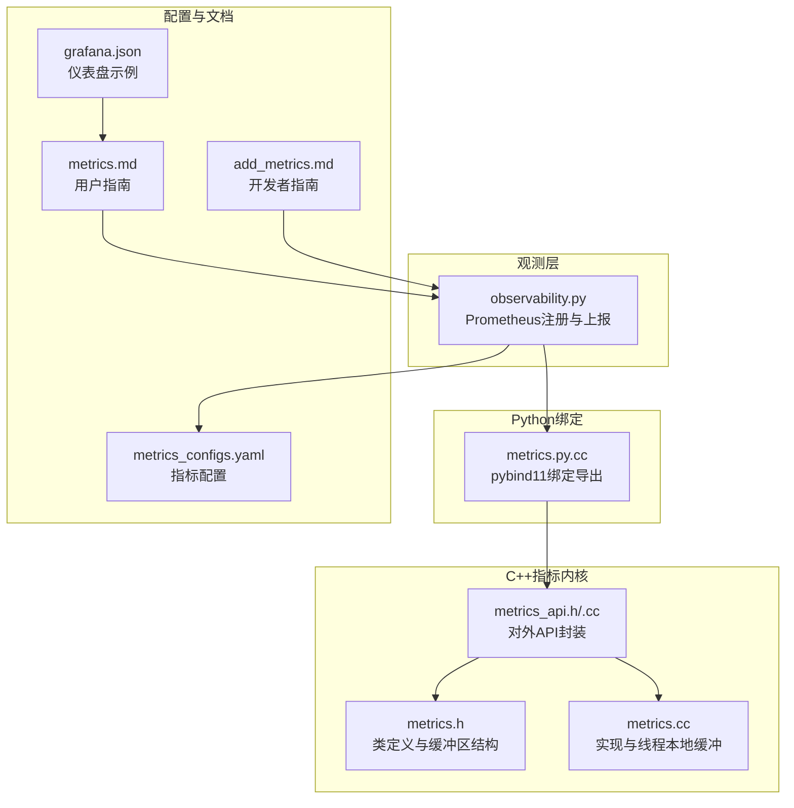
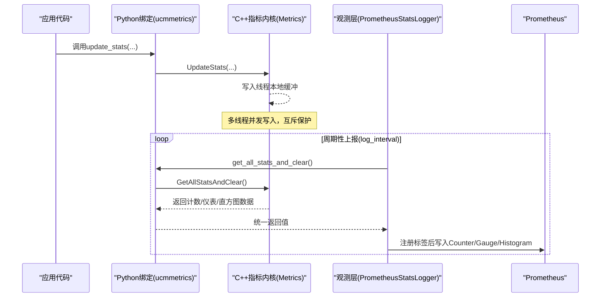
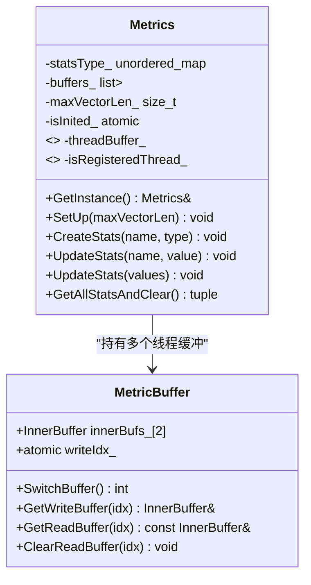
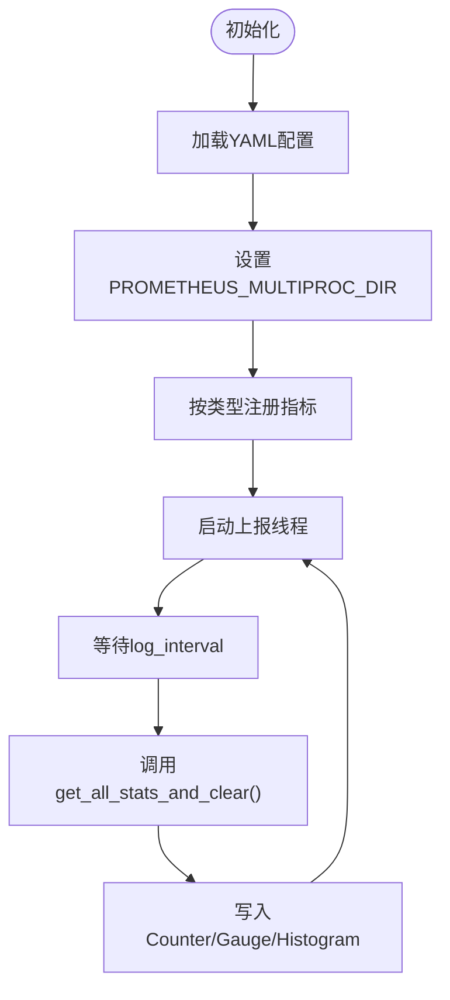
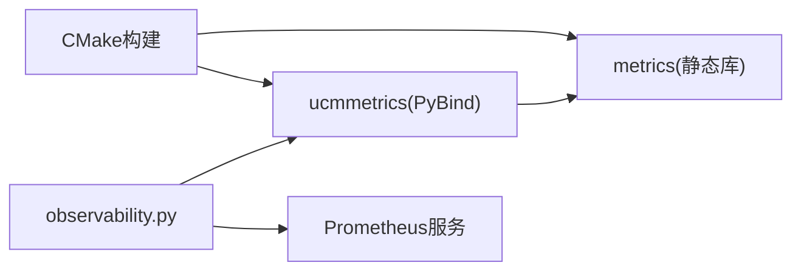

# 指标监控

<cite>
**本文引用的文件**
- [metrics_api.h](file://ucm/shared/metrics/cc/api/metrics_api.h)
- [metrics_api.cc](file://ucm/shared/metrics/cc/api/metrics_api.cc)
- [metrics.h](file://ucm/shared/metrics/cc/domain/metrics.h)
- [metrics.cc](file://ucm/shared/metrics/cc/domain/metrics.cc)
- [metrics.py.cc](file://ucm/shared/metrics/cpy/metrics.py.cc)
- [observability.py](file://ucm/observability.py)
- [metrics.md](file://docs/source/user-guide/metrics/metrics.md)
- [add_metrics.md](file://docs/source/developer-guide/add_metrics.md)
- [metrics_configs.yaml](file://examples/metrics/metrics_configs.yaml)
- [grafana.json](file://examples/metrics/grafana.json)
- [monitor_stats_example.py](file://ucm/shared/test/example/metrics/monitor_stats_example.py)
- [metrics_test.cc](file://ucm/shared/test/case/metrics/metrics_test.cc)
- [CMakeLists.txt（指标模块）](file://ucm/shared/metrics/CMakeLists.txt)
</cite>

## 目录
1. [简介](#简介)
2. [项目结构](#项目结构)
3. [核心组件](#核心组件)
4. [架构总览](#架构总览)
5. [详细组件分析](#详细组件分析)
6. [依赖关系分析](#依赖关系分析)
7. [性能考量](#性能考量)
8. [故障排查指南](#故障排查指南)
9. [结论](#结论)
10. [附录](#附录)

## 简介
本文件面向UCM指标监控系统，围绕Prometheus集成与指标API设计进行系统化技术说明。内容涵盖指标注册、收集与上报机制；Counter、Gauge、Histogram等指标类型在C++与Python双栈中的实现差异与使用场景；指标数据的存储与查询接口、时间序列处理与聚合策略；以及配置项、内存管理与批量上报优化建议。

## 项目结构
指标监控相关代码主要分布在以下位置：
- C++侧指标API与实现：ucm/shared/metrics/cc/api 与 ucm/shared/metrics/cc/domain
- Python绑定与导出：ucm/shared/metrics/cpy
- Prometheus观测层：ucm/observability.py
- 用户与开发者文档：docs/source/user-guide/metrics 与 docs/source/developer-guide
- 示例配置与仪表盘：examples/metrics
- 测试用例：ucm/shared/test

图表来源
- [metrics.h](file://ucm/shared/metrics/cc/domain/metrics.h#L39-L117)
- [metrics.cc](file://ucm/shared/metrics/cc/domain/metrics.cc#L27-L117)
- [metrics_api.h](file://ucm/shared/metrics/cc/api/metrics_api.h#L28-L42)
- [metrics_api.cc](file://ucm/shared/metrics/cc/api/metrics_api.cc#L24-L51)
- [metrics.py.cc](file://ucm/shared/metrics/cpy/metrics.py.cc#L24-L53)
- [observability.py](file://ucm/observability.py#L40-L197)
- [metrics_configs.yaml](file://examples/metrics/metrics_configs.yaml#L1-L51)
- [metrics.md](file://docs/source/user-guide/metrics/metrics.md#L1-L189)
- [add_metrics.md](file://docs/source/developer-guide/add_metrics.md#L1-L145)
- [grafana.json](file://examples/metrics/grafana.json#L1-L120)

章节来源
- [metrics.h](file://ucm/shared/metrics/cc/domain/metrics.h#L1-L120)
- [metrics.cc](file://ucm/shared/metrics/cc/domain/metrics.cc#L1-L117)
- [metrics_api.h](file://ucm/shared/metrics/cc/api/metrics_api.h#L1-L43)
- [metrics_api.cc](file://ucm/shared/metrics/cc/api/metrics_api.cc#L1-L52)
- [metrics.py.cc](file://ucm/shared/metrics/cpy/metrics.py.cc#L1-L53)
- [observability.py](file://ucm/observability.py#L1-L197)
- [metrics_configs.yaml](file://examples/metrics/metrics_configs.yaml#L1-L51)
- [metrics.md](file://docs/source/user-guide/metrics/metrics.md#L1-L189)
- [add_metrics.md](file://docs/source/developer-guide/add_metrics.md#L1-L145)
- [grafana.json](file://examples/metrics/grafana.json#L1-L120)

## 核心组件
- 指标内核（C++）
  - 提供线程本地缓冲与双缓冲切换，支持Counter、Gauge、Histogram三类指标的并发写入与安全读取。
  - 对外暴露初始化、指标声明、更新与全量清空获取的API。
- Python绑定
  - 通过pybind11将C++指标内核导出为ucmmetrics模块，提供set_up、create_stats、update_stats、get_all_stats_and_clear等函数。
- 观测层（Prometheus）
  - 基于YAML配置动态注册Counter/Gauge/Histogram，并周期性从C++缓冲区拉取统计并上报。

章节来源
- [metrics.h](file://ucm/shared/metrics/cc/domain/metrics.h#L39-L117)
- [metrics.cc](file://ucm/shared/metrics/cc/domain/metrics.cc#L27-L117)
- [metrics_api.h](file://ucm/shared/metrics/cc/api/metrics_api.h#L28-L42)
- [metrics_api.cc](file://ucm/shared/metrics/cc/api/metrics_api.cc#L24-L51)
- [metrics.py.cc](file://ucm/shared/metrics/cpy/metrics.py.cc#L24-L53)
- [observability.py](file://ucm/observability.py#L40-L197)

## 架构总览
下图展示从应用侧更新指标到Prometheus采集的整体流程。

图表来源
- [metrics_api.cc](file://ucm/shared/metrics/cc/api/metrics_api.cc#L24-L51)
- [metrics.cc](file://ucm/shared/metrics/cc/domain/metrics.cc#L88-L115)
- [metrics.py.cc](file://ucm/shared/metrics/cpy/metrics.py.cc#L31-L42)
- [observability.py](file://ucm/observability.py#L177-L186)

## 详细组件分析

### C++指标内核（Metrics类）
- 设计要点
  - 线程本地缓冲：每个工作线程维护一个MetricBuffer，包含两块写/读缓冲，避免全局锁争用。
  - 双缓冲切换：通过原子位切换当前写缓冲，读取时对旧缓冲加锁拷贝，随后清空旧缓冲。
  - 指标类型：枚举区分COUNTER/GAUGE/HISTOGRAM，分别对应累加、覆盖与向量存储。
  - 容量控制：直方图向量最大长度由构造参数限制，防止无限增长。
- 并发模型
  - 写路径：按指标名查找类型，直接写入当前写缓冲，无全局锁。
  - 读路径：遍历所有线程缓冲，交换并锁定旧缓冲，合并统计，清空旧缓冲。

图表来源
- [metrics.h](file://ucm/shared/metrics/cc/domain/metrics.h#L39-L117)
- [metrics.cc](file://ucm/shared/metrics/cc/domain/metrics.cc#L27-L117)

章节来源
- [metrics.h](file://ucm/shared/metrics/cc/domain/metrics.h#L39-L117)
- [metrics.cc](file://ucm/shared/metrics/cc/domain/metrics.cc#L32-L86)
- [metrics.cc](file://ucm/shared/metrics/cc/domain/metrics.cc#L88-L115)

### C++指标API封装（metrics_api.h/.cc）
- 功能
  - 对外提供SetUp、CreateStats、UpdateStats、GetAllStatsAndClear等静态函数，统一委托给Metrics单例。
- 使用建议
  - 先调用SetUp设置直方图向量上限，再逐个CreateStats声明指标类型，最后在业务中UpdateStats更新。

章节来源
- [metrics_api.h](file://ucm/shared/metrics/cc/api/metrics_api.h#L28-L42)
- [metrics_api.cc](file://ucm/shared/metrics/cc/api/metrics_api.cc#L24-L51)

### Python绑定（metrics.py.cc）
- 功能
  - 将C++指标内核以ucmmetrics模块导出，提供set_up、create_stats、update_stats重载、get_all_stats_and_clear。
  - 在获取统计数据时释放GIL，避免阻塞Python线程。
- 集成点
  - 观测层通过from ucm.shared.metrics import ucmmetrics导入并调用。

章节来源
- [metrics.py.cc](file://ucm/shared/metrics/cpy/metrics.py.cc#L24-L53)

### Prometheus观测层（observability.py）
- 初始化与配置
  - 从YAML加载配置，设置日志间隔、直方图最大长度、多进程目录与指标前缀。
  - 依据配置动态注册Counter/Gauge/Histogram，其中Gauge采用多进程模式“all”。
- 上报循环
  - 启动后台线程，按log_interval周期调用ucmmetrics.get_all_stats_and_clear，将结果写入对应Prometheus指标。
- 标签绑定
  - 默认标签包含model_name与worker_id，便于多实例聚合与区分。

图表来源
- [observability.py](file://ucm/observability.py#L60-L97)
- [observability.py](file://ucm/observability.py#L177-L186)

章节来源
- [observability.py](file://ucm/observability.py#L40-L197)

### 指标API设计与使用
- 指标类型
  - Counter：仅支持非负增量，适合累计请求数、错误次数等。
  - Gauge：可任意设置当前值，适合命中率、利用率等瞬时指标。
  - Histogram：记录观测值序列，适合时延、带宽、数量分布等。
- Python侧使用
  - 导入ucmmetrics，先set_up，再create_stats声明指标，最后update_stats更新。
  - 可批量传入字典一次性更新多个指标。
- C++侧使用
  - 包含metrics_api.h，调用同名函数完成注册与更新。
- 文档与示例
  - 开发者指南展示了如何在YAML中定义指标并在两侧更新。
  - 示例脚本演示了ucmmetrics的基本用法。

章节来源
- [add_metrics.md](file://docs/source/developer-guide/add_metrics.md#L70-L139)
- [monitor_stats_example.py](file://ucm/shared/test/example/metrics/monitor_stats_example.py#L41-L82)
- [metrics_test.cc](file://ucm/shared/test/case/metrics/metrics_test.cc#L48-L107)

### 指标数据存储与查询
- 存储结构
  - 每个线程拥有独立的双缓冲，写入时仅锁当前写缓冲，降低竞争。
  - 读取时对旧缓冲加锁拷贝，避免读写冲突。
- 查询与清空
  - GetAllStatsAndClear会切换所有线程缓冲的读写状态，合并统计并清空旧缓冲，返回三元组(Counter, Gauge, Histogram)。
- 时间序列与聚合
  - Counter/Gauge：按名称聚合，Counter为累加，Gauge为最新值。
  - Histogram：将各线程缓冲中的观测值拼接为完整序列，Prometheus侧通过桶聚合计算分位数。

章节来源
- [metrics.h](file://ucm/shared/metrics/cc/domain/metrics.h#L39-L70)
- [metrics.cc](file://ucm/shared/metrics/cc/domain/metrics.cc#L88-L115)

### Python与C++双栈差异与使用场景
- 差异点
  - C++侧更贴近底层，适合高并发、低延迟场景；Python侧易用且生态丰富，适合快速集成与可视化。
- 使用建议
  - 热点路径或C++原生模块内部优先使用C++ API；跨语言桥接或脚本化场景使用Python API。
  - 两者共享同一后端，最终统一上报至Prometheus。

章节来源
- [metrics_api.h](file://ucm/shared/metrics/cc/api/metrics_api.h#L28-L42)
- [metrics.py.cc](file://ucm/shared/metrics/cpy/metrics.py.cc#L24-L53)

### 配置选项与最佳实践
- 关键配置
  - log_interval：观测层上报周期（秒）。
  - multiproc_dir：Prometheus多进程模式目录。
  - metric_prefix：指标前缀（如ucm:）。
  - histogram_max_length：直方图观测值上限。
  - 各指标的buckets：直方图桶边界。
- 最佳实践
  - 合理设置histogram_max_length，避免内存膨胀。
  - 为关键指标配置合适的buckets，兼顾精度与性能。
  - 使用标签区分模型与工作节点，便于聚合分析。

章节来源
- [metrics_configs.yaml](file://examples/metrics/metrics_configs.yaml#L1-L51)
- [observability.py](file://ucm/observability.py#L60-L97)

## 依赖关系分析
- 模块构建
  - 指标静态库metrics包含C++源码，Python模块ucmmetrics链接metrics并导出API。
- 运行时依赖
  - 观测层依赖prometheus_client与YAML配置。
  - Prometheus多进程模式依赖PROMETHEUS_MULTIPROC_DIR环境变量。

图表来源
- [CMakeLists.txt（指标模块）](file://ucm/shared/metrics/CMakeLists.txt#L1-L16)
- [metrics.py.cc](file://ucm/shared/metrics/cpy/metrics.py.cc#L8-L10)

章节来源
- [CMakeLists.txt（指标模块）](file://ucm/shared/metrics/CMakeLists.txt#L1-L16)

## 性能考量
- 内存管理
  - 直方图向量上限maxVectorLen限制内存占用，避免无限增长导致OOM。
  - 双缓冲+原子切换减少锁粒度，提升并发写入吞吐。
- 批量上报优化
  - 观测层按log_interval批量拉取并上报，降低Prometheus抓取压力。
  - Python侧在获取统计数据时释放GIL，避免阻塞其他Python线程。
- 桶配置
  - 合理设置buckets，避免过多桶造成内存与CPU开销上升。

章节来源
- [metrics.cc](file://ucm/shared/metrics/cc/domain/metrics.cc#L73-L77)
- [metrics.py.cc](file://ucm/shared/metrics/cpy/metrics.py.cc#L38-L41)
- [observability.py](file://ucm/observability.py#L67-L71)

## 故障排查指南
- 常见问题
  - 未设置PROMETHEUS_MULTIPROC_DIR：导致Prometheus无法正确聚合多进程指标。
  - 未先调用SetUp/注册指标：C++侧可能抛出异常或无指标生效。
  - 标签不一致：不同实例标签不匹配会导致聚合异常。
- 排查步骤
  - 确认YAML配置与指标名称一致。
  - 检查观测层日志输出，定位注册与更新阶段的异常。
  - 在/vllm-workspace目录检查Prometheus临时文件是否存在。
- 相关实现参考
  - 观测层对异常的捕获与日志记录。
  - C++侧对未初始化与未知指标的处理。

章节来源
- [observability.py](file://ucm/observability.py#L146-L164)
- [metrics.cc](file://ucm/shared/metrics/cc/domain/metrics.cc#L32-L53)

## 结论
UCM指标监控体系通过C++内核与Python绑定实现高性能、低侵入的指标采集，结合Prometheus多进程模式与观测层的周期性上报，形成完整的可观测性闭环。开发者可通过YAML灵活定义指标类型与桶配置，按需在两侧更新并统一上报，满足从性能分析到实时告警的多样化需求。

## 附录
- 快速开始
  - 设置PROMETHEUS_MULTIPROC_DIR并启用metrics_config_path。
  - 启动服务并通过/vllm-workspace目录生成Prometheus临时文件。
  - 访问/metrics端点验证指标可见性。
- 参考文档
  - 用户指南：指标可用性与可视化。
  - 开发者指南：新增指标与双栈使用示例。

章节来源
- [metrics.md](file://docs/source/user-guide/metrics/metrics.md#L7-L189)
- [add_metrics.md](file://docs/source/developer-guide/add_metrics.md#L1-L145)