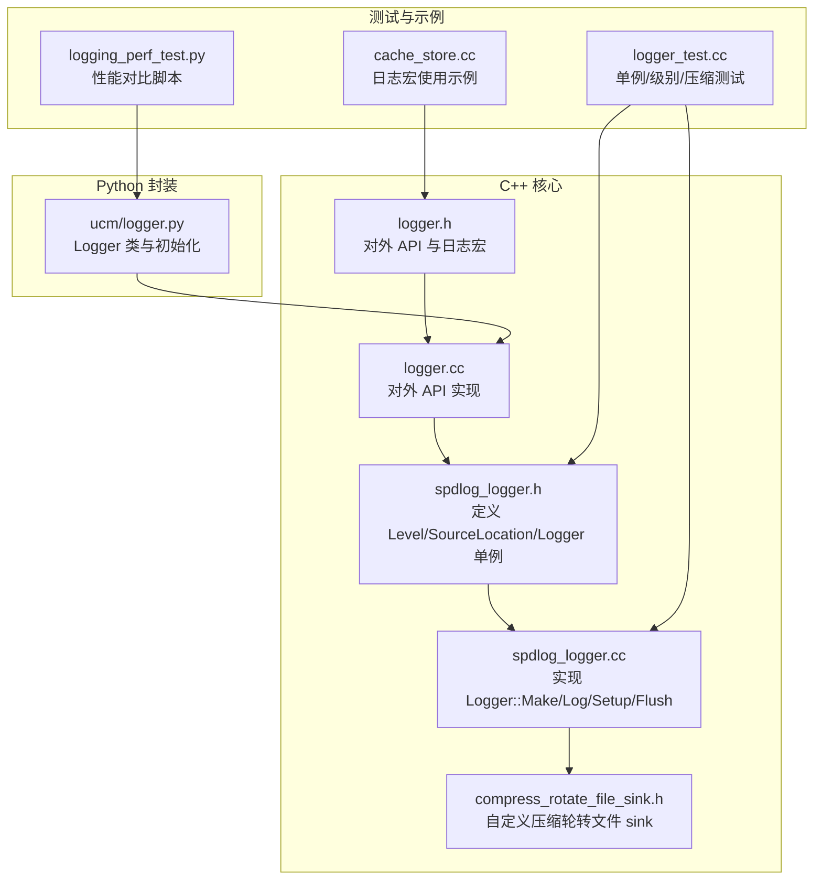
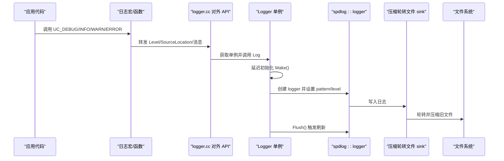
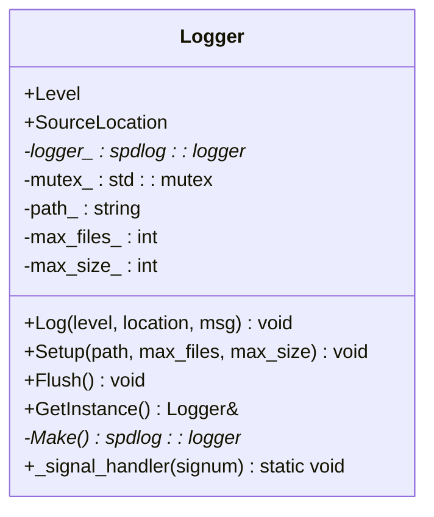
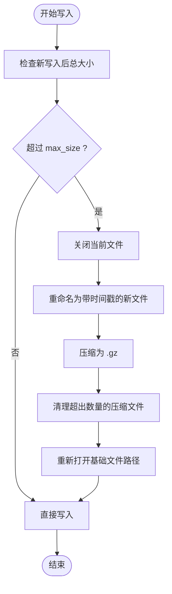
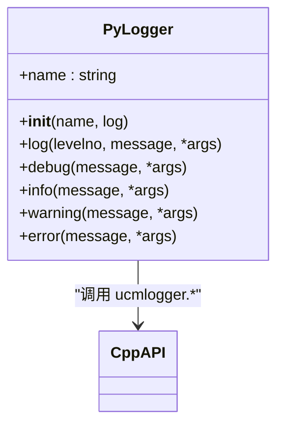
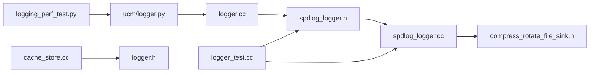

# 日志系统

<cite>
**本文引用的文件**
- [ucm/shared/infra/logger/cc/spdlog_logger.h](file://ucm/shared/infra/logger/cc/spdlog_logger.h)
- [ucm/shared/infra/logger/cc/spdlog_logger.cc](file://ucm/shared/infra/logger/cc/spdlog_logger.cc)
- [ucm/shared/infra/logger/logger.h](file://ucm/shared/infra/logger/logger.h)
- [ucm/shared/infra/logger/logger.cc](file://ucm/shared/infra/logger/logger.cc)
- [ucm/shared/infra/logger/cc/compress_rotate_file_sink.h](file://ucm/shared/infra/logger/cc/compress_rotate_file_sink.h)
- [ucm/logger.py](file://ucm/logger.py)
- [ucm/store/cache/cc/cache_store.cc](file://ucm/store/cache/cc/cache_store.cc)
- [ucm/shared/test/case/infra/logger/logger_test.cc](file://ucm/shared/test/case/infra/logger/logger_test.cc)
- [benchmarks/logging_perf_test.py](file://benchmarks/logging_perf_test.py)
</cite>

## 目录
1. [简介](#简介)
2. [项目结构](#项目结构)
3. [核心组件](#核心组件)
4. [架构总览](#架构总览)
5. [组件详解](#组件详解)
6. [依赖关系分析](#依赖关系分析)
7. [性能与优化](#性能与优化)
8. [故障排查指南](#故障排查指南)
9. [结论](#结论)
10. [附录：配置与最佳实践](#附录配置与最佳实践)

## 简介
本文件为 UCM 日志系统的技术文档，覆盖 C++ 日志子系统（基于 spdlog）与 Python 封装两部分。内容包括：
- Logger 类设计与单例模式、线程安全策略
- 日志级别管理（DEBUG/INFO/WARN/ERROR）
- 输出格式与配置项（文件轮转、压缩、大小限制）
- Python 接口封装与使用方式
- 配置示例、性能优化与调试技巧

## 项目结构
日志系统主要由以下模块组成：
- C++ 核心：Logger 单例、spdlog 集成、自定义压缩轮转文件 sink
- C++ 外观层：对外暴露的头文件与便捷宏
- Python 封装：通过 pybind 绑定到 C++，提供标准 logging 兼容接口
- 测试与基准：验证单例行为、日志级别过滤、压缩轮转数量控制
- 使用示例：在存储模块中广泛使用日志宏进行信息与错误记录

图表来源
- [ucm/shared/infra/logger/cc/spdlog_logger.h](file://ucm/shared/infra/logger/cc/spdlog_logger.h#L31-L74)
- [ucm/shared/infra/logger/cc/spdlog_logger.cc](file://ucm/shared/infra/logger/cc/spdlog_logger.cc#L40-L91)
- [ucm/shared/infra/logger/cc/compress_rotate_file_sink.h](file://ucm/shared/infra/logger/cc/compress_rotate_file_sink.h#L42-L197)
- [ucm/shared/infra/logger/logger.h](file://ucm/shared/infra/logger/logger.h#L30-L49)
- [ucm/shared/infra/logger/logger.cc](file://ucm/shared/infra/logger/logger.cc#L30-L40)
- [ucm/logger.py](file://ucm/logger.py#L40-L75)
- [ucm/shared/test/case/infra/logger/logger_test.cc](file://ucm/shared/test/case/infra/logger/logger_test.cc#L72-L145)
- [benchmarks/logging_perf_test.py](file://benchmarks/logging_perf_test.py#L142-L180)
- [ucm/store/cache/cc/cache_store.cc](file://ucm/store/cache/cc/cache_store.cc#L86-L103)

章节来源
- [ucm/shared/infra/logger/cc/spdlog_logger.h](file://ucm/shared/infra/logger/cc/spdlog_logger.h#L31-L74)
- [ucm/shared/infra/logger/cc/spdlog_logger.cc](file://ucm/shared/infra/logger/cc/spdlog_logger.cc#L40-L91)
- [ucm/shared/infra/logger/cc/compress_rotate_file_sink.h](file://ucm/shared/infra/logger/cc/compress_rotate_file_sink.h#L42-L197)
- [ucm/shared/infra/logger/logger.h](file://ucm/shared/infra/logger/logger.h#L30-L49)
- [ucm/shared/infra/logger/logger.cc](file://ucm/shared/infra/logger/logger.cc#L30-L40)
- [ucm/logger.py](file://ucm/logger.py#L40-L75)
- [ucm/shared/test/case/infra/logger/logger_test.cc](file://ucm/shared/test/case/infra/logger/logger_test.cc#L72-L145)
- [benchmarks/logging_perf_test.py](file://benchmarks/logging_perf_test.py#L142-L180)
- [ucm/store/cache/cc/cache_store.cc](file://ucm/store/cache/cc/cache_store.cc#L86-L103)

## 核心组件
- 日志级别：DEBUG/INFO/WARN/ERROR 四级，映射至 spdlog level
- Logger 单例：全局唯一实例，延迟初始化，线程安全
- 输出目标：同时输出到控制台与带压缩轮转的文件
- 配置参数：日志目录、最大文件数、单文件最大大小（MB）
- Python 接口：兼容标准 logging，自动注入调用者位置信息

章节来源
- [ucm/shared/infra/logger/cc/spdlog_logger.h](file://ucm/shared/infra/logger/cc/spdlog_logger.h#L31-L74)
- [ucm/shared/infra/logger/cc/spdlog_logger.cc](file://ucm/shared/infra/logger/cc/spdlog_logger.cc#L40-L91)
- [ucm/shared/infra/logger/logger.h](file://ucm/shared/infra/logger/logger.h#L30-L49)
- [ucm/logger.py](file://ucm/logger.py#L40-L75)

## 架构总览
下图展示从应用代码到最终落盘的完整流程，包括 C++ Logger 单例、spdlog 日志器、自定义压缩轮转 sink 以及 Python 侧绑定。

图表来源
- [ucm/shared/infra/logger/logger.cc](file://ucm/shared/infra/logger/logger.cc#L30-L40)
- [ucm/shared/infra/logger/cc/spdlog_logger.cc](file://ucm/shared/infra/logger/cc/spdlog_logger.cc#L40-L91)
- [ucm/shared/infra/logger/cc/compress_rotate_file_sink.h](file://ucm/shared/infra/logger/cc/compress_rotate_file_sink.h#L76-L197)

## 组件详解

### C++ Logger 类与单例模式
- 设计要点
  - 单例：静态局部变量保证线程安全与延迟初始化
  - 线程安全：构造时注册信号处理器；写入与刷新使用互斥锁保护
  - 延迟初始化：首次 Log 时才创建 logger，避免无用开销
- 关键成员
  - Level/SourceLocation：统一抽象日志级别与源码位置
  - logger_：spdlog::logger 指针
  - mutex_：保护初始化与刷新
  - path_/max_files_/max_size_：配置项缓存

图表来源
- [ucm/shared/infra/logger/cc/spdlog_logger.h](file://ucm/shared/infra/logger/cc/spdlog_logger.h#L38-L74)

章节来源
- [ucm/shared/infra/logger/cc/spdlog_logger.h](file://ucm/shared/infra/logger/cc/spdlog_logger.h#L38-L74)
- [ucm/shared/infra/logger/cc/spdlog_logger.cc](file://ucm/shared/infra/logger/cc/spdlog_logger.cc#L47-L91)

### 日志级别管理
- 级别枚举：DEBUG/INFO/WARN/ERROR 映射到 spdlog level
- 运行时控制：支持通过环境变量设置日志级别（如 UC_LOGGER_LEVEL），默认 off 时会回退到 spdlog 默认级别
- 测试验证：测试用例覆盖所有级别，并验证 INFO/WARN/ERROR 能被写入文件，DEBUG 默认不写入

章节来源
- [ucm/shared/infra/logger/cc/spdlog_logger.cc](file://ucm/shared/infra/logger/cc/spdlog_logger.cc#L37-L71)
- [ucm/shared/test/case/infra/logger/logger_test.cc](file://ucm/shared/test/case/infra/logger/logger_test.cc#L102-L119)

### 输出格式与配置
- 输出目标：控制台彩色输出 + 压缩轮转文件
- 文件命名与轮转：按大小阈值触发轮转，生成带时间戳的文件名，并压缩为 .gz
- 配置项：
  - 目录：Setup(path, max_files, max_size) 中的 path
  - 最大文件数：max_files
  - 单文件最大大小（MB）：max_size（内部转换为字节）
- 自定义 sink 行为：
  - 超过阈值时先 flush，再重命名当前文件，随后压缩为 .gz
  - 保留文件数量不超过 max_files，超出则删除最旧的压缩文件

图表来源
- [ucm/shared/infra/logger/cc/compress_rotate_file_sink.h](file://ucm/shared/infra/logger/cc/compress_rotate_file_sink.h#L76-L197)

章节来源
- [ucm/shared/infra/logger/cc/compress_rotate_file_sink.h](file://ucm/shared/infra/logger/cc/compress_rotate_file_sink.h#L42-L197)
- [ucm/shared/infra/logger/cc/spdlog_logger.cc](file://ucm/shared/infra/logger/cc/spdlog_logger.cc#L57-L71)

### Python 日志接口封装
- Logger 类
  - 初始化：接收目录、最大文件数、单文件大小（MB）等配置，调用 C++ setup
  - 日志方法：debug/info/warning/error，内部通过 pybind 调用 C++ 格式化与写入
  - 位置信息：通过 inspect 获取调用方文件、行号、函数名
- 与标准 logging 的映射：DEBUG/INFO/WARNING/ERROR 到 C++ Level 的映射表

图表来源
- [ucm/logger.py](file://ucm/logger.py#L40-L75)

章节来源
- [ucm/logger.py](file://ucm/logger.py#L40-L75)

### 使用示例与集成点
- 在存储模块中广泛使用日志宏打印配置与运行状态，便于问题定位与审计
- 示例路径：在缓存存储模块中使用 INFO/WARN/ERROR 宏输出关键信息

章节来源
- [ucm/store/cache/cc/cache_store.cc](file://ucm/store/cache/cc/cache_store.cc#L86-L103)

## 依赖关系分析
- C++ 层
  - logger.h/logger.cc 提供对外 API 与宏
  - spdlog_logger.h/cc 实现 Logger 单例与初始化逻辑
  - compress_rotate_file_sink.h 提供压缩轮转 sink
- Python 层
  - ucm/logger.py 通过 pybind 访问 C++ 接口
- 测试与基准
  - logger_test.cc 验证单例、级别过滤、压缩轮转数量
  - logging_perf_test.py 对比 Python logging 与 pybind11 spdlog_logger 性能

图表来源
- [ucm/logger.py](file://ucm/logger.py#L30-L47)
- [ucm/shared/infra/logger/logger.cc](file://ucm/shared/infra/logger/logger.cc#L30-L40)
- [ucm/shared/infra/logger/cc/spdlog_logger.h](file://ucm/shared/infra/logger/cc/spdlog_logger.h#L38-L74)
- [ucm/shared/infra/logger/cc/spdlog_logger.cc](file://ucm/shared/infra/logger/cc/spdlog_logger.cc#L47-L91)
- [ucm/shared/infra/logger/cc/compress_rotate_file_sink.h](file://ucm/shared/infra/logger/cc/compress_rotate_file_sink.h#L42-L197)
- [ucm/shared/test/case/infra/logger/logger_test.cc](file://ucm/shared/test/case/infra/logger/logger_test.cc#L72-L145)
- [benchmarks/logging_perf_test.py](file://benchmarks/logging_perf_test.py#L142-L180)
- [ucm/store/cache/cc/cache_store.cc](file://ucm/store/cache/cc/cache_store.cc#L86-L103)

章节来源
- [ucm/logger.py](file://ucm/logger.py#L30-L47)
- [ucm/shared/infra/logger/logger.cc](file://ucm/shared/infra/logger/logger.cc#L30-L40)
- [ucm/shared/infra/logger/cc/spdlog_logger.h](file://ucm/shared/infra/logger/cc/spdlog_logger.h#L38-L74)
- [ucm/shared/infra/logger/cc/spdlog_logger.cc](file://ucm/shared/infra/logger/cc/spdlog_logger.cc#L47-L91)
- [ucm/shared/infra/logger/cc/compress_rotate_file_sink.h](file://ucm/shared/infra/logger/cc/compress_rotate_file_sink.h#L42-L197)
- [ucm/shared/test/case/infra/logger/logger_test.cc](file://ucm/shared/test/case/infra/logger/logger_test.cc#L72-L145)
- [benchmarks/logging_perf_test.py](file://benchmarks/logging_perf_test.py#L142-L180)
- [ucm/store/cache/cc/cache_store.cc](file://ucm/store/cache/cc/cache_store.cc#L86-L103)

## 性能与优化
- 性能对比
  - 提供 Python logging 与 pybind11 spdlog_logger 的基准测试脚本，可评估不同日志级别的开销
  - 建议在高并发或高频日志场景优先使用 C++ 接口以降低 Python/GIL 开销
- 优化建议
  - 合理设置 max_size（MB）与 max_files，平衡磁盘占用与 IO 压力
  - 在生产环境通过环境变量动态调整日志级别，避免在 DEBUG 下产生大量冗余日志
  - 使用 Flush() 在异常信号前确保日志落盘，提升崩溃时的可观测性

章节来源
- [benchmarks/logging_perf_test.py](file://benchmarks/logging_perf_test.py#L142-L180)
- [ucm/shared/infra/logger/cc/spdlog_logger.cc](file://ucm/shared/infra/logger/cc/spdlog_logger.cc#L87-L91)

## 故障排查指南
- 单例行为确认
  - 单元测试验证多次获取实例指向同一对象，确保全局一致性
- 日志级别问题
  - 若 DEBUG 未出现，请检查环境变量是否设置了较低级别或 off
- 压缩轮转异常
  - 检查目录权限与磁盘空间；确认 max_files 数量与 .gz 文件数量一致
- Python 日志未生效
  - 确认已调用 init_logger 并传入正确配置；检查 atexit 注册的 flush 是否执行

章节来源
- [ucm/shared/test/case/infra/logger/logger_test.cc](file://ucm/shared/test/case/infra/logger/logger_test.cc#L72-L145)
- [ucm/shared/infra/logger/cc/spdlog_logger.cc](file://ucm/shared/infra/logger/cc/spdlog_logger.cc#L65-L71)
- [ucm/logger.py](file://ucm/logger.py#L40-L75)

## 结论
UCM 日志系统以 spdlog 为基础，结合自定义压缩轮转 sink，提供了高性能、可配置且线程安全的日志能力。C++ 侧采用单例与延迟初始化，Python 侧提供与标准 logging 兼容的封装，满足多语言场景下的统一可观察能力。通过合理的配置与性能优化，可在保证稳定性的同时兼顾资源消耗。

## 附录：配置与最佳实践
- 配置项
  - 目录：日志根目录（如 log）
  - 最大文件数：保留的历史压缩文件数量
  - 单文件最大大小（MB）：超过阈值触发轮转与压缩
- 环境变量
  - UC_LOGGER_LEVEL：运行时设置日志级别（如 debug/info/warn/error/off）
- 最佳实践
  - 生产环境默认 INFO 或更高，DEBUG 仅在本地或问题定位阶段开启
  - 合理设置 max_size 与 max_files，避免磁盘占满
  - 在异常信号处理中调用 Flush()，确保关键信息落盘
  - 在高频路径避免拼接复杂格式字符串，减少 CPU 开销

章节来源
- [ucm/shared/infra/logger/cc/spdlog_logger.cc](file://ucm/shared/infra/logger/cc/spdlog_logger.cc#L79-L84)
- [ucm/shared/infra/logger/cc/spdlog_logger.cc](file://ucm/shared/infra/logger/cc/spdlog_logger.cc#L55-L71)
- [ucm/logger.py](file://ucm/logger.py#L40-L75)