# 模板工具库

<cite>
**本文引用的文件**
- [hashset.h](file://ucm/shared/infra/template/hashset.h)
- [singleton.h](file://ucm/shared/infra/template/singleton.h)
- [spsc_ring_queue.h](file://ucm/shared/infra/template/spsc_ring_queue.h)
- [topn_heap.h](file://ucm/shared/infra/template/topn_heap.h)
- [timer.h](file://ucm/shared/infra/template/timer.h)
- [thread_pool.h](file://ucm/shared/infra/thread/thread_pool.h)
- [index_pool.h](file://ucm/shared/infra/thread/index_pool.h)
- [latch.h](file://ucm/shared/infra/thread/latch.h)
- [store_binder.h](file://ucm/store/detail/template/store_binder.h)
- [task_wrapper.h](file://ucm/store/detail/template/task_wrapper.h)
- [hashset_test.cc](file://ucm/shared/test/case/infra/hashset_test.cc)
- [spsc_ring_queue_test.cc](file://ucm/shared/test/case/infra/spsc_ring_queue_test.cc)
- [trans_on_cuda_example.py](file://ucm/shared/test/example/trans/trans_on_cuda_example.py)
- [factory.py](file://ucm/store/factory.py)
- [factory_v1.py](file://ucm/store/factory_v1.py)
- [load_queue.h](file://ucm/store/cache/cc/load_queue.h)
- [dump_queue.h](file://ucm/store/cache/cc/dump_queue.h)
</cite>

## 目录
1. [引言](#引言)
2. [项目结构](#项目结构)
3. [核心组件](#核心组件)
4. [架构总览](#架构总览)
5. [详细组件分析](#详细组件分析)
6. [依赖分析](#依赖分析)
7. [性能考量](#性能考量)
8. [故障排查指南](#故障排查指南)
9. [结论](#结论)
10. [附录](#附录)

## 引言
本文件面向UCM（统一缓存管理）模板工具库，系统化梳理并深入解析通用模板组件的设计理念与实现原理，覆盖哈希集合、单例模式、环形队列、TopN堆、定时器、线程池、索引池与栅栏等基础设施模板。文档从代码结构、数据流、处理逻辑、集成点到错误处理与性能特征进行分层阐述，并结合存储系统与传输层的实际使用案例，给出可操作的应用建议、扩展方法与自定义实现指南。

## 项目结构
模板工具库主要位于共享基础设施模块中，围绕“模板”“线程与同步”“任务编排”三大维度组织，同时在存储子系统中被广泛复用，形成“模板能力—任务编排—具体实现”的分层架构。

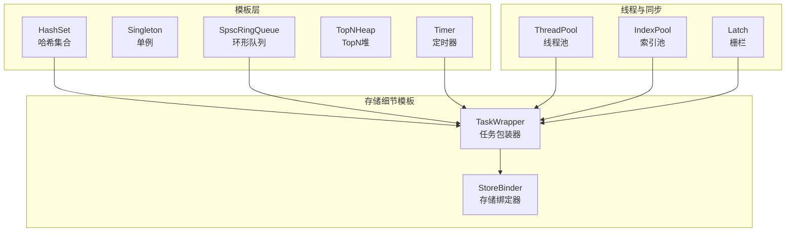

图示来源
- [hashset.h](file://ucm/shared/infra/template/hashset.h#L37-L132)
- [spsc_ring_queue.h](file://ucm/shared/infra/template/spsc_ring_queue.h#L36-L117)
- [topn_heap.h](file://ucm/shared/infra/template/topn_heap.h#L34-L117)
- [timer.h](file://ucm/shared/infra/template/timer.h#L35-L86)
- [thread_pool.h](file://ucm/shared/infra/thread/thread_pool.h#L41-L223)
- [index_pool.h](file://ucm/shared/infra/thread/index_pool.h#L34-L94)
- [latch.h](file://ucm/shared/infra/thread/latch.h#L35-L88)
- [store_binder.h](file://ucm/store/detail/template/store_binder.h#L34-L155)
- [task_wrapper.h](file://ucm/store/detail/template/task_wrapper.h#L35-L104)

章节来源
- [hashset.h](file://ucm/shared/infra/template/hashset.h#L1-L137)
- [spsc_ring_queue.h](file://ucm/shared/infra/template/spsc_ring_queue.h#L1-L122)
- [topn_heap.h](file://ucm/shared/infra/template/topn_heap.h#L1-L122)
- [timer.h](file://ucm/shared/infra/template/timer.h#L1-L91)
- [thread_pool.h](file://ucm/shared/infra/thread/thread_pool.h#L1-L228)
- [index_pool.h](file://ucm/shared/infra/thread/index_pool.h#L1-L99)
- [latch.h](file://ucm/shared/infra/thread/latch.h#L1-L93)
- [store_binder.h](file://ucm/store/detail/template/store_binder.h#L1-L160)
- [task_wrapper.h](file://ucm/store/detail/template/task_wrapper.h#L1-L109)

## 核心组件
- 哈希集合：支持多线程插入/查询/删除，采用分片+开放定址法，兼顾并发与低冲突。
- 单例：轻量级静态实例获取，避免外部初始化复杂度。
- 环形队列：单生产者单消费者无锁环形缓冲，支持忙等与退避策略。
- TopN堆：固定容量TopN选择器，支持可定制比较器。
- 定时器：周期性触发回调，线程安全停止与析构。
- 线程池：可配置工作线程数、超时检测、监控与动态恢复。
- 索引池：无锁索引分配与回收，基于CAS与版本号。
- 栅栏：计数式同步原语，支持等待与超时。
- 存储绑定器与任务包装器：将模板能力注入到存储系统的任务提交、等待与状态管理流程。

章节来源
- [hashset.h](file://ucm/shared/infra/template/hashset.h#L37-L132)
- [singleton.h](file://ucm/shared/infra/template/singleton.h#L29-L42)
- [spsc_ring_queue.h](file://ucm/shared/infra/template/spsc_ring_queue.h#L36-L117)
- [topn_heap.h](file://ucm/shared/infra/template/topn_heap.h#L34-L117)
- [timer.h](file://ucm/shared/infra/template/timer.h#L35-L86)
- [thread_pool.h](file://ucm/shared/infra/thread/thread_pool.h#L41-L223)
- [index_pool.h](file://ucm/shared/infra/thread/index_pool.h#L34-L94)
- [latch.h](file://ucm/shared/infra/thread/latch.h#L35-L88)
- [store_binder.h](file://ucm/store/detail/template/store_binder.h#L34-L155)
- [task_wrapper.h](file://ucm/store/detail/template/task_wrapper.h#L35-L104)

## 架构总览
模板工具库通过“模板层”提供通用数据结构与并发原语，“线程与同步层”提供任务调度与资源管理，“存储细节模板层”将上述能力组合为可复用的任务提交、等待与状态管理框架，最终服务于存储系统与传输层。

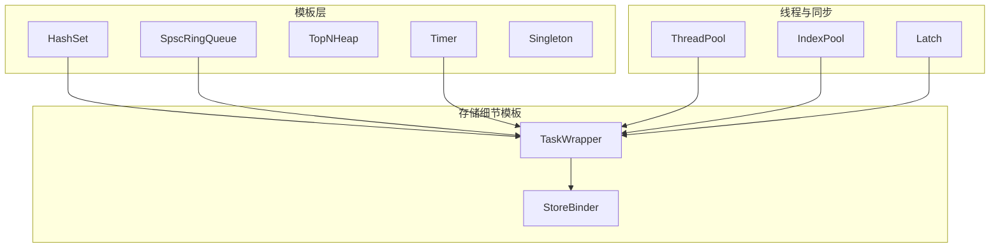

图示来源
- [hashset.h](file://ucm/shared/infra/template/hashset.h#L37-L132)
- [spsc_ring_queue.h](file://ucm/shared/infra/template/spsc_ring_queue.h#L36-L117)
- [topn_heap.h](file://ucm/shared/infra/template/topn_heap.h#L34-L117)
- [timer.h](file://ucm/shared/infra/template/timer.h#L35-L86)
- [singleton.h](file://ucm/shared/infra/template/singleton.h#L29-L42)
- [thread_pool.h](file://ucm/shared/infra/thread/thread_pool.h#L41-L223)
- [index_pool.h](file://ucm/shared/infra/thread/index_pool.h#L34-L94)
- [latch.h](file://ucm/shared/infra/thread/latch.h#L35-L88)
- [task_wrapper.h](file://ucm/store/detail/template/task_wrapper.h#L35-L104)
- [store_binder.h](file://ucm/store/detail/template/store_binder.h#L34-L155)

## 详细组件分析

### 哈希集合（HashSet）
- 设计要点
  - 分片数组：默认1024个分片，按高位取模定位分片，降低锁竞争。
  - 开放定址：探测函数为线性探测，配合二次重哈希扩容，减少聚集。
  - 并发控制：读路径共享锁，写路径独占锁；使用共享/互斥锁组合提升读吞吐。
  - 扩容策略：当使用率超过75%时触发，容量翻倍并迁移旧槽位。
- 复杂度
  - 平均时间：插入/查找/删除均为O(1)，最坏O(n)。
  - 空间：O(n)存储键值，额外O(n)用于空槽位。
- 使用场景
  - 快速去重、存在性检查、并发集合管理。
- 性能特征
  - 高并发读下延迟低；写入时有分片粒度的锁开销。
- 类关系示意

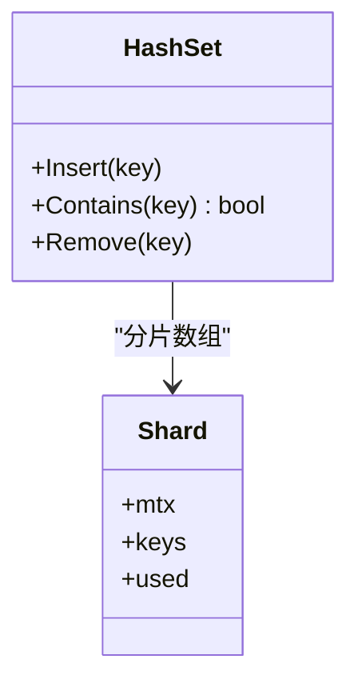

图示来源
- [hashset.h](file://ucm/shared/infra/template/hashset.h#L37-L132)

章节来源
- [hashset.h](file://ucm/shared/infra/template/hashset.h#L37-L132)
- [hashset_test.cc](file://ucm/shared/test/case/infra/hashset_test.cc#L30-L76)

### 单例（Singleton）
- 设计要点
  - 线程安全的静态实例获取，禁止拷贝构造与赋值。
- 使用场景
  - 全局配置、日志器、度量采集器等需要唯一实例的组件。
- 性能特征
  - 获取实例为O(1)，无运行时初始化成本。

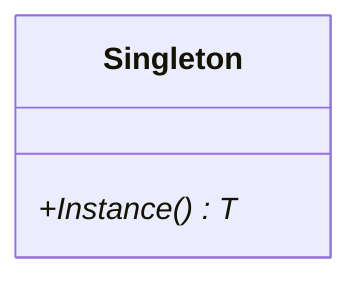

图示来源
- [singleton.h](file://ucm/shared/infra/template/singleton.h#L29-L42)

章节来源
- [singleton.h](file://ucm/shared/infra/template/singleton.h#L29-L42)

### 环形队列（SpscRingQueue）
- 设计要点
  - 单生产者单消费者，原子head/tail指针，支持2次幂容量的位运算取模。
  - 提供阻塞Push与非阻塞TryPush/TryPop；消费者循环内自适应忙等与短睡眠。
- 复杂度
  - 入队/出队均为O(1)。
- 使用场景
  - 生产者-消费者解耦、异步任务传递、跨线程消息通道。
- 性能特征
  - 低延迟、高吞吐；在满/空状态下有自旋与退避策略。

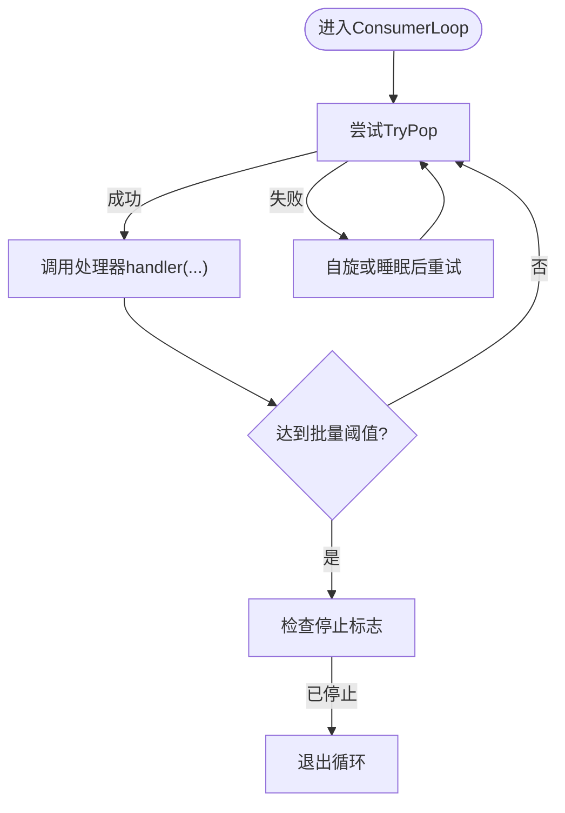

图示来源
- [spsc_ring_queue.h](file://ucm/shared/infra/template/spsc_ring_queue.h#L91-L116)

章节来源
- [spsc_ring_queue.h](file://ucm/shared/infra/template/spsc_ring_queue.h#L36-L117)
- [spsc_ring_queue_test.cc](file://ucm/shared/test/case/infra/spsc_ring_queue_test.cc#L29-L87)

### TopN堆（TopNHeap/TopNFixedHeap）
- 设计要点
  - 固定容量堆，维护最小值在堆顶；新元素仅在大于堆顶时替换并下沉。
  - 支持自定义比较器，默认升序。
- 复杂度
  - 插入/弹出为O(log N)，N为容量。
- 使用场景
  - 在海量数据中快速筛选TopK，如热点排序、优先级调度。
- 性能特征
  - 容量小、更新频繁时优势明显；内存占用固定。

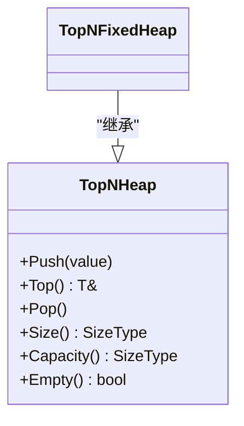

图示来源
- [topn_heap.h](file://ucm/shared/infra/template/topn_heap.h#L34-L117)

章节来源
- [topn_heap.h](file://ucm/shared/infra/template/topn_heap.h#L34-L117)

### 定时器（Timer）
- 设计要点
  - 周期性触发可调用对象，内部线程负责等待与唤醒；析构时安全停止。
- 使用场景
  - 周期性清理、心跳上报、定期统计。
- 性能特征
  - 精准度受系统定时器精度影响；停止与析构保证资源释放。

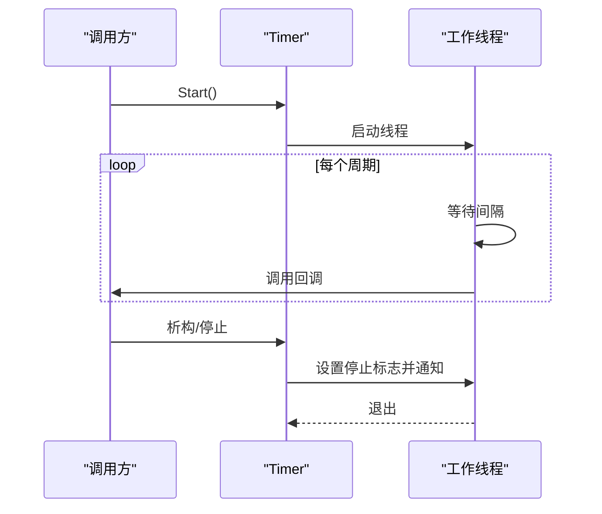

图示来源
- [timer.h](file://ucm/shared/infra/template/timer.h#L35-L86)

章节来源
- [timer.h](file://ucm/shared/infra/template/timer.h#L35-L86)

### 线程池（ThreadPool）
- 设计要点
  - 可配置工作线程数、初始化/退出回调、超时检测与自动恢复。
  - 任务队列支持批量推送与单任务推送，工作线程拉取任务执行。
- 使用场景
  - 并行计算、I/O密集型任务批处理、长生命周期服务。
- 性能特征
  - 动态监控与补充线程，提升稳定性；超时回调可用于任务健康治理。

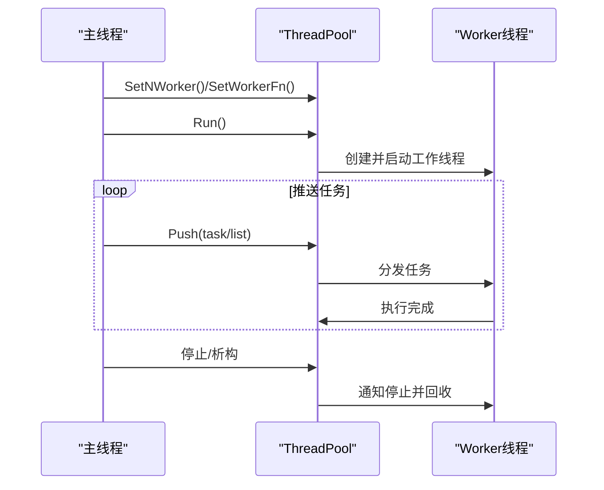

图示来源
- [thread_pool.h](file://ucm/shared/infra/thread/thread_pool.h#L41-L223)

章节来源
- [thread_pool.h](file://ucm/shared/infra/thread/thread_pool.h#L41-L223)

### 索引池（IndexPool）
- 设计要点
  - 基于链表的无锁索引分配与回收，使用CAS与版本号确保一致性。
- 使用场景
  - 连续索引的高效分配与回收，如任务句柄、缓冲区索引。
- 性能特征
  - 低竞争、常数时间分配/回收；内存布局对齐优化。

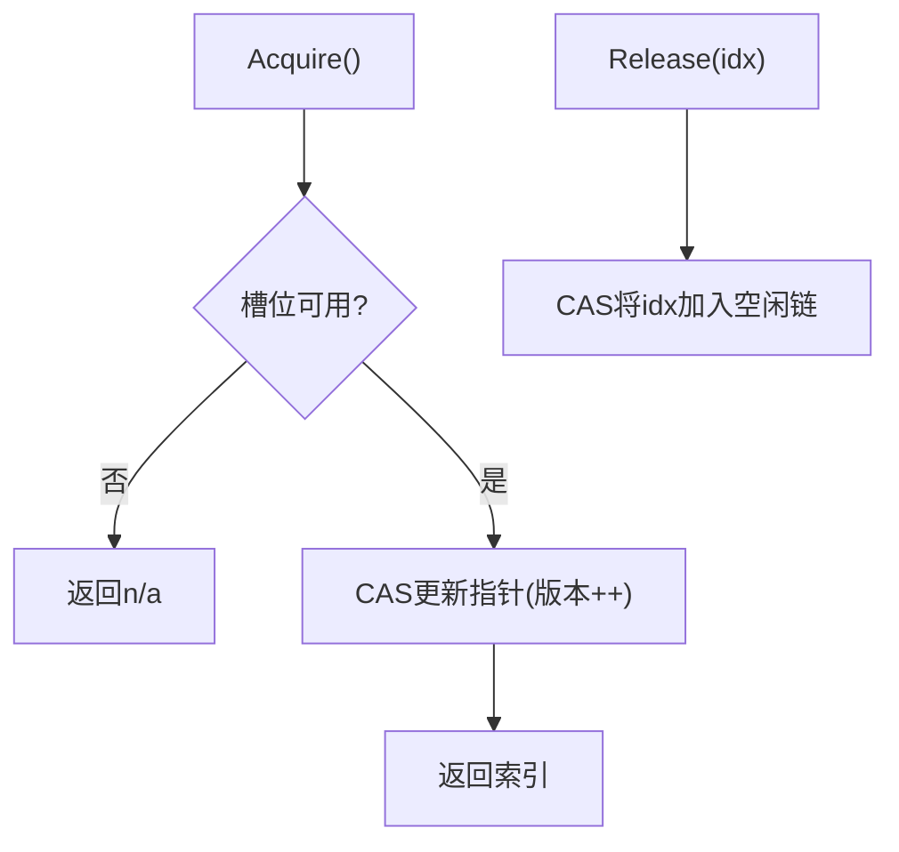

图示来源
- [index_pool.h](file://ucm/shared/infra/thread/index_pool.h#L62-L88)

章节来源
- [index_pool.h](file://ucm/shared/infra/thread/index_pool.h#L34-L94)

### 栅栏（Latch）
- 设计要点
  - 计数式同步，支持Wait/WaitFor/Check/Done/Up等接口。
- 使用场景
  - 多阶段任务协调、批量完成通知。
- 性能特征
  - 原子计数+条件变量，等待过程可超时。

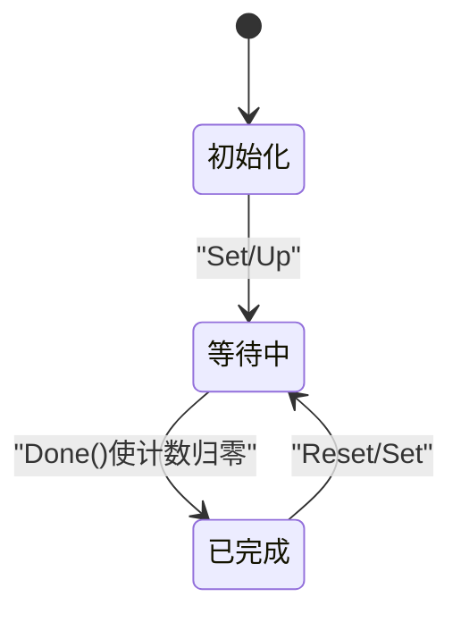

图示来源
- [latch.h](file://ucm/shared/infra/thread/latch.h#L35-L88)

章节来源
- [latch.h](file://ucm/shared/infra/thread/latch.h#L35-L88)

### 存储绑定器与任务包装器
- 设计要点
  - StoreBinder：将Python缓冲区视图转换为C++侧数组，封装Lookup/Prefetch/Load/Dump/Wait/Check等接口。
  - TaskWrapper：基于HashSet维护任务ID集合，结合Latch实现提交、检查、等待与超时处理。
- 使用场景
  - 存储系统任务编排、跨语言交互、异步任务管理。
- 性能特征
  - 通过HashSet降低重复提交风险；Latch提供可控等待与超时。

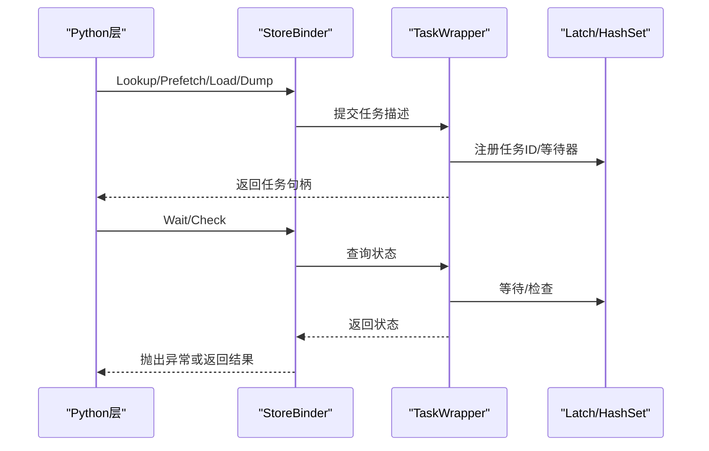

图示来源
- [store_binder.h](file://ucm/store/detail/template/store_binder.h#L64-L154)
- [task_wrapper.h](file://ucm/store/detail/template/task_wrapper.h#L35-L104)

章节来源
- [store_binder.h](file://ucm/store/detail/template/store_binder.h#L34-L155)
- [task_wrapper.h](file://ucm/store/detail/template/task_wrapper.h#L35-L104)

## 依赖分析
- 组件耦合
  - HashSet与TaskWrapper：TaskWrapper内部使用HashSet记录任务ID，避免重复提交。
  - SpscRingQueue与TaskWrapper：作为任务队列承载任务分发。
  - Latch与TaskWrapper：用于任务完成通知与等待。
  - ThreadPool与TaskWrapper：提供任务执行环境。
  - StoreBinder与TaskWrapper：将Python侧输入转换为任务描述并交由TaskWrapper管理。
- 外部依赖
  - Python绑定：pybind11用于桥接C++与Python。
  - 状态与期望类型：Status/Expected用于错误传播与结果封装。

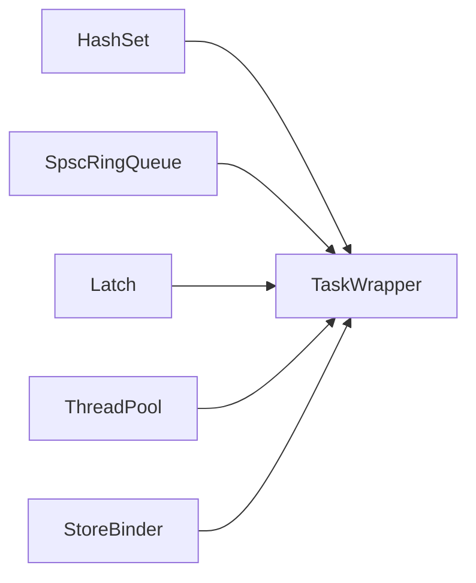

图示来源
- [task_wrapper.h](file://ucm/store/detail/template/task_wrapper.h#L42-L47)
- [store_binder.h](file://ucm/store/detail/template/store_binder.h#L134-L154)

章节来源
- [task_wrapper.h](file://ucm/store/detail/template/task_wrapper.h#L35-L104)
- [store_binder.h](file://ucm/store/detail/template/store_binder.h#L34-L155)

## 性能考量
- 哈希集合
  - 分片数量与哈希质量直接影响性能；ShardBits过大导致内存浪费，过小增加锁竞争。
  - 线性探测易产生聚集，建议使用高质量哈希或调整ShardBits。
- 环形队列
  - 2次幂容量可使用位运算加速取模；满/空判定需严格遵循head/tail顺序。
  - 消费端自旋与睡眠策略平衡CPU占用与延迟。
- TopN堆
  - 容量越小，常数因子越小；比较器应避免昂贵操作。
- 线程池
  - 监控线程与超时回调有助于维持稳定性；合理设置超时阈值防止僵尸任务。
- 索引池
  - CAS+版本号保证无锁；注意节点大小与对齐。
- 栅栏
  - Wait/WaitFor结合超时可避免无限等待；注意时钟精度与系统负载。

## 故障排查指南
- 哈希集合
  - 症状：插入后无法命中/删除无效。
  - 排查：确认Key的哈希与相等比较是否一致；检查分片容量与负载。
- 环形队列
  - 症状：TryPush返回失败/死锁。
  - 排查：确认容量为2次幂且Setup正确；检查生产者/消费者是否为单线程。
- 任务等待
  - 症状：Wait长时间不返回/超时。
  - 排查：确认任务句柄有效；检查TaskWrapper中HashSet是否包含该ID；核对Latch计数与完成回调。
- 存储绑定
  - 症状：Lookup/Prefetch抛出异常。
  - 排查：核对缓冲区形状与步长换算；检查Task描述维度一致性。

章节来源
- [hashset_test.cc](file://ucm/shared/test/case/infra/hashset_test.cc#L30-L76)
- [spsc_ring_queue_test.cc](file://ucm/shared/test/case/infra/spsc_ring_queue_test.cc#L29-L87)
- [task_wrapper.h](file://ucm/store/detail/template/task_wrapper.h#L67-L103)
- [store_binder.h](file://ucm/store/detail/template/store_binder.h#L134-L154)

## 结论
模板工具库以轻量、可复用为核心目标，通过分片哈希、无锁环形队列、固定容量堆、栅栏与线程池等基础构件，构建了高并发、低延迟的基础设施。在存储系统与传输层中，这些模板被组合为稳定的任务编排与跨语言交互方案。建议在实际工程中根据数据规模与并发特征选择合适的模板参数，并结合监控与超时策略保障系统稳定性。

## 附录

### 实际应用示例

- 存储系统（缓存层）
  - 任务队列与去重：在缓存加载/转储队列中使用HashSet避免重复任务，结合SpscRingQueue与Latch实现异步编排。
  - 参考文件
    - [load_queue.h](file://ucm/store/cache/cc/load_queue.h#L1-L31)
    - [dump_queue.h](file://ucm/store/cache/cc/dump_queue.h#L1-L31)

- 传输层（CUDA示例）
  - 通过Python脚本演示主机与设备之间的批量散射/聚合传输，展示模板在高性能计算场景下的集成方式。
  - 参考文件
    - [trans_on_cuda_example.py](file://ucm/shared/test/example/trans/trans_on_cuda_example.py#L85-L262)

- 存储连接器工厂
  - 通过工厂注册不同存储连接器，体现模板在插件化架构中的作用。
  - 参考文件
    - [factory.py](file://ucm/store/factory.py#L34-L71)
    - [factory_v1.py](file://ucm/store/factory_v1.py#L34-L66)