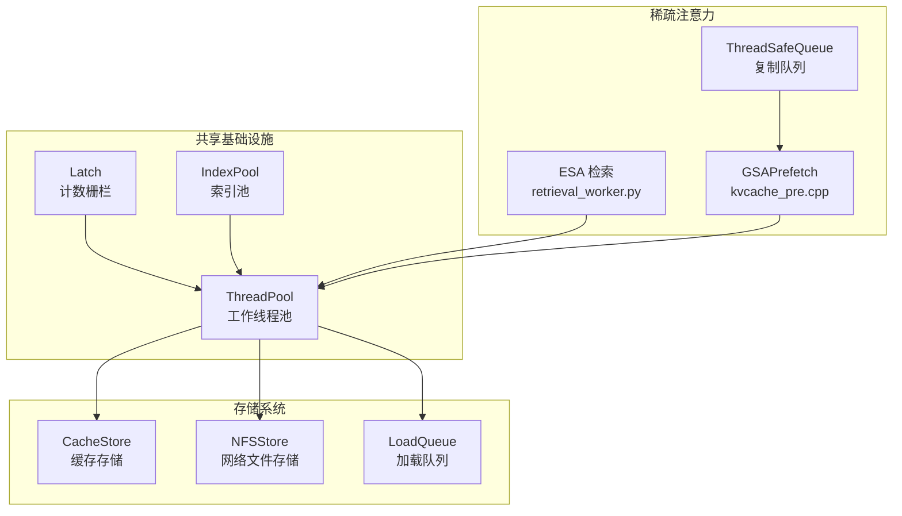
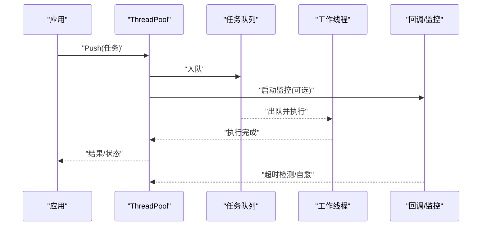
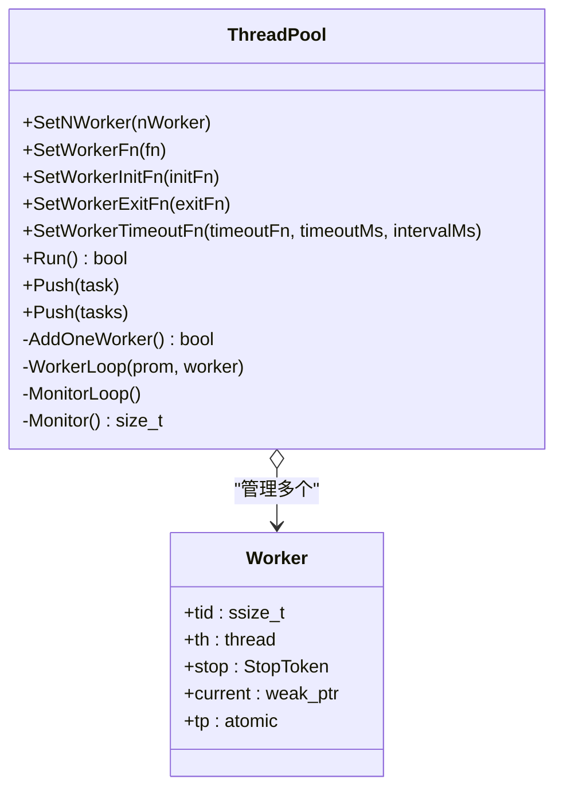
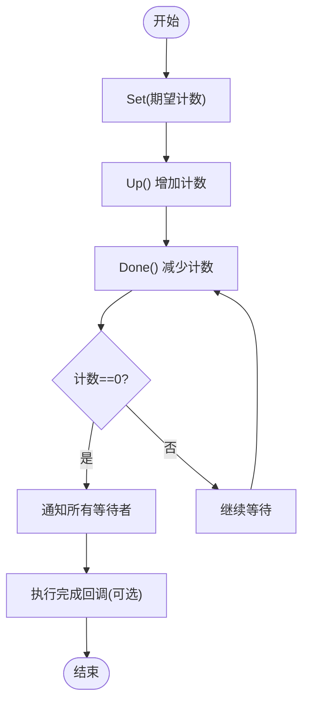
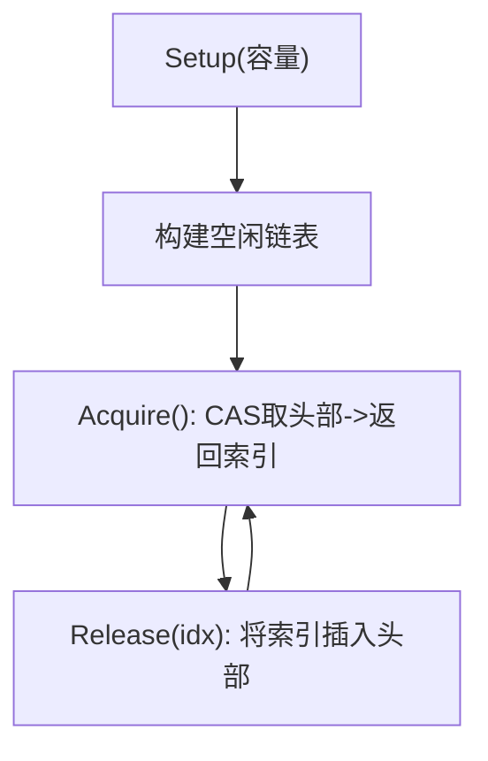
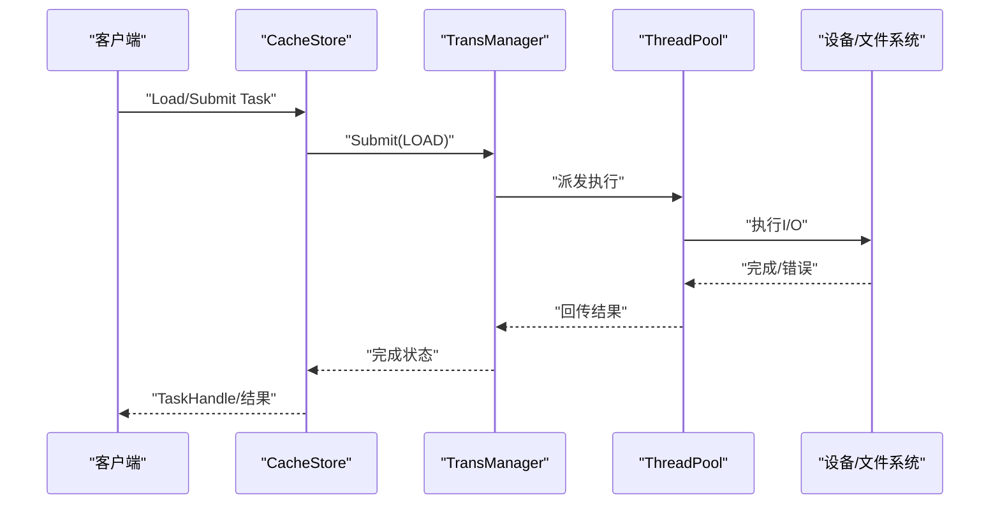
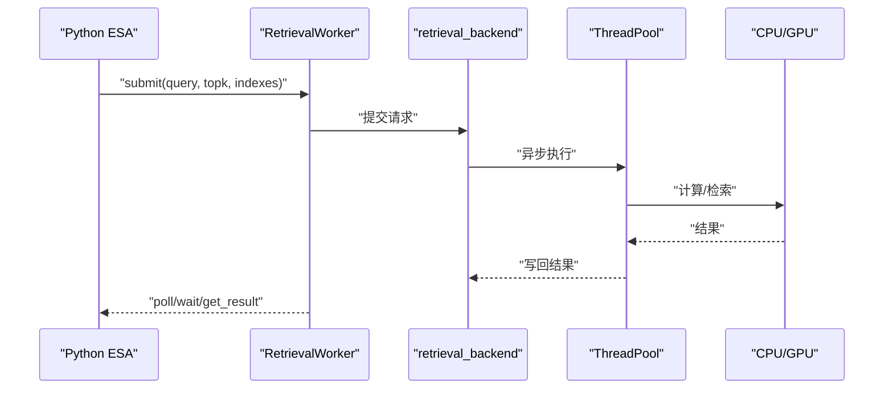
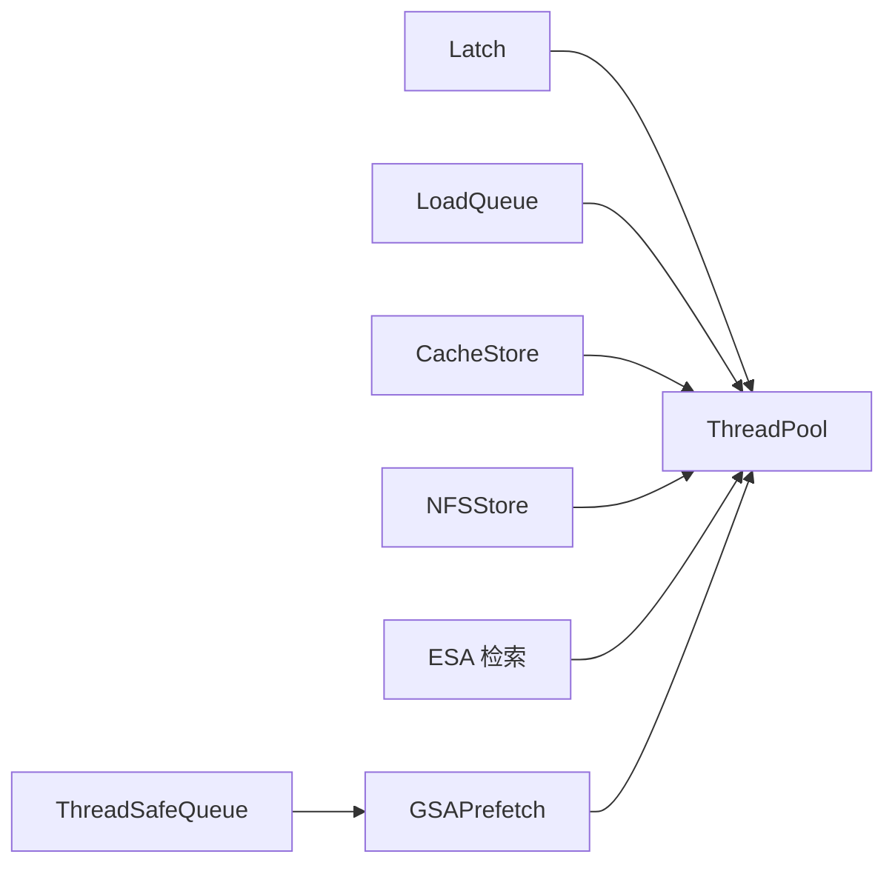

# 线程池管理

<cite>
**本文引用的文件**
- [thread_pool.h](file://ucm/shared/infra/thread/thread_pool.h)
- [latch.h](file://ucm/shared/infra/thread/latch.h)
- [index_pool.h](file://ucm/shared/infra/thread/index_pool.h)
- [thread_pool_test.cc](file://ucm/shared/test/case/infra/thread_pool_test.cc)
- [load_queue.h](file://ucm/store/cache/cc/load_queue.h)
- [cache_store.cc](file://ucm/store/cache/cc/cache_store.cc)
- [nfsstore.cc](file://ucm/store/nfsstore/cc/api/nfsstore.cc)
- [thread_safe_queue.h](file://ucm/sparse/gsa/offload_ops/include/thread_safe_queue.h)
- [retrieval_worker.py](file://ucm/sparse/esa/retrieval/retrieval_worker.py)
- [retrieval_backend.cpp](file://ucm/sparse/esa/retrieval/cpy/retrieval_backend.cpp)
- [kvcache_pre.cpp](file://ucm/sparse/gsa/prefetch/src/kvcache_pre.cpp)
- [thread_pool.h（GSAThreadPool）](file://ucm/sparse/gsa/offload_ops/include/thread_pool.h)
</cite>

## 目录
1. [简介](#简介)
2. [项目结构](#项目结构)
3. [核心组件](#核心组件)
4. [架构总览](#架构总览)
5. [组件详解](#组件详解)
6. [依赖关系分析](#依赖关系分析)
7. [性能与调优](#性能与调优)
8. [故障排查指南](#故障排查指南)
9. [结论](#结论)
10. [附录：使用示例与最佳实践](#附录使用示例与最佳实践)

## 简介
本技术文档围绕UCM（Unified Cache Management）中的线程池管理系统展开，系统性阐述工作线程管理、任务队列调度、负载均衡策略、线程同步机制（含Latch与IndexPool）、配置参数与性能调优、在存储系统与稀疏注意力算法中的应用实例，以及最佳实践与常见问题的解决方案。

## 项目结构
UCM线程池相关代码主要分布在以下位置：
- 共享基础设施层：线程池、同步原语（Latch、IndexPool）
- 存储子系统：缓存与NFS存储的传输任务执行与等待机制
- 稀疏注意力算法：ESA检索、GSAPrefetch等模块的异步执行与线程安全队列

图表来源
- [thread_pool.h](file://ucm/shared/infra/thread/thread_pool.h#L41-L223)
- [latch.h](file://ucm/shared/infra/thread/latch.h#L35-L88)
- [index_pool.h](file://ucm/shared/infra/thread/index_pool.h#L34-L94)
- [load_queue.h](file://ucm/store/cache/cc/load_queue.h#L24-L31)
- [cache_store.cc](file://ucm/store/cache/cc/cache_store.cc#L108-L129)
- [nfsstore.cc](file://ucm/store/nfsstore/cc/api/nfsstore.cc#L33-L63)
- [retrieval_worker.py](file://ucm/sparse/esa/retrieval/retrieval_worker.py#L11-L36)
- [kvcache_pre.cpp](file://ucm/sparse/gsa/prefetch/src/kvcache_pre.cpp#L68-L94)
- [thread_safe_queue.h](file://ucm/sparse/gsa/offload_ops/include/thread_safe_queue.h#L19-L39)

章节来源
- [thread_pool.h](file://ucm/shared/infra/thread/thread_pool.h#L41-L223)
- [latch.h](file://ucm/shared/infra/thread/latch.h#L35-L88)
- [index_pool.h](file://ucm/shared/infra/thread/index_pool.h#L34-L94)
- [load_queue.h](file://ucm/store/cache/cc/load_queue.h#L24-L31)
- [cache_store.cc](file://ucm/store/cache/cc/cache_store.cc#L108-L129)
- [nfsstore.cc](file://ucm/store/nfsstore/cc/api/nfsstore.cc#L33-L63)
- [retrieval_worker.py](file://ucm/sparse/esa/retrieval/retrieval_worker.py#L11-L36)
- [kvcache_pre.cpp](file://ucm/sparse/gsa/prefetch/src/kvcache_pre.cpp#L68-L94)
- [thread_safe_queue.h](file://ucm/sparse/gsa/offload_ops/include/thread_safe_queue.h#L19-L39)

## 核心组件
- 工作线程池 ThreadPool：支持可插拔的Worker函数、初始化/退出回调、超时检测与自愈、动态扩容监控、任务队列推送与唤醒。
- 同步原语 Latch：基于原子计数与条件变量的栅栏，支持设置期望值、增减、等待、带超时等待、完成回调。
- 索引池 IndexPool：无锁索引分配与回收，基于CAS链表实现，适合高并发场景下的轻量资源索引复用。

章节来源
- [thread_pool.h](file://ucm/shared/infra/thread/thread_pool.h#L41-L223)
- [latch.h](file://ucm/shared/infra/thread/latch.h#L35-L88)
- [index_pool.h](file://ucm/shared/infra/thread/index_pool.h#L34-L94)

## 架构总览
线程池作为统一的并发执行框架，贯穿存储与稀疏算法两大领域：
- 存储侧：通过传输管理器提交任务，由线程池执行；加载/转储队列使用Latch进行阶段同步。
- 稀疏侧：ESA检索与GSAPrefetch分别通过Python/C++桥接与C++线程池协同，配合线程安全队列进行数据搬运。

图表来源
- [thread_pool.h](file://ucm/shared/infra/thread/thread_pool.h#L121-L177)
- [thread_pool_test.cc](file://ucm/shared/test/case/infra/thread_pool_test.cc#L34-L68)

## 组件详解

### ThreadPool 设计与实现
- 角色与职责
  - 管理固定或动态扩缩容的工作线程集合
  - 提供任务入队接口，支持批量/单个任务推送
  - 可配置Worker初始化/退出回调、超时检测与处理、超时轮询间隔
- 关键数据结构
  - Worker：包含线程ID、停止令牌、当前任务弱引用、最近一次开始时间
  - 任务队列：std::list<Task>，配合互斥与条件变量实现阻塞式等待
- 执行流程
  - WorkerLoop：从队列取出任务，执行WorkerFn，更新时间戳，处理停止信号
  - MonitorLoop/Monitor：周期扫描Worker执行时长，触发超时回调并移除异常线程
- 线程同步
  - 互斥锁与条件变量保证任务可见性与等待唤醒
  - 原子标志位用于快速判断停止请求
- 动态扩容
  - 监控线程根据阈值自动补充工作线程，维持目标并发度

图表来源
- [thread_pool.h](file://ucm/shared/infra/thread/thread_pool.h#L41-L223)

章节来源
- [thread_pool.h](file://ucm/shared/infra/thread/thread_pool.h#L41-L223)
- [thread_pool_test.cc](file://ucm/shared/test/case/infra/thread_pool_test.cc#L34-L101)

### Latch 同步机制
- 设计要点
  - 原子计数器+条件变量，支持Up/Done/Wait/WaitFor/Check
  - 支持设置完成回调（Epilog），在计数归零时统一触发
  - 内置起始时间记录，WaitFor基于相对时间计算剩余等待
- 应用场景
  - 存储加载队列阶段化控制（如预热、排队、执行、收尾）
  - 多阶段异步任务编排与聚合

图表来源
- [latch.h](file://ucm/shared/infra/thread/latch.h#L35-L88)

章节来源
- [latch.h](file://ucm/shared/infra/thread/latch.h#L35-L88)
- [load_queue.h](file://ucm/store/cache/cc/load_queue.h#L24-L31)

### IndexPool 资源索引复用
- 设计要点
  - 使用邻接表+CAS指针实现无锁分配/回收
  - 每个槽位保存索引与下一个空闲槽位，头部指针携带版本号
  - 对齐到缓存行以减少伪共享
- 应用场景
  - 高并发下为任务/缓冲区/通道等分配唯一且可回收的逻辑索引
  - 与线程池结合，避免频繁内存分配与竞争

图表来源
- [index_pool.h](file://ucm/shared/infra/thread/index_pool.h#L51-L88)

章节来源
- [index_pool.h](file://ucm/shared/infra/thread/index_pool.h#L34-L94)

### 存储系统中的线程池应用
- 缓存存储 CacheStore
  - 通过传输管理器提交加载/转储任务，内部使用线程池执行具体I/O操作
  - 配置项包含等待队列深度、运行队列深度、超时毫秒数等
- NFS存储 NFSStore
  - 支持传输使能、设备ID、流数量、IO大小、缓冲数量、超时、直通IO等参数
  - 通过空间管理器与传输管理器协调块分配、查找、提交与等待

图表来源
- [cache_store.cc](file://ucm/store/cache/cc/cache_store.cc#L149-L157)
- [nfsstore.cc](file://ucm/store/nfsstore/cc/api/nfsstore.cc#L94-L101)
- [thread_pool.h](file://ucm/shared/infra/thread/thread_pool.h#L121-L177)

章节来源
- [cache_store.cc](file://ucm/store/cache/cc/cache_store.cc#L108-L129)
- [cache_store.cc](file://ucm/store/cache/cc/cache_store.cc#L149-L157)
- [nfsstore.cc](file://ucm/store/nfsstore/cc/api/nfsstore.cc#L33-L63)
- [nfsstore.cc](file://ucm/store/nfsstore/cc/api/nfsstore.cc#L94-L101)

### 稀疏注意力算法中的线程池应用
- ESA 检索
  - Python侧通过retrieval_worker.py提交查询，底层C++后端通过线程池异步执行
  - 使用等待/轮询接口获取结果，避免阻塞主线程
- GSA Prefetch
  - C++侧通过Enqueue接口提交任务，配合线程安全队列与线程池实现高效的数据搬运与预取
  - 支持活动线程数统计与队列压力感知

图表来源
- [retrieval_worker.py](file://ucm/sparse/esa/retrieval/retrieval_worker.py#L23-L36)
- [retrieval_backend.cpp](file://ucm/sparse/esa/retrieval/cpy/retrieval_backend.cpp#L1-L200)
- [kvcache_pre.cpp](file://ucm/sparse/gsa/prefetch/src/kvcache_pre.cpp#L68-L94)

章节来源
- [retrieval_worker.py](file://ucm/sparse/esa/retrieval/retrieval_worker.py#L11-L36)
- [kvcache_pre.cpp](file://ucm/sparse/gsa/prefetch/src/kvcache_pre.cpp#L68-L94)
- [thread_safe_queue.h](file://ucm/sparse/gsa/offload_ops/include/thread_safe_queue.h#L19-L39)

## 依赖关系分析
- 组件耦合
  - ThreadPool 与 Latch/LoadQueue：通过Latch实现阶段同步与等待
  - ThreadPool 与存储传输：通过TransManager/Task接口解耦任务提交与执行
  - ThreadPool 与稀疏算法：通过C++后端与Python桥接实现异步执行
- 外部依赖
  - STL线程库、互斥/条件变量、原子类型
  - 平台系统调用（如获取线程ID）

图表来源
- [thread_pool.h](file://ucm/shared/infra/thread/thread_pool.h#L41-L223)
- [latch.h](file://ucm/shared/infra/thread/latch.h#L35-L88)
- [load_queue.h](file://ucm/store/cache/cc/load_queue.h#L24-L31)
- [cache_store.cc](file://ucm/store/cache/cc/cache_store.cc#L149-L157)
- [nfsstore.cc](file://ucm/store/nfsstore/cc/api/nfsstore.cc#L94-L101)
- [retrieval_worker.py](file://ucm/sparse/esa/retrieval/retrieval_worker.py#L23-L36)
- [kvcache_pre.cpp](file://ucm/sparse/gsa/prefetch/src/kvcache_pre.cpp#L68-L94)
- [thread_safe_queue.h](file://ucm/sparse/gsa/offload_ops/include/thread_safe_queue.h#L19-L39)

## 性能与调优
- 线程数量（nWorker）
  - 根据CPU核数与I/O密集程度设定，避免过多上下文切换
  - 结合监控线程按需扩容，维持稳定吞吐
- 队列长度与超时
  - 等待队列深度与运行队列深度影响背压与延迟，需结合业务峰值评估
  - 超时阈值与轮询间隔决定异常检测灵敏度与开销
- 调优建议
  - I/O密集：适当提高nWorker，缩短轮询间隔，合理设置队列深度
  - 计算密集：关注CPU绑定与NUMA亲和，必要时限制线程数
  - 监控指标：活跃线程数、任务积压、平均执行时长、超时次数
- 参数参考
  - 等待队列深度、运行队列深度、超时毫秒数（存储配置）
  - 传输线程数、IO大小、缓冲数量、直通IO开关（NFS配置）

章节来源
- [cache_store.cc](file://ucm/store/cache/cc/cache_store.cc#L119-L121)
- [nfsstore.cc](file://ucm/store/nfsstore/cc/api/nfsstore.cc#L44-L52)
- [thread_pool.h](file://ucm/shared/infra/thread/thread_pool.h#L95-L102)

## 故障排查指南
- 死锁预防
  - 避免在WorkerFn中持有外部锁导致等待自身任务释放
  - 使用弱引用跟踪当前任务，防止循环引用
- 资源泄漏防护
  - 确保WorkerExitFn正确释放线程局部资源
  - 监控线程池析构时join所有工作线程
- 异常检测与恢复
  - 启用超时回调，及时终止长时间阻塞任务
  - 监控线程移除异常Worker并自动重建
- 常见问题定位
  - 任务长时间不完成：检查超时阈值与轮询间隔
  - 队列积压严重：增大nWorker或优化任务粒度
  - 存储等待超时：检查等待/运行队列深度与设备性能

章节来源
- [thread_pool.h](file://ucm/shared/infra/thread/thread_pool.h#L68-L79)
- [thread_pool.h](file://ucm/shared/infra/thread/thread_pool.h#L179-L207)
- [thread_pool_test.cc](file://ucm/shared/test/case/infra/thread_pool_test.cc#L34-L101)

## 结论
UCM线程池系统通过清晰的职责划分与强健的同步原语，实现了在存储与稀疏算法两大领域的高效并发执行。借助Latch与IndexPool，系统在高并发场景下保持低竞争与高吞吐；通过可配置的超时检测与动态扩容，具备良好的鲁棒性与可观测性。结合合理的参数调优与最佳实践，可进一步提升整体性能与稳定性。

## 附录：使用示例与最佳实践
- 使用示例路径
  - 线程池超时检测测试：[thread_pool_test.cc](file://ucm/shared/test/case/infra/thread_pool_test.cc#L34-L68)
  - 存储加载任务提交：[cache_store.cc](file://ucm/store/cache/cc/cache_store.cc#L149-L157)
  - NFS传输配置与提交：[nfsstore.cc](file://ucm/store/nfsstore/cc/api/nfsstore.cc#L94-L101)
  - ESA检索等待与结果获取：[retrieval_worker.py](file://ucm/sparse/esa/retrieval/retrieval_worker.py#L23-L36)
  - GSA预取任务入队与执行：[kvcache_pre.cpp](file://ucm/sparse/gsa/prefetch/src/kvcache_pre.cpp#L68-L94)
- 最佳实践
  - 明确任务边界，避免在WorkerFn中执行阻塞操作
  - 合理设置nWorker与队列深度，结合监控指标持续优化
  - 使用Latch进行阶段化编排，确保顺序一致性
  - 利用IndexPool进行资源索引复用，降低分配成本
  - 在异常路径中清理资源，启用超时回调与自愈机制