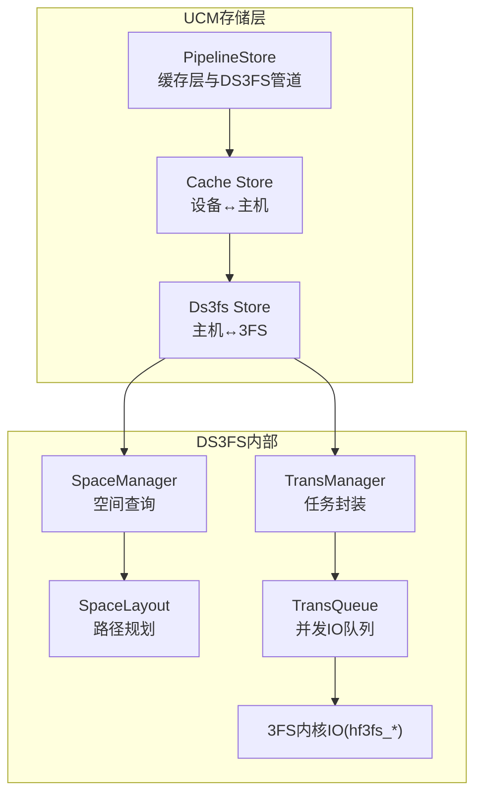
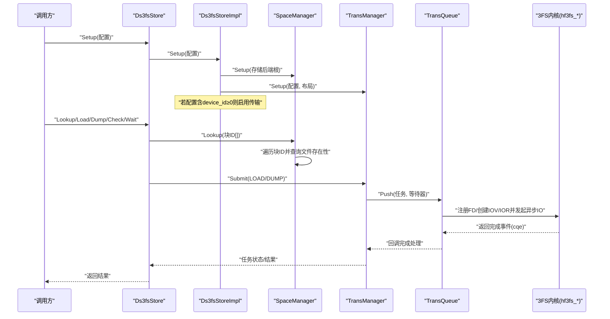
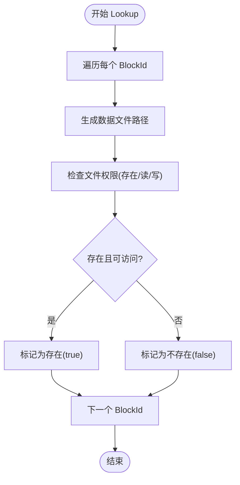
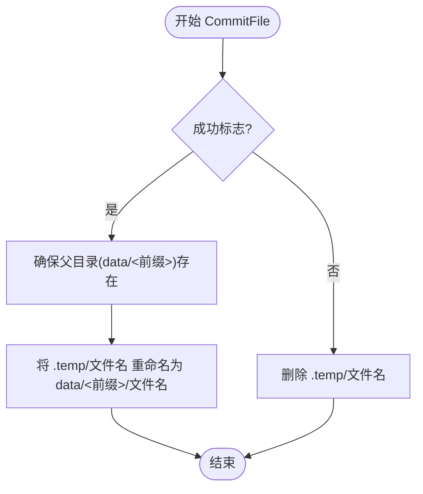
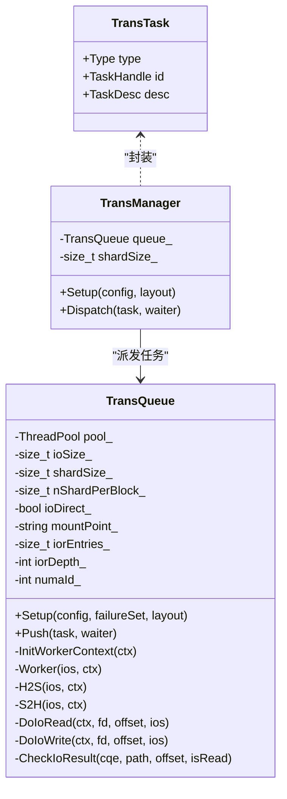
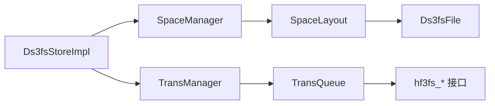

# DS3FS存储

<cite>
**本文引用的文件**
- [ds3fs_store.h](file://ucm/store/ds3fs/cc/ds3fs_store.h)
- [ds3fs_store.cc](file://ucm/store/ds3fs/cc/ds3fs_store.cc)
- [ds3fs_file.h](file://ucm/store/ds3fs/cc/ds3fs_file.h)
- [ds3fs_file.cc](file://ucm/store/ds3fs/cc/ds3fs_file.cc)
- [space_manager.h](file://ucm/store/ds3fs/cc/space_manager.h)
- [space_manager.cc](file://ucm/store/ds3fs/cc/space_manager.cc)
- [space_layout.h](file://ucm/store/ds3fs/cc/space_layout.h)
- [space_layout.cc](file://ucm/store/ds3fs/cc/space_layout.cc)
- [trans_manager.h](file://ucm/store/ds3fs/cc/trans_manager.h)
- [trans_queue.h](file://ucm/store/ds3fs/cc/trans_queue.h)
- [trans_task.h](file://ucm/store/ds3fs/cc/trans_task.h)
- [global_config.h](file://ucm/store/ds3fs/cc/global_config.h)
- [ds3fs_store.md](file://docs/source/user-guide/prefix-cache/ds3fs_store.md)
- [ds3fs_test.py](file://ucm/store/test/e2e/ds3fs_test.py)
- [ucm_config_example.yaml](file://examples/ucm_config_example.yaml)
</cite>

## 目录
1. [简介](#简介)
2. [项目结构](#项目结构)
3. [核心组件](#核心组件)
4. [架构总览](#架构总览)
5. [组件详解](#组件详解)
6. [依赖关系分析](#依赖关系分析)
7. [性能与扩展性](#性能与扩展性)
8. [故障排除与运维](#故障排除与运维)
9. [结论](#结论)
10. [附录：部署与监控示例](#附录部署与监控示例)

## 简介
本技术文档面向UCM（Unified Cache Management）中的DS3FS分布式存储子系统，系统化阐述其分布式文件系统架构、空间管理机制、数据分片与传输流程、文件操作接口、配置参数与集群管理要点，并结合仓库内的用户指南与端到端测试，给出部署示例、性能监控方案以及在大规模分布式场景下的扩展性建议与运维最佳实践。

## 项目结构
DS3FS位于UCM的存储层中，采用“管道式”与“缓存层”协同工作的方式：缓存层负责设备与主机之间的数据搬运，DS3FS则负责主机与3FS后端之间的数据传输。DS3FS通过空间布局（SpaceLayout）定义KV块在3FS上的物理路径，通过传输队列（TransQueue）与3FS内核态IO接口（如hf3fs_*）进行高效数据搬运，并以任务模型（TransTask）统一调度。

图示来源
- [ds3fs_store.cc](file://ucm/store/ds3fs/cc/ds3fs_store.cc#L32-L55)
- [space_manager.h](file://ucm/store/ds3fs/cc/space_manager.h#L32-L42)
- [space_layout.h](file://ucm/store/ds3fs/cc/space_layout.h#L32-L47)
- [trans_manager.h](file://ucm/store/ds3fs/cc/trans_manager.h#L33-L61)
- [trans_queue.h](file://ucm/store/ds3fs/cc/trans_queue.h#L41-L179)

章节来源
- [ds3fs_store.h](file://ucm/store/ds3fs/cc/ds3fs_store.h#L33-L47)
- [ds3fs_store.cc](file://ucm/store/ds3fs/cc/ds3fs_store.cc#L32-L55)
- [space_manager.h](file://ucm/store/ds3fs/cc/space_manager.h#L32-L42)
- [space_layout.h](file://ucm/store/ds3fs/cc/space_layout.h#L32-L47)
- [trans_manager.h](file://ucm/store/ds3fs/cc/trans_manager.h#L33-L61)
- [trans_queue.h](file://ucm/store/ds3fs/cc/trans_queue.h#L41-L179)

## 核心组件
- Ds3fsStore/Ds3fsStoreImpl：对外暴露的存储接口实现，负责配置校验、空间管理器与传输管理器的初始化与编排。
- SpaceManager：基于SpaceLayout查询某块是否存在于3FS后端。
- SpaceLayout：定义3FS上数据文件的相对根目录、临时目录、文件命名规则与提交/归档流程。
- TransManager：任务封装与派发，将LOAD/DUMP任务交由TransQueue执行。
- TransQueue：线程池驱动的并发IO队列，封装hf3fs_*系列内核IO接口，支持IOV/IOR等优化。
- Ds3fsFile：对底层文件系统操作的封装（mkdir/rename/access/open/close/remove等）。
- TransTask：传输任务类型（LOAD/DUMP）与任务描述载体。
- GlobalConfig：DS3FS运行期配置项集合。

章节来源
- [ds3fs_store.cc](file://ucm/store/ds3fs/cc/ds3fs_store.cc#L32-L94)
- [space_manager.cc](file://ucm/store/ds3fs/cc/space_manager.cc#L30-L54)
- [space_layout.cc](file://ucm/store/ds3fs/cc/space_layout.cc#L32-L94)
- [trans_manager.h](file://ucm/store/ds3fs/cc/trans_manager.h#L33-L61)
- [trans_queue.h](file://ucm/store/ds3fs/cc/trans_queue.h#L41-L179)
- [ds3fs_file.h](file://ucm/store/ds3fs/cc/ds3fs_file.h#L32-L71)
- [trans_task.h](file://ucm/store/ds3fs/cc/trans_task.h#L32-L48)
- [global_config.h](file://ucm/store/ds3fs/cc/global_config.h#L32-L44)

## 架构总览
DS3FS整体架构围绕“配置→空间布局→任务调度→内核IO”的链路展开。配置阶段完成参数校验与传输能力开关；空间布局负责路径生成与文件生命周期管理；任务调度将高层请求拆解为细粒度的IO单元，利用3FS内核接口实现高吞吐数据搬运。

图示来源
- [ds3fs_store.cc](file://ucm/store/ds3fs/cc/ds3fs_store.cc#L98-L162)
- [space_manager.cc](file://ucm/store/ds3fs/cc/space_manager.cc#L30-L54)
- [trans_manager.h](file://ucm/store/ds3fs/cc/trans_manager.h#L46-L61)
- [trans_queue.h](file://ucm/store/ds3fs/cc/trans_queue.h#L168-L179)

## 组件详解

### Ds3fsStore与配置校验
- 对外接口：Setup、Readme、Lookup、Prefetch、Load、Dump、Check、Wait。
- 配置项：storage_backends、device_id、tensor_size、shard_size、block_size、io_direct、stream_number、timeout_ms、ior_entries、ior_depth、numa_id。
- 校验逻辑：校验后端列表非空、设备ID合法、尺寸关系满足整除与单调递增、流数量大于0。
- 传输使能：当device_id≥0时启用传输路径，否则仅支持空间查询。

章节来源
- [ds3fs_store.h](file://ucm/store/ds3fs/cc/ds3fs_store.h#L33-L47)
- [ds3fs_store.cc](file://ucm/store/ds3fs/cc/ds3fs_store.cc#L98-L162)
- [global_config.h](file://ucm/store/ds3fs/cc/global_config.h#L32-L44)
- [ds3fs_store.cc](file://ucm/store/ds3fs/cc/ds3fs_store.cc#L58-L77)

### 空间管理与文件存在性查询
- SpaceManager基于SpaceLayout生成数据文件路径，使用Ds3fsFile检查文件是否存在/可读/可写。
- 返回值：布尔向量，指示每个块ID对应的文件是否存在。

图示来源
- [space_manager.cc](file://ucm/store/ds3fs/cc/space_manager.cc#L35-L54)
- [space_layout.cc](file://ucm/store/ds3fs/cc/space_layout.cc#L48-L53)
- [ds3fs_file.cc](file://ucm/store/ds3fs/cc/ds3fs_file.cc#L68-L77)

章节来源
- [space_manager.h](file://ucm/store/ds3fs/cc/space_manager.h#L32-L42)
- [space_manager.cc](file://ucm/store/ds3fs/cc/space_manager.cc#L35-L54)
- [ds3fs_file.h](file://ucm/store/ds3fs/cc/ds3fs_file.h#L32-L71)
- [ds3fs_file.cc](file://ucm/store/ds3fs/cc/ds3fs_file.cc#L38-L77)

### 空间布局与文件生命周期
- 相对根目录：.temp（临时），data（正式）。
- 文件命名：以块ID字节序列拼接后的两位十六进制字符串作为文件名。
- 路径组织：正式文件位于storageBackend/data/<前缀>/文件名；临时文件位于storageBackend/.temp/文件名。
- 提交流程：成功则将临时文件重命名为正式文件；失败或错误则删除临时文件。

图示来源
- [space_layout.cc](file://ucm/store/ds3fs/cc/space_layout.cc#L55-L75)
- [space_layout.cc](file://ucm/store/ds3fs/cc/space_layout.cc#L79-L83)
- [space_layout.cc](file://ucm/store/ds3fs/cc/space_layout.cc#L89-L92)

章节来源
- [space_layout.h](file://ucm/store/ds3fs/cc/space_layout.h#L32-L47)
- [space_layout.cc](file://ucm/store/ds3fs/cc/space_layout.cc#L32-L94)

### 传输管理与并发队列
- TransManager：继承通用任务包装器，记录超时与分片大小，将任务派发至TransQueue。
- TransQueue：线程池驱动，每任务拆分为多个IoUnit，每个工作线程上下文持有IOV/IOR句柄，通过hf3fs_*接口进行异步IO。
- 支持的内核接口：IOV创建/销毁、IOR创建/销毁、FD注册/注销。
- 完成回调：记录耗时并通知等待器。

图示来源
- [trans_task.h](file://ucm/store/ds3fs/cc/trans_task.h#L32-L48)
- [trans_manager.h](file://ucm/store/ds3fs/cc/trans_manager.h#L33-L61)
- [trans_queue.h](file://ucm/store/ds3fs/cc/trans_queue.h#L41-L179)

章节来源
- [trans_manager.h](file://ucm/store/ds3fs/cc/trans_manager.h#L33-L61)
- [trans_queue.h](file://ucm/store/ds3fs/cc/trans_queue.h#L41-L179)

### 文件系统抽象（Ds3fsFile）
- 封装mkdir/rmdir/rename/access/open/close/remove等底层操作，统一返回状态码，便于上层判断错误类型（如重复键、未找到、OS错误）。

章节来源
- [ds3fs_file.h](file://ucm/store/ds3fs/cc/ds3fs_file.h#L32-L71)
- [ds3fs_file.cc](file://ucm/store/ds3fs/cc/ds3fs_file.cc#L38-L96)

## 依赖关系分析
- Ds3fsStoreImpl依赖SpaceManager与TransManager；SpaceManager依赖SpaceLayout与Ds3fsFile；TransManager依赖TransQueue；TransQueue依赖hf3fs_*内核接口与线程池。
- 配置项影响：device_id决定是否启用传输；shard_size与block_size影响分片粒度；stream_number与ior_entries/depth影响并发度；numa_id影响NUMA亲和。

图示来源
- [ds3fs_store.cc](file://ucm/store/ds3fs/cc/ds3fs_store.cc#L32-L55)
- [space_manager.cc](file://ucm/store/ds3fs/cc/space_manager.cc#L30-L33)
- [space_layout.cc](file://ucm/store/ds3fs/cc/space_layout.cc#L32-L46)
- [trans_manager.h](file://ucm/store/ds3fs/cc/trans_manager.h#L33-L43)
- [trans_queue.h](file://ucm/store/ds3fs/cc/trans_queue.h#L168-L179)

章节来源
- [ds3fs_store.cc](file://ucm/store/ds3fs/cc/ds3fs_store.cc#L32-L55)
- [space_manager.cc](file://ucm/store/ds3fs/cc/space_manager.cc#L30-L33)
- [trans_manager.h](file://ucm/store/ds3fs/cc/trans_manager.h#L33-L43)
- [trans_queue.h](file://ucm/store/ds3fs/cc/trans_queue.h#L168-L179)

## 性能与扩展性
- 并发与队列深度：通过stream_number、ior_entries、ior_depth控制并发流数与队列深度，影响吞吐与延迟。
- NUMA亲和：numa_id用于绑定工作线程上下文，减少跨NUMA开销。
- 分片策略：shard_size与block_size需满足整除关系，避免碎片化；合理设置可提升并行效率。
- 直接I/O：io_direct可降低内核页缓存开销，提高大块顺序IO性能。
- 端到端性能：用户指南展示了在多GPU与多节点部署下，Prefix Cache场景下显著的TTFT加速效果，验证了DS3FS在大规模推理场景中的价值。

章节来源
- [global_config.h](file://ucm/store/ds3fs/cc/global_config.h#L32-L44)
- [trans_queue.h](file://ucm/store/ds3fs/cc/trans_queue.h#L138-L152)
- [ds3fs_store.md](file://docs/source/user-guide/prefix-cache/ds3fs_store.md#L13-L66)

## 故障排除与运维
- 日志级别：通过设置日志级别查看详细任务派发与完成信息，便于定位传输问题。
- 常见错误类型：重复键、未找到、OS API错误；在Lookup阶段若文件不可访问会返回相应状态。
- 传输禁用：当device_id为-1时，不启用传输路径，仅支持空间查询；出现“transfer is not enable”错误时需检查配置。
- 超时与队列：可通过timeout_ms调整任务等待时间；若任务长时间未完成，检查队列深度与内核IO状态。
- 文件系统清理：提交失败会自动删除临时文件；若异常退出，建议手动清理残留临时文件。

章节来源
- [ds3fs_store.cc](file://ucm/store/ds3fs/cc/ds3fs_store.cc#L128-L162)
- [ds3fs_file.cc](file://ucm/store/ds3fs/cc/ds3fs_file.cc#L42-L46)
- [space_layout.cc](file://ucm/store/ds3fs/cc/space_layout.cc#L70-L75)

## 结论
DS3FS通过清晰的模块划分与任务驱动的传输模型，在UCM的缓存管道中承担了从主机到3FS后端的高效数据搬运职责。其空间布局简洁可靠，传输队列充分利用3FS内核接口实现高并发IO，配合合理的配置参数可在大规模推理场景中取得显著性能收益。建议在生产环境中结合监控指标与NUMA亲和策略进行精细化调优，并建立完善的故障排查流程以保障稳定性。

## 附录：部署与监控示例

### 配置参数清单
- 必填
  - storage_backends：3FS挂载路径（示例中为“/mount/3fs”，需替换为实际路径）
- 可选
  - device_id：>=0启用传输；默认-1
  - tensor_size/shard_size/block_size：分片尺寸，需满足整除关系
  - io_direct：是否启用直接I/O，默认true
  - stream_number：并发流数，默认32
  - timeout_ms：任务超时毫秒数，默认30000
  - ior_entries/ior_depth：IOR队列参数，默认1
  - numa_id：NUMA亲和，默认-1

章节来源
- [ds3fs_store.md](file://docs/source/user-guide/prefix-cache/ds3fs_store.md#L69-L126)
- [global_config.h](file://ucm/store/ds3fs/cc/global_config.h#L32-L44)

### 端到端测试与验证
- 测试流程：构造随机块ID与数据，先dump到DS3FS，再lookup确认存在，随后load回内存并比对数据一致性。
- 批次与规模：示例脚本支持批量多次测试，便于评估稳定性与性能。

章节来源
- [ds3fs_test.py](file://ucm/store/test/e2e/ds3fs_test.py#L82-L136)

### 性能基准与部署参考
- 多节点部署：用户指南提供了两节点部署与双NVMe磁盘聚合的基准场景，展示不同输入长度与并发下的加速效果。
- 推理启动：给出了vLLM服务启动命令示例，包含KV缓存传输配置与UCM配置文件路径。

章节来源
- [ds3fs_store.md](file://docs/source/user-guide/prefix-cache/ds3fs_store.md#L13-L66)
- [ds3fs_store.md](file://docs/source/user-guide/prefix-cache/ds3fs_store.md#L127-L152)

### 监控与可观测性
- 日志：通过设置日志级别查看任务派发与完成耗时，辅助定位瓶颈。
- 指标：仓库提供Grafana/Prometheus配置示例，可用于采集与展示UCM相关指标。

章节来源
- [ds3fs_store.md](file://docs/source/user-guide/prefix-cache/ds3fs_store.md#L216-L252)
- [ucm_config_example.yaml](file://examples/ucm_config_example.yaml#L17-L18)