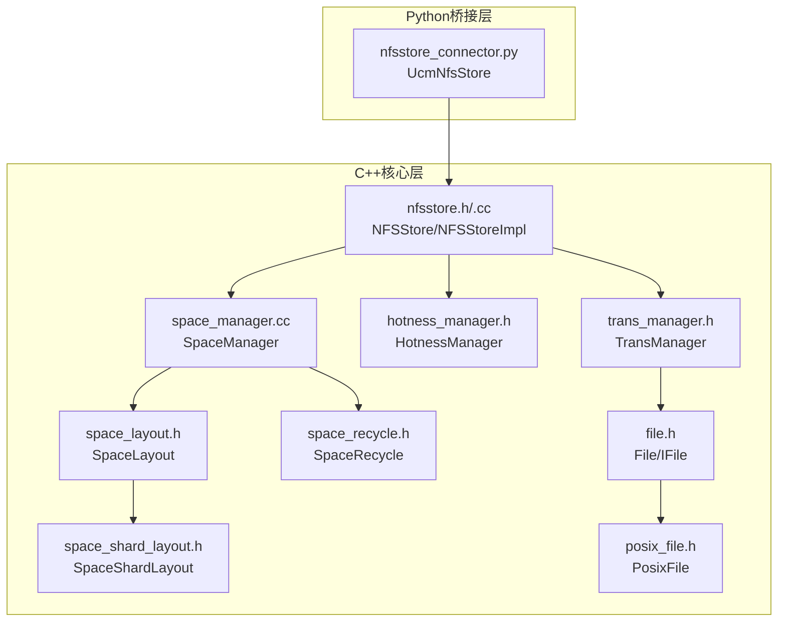
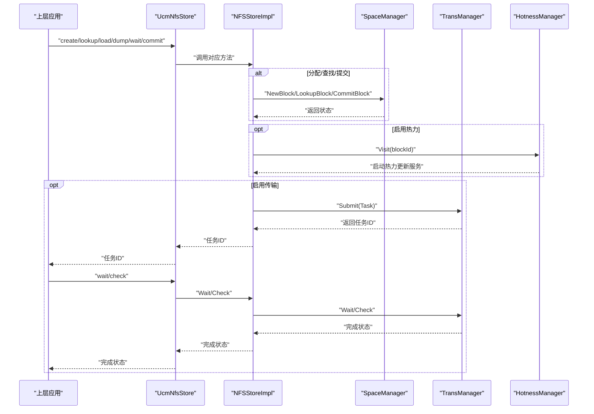
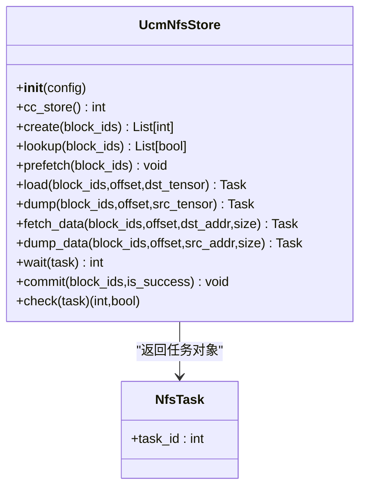
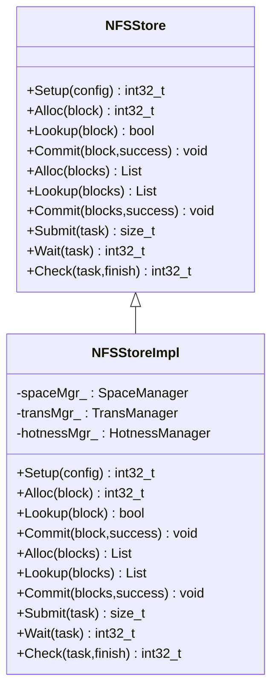
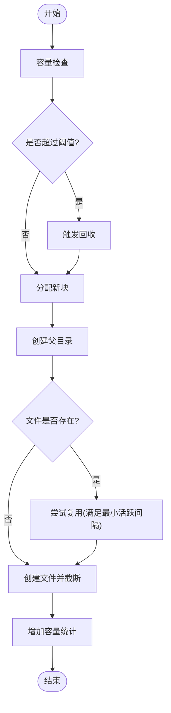
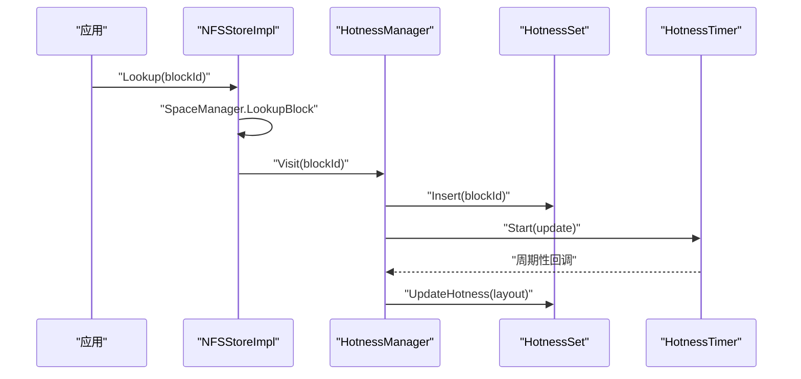
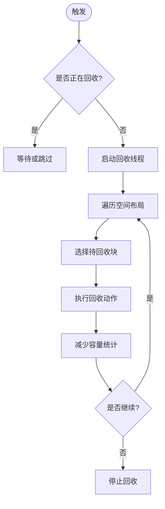
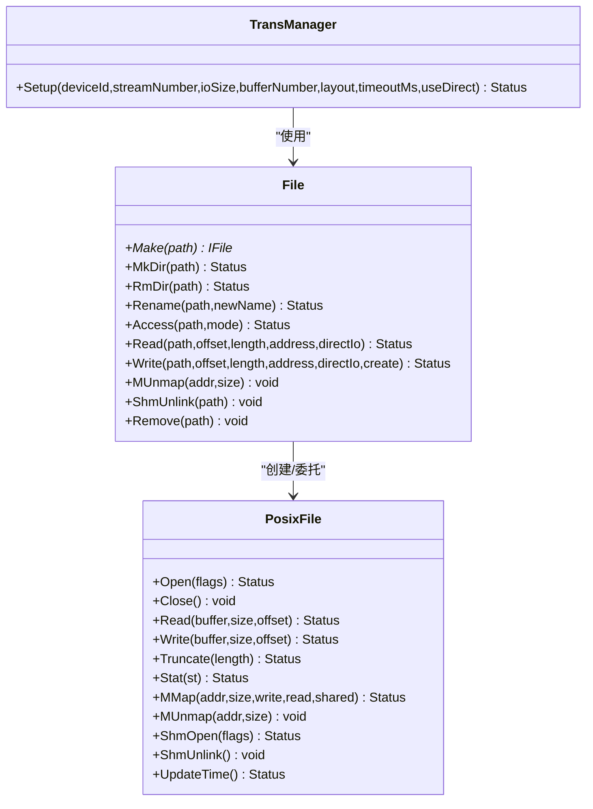
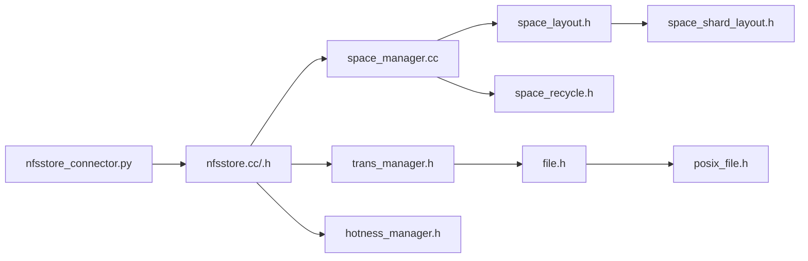

# NFS存储

<cite>
**本文引用的文件**
- [nfsstore_connector.py](file://ucm/store/nfsstore/nfsstore_connector.py)
- [nfsstore.h](file://ucm/store/nfsstore/cc/api/nfsstore.h)
- [nfsstore.cc](file://ucm/store/nfsstore/cc/api/nfsstore.cc)
- [space_manager.cc](file://ucm/store/nfsstore/cc/domain/space/space_manager.cc)
- [space_layout.h](file://ucm/store/nfsstore/cc/domain/space/space_layout.h)
- [space_shard_layout.h](file://ucm/store/nfsstore/cc/domain/space/space_shard_layout.h)
- [hotness_manager.h](file://ucm/store/nfsstore/cc/domain/hotness/hotness_manager.h)
- [space_recycle.h](file://ucm/store/nfsstore/cc/domain/space/space_recycle.h)
- [trans_manager.h](file://ucm/store/nfsstore/cc/domain/trans/trans_manager.h)
- [file.h](file://ucm/store/nfsstore/cc/domain/file/file.h)
- [posix_file.h](file://ucm/store/nfsstore/cc/domain/file/posix_file.h)
- [nfs_store.md](file://docs/source/user-guide/prefix-cache/nfs_store.md)
- [ucm_config_example.yaml](file://examples/ucm_config_example.yaml)
</cite>

## 目录
1. [简介](#简介)
2. [项目结构](#项目结构)
3. [核心组件](#核心组件)
4. [架构总览](#架构总览)
5. [组件详解](#组件详解)
6. [依赖关系分析](#依赖关系分析)
7. [性能与调优](#性能与调优)
8. [部署与配置示例](#部署与配置示例)
9. [故障排除指南](#故障排除指南)
10. [结论](#结论)

## 简介
本文件面向UCM（Unified Cache Management）中的NFS存储子系统，系统性阐述其网络文件系统集成架构、NfsStoreConnector的实现原理与网络通信机制、空间管理策略（空间布局、热力管理、回收策略）、文件系统操作接口（读写、空间分配、元数据管理），以及配置项与性能调优参数（网络带宽优化、并发访问控制）。同时提供部署配置示例、故障排除指南，并总结在分布式场景下的应用与最佳实践。

## 项目结构
NFS存储模块位于ucm/store/nfsstore目录下，采用“Python桥接层 + C++核心实现”的分层设计：
- Python桥接层：提供与上层框架（如vLLM）对接的UcmNfsStore类，负责参数解析、任务封装与调用底层C++实现。
- C++核心层：包含API接口、域模型（空间管理、热力管理、传输管理、文件抽象等），实现NFS存储的完整生命周期管理与高性能数据传输。

图表来源
- [nfsstore_connector.py](file://ucm/store/nfsstore/nfsstore_connector.py#L39-L132)
- [nfsstore.h](file://ucm/store/nfsstore/cc/api/nfsstore.h#L64-L96)
- [nfsstore.cc](file://ucm/store/nfsstore/cc/api/nfsstore.cc#L33-L145)
- [space_manager.cc](file://ucm/store/nfsstore/cc/domain/space/space_manager.cc#L45-L72)
- [space_layout.h](file://ucm/store/nfsstore/cc/domain/space/space_layout.h#L34-L46)
- [space_shard_layout.h](file://ucm/store/nfsstore/cc/domain/space/space_shard_layout.h#L31-L54)
- [hotness_manager.h](file://ucm/store/nfsstore/cc/domain/hotness/hotness_manager.h#L36-L71)
- [space_recycle.h](file://ucm/store/nfsstore/cc/domain/space/space_recycle.h#L36-L58)
- [trans_manager.h](file://ucm/store/nfsstore/cc/domain/trans/trans_manager.h#L32-L49)
- [file.h](file://ucm/store/nfsstore/cc/domain/file/file.h#L32-L48)
- [posix_file.h](file://ucm/store/nfsstore/cc/domain/file/posix_file.h#L31-L54)

章节来源
- [nfsstore_connector.py](file://ucm/store/nfsstore/nfsstore_connector.py#L39-L132)
- [nfsstore.h](file://ucm/store/nfsstore/cc/api/nfsstore.h#L64-L96)
- [nfsstore.cc](file://ucm/store/nfsstore/cc/api/nfsstore.cc#L33-L145)

## 核心组件
- NFSStore/NFSStoreImpl：对外暴露统一的KV缓存块管理接口（分配、查找、提交、提交批处理、提交任务、等待任务、检查任务），内部委派给SpaceManager、TransManager、HotnessManager完成具体逻辑。
- SpaceManager：负责空间布局、容量校验、块分配与提交、归档/激活状态切换、回收触发。
- SpaceLayout/SpaceShardLayout：定义数据文件路径、父目录、集群属性文件路径、迭代器等，支持按块ID分片布局。
- HotnessManager：基于定时器与集合维护热点块，驱动空间热力更新。
- SpaceRecycle：后台线程触发回收，按阈值策略释放空间。
- TransManager：多队列并行传输管理，支持设备侧I/O大小、缓冲数量、超时、直写等参数。
- File/IFile/PosixFile：POSIX文件抽象与实现，提供目录创建、重命名、访问性检查、读写、映射、截断等能力。

章节来源
- [nfsstore.cc](file://ucm/store/nfsstore/cc/api/nfsstore.cc#L33-L145)
- [space_manager.cc](file://ucm/store/nfsstore/cc/domain/space/space_manager.cc#L45-L72)
- [space_layout.h](file://ucm/store/nfsstore/cc/domain/space/space_layout.h#L34-L46)
- [space_shard_layout.h](file://ucm/store/nfsstore/cc/domain/space/space_shard_layout.h#L31-L54)
- [hotness_manager.h](file://ucm/store/nfsstore/cc/domain/hotness/hotness_manager.h#L36-L71)
- [space_recycle.h](file://ucm/store/nfsstore/cc/domain/space/space_recycle.h#L36-L58)
- [trans_manager.h](file://ucm/store/nfsstore/cc/domain/trans/trans_manager.h#L32-L49)
- [file.h](file://ucm/store/nfsstore/cc/domain/file/file.h#L32-L48)
- [posix_file.h](file://ucm/store/nfsstore/cc/domain/file/posix_file.h#L31-L54)

## 架构总览
NFS存储系统通过Python桥接层将上层推理框架的任务请求转换为底层C++实现的统一调用。核心流程如下：
- 初始化阶段：解析配置，设置空间布局、热力管理、传输队列；可选启用容量回收。
- 运行阶段：分配块、查找块、提交块；异步提交传输任务，支持批量与单次操作；根据热力策略进行空间维护；达到容量阈值时触发回收。

图表来源
- [nfsstore_connector.py](file://ucm/store/nfsstore/nfsstore_connector.py#L75-L131)
- [nfsstore.cc](file://ucm/store/nfsstore/cc/api/nfsstore.cc#L64-L105)
- [space_manager.cc](file://ucm/store/nfsstore/cc/domain/space/space_manager.cc#L74-L156)
- [hotness_manager.h](file://ucm/store/nfsstore/cc/domain/hotness/hotness_manager.h#L46-L63)
- [trans_manager.h](file://ucm/store/nfsstore/cc/domain/trans/trans_manager.h#L34-L48)

## 组件详解

### NfsStoreConnector（Python桥接）
- 职责：解析配置、构造底层NFSStore实例、封装任务、提供create/lookup/load/dump/wait/commit等接口。
- 关键点：
  - 支持按角色（worker）启用传输参数（设备ID、流数、I/O大小、缓冲数、直写等）。
  - 兼容旧版参数名（storage_capacity、recycle_enable、recycle_threshold_ratio）。
  - 将Tensor内存指针与大小转换为底层可识别的地址与尺寸，交由底层执行加载/卸载。

图表来源
- [nfsstore_connector.py](file://ucm/store/nfsstore/nfsstore_connector.py#L39-L132)

章节来源
- [nfsstore_connector.py](file://ucm/store/nfsstore/nfsstore_connector.py#L39-L132)

### NFSStore/NFSStoreImpl（C++接口与实现）
- 对外接口：Setup、Alloc/Lookup/Commit（单个与批量）、Submit/Wait/Check（任务）。
- 内部委派：
  - Setup：初始化SpaceManager、TransManager、HotnessManager。
  - Lookup：命中后通知热力管理器访问记录。
  - Submit：提交到TransManager生成任务ID。
- 配置展示：打印构建版本、存储后端、块大小、传输参数、热力参数、容量与回收参数等。

图表来源
- [nfsstore.h](file://ucm/store/nfsstore/cc/api/nfsstore.h#L64-L96)
- [nfsstore.cc](file://ucm/store/nfsstore/cc/api/nfsstore.cc#L33-L145)

章节来源
- [nfsstore.h](file://ucm/store/nfsstore/cc/api/nfsstore.h#L64-L96)
- [nfsstore.cc](file://ucm/store/nfsstore/cc/api/nfsstore.cc#L33-L145)

### 空间管理（SpaceManager/SpaceLayout/SpaceShardLayout）
- 空间布局选择：根据配置决定使用普通分片布局或临时目录布局（用于转储）。
- 块分配：
  - 创建父目录与数据文件，若目标已存在则尝试复用（需满足最小活跃间隔）。
  - 截断至块大小，增加容量统计。
- 提交流程：
  - 成功：将激活态文件移动到归档态目录，删除激活态目录；失败或跨目录时清理激活态目录。
  - 更新容量统计。
- 容量检查与回收：
  - 当使用量超过阈值时触发回收；当剩余空间不足一个块时返回无空间错误。

图表来源
- [space_manager.cc](file://ucm/store/nfsstore/cc/domain/space/space_manager.cc#L74-L131)
- [space_manager.cc](file://ucm/store/nfsstore/cc/domain/space/space_manager.cc#L179-L193)

章节来源
- [space_manager.cc](file://ucm/store/nfsstore/cc/domain/space/space_manager.cc#L45-L72)
- [space_manager.cc](file://ucm/store/nfsstore/cc/domain/space/space_manager.cc#L74-L156)
- [space_manager.cc](file://ucm/store/nfsstore/cc/domain/space/space_manager.cc#L179-L193)
- [space_layout.h](file://ucm/store/nfsstore/cc/domain/space/space_layout.h#L34-L46)
- [space_shard_layout.h](file://ucm/store/nfsstore/cc/domain/space/space_shard_layout.h#L31-L54)

### 热力管理（HotnessManager）
- 功能：周期性扫描空间中的块，维护热点集合，提升热块的访问优先级，辅助回收策略。
- 行为：首次访问启动定时器与后台线程，周期性更新热力信息；可配置热力检测间隔。

图表来源
- [nfsstore.cc](file://ucm/store/nfsstore/cc/api/nfsstore.cc#L68-L73)
- [hotness_manager.h](file://ucm/store/nfsstore/cc/domain/hotness/hotness_manager.h#L46-L63)

章节来源
- [hotness_manager.h](file://ucm/store/nfsstore/cc/domain/hotness/hotness_manager.h#L36-L71)

### 回收策略（SpaceRecycle）
- 触发条件：容量使用达到阈值。
- 执行方式：后台线程循环，按序回收冷块，减少已用容量。
- 线程安全：使用原子标志与互斥锁保护状态，避免重复启动。

图表来源
- [space_recycle.h](file://ucm/store/nfsstore/cc/domain/space/space_recycle.h#L36-L58)
- [space_manager.cc](file://ucm/store/nfsstore/cc/domain/space/space_manager.cc#L59-L71)

章节来源
- [space_recycle.h](file://ucm/store/nfsstore/cc/domain/space/space_recycle.h#L36-L58)
- [space_manager.cc](file://ucm/store/nfsstore/cc/domain/space/space_manager.cc#L59-L71)

### 传输管理（TransManager）与文件系统（File/PosixFile）
- TransManager：按配置创建多个队列，每个队列绑定设备ID、I/O大小、缓冲数量、超时与直写模式，统一调度任务。
- 文件系统抽象：
  - File：静态工厂与工具方法（创建/删除目录、重命名、访问检查、读写、映射、统计、删除）。
  - PosixFile：POSIX文件实现，提供打开、关闭、读写、截断、映射、更新时间戳等。

图表来源
- [trans_manager.h](file://ucm/store/nfsstore/cc/domain/trans/trans_manager.h#L32-L49)
- [file.h](file://ucm/store/nfsstore/cc/domain/file/file.h#L32-L48)
- [posix_file.h](file://ucm/store/nfsstore/cc/domain/file/posix_file.h#L31-L54)

章节来源
- [trans_manager.h](file://ucm/store/nfsstore/cc/domain/trans/trans_manager.h#L32-L49)
- [file.h](file://ucm/store/nfsstore/cc/domain/file/file.h#L32-L48)
- [posix_file.h](file://ucm/store/nfsstore/cc/domain/file/posix_file.h#L31-L54)

## 依赖关系分析
- Python桥接层依赖底层C++模块导出的NFSStore类与配置结构。
- NFSStoreImpl依赖SpaceManager（空间布局、容量、回收）、TransManager（传输队列）、HotnessManager（热力）。
- SpaceManager依赖SpaceLayout/SpaceShardLayout（路径与目录布局）、SpaceRecycle（回收）、File/PosixFile（文件系统操作）。
- TransManager依赖PosixQueue（队列实现）与TaskManager（任务管理）。

图表来源
- [nfsstore_connector.py](file://ucm/store/nfsstore/nfsstore_connector.py#L39-L132)
- [nfsstore.cc](file://ucm/store/nfsstore/cc/api/nfsstore.cc#L33-L145)
- [space_manager.cc](file://ucm/store/nfsstore/cc/domain/space/space_manager.cc#L45-L72)
- [trans_manager.h](file://ucm/store/nfsstore/cc/domain/trans/trans_manager.h#L32-L49)
- [hotness_manager.h](file://ucm/store/nfsstore/cc/domain/hotness/hotness_manager.h#L36-L71)
- [space_layout.h](file://ucm/store/nfsstore/cc/domain/space/space_layout.h#L34-L46)
- [space_shard_layout.h](file://ucm/store/nfsstore/cc/domain/space/space_shard_layout.h#L31-L54)
- [space_recycle.h](file://ucm/store/nfsstore/cc/domain/space/space_recycle.h#L36-L58)
- [file.h](file://ucm/store/nfsstore/cc/domain/file/file.h#L32-L48)
- [posix_file.h](file://ucm/store/nfsstore/cc/domain/file/posix_file.h#L31-L54)

章节来源
- [nfsstore_connector.py](file://ucm/store/nfsstore/nfsstore_connector.py#L39-L132)
- [nfsstore.cc](file://ucm/store/nfsstore/cc/api/nfsstore.cc#L33-L145)

## 性能与调优
- 并发与队列
  - stream_number：传输并发流数量，默认建议值见用户指南；增大可提升吞吐但需评估设备与网络资源。
  - buffer_number：中间缓冲数量，影响流水线深度与内存占用。
- I/O与直写
  - transferIoSize：单次I/O大小，应结合设备与网络特性调整。
  - transferIoDirect：启用直写可降低内核页缓存开销，适合大块顺序I/O。
- 超时与可靠性
  - transferTimeoutMs：外部接口超时，避免阻塞导致整体延迟。
- 热力与回收
  - hotnessInterval：热力检测周期，较短周期更敏感但CPU开销更大。
  - storageCapacity/recycleEnable/recycleThresholdRatio：容量上限与回收阈值，合理设置可避免频繁回收与空间耗尽。
- 网络带宽优化
  - 在NFS场景下，建议开启直写、适当增大I/O大小与缓冲数量，并根据网络带宽与延迟调优流数量。
  - 使用热力管理提升热点块命中率，减少回源次数。

章节来源
- [nfsstore_connector.py](file://ucm/store/nfsstore/nfsstore_connector.py#L51-L66)
- [nfsstore.cc](file://ucm/store/nfsstore/cc/api/nfsstore.cc#L44-L60)
- [trans_manager.h](file://ucm/store/nfsstore/cc/domain/trans/trans_manager.h#L34-L48)
- [space_manager.cc](file://ucm/store/nfsstore/cc/domain/space/space_manager.cc#L59-L71)
- [hotness_manager.h](file://ucm/store/nfsstore/cc/domain/hotness/hotness_manager.h#L38-L44)

## 部署与配置示例
- 最小配置示例（YAML）
  - 指定连接器名称为UcmNfsStore，设置storage_backends为NFS挂载目录或本地目录。
  - 可选io_direct、stream_number、timeout_ms、buffer_number、shard_data_dir等。
- 启动vLLM服务（示例命令）
  - 通过kv_transfer_config指定UCM配置文件路径，启用KV缓存前缀缓存功能。
- 日志与观测
  - 设置日志级别为debug可查看详细传输日志（任务ID、方向、数量、大小、耗时、带宽）。

章节来源
- [ucm_config_example.yaml](file://examples/ucm_config_example.yaml#L10-L16)
- [nfs_store.md](file://docs/source/user-guide/prefix-cache/nfs_store.md#L82-L116)
- [nfs_store.md](file://docs/source/user-guide/prefix-cache/nfs_store.md#L122-L141)
- [nfs_store.md](file://docs/source/user-guide/prefix-cache/nfs_store.md#L207-L219)

## 故障排除指南
- 初始化失败
  - 现象：初始化返回非零错误码。
  - 排查：检查storage_backends路径可访问性、权限；确认块大小与容量参数合法；查看底层日志。
- 分配失败（无空间）
  - 现象：CapacityCheck返回无空间错误。
  - 排查：提高storageCapacity或降低block_size；检查recycleEnable与阈值设置；确认回收线程正常运行。
- 复用冲突
  - 现象：目标文件已存在且未满足最小活跃间隔，拒绝复用。
  - 排查：等待足够时间或调整MIN_REUSE_BLOCK_AGE相关策略（代码中默认5分钟）。
- 传输卡顿或超时
  - 现象：Wait/Check长时间阻塞或超时。
  - 排查：增大transferTimeoutMs、stream_number、buffer_number；检查NFS网络稳定性与直写参数；观察日志定位慢任务。
- 热力不生效
  - 现象：热力检测未启动或热块未被优先处理。
  - 排查：确认hotnessEnable与hotnessInterval配置；检查热力定时器是否成功启动。

章节来源
- [nfsstore.cc](file://ucm/store/nfsstore/cc/api/nfsstore.cc#L40-L62)
- [space_manager.cc](file://ucm/store/nfsstore/cc/domain/space/space_manager.cc#L179-L193)
- [space_manager.cc](file://ucm/store/nfsstore/cc/domain/space/space_manager.cc#L104-L122)
- [trans_manager.h](file://ucm/store/nfsstore/cc/domain/trans/trans_manager.h#L34-L48)
- [hotness_manager.h](file://ucm/store/nfsstore/cc/domain/hotness/hotness_manager.h#L55-L62)

## 结论
NFS存储在UCM中以清晰的分层架构实现：Python桥接层负责与上层框架对接与参数适配，C++核心层提供空间管理、热力管理、传输管理与文件系统抽象。通过合理的空间布局、热力与回收策略，以及可调的传输参数，可在分布式环境下高效支撑KV缓存的离线存储与大规模推理场景。建议在生产环境中结合实际网络与设备能力进行参数调优，并持续监控容量与传输指标以保障稳定性与性能。