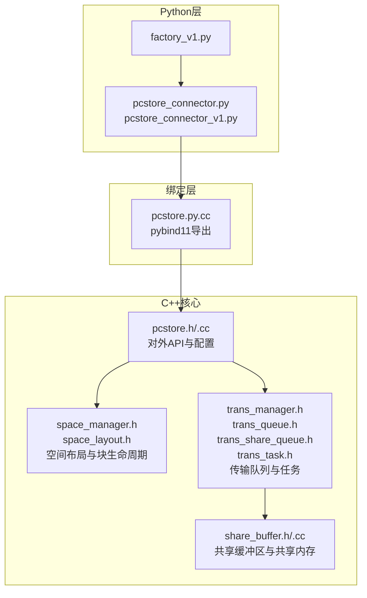
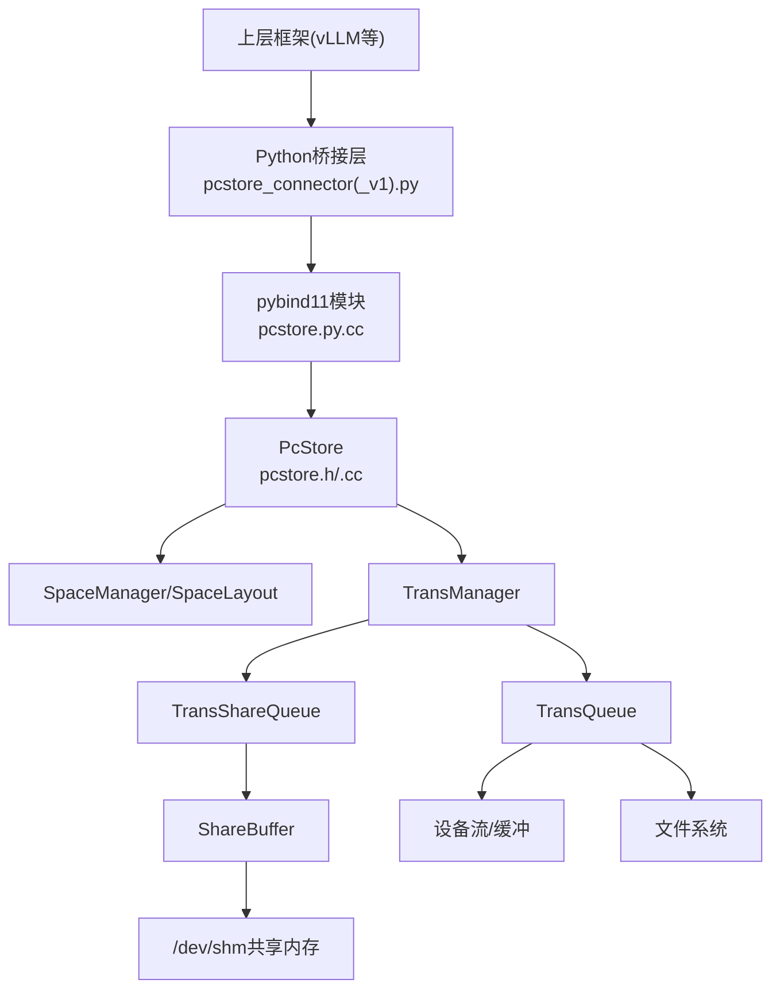
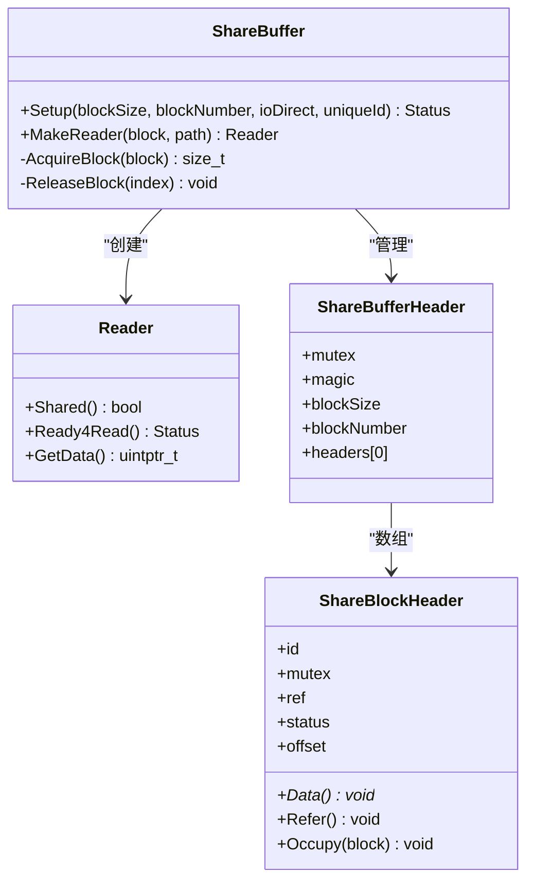
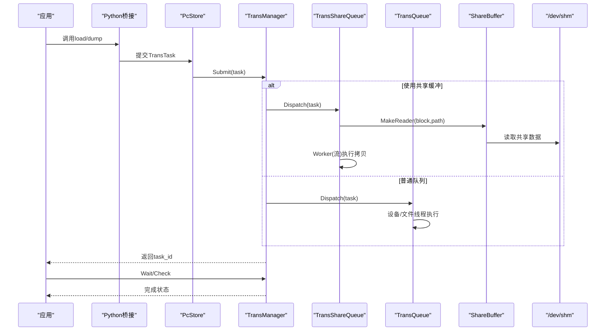
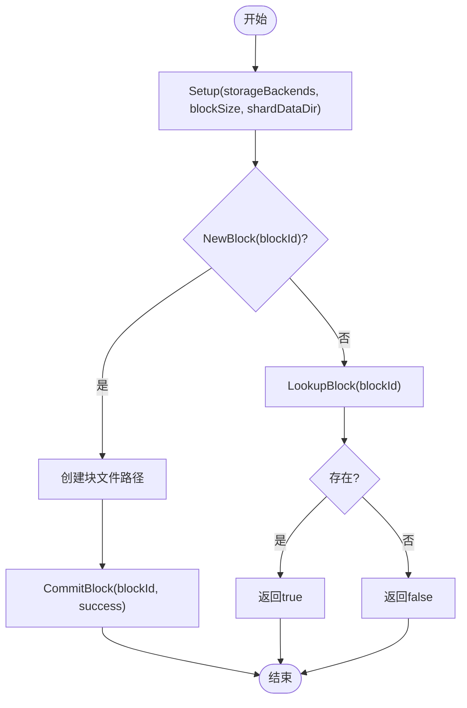
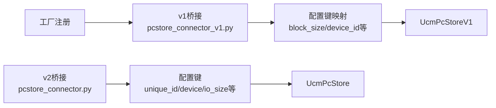
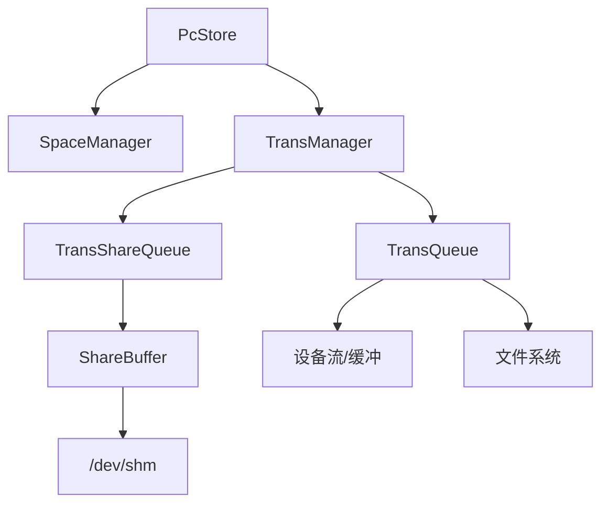

# PC存储

<cite>
**本文引用的文件**
- [pcstore.h](file://ucm/store/pcstore/cc/api/pcstore.h)
- [pcstore.cc](file://ucm/store/pcstore/cc/api/pcstore.cc)
- [share_buffer.h](file://ucm/store/pcstore/cc/domain/trans/share_buffer.h)
- [share_buffer.cc](file://ucm/store/pcstore/cc/domain/trans/share_buffer.cc)
- [trans_manager.h](file://ucm/store/pcstore/cc/domain/trans/trans_manager.h)
- [trans_queue.h](file://ucm/store/pcstore/cc/domain/trans/trans_queue.h)
- [trans_share_queue.h](file://ucm/store/pcstore/cc/domain/trans/trans_share_queue.h)
- [trans_task.h](file://ucm/store/pcstore/cc/domain/trans/trans_task.h)
- [space_manager.h](file://ucm/store/pcstore/cc/domain/space/space_manager.h)
- [space_layout.h](file://ucm/store/pcstore/cc/domain/space/space_layout.h)
- [pcstore_connector.py](file://ucm/store/pcstore/pcstore_connector.py)
- [pcstore_connector_v1.py](file://ucm/store/pcstore/pcstore_connector_v1.py)
- [pcstore.py.cc](file://ucm/store/pcstore/cpy/pcstore.py.cc)
- [CMakeLists.txt](file://ucm/store/pcstore/CMakeLists.txt)
- [pcstore_embed.py](file://ucm/store/test/e2e/pcstore_embed.py)
- [pcstore_fetch.py](file://ucm/store/test/e2e/pcstore_fetch.py)
- [pcstore_embed_v1.py](file://ucm/store/test/e2e/pcstore_embed_v1.py)
- [factory_v1.py](file://ucm/store/factory_v1.py)
</cite>

## 目录
1. [引言](#引言)
2. [项目结构](#项目结构)
3. [核心组件](#核心组件)
4. [架构总览](#架构总览)
5. [详细组件分析](#详细组件分析)
6. [依赖关系分析](#依赖关系分析)
7. [性能考量与优化建议](#性能考量与优化建议)
8. [故障排查指南](#故障排查指南)
9. [结论](#结论)
10. [附录：使用示例与配置参数](#附录使用示例与配置参数)

## 引言
本技术文档围绕UCM（Unified Cache Management）中的PC存储（PC Store）展开，系统性阐述其进程间共享存储的实现原理、共享内存管理与进程间通信机制、空间管理策略、传输队列与调度算法、版本演进（v1与v2差异及迁移）、配置参数与性能优化建议，并提供多进程场景下的应用优势与限制说明。

## 项目结构
PC存储位于ucm/store/pcstore目录下，采用“C++核心 + Python绑定 + Python桥接层”的分层设计：
- C++核心：api、domain（trans、space等子域）、infra（线程池、日志、模板工具）
- Python绑定：pybind11模块导出C++接口
- Python桥接层：面向上层框架（如vLLM）的高层封装
- 测试与示例：端到端用例验证功能与性能

图表来源
- [pcstore.h](file://ucm/store/pcstore/cc/api/pcstore.h#L32-L91)
- [pcstore.cc](file://ucm/store/pcstore/cc/api/pcstore.cc#L33-L108)
- [space_manager.h](file://ucm/store/pcstore/cc/domain/space/space_manager.h#L31-L43)
- [space_layout.h](file://ucm/store/pcstore/cc/domain/space/space_layout.h#L33-L53)
- [trans_manager.h](file://ucm/store/pcstore/cc/domain/trans/trans_manager.h#L32-L53)
- [trans_queue.h](file://ucm/store/pcstore/cc/domain/trans/trans_queue.h#L37-L73)
- [trans_share_queue.h](file://ucm/store/pcstore/cc/domain/trans/trans_share_queue.h#L40-L74)
- [trans_task.h](file://ucm/store/pcstore/cc/domain/trans/trans_task.h#L39-L85)
- [share_buffer.h](file://ucm/store/pcstore/cc/domain/trans/share_buffer.h#L36-L92)
- [share_buffer.cc](file://ucm/store/pcstore/cc/domain/trans/share_buffer.cc#L144-L154)
- [pcstore_connector.py](file://ucm/store/pcstore/pcstore_connector.py#L39-L114)
- [pcstore_connector_v1.py](file://ucm/store/pcstore/pcstore_connector_v1.py#L40-L247)
- [pcstore.py.cc](file://ucm/store/pcstore/cpy/pcstore.py.cc#L135-L172)

章节来源
- [CMakeLists.txt](file://ucm/store/pcstore/CMakeLists.txt#L1-L17)

## 核心组件
- 对外API与配置：PcStore类及其Config，负责初始化空间管理器与传输管理器，暴露块分配、查找、提交、传输提交/等待/检查等接口。
- 空间管理：SpaceManager与SpaceLayout负责后端存储路径、块文件路径生成、激活/临时目录组织、块生命周期管理。
- 传输管理：TransManager协调普通队列与共享队列；TransQueue处理设备侧与文件侧I/O；TransShareQueue通过共享缓冲区进行跨进程共享数据传输。
- 共享缓冲区：ShareBuffer管理共享内存块头、引用计数、状态机、块分配/释放与本地/共享读取器。
- 传输任务：TransTask定义任务类型（加载/转储）、分组聚合、统计耗时与带宽。

章节来源
- [pcstore.h](file://ucm/store/pcstore/cc/api/pcstore.h#L32-L91)
- [pcstore.cc](file://ucm/store/pcstore/cc/api/pcstore.cc#L33-L108)
- [space_manager.h](file://ucm/store/pcstore/cc/domain/space/space_manager.h#L31-L43)
- [space_layout.h](file://ucm/store/pcstore/cc/domain/space/space_layout.h#L33-L53)
- [trans_manager.h](file://ucm/store/pcstore/cc/domain/trans/trans_manager.h#L32-L53)
- [trans_queue.h](file://ucm/store/pcstore/cc/domain/trans/trans_queue.h#L37-L73)
- [trans_share_queue.h](file://ucm/store/pcstore/cc/domain/trans/trans_share_queue.h#L40-L74)
- [trans_task.h](file://ucm/store/pcstore/cc/domain/trans/trans_task.h#L39-L85)
- [share_buffer.h](file://ucm/store/pcstore/cc/domain/trans/share_buffer.h#L36-L92)
- [share_buffer.cc](file://ucm/store/pcstore/cc/domain/trans/share_buffer.cc#L144-L154)

## 架构总览
PC存储以“空间管理 + 传输管理”为核心，结合共享缓冲区实现跨进程共享与高效I/O：

图表来源
- [pcstore.h](file://ucm/store/pcstore/cc/api/pcstore.h#L32-L91)
- [pcstore.cc](file://ucm/store/pcstore/cc/api/pcstore.cc#L33-L108)
- [trans_manager.h](file://ucm/store/pcstore/cc/domain/trans/trans_manager.h#L32-L53)
- [trans_queue.h](file://ucm/store/pcstore/cc/domain/trans/trans_queue.h#L37-L73)
- [trans_share_queue.h](file://ucm/store/pcstore/cc/domain/trans/trans_share_queue.h#L40-L74)
- [share_buffer.h](file://ucm/store/pcstore/cc/domain/trans/share_buffer.h#L36-L92)
- [share_buffer.cc](file://ucm/store/pcstore/cc/domain/trans/share_buffer.cc#L144-L154)
- [pcstore_connector.py](file://ucm/store/pcstore/pcstore_connector.py#L39-L114)
- [pcstore_connector_v1.py](file://ucm/store/pcstore/pcstore_connector_v1.py#L40-L247)
- [pcstore.py.cc](file://ucm/store/pcstore/cpy/pcstore.py.cc#L135-L172)

## 详细组件分析

### 进程间共享存储与共享内存管理
- 共享缓冲区结构：ShareBufferHeader包含互斥锁、魔数、块大小与块数量，以及可变长的块头数组；每个块头包含块ID、互斥锁、引用计数、状态、偏移量等。
- 块状态机：INIT/LOADING/LOADED/FAILURE，用于跨进程同步块的准备与占用状态。
- 共享内存命名：统一前缀+唯一ID，便于清理与识别；支持清理过期共享内存文件。
- 读取器选择：根据块是否命中共享缓冲区，自动选择本地缓冲或共享缓冲读取路径。

图表来源
- [share_buffer.h](file://ucm/store/pcstore/cc/domain/trans/share_buffer.h#L36-L92)
- [share_buffer.cc](file://ucm/store/pcstore/cc/domain/trans/share_buffer.cc#L84-L112)

章节来源
- [share_buffer.h](file://ucm/store/pcstore/cc/domain/trans/share_buffer.h#L36-L92)
- [share_buffer.cc](file://ucm/store/pcstore/cc/domain/trans/share_buffer.cc#L144-L154)

### 传输队列与调度算法
- TransManager：持有共享队列与普通队列，维护任务映射与失败集合，提供提交、等待、检查接口。
- TransQueue：按块粒度分发任务，区分设备工作线程与文件工作线程；支持超时处理与散落聚合写（可选）。
- TransShareQueue：基于共享缓冲区的专用队列，内部有工作线程循环、条件变量与双列表（待处理/已就绪），按流并行执行。
- TransTask：任务携带类型、分组信息、起始时间戳，支持统计耗时与带宽。

图表来源
- [trans_manager.h](file://ucm/store/pcstore/cc/domain/trans/trans_manager.h#L32-L53)
- [trans_queue.h](file://ucm/store/pcstore/cc/domain/trans/trans_queue.h#L37-L73)
- [trans_share_queue.h](file://ucm/store/pcstore/cc/domain/trans/trans_share_queue.h#L40-L74)
- [trans_task.h](file://ucm/store/pcstore/cc/domain/trans/trans_task.h#L39-L85)
- [share_buffer.h](file://ucm/store/pcstore/cc/domain/trans/share_buffer.h#L36-L92)

章节来源
- [trans_manager.h](file://ucm/store/pcstore/cc/domain/trans/trans_manager.h#L32-L53)
- [trans_queue.h](file://ucm/store/pcstore/cc/domain/trans/trans_queue.h#L37-L73)
- [trans_share_queue.h](file://ucm/store/pcstore/cc/domain/trans/trans_share_queue.h#L40-L74)
- [trans_task.h](file://ucm/store/pcstore/cc/domain/trans/trans_task.h#L39-L85)

### 空间管理策略与块生命周期
- SpaceLayout：根据后端存储根路径与块ID生成数据文件路径，支持激活/临时目录分离与数据目录分片。
- SpaceManager：负责初始化布局、新块创建、块查找、提交（成功/失败）与布局查询。

图表来源
- [space_manager.h](file://ucm/store/pcstore/cc/domain/space/space_manager.h#L31-L43)
- [space_layout.h](file://ucm/store/pcstore/cc/domain/space/space_layout.h#L33-L53)

章节来源
- [space_manager.h](file://ucm/store/pcstore/cc/domain/space/space_manager.h#L31-L43)
- [space_layout.h](file://ucm/store/pcstore/cc/domain/space/space_layout.h#L33-L53)

### 版本演进：v1与v2差异与迁移
- v2（当前）：Python桥接层为pcstore_connector.py，配置字段更贴近现代部署（如unique_id、device、io_size等），支持直接从设备指针加载/转储。
- v1：Python桥接层为pcstore_connector_v1.py，配置键名映射到C++ Config属性，支持字节块ID与分片索引，提供load_data/dump_data低层接口。
- 工厂注册：v1通过工厂注册“UcmNfsStore”连接器，v2通过上层框架直接使用v2桥接。

图表来源
- [pcstore_connector_v1.py](file://ucm/store/pcstore/pcstore_connector_v1.py#L40-L67)
- [pcstore_connector.py](file://ucm/store/pcstore/pcstore_connector.py#L39-L61)
- [factory_v1.py](file://ucm/store/factory_v1.py#L60-L66)

章节来源
- [pcstore_connector_v1.py](file://ucm/store/pcstore/pcstore_connector_v1.py#L40-L67)
- [pcstore_connector.py](file://ucm/store/pcstore/pcstore_connector.py#L39-L61)
- [factory_v1.py](file://ucm/store/factory_v1.py#L60-L66)

## 依赖关系分析
- 组件耦合：PcStore依赖SpaceManager与TransManager；TransManager同时管理TransQueue与TransShareQueue；TransShareQueue依赖ShareBuffer；ShareBuffer依赖共享内存与设备缓冲。
- 外部依赖：pybind11模块导出C++接口；上层通过Python桥接层调用；日志与线程池等基础设施由共享库提供。

图表来源
- [pcstore.h](file://ucm/store/pcstore/cc/api/pcstore.h#L32-L91)
- [pcstore.cc](file://ucm/store/pcstore/cc/api/pcstore.cc#L33-L108)
- [trans_manager.h](file://ucm/store/pcstore/cc/domain/trans/trans_manager.h#L32-L53)
- [trans_queue.h](file://ucm/store/pcstore/cc/domain/trans/trans_queue.h#L37-L73)
- [trans_share_queue.h](file://ucm/store/pcstore/cc/domain/trans/trans_share_queue.h#L40-L74)
- [share_buffer.h](file://ucm/store/pcstore/cc/domain/trans/share_buffer.h#L36-L92)

## 性能考量与优化建议
- 共享内存大小与块数量：根据GPU显存与块大小合理设置blockNumber，避免频繁分配/回收导致抖动。
- 并发访问控制：通过ShareBlockHeader的互斥锁与引用计数保障并发安全；合理设置transferStreamNumber提升并行度。
- I/O直通与缓冲：transferIoDirect开启可减少内核页缓存开销；transferBufferNumber应与GPU块数量匹配，避免阻塞。
- 散落聚合：在大块写入场景启用transferScatterGatherEnable可提升吞吐。
- 队列深度与超时：根据负载调整等待/运行队列深度与transferTimeoutMs，平衡延迟与资源占用。
- 日志与监控：通过UC_LOGGER_LEVEL观察调试信息，定位瓶颈。

章节来源
- [pcstore.h](file://ucm/store/pcstore/cc/api/pcstore.h#L34-L56)
- [pcstore.cc](file://ucm/store/pcstore/cc/api/pcstore.cc#L86-L103)
- [trans_share_queue.h](file://ucm/store/pcstore/cc/domain/trans/trans_share_queue.h#L62-L74)
- [trans_queue.h](file://ucm/store/pcstore/cc/domain/trans/trans_queue.h#L52-L73)

## 故障排查指南
- 初始化失败：检查uniqueId、device、io_size等配置是否正确；查看日志输出的配置项。
- 传输超时：增大transferTimeoutMs或减少单次任务的数据量；确认设备流与缓冲池充足。
- 共享内存异常：确认/dev/shm可用且权限正确；检查CleanUpShmFileExceptMe逻辑是否清理了过期文件。
- 任务未完成：使用Check轮询，Wait阻塞等待；若长时间无进展，检查设备驱动与磁盘IO。

章节来源
- [pcstore.cc](file://ucm/store/pcstore/cc/api/pcstore.cc#L86-L103)
- [share_buffer.cc](file://ucm/store/pcstore/cc/domain/trans/share_buffer.cc#L120-L142)
- [trans_manager.h](file://ucm/store/pcstore/cc/domain/trans/trans_manager.h#L38-L40)

## 结论
PC存储通过“空间管理 + 传输管理 + 共享缓冲区”的组合，在多进程环境下实现了高效的KV缓存块管理与跨进程共享。v2版本在易用性与配置灵活性方面显著提升，适合现代推理部署；v1版本保留了对历史接口的兼容。通过合理的配置与调优，可在高并发场景下获得稳定的吞吐与低延迟表现。

## 附录：使用示例与配置参数

### 使用示例
- v2嵌入与回放：参考端到端示例，展示创建块、转储到设备、查找与加载回设备的完整流程。
- v1嵌入与回放：展示基于字节块ID与分片索引的加载/转储流程。
- 回放脚本：从持久化哈希列表中随机抽取批次进行加载，验证数据一致性。

章节来源
- [pcstore_embed.py](file://ucm/store/test/e2e/pcstore_embed.py#L65-L103)
- [pcstore_fetch.py](file://ucm/store/test/e2e/pcstore_fetch.py#L75-L93)
- [pcstore_embed_v1.py](file://ucm/store/test/e2e/pcstore_embed_v1.py#L64-L87)

### 配置参数与迁移指南
- v2（pcstore_connector.py）关键参数
  - storage_backends：后端存储路径列表
  - kv_block_size：块大小
  - role：worker启用传输
  - unique_id：共享内存唯一标识
  - device：目标设备ID
  - io_size：单次传输字节数
  - use_direct：是否启用直通I/O
  - stream_number：传输流数量
  - buffer_number：主机固定缓冲数量
  - local_rank_size：本地rank大小
  - use_scatter_gatter：是否启用散落聚合
- v1（pcstore_connector_v1.py）关键参数
  - storage_backends：后端存储路径列表
  - block_size：块大小
  - device_id：设备ID
  - tensor_size：单次传输字节数
  - unique_id：共享内存唯一标识
  - shard_data_dir：是否分片数据目录
  - 其他与v2映射字段一致

章节来源
- [pcstore_connector.py](file://ucm/store/pcstore/pcstore_connector.py#L40-L61)
- [pcstore_connector_v1.py](file://ucm/store/pcstore/pcstore_connector_v1.py#L40-L67)
- [pcstore.py.cc](file://ucm/store/pcstore/cpy/pcstore.py.cc#L143-L158)