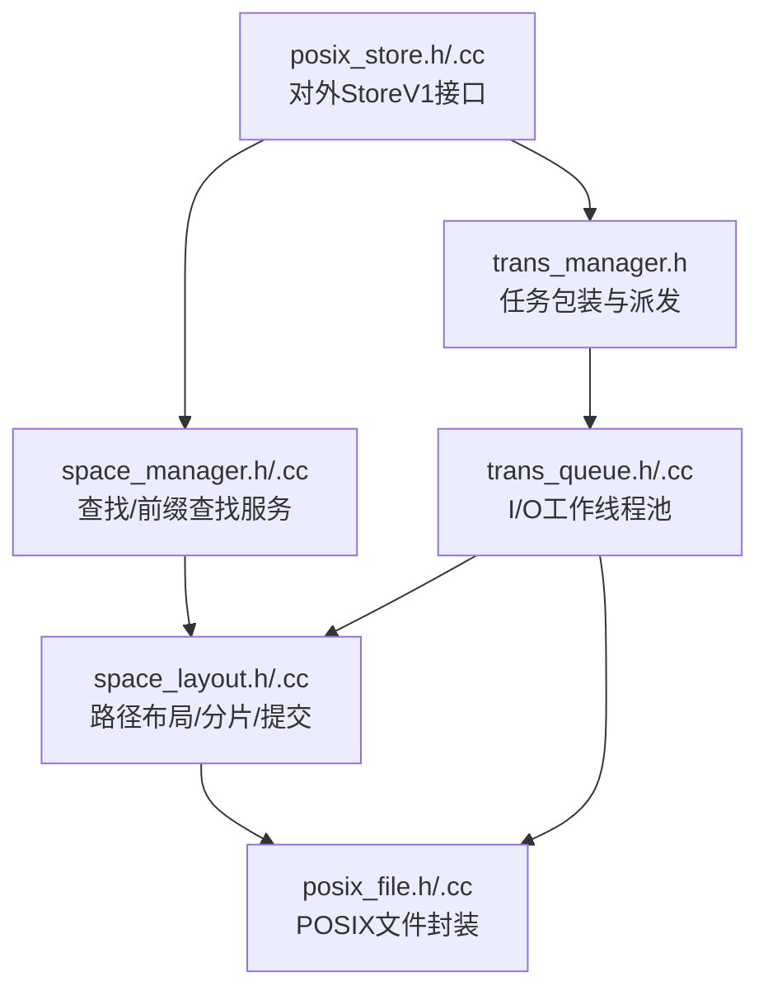
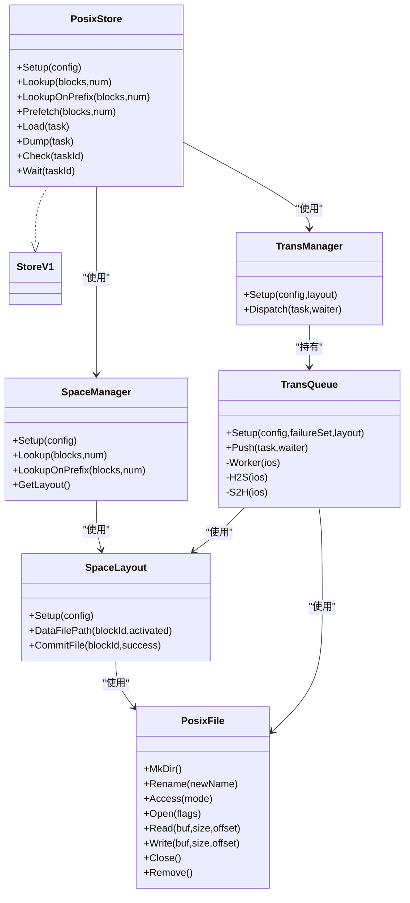
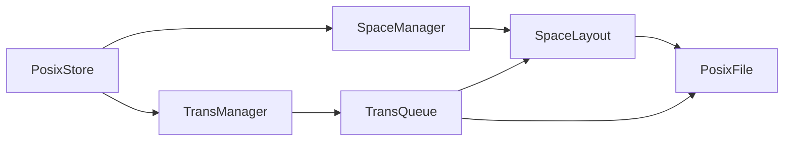
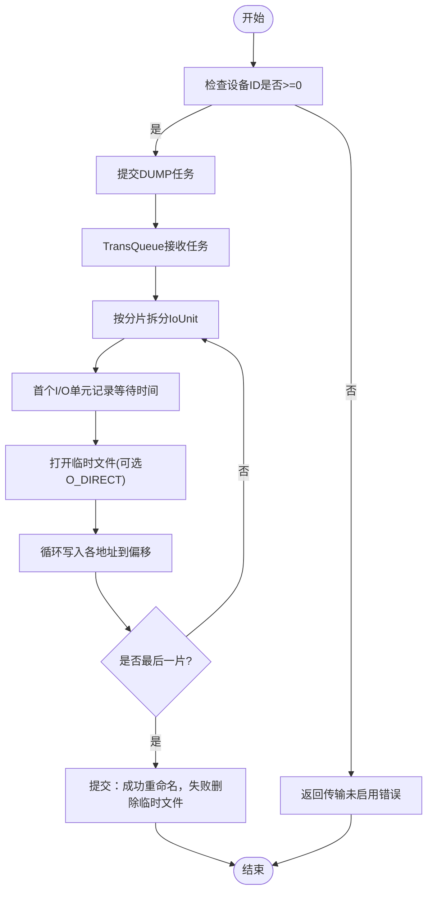

# POSIX存储

<cite>
**本文引用的文件**
- [posix_store.h](file://ucm/store/posix/cc/posix_store.h)
- [posix_store.cc](file://ucm/store/posix/cc/posix_store.cc)
- [posix_file.h](file://ucm/store/posix/cc/posix_file.h)
- [posix_file.cc](file://ucm/store/posix/cc/posix_file.cc)
- [space_manager.h](file://ucm/store/posix/cc/space_manager.h)
- [space_manager.cc](file://ucm/store/posix/cc/space_manager.cc)
- [space_layout.h](file://ucm/store/posix/cc/space_layout.h)
- [space_layout.cc](file://ucm/store/posix/cc/space_layout.cc)
- [trans_manager.h](file://ucm/store/posix/cc/trans_manager.h)
- [trans_queue.h](file://ucm/store/posix/cc/trans_queue.h)
- [trans_queue.cc](file://ucm/store/posix/cc/trans_queue.cc)
- [trans_task.h](file://ucm/store/posix/cc/trans_task.h)
- [global_config.h](file://ucm/store/posix/cc/global_config.h)
- [ucm_config_example.yaml](file://examples/ucm_config_example.yaml)
- [config.properties](file://examples/deployments/scripts/vllm/config.properties)
</cite>

## 目录
1. [简介](#简介)
2. [项目结构](#项目结构)
3. [核心组件](#核心组件)
4. [架构总览](#架构总览)
5. [组件详解](#组件详解)
6. [依赖关系分析](#依赖关系分析)
7. [性能与调优](#性能与调优)
8. [故障排除](#故障排除)
9. [结论](#结论)
10. [附录](#附录)

## 简介
本文件面向UCM（统一缓存管理）中的POSIX存储子系统，提供从接口设计到实现细节、空间布局与分配策略、文件操作封装与优化、配置参数与性能调优、部署示例与使用场景、以及故障排除与监控的完整技术文档。POSIX存储通过本地文件系统提供KV缓存块的持久化与传输能力，支持多后端目录、分片/块粒度的数据组织、异步I/O队列与并发控制，并提供查找、预取、加载、转储等统一接口。

## 项目结构
POSIX存储位于ucm/store/posix/cc目录下，采用“接口类 + 实现类 + 空间布局 + 传输队列”的分层设计，配合全局配置与工具线程池，形成可扩展、可并发、可监控的本地文件系统存储实现。

图表来源
- [posix_store.h](file://ucm/store/posix/cc/posix_store.h#L33-L48)
- [posix_store.cc](file://ucm/store/posix/cc/posix_store.cc#L32-L55)
- [space_manager.h](file://ucm/store/posix/cc/space_manager.h#L34-L57)
- [space_manager.cc](file://ucm/store/posix/cc/space_manager.cc#L30-L42)
- [trans_manager.h](file://ucm/store/posix/cc/trans_manager.h#L33-L61)
- [trans_queue.h](file://ucm/store/posix/cc/trans_queue.h#L36-L65)
- [trans_queue.cc](file://ucm/store/posix/cc/trans_queue.cc#L30-L45)
- [space_layout.h](file://ucm/store/posix/cc/space_layout.h#L33-L53)
- [space_layout.cc](file://ucm/store/posix/cc/space_layout.cc#L59-L68)
- [posix_file.h](file://ucm/store/posix/cc/posix_file.h#L32-L67)
- [posix_file.cc](file://ucm/store/posix/cc/posix_file.cc#L33-L90)

章节来源
- [posix_store.h](file://ucm/store/posix/cc/posix_store.h#L33-L48)
- [posix_store.cc](file://ucm/store/posix/cc/posix_store.cc#L103-L123)
- [global_config.h](file://ucm/store/posix/cc/global_config.h#L32-L43)

## 核心组件
- 对外StoreV1接口：提供Setup、Lookup、LookupOnPrefix、Prefetch、Load、Dump、Check、Wait等方法，屏蔽内部实现细节。
- 空间管理SpaceManager：负责块级查找与前缀查找，基于线程池并发执行，支持超时回调。
- 空间布局SpaceLayout：定义多后端目录、分片目录、文件命名与提交流程。
- 传输管理TransManager与传输队列TransQueue：将任务拆分为分片I/O单元，按设备/分片大小调度，支持直通I/O与失败集。
- POSIX文件封装PosixFile：统一封装mkdir/rename/access/open/read/write/close/remove等系统调用，返回统一状态码。

章节来源
- [posix_store.h](file://ucm/store/posix/cc/posix_store.h#L33-L48)
- [posix_store.cc](file://ucm/store/posix/cc/posix_store.cc#L127-L176)
- [space_manager.h](file://ucm/store/posix/cc/space_manager.h#L34-L57)
- [space_layout.h](file://ucm/store/posix/cc/space_layout.h#L33-L53)
- [trans_manager.h](file://ucm/store/posix/cc/trans_manager.h#L33-L61)
- [trans_queue.h](file://ucm/store/posix/cc/trans_queue.h#L36-L65)
- [posix_file.h](file://ucm/store/posix/cc/posix_file.h#L32-L67)

## 架构总览
POSIX存储以StoreV1为入口，内部由SpaceManager负责查找，TransManager/TransQueue负责数据传输，SpaceLayout负责文件系统布局，PosixFile封装底层文件操作。整体采用“查找并发 + 传输并发 + 布局解耦”的设计，便于扩展与调优。

图表来源
- [posix_store.h](file://ucm/store/posix/cc/posix_store.h#L33-L48)
- [posix_store.cc](file://ucm/store/posix/cc/posix_store.cc#L32-L55)
- [space_manager.h](file://ucm/store/posix/cc/space_manager.h#L34-L57)
- [trans_manager.h](file://ucm/store/posix/cc/trans_manager.h#L33-L61)
- [trans_queue.h](file://ucm/store/posix/cc/trans_queue.h#L36-L65)
- [trans_queue.cc](file://ucm/store/posix/cc/trans_queue.cc#L58-L79)
- [space_layout.h](file://ucm/store/posix/cc/space_layout.h#L33-L53)
- [posix_file.h](file://ucm/store/posix/cc/posix_file.h#L32-L67)

## 组件详解

### 接口与实现：PosixStore
- Setup：解析配置字典，校验参数，初始化SpaceManager；当deviceId>=0时启用传输路径，初始化TransManager。
- Lookup/LookupOnPrefix：委托SpaceManager执行块查找与前缀匹配。
- Load/Dump：仅在传输启用时有效，提交任务至TransManager。
- Check/Wait：查询与等待传输任务完成。

章节来源
- [posix_store.cc](file://ucm/store/posix/cc/posix_store.cc#L103-L123)
- [posix_store.cc](file://ucm/store/posix/cc/posix_store.cc#L127-L176)
- [global_config.h](file://ucm/store/posix/cc/global_config.h#L32-L43)

### 文件系统布局与空间管理：SpaceLayout
- 多后端目录：支持多个存储根目录，首次添加会创建相对根目录（如data），后续添加需验证读写权限。
- 分片目录：根据data_dir_shard_bytes截取文件名前缀作为子目录，降低单目录文件数量。
- 文件命名：块ID经十六进制拼接生成文件名；临时文件带“.tmp”后缀，成功后重命名为正式文件。
- 提交流程：DUMP成功则将临时文件重命名为正式文件，失败或错误则删除临时文件。

章节来源
- [space_layout.cc](file://ucm/store/posix/cc/space_layout.cc#L59-L68)
- [space_layout.cc](file://ucm/store/posix/cc/space_layout.cc#L70-L89)
- [space_layout.cc](file://ucm/store/posix/cc/space_layout.cc#L91-L145)

### 查找服务：SpaceManager
- Lookup：并发执行每个块的存在性检查，使用线程池与计数门闩聚合结果，支持超时回调。
- LookupOnPrefix：按顺序检查块序列，返回最后一个存在的索引。
- 超时处理：超时回调将状态置为超时并通知等待者。

章节来源
- [space_manager.cc](file://ucm/store/posix/cc/space_manager.cc#L30-L42)
- [space_manager.cc](file://ucm/store/posix/cc/space_manager.cc#L44-L71)
- [space_manager.cc](file://ucm/store/posix/cc/space_manager.cc#L87-L100)

### 传输队列与任务：TransManager/TransQueue/TransTask
- 任务类型：LOAD/DUMP两类，任务描述包含分片序列。
- 传输拆分：按blockSize/shardSize拆分为多个IoUnit，逐个I/O单元执行。
- H2S（主机到存储）：打开临时文件，按分片偏移写入，最后提交。
- S2H（存储到主机）：打开正式文件，按分片偏移读取。
- 直通I/O：可通过ioDirect开启O_DIRECT，减少内核页缓存拷贝。
- 失败集：任一分片失败将记录任务ID，避免重复执行。

章节来源
- [trans_task.h](file://ucm/store/posix/cc/trans_task.h#L32-L48)
- [trans_manager.h](file://ucm/store/posix/cc/trans_manager.h#L33-L61)
- [trans_queue.cc](file://ucm/store/posix/cc/trans_queue.cc#L30-L45)
- [trans_queue.cc](file://ucm/store/posix/cc/trans_queue.cc#L47-L79)
- [trans_queue.cc](file://ucm/store/posix/cc/trans_queue.cc#L81-L125)

### 文件操作封装：PosixFile
- 目录与文件：MkDir/RmDir/Rename/Access/Open/Read/Write/Close/Remove。
- 权限与标志：新建文件/目录默认权限，支持只读/只写/读写、O_CREAT/O_DIRECT/O_APPEND/O_EXCL等标志。
- 错误映射：将errno映射为统一状态码，区分重复键、未找到、系统错误等。

章节来源
- [posix_file.h](file://ucm/store/posix/cc/posix_file.h#L32-L67)
- [posix_file.cc](file://ucm/store/posix/cc/posix_file.cc#L38-L98)
- [posix_file.cc](file://ucm/store/posix/cc/posix_file.cc#L100-L128)

### 配置参数与约束
- 存储后端：storage_backends（必填）
- 设备ID：deviceId（-1表示禁用传输，>=0启用传输）
- 尺寸参数：tensor_size、shard_size、block_size（存在整除与大小关系约束）
- I/O参数：io_direct、posix_data_trans_concurrency、posix_lookup_concurrency、timeout_ms
- 目录分片：data_dir_shard_bytes（>0启用按文件名前缀分片）

章节来源
- [global_config.h](file://ucm/store/posix/cc/global_config.h#L32-L43)
- [posix_store.cc](file://ucm/store/posix/cc/posix_store.cc#L58-L81)

## 依赖关系分析
- 组件耦合：PosixStore依赖SpaceManager与TransManager；SpaceManager依赖SpaceLayout；TransManager/TransQueue依赖SpaceLayout与PosixFile；SpaceLayout依赖PosixFile。
- 并发模型：SpaceManager与TransQueue均使用线程池，分别承担查找并发与I/O并发。
- 外部依赖：POSIX系统调用（open/mkdir/rename/access/pread/pwrite等）、fmt格式化库、日志模块。

图表来源
- [posix_store.cc](file://ucm/store/posix/cc/posix_store.cc#L32-L55)
- [space_manager.h](file://ucm/store/posix/cc/space_manager.h#L34-L57)
- [trans_manager.h](file://ucm/store/posix/cc/trans_manager.h#L33-L61)
- [trans_queue.h](file://ucm/store/posix/cc/trans_queue.h#L36-L65)
- [space_layout.h](file://ucm/store/posix/cc/space_layout.h#L33-L53)
- [posix_file.h](file://ucm/store/posix/cc/posix_file.h#L32-L67)

## 性能与调优
- I/O调度与并发
  - posix_data_trans_concurrency：传输并发数，建议与磁盘并行度、CPU核心数匹配。
  - posix_lookup_concurrency：查找并发数，建议与CPU核心数匹配。
  - timeout_ms：查找与传输超时时间，建议结合网络/磁盘延迟设置。
- 直通I/O
  - io_direct：启用O_DIRECT可减少页缓存拷贝，适合大块顺序I/O；需确保对齐与缓冲区管理。
- 空间布局
  - data_dir_shard_bytes：增大可降低单目录文件数，改善目录遍历性能；但需平衡目录层级深度。
- 尺寸参数
  - tensor_size、shard_size、block_size应满足整除关系，避免碎片化与额外拷贝。
- 缓存策略
  - 利用系统页缓存与内核文件系统缓存；对于频繁访问的热点数据，可结合热力管理（见其他store模块）提升命中率。
- 监控与观测
  - 使用日志级别与调试信息观察任务派发、等待、完成耗时，定位瓶颈。

章节来源
- [global_config.h](file://ucm/store/posix/cc/global_config.h#L32-L43)
- [trans_queue.cc](file://ucm/store/posix/cc/trans_queue.cc#L30-L45)
- [space_layout.cc](file://ucm/store/posix/cc/space_layout.cc#L59-L68)

## 故障排除
- 配置错误
  - 检查storage_backends是否为空；deviceId、并发参数是否为正；尺寸参数是否满足整除关系。
- 传输未启用
  - 当deviceId=-1时，Load/Dump将返回错误；请设置deviceId>=0以启用传输。
- 文件系统问题
  - 目录创建失败、权限不足、文件不存在等，均会映射为具体状态码；检查后端路径权限与可用空间。
- 超时与失败
  - 查找/传输超时会触发超时回调；传输失败会被加入失败集，避免重复执行。
- 日志定位
  - 关注“Posix task(...) finished, cost ...ms.”等调试日志，评估I/O耗时与并发效果。

章节来源
- [posix_store.cc](file://ucm/store/posix/cc/posix_store.cc#L58-L81)
- [posix_store.cc](file://ucm/store/posix/cc/posix_store.cc#L144-L176)
- [space_manager.cc](file://ucm/store/posix/cc/space_manager.cc#L87-L100)
- [trans_queue.cc](file://ucm/store/posix/cc/trans_queue.cc#L58-L79)

## 结论
POSIX存储通过清晰的分层与并发设计，在本地文件系统上提供了稳定、可扩展的KV缓存块持久化与传输能力。其多后端目录、分片布局与直通I/O选项，使其在简单部署环境中具备良好的易用性与性能潜力；同时，完善的配置参数与可观测性为生产环境的调优与运维提供了坚实基础。

## 附录

### 部署配置示例
- UCM配置示例：参考示例YAML文件，设置存储后端、并发、超时、分片等参数。
- vLLM集成示例：通过环境变量与配置文件启用UCM并指定配置路径。

章节来源
- [ucm_config_example.yaml](file://examples/ucm_config_example.yaml)
- [config.properties](file://examples/deployments/scripts/vllm/config.properties#L84-L92)

### 使用场景分析
- 简单部署环境
  - 优点：无需外部分布式存储，部署成本低，易于维护；适合单机或小规模集群。
  - 局限：单点故障风险、扩展性受限、跨节点共享困难。
- 生产环境
  - 建议：结合多后端目录、分片目录、直通I/O与合理的并发参数，配合监控与告警，持续优化性能。

### 关键流程图：DUMP（主机到存储）提交流程

图表来源
- [posix_store.cc](file://ucm/store/posix/cc/posix_store.cc#L144-L162)
- [trans_queue.cc](file://ucm/store/posix/cc/trans_queue.cc#L47-L79)
- [trans_queue.cc](file://ucm/store/posix/cc/trans_queue.cc#L81-L102)
- [space_layout.cc](file://ucm/store/posix/cc/space_layout.cc#L79-L89)