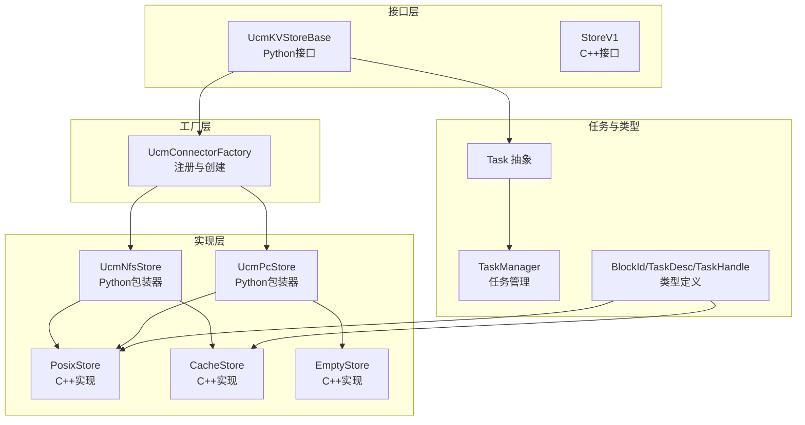
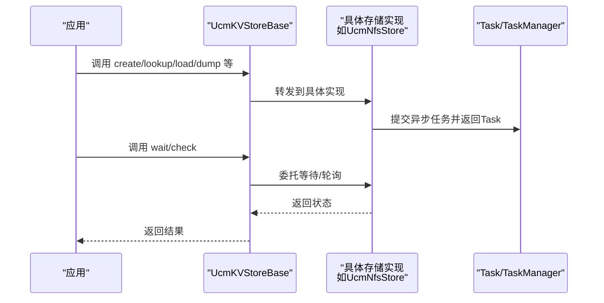
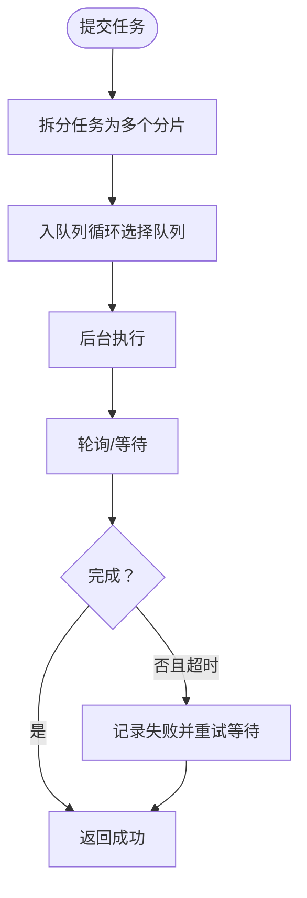
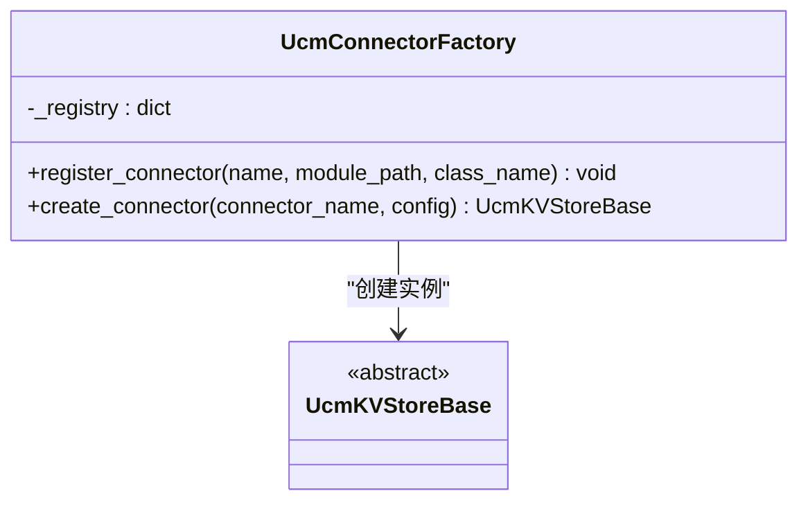
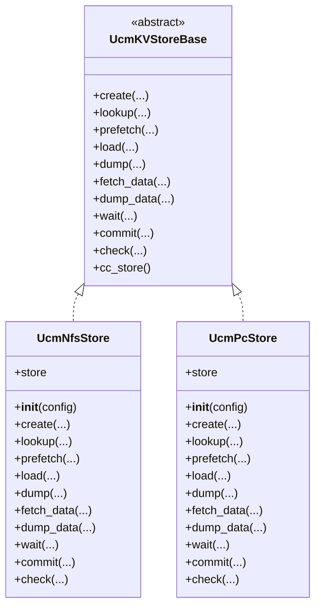
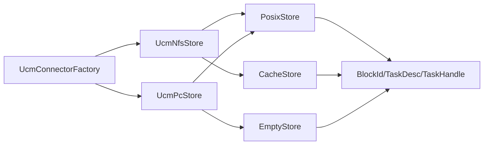

# 存储抽象层

<cite>
**本文引用的文件**
- [ucm/store/ucmstore.py](file://ucm/store/ucmstore.py)
- [ucm/store/ucmstore.h](file://ucm/store/ucmstore.h)
- [ucm/store/ucmstore_v1.h](file://ucm/store/ucmstore_v1.h)
- [ucm/store/factory.py](file://ucm/store/factory.py)
- [ucm/store/nfsstore/nfsstore_connector.py](file://ucm/store/nfsstore/nfsstore_connector.py)
- [ucm/store/pcstore/pcstore_connector.py](file://ucm/store/pcstore/pcstore_connector.py)
- [ucm/store/detail/task/task_manager.h](file://ucm/store/detail/task/task_manager.h)
- [ucm/store/detail/type/types.h](file://ucm/store/detail/type/types.h)
- [ucm/store/detail/template/store_binder.h](file://ucm/store/detail/template/store_binder.h)
- [ucm/store/posix/cc/posix_store.h](file://ucm/store/posix/cc/posix_store.h)
- [ucm/store/cache/cc/cache_store.h](file://ucm/store/cache/cc/cache_store.h)
- [ucm/store/empty/cc/empty_store.cc](file://ucm/store/empty/cc/empty_store.cc)
- [ucm/store/test/e2e/nfsstore_embed.py](file://ucm/store/test/e2e/nfsstore_embed.py)
- [ucm/store/test/e2e/posixstore_embed.py](file://ucm/store/test/e2e/posixstore_embed.py)
- [docs/source/developer-guide/extending_store.md](file://docs/source/developer-guide/extending_store.md)
</cite>

## 目录
1. [简介](#简介)
2. [项目结构](#项目结构)
3. [核心组件](#核心组件)
4. [架构总览](#架构总览)
5. [详细组件分析](#详细组件分析)
6. [依赖关系分析](#依赖关系分析)
7. [性能考量](#性能考量)
8. [故障排查指南](#故障排查指南)
9. [结论](#结论)
10. [附录：扩展开发与最佳实践](#附录扩展开发与最佳实践)

## 简介
本文件系统性阐述UCM存储抽象层的设计与实现，覆盖以下主题：
- UcmKVStoreBase抽象接口的设计理念与关键方法语义（create、lookup、prefetch、load、dump、fetch_data、dump_data、wait、commit、check）。
- 异步任务模型与Task抽象类的职责边界。
- 存储工厂模式的注册与实例化流程。
- 多种内置存储实现（NFS、PC、Posix、Cache、Empty）的差异与适用场景。
- 扩展开发指导与接口使用示例，帮助开发者快速实现自定义存储后端。

## 项目结构
存储抽象层位于ucm/store目录下，采用“接口层 + 工厂 + 具体实现 + 任务与类型定义”的分层组织：
- 接口层：Python侧UcmKVStoreBase与C++侧StoreV1，分别面向高层业务与底层高性能实现。
- 工厂层：UcmConnectorFactory基于名称注册并延迟加载具体存储类。
- 实现层：NFSStore、PcStore等Python包装器对接底层C++实现；Posix、Cache、Empty等C++实现作为高性能后端。
- 任务与类型：Task抽象、TaskManager管理、TaskDesc/BlockId等类型定义。

图表来源
- [ucm/store/ucmstore.py](file://ucm/store/ucmstore.py#L39-L205)
- [ucm/store/ucmstore_v1.h](file://ucm/store/ucmstore_v1.h#L40-L157)
- [ucm/store/factory.py](file://ucm/store/factory.py#L34-L71)
- [ucm/store/nfsstore/nfsstore_connector.py](file://ucm/store/nfsstore/nfsstore_connector.py#L39-L132)
- [ucm/store/pcstore/pcstore_connector.py](file://ucm/store/pcstore/pcstore_connector.py#L39-L115)
- [ucm/store/posix/cc/posix_store.h](file://ucm/store/posix/cc/posix_store.h#L33-L48)
- [ucm/store/cache/cc/cache_store.h](file://ucm/store/cache/cc/cache_store.h#L33-L48)
- [ucm/store/detail/task/task_manager.h](file://ucm/store/detail/task/task_manager.h#L34-L117)
- [ucm/store/detail/type/types.h](file://ucm/store/detail/type/types.h#L33-L65)

章节来源
- [ucm/store/ucmstore.py](file://ucm/store/ucmstore.py#L39-L205)
- [ucm/store/ucmstore_v1.h](file://ucm/store/ucmstore_v1.h#L40-L157)
- [ucm/store/factory.py](file://ucm/store/factory.py#L34-L71)

## 核心组件
本节聚焦存储抽象层的关键接口与职责划分。

- UcmKVStoreBase（Python）
  - 设计目标：为KV Cache为中心的推理系统提供统一的存储能力抽象，屏蔽底层介质差异。
  - 关键方法
    - create：批量分配块空间，返回每个块的分配结果码。
    - lookup：批量查询块是否存在，返回命中掩码。
    - prefetch：提示预取到高速缓存（可选实现）。
    - load/dump：从设备到存储或反向的异步传输，返回Task句柄。
    - fetch_data/dump_data：低级数据搬运（直接地址/大小），返回Task句柄。
    - wait/check：阻塞等待或非阻塞轮询任务完成。
    - commit：提交块，释放占用或保留以复用。
    - cc_store：返回底层C/C++实现指针（用于桥接）。
  - 设计要点：方法签名明确参数与返回值，错误通过返回码或异常表达；支持多卡偏移offset以适配tp>1场景。

- StoreV1（C++）
  - 设计目标：高性能、线程安全的异步KV缓存存储接口，面向C++实现与绑定。
  - 关键方法
    - Setup/Readme：初始化与描述信息。
    - Lookup/LookupOnPrefix：存在性检查与前缀匹配索引。
    - Prefetch：预取提示。
    - Load/Dump：异步任务提交，返回TaskHandle。
    - Check/Wait：非阻塞轮询与阻塞等待。
  - 设计要点：所有公共方法线程安全；Expected/Status约定错误传播；TaskDesc/Shard描述分片任务。

- Task与TaskManager
  - Task：抽象任务载体，Python侧由具体存储实现返回（如NfsTask）。
  - TaskManager：负责任务提交、等待、轮询、超时与失败集合管理，保证并发安全。

- 类型定义
  - BlockId：16字节块哈希。
  - TaskHandle：不透明任务令牌。
  - Shard/TaskDesc：描述单块内分片与批量任务。

章节来源
- [ucm/store/ucmstore.py](file://ucm/store/ucmstore.py#L39-L205)
- [ucm/store/ucmstore_v1.h](file://ucm/store/ucmstore_v1.h#L40-L157)
- [ucm/store/detail/task/task_manager.h](file://ucm/store/detail/task/task_manager.h#L34-L117)
- [ucm/store/detail/type/types.h](file://ucm/store/detail/type/types.h#L33-L65)

## 架构总览
存储抽象层采用“Python接口 + C++接口 + 工厂注册 + 多实现”的架构，既满足易扩展（Python包装器），也满足高性能（C++实现）。典型调用链如下：

图表来源
- [ucm/store/ucmstore.py](file://ucm/store/ucmstore.py#L39-L205)
- [ucm/store/nfsstore/nfsstore_connector.py](file://ucm/store/nfsstore/nfsstore_connector.py#L39-L132)
- [ucm/store/pcstore/pcstore_connector.py](file://ucm/store/pcstore/pcstore_connector.py#L39-L115)
- [ucm/store/detail/task/task_manager.h](file://ucm/store/detail/task/task_manager.h#L42-L108)

## 详细组件分析

### UcmKVStoreBase 接口详解
- 设计理念
  - 面向KV Cache推理场景，提供“块”粒度的生命周期管理与数据传输抽象。
  - 将“空间管理、持久化、分层传输、数据处理”解耦到具体实现，接口层只暴露必要契约。
- 方法语义与实现要求
  - create/lookup：幂等、可重入；create需返回每个块的分配结果码；lookup返回布尔掩码。
  - prefetch：可选实现，允许忽略；线程安全。
  - load/dump/fetch_data/dump_data：返回Task；内部应将Tensor/指针转换为底层期望格式；offset支持tp>1。
  - wait/check：wait应阻塞直到完成；check应非阻塞轮询；两者均需处理失败与超时。
  - commit：根据is_success决定是否释放或保留块。
  - cc_store：返回底层C/C++ Store指针，便于桥接。
- 错误处理
  - 返回码与异常并用；上层统一收敛为标准错误码或异常。

章节来源
- [ucm/store/ucmstore.py](file://ucm/store/ucmstore.py#L39-L205)

### 异步任务处理机制
- Task抽象
  - Python侧通过dataclass封装task_id，作为上层wait/check的输入。
- TaskManager
  - Submit：生成Task与Waiter，拆分为多个分片并入队列。
  - Wait：阻塞等待，超时记录到失败集合，最终返回状态。
  - Check：非阻塞查询完成状态。
- 并发与资源
  - 使用互斥锁保护任务表；支持超时与失败集合管理；线程安全。

图表来源
- [ucm/store/detail/task/task_manager.h](file://ucm/store/detail/task/task_manager.h#L42-L108)

章节来源
- [ucm/store/detail/task/task_manager.h](file://ucm/store/detail/task/task_manager.h#L34-L117)

### 存储工厂模式与注册机制
- UcmConnectorFactory
  - 注册：register_connector(name, module_path, class_name)，保存惰性加载器。
  - 创建：create_connector根据名称查找并动态导入模块，实例化类并校验继承关系。
- 内置注册
  - 已注册：UcmNfsStore、UcmPcStore、UcmMooncakeStore等。
- 使用建议
  - 在应用启动阶段完成注册；确保模块路径与类名正确；避免重复注册。

图表来源
- [ucm/store/factory.py](file://ucm/store/factory.py#L34-L71)

章节来源
- [ucm/store/factory.py](file://ucm/store/factory.py#L34-L71)

### 具体存储实现与对比
- NFSStore（Python包装器）
  - 通过NFSStore.Config配置存储后端、块大小、传输参数等；在worker角色启用传输。
  - 提供create/lookup/prefetch/load/dump/fetch_data/dump_data/wait/commit/check等方法。
  - 适用于网络文件系统场景，具备热力感知与回收策略等高级特性。
- PcStore（Python包装器）
  - 针对特定硬件/网络拓扑优化，支持scatter-gather、本地rank size等参数。
  - 与NFSStore类似的方法族，但底层实现不同。
- PosixStore/CacheStore/EmptyStore（C++实现）
  - PosixStore：基于POSIX文件系统的高性能实现。
  - CacheStore：带缓存的高性能实现，适合高并发读写。
  - EmptyStore：空实现，用于占位或测试。

图表来源
- [ucm/store/ucmstore.py](file://ucm/store/ucmstore.py#L39-L205)
- [ucm/store/nfsstore/nfsstore_connector.py](file://ucm/store/nfsstore/nfsstore_connector.py#L39-L132)
- [ucm/store/pcstore/pcstore_connector.py](file://ucm/store/pcstore/pcstore_connector.py#L39-L115)

章节来源
- [ucm/store/nfsstore/nfsstore_connector.py](file://ucm/store/nfsstore/nfsstore_connector.py#L39-L132)
- [ucm/store/pcstore/pcstore_connector.py](file://ucm/store/pcstore/pcstore_connector.py#L39-L115)
- [ucm/store/posix/cc/posix_store.h](file://ucm/store/posix/cc/posix_store.h#L33-L48)
- [ucm/store/cache/cc/cache_store.h](file://ucm/store/cache/cc/cache_store.h#L33-L48)
- [ucm/store/empty/cc/empty_store.cc](file://ucm/store/empty/cc/empty_store.cc#L29-L31)

### C++ StoreV1 接口与绑定
- StoreV1
  - 提供Setup/Readme/Lookup/LookupOnPrefix/Prefetch/Load/Dump/Check/Wait等方法。
  - 线程安全、错误通过Status/Expected返回。
- StoreBinder（模板绑定）
  - 将Python缓冲区视图映射为C++数组，构造TaskDesc并调用StoreV1方法。
  - 支持Load/Dump/Check/Wait等操作，并在Wait中释放GIL以提升吞吐。

章节来源
- [ucm/store/ucmstore_v1.h](file://ucm/store/ucmstore_v1.h#L40-L157)
- [ucm/store/detail/template/store_binder.h](file://ucm/store/detail/template/store_binder.h#L70-L124)
- [ucm/store/detail/type/types.h](file://ucm/store/detail/type/types.h#L33-L65)

## 依赖关系分析
- 接口依赖
  - Python接口UcmKVStoreBase被NFSStore、PcStore等实现。
  - C++接口StoreV1被PosixStore、CacheStore、EmptyStore等实现。
- 工厂依赖
  - UcmConnectorFactory通过动态导入模块创建具体存储实例。
- 任务依赖
  - TaskManager依赖TaskQueue/TaskSet/TaskWaiter等组件进行任务调度与等待。
- 类型依赖
  - BlockId/TaskDesc/TaskHandle等类型贯穿StoreV1与StoreBinder。

图表来源
- [ucm/store/factory.py](file://ucm/store/factory.py#L34-L71)
- [ucm/store/nfsstore/nfsstore_connector.py](file://ucm/store/nfsstore/nfsstore_connector.py#L39-L132)
- [ucm/store/pcstore/pcstore_connector.py](file://ucm/store/pcstore/pcstore_connector.py#L39-L115)
- [ucm/store/posix/cc/posix_store.h](file://ucm/store/posix/cc/posix_store.h#L33-L48)
- [ucm/store/cache/cc/cache_store.h](file://ucm/store/cache/cc/cache_store.h#L33-L48)
- [ucm/store/empty/cc/empty_store.cc](file://ucm/store/empty/cc/empty_store.cc#L29-L31)
- [ucm/store/detail/type/types.h](file://ucm/store/detail/type/types.h#L33-L65)

章节来源
- [ucm/store/factory.py](file://ucm/store/factory.py#L34-L71)
- [ucm/store/detail/task/task_manager.h](file://ucm/store/detail/task/task_manager.h#L34-L117)

## 性能考量
- 异步与批处理
  - 优先使用异步load/dump与批量lookup/create，减少同步阻塞。
- 传输参数
  - IO大小、流数量、缓冲数量、直通IO等参数直接影响吞吐与延迟，需结合硬件与网络环境调优。
- 线程安全与并发
  - StoreV1与TaskManager均要求线程安全；合理设置队列数与超时阈值。
- 预取与缓存
  - 合理使用prefetch与CacheStore可显著降低冷启动延迟。
- 数据对齐
  - 指针/地址对齐与页对齐有助于提高DMA与PCIe传输效率。

## 故障排查指南
- 初始化失败
  - 检查Config参数（如role/device/io_size等）是否正确；查看Setup返回码。
- 任务未完成或超时
  - 使用check轮询，确认TaskId有效；关注TaskManager的超时与失败集合日志。
- 数据一致性问题
  - 确认commit时机与is_success标志；核对offset与分片顺序。
- 性能异常
  - 调整IO大小、流数量与缓冲数量；启用直通IO；评估网络拥塞与磁盘IOPS。

章节来源
- [ucm/store/nfsstore/nfsstore_connector.py](file://ucm/store/nfsstore/nfsstore_connector.py#L40-L71)
- [ucm/store/pcstore/pcstore_connector.py](file://ucm/store/pcstore/pcstore_connector.py#L40-L62)
- [ucm/store/detail/task/task_manager.h](file://ucm/store/detail/task/task_manager.h#L70-L108)

## 结论
UCM存储抽象层通过清晰的接口分层、灵活的工厂注册与完善的异步任务模型，实现了从Python到C++的全栈存储抽象。开发者可依据性能需求选择纯Python、混合或纯C++扩展路径，并遵循本文档的接口规范与最佳实践，快速构建稳定高效的自定义存储后端。

## 附录：扩展开发与最佳实践

### 如何实现自定义存储后端
- 选择扩展方式
  - 纯Python：适合原型与验证，参考UcmMooncakeStore实现。
  - Python/C++混合：Python封装+C++核心，兼顾开发效率与性能。
  - 纯C++：生产级高性能实现，推荐使用StoreV1接口与TaskDesc模型。
- 接口实现清单
  - Python：实现UcmKVStoreBase全部抽象方法；在工厂中注册名称与模块路径。
  - C++：实现StoreV1全部虚函数；提供工厂导出函数；在CMake中安装共享库。
- 绑定与集成
  - 使用StoreBinder将Python缓冲区映射为C++数组；在C++侧构造TaskDesc并调用StoreV1。
- 测试与验证
  - 参考端到端测试用例（如nfsstore_embed.py、posixstore_embed.py）组织测试流程。
  - 关注create/lookup/load/dump/commit/wait/check的正确性与性能。

章节来源
- [docs/source/developer-guide/extending_store.md](file://docs/source/developer-guide/extending_store.md#L30-L295)
- [ucm/store/test/e2e/nfsstore_embed.py](file://ucm/store/test/e2e/nfsstore_embed.py#L35-L154)
- [ucm/store/test/e2e/posixstore_embed.py](file://ucm/store/test/e2e/posixstore_embed.py#L32-L131)
- [ucm/store/detail/template/store_binder.h](file://ucm/store/detail/template/store_binder.h#L70-L124)