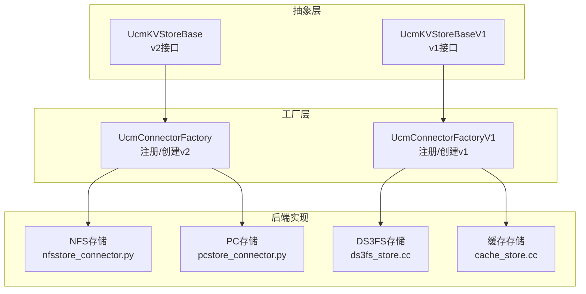
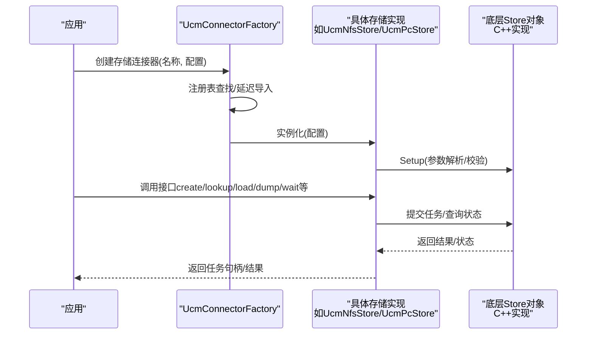
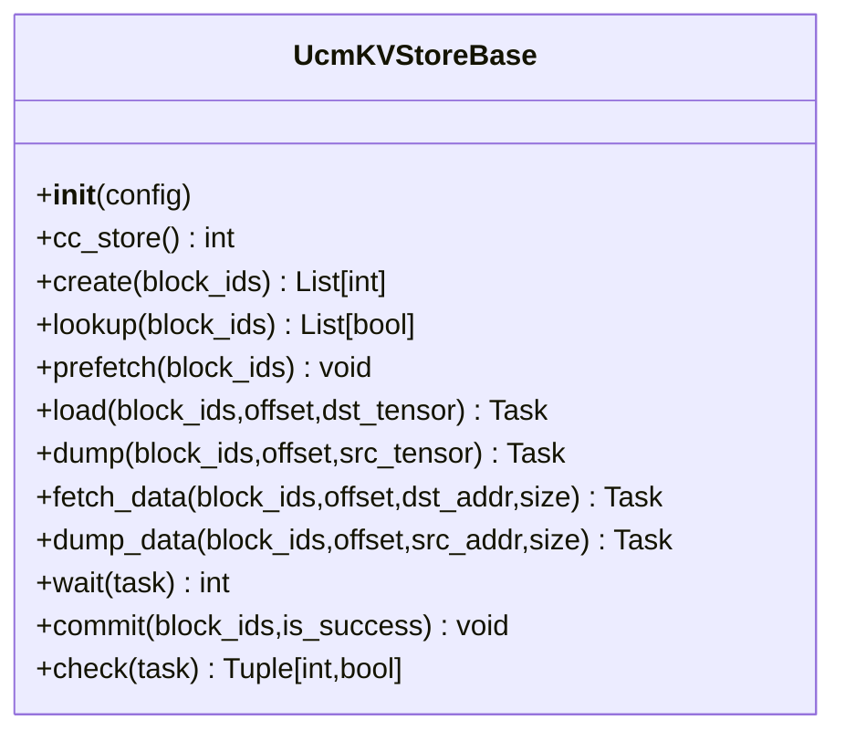
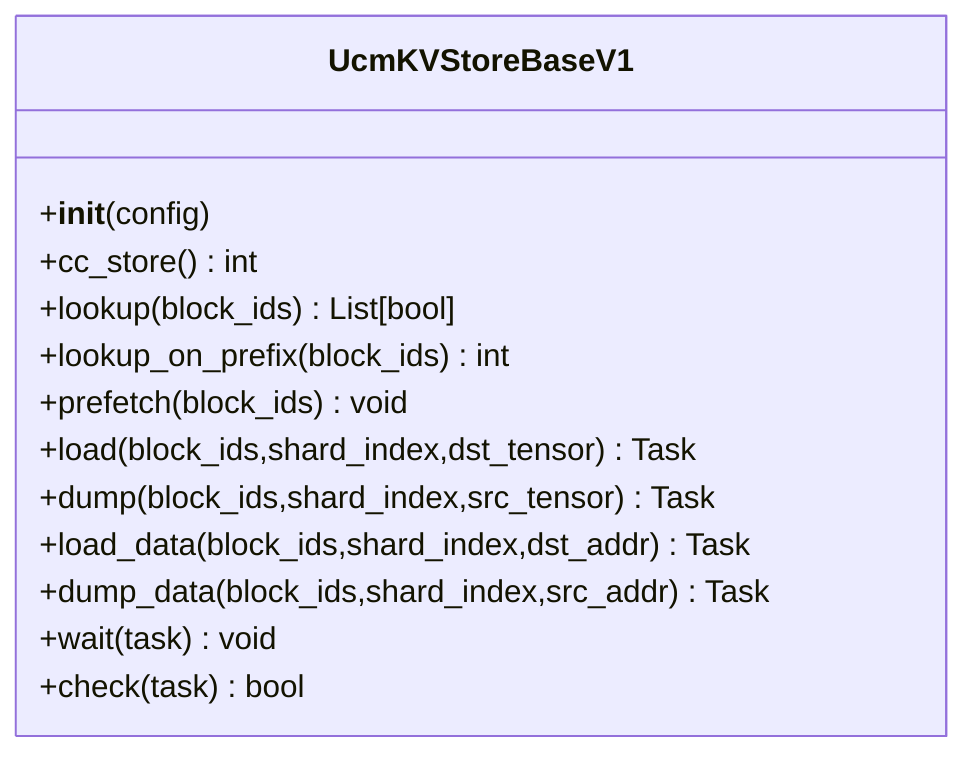
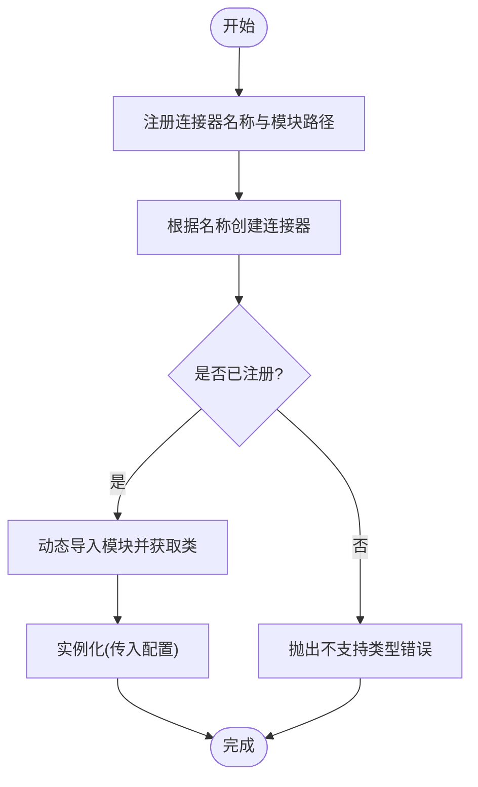
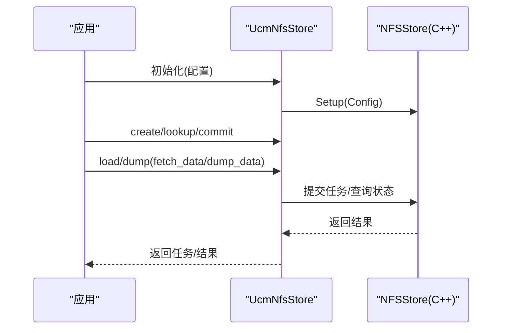
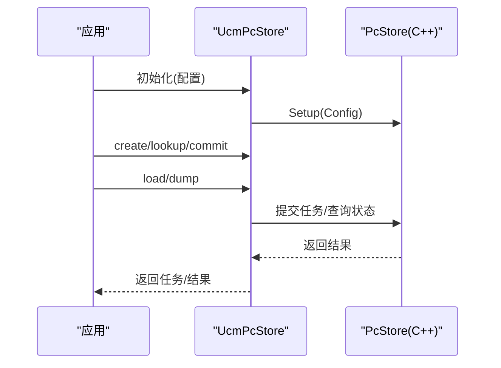
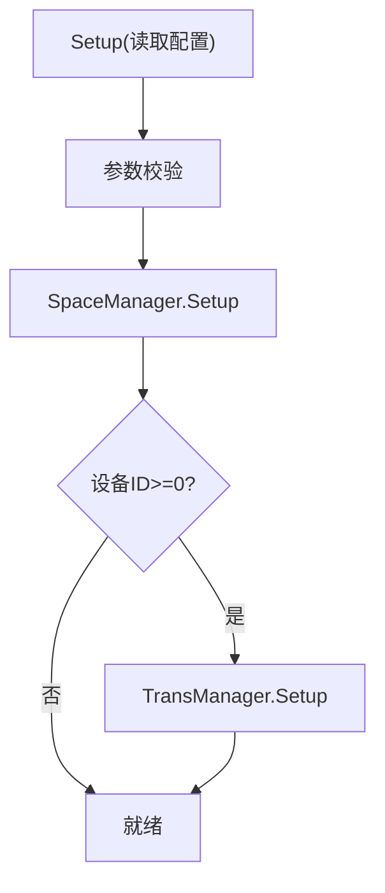
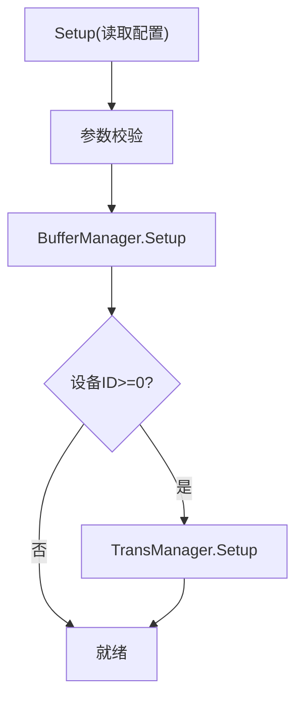
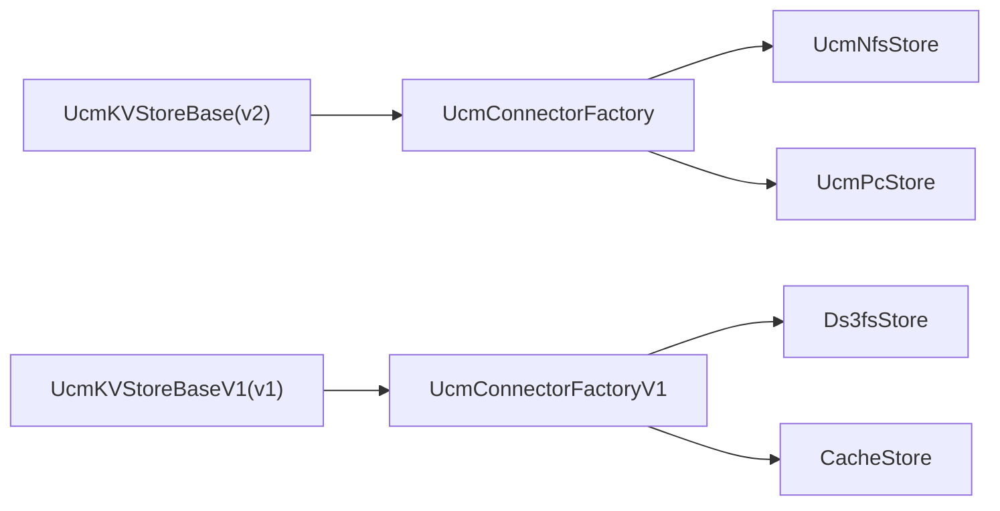

# 存储系统

<cite>
**本文引用的文件**
- [工厂.py](file://ucm/store/factory.py)
- [工厂v1.py](file://ucm/store/factory_v1.py)
- [通用存储接口.py](file://ucm/store/ucmstore.py)
- [通用存储接口v1.py](file://ucm/store/ucmstore_v1.py)
- [NFS存储头文件](file://ucm/store/nfsstore/cc/api/nfsstore.h)
- [PC存储头文件](file://ucm/store/pcstore/cc/api/pcstore.h)
- [DS3FS存储头文件](file://ucm/store/ds3fs/cc/ds3fs_store.h)
- [缓存存储头文件](file://ucm/store/cache/cc/cache_store.h)
- [NFS存储连接器.py](file://ucm/store/nfsstore/nfsstore_connector.py)
- [PC存储连接器.py](file://ucm/store/pcstore/pcstore_connector.py)
- [DS3FS存储实现.cc](file://ucm/store/ds3fs/cc/ds3fs_store.cc)
- [缓存存储实现.cc](file://ucm/store/cache/cc/cache_store.cc)
- [示例配置.yaml](file://examples/ucm_config_example.yaml)
</cite>

## 目录
1. [简介](#简介)
2. [项目结构](#项目结构)
3. [核心组件](#核心组件)
4. [架构总览](#架构总览)
5. [详细组件分析](#详细组件分析)
6. [依赖关系分析](#依赖关系分析)
7. [性能考虑](#性能考虑)
8. [故障排查指南](#故障排查指南)
9. [结论](#结论)
10. [附录](#附录)

## 简介
本技术文档面向UCM（Unified Cache Management）存储系统，系统性阐述存储抽象层的设计与工厂模式实现机制，详解NFS存储、PC存储、DS3FS分布式存储以及缓存存储等后端的实现原理、配置要点、性能特征与适用场景，并提供扩展开发指导与最佳实践。

## 项目结构
UCM存储系统采用“统一接口 + 工厂注册 + 多后端实现”的分层设计：
- 抽象层：定义统一的KV缓存存储接口（v1与v2两代）
- 工厂层：通过注册表按名称动态加载具体存储实现
- 后端层：NFS、PC、DS3FS、缓存等具体实现，分别提供Python绑定与C++核心逻辑
- 配置层：YAML示例展示如何声明与启用不同存储后端

图表来源
- [工厂.py](file://ucm/store/factory.py#L34-L71)
- [工厂v1.py](file://ucm/store/factory_v1.py#L34-L66)
- [通用存储接口.py](file://ucm/store/ucmstore.py#L39-L205)
- [通用存储接口v1.py](file://ucm/store/ucmstore_v1.py#L41-L202)
- [NFS存储连接器.py](file://ucm/store/nfsstore/nfsstore_connector.py#L39-L132)
- [PC存储连接器.py](file://ucm/store/pcstore/pcstore_connector.py#L39-L115)
- [DS3FS存储实现.cc](file://ucm/store/ds3fs/cc/ds3fs_store.cc#L96-L167)
- [缓存存储实现.cc](file://ucm/store/cache/cc/cache_store.cc#L106-L186)

章节来源
- [工厂.py](file://ucm/store/factory.py#L34-L71)
- [工厂v1.py](file://ucm/store/factory_v1.py#L34-L66)

## 核心组件
- 统一存储接口（v2）：定义KV块分配、查找、预取、数据搬运（设备/缓冲区）、任务等待与提交等能力，面向PyTorch张量与指针地址进行高性能传输。
- 统一存储接口（v1）：面向字节块ID与多维张量布局，支持前缀查找、低层数据搬运、异步任务检查/等待。
- 工厂注册与创建：通过名称注册后端类路径与类名，延迟导入并实例化具体存储实现；提供错误处理与日志记录。
- 后端适配器：各后端在Python侧封装底层C++ Store对象，桥接接口与配置参数，完成初始化与任务提交。

章节来源
- [通用存储接口.py](file://ucm/store/ucmstore.py#L39-L205)
- [通用存储接口v1.py](file://ucm/store/ucmstore_v1.py#L41-L202)
- [工厂.py](file://ucm/store/factory.py#L34-L71)
- [工厂v1.py](file://ucm/store/factory_v1.py#L34-L66)

## 架构总览
下图展示了从应用到存储后端的调用链路与职责分工：

图表来源
- [工厂.py](file://ucm/store/factory.py#L34-L71)
- [NFS存储连接器.py](file://ucm/store/nfsstore/nfsstore_connector.py#L39-L132)
- [PC存储连接器.py](file://ucm/store/pcstore/pcstore_connector.py#L39-L115)

## 详细组件分析

### 统一存储接口（v2）
- 设计目标：为KV缓存为中心的推理系统提供统一的存储抽象，屏蔽后端差异。
- 关键方法族：
  - 基础管理：cc_store、create、lookup、commit
  - 数据搬运：load、dump（张量级别）、fetch_data、dump_data（指针级别）
  - 异步控制：prefetch、wait、check
- 数据结构与复杂度：
  - 批量操作以列表形式传入块ID，便于流水线化与批量调度。
  - 任务模型为异步句柄，避免阻塞主线程，提高并发吞吐。

图表来源
- [通用存储接口.py](file://ucm/store/ucmstore.py#L39-L205)

章节来源
- [通用存储接口.py](file://ucm/store/ucmstore.py#L39-L205)

### 统一存储接口（v1）
- 设计目标：面向更细粒度的数据布局与多设备场景，支持前缀查找与低层数据搬运。
- 关键方法族：
  - 基础管理：cc_store、lookup、lookup_on_prefix、prefetch
  - 数据搬运：load、dump、load_data、dump_data
  - 异步控制：wait、check
- 参数与返回值：
  - 块ID使用原始字节类型，便于跨语言传递。
  - 多维张量布局通过二维列表描述，支持分片索引。

图表来源
- [通用存储接口v1.py](file://ucm/store/ucmstore_v1.py#L41-L202)

章节来源
- [通用存储接口v1.py](file://ucm/store/ucmstore_v1.py#L41-L202)

### 工厂模式与注册机制
- 注册表：以名称为键，保存模块路径与类名的延迟加载函数。
- 创建流程：根据名称查找注册项，动态导入模块并构造实例，同时记录日志与异常处理。
- 版本区分：v2与v1工厂分别对应不同的接口基类，避免混用。

图表来源
- [工厂.py](file://ucm/store/factory.py#L34-L71)
- [工厂v1.py](file://ucm/store/factory_v1.py#L34-L66)

章节来源
- [工厂.py](file://ucm/store/factory.py#L34-L71)
- [工厂v1.py](file://ucm/store/factory_v1.py#L34-L66)

### NFS存储（网络文件系统）
- 角色定位：面向分布式/共享存储的KV缓存后端，支持设备直传与热数据回收策略。
- 关键配置（Python侧）：
  - storage_backends：冒号分隔的后端路径列表
  - kv_block_size：块大小
  - role：角色（如worker时启用传输）
  - device、io_size、use_direct、stream_number、buffer_number等传输参数
  - storage_capacity、recycle_enable、recycle_threshold_ratio等容量与回收策略
- 接口映射：
  - create/lookup/commit：批处理块分配/查找/提交
  - load/dump/fetch_data/dump_data：设备与缓冲区之间的数据搬运
  - wait/check：任务状态查询
- 性能特征：
  - 支持IO直通与多流并发，适合高带宽场景
  - 可配置热数据管理与空间回收，降低碎片与写放大

图表来源
- [NFS存储连接器.py](file://ucm/store/nfsstore/nfsstore_connector.py#L39-L132)
- [NFS存储头文件](file://ucm/store/nfsstore/cc/api/nfsstore.h#L32-L97)

章节来源
- [NFS存储连接器.py](file://ucm/store/nfsstore/nfsstore_connector.py#L39-L132)
- [NFS存储头文件](file://ucm/store/nfsstore/cc/api/nfsstore.h#L32-L97)

### PC存储（进程间共享）
- 角色定位：基于共享内存的进程内/进程间KV缓存，强调低延迟与高并发。
- 关键配置（Python侧）：
  - storage_backends、kv_block_size、role
  - unique_id：唯一标识
  - device、io_size、use_direct、stream_number、buffer_number、local_rank_size、use_scatter_gatter等
- 接口映射：
  - 与NFS类似，但部分低层数据搬运接口在PC实现中为空或不适用
- 性能特征：
  - 低延迟、高吞吐，适合同机多进程或单机多卡场景
  - 支持散列/聚合传输优化

图表来源
- [PC存储连接器.py](file://ucm/store/pcstore/pcstore_connector.py#L39-L115)
- [PC存储头文件](file://ucm/store/pcstore/cc/api/pcstore.h#L32-L91)

章节来源
- [PC存储连接器.py](file://ucm/store/pcstore/pcstore_connector.py#L39-L115)
- [PC存储头文件](file://ucm/store/pcstore/cc/api/pcstore.h#L32-L91)

### DS3FS存储（分布式存储）
- 角色定位：面向分布式文件系统的KV缓存后端，支持设备侧传输与队列管理。
- 关键配置（C++侧字典）：
  - storage_backends、device_id、tensor_size、shard_size、block_size、io_direct、stream_number、timeout_ms、ior_entries、ior_depth、numa_id
- 实现要点：
  - 内部包含SpaceManager与TransManager，负责空间布局与传输任务提交
  - 传输使能由device_id决定，未使能时仅提供空间查询能力
- 性能特征：
  - 通过分片与流数量参数调节吞吐与延迟
  - NUMA感知与I/O条带化可提升大规模集群性能

图表来源
- [DS3FS存储实现.cc](file://ucm/store/ds3fs/cc/ds3fs_store.cc#L96-L167)
- [DS3FS存储头文件](file://ucm/store/ds3fs/cc/ds3fs_store.h#L32-L47)

章节来源
- [DS3FS存储实现.cc](file://ucm/store/ds3fs/cc/ds3fs_store.cc#L96-L167)
- [DS3FS存储头文件](file://ucm/store/ds3fs/cc/ds3fs_store.h#L32-L47)

### 缓存存储（本地高速缓存）
- 角色定位：作为中间层缓存，承载上层Store与底层Store之间的缓冲与队列管理。
- 关键配置（C++侧字典）：
  - store_backend（嵌套后端）、unique_id、device_id、tensor_size、shard_size、block_size、buffer_number、share_buffer_enable、waiting_queue_depth、running_queue_depth、timeout_ms
- 实现要点：
  - 内部BufferManager负责块命中查询与前缀查找
  - TransManager负责任务提交与状态查询
  - 传输使能由device_id决定
- 性能特征：
  - 通过缓冲池与队列深度参数调节缓存命中与并发度
  - 支持共享缓冲与NUMA亲和优化

图表来源
- [缓存存储实现.cc](file://ucm/store/cache/cc/cache_store.cc#L106-L186)
- [缓存存储头文件](file://ucm/store/cache/cc/cache_store.h#L32-L47)

章节来源
- [缓存存储实现.cc](file://ucm/store/cache/cc/cache_store.cc#L106-L186)
- [缓存存储头文件](file://ucm/store/cache/cc/cache_store.h#L32-L47)

## 依赖关系分析
- 抽象接口与工厂解耦：通过接口隔离与延迟导入，降低耦合度，便于新增后端。
- 后端适配器与底层实现分离：Python适配器负责参数解析与任务桥接，C++实现负责性能敏感的存储与传输。
- 版本兼容：v1与v2接口并行存在，工厂分别管理，避免破坏性变更。

图表来源
- [工厂.py](file://ucm/store/factory.py#L34-L71)
- [工厂v1.py](file://ucm/store/factory_v1.py#L34-L66)
- [通用存储接口.py](file://ucm/store/ucmstore.py#L39-L205)
- [通用存储接口v1.py](file://ucm/store/ucmstore_v1.py#L41-L202)

章节来源
- [工厂.py](file://ucm/store/factory.py#L34-L71)
- [工厂v1.py](file://ucm/store/factory_v1.py#L34-L66)

## 性能考虑
- 传输参数调优
  - IO大小与流数量：增大IO与流数可提升吞吐，但需考虑设备与网络带宽上限
  - 直通IO：在支持的环境下开启可减少拷贝开销
  - 超时时间：根据后端延迟设置合理超时，避免长时间阻塞
- 缓冲与队列
  - 缓冲数量与队列深度：提升并发度与命中率，但会增加内存占用
  - 共享缓冲：在多进程或多卡场景下可降低内存冗余
- 回收与容量
  - 空间回收阈值：平衡内存占用与写放大
  - 热度管理：对热点数据优先驻留，降低回源频率

## 故障排查指南
- 初始化失败
  - 检查后端路径与权限、设备ID合法性、块尺寸与分片尺寸的整除关系
  - 查看日志输出中的配置打印与错误码
- 任务阻塞
  - 检查超时设置与传输队列深度，必要时增大流数量或缓冲数
  - 使用check/wait接口确认任务状态
- 命中率低
  - 调整预取策略与热度窗口，结合缓存层提升命中率
  - 评估存储后端的随机访问性能与顺序写入策略

## 结论
UCM存储系统通过清晰的抽象接口与工厂注册机制，实现了对多种存储后端的统一接入。NFS适用于分布式共享场景，PC适用于低延迟进程内共享，DS3FS面向大规模分布式文件系统，缓存存储则提供高性能中间层。通过合理的配置与调优，可在不同硬件与网络条件下获得稳定的性能表现。

## 附录

### 存储后端选择指南
- 同机多进程/单机多卡：优先选择PC存储，降低跨进程通信开销
- 分布式共享存储：选择NFS存储，结合直通IO与多流提升吞吐
- 大规模分布式文件系统：选择DS3FS存储，关注NUMA与I/O条带化
- 需要本地高速缓存：选择缓存存储作为中间层，提升整体命中率

### 最佳实践建议
- 明确角色与设备：仅在工作节点启用设备传输，避免不必要的拷贝
- 分层配置：先在缓存层调优命中率，再优化底层存储参数
- 监控与告警：结合指标配置，持续观察命中率、延迟与错误率
- 渐进式迁移：新旧接口并行运行，逐步替换与验证

### 扩展开发指导
- 新增后端步骤
  - 定义C++ Store实现，遵循对应接口规范（v1或v2）
  - 在Python侧编写适配器，完成配置解析与任务桥接
  - 在工厂中注册新后端名称与模块路径
  - 补充单元测试与端到端测试
- 接口一致性
  - 保持方法签名与语义一致，确保上层调用无差异
  - 对异步任务提供check/wait能力，保证可观测性

### 配置示例与参数说明
- 示例配置文件位置：[示例配置.yaml](file://examples/ucm_config_example.yaml#L10-L18)
- 常用参数
  - storage_backends：后端路径列表（冒号分隔）
  - kv_block_size：块大小
  - role：角色（如worker启用传输）
  - device/io_size/use_direct/stream_number/buffer_number：传输相关参数
  - unique_id/local_rank_size/use_scatter_gatter：PC存储特有参数
  - device_id/tensor_size/shard_size/block_size/io_direct/stream_number/timeout_ms/ior_entries/ior_depth/numa_id：DS3FS/缓存存储特有参数

章节来源
- [示例配置.yaml](file://examples/ucm_config_example.yaml#L10-L18)