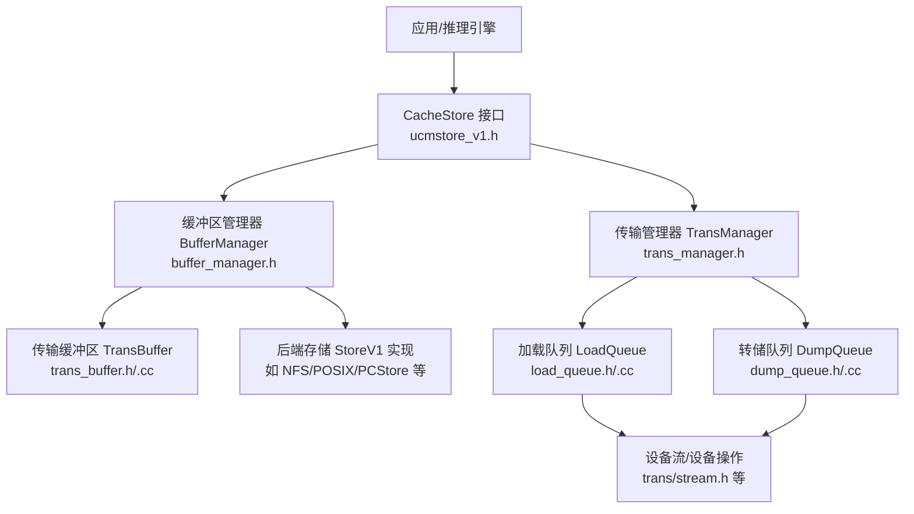
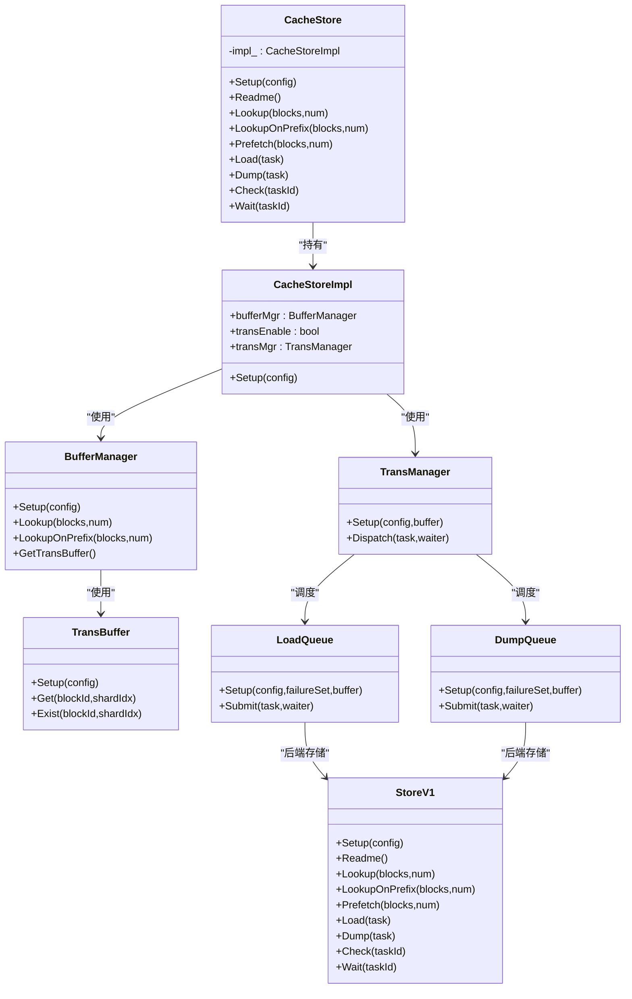
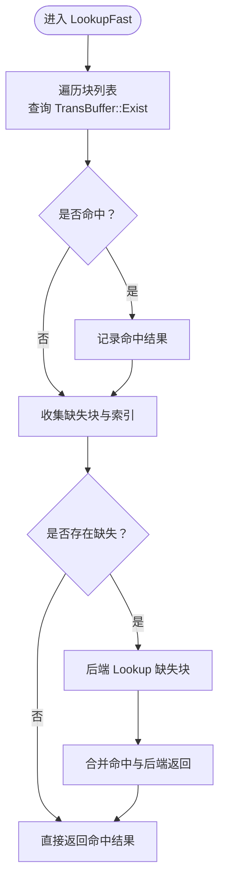
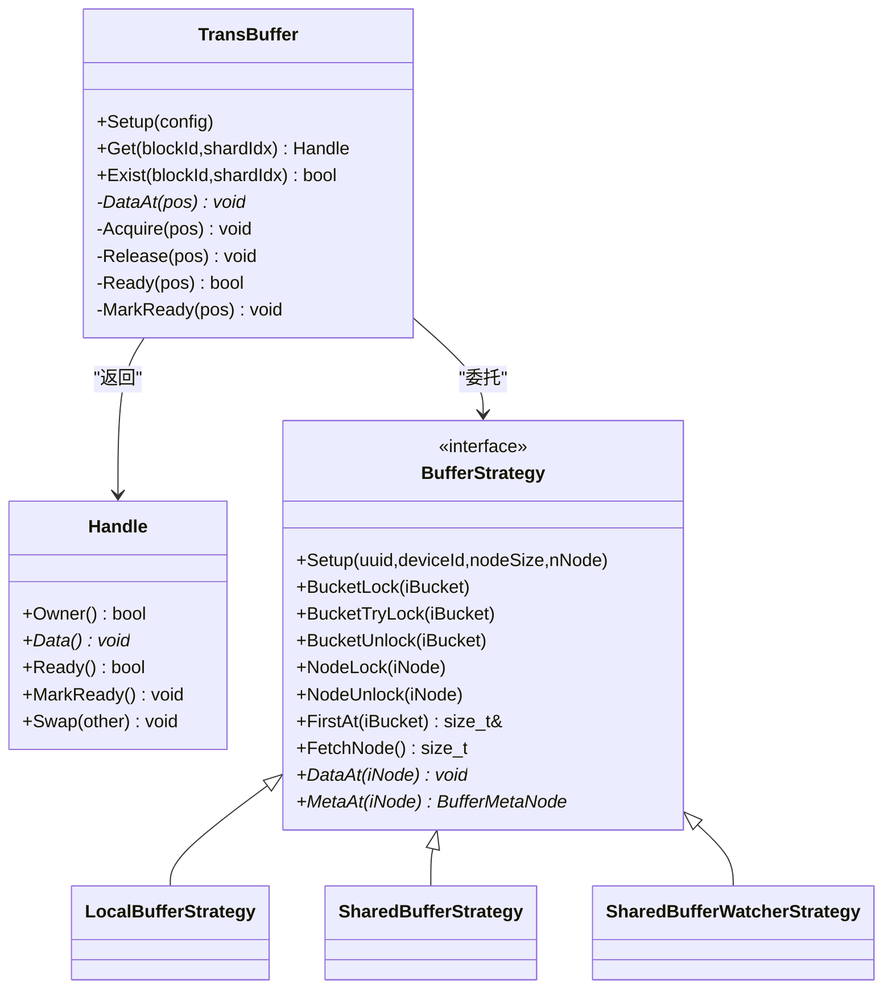
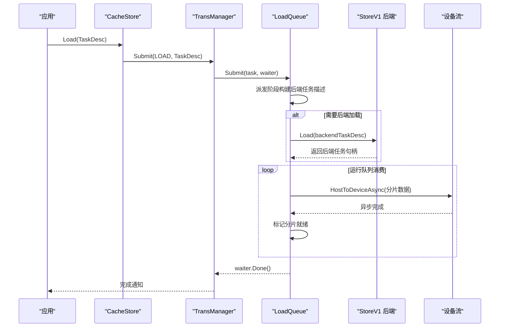
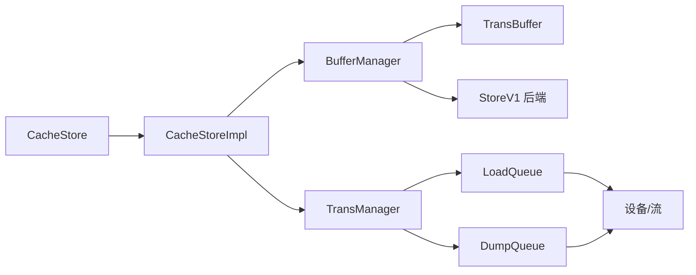

# 缓存存储

<cite>
**本文引用的文件**
- [cache_store.h](file://ucm/store/cache/cc/cache_store.h)
- [cache_store.cc](file://ucm/store/cache/cc/cache_store.cc)
- [buffer_manager.h](file://ucm/store/cache/cc/buffer_manager.h)
- [trans_buffer.h](file://ucm/store/cache/cc/trans_buffer.h)
- [trans_buffer.cc](file://ucm/store/cache/cc/trans_buffer.cc)
- [load_queue.h](file://ucm/store/cache/cc/load_queue.h)
- [load_queue.cc](file://ucm/store/cache/cc/load_queue.cc)
- [dump_queue.h](file://ucm/store/cache/cc/dump_queue.h)
- [dump_queue.cc](file://ucm/store/cache/cc/dump_queue.cc)
- [trans_manager.h](file://ucm/store/cache/cc/trans_manager.h)
- [trans_task.h](file://ucm/store/cache/cc/trans_task.h)
- [types.h](file://ucm/store/detail/type/types.h)
- [ucmstore_v1.h](file://ucm/store/ucmstore_v1.h)
- [global_config.h](file://ucm/store/cache/cc/global_config.h)
- [ucm_config_example.yaml](file://examples/ucm_config_example.yaml)
</cite>

## 目录
1. [简介](#简介)
2. [项目结构](#项目结构)
3. [核心组件](#核心组件)
4. [架构总览](#架构总览)
5. [详细组件分析](#详细组件分析)
6. [依赖关系分析](#依赖关系分析)
7. [性能考量与优化参数](#性能考量与优化参数)
8. [故障排查指南](#故障排查指南)
9. [结论](#结论)
10. [附录：配置示例与调优案例](#附录配置示例与调优案例)

## 简介
本文件面向UCM缓存存储系统（CacheStore），系统性阐述其本地高速缓存设计、缓冲区管理、任务队列调度、内存管理策略以及性能优化参数。重点覆盖以下方面：
- 缓存层次结构与数据预取策略
- 缓冲区分配、回收与复用机制
- 加载队列、转储队列与传输任务调度
- 内存池管理与内存碎片控制
- 性能优化参数与调优实践
- 在推理加速中的关键作用与适用场景

## 项目结构
CacheStore位于统一存储抽象之上，通过“缓冲区管理器 + 传输管理器 + 加载/转储队列”的分层设计，实现对后端存储的异步加载与转储，并在设备侧进行高效的数据搬运。

图表来源
- [ucmstore_v1.h](file://ucm/store/ucmstore_v1.h#L40-L162)
- [buffer_manager.h](file://ucm/store/cache/cc/buffer_manager.h#L34-L128)
- [trans_buffer.h](file://ucm/store/cache/cc/trans_buffer.h#L37-L120)
- [trans_buffer.cc](file://ucm/store/cache/cc/trans_buffer.cc#L368-L383)
- [trans_manager.h](file://ucm/store/cache/cc/trans_manager.h#L35-L75)
- [load_queue.h](file://ucm/store/cache/cc/load_queue.h#L39-L80)
- [load_queue.cc](file://ucm/store/cache/cc/load_queue.cc#L37-L51)
- [dump_queue.h](file://ucm/store/cache/cc/dump_queue.h#L39-L75)
- [dump_queue.cc](file://ucm/store/cache/cc/dump_queue.cc#L37-L50)

章节来源
- [cache_store.h](file://ucm/store/cache/cc/cache_store.h#L33-L48)
- [cache_store.cc](file://ucm/store/cache/cc/cache_store.cc#L108-L129)
- [ucmstore_v1.h](file://ucm/store/ucmstore_v1.h#L40-L162)

## 核心组件
- CacheStore：对外暴露统一接口，封装缓冲区管理与传输调度。
- BufferManager：负责命中判定、缺失块回源、快速路径与后端路径的组合。
- TransBuffer：设备侧/共享内存侧的缓冲区容器，支持本地与共享两种策略。
- TransManager：任务分发与生命周期管理，按任务类型路由到加载或转储队列。
- LoadQueue/DumpQueue：分别处理“存储→设备”和“设备→存储”的异步传输流水线。
- 类型与配置：BlockId、TaskDesc、Shard等类型定义；全局配置项用于控制缓冲区规模、队列深度、超时等。

章节来源
- [cache_store.h](file://ucm/store/cache/cc/cache_store.h#L33-L48)
- [buffer_manager.h](file://ucm/store/cache/cc/buffer_manager.h#L34-L128)
- [trans_buffer.h](file://ucm/store/cache/cc/trans_buffer.h#L37-L120)
- [trans_manager.h](file://ucm/store/cache/cc/trans_manager.h#L35-L75)
- [load_queue.h](file://ucm/store/cache/cc/load_queue.h#L39-L80)
- [dump_queue.h](file://ucm/store/cache/cc/dump_queue.h#L39-L75)
- [types.h](file://ucm/store/detail/type/types.h#L33-L65)
- [global_config.h](file://ucm/store/cache/cc/global_config.h#L32-L44)

## 架构总览
CacheStore以StoreV1为后端抽象，内部通过BufferManager进行缓存命中判断与回源访问；当存在设备ID且启用传输时，TransManager协调LoadQueue/DumpQueue完成异步搬运。TransBuffer提供缓冲区句柄与就绪状态标记，配合设备流实现高吞吐的H2D/D2H传输。

图表来源
- [ucmstore_v1.h](file://ucm/store/ucmstore_v1.h#L40-L162)
- [cache_store.h](file://ucm/store/cache/cc/cache_store.h#L33-L48)
- [cache_store.cc](file://ucm/store/cache/cc/cache_store.cc#L41-L60)
- [buffer_manager.h](file://ucm/store/cache/cc/buffer_manager.h#L49-L60)
- [trans_buffer.h](file://ucm/store/cache/cc/trans_buffer.h#L100-L102)
- [trans_manager.h](file://ucm/store/cache/cc/trans_manager.h#L41-L48)
- [load_queue.h](file://ucm/store/cache/cc/load_queue.h#L65-L75)
- [dump_queue.h](file://ucm/store/cache/cc/dump_queue.h#L62-L70)

## 详细组件分析

### 缓冲区管理与数据预取
- 命中判定与快速路径
  - BufferManager在存在TransBuffer时，先对每个块执行Exist查询，记录缺失块索引，随后仅对缺失块发起后端Lookup，减少不必要的IO。
  - LookupOnPrefix利用后端返回的前缀最大匹配索引，结合缺失块集合，快速定位可直接返回的前缀范围。
- 数据预取
  - CacheStore::Prefetch当前为空实现，表示默认不进行显式预取；可在上层根据访问模式扩展预取策略（例如基于历史轨迹或窗口滑动）。
- 缓冲区策略
  - TransBuffer支持本地策略与共享策略：本地策略在设备侧分配固定大小的主机固定缓冲区；共享策略通过POSIX共享内存跨进程共享，注册到设备侧以支持零拷贝/低延迟传输。

图表来源
- [buffer_manager.h](file://ucm/store/cache/cc/buffer_manager.h#L72-L122)

章节来源
- [buffer_manager.h](file://ucm/store/cache/cc/buffer_manager.h#L61-L122)
- [trans_buffer.h](file://ucm/store/cache/cc/trans_buffer.h#L100-L102)
- [trans_buffer.cc](file://ucm/store/cache/cc/trans_buffer.cc#L385-L407)

### 传输缓冲区与内存管理
- 结构与策略
  - TransBuffer::Handle提供RAII语义：构造/移动时增加引用计数，析构时释放；Owner()标识该句柄是否拥有节点所有权；Ready()/MarkReady()用于同步就绪状态。
  - BufferStrategy抽象了桶哈希表、元信息链表、锁与内存布局；LocalBufferStrategy在设备侧分配固定大小的主机固定缓冲区；SharedBufferStrategy在/dev/shm中建立共享内存，注册到设备侧，实现多进程共享与低延迟访问。
- 分配与回收
  - Alloc循环尝试从空闲链表取节点，若节点被占用则跳过；命中后更新哈希桶头并递增引用计数；删除时断开前后指针并清空元信息。
  - 共享缓冲区在首次创建时初始化头、桶锁与节点锁，后续进程打开已存在的共享内存并等待就绪标志。

图表来源
- [trans_buffer.h](file://ucm/store/cache/cc/trans_buffer.h#L37-L115)
- [trans_buffer.cc](file://ucm/store/cache/cc/trans_buffer.cc#L67-L81)
- [trans_buffer.cc](file://ucm/store/cache/cc/trans_buffer.cc#L83-L143)
- [trans_buffer.cc](file://ucm/store/cache/cc/trans_buffer.cc#L145-L351)
- [trans_buffer.cc](file://ucm/store/cache/cc/trans_buffer.cc#L353-L366)

章节来源
- [trans_buffer.h](file://ucm/store/cache/cc/trans_buffer.h#L43-L97)
- [trans_buffer.cc](file://ucm/store/cache/cc/trans_buffer.cc#L368-L383)
- [trans_buffer.cc](file://ucm/store/cache/cc/trans_buffer.cc#L446-L475)
- [trans_buffer.cc](file://ucm/store/cache/cc/trans_buffer.cc#L493-L513)

### 任务队列与调度机制
- 任务模型
  - TransTask封装任务类型（LOAD/DUMP）与任务描述（TaskDesc），包含多个Shard，每个Shard携带父块ID、分片索引与设备地址。
  - TransManager继承TaskWrapper，负责任务派生、超时与完成回调。
- 加载队列（LoadQueue）
  - 等待队列接收提交的任务；派发阶段构建后端任务描述，仅对未就绪且拥有所有权的分片发起后端Load；运行队列按分片推进，设备侧H2D异步搬运，必要时同步等待后端任务完成。
- 转储队列（DumpQueue）
  - 派发阶段对设备侧D2H异步搬运，完成后端Dump并入“转储中”队列；后台线程等待后端Dump完成，维护已完成的最大后端任务句柄。

图表来源
- [trans_manager.h](file://ucm/store/cache/cc/trans_manager.h#L51-L69)
- [load_queue.cc](file://ucm/store/cache/cc/load_queue.cc#L65-L111)
- [load_queue.cc](file://ucm/store/cache/cc/load_queue.cc#L132-L162)

章节来源
- [trans_task.h](file://ucm/store/cache/cc/trans_task.h#L34-L52)
- [types.h](file://ucm/store/detail/type/types.h#L50-L65)
- [trans_manager.h](file://ucm/store/cache/cc/trans_manager.h#L51-L69)
- [load_queue.h](file://ucm/store/cache/cc/load_queue.h#L65-L75)
- [load_queue.cc](file://ucm/store/cache/cc/load_queue.cc#L65-L111)
- [load_queue.cc](file://ucm/store/cache/cc/load_queue.cc#L132-L184)
- [dump_queue.h](file://ucm/store/cache/cc/dump_queue.h#L62-L70)
- [dump_queue.cc](file://ucm/store/cache/cc/dump_queue.cc#L81-L139)

### 内存管理策略与碎片控制
- 本地策略（LocalBufferStrategy）
  - 在设备侧分配主机固定缓冲区，使用连续内存与固定偏移，避免跨页碎片；哈希桶与元信息数组驻留于同一进程地址空间，锁开销低。
- 共享策略（SharedBufferStrategy）
  - 使用/dev/shm共享内存，头段含桶锁与节点锁，元信息与数据区分离并对齐；通过共享锁保证多进程一致性；支持自动清理长时间未使用的共享文件。
- 片段控制
  - 固定大小节点与链表结构避免动态扩容带来的碎片；桶内链表维护LRU风格的头插法，便于快速定位与迁移。
- 复用与复用边界
  - 通过引用计数与所有权标记，确保句柄生命周期可控；Ready/MarkReady配合后端任务句柄，避免重复搬运。

章节来源
- [trans_buffer.cc](file://ucm/store/cache/cc/trans_buffer.cc#L83-L143)
- [trans_buffer.cc](file://ucm/store/cache/cc/trans_buffer.cc#L145-L351)
- [trans_buffer.cc](file://ucm/store/cache/cc/trans_buffer.cc#L353-L366)
- [trans_buffer.cc](file://ucm/store/cache/cc/trans_buffer.cc#L446-L475)
- [trans_buffer.cc](file://ucm/store/cache/cc/trans_buffer.cc#L493-L513)

## 依赖关系分析
- 组件耦合
  - CacheStoreImpl聚合BufferManager与TransManager，降低外部依赖复杂度。
  - BufferManager依赖TransBuffer与后端StoreV1，形成“缓存命中→后端回源”的清晰边界。
  - TransManager解耦任务类型，通过LoadQueue/DumpQueue实现职责分离。
- 外部依赖
  - 设备抽象（trans/device.h）、流抽象（trans/stream.h）、日志与时间工具等基础设施。

图表来源
- [cache_store.cc](file://ucm/store/cache/cc/cache_store.cc#L41-L60)
- [buffer_manager.h](file://ucm/store/cache/cc/buffer_manager.h#L34-L60)
- [trans_manager.h](file://ucm/store/cache/cc/trans_manager.h#L35-L48)
- [load_queue.h](file://ucm/store/cache/cc/load_queue.h#L39-L62)
- [dump_queue.h](file://ucm/store/cache/cc/dump_queue.h#L39-L62)

章节来源
- [cache_store.cc](file://ucm/store/cache/cc/cache_store.cc#L41-L60)
- [buffer_manager.h](file://ucm/store/cache/cc/buffer_manager.h#L34-L60)
- [trans_manager.h](file://ucm/store/cache/cc/trans_manager.h#L35-L48)

## 性能考量与优化参数
- 缓存大小与分片
  - bufferNumber：缓冲区节点总数，直接影响缓存容量与命中率。
  - shardSize/blockSize/tensorSize：分片大小、块大小与张量大小需满足整除关系，保证分片粒度合理。
- 队列深度
  - waitingQueueDepth：等待队列深度，过大可能引入排队延迟，过小易丢弃任务。
  - runningQueueDepth：运行队列深度，决定并发传输能力与内存占用。
- 设备与传输
  - deviceId≥0时启用传输；设备侧流与批量搬运可显著提升吞吐。
- 超时与稳定性
  - timeoutMs：任务超时阈值，避免长尾阻塞。
- 参数校验与建议
  - bufferNumber不得小于阈值；队列深度应大于1；分片/块/张量大小需满足整除约束。

章节来源
- [global_config.h](file://ucm/store/cache/cc/global_config.h#L32-L44)
- [cache_store.cc](file://ucm/store/cache/cc/cache_store.cc#L63-L85)
- [load_queue.cc](file://ucm/store/cache/cc/load_queue.cc#L37-L51)
- [dump_queue.cc](file://ucm/store/cache/cc/dump_queue.cc#L37-L50)

## 故障排查指南
- 常见错误与定位
  - 配置无效：检查deviceId、uniqueId、分片/块/张量大小关系与bufferNumber阈值。
  - 传输未启用：当deviceId=-1时，Load/Dump会返回错误；确认是否需要设备侧传输。
  - 队列满：等待队列满时提交失败并记录错误；调整waitingQueueDepth或降低提交速率。
  - 后端任务失败：Load/Dump提交后端失败或等待失败，查看对应错误日志并重试。
  - 共享缓冲区就绪：共享策略需等待magic标志就绪，若超时返回重试，检查共享内存权限与清理逻辑。
- 建议排查步骤
  - 开启调试日志，观察“等待/构建缓冲/后端耗时”等分段统计。
  - 校验设备与流初始化是否成功。
  - 检查队列深度与任务批大小，避免过度拥塞。

章节来源
- [cache_store.cc](file://ucm/store/cache/cc/cache_store.cc#L149-L181)
- [load_queue.cc](file://ucm/store/cache/cc/load_queue.cc#L53-L61)
- [dump_queue.cc](file://ucm/store/cache/cc/dump_queue.cc#L52-L60)
- [trans_buffer.cc](file://ucm/store/cache/cc/trans_buffer.cc#L264-L286)

## 结论
CacheStore通过“缓存命中判定 + 异步传输 + 共享/本地缓冲区策略”实现了高性能的KV缓存存储。其分层设计使缓存与传输解耦，便于在不同后端与设备环境下灵活部署。合理的参数配置与队列深度控制是发挥其性能潜力的关键。

## 附录：配置示例与调优案例
- YAML配置示例
  - 示例文件展示了如何通过YAML配置UCM连接器与存储后端，便于在推理框架中集成。
- 调优建议
  - 提升命中率：增大bufferNumber，合理设置shardSize与blockSize，确保分片粒度适配推理工作负载。
  - 平衡队列深度：根据设备带宽与后端IO能力，逐步增大waitingQueueDepth与runningQueueDepth，观察延迟与吞吐曲线。
  - 传输优化：启用设备侧传输（deviceId≥0），使用批量搬运与异步流，减少同步阻塞。
  - 共享缓冲区：多进程/多实例场景下启用shareBufferEnable，注意/dev/shm权限与清理策略。

章节来源
- [ucm_config_example.yaml](file://examples/ucm_config_example.yaml#L10-L38)