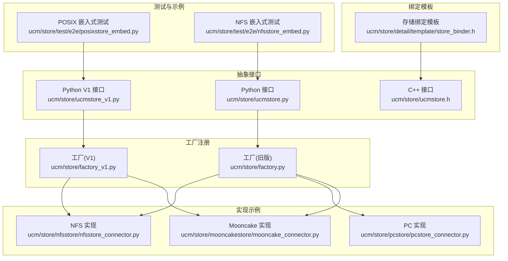
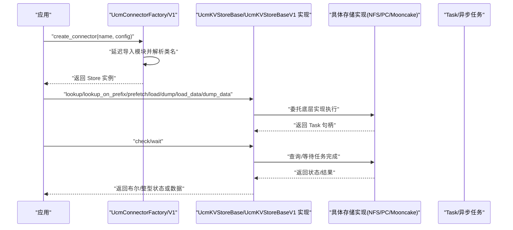
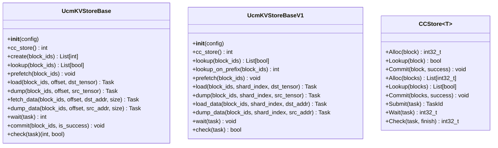
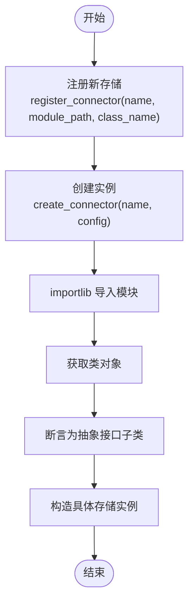
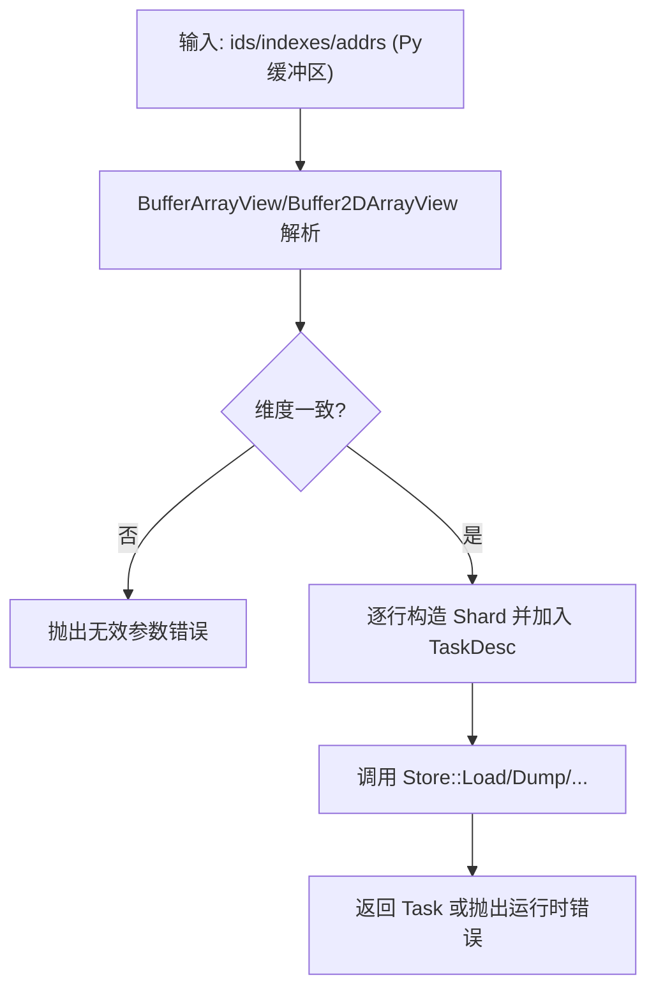
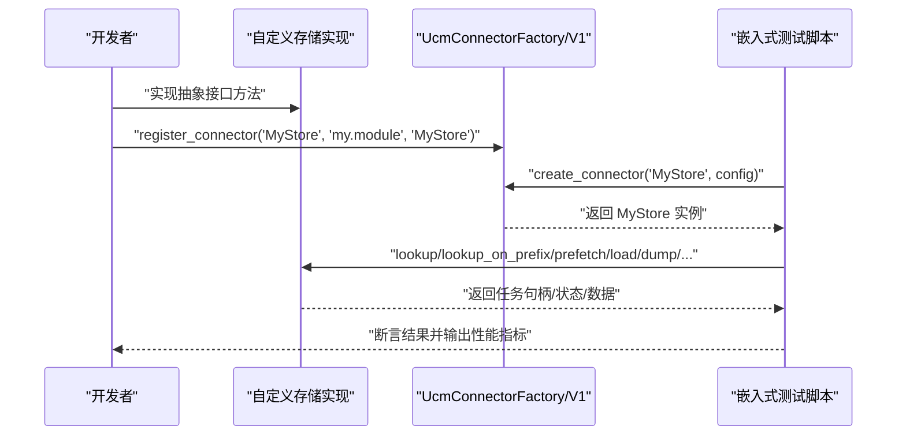
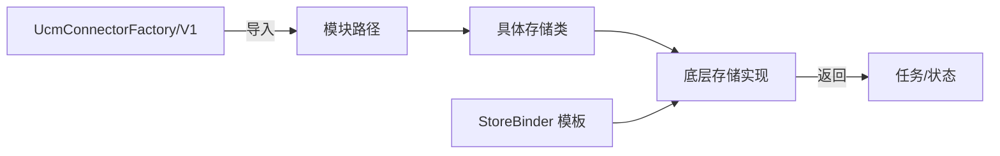

# 自定义存储开发

<cite>
**本文引用的文件**
- [ucm/store/ucmstore.h](file://ucm/store/ucmstore.h)
- [ucm/store/ucmstore.py](file://ucm/store/ucmstore.py)
- [ucm/store/ucmstore_v1.py](file://ucm/store/ucmstore_v1.py)
- [ucm/store/factory.py](file://ucm/store/factory.py)
- [ucm/store/factory_v1.py](file://ucm/store/factory_v1.py)
- [ucm/store/detail/template/store_binder.h](file://ucm/store/detail/template/store_binder.h)
- [ucm/store/nfsstore/nfsstore_connector.py](file://ucm/store/nfsstore/nfsstore_connector.py)
- [ucm/store/pcstore/pcstore_connector.py](file://ucm/store/pcstore/pcstore_connector.py)
- [ucm/store/mooncakestore/mooncake_connector.py](file://ucm/store/mooncakestore/mooncake_connector.py)
- [ucm/store/test/e2e/posixstore_embed.py](file://ucm/store/test/e2e/posixstore_embed.py)
- [ucm/store/test/e2e/nfsstore_embed.py](file://ucm/store/test/e2e/nfsstore_embed.py)
- [docs/source/developer-guide/extending_store.md](file://docs/source/developer-guide/extending_store.md)
</cite>

## 目录
1. [简介](#简介)
2. [项目结构](#项目结构)
3. [核心组件](#核心组件)
4. [架构总览](#架构总览)
5. [详细组件分析](#详细组件分析)
6. [依赖关系分析](#依赖关系分析)
7. [性能考量](#性能考量)
8. [故障排查指南](#故障排查指南)
9. [结论](#结论)
10. [附录](#附录)

## 简介
本指南面向需要在统一缓存管理（UCM）中开发“自定义存储后端”的工程师，系统讲解如何继承抽象接口、扩展存储工厂、使用存储绑定模板、完成从实现到注册的完整流程，并提供测试策略、调试技巧、性能优化与常见问题解决方案。文档同时覆盖纯Python、Python/C++混合以及纯C++三种扩展路径，帮助你根据性能与开发效率需求选择合适的实现方式。

## 项目结构
UCM的存储子系统围绕“抽象接口 + 工厂注册 + 具体实现 + 绑定模板”组织，核心目录与文件如下：
- 抽象接口层：Python侧与C++侧接口分别定义了统一的KV缓存存储能力边界
- 工厂层：负责按名称动态加载并实例化具体存储类
- 实现层：内置多种存储实现（如NFS、PC、Mooncake等），可作为参考或直接使用
- 绑定模板层：提供C++侧与Python侧交互的桥接与数据视图封装
- 测试与示例：端到端用例与嵌入式脚本用于验证功能与性能

图表来源
- [ucm/store/ucmstore.py](file://ucm/store/ucmstore.py#L39-L205)
- [ucm/store/ucmstore.h](file://ucm/store/ucmstore.h#L31-L47)
- [ucm/store/ucmstore_v1.py](file://ucm/store/ucmstore_v1.py#L41-L200)
- [ucm/store/factory.py](file://ucm/store/factory.py#L34-L71)
- [ucm/store/factory_v1.py](file://ucm/store/factory_v1.py#L34-L66)
- [ucm/store/detail/template/store_binder.h](file://ucm/store/detail/template/store_binder.h#L34-L155)
- [ucm/store/nfsstore/nfsstore_connector.py](file://ucm/store/nfsstore/nfsstore_connector.py#L39-L132)
- [ucm/store/pcstore/pcstore_connector.py](file://ucm/store/pcstore/pcstore_connector.py#L39-L115)
- [ucm/store/mooncakestore/mooncake_connector.py](file://ucm/store/mooncakestore/mooncake_connector.py#L59-L368)
- [ucm/store/test/e2e/posixstore_embed.py](file://ucm/store/test/e2e/posixstore_embed.py#L32-L131)
- [ucm/store/test/e2e/nfsstore_embed.py](file://ucm/store/test/e2e/nfsstore_embed.py#L35-L154)

章节来源
- [ucm/store/ucmstore.py](file://ucm/store/ucmstore.py#L39-L205)
- [ucm/store/ucmstore.h](file://ucm/store/ucmstore.h#L31-L47)
- [ucm/store/ucmstore_v1.py](file://ucm/store/ucmstore_v1.py#L41-L200)
- [ucm/store/factory.py](file://ucm/store/factory.py#L34-L71)
- [ucm/store/factory_v1.py](file://ucm/store/factory_v1.py#L34-L66)
- [ucm/store/detail/template/store_binder.h](file://ucm/store/detail/template/store_binder.h#L34-L155)
- [ucm/store/nfsstore/nfsstore_connector.py](file://ucm/store/nfsstore/nfsstore_connector.py#L39-L132)
- [ucm/store/pcstore/pcstore_connector.py](file://ucm/store/pcstore/pcstore_connector.py#L39-L115)
- [ucm/store/mooncakestore/mooncake_connector.py](file://ucm/store/mooncakestore/mooncake_connector.py#L59-L368)
- [ucm/store/test/e2e/posixstore_embed.py](file://ucm/store/test/e2e/posixstore_embed.py#L32-L131)
- [ucm/store/test/e2e/nfsstore_embed.py](file://ucm/store/test/e2e/nfsstore_embed.py#L35-L154)

## 核心组件
- Python侧抽象接口（旧版）：定义了KV缓存存储的核心操作集合，包括创建、查找、预取、加载、转储、数据搬运、等待与提交等，支持任务状态查询与批量处理。
- Python侧抽象接口（V1）：提供更清晰的字节块ID、分片索引与张量/指针地址的双层列表结构，强调异步任务句柄与非阻塞检查。
- C++侧抽象接口：以模板类形式定义底层存储能力，提供分配、查找、提交与任务提交/等待/检查等接口，便于高性能C++实现。
- 存储工厂：通过名称注册与延迟导入机制，按需加载具体存储类并实例化，支持多实现共存与切换。
- 存储绑定模板：在C++侧将Python缓冲区视图转换为连续内存视图，构造任务描述，屏蔽Python与C++之间的数据布局差异。
- 内置实现示例：NFS、PC、Mooncake等实现展示了不同存储后端的接入方式与配置要点。

章节来源
- [ucm/store/ucmstore.py](file://ucm/store/ucmstore.py#L39-L205)
- [ucm/store/ucmstore_v1.py](file://ucm/store/ucmstore_v1.py#L41-L200)
- [ucm/store/ucmstore.h](file://ucm/store/ucmstore.h#L31-L47)
- [ucm/store/factory.py](file://ucm/store/factory.py#L34-L71)
- [ucm/store/factory_v1.py](file://ucm/store/factory_v1.py#L34-L66)
- [ucm/store/detail/template/store_binder.h](file://ucm/store/detail/template/store_binder.h#L34-L155)

## 架构总览
下图展示从应用调用到具体存储实现的全链路交互，涵盖工厂注册、实例化、方法调用与任务等待等关键步骤。

图表来源
- [ucm/store/factory.py](file://ucm/store/factory.py#L34-L71)
- [ucm/store/factory_v1.py](file://ucm/store/factory_v1.py#L34-L66)
- [ucm/store/ucmstore.py](file://ucm/store/ucmstore.py#L39-L205)
- [ucm/store/ucmstore_v1.py](file://ucm/store/ucmstore_v1.py#L41-L200)
- [ucm/store/nfsstore/nfsstore_connector.py](file://ucm/store/nfsstore/nfsstore_connector.py#L39-L132)
- [ucm/store/pcstore/pcstore_connector.py](file://ucm/store/pcstore/pcstore_connector.py#L39-L115)
- [ucm/store/mooncakestore/mooncake_connector.py](file://ucm/store/mooncakestore/mooncake_connector.py#L59-L368)

## 详细组件分析

### 抽象接口与实现要求
- Python旧版接口（UcmKVStoreBase）
  - 必须实现的方法：cc_store、create、lookup、prefetch、load、dump、fetch_data、dump_data、wait、commit、check
  - 批量与单个操作均需支持；返回值语义明确（如错误码、布尔掩码、任务句柄）
  - 配置通过构造函数注入，内部可按需解析
- Python V1接口（UcmKVStoreBaseV1）
  - 强制使用字节块ID（bytes）、分片索引（List[int]）与双层张量/指针结构
  - 明确异步任务语义：check返回是否完成，wait阻塞直到完成
  - 提供load_data/dump_data低层数据搬运接口，便于与设备指针对接
- C++接口（CCStore<T>）
  - 模板化设计，支持Task类型参数
  - 定义Alloc/Lookup/Commit与批量版本，以及Submit/Wait/Check任务控制接口

图表来源
- [ucm/store/ucmstore.py](file://ucm/store/ucmstore.py#L39-L205)
- [ucm/store/ucmstore_v1.py](file://ucm/store/ucmstore_v1.py#L41-L200)
- [ucm/store/ucmstore.h](file://ucm/store/ucmstore.h#L31-L47)

章节来源
- [ucm/store/ucmstore.py](file://ucm/store/ucmstore.py#L39-L205)
- [ucm/store/ucmstore_v1.py](file://ucm/store/ucmstore_v1.py#L41-L200)
- [ucm/store/ucmstore.h](file://ucm/store/ucmstore.h#L31-L47)

### 存储工厂扩展机制
- 工厂（旧版）：UcmConnectorFactory
  - 注册：register_connector(name, module_path, class_name)，内部使用importlib延迟导入
  - 实例化：create_connector根据名称查找并构造具体类，断言其为UcmKVStoreBase子类
  - 内置注册项：已注册NFS、PC、Mooncake等实现
- 工厂（V1）：UcmConnectorFactoryV1
  - 注册：register_connector(name, module_path, class_name)
  - 实例化：create_connector(name, config)返回UcmKVStoreBaseV1实例
  - 内置注册项：NFS V1、Pipeline Store等

图表来源
- [ucm/store/factory.py](file://ucm/store/factory.py#L34-L71)
- [ucm/store/factory_v1.py](file://ucm/store/factory_v1.py#L34-L66)

章节来源
- [ucm/store/factory.py](file://ucm/store/factory.py#L34-L71)
- [ucm/store/factory_v1.py](file://ucm/store/factory_v1.py#L34-L66)

### 存储绑定模板使用方法
- StoreBinder模板在C++侧将Python缓冲区视图转换为连续数组/二维数组视图，构造任务描述（TaskDesc），屏蔽Python与C++的数据布局差异
- 关键点：
  - BufferArrayView/Buffer2DArrayView：从pybind11::buffer提取数据指针与维度，自动推导元素数量
  - MakeTaskDesc：校验维度一致性，组装Shard与TaskDesc
  - Lookup/Prefetch/Load/Dump/Check/Wait：统一异常处理与状态检查
- 使用场景：当你的C++实现通过pybind11暴露接口给Python时，可用该模板简化数据准备与错误传播

图表来源
- [ucm/store/detail/template/store_binder.h](file://ucm/store/detail/template/store_binder.h#L134-L154)

章节来源
- [ucm/store/detail/template/store_binder.h](file://ucm/store/detail/template/store_binder.h#L34-L155)

### 自定义存储开发示例（全流程）
以下示例基于开发者指南中的“纯Python扩展”路径，展示从接口实现到工厂注册的完整流程。

- 步骤一：继承抽象接口
  - 参考：Python旧版接口与V1接口的定义
  - 示例：可参照现有实现（NFS/PC/Mooncake）的构造与方法映射
- 步骤二：实现必要方法
  - 旧版接口：cc_store/create/lookup/prefetch/load/dump/fetch_data/dump_data/wait/commit/check
  - V1接口：cc_store/lookup/lookup_on_prefix/prefetch/load/dump/load_data/dump_data/wait/check
- 步骤三：注册到工厂
  - 在工厂模块中调用register_connector注册新存储名称与模块路径、类名
  - 确保模块路径与类名正确，避免拼写错误
- 步骤四：配置与实例化
  - 通过配置字典传入存储所需参数（如后端路径、块大小、设备ID、IO大小等）
  - 使用工厂create_connector按名称创建实例
- 步骤五：端到端验证
  - 参考嵌入式测试脚本，进行查找、预取、转储、加载与比对
  - 使用POSIX/NFS测试脚本作为参考，快速验证正确性与性能

图表来源
- [ucm/store/factory.py](file://ucm/store/factory.py#L34-L71)
- [ucm/store/factory_v1.py](file://ucm/store/factory_v1.py#L34-L66)
- [ucm/store/test/e2e/posixstore_embed.py](file://ucm/store/test/e2e/posixstore_embed.py#L32-L131)
- [ucm/store/test/e2e/nfsstore_embed.py](file://ucm/store/test/e2e/nfsstore_embed.py#L35-L154)

章节来源
- [docs/source/developer-guide/extending_store.md](file://docs/source/developer-guide/extending_store.md#L30-L98)
- [ucm/store/factory.py](file://ucm/store/factory.py#L34-L71)
- [ucm/store/factory_v1.py](file://ucm/store/factory_v1.py#L34-L66)
- [ucm/store/test/e2e/posixstore_embed.py](file://ucm/store/test/e2e/posixstore_embed.py#L32-L131)
- [ucm/store/test/e2e/nfsstore_embed.py](file://ucm/store/test/e2e/nfsstore_embed.py#L35-L154)

### 具体实现参考（NFS/PC/Mooncake）
- NFS实现
  - 封装底层NFSStore，完成配置解析、批量分配/查找、设备间搬运、任务等待与提交
  - 支持工作节点与调度节点的角色区分与传输参数配置
- PC实现
  - 类似NFS，但针对特定PC存储后端的参数与行为
- Mooncake实现
  - 基于异步事件循环与线程池，提供基于哈希的KV读写接口，支持任务Future管理与超时控制

章节来源
- [ucm/store/nfsstore/nfsstore_connector.py](file://ucm/store/nfsstore/nfsstore_connector.py#L39-L132)
- [ucm/store/pcstore/pcstore_connector.py](file://ucm/store/pcstore/pcstore_connector.py#L39-L115)
- [ucm/store/mooncakestore/mooncake_connector.py](file://ucm/store/mooncakestore/mooncake_connector.py#L59-L368)

## 依赖关系分析
- 工厂与实现解耦：通过字符串标识与importlib延迟导入，避免编译期强耦合
- 接口与实现分离：抽象接口定义稳定，具体实现可替换
- 绑定模板与C++实现协作：在C++侧统一数据视图与任务描述，降低Python/C++交互复杂度

图表来源
- [ucm/store/factory.py](file://ucm/store/factory.py#L34-L71)
- [ucm/store/factory_v1.py](file://ucm/store/factory_v1.py#L34-L66)
- [ucm/store/detail/template/store_binder.h](file://ucm/store/detail/template/store_binder.h#L34-L155)

章节来源
- [ucm/store/factory.py](file://ucm/store/factory.py#L34-L71)
- [ucm/store/factory_v1.py](file://ucm/store/factory_v1.py#L34-L66)
- [ucm/store/detail/template/store_binder.h](file://ucm/store/detail/template/store_binder.h#L34-L155)

## 性能考量
- 选择合适扩展路径
  - 纯Python：开发速度快，但受GIL限制，不适合高吞吐场景
  - Python/C++混合：热点逻辑在C++，业务编排在Python，兼顾性能与开发效率
  - 纯C++：零开销抽象，资源可控，适合生产环境
- I/O与并发
  - 调整IO大小、直通I/O、流数量与缓冲数量等参数，结合硬件特性优化吞吐
  - 对于异步实现（如Mooncake），合理设置事件循环与线程池大小
- 数据对齐与内存布局
  - 使用绑定模板提供的缓冲区视图，确保数据对齐与维度一致性
- 任务批量化与流水线
  - 批量查找/转储/加载可显著提升整体吞吐，注意与后端能力匹配

[本节为通用指导，不直接分析具体文件]

## 故障排查指南
- 工厂注册失败
  - 症状：创建实例时报“不支持的连接器类型”
  - 排查：确认名称是否已在工厂注册；模块路径与类名是否正确；避免重复注册
- 导入异常
  - 症状：ImportError或AttributeError
  - 排查：检查模块是否存在、类名是否拼写正确、依赖库是否安装
- 任务等待超时
  - 症状：wait/check长时间无响应或超时
  - 排查：检查后端传输参数、设备可见性、队列容量与并发度；查看日志级别
- 数据不一致
  - 症状：load与dump后的数据不一致
  - 排查：核对块ID与偏移计算、张量形状与数据类型、指针地址与尺寸；使用嵌入式测试脚本进行最小复现
- 资源清理
  - 症状：退出时资源未释放
  - 排查：确保实现中提供关闭/清理逻辑（如Mooncake的shutdown）

章节来源
- [ucm/store/factory.py](file://ucm/store/factory.py#L34-L71)
- [ucm/store/factory_v1.py](file://ucm/store/factory_v1.py#L34-L66)
- [ucm/store/mooncakestore/mooncake_connector.py](file://ucm/store/mooncakestore/mooncake_connector.py#L328-L356)
- [ucm/store/test/e2e/nfsstore_embed.py](file://ucm/store/test/e2e/nfsstore_embed.py#L103-L114)

## 结论
通过抽象接口、工厂注册与绑定模板的协同，UCM为自定义存储后端提供了清晰的扩展路径。建议优先采用Python/C++混合或纯C++方案以满足性能需求；在实现过程中严格遵循接口契约、做好配置与并发参数调优，并利用现有测试脚本进行端到端验证与回归测试。

[本节为总结性内容，不直接分析具体文件]

## 附录
- 开发前准备清单
  - 阅读并理解抽象接口（旧版与V1）
  - 明确数据类型、压缩算法与目标QPS/延迟指标
  - 准备单元测试与端到端测试样例
  - 选择扩展路径（Python/C++混合/纯C++）
- 参考文档与示例
  - 开发者指南：扩展存储章节
  - 内置实现：NFS/PC/Mooncake
  - 嵌入式测试：POSIX/NFS

章节来源
- [docs/source/developer-guide/extending_store.md](file://docs/source/developer-guide/extending_store.md#L275-L295)
- [ucm/store/nfsstore/nfsstore_connector.py](file://ucm/store/nfsstore/nfsstore_connector.py#L39-L132)
- [ucm/store/pcstore/pcstore_connector.py](file://ucm/store/pcstore/pcstore_connector.py#L39-L115)
- [ucm/store/mooncakestore/mooncake_connector.py](file://ucm/store/mooncakestore/mooncake_connector.py#L59-L368)
- [ucm/store/test/e2e/posixstore_embed.py](file://ucm/store/test/e2e/posixstore_embed.py#L32-L131)
- [ucm/store/test/e2e/nfsstore_embed.py](file://ucm/store/test/e2e/nfsstore_embed.py#L35-L154)