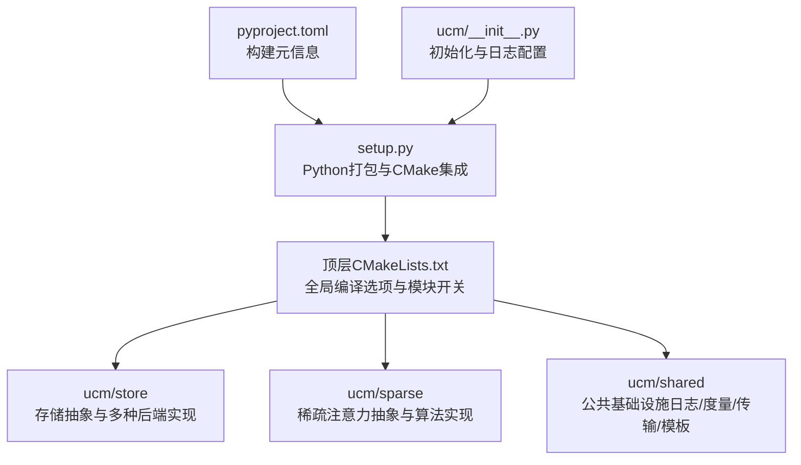
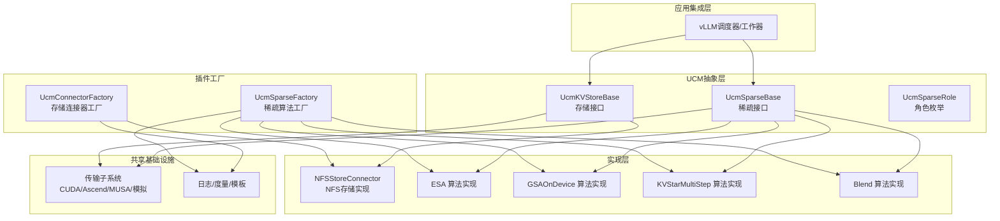
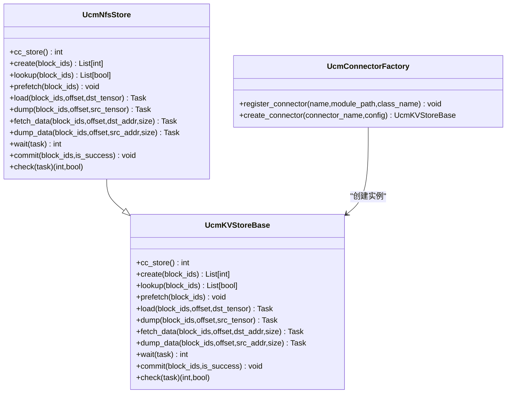
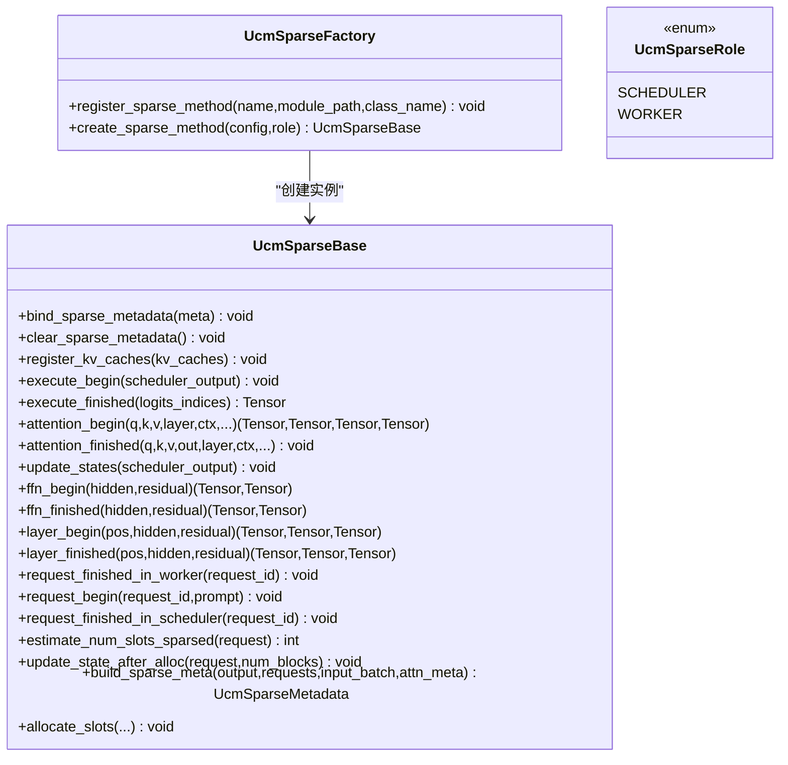
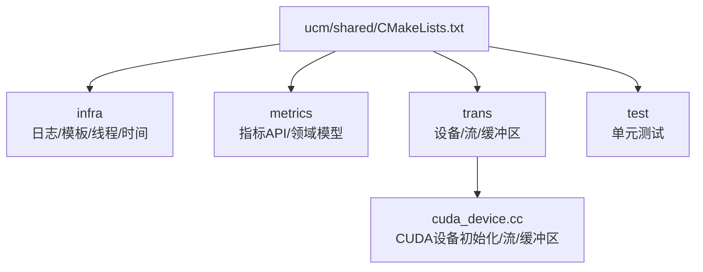
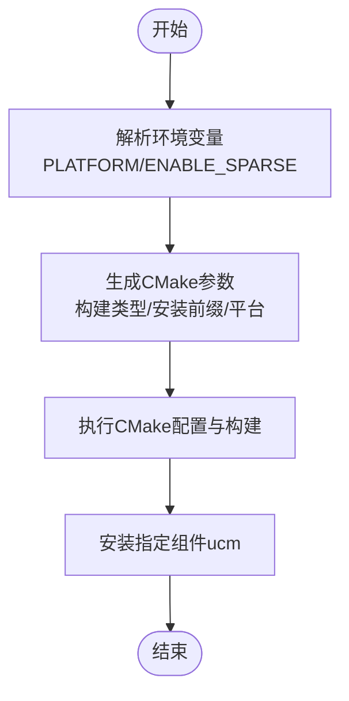
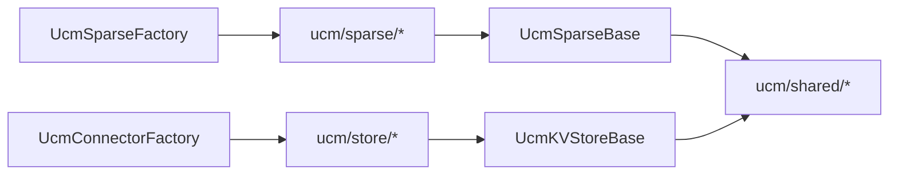

# 代码结构与架构

<cite>
**本文引用的文件**
- [CMakeLists.txt](file://CMakeLists.txt)
- [setup.py](file://setup.py)
- [pyproject.toml](file://pyproject.toml)
- [README.md](file://README.md)
- [ucm/__init__.py](file://ucm/__init__.py)
- [ucm/store/factory.py](file://ucm/store/factory.py)
- [ucm/store/ucmstore.py](file://ucm/store/ucmstore.py)
- [ucm/store/nfsstore/nfsstore_connector.py](file://ucm/store/nfsstore/nfsstore_connector.py)
- [ucm/sparse/factory.py](file://ucm/sparse/factory.py)
- [ucm/sparse/base.py](file://ucm/sparse/base.py)
- [ucm/shared/CMakeLists.txt](file://ucm/shared/CMakeLists.txt)
- [ucm/shared/trans/cuda/cuda_device.cc](file://ucm/shared/trans/cuda/cuda_device.cc)
</cite>

## 目录
1. [引言](#引言)
2. [项目结构](#项目结构)
3. [核心组件](#核心组件)
4. [架构总览](#架构总览)
5. [组件详解](#组件详解)
6. [依赖关系分析](#依赖关系分析)
7. [性能考量](#性能考量)
8. [故障排查指南](#故障排查指南)
9. [结论](#结论)
10. [附录](#附录)

## 引言
本文件面向UCM（Unified Cache Management）项目，系统性梳理其代码结构与架构设计，重点覆盖：
- 分层架构与模块化设计：以“存储抽象层”“稀疏注意力抽象层”“共享基础设施层”为主线。
- 核心目录与职责：ucm/store、ucm/sparse、ucm/shared 等模块的功能定位与边界。
- C++与Python混合组织方式与命名约定：如何在统一工程中协同编译与运行。
- 构建系统与CMakeLists.txt：选项、平台选择、测试开关与子目录组织。
- 接口抽象与插件架构：工厂模式、抽象基类与可扩展点。
- 代码导航与类关系图：帮助开发者快速定位关键类与依赖。
- 架构决策与设计权衡：性能、可移植性与可维护性的取舍。

## 项目结构
UCM采用“Python为主、C++为辅”的混合架构，通过CMake与setuptools构建系统将C++扩展与Python包统一管理。顶层CMakeLists负责全局编译选项与模块开关；setup.py在安装时根据环境变量选择平台并调用CMake完成编译与安装；各子模块（store、sparse、shared）按功能域独立组织，遵循清晰的层次与职责划分。

图表来源
- [CMakeLists.txt](file://CMakeLists.txt#L1-L40)
- [setup.py](file://setup.py#L89-L138)
- [pyproject.toml](file://pyproject.toml#L1-L22)
- [ucm/__init__.py](file://ucm/__init__.py#L25-L49)

章节来源
- [CMakeLists.txt](file://CMakeLists.txt#L1-L40)
- [setup.py](file://setup.py#L89-L138)
- [pyproject.toml](file://pyproject.toml#L1-L22)
- [ucm/__init__.py](file://ucm/__init__.py#L25-L49)

## 核心组件
- 存储抽象层（ucm/store）
  - 抽象接口：UcmKVStoreBase 定义KV缓存的创建、查找、预取、加载、回写、数据搬运、等待与提交等能力。
  - 工厂注册：UcmConnectorFactory 提供延迟导入与注册机制，支持NFS、PC、Mooncake等多种后端。
  - 典型实现：NFSStoreConnector 将抽象接口映射到底层NFS存储库，封装参数配置与任务句柄。
- 稀疏注意力抽象层（ucm/sparse）
  - 抽象接口：UcmSparseBase 定义调度侧与工作侧的钩子方法，涵盖请求生命周期、注意力前后处理、FFN前后处理、层前后处理等。
  - 角色枚举：UcmSparseRole 区分调度器侧与工作器侧行为。
  - 工厂注册：UcmSparseFactory 基于配置动态创建具体稀疏算法实例（如ESA、GSAOnDevice、KVStarMultiStep、Blend）。
- 共享基础设施层（ucm/shared）
  - 日志/度量/线程/时间/模板等通用组件，支撑store与sparse模块的复用。
  - 传输子系统：按设备抽象（CUDA/Ascend/MUSA/模拟），提供设备、流、缓冲区等基础能力。

章节来源
- [ucm/store/ucmstore.py](file://ucm/store/ucmstore.py#L39-L205)
- [ucm/store/factory.py](file://ucm/store/factory.py#L34-L71)
- [ucm/store/nfsstore/nfsstore_connector.py](file://ucm/store/nfsstore/nfsstore_connector.py#L39-L132)
- [ucm/sparse/base.py](file://ucm/sparse/base.py#L127-L323)
- [ucm/sparse/factory.py](file://ucm/sparse/factory.py#L13-L57)
- [ucm/shared/CMakeLists.txt](file://ucm/shared/CMakeLists.txt#L1-L6)

## 架构总览
UCM的整体架构围绕“抽象接口 + 插件工厂 + 设备无关传输”展开。上层业务（如vLLM集成）仅依赖抽象接口；通过工厂注入不同实现，即可切换存储后端或稀疏算法。共享层提供跨平台的传输与基础设施能力，确保在CUDA、Ascend、MUSA等环境下保持一致的编程模型。

图表来源
- [ucm/store/ucmstore.py](file://ucm/store/ucmstore.py#L39-L205)
- [ucm/sparse/base.py](file://ucm/sparse/base.py#L127-L323)
- [ucm/sparse/factory.py](file://ucm/sparse/factory.py#L13-L57)
- [ucm/store/factory.py](file://ucm/store/factory.py#L34-L71)
- [ucm/store/nfsstore/nfsstore_connector.py](file://ucm/store/nfsstore/nfsstore_connector.py#L39-L132)

## 组件详解

### 存储抽象与工厂（ucm/store）
- UcmKVStoreBase
  - 职责：定义KV缓存的全生命周期操作接口，屏蔽底层存储差异。
  - 关键方法族：创建/查找/预取、加载/回写、数据搬运、等待/检查、提交。
- UcmConnectorFactory
  - 职责：基于名称注册延迟导入的连接器类，按需加载具体实现。
  - 注册项：NFS、PC、Mooncake等连接器。
- NFSStoreConnector
  - 职责：将抽象接口映射到底层NFS存储库，封装参数解析、任务句柄与错误处理。

图表来源
- [ucm/store/ucmstore.py](file://ucm/store/ucmstore.py#L39-L205)
- [ucm/store/factory.py](file://ucm/store/factory.py#L34-L71)
- [ucm/store/nfsstore/nfsstore_connector.py](file://ucm/store/nfsstore/nfsstore_connector.py#L39-L132)

章节来源
- [ucm/store/ucmstore.py](file://ucm/store/ucmstore.py#L39-L205)
- [ucm/store/factory.py](file://ucm/store/factory.py#L34-L71)
- [ucm/store/nfsstore/nfsstore_connector.py](file://ucm/store/nfsstore/nfsstore_connector.py#L39-L132)

### 稀疏注意力抽象与工厂（ucm/sparse）
- UcmSparseBase
  - 职责：为稀疏注意力算法提供统一接口，覆盖调度侧与工作侧的多个钩子点。
  - 方法族：请求生命周期钩子、注意力前后处理、FFN与层前后处理、状态更新与槽位分配等。
- UcmSparseRole
  - 职责：区分调度器侧（SCHEDULER）与工作器侧（WORKER）行为。
- UcmSparseFactory
  - 职责：从配置中读取算法名，延迟导入并创建具体算法实例。
  - 注册项：ESA、GSAOnDevice、KVStarMultiStep、Blend。

图表来源
- [ucm/sparse/base.py](file://ucm/sparse/base.py#L127-L323)
- [ucm/sparse/factory.py](file://ucm/sparse/factory.py#L13-L57)

章节来源
- [ucm/sparse/base.py](file://ucm/sparse/base.py#L127-L323)
- [ucm/sparse/factory.py](file://ucm/sparse/factory.py#L13-L57)

### 共享基础设施与传输（ucm/shared）
- 结构：按功能域拆分子目录（infra、metrics、trans、test），CMakeLists统一聚合。
- 传输子系统：按设备抽象（CUDA/Ascend/MUSA/模拟），提供设备、流、缓冲区等基础设施。
- 示例：CUDA设备初始化、CPU亲和设置、流与缓冲区创建等。

图表来源
- [ucm/shared/CMakeLists.txt](file://ucm/shared/CMakeLists.txt#L1-L6)
- [ucm/shared/trans/cuda/cuda_device.cc](file://ucm/shared/trans/cuda/cuda_device.cc#L41-L82)

章节来源
- [ucm/shared/CMakeLists.txt](file://ucm/shared/CMakeLists.txt#L1-L6)
- [ucm/shared/trans/cuda/cuda_device.cc](file://ucm/shared/trans/cuda/cuda_device.cc#L41-L82)

### 构建系统与CMakeLists
- 顶层CMakeLists
  - 设置C++标准、导出编译命令、构建类型标志、平台环境变量。
  - 提供模块开关（BUILD_UCM_STORE、BUILD_UCM_SPARSE、BUILD_UNIT_TESTS、BUILD_NUMA）、下载依赖开关。
  - 条件启用子目录（ucm与test）。
- setup.py
  - 通过CMakeExtension与CMakeBuild集成，支持可编辑安装与多平台选择（CUDA/Ascend/MUSA/MACA/模拟）。
  - 根据环境变量ENABLE_SPARSE控制是否启用稀疏模块。
- pyproject.toml
  - 指定构建后端与项目元信息。

图表来源
- [setup.py](file://setup.py#L89-L138)
- [CMakeLists.txt](file://CMakeLists.txt#L9-L31)

章节来源
- [CMakeLists.txt](file://CMakeLists.txt#L9-L31)
- [setup.py](file://setup.py#L89-L138)
- [pyproject.toml](file://pyproject.toml#L1-L22)

## 依赖关系分析
- 组件耦合
  - store与sparse均依赖抽象接口（UcmKVStoreBase、UcmSparseBase），通过工厂解耦具体实现。
  - shared层为store与sparse提供通用能力，避免重复实现。
- 外部依赖
  - Python侧：torch、vllm相关模块（在稀疏算法与集成中使用）。
  - C++侧：CUDA/Ascend/MUSA/NVML等设备与运行时库（由传输子系统封装）。
- 循环依赖
  - 通过抽象接口与工厂模式避免直接循环依赖；具体实现仅依赖抽象。

图表来源
- [ucm/sparse/base.py](file://ucm/sparse/base.py#L127-L323)
- [ucm/store/ucmstore.py](file://ucm/store/ucmstore.py#L39-L205)
- [ucm/store/factory.py](file://ucm/store/factory.py#L34-L71)
- [ucm/sparse/factory.py](file://ucm/sparse/factory.py#L13-L57)

章节来源
- [ucm/sparse/base.py](file://ucm/sparse/base.py#L127-L323)
- [ucm/store/ucmstore.py](file://ucm/store/ucmstore.py#L39-L205)
- [ucm/store/factory.py](file://ucm/store/factory.py#L34-L71)
- [ucm/sparse/factory.py](file://ucm/sparse/factory.py#L13-L57)

## 性能考量
- 并发与异步
  - 通过任务句柄（Task）与等待/检查接口实现异步传输，减少阻塞。
  - 传输子系统提供多流/多缓冲策略，提升吞吐。
- 设备无关性
  - 通过设备抽象（CUDA/Ascend/MUSA/模拟）屏蔽硬件差异，便于在不同平台上优化。
- 预取与批处理
  - 存储接口支持批量分配、查找与提交，降低系统调用开销。
- 可选构建
  - 通过CMake选项按需启用模块与测试，避免不必要的编译与链接成本。

## 故障排查指南
- 平台未设置警告
  - 当未设置PLATFORM时，安装脚本会打印警告提示，建议明确指定平台或在CI场景下正确配置。
- 运行时环境选择
  - RUNTIME_ENVIRONMENT影响编译与运行时行为，需与实际部署环境一致。
- 存储初始化失败
  - NFSStoreConnector在初始化失败时抛出异常，需检查配置参数（如存储后端路径、块大小、设备ID、IO参数等）。
- 稀疏算法不可用
  - 若工厂未注册或配置不匹配，创建实例会抛出异常，需确认算法名称与注册项一致。

章节来源
- [setup.py](file://setup.py#L41-L66)
- [CMakeLists.txt](file://CMakeLists.txt#L14-L14)
- [ucm/store/nfsstore/nfsstore_connector.py](file://ucm/store/nfsstore/nfsstore_connector.py#L67-L71)
- [ucm/sparse/factory.py](file://ucm/sparse/factory.py#L30-L44)

## 结论
UCM通过清晰的分层与抽象接口，实现了存储与稀疏注意力的高可扩展性；借助工厂模式与CMake/Python构建系统，兼顾了多平台与多模块的统一管理。该架构在保证性能的同时，提供了良好的可维护性与可演进性，适合在长序列推理与多硬件平台上持续迭代。

## 附录
- 快速导航
  - 存储抽象与工厂：[ucm/store/ucmstore.py](file://ucm/store/ucmstore.py#L39-L205)、[ucm/store/factory.py](file://ucm/store/factory.py#L34-L71)
  - 稀疏抽象与工厂：[ucm/sparse/base.py](file://ucm/sparse/base.py#L127-L323)、[ucm/sparse/factory.py](file://ucm/sparse/factory.py#L13-L57)
  - 共享基础设施：[ucm/shared/CMakeLists.txt](file://ucm/shared/CMakeLists.txt#L1-L6)
  - 构建系统：[CMakeLists.txt](file://CMakeLists.txt#L1-L40)、[setup.py](file://setup.py#L89-L138)、[pyproject.toml](file://pyproject.toml#L1-L22)
- 架构背景与特性概览：参见 [README.md](file://README.md#L14-L66)