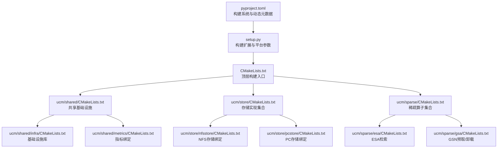
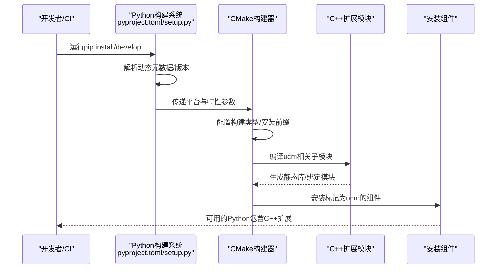
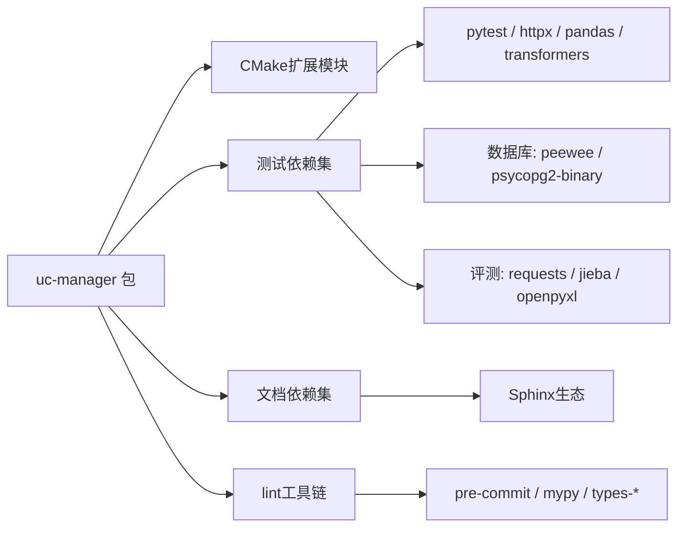
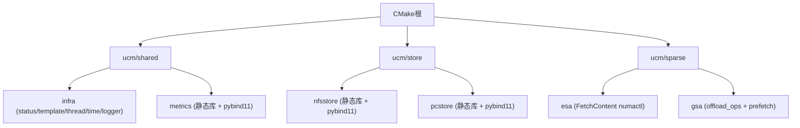

# 依赖管理与版本控制

<cite>
**本文引用的文件**
- [pyproject.toml](file://pyproject.toml)
- [setup.py](file://setup.py)
- [requirements-lint.txt](file://requirements-lint.txt)
- [test\requirements.txt](file://test\requirements.txt)
- [docs\requirements-docs.txt](file://docs\requirements-docs.txt)
- [requirements.txt](file://requirements.txt)
- [CMakeLists.txt](file://CMakeLists.txt)
- [ucm\shared\CMakeLists.txt](file://ucm\shared\CMakeLists.txt)
- [ucm\sparse\CMakeLists.txt](file://ucm\sparse\CMakeLists.txt)
- [ucm\store\CMakeLists.txt](file://ucm\store\CMakeLists.txt)
- [ucm\shared\infra\CMakeLists.txt](file://ucm\shared\infra\CMakeLists.txt)
- [ucm\shared\metrics\CMakeLists.txt](file://ucm\shared\metrics\CMakeLists.txt)
- [ucm\sparse\esa\CMakeLists.txt](file://ucm\sparse\esa\CMakeLists.txt)
- [ucm\sparse\gsa\CMakeLists.txt](file://ucm\sparse\gsa\CMakeLists.txt)
- [ucm\store\nfsstore\CMakeLists.txt](file://ucm\store\nfsstore\CMakeLists.txt)
- [ucm\store\pcstore\CMakeLists.txt](file://ucm\store\pcstore\CMakeLists.txt)
- [ucm\sandbox\sparse\retake\requirements.txt](file://ucm\sandbox\sparse\retake\requirements.txt)
</cite>

## 目录
1. [简介](#简介)
2. [项目结构](#项目结构)
3. [核心组件](#核心组件)
4. [架构总览](#架构总览)
5. [详细组件分析](#详细组件分析)
6. [依赖关系分析](#依赖关系分析)
7. [性能考量](#性能考量)
8. [故障排查指南](#故障排查指南)
9. [结论](#结论)
10. [附录](#附录)

## 简介
本文件系统化梳理UCM项目的依赖管理与版本控制策略，覆盖Python与C++双栈依赖、版本约束、第三方库集成、版本兼容性与服务发现机制、依赖更新与升级最佳实践、冲突诊断与解决方法，以及CI/CD流水线中的依赖管理策略。目标是帮助开发者在不同平台（CUDA/Ascend/MUSA/MACA/模拟）与功能模块（存储、稀疏算子、指标等）下稳定复现构建与测试。

## 项目结构
UCM采用“Python包 + CMake扩展”的混合构建体系：
- Python侧通过pyproject与setup定义构建后端、动态依赖与可选依赖，并在安装时触发CMake编译C++扩展。
- CMake负责C/C++子模块的组织与第三方依赖拉取/编译，按平台与特性开关进行条件构建。
- 各功能域（store、sparse、shared）以独立CMake子目录组织，便于按需启用与隔离。

图表来源
- [pyproject.toml](file://pyproject.toml#L1-L22)
- [setup.py](file://setup.py#L140-L153)
- [CMakeLists.txt](file://CMakeLists.txt#L1-L40)
- [ucm\shared\CMakeLists.txt](file://ucm\shared\CMakeLists.txt#L1-L6)
- [ucm\store\CMakeLists.txt](file://ucm\store\CMakeLists.txt#L1-L15)
- [ucm\sparse\CMakeLists.txt](file://ucm\sparse\CMakeLists.txt#L1-L5)
- [ucm\shared\infra\CMakeLists.txt](file://ucm\shared\infra\CMakeLists.txt#L1-L19)
- [ucm\shared\metrics\CMakeLists.txt](file://ucm\shared\metrics\CMakeLists.txt#L1-L16)
- [ucm\store\nfsstore\CMakeLists.txt](file://ucm\store\nfsstore\CMakeLists.txt#L1-L20)
- [ucm\store\pcstore\CMakeLists.txt](file://ucm\store\pcstore\CMakeLists.txt#L1-L18)
- [ucm\sparse\esa\CMakeLists.txt](file://ucm\sparse\esa\CMakeLists.txt#L1-L51)
- [ucm\sparse\gsa\CMakeLists.txt](file://ucm\sparse\gsa\CMakeLists.txt#L1-L3)

章节来源
- [pyproject.toml](file://pyproject.toml#L1-L22)
- [setup.py](file://setup.py#L140-L153)
- [CMakeLists.txt](file://CMakeLists.txt#L1-L40)

## 核心组件
- 构建系统与动态依赖
  - 使用setuptools作为构建后端，要求CMake≥3.18与wheel，Python版本要求≥3.10。
  - 动态字段声明为version、dependencies、optional-dependencies，实际版本与依赖在运行期由构建脚本注入。
- 平台与特性开关
  - 通过环境变量PLATFORM选择运行环境（cuda/ascend/musa/maca/simu），并在CMake中转换为RUNTIME_ENVIRONMENT。
  - 通过ENABLE_SPARSE开启稀疏模块构建；可选BUILD_NUMA用于ESA检索的NUMA支持。
- CMake扩展与安装组件
  - 自定义CMakeBuild命令，统一配置Release构建、Python可执行路径与安装前缀。
  - 安装阶段仅安装标记为“ucm”的组件，确保Python包仅包含必要的二进制与资源。

章节来源
- [pyproject.toml](file://pyproject.toml#L1-L22)
- [setup.py](file://setup.py#L89-L138)
- [CMakeLists.txt](file://CMakeLists.txt#L9-L14)

## 架构总览
下图展示从Python安装到C++扩展构建的关键流程与依赖交互：

图表来源
- [setup.py](file://setup.py#L89-L138)
- [CMakeLists.txt](file://CMakeLists.txt#L36-L40)

## 详细组件分析

### Python依赖与版本约束
- 构建与开发工具
  - lint工具链：pre-commit、mypy及若干types-*包，版本固定以保证格式与类型检查一致性。
- 测试依赖
  - 测试框架与覆盖率：pytest及其HTML报告插件。
  - 数据库与LLM评测：peewee、psycopg2-binary、requests、pandas、pydantic、transformers、httpx等。
  - 评测任务：jieba、openpyxl等。
- 文档依赖
  - Sphinx系列主题与扩展、msgspec、国际化等。
- 示例沙盒依赖
  - torch、transformers、flash-attn、accelerate、OpenCV、Pandas、OpenAI SDK等，版本严格锁定以确保演示稳定性。

章节来源
- [requirements-lint.txt](file://requirements-lint.txt#L1-L9)
- [test\requirements.txt](file://test\requirements.txt#L1-L18)
- [docs\requirements-docs.txt](file://docs\requirements-docs.txt#L1-L10)
- [ucm\sandbox\sparse\retake\requirements.txt](file://ucm\sandbox\sparse\retake\requirements.txt#L1-L13)

### C++依赖与第三方库集成
- 顶层构建与选项
  - 最低CMake版本3.18，C++17标准，导出compile_commands.json便于IDE与静态分析。
  - 关键选项：BUILD_UCM_STORE/BUILD_UCM_SPARSE/BUILD_UNIT_TESTS/BUILD_NUMA/DOWNLOAD_DEPENDENCE，以及RUNTIME_ENVIRONMENT。
- 子模块组织
  - shared：基础设施（状态、模板、线程、时间）、日志、指标绑定。
  - store：存储接口与多实现（NFS、PC、DS3FS、缓存、空、假、Mooncake、Pipeline、POSIX）。
  - sparse：ESA、GSN、GSN On Device、KVStar等稀疏能力。
- 第三方依赖拉取与链接
  - 通过FetchContent在需要时下载并本地构建numactl（仅当BUILD_NUMA启用）。
  - 通过target_link_libraries链接fmt等外部库；pybind11用于Python绑定模块。
- 平台适配
  - 通过RUNTIME_ENVIRONMENT切换设备抽象层（CUDA/Ascend/MUSA/MACA/模拟），影响编译宏与设备实现选择。

章节来源
- [CMakeLists.txt](file://CMakeLists.txt#L1-L40)
- [ucm\shared\CMakeLists.txt](file://ucm\shared\CMakeLists.txt#L1-L6)
- [ucm\store\CMakeLists.txt](file://ucm\store\CMakeLists.txt#L1-L15)
- [ucm\sparse\CMakeLists.txt](file://ucm\sparse\CMakeLists.txt#L1-L5)
- [ucm\shared\infra\CMakeLists.txt](file://ucm\shared\infra\CMakeLists.txt#L1-L19)
- [ucm\shared\metrics\CMakeLists.txt](file://ucm\shared\metrics\CMakeLists.txt#L1-L16)
- [ucm\sparse\esa\CMakeLists.txt](file://ucm\sparse\esa\CMakeLists.txt#L1-L51)
- [ucm\store\nfsstore\CMakeLists.txt](file://ucm\store\nfsstore\CMakeLists.txt#L1-L20)
- [ucm\store\pcstore\CMakeLists.txt](file://ucm\store\pcstore\CMakeLists.txt#L1-L18)

### 版本兼容性管理
- Python
  - Python版本要求≥3.10；动态声明dependencies/optional-dependencies，建议在CI中使用锁定文件或PEP 621兼容的锁定工具。
- C++与平台
  - RUNTIME_ENVIRONMENT决定设备抽象层与编译宏，确保同一套源码在不同硬件上正确编译。
  - BUILD_NUMA仅在需要时启用，避免非目标平台的构建失败。
- 绑定模块
  - pybind11_add_module生成的Python绑定模块与C++库通过显式target_link_libraries关联，降低ABI不匹配风险。

章节来源
- [pyproject.toml](file://pyproject.toml#L15-L16)
- [setup.py](file://setup.py#L112-L124)
- [CMakeLists.txt](file://CMakeLists.txt#L9-L14)
- [ucm\shared\metrics\CMakeLists.txt](file://ucm\shared\metrics\CMakeLists.txt#L9-L10)

### 服务发现机制
- 当前代码库未实现通用的服务发现组件或注册中心。各模块通过CMake子目录与显式target_link_libraries进行耦合，属于静态链接与编译期绑定。
- 若未来引入服务发现，建议：
  - 在CMake中新增可选组件与安装规则；
  - 在Python层通过扩展模块导入对应组件；
  - 在CI中对可选组件进行可选测试矩阵。

（本节为概念性说明，不直接分析具体文件）

## 依赖关系分析

### Python依赖层次

图表来源
- [setup.py](file://setup.py#L140-L153)
- [test\requirements.txt](file://test\requirements.txt#L1-L18)
- [docs\requirements-docs.txt](file://docs\requirements-docs.txt#L1-L10)
- [requirements-lint.txt](file://requirements-lint.txt#L1-L9)

### C++子模块依赖

图表来源
- [CMakeLists.txt](file://CMakeLists.txt#L36-L40)
- [ucm\shared\CMakeLists.txt](file://ucm\shared\CMakeLists.txt#L1-L6)
- [ucm\store\CMakeLists.txt](file://ucm\store\CMakeLists.txt#L1-L15)
- [ucm\sparse\CMakeLists.txt](file://ucm\sparse\CMakeLists.txt#L1-L5)
- [ucm\shared\infra\CMakeLists.txt](file://ucm\shared\infra\CMakeLists.txt#L1-L19)
- [ucm\shared\metrics\CMakeLists.txt](file://ucm\shared\metrics\CMakeLists.txt#L1-L16)
- [ucm\store\nfsstore\CMakeLists.txt](file://ucm\store\nfsstore\CMakeLists.txt#L1-L20)
- [ucm\store\pcstore\CMakeLists.txt](file://ucm\store\pcstore\CMakeLists.txt#L1-L18)
- [ucm\sparse\esa\CMakeLists.txt](file://ucm\sparse\esa\CMakeLists.txt#L1-L51)
- [ucm\sparse\gsa\CMakeLists.txt](file://ucm\sparse\gsa\CMakeLists.txt#L1-L3)

## 性能考量
- CMake构建优化
  - Release模式默认启用-O3与_FORTIFY_SOURCE增强，适合生产部署。
  - Debug模式启用-O0与-g，便于本地调试。
- 平台选择
  - 在非CI场景必须设置PLATFORM，否则会打印警告并可能影响功能可用性。
- 绑定模块加载
  - 通过显式target_link_libraries减少运行时解析开销，提升模块加载效率。

章节来源
- [CMakeLists.txt](file://CMakeLists.txt#L23-L31)
- [setup.py](file://setup.py#L41-L66)

## 故障排查指南
- 平台未设置
  - 现象：安装时输出平台警告。
  - 处理：在非CI场景设置环境变量PLATFORM为cuda/ascend/musa/maca之一。
- 构建失败（CUDA/设备相关）
  - 确认CMake最低版本与Python版本满足要求。
  - 检查RUNTIME_ENVIRONMENT是否与目标平台一致。
- NUMA相关构建失败（ESA）
  - 现象：BUILD_NUMA启用但系统缺少构建工具链。
  - 处理：关闭BUILD_NUMA或安装系统级构建依赖。
- 绑定模块缺失
  - 确认安装组件包含标记为“ucm”的目标，且安装前缀正确。
- 依赖冲突
  - Python：使用虚拟环境隔离不同需求；在CI中使用锁定文件。
  - C++：避免重复拉取同一第三方库；优先通过FetchContent集中管理。

章节来源
- [setup.py](file://setup.py#L41-L66)
- [setup.py](file://setup.py#L109-L124)
- [ucm\sparse\esa\CMakeLists.txt](file://ucm\sparse\esa\CMakeLists.txt#L1-L51)
- [ucm\shared\metrics\CMakeLists.txt](file://ucm\shared\metrics\CMakeLists.txt#L15-L16)

## 结论
UCM通过“Python动态元数据 + CMake子模块化”的方式实现了跨平台、可扩展的依赖与版本控制。Python侧以锁定文件与动态字段配合，C++侧以选项与FetchContent实现按需依赖与平台适配。建议在CI中统一锁定Python依赖与CMake选项，确保可复现性与稳定性。

## 附录

### 依赖更新与升级最佳实践
- Python
  - 使用锁定文件（如pip-tools/deptry/pipx）管理依赖版本；定期扫描安全漏洞。
  - 对可选依赖（如BUILD_UCM_SPARSE）在CI中增加可选矩阵测试。
- C++
  - 通过FetchContent集中管理第三方库版本；为每个子模块设定明确的依赖边界。
  - 在CMake中添加版本校验与降级策略，避免上游变更导致的构建失败。

（本节为通用指导，不直接分析具体文件）

### CI/CD流水线中的依赖管理策略
- Python
  - 使用requirements-lint.txt与test/requirements.txt分别管理lint与测试依赖。
  - 在构建阶段固定Python版本与pip版本，使用--no-deps或--force-reinstall确保一致性。
- C++
  - 在CI中缓存CMake构建产物与FetchContent下载内容，加速重复作业。
  - 为不同平台（CUDA/Ascend/MUSA/MACA）分别配置构建矩阵，固定RUNTIME_ENVIRONMENT与相关工具链版本。

章节来源
- [requirements-lint.txt](file://requirements-lint.txt#L1-L9)
- [test\requirements.txt](file://test\requirements.txt#L1-L18)
- [CMakeLists.txt](file://CMakeLists.txt#L1-L40)
- [setup.py](file://setup.py#L109-L124)