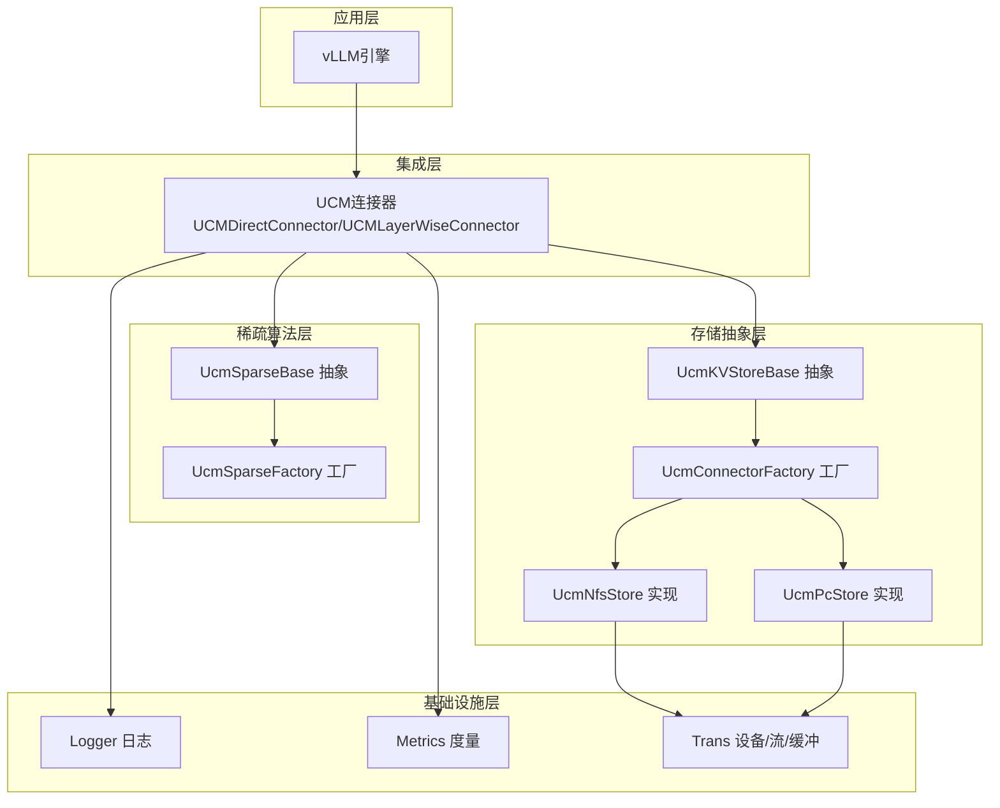
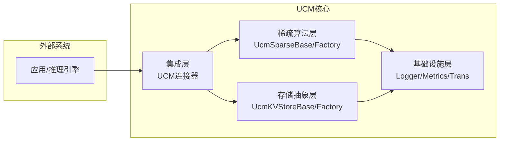
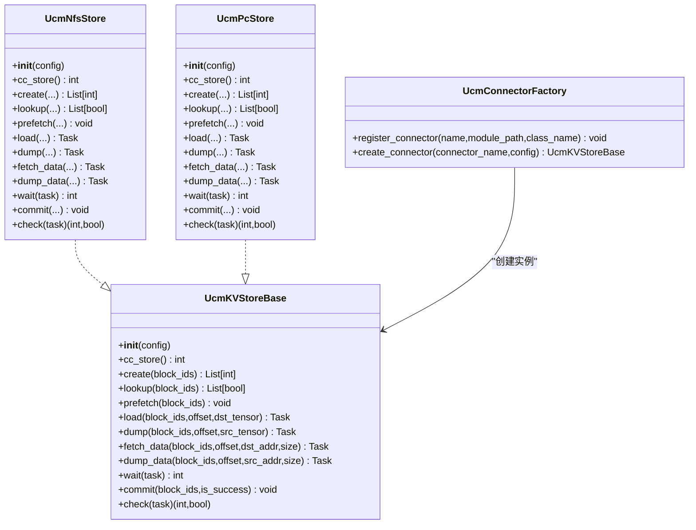
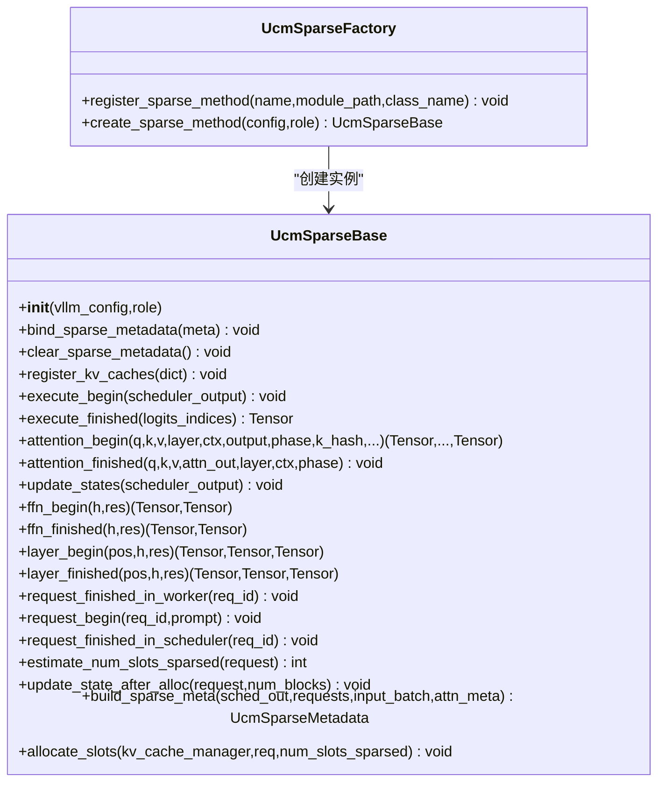
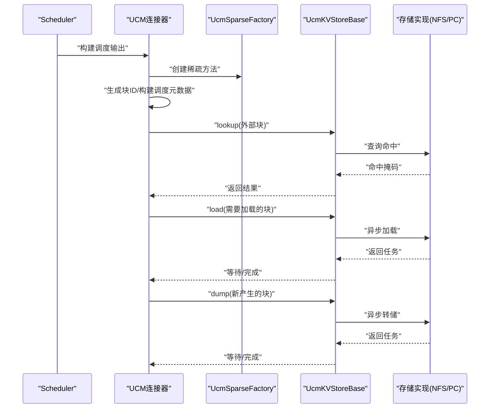
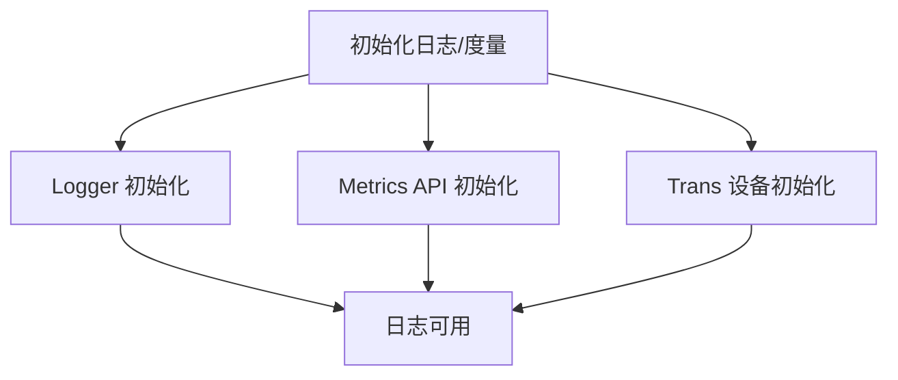
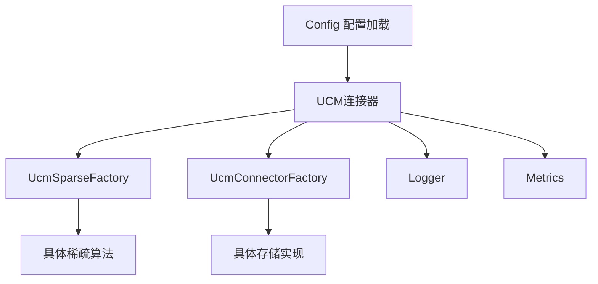

# 整体架构设计

<cite>
**本文引用的文件**
- [README.md](file://README.md)
- [ucm/__init__.py](file://ucm/__init__.py)
- [ucm/utils.py](file://ucm/utils.py)
- [ucm/logger.py](file://ucm/logger.py)
- [ucm/store/ucmstore.py](file://ucm/store/ucmstore.py)
- [ucm/store/factory.py](file://ucm/store/factory.py)
- [ucm/store/nfsstore/nfsstore_connector.py](file://ucm/store/nfsstore/nfsstore_connector.py)
- [ucm/store/pcstore/pcstore_connector.py](file://ucm/store/pcstore/pcstore_connector.py)
- [ucm/sparse/base.py](file://ucm/sparse/base.py)
- [ucm/sparse/factory.py](file://ucm/sparse/factory.py)
- [ucm/integration/vllm/ucm_connector.py](file://ucm/integration/vllm/ucm_connector.py)
- [ucm/shared/trans/cuda/cuda_device.cc](file://ucm/shared/trans/cuda/cuda_device.cc)
- [ucm/shared/metrics/cc/api/metrics_api.cc](file://ucm/shared/metrics/cc/api/metrics_api.cc)
</cite>

## 目录
1. [引言](#引言)
2. [项目结构](#项目结构)
3. [核心组件](#核心组件)
4. [架构总览](#架构总览)
5. [详细组件分析](#详细组件分析)
6. [依赖关系分析](#依赖关系分析)
7. [性能考虑](#性能考虑)
8. [故障排查指南](#故障排查指南)
9. [结论](#结论)

## 引言
本文件面向UCM（Unified Cache Manager）项目的整体架构设计，系统阐述其分层架构模式与插件化扩展机制。UCM通过“存储抽象层”“稀疏算法层”“集成层”“基础设施层”的清晰分层，实现KV缓存持久化与多策略稀疏注意力的统一接入，并与vLLM进行深度集成以降低推理延迟、提升长序列任务吞吐。本文将从架构视角解释各层职责、组件边界、依赖关系与交互模式，并给出系统级图示与关键流程时序图，帮助读者快速理解并扩展该框架。

## 项目结构
UCM采用按功能域划分的模块化组织方式：
- 存储层：抽象KV存储接口与多种后端实现（NFS、PC等）
- 稀疏算法层：稀疏注意力算法的统一基类与工厂注册
- 集成层：与vLLM的连接器，负责调度与执行阶段的KV加载/保存
- 基础设施层：日志、度量、设备与传输抽象

图表来源
- [ucm/integration/vllm/ucm_connector.py](file://ucm/integration/vllm/ucm_connector.py#L82-L166)
- [ucm/sparse/base.py](file://ucm/sparse/base.py#L127-L323)
- [ucm/sparse/factory.py](file://ucm/sparse/factory.py#L13-L57)
- [ucm/store/ucmstore.py](file://ucm/store/ucmstore.py#L39-L205)
- [ucm/store/factory.py](file://ucm/store/factory.py#L34-L71)
- [ucm/store/nfsstore/nfsstore_connector.py](file://ucm/store/nfsstore/nfsstore_connector.py#L39-L132)
- [ucm/store/pcstore/pcstore_connector.py](file://ucm/store/pcstore/pcstore_connector.py#L39-L115)
- [ucm/logger.py](file://ucm/logger.py#L40-L84)
- [ucm/shared/metrics/cc/api/metrics_api.cc](file://ucm/shared/metrics/cc/api/metrics_api.cc#L24-L52)
- [ucm/shared/trans/cuda/cuda_device.cc](file://ucm/shared/trans/cuda/cuda_device.cc#L31-L83)

章节来源
- [README.md](file://README.md#L14-L54)
- [ucm/__init__.py](file://ucm/__init__.py#L25-L49)

## 核心组件
- 存储抽象层
  - UcmKVStoreBase：定义KV缓存的创建、查找、预取、加载、转储、等待、提交、检查等接口，屏蔽不同后端差异
  - UcmConnectorFactory：基于名称注册与延迟导入，动态创建具体存储实现（如NFS、PC）
  - 具体实现：UcmNfsStore、UcmPcStore等，封装底层存储库并实现UcmKVStoreBase
- 稀疏算法层
  - UcmSparseBase：定义调度侧与工作侧的钩子接口，支持多种稀疏注意力算法
  - UcmSparseFactory：注册并按配置选择具体稀疏方法（如ESA、GSAOnDevice、KVStarMultiStep、Blend）
- 集成层
  - UCMDirectConnector/UCMLayerWiseConnector：与vLLM KVConnectorBase_V1对接，负责请求块ID生成、调度元数据构建、加载/保存KV缓存
- 基础设施层
  - Logger：统一日志输出与落盘
  - Metrics：统计与上报（含C++ API）
  - Trans：设备/流/缓冲抽象，支持CUDA/NPU等平台

章节来源
- [ucm/store/ucmstore.py](file://ucm/store/ucmstore.py#L39-L205)
- [ucm/store/factory.py](file://ucm/store/factory.py#L34-L71)
- [ucm/store/nfsstore/nfsstore_connector.py](file://ucm/store/nfsstore/nfsstore_connector.py#L39-L132)
- [ucm/store/pcstore/pcstore_connector.py](file://ucm/store/pcstore/pcstore_connector.py#L39-L115)
- [ucm/sparse/base.py](file://ucm/sparse/base.py#L127-L323)
- [ucm/sparse/factory.py](file://ucm/sparse/factory.py#L13-L57)
- [ucm/integration/vllm/ucm_connector.py](file://ucm/integration/vllm/ucm_connector.py#L82-L166)
- [ucm/logger.py](file://ucm/logger.py#L40-L84)
- [ucm/shared/metrics/cc/api/metrics_api.cc](file://ucm/shared/metrics/cc/api/metrics_api.cc#L24-L52)
- [ucm/shared/trans/cuda/cuda_device.cc](file://ucm/shared/trans/cuda/cuda_device.cc#L31-L83)

## 架构总览
UCM采用“存储抽象+稀疏算法+集成适配+基础设施”的分层架构，强调：
- 解耦：存储与算法解耦，通过抽象接口统一接入
- 可插拔：工厂注册机制支持新增存储或稀疏算法
- 可观测：日志与度量贯穿运行期
- 可扩展：基础设施层提供跨设备能力

图表来源
- [ucm/integration/vllm/ucm_connector.py](file://ucm/integration/vllm/ucm_connector.py#L82-L166)
- [ucm/sparse/base.py](file://ucm/sparse/base.py#L127-L323)
- [ucm/store/ucmstore.py](file://ucm/store/ucmstore.py#L39-L205)
- [ucm/logger.py](file://ucm/logger.py#L40-L84)
- [ucm/shared/metrics/cc/api/metrics_api.cc](file://ucm/shared/metrics/cc/api/metrics_api.cc#L24-L52)

## 详细组件分析

### 存储抽象层
- UcmKVStoreBase定义了KV缓存生命周期管理的关键接口，确保不同后端实现的一致行为
- UcmConnectorFactory通过名称映射到模块与类，使用延迟导入避免启动时强耦合
- 具体实现（NFS/PC）封装底层存储库参数与调用，统一返回Task对象用于异步等待

图表来源
- [ucm/store/ucmstore.py](file://ucm/store/ucmstore.py#L39-L205)
- [ucm/store/nfsstore/nfsstore_connector.py](file://ucm/store/nfsstore/nfsstore_connector.py#L39-L132)
- [ucm/store/pcstore/pcstore_connector.py](file://ucm/store/pcstore/pcstore_connector.py#L39-L115)
- [ucm/store/factory.py](file://ucm/store/factory.py#L34-L71)

章节来源
- [ucm/store/ucmstore.py](file://ucm/store/ucmstore.py#L39-L205)
- [ucm/store/factory.py](file://ucm/store/factory.py#L34-L71)
- [ucm/store/nfsstore/nfsstore_connector.py](file://ucm/store/nfsstore/nfsstore_connector.py#L39-L132)
- [ucm/store/pcstore/pcstore_connector.py](file://ucm/store/pcstore/pcstore_connector.py#L39-L115)

### 稀疏算法层
- UcmSparseBase定义调度侧（请求开始/结束、估算槽位、更新状态）与工作侧（模型执行前后、注意力前后、FFN前后、层前后）的钩子，形成统一扩展点
- UcmSparseFactory按配置选择具体稀疏方法，便于在不修改上层逻辑的情况下切换算法

图表来源
- [ucm/sparse/base.py](file://ucm/sparse/base.py#L127-L323)
- [ucm/sparse/factory.py](file://ucm/sparse/factory.py#L13-L57)

章节来源
- [ucm/sparse/base.py](file://ucm/sparse/base.py#L127-L323)
- [ucm/sparse/factory.py](file://ucm/sparse/factory.py#L13-L57)

### 集成层（vLLM连接器）
- UCMDirectConnector/UCMLayerWiseConnector继承自KVConnectorBase_V1，负责：
  - 请求块ID生成与哈希
  - 调度元数据构建（需要加载/转储的块ID）
  - 加载/保存KV缓存（支持K/V分离与MLA/DFA场景）
  - 统计与度量上报
- 通过UcmConnectorFactoryV1创建具体存储实例，支持共享缓冲与分片

图表来源
- [ucm/integration/vllm/ucm_connector.py](file://ucm/integration/vllm/ucm_connector.py#L293-L447)
- [ucm/integration/vllm/ucm_connector.py](file://ucm/integration/vllm/ucm_connector.py#L488-L644)
- [ucm/sparse/factory.py](file://ucm/sparse/factory.py#L30-L44)
- [ucm/store/ucmstore.py](file://ucm/store/ucmstore.py#L71-L125)

章节来源
- [ucm/integration/vllm/ucm_connector.py](file://ucm/integration/vllm/ucm_connector.py#L82-L166)
- [ucm/integration/vllm/ucm_connector.py](file://ucm/integration/vllm/ucm_connector.py#L293-L447)
- [ucm/integration/vllm/ucm_connector.py](file://ucm/integration/vllm/ucm_connector.py#L488-L644)

### 基础设施层
- Logger：统一日志初始化与输出，桥接到底层日志组件
- Metrics：提供C++ API封装，支持统计项创建、更新与清空
- Trans：设备/流/缓冲抽象，支持CUDA/NPU等平台初始化与资源管理

图表来源
- [ucm/logger.py](file://ucm/logger.py#L40-L84)
- [ucm/shared/metrics/cc/api/metrics_api.cc](file://ucm/shared/metrics/cc/api/metrics_api.cc#L24-L52)
- [ucm/shared/trans/cuda/cuda_device.cc](file://ucm/shared/trans/cuda/cuda_device.cc#L31-L83)

章节来源
- [ucm/logger.py](file://ucm/logger.py#L40-L84)
- [ucm/shared/metrics/cc/api/metrics_api.cc](file://ucm/shared/metrics/cc/api/metrics_api.cc#L24-L52)
- [ucm/shared/trans/cuda/cuda_device.cc](file://ucm/shared/trans/cuda/cuda_device.cc#L31-L83)

## 依赖关系分析
- 松耦合的工厂注册：存储与稀疏算法均通过工厂注册，运行时按配置动态创建，避免硬编码依赖
- 接口驱动：所有外部交互通过抽象接口完成，便于替换与扩展
- 配置驱动：Config类从终端输入或YAML文件加载UCM配置，决定连接器与稀疏方法的选择

图表来源
- [ucm/utils.py](file://ucm/utils.py#L34-L91)
- [ucm/integration/vllm/ucm_connector.py](file://ucm/integration/vllm/ucm_connector.py#L125-L130)
- [ucm/sparse/factory.py](file://ucm/sparse/factory.py#L30-L44)
- [ucm/store/factory.py](file://ucm/store/factory.py#L49-L57)

章节来源
- [ucm/utils.py](file://ucm/utils.py#L34-L91)
- [ucm/integration/vllm/ucm_connector.py](file://ucm/integration/vllm/ucm_connector.py#L125-L130)

## 性能考虑
- 并行与重叠
  - 层内重叠：UCMLayerWiseConnector按层加载/保存，减少等待时间
  - 多流与直通：存储实现支持多流与直接IO，提高吞吐
- 缓冲与共享
  - 共享缓冲：PCStore支持本地rank共享，降低重复拷贝
  - 分片与偏移：通过offset与分片大小控制TP场景下的负载均衡
- 统计与可观测
  - 按请求/块统计加载/保存耗时与速度，辅助容量规划与调优
- 设备抽象
  - CUDA/NPU设备初始化与CPU亲和设置，提升设备利用率

章节来源
- [ucm/integration/vllm/ucm_connector.py](file://ucm/integration/vllm/ucm_connector.py#L661-L751)
- [ucm/store/pcstore/pcstore_connector.py](file://ucm/store/pcstore/pcstore_connector.py#L48-L61)
- [ucm/shared/trans/cuda/cuda_device.cc](file://ucm/shared/trans/cuda/cuda_device.cc#L31-L83)

## 故障排查指南
- 连接器创建失败
  - 检查配置中的连接器名称是否已注册；确认模块路径与类名正确
- 加载/转储异常
  - 查看连接器中对store.wait的异常处理与错误块ID集合
  - 关注设备同步调用是否成功
- 稀疏方法未生效
  - 确认配置中ucm_sparse_config键值与工厂注册一致
- 日志与度量
  - 使用Logger输出关键路径信息；结合Metrics统计定位瓶颈

章节来源
- [ucm/store/factory.py](file://ucm/store/factory.py#L49-L57)
- [ucm/integration/vllm/ucm_connector.py](file://ucm/integration/vllm/ucm_connector.py#L522-L544)
- [ucm/integration/vllm/ucm_connector.py](file://ucm/integration/vllm/ucm_connector.py#L617-L627)
- [ucm/sparse/factory.py](file://ucm/sparse/factory.py#L30-L44)
- [ucm/logger.py](file://ucm/logger.py#L40-L84)

## 结论
UCM通过清晰的分层与插件化设计，在不侵入vLLM核心的前提下，实现了KV缓存持久化与多种稀疏注意力策略的统一接入。存储抽象层与稀疏算法层的接口化设计，使得新算法与新存储后端可以低成本接入；集成层与基础设施层提供了稳定的运行期支撑。该架构在性能、可扩展性与可维护性之间取得良好平衡，适合在长序列推理与多模态场景下进一步演进与扩展。