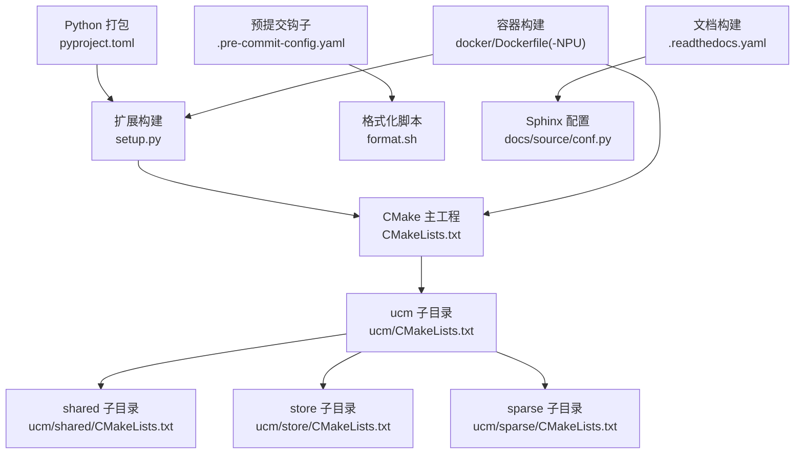
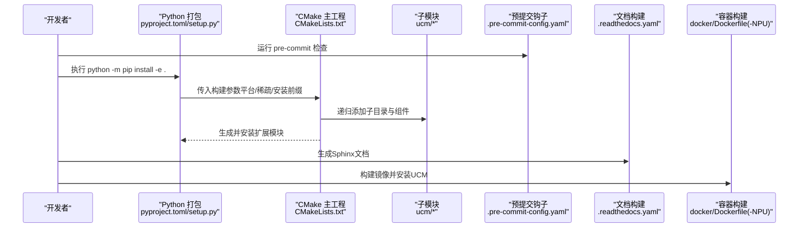
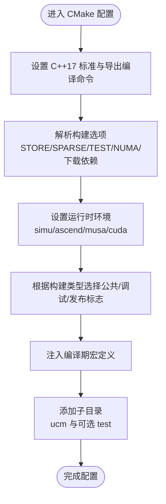
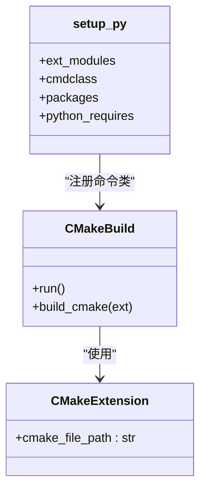
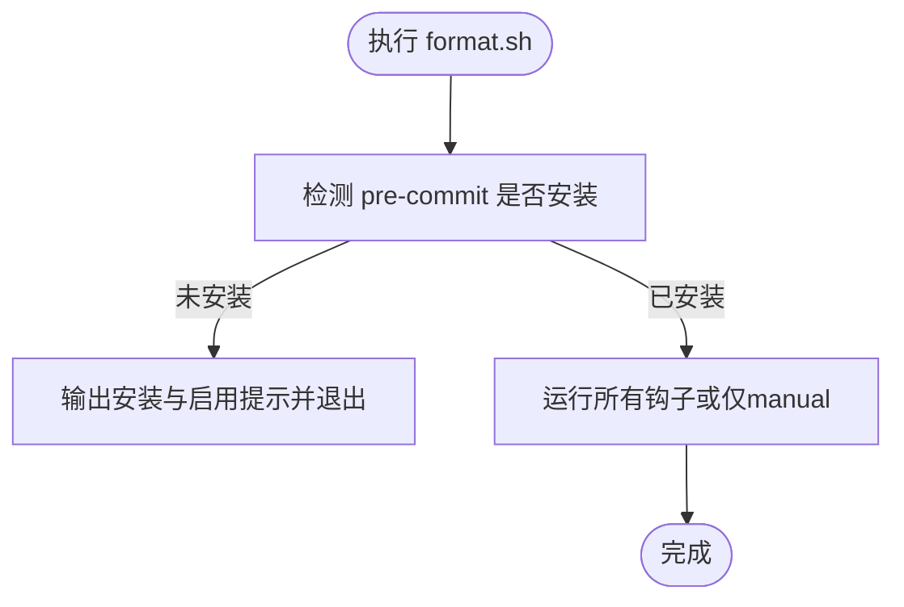
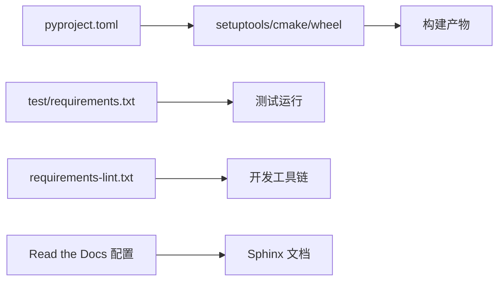

# 构建系统与配置

<cite>
**本文引用的文件**
- [CMakeLists.txt](file://CMakeLists.txt)
- [setup.py](file://setup.py)
- [pyproject.toml](file://pyproject.toml)
- [.pre-commit-config.yaml](file://.pre-commit-config.yaml)
- [format.sh](file://format.sh)
- [requirements-lint.txt](file://requirements-lint.txt)
- [ucm/CMakeLists.txt](file://ucm/CMakeLists.txt)
- [ucm/shared/CMakeLists.txt](file://ucm/shared/CMakeLists.txt)
- [ucm/sparse/CMakeLists.txt](file://ucm/sparse/CMakeLists.txt)
- [ucm/store/CMakeLists.txt](file://ucm/store/CMakeLists.txt)
- [docker/Dockerfile](file://docker/Dockerfile)
- [docker/Dockerfile-NPU](file://docker/Dockerfile-NPU)
- [.readthedocs.yaml](file://.readthedocs.yaml)
- [test/requirements.txt](file://test/requirements.txt)
</cite>

## 目录
1. [简介](#简介)
2. [项目结构](#项目结构)
3. [核心组件](#核心组件)
4. [架构总览](#架构总览)
5. [详细组件分析](#详细组件分析)
6. [依赖关系分析](#依赖关系分析)
7. [性能考虑](#性能考虑)
8. [故障排查指南](#故障排查指南)
9. [结论](#结论)
10. [附录](#附录)

## 简介
本文件面向UCM项目的构建系统与配置，覆盖以下主题：
- CMake构建系统的配置项、编译参数与构建模式（Debug/Release）差异及适用场景
- Python包构建配置（pyproject.toml、setup.py）与依赖管理策略
- 代码格式化与预提交钩子（pre-commit）配置与使用流程
- 不同运行时环境（simu、cuda、ascend、musa、maca）与平台选择（PLATFORM）对构建的影响
- 完整的构建环境搭建步骤与常见问题解决方案
- 跨平台与容器化构建（Docker）以及多平台支持要点

## 项目结构
UCM采用“CMake主工程 + Python扩展构建”的混合构建体系：
- CMake主工程负责C++/CUDA/NVMe等底层模块的编译与安装，并通过CMake扩展机制将产物导出到Python包中
- Python层通过setuptools + CMake后端完成扩展模块的构建与安装，支持按平台选择运行时环境
- 文档与CI/CD通过Read the Docs与Docker镜像进行跨平台复现

图表来源
- [CMakeLists.txt](file://CMakeLists.txt#L1-L40)
- [ucm/CMakeLists.txt](file://ucm/CMakeLists.txt#L1-L8)
- [ucm/shared/CMakeLists.txt](file://ucm/shared/CMakeLists.txt#L1-L6)
- [ucm/store/CMakeLists.txt](file://ucm/store/CMakeLists.txt#L1-L15)
- [ucm/sparse/CMakeLists.txt](file://ucm/sparse/CMakeLists.txt#L1-L5)
- [pyproject.toml](file://pyproject.toml#L1-L22)
- [setup.py](file://setup.py#L89-L138)
- [.pre-commit-config.yaml](file://.pre-commit-config.yaml#L1-L29)
- [format.sh](file://format.sh#L1-L26)
- [.readthedocs.yaml](file://.readthedocs.yaml#L1-L23)
- [docker/Dockerfile](file://docker/Dockerfile#L1-L20)
- [docker/Dockerfile-NPU](file://docker/Dockerfile-NPU#L1-L25)

章节来源
- [CMakeLists.txt](file://CMakeLists.txt#L1-L40)
- [pyproject.toml](file://pyproject.toml#L1-L22)
- [setup.py](file://setup.py#L89-L138)
- [.pre-commit-config.yaml](file://.pre-commit-config.yaml#L1-L29)
- [format.sh](file://format.sh#L1-L26)
- [.readthedocs.yaml](file://.readthedocs.yaml#L1-L23)
- [docker/Dockerfile](file://docker/Dockerfile#L1-L20)
- [docker/Dockerfile-NPU](file://docker/Dockerfile-NPU#L1-L25)

## 核心组件
- CMake主工程：定义语言标准、编译器标志、构建类型、全局宏定义、子目录组织与可选功能开关
- Python扩展构建：通过CMake后端生成并安装扩展模块，支持平台选择与稀疏模块开关
- 预提交与格式化：统一代码风格、拼写检查与静态检查工具链
- 文档与容器：Read the Docs与Docker镜像确保跨平台一致性

章节来源
- [CMakeLists.txt](file://CMakeLists.txt#L1-L40)
- [setup.py](file://setup.py#L89-L138)
- [.pre-commit-config.yaml](file://.pre-commit-config.yaml#L1-L29)
- [format.sh](file://format.sh#L1-L26)
- [.readthedocs.yaml](file://.readthedocs.yaml#L1-L23)

## 架构总览
下图展示从源码到可安装包的关键路径：CMake主工程负责编译与安装；Python打包通过CMake后端完成扩展构建；预提交钩子在本地/CI阶段保证质量；Docker镜像提供一致的构建与集成环境。

图表来源
- [setup.py](file://setup.py#L89-L138)
- [CMakeLists.txt](file://CMakeLists.txt#L1-L40)
- [ucm/CMakeLists.txt](file://ucm/CMakeLists.txt#L1-L8)
- [.pre-commit-config.yaml](file://.pre-commit-config.yaml#L1-L29)
- [.readthedocs.yaml](file://.readthedocs.yaml#L1-L23)
- [docker/Dockerfile](file://docker/Dockerfile#L1-L20)
- [docker/Dockerfile-NPU](file://docker/Dockerfile-NPU#L1-L25)

## 详细组件分析

### CMake 构建系统与编译参数
- 语言与标准
  - 使用C++17标准，启用严格要求与禁用扩展
  - 导出编译命令以便IDE/工具链使用
- 全局编译标志
  - 公共标志包含告警、位置无关代码、安全相关链接标志
  - Debug模式：无优化、带调试符号
  - Release模式：高性能优化、强化_FORTIFY_SOURCE
- 可选功能与开关
  - BUILD_UCM_STORE：是否构建存储模块
  - BUILD_UCM_SPARSE：是否构建稀疏注意力相关模块
  - BUILD_UNIT_TESTS：是否构建单元测试
  - BUILD_NUMA：是否构建numactl库
  - DOWNLOAD_DEPENDENCE：是否允许CMake下载依赖
- 运行时环境
  - RUNTIME_ENVIRONMENT：可选值为simu、ascend、musa、cuda
- 编译期宏
  - 注入项目名、版本、提交ID、构建类型等宏定义
- 子目录组织
  - 主工程添加ucm子目录；根据开关决定是否添加test子目录

图表来源
- [CMakeLists.txt](file://CMakeLists.txt#L1-L40)

章节来源
- [CMakeLists.txt](file://CMakeLists.txt#L1-L40)

### Python 包构建与依赖管理
- 打包元数据与后端
  - 使用setuptools作为构建后端，声明最低Python版本与动态字段
- 扩展构建类
  - 自定义CMakeBuild：在临时目录执行CMake配置/构建/安装
  - CMakeExtension：封装CMake源目录路径
- 平台与稀疏模块控制
  - 通过环境变量PLATFORM选择运行时环境（cuda/ascend/musa/maca/simu）
  - 通过ENABLE_SPARSE开启稀疏模块构建
  - 在可编辑安装模式下，安装目标指向扩展源目录
- 安装组件
  - 以“ucm”组件形式安装CMake产物，供Python导入使用
- 依赖
  - 测试依赖集中于test/requirements.txt
  - 开发期格式化与类型检查依赖见requirements-lint.txt

图表来源
- [setup.py](file://setup.py#L83-L138)

章节来源
- [pyproject.toml](file://pyproject.toml#L1-L22)
- [setup.py](file://setup.py#L89-L138)
- [test/requirements.txt](file://test/requirements.txt#L1-L18)
- [requirements-lint.txt](file://requirements-lint.txt#L1-L9)

### 代码格式化与预提交钩子
- 预提交配置
  - 拼写检查（codespell），排除特定文件类型与路径，忽略厂商术语
  - Python格式化（black），指定语言版本
  - 导入排序（isort），配合black风格
  - GitHub Actions语法检查（actionlint），排除特定文件
  - 默认阶段：pre-commit 与 manual
- 格式化脚本
  - 检测pre-commit是否可用，非CI模式下全量运行所有钩子，CI模式仅运行manual阶段
  - 提示安装lint依赖与启用git钩子

图表来源
- [format.sh](file://format.sh#L1-L26)
- [.pre-commit-config.yaml](file://.pre-commit-config.yaml#L1-L29)
- [requirements-lint.txt](file://requirements-lint.txt#L1-L9)

章节来源
- [.pre-commit-config.yaml](file://.pre-commit-config.yaml#L1-L29)
- [format.sh](file://format.sh#L1-L26)
- [requirements-lint.txt](file://requirements-lint.txt#L1-L9)

### 构建模式（Debug/Release）差异与适用场景
- Debug模式
  - 特点：无优化、包含调试符号、便于断点调试与问题定位
  - 适用场景：开发调试、性能热点定位、问题复现
- Release模式
  - 特点：高度优化、启用_FORTIFY_SOURCE增强安全性、链接加固
  - 适用场景：生产部署、性能基准测试、发布包
- 选择建议
  - 本地开发优先Debug；CI与发布使用Release；如需测试性能差异，可在同一分支切换构建类型对比

章节来源
- [CMakeLists.txt](file://CMakeLists.txt#L23-L31)

### 运行时环境与平台选择
- 运行时环境（RUNTIME_ENVIRONMENT）
  - simu：仿真设备，适合无GPU/设备的本地验证
  - ascend：昇腾设备
  - musa：寒武纪设备
  - cuda：NVIDIA CUDA设备
- 平台选择（PLATFORM）
  - 由环境变量控制，影响CMake参数与扩展构建行为
  - maca平台默认关闭稀疏模块
- 作用范围
  - 影响设备抽象层（trans、device）的选择与编译
  - 控制扩展模块的可用性与功能集

章节来源
- [CMakeLists.txt](file://CMakeLists.txt#L14-L14)
- [setup.py](file://setup.py#L112-L124)

### 子模块与组件组织
- 主工程子目录
  - ucm：核心模块聚合
  - 可选 test：单元测试
- ucm子目录
  - shared：通用基础设施（日志、度量、线程、模板等）
  - store：多种存储实现（nfs/pc/ds3fs/cache/posix等）
  - sparse：稀疏注意力相关实现（esa/gsa/gsa_on_device/kvstar等）
- 组件关系
  - store接口层（storeintf）聚合细节与状态模块
  - 各子模块通过add_subdirectory组织，按需启用

章节来源
- [ucm/CMakeLists.txt](file://ucm/CMakeLists.txt#L1-L8)
- [ucm/shared/CMakeLists.txt](file://ucm/shared/CMakeLists.txt#L1-L6)
- [ucm/store/CMakeLists.txt](file://ucm/store/CMakeLists.txt#L1-L15)
- [ucm/sparse/CMakeLists.txt](file://ucm/sparse/CMakeLists.txt#L1-L5)

### 容器化与多平台支持
- Dockerfile（CUDA）
  - 基于官方vLLM镜像，设置PIP索引，以可编辑方式安装UCM并应用vLLM补丁
- Dockerfile-NPU（昇腾）
  - 基于Ascend vLLM镜像，设置LD_LIBRARY_PATH，安装UCM并应用vLLM与Ascend补丁
- 多平台支持要点
  - 通过PLATFORM与RUNTIME_ENVIRONMENT在容器内传递
  - 依赖镜像提供必要的SDK与工具链

章节来源
- [docker/Dockerfile](file://docker/Dockerfile#L1-L20)
- [docker/Dockerfile-NPU](file://docker/Dockerfile-NPU#L1-L25)

## 依赖关系分析
- Python构建后端
  - pyproject.toml声明setuptools、cmake、wheel为构建依赖
- Python运行时与测试
  - 测试依赖集中在test/requirements.txt
- 开发期工具
  - 格式化与类型检查依赖集中在requirements-lint.txt
- 文档构建
  - Read the Docs配置指定Sphinx配置文件与Python版本

图表来源
- [pyproject.toml](file://pyproject.toml#L1-L22)
- [test/requirements.txt](file://test/requirements.txt#L1-L18)
- [requirements-lint.txt](file://requirements-lint.txt#L1-L9)
- [.readthedocs.yaml](file://.readthedocs.yaml#L1-L23)

章节来源
- [pyproject.toml](file://pyproject.toml#L1-L22)
- [test/requirements.txt](file://test/requirements.txt#L1-L18)
- [requirements-lint.txt](file://requirements-lint.txt#L1-L9)
- [.readthedocs.yaml](file://.readthedocs.yaml#L1-L23)

## 性能考虑
- 构建类型
  - Release模式具备更高优化级别与安全加固，适合生产与性能评测
- 编译标志
  - 启用位置无关代码与链接器加固，提升可移植性与安全性
- 平台选择
  - 在CUDA/Ascend/MUSA等平台上，确保SDK与驱动版本匹配，避免运行时性能回退
- 单元测试
  - 可选构建，建议在CI中启用以保障稳定性

## 故障排查指南
- 未设置PLATFORM导致警告
  - 现象：安装时打印平台警告
  - 处理：设置环境变量PLATFORM为cuda/ascend/musa/maca之一
- 未安装pre-commit或格式化工具
  - 现象：format.sh提示安装lint依赖并启用git钩子
  - 处理：按提示安装requirements-lint.txt中的依赖并执行pre-commit install
- Docker构建失败
  - CUDA镜像：确认PIP索引可用，可编辑安装成功，vLLM补丁应用成功
  - 昇腾镜像：确认LD_LIBRARY_PATH包含Ascend SDK库路径，补丁应用成功
- 无法找到设备相关头文件或库
  - 处理：在对应平台镜像或宿主机环境中正确安装SDK与开发包，并确保RUNTIME_ENVIRONMENT与PLATFORM一致

章节来源
- [setup.py](file://setup.py#L41-L66)
- [format.sh](file://format.sh#L1-L26)
- [docker/Dockerfile](file://docker/Dockerfile#L1-L20)
- [docker/Dockerfile-NPU](file://docker/Dockerfile-NPU#L1-L25)

## 结论
UCM的构建系统以CMake为核心，结合Python扩展构建与容器化，实现了跨平台、可配置且可复现的工程交付。通过合理的构建选项、运行时环境选择与预提交质量门禁，能够在开发、测试与生产各阶段保持一致的质量与性能表现。

## 附录

### 构建环境搭建步骤（概要）
- 安装依赖
  - 安装CMake（≥3.18）、Python（≥3.10）、pip
  - 安装开发期格式化与类型检查依赖：参考requirements-lint.txt
- 本地构建
  - 设置环境变量PLATFORM与可选ENABLE_SPARSE
  - 可编辑安装：python -m pip install -e .
  - 如需测试，可启用单元测试构建选项并在CI中运行
- 文档构建
  - 使用Read the Docs配置（.readthedocs.yaml）与Sphinx配置（docs/source/conf.py）
- 容器构建
  - 使用docker/Dockerfile或docker/Dockerfile-NPU构建镜像并安装UCM

章节来源
- [pyproject.toml](file://pyproject.toml#L1-L22)
- [requirements-lint.txt](file://requirements-lint.txt#L1-L9)
- [.readthedocs.yaml](file://.readthedocs.yaml#L1-L23)
- [docker/Dockerfile](file://docker/Dockerfile#L1-L20)
- [docker/Dockerfile-NPU](file://docker/Dockerfile-NPU#L1-L25)