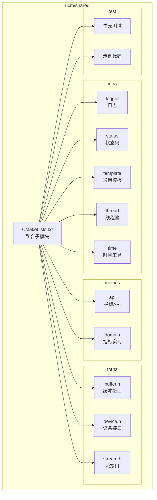
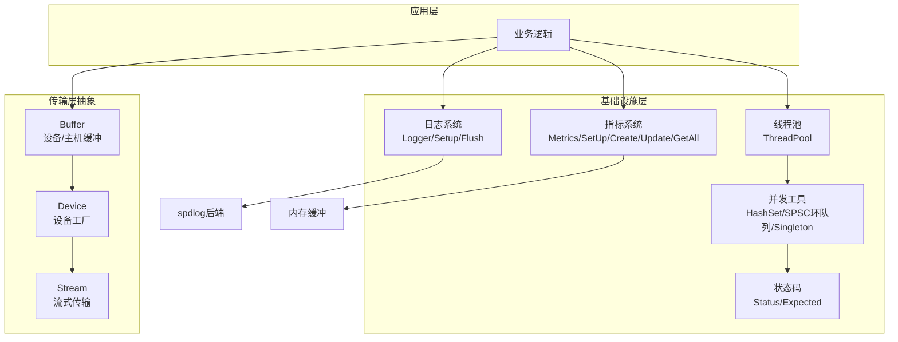
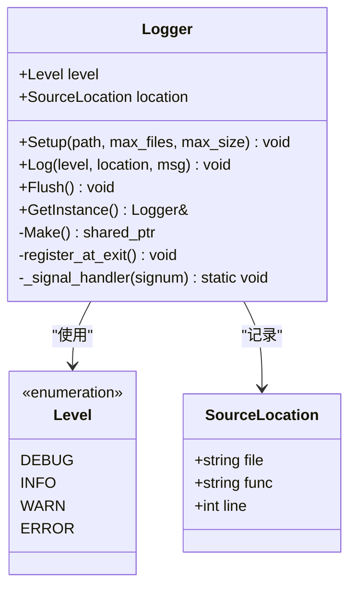
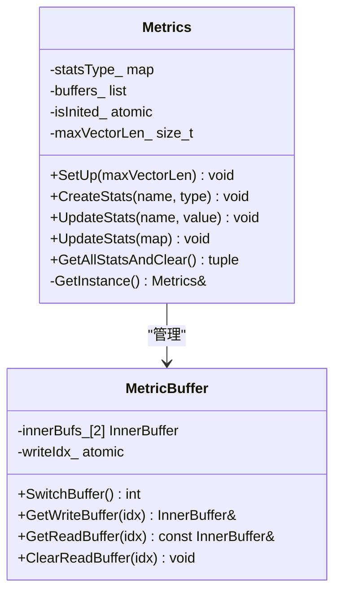
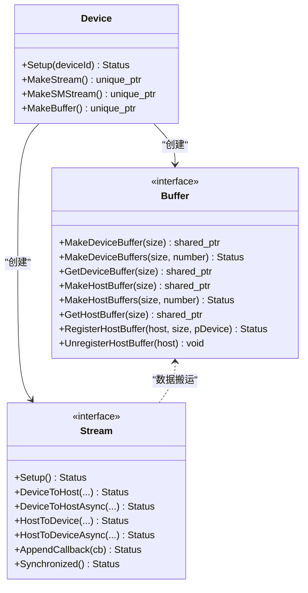
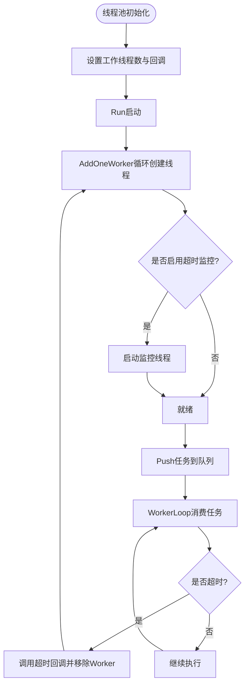
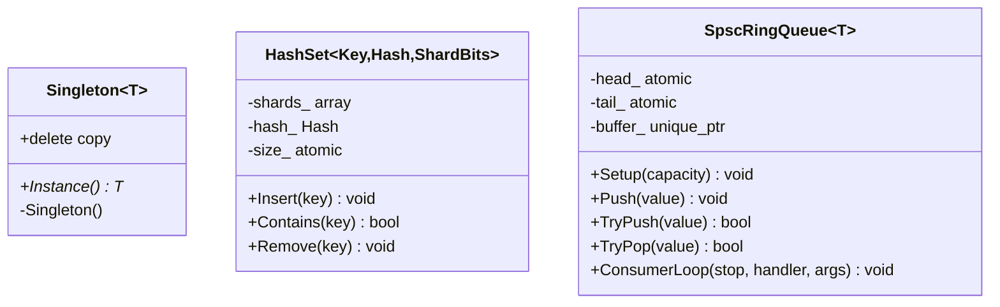
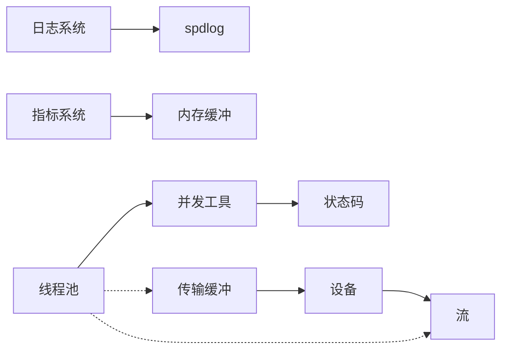

# 基础设施模块设计

<cite>
**本文档引用的文件**
- [CMakeLists.txt](file://ucm/shared/CMakeLists.txt)
- [logger.h](file://ucm/shared/infra/logger/logger.h)
- [logger.cc](file://ucm/shared/infra/logger/logger.cc)
- [spdlog_logger.h](file://ucm/shared/infra/logger/cc/spdlog_logger.h)
- [spdlog_logger.cc](file://ucm/shared/infra/logger/cc/spdlog_logger.cc)
- [thread_pool.h](file://ucm/shared/infra/thread/thread_pool.h)
- [singleton.h](file://ucm/shared/infra/template/singleton.h)
- [metrics_api.h](file://ucm/shared/metrics/cc/api/metrics_api.h)
- [metrics.h](file://ucm/shared/metrics/cc/domain/metrics.h)
- [CMakeLists.txt](file://ucm/shared/metrics/CMakeLists.txt)
- [buffer.h](file://ucm/shared/trans/buffer.h)
- [device.h](file://ucm/shared/trans/device.h)
- [stream.h](file://ucm/shared/trans/stream.h)
- [CMakeLists.txt](file://ucm/shared/trans/CMakeLists.txt)
- [status.h](file://ucm/shared/infra/status/status.h)
- [hashset.h](file://ucm/shared/infra/template/hashset.h)
- [spsc_ring_queue.h](file://ucm/shared/infra/template/spsc_ring_queue.h)
</cite>

## 目录
1. [简介](#简介)
2. [项目结构](#项目结构)
3. [核心组件](#核心组件)
4. [架构总览](#架构总览)
5. [详细组件分析](#详细组件分析)
6. [依赖关系分析](#依赖关系分析)
7. [性能考虑](#性能考虑)
8. [故障排查指南](#故障排查指南)
9. [结论](#结论)
10. [附录](#附录)

## 简介
本设计文档聚焦于UCM基础设施模块（ucm/shared），系统性阐述其整体架构与核心基础设施组件的设计原则、接口规范与实现策略。重点覆盖以下方面：
- 日志系统：基于spdlog的高性能异步日志、带压缩轮转的文件输出、信号安全刷新与环境变量控制级别
- 指标监控：无锁多缓冲统计聚合、线程本地缓冲与双缓冲切换、支持计数器/计量器/直方图
- 传输层抽象：设备/主机内存统一缓冲接口、流式数据传输、回调与同步机制
- 线程池管理：可配置工作线程、超时检测与自动恢复、生命周期管理
- 其他通用基础设施：状态码体系、单例模板、哈希集合、SPSC环形队列

## 项目结构
ucm/shared模块采用按功能域分层组织，核心子目录如下：
- infra：基础设施通用能力（日志、状态、模板、线程、时间）
- metrics：指标采集与上报
- trans：跨平台传输抽象（CUDA/Ascend/MACA/Simu等后端）
- test：单元测试与示例

**图表来源**
- [CMakeLists.txt](file://ucm/shared/CMakeLists.txt#L1-L6)

**章节来源**
- [CMakeLists.txt](file://ucm/shared/CMakeLists.txt#L1-L6)

## 核心组件
本节从设计原则、接口规范与实现策略三个维度，对基础设施模块的关键组件进行深入剖析。

- 设计原则
  - 可移植性：通过抽象接口屏蔽底层差异（日志、指标、传输）
  - 高性能：无锁或低锁数据结构、异步I/O、批处理与自旋优化
  - 安全性：RAII与异常安全、信号处理与资源回收、状态码统一错误模型
  - 可观测性：统一日志格式、指标命名规范、传输进度与回调

- 接口规范
  - 统一返回值：Status/Error封装，Expected<T>变体
  - 明确职责：Buffer/Device/Stream三元组，职责清晰且可替换
  - 线程安全：并发容器与原子操作，避免竞态条件
  - 可配置：环境变量与运行时参数，支持动态调整

- 实现策略
  - 日志：延迟初始化、异步sink、PID隔离路径、信号触发刷新
  - 指标：双缓冲+读写分离、线程本地注册、批量清空与切换
  - 传输：纯虚接口+多后端实现、统一回调与同步语义
  - 线程池：停止令牌、超时检测、监控线程自动补足
  - 并发工具：共享互斥、原子计数、缓存行对齐

**章节来源**
- [logger.h](file://ucm/shared/infra/logger/logger.h#L27-L51)
- [logger.cc](file://ucm/shared/infra/logger/logger.cc#L25-L42)
- [spdlog_logger.h](file://ucm/shared/infra/logger/cc/spdlog_logger.h#L38-L77)
- [spdlog_logger.cc](file://ucm/shared/infra/logger/cc/spdlog_logger.cc#L35-L94)
- [metrics_api.h](file://ucm/shared/metrics/cc/api/metrics_api.h#L28-L42)
- [metrics.h](file://ucm/shared/metrics/cc/domain/metrics.h#L72-L117)
- [buffer.h](file://ucm/shared/trans/buffer.h#L32-L46)
- [device.h](file://ucm/shared/trans/device.h#L32-L38)
- [stream.h](file://ucm/shared/trans/stream.h#L32-L53)
- [thread_pool.h](file://ucm/shared/infra/thread/thread_pool.h#L41-L223)
- [status.h](file://ucm/shared/infra/status/status.h#L40-L114)

## 架构总览
基础设施模块以“抽象接口 + 多后端实现”的方式构建，确保在不同硬件平台（CUDA/Ascend/MACA/Simu）上保持一致的编程体验；同时通过独立的日志与指标子系统提供可观测性支撑。

**图表来源**
- [logger.h](file://ucm/shared/infra/logger/logger.h#L27-L51)
- [metrics.h](file://ucm/shared/metrics/cc/domain/metrics.h#L72-L117)
- [thread_pool.h](file://ucm/shared/infra/thread/thread_pool.h#L41-L223)
- [buffer.h](file://ucm/shared/trans/buffer.h#L32-L46)
- [device.h](file://ucm/shared/trans/device.h#L32-L38)
- [stream.h](file://ucm/shared/trans/stream.h#L32-L53)
- [status.h](file://ucm/shared/infra/status/status.h#L40-L114)

## 详细组件分析

### 日志系统设计
- 设计目标
  - 异步高吞吐：使用spdlog异步sink，避免阻塞业务线程
  - 文件轮转与压缩：支持按大小轮转与多文件保留
  - 信号安全：注册常见致命信号，触发日志刷新
  - 灵活配置：支持环境变量设置日志级别

- 接口规范
  - 全局入口：Setup/Log/Flush
  - 宏封装：UC_DEBUG/INFO/WARN/ERROR，自动注入源位置
  - 线程安全：内部互斥保护，延迟初始化logger实例

- 实现要点
  - Logger单例：静态实例，首次使用时创建
  - Sink组合：控制台彩色输出 + 带压缩轮转的文件输出
  - 环境变量：UC_LOGGER_LEVEL决定日志级别
  - PID隔离：每个进程独立日志路径，避免冲突

**图表来源**
- [spdlog_logger.h](file://ucm/shared/infra/logger/cc/spdlog_logger.h#L38-L77)
- [spdlog_logger.cc](file://ucm/shared/infra/logger/cc/spdlog_logger.cc#L35-L94)
- [logger.h](file://ucm/shared/infra/logger/logger.h#L27-L51)
- [logger.cc](file://ucm/shared/infra/logger/logger.cc#L25-L42)

**章节来源**
- [logger.h](file://ucm/shared/infra/logger/logger.h#L27-L51)
- [logger.cc](file://ucm/shared/infra/logger/logger.cc#L25-L42)
- [spdlog_logger.h](file://ucm/shared/infra/logger/cc/spdlog_logger.h#L38-L77)
- [spdlog_logger.cc](file://ucm/shared/infra/logger/cc/spdlog_logger.cc#L35-L94)

### 指标监控系统设计
- 设计目标
  - 低开销聚合：双缓冲+读写分离，减少锁竞争
  - 线程本地注册：避免全局锁，提升并发性能
  - 批量清空：GetAllStatsAndClear原子切换并清空读缓冲

- 接口规范
  - 初始化：SetUp(maxVectorLen)
  - 注册与更新：CreateStats(name, type)、UpdateStats(name, value)、UpdateStats(map)
  - 拉取与清理：GetAllStatsAndClear()

- 实现要点
  - MetricBuffer：双缓冲结构，writeIdx原子切换
  - 线程本地缓冲：thread_local注册，减少全局竞争
  - 类型管理：计数器/计量器/直方图三种类型映射
  - 原子操作：compare_exchange_strong保证幂等初始化

**图表来源**
- [metrics.h](file://ucm/shared/metrics/cc/domain/metrics.h#L72-L117)
- [metrics_api.h](file://ucm/shared/metrics/cc/api/metrics_api.h#L28-L42)

**章节来源**
- [metrics_api.h](file://ucm/shared/metrics/cc/api/metrics_api.h#L28-L42)
- [metrics.h](file://ucm/shared/metrics/cc/domain/metrics.h#L72-L117)

### 传输层抽象设计
- 设计目标
  - 统一缓冲：设备/主机缓冲创建与获取接口一致
  - 流式传输：同步/异步双向数据搬运，支持数组批量
  - 回调与同步：AppendCallback与Synchronized保证事件驱动与同步点

- 接口规范
  - Buffer：设备/主机缓冲创建、注册/注销主机缓冲
  - Device：设备初始化、创建Stream与Buffer
  - Stream：Host <-> Device双向传输、异步传输、回调与同步

- 实现策略
  - 纯虚接口：确保多后端一致性
  - 状态返回：Status封装错误码与消息
  - 后端选择：通过CMake变量RUNTIME_ENVIRONMENT在编译期选择后端

**图表来源**
- [buffer.h](file://ucm/shared/trans/buffer.h#L32-L46)
- [device.h](file://ucm/shared/trans/device.h#L32-L38)
- [stream.h](file://ucm/shared/trans/stream.h#L32-L53)

**章节来源**
- [buffer.h](file://ucm/shared/trans/buffer.h#L32-L46)
- [device.h](file://ucm/shared/trans/device.h#L32-L38)
- [stream.h](file://ucm/shared/trans/stream.h#L32-L53)
- [CMakeLists.txt](file://ucm/shared/trans/CMakeLists.txt#L1-L24)

### 线程池管理设计
- 设计目标
  - 可配置工作线程数量与回调函数
  - 超时检测与自动恢复：监控线程定期检查Worker执行时长
  - 生命周期管理：RAII析构时优雅停止所有线程

- 接口规范
  - 设置：SetNWorker/SetWorkerFn/SetWorkerInitFn/SetWorkerExitFn/SetWorkerTimeoutFn
  - 运行：Run启动工作线程与监控线程
  - 提交：Push支持单任务与批量任务
  - 停止：析构时通知所有Worker停止

- 实现要点
  - Worker结构：线程ID、停止令牌、当前任务指针、最后任务时间
  - 条件变量与互斥：任务队列等待与通知
  - 监控循环：周期性检查超时任务并重建Worker
  - 原子标志：StopToken用于非阻塞停止请求

**图表来源**
- [thread_pool.h](file://ucm/shared/infra/thread/thread_pool.h#L108-L207)

**章节来源**
- [thread_pool.h](file://ucm/shared/infra/thread/thread_pool.h#L41-L223)

### 并发基础设施组件
- 单例模板（Singleton）
  - 线程安全：静态局部变量保证初始化线程安全
  - 禁止拷贝：删除拷贝构造与赋值

- 哈希集合（HashSet）
  - 分片哈希：ShardBits控制分片数，缓存行对齐优化
  - 动态重哈希：负载因子阈值触发扩容
  - 读写锁：共享锁读、独占锁写

- SPSC环形队列（SpscRingQueue）
  - 无锁设计：原子head/tail指针，支持2次幂容量优化
  - 自旋+睡眠退避：TryPop/TryPush避免忙等
  - 批处理消费：ConsumerLoop批量处理任务

**图表来源**
- [singleton.h](file://ucm/shared/infra/template/singleton.h#L29-L42)
- [hashset.h](file://ucm/shared/infra/template/hashset.h#L37-L132)
- [spsc_ring_queue.h](file://ucm/shared/infra/template/spsc_ring_queue.h#L36-L117)

**章节来源**
- [singleton.h](file://ucm/shared/infra/template/singleton.h#L29-L42)
- [hashset.h](file://ucm/shared/infra/template/hashset.h#L37-L132)
- [spsc_ring_queue.h](file://ucm/shared/infra/template/spsc_ring_queue.h#L36-L117)

### 状态码与错误处理
- 设计目标
  - 统一错误码：预定义常用错误类型，便于诊断
  - 便捷构造：InvalidParam/OutOfMemory/OsApiError等工厂方法
  - 结果封装：Expected<T>承载成功值或错误状态

- 关键特性
  - Status：Success/Failure判断、ToString格式化
  - Expected<T>：HasValue/Value/Error三态封装
  - 格式化支持：支持fmt格式字符串

**章节来源**
- [status.h](file://ucm/shared/infra/status/status.h#L40-L114)

## 依赖关系分析
基础设施模块内部依赖清晰，遵循“上层依赖抽象、下层实现具体”的原则。日志与指标作为横切关注点被各子系统复用；传输层通过抽象接口向上提供统一能力；并发工具为线程池与指标系统提供基础支撑。

**图表来源**
- [logger.h](file://ucm/shared/infra/logger/logger.h#L27-L51)
- [metrics.h](file://ucm/shared/metrics/cc/domain/metrics.h#L72-L117)
- [thread_pool.h](file://ucm/shared/infra/thread/thread_pool.h#L41-L223)
- [buffer.h](file://ucm/shared/trans/buffer.h#L32-L46)
- [device.h](file://ucm/shared/trans/device.h#L32-L38)
- [stream.h](file://ucm/shared/trans/stream.h#L32-L53)
- [status.h](file://ucm/shared/infra/status/status.h#L40-L114)

**章节来源**
- [CMakeLists.txt](file://ucm/shared/CMakeLists.txt#L1-L6)
- [CMakeLists.txt](file://ucm/shared/metrics/CMakeLists.txt#L1-L16)
- [CMakeLists.txt](file://ucm/shared/trans/CMakeLists.txt#L1-L24)

## 性能考虑
- 日志系统
  - 异步sink降低主线程阻塞；文件轮转避免磁盘IO瓶颈
  - 环境变量动态调节级别，生产环境建议INFO以上级别
  - 信号触发刷新确保崩溃前日志落盘

- 指标系统
  - 双缓冲+读写分离显著降低锁竞争
  - 线程本地缓冲减少全局锁持有时间
  - 批量清空与切换，避免频繁分配

- 传输层
  - Stream接口统一异步回调与同步点，便于流水线化
  - Buffer接口支持批量传输，减少系统调用次数

- 线程池
  - 超时监控线程自动补充Worker，维持稳定吞吐
  - 自旋+睡眠退避平衡CPU占用与延迟

- 并发工具
  - 分片哈希与缓存行对齐减少伪共享
  - SPSC环队列支持批量消费，提高吞吐

[本节为通用性能讨论，不直接分析具体文件]

## 故障排查指南
- 日志问题
  - 检查UC_LOGGER_LEVEL环境变量是否正确设置
  - 确认日志路径存在且有写权限
  - 观察信号触发后的Flush行为是否正常

- 指标缺失
  - 确认Metrics::SetUp已调用且maxVectorLen合理
  - 检查CreateStats与UpdateStats调用是否匹配
  - 使用GetAllStatsAndClear确认统计是否被清空

- 传输异常
  - 检查Device::Setup返回状态
  - 确认Stream::Setup成功后再进行数据传输
  - 异步传输需确保AppendCallback回调正确注册

- 线程池卡死
  - 检查WorkerTimeoutFn是否正确实现
  - 确认StopToken在超时后被正确请求
  - 监控线程是否存活

**章节来源**
- [logger.cc](file://ucm/shared/infra/logger/logger.cc#L25-L42)
- [spdlog_logger.cc](file://ucm/shared/infra/logger/cc/spdlog_logger.cc#L79-L91)
- [metrics.h](file://ucm/shared/metrics/cc/domain/metrics.h#L99-L101)
- [device.h](file://ucm/shared/trans/device.h#L34-L38)
- [stream.h](file://ucm/shared/trans/stream.h#L35-L53)
- [thread_pool.h](file://ucm/shared/infra/thread/thread_pool.h#L179-L207)

## 结论
ucm/shared基础设施模块通过抽象接口与多后端实现，提供了跨平台、高性能、可观测的通用能力。日志系统与指标系统分别满足调试与监控需求；传输层抽象屏蔽底层差异；线程池与并发工具为高并发场景提供坚实基础。整体设计遵循低耦合、高内聚与可扩展原则，便于后续功能演进与平台扩展。

[本节为总结性内容，不直接分析具体文件]

## 附录

### 扩展指南与自定义组件实现示例
- 自定义日志后端
  - 在Logger::Make中添加新的spdlog sink组合
  - 支持环境变量扩展更多配置项

- 自定义指标类型
  - 在Metrics::CreateStats中注册新类型
  - 在UpdateStats中实现对应更新逻辑

- 新增传输后端
  - 实现Buffer/Device/Stream接口
  - 在CMake中添加RUNTIME_ENVIRONMENT分支

- 自定义线程池Worker
  - 通过SetWorkerInitFn/SetWorkerFn/SetWorkerExitFn注入自定义逻辑
  - 使用SetWorkerTimeoutFn实现超时检测与恢复

**章节来源**
- [logger.cc](file://ucm/shared/infra/logger/logger.cc#L25-L42)
- [metrics_api.h](file://ucm/shared/metrics/cc/api/metrics_api.h#L30-L40)
- [CMakeLists.txt](file://ucm/shared/trans/CMakeLists.txt#L1-L24)
- [thread_pool.h](file://ucm/shared/infra/thread/thread_pool.h#L80-L102)