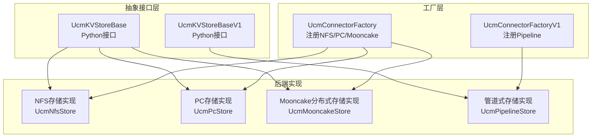
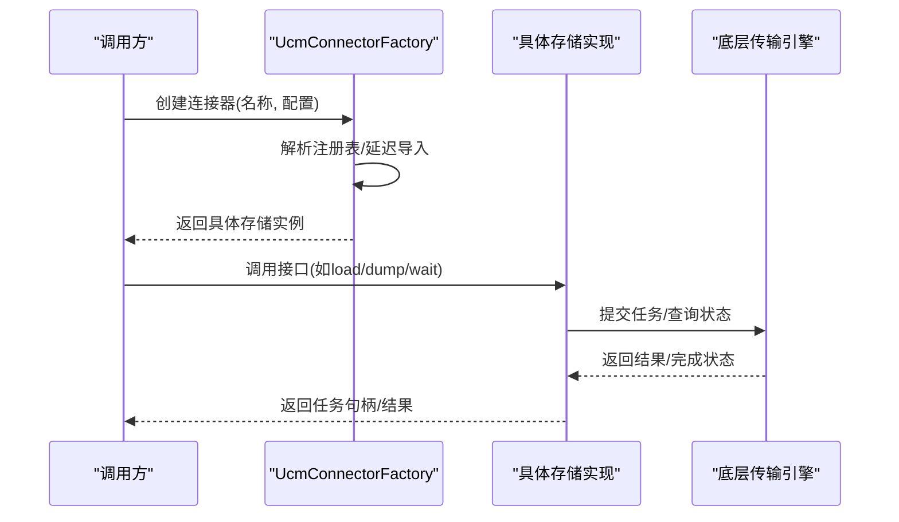
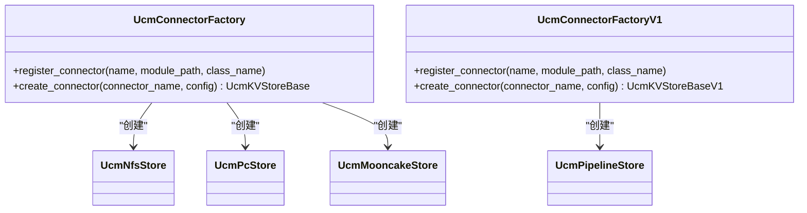
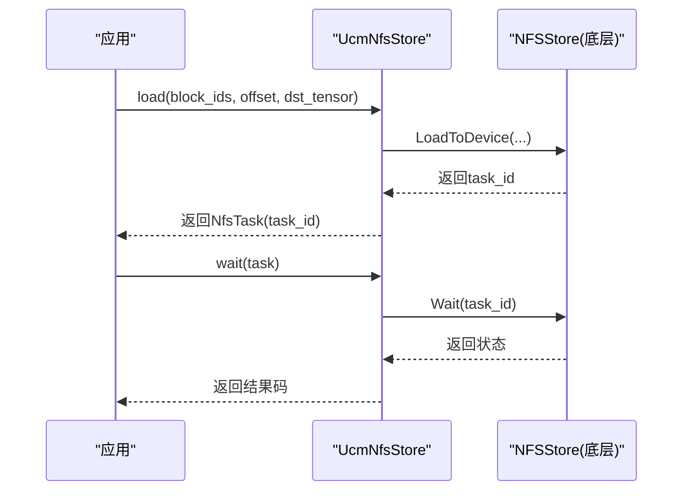
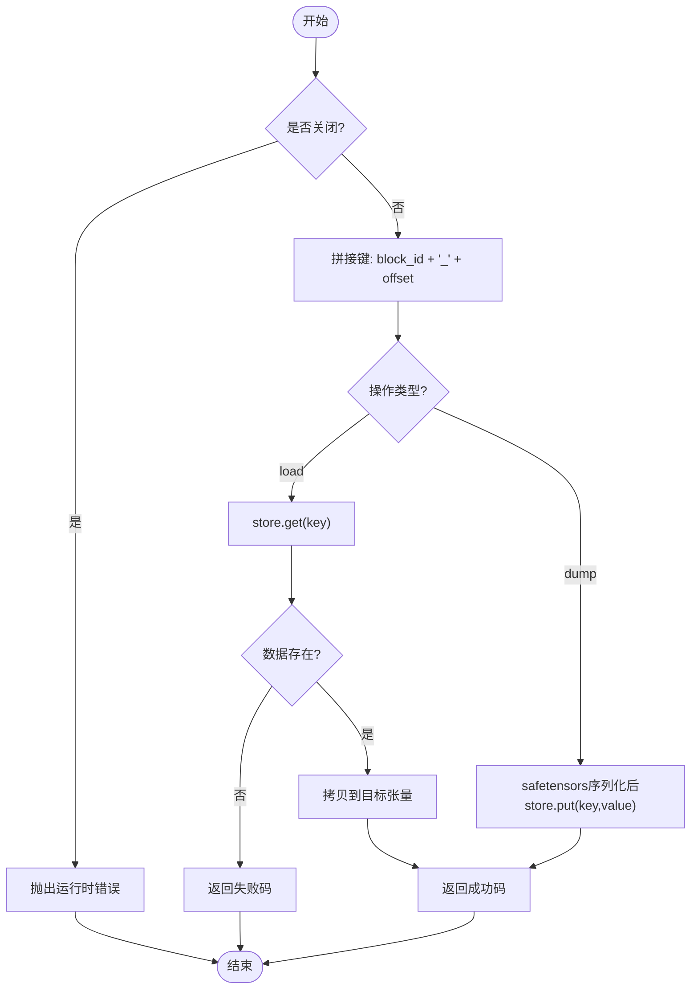
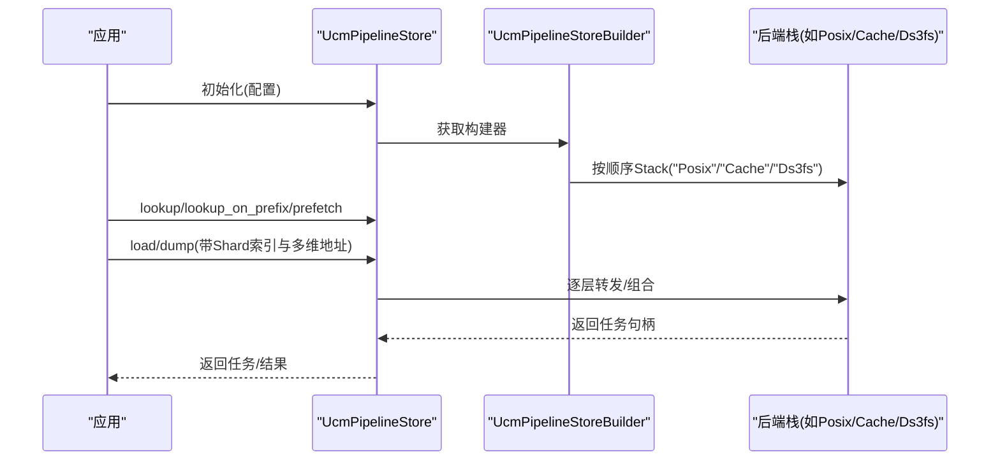
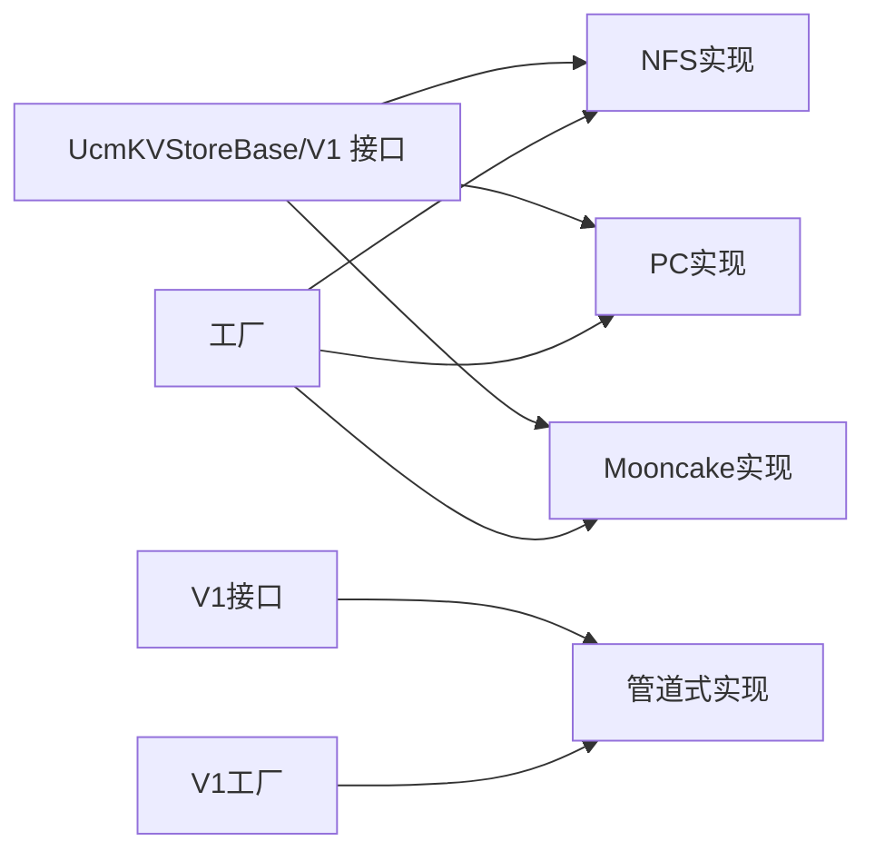

# 存储模块设计

<cite>
**本文引用的文件**
- [ucm/store/factory.py](file://ucm/store/factory.py)
- [ucm/store/factory_v1.py](file://ucm/store/factory_v1.py)
- [ucm/store/ucmstore.py](file://ucm/store/ucmstore.py)
- [ucm/store/nfsstore/nfsstore_connector.py](file://ucm/store/nfsstore/nfsstore_connector.py)
- [ucm/store/pcstore/pcstore_connector.py](file://ucm/store/pcstore/pcstore_connector.py)
- [ucm/store/mooncakestore/mooncake_connector.py](file://ucm/store/mooncakestore/mooncake_connector.py)
- [ucm/store/pipeline/connector.py](file://ucm/store/pipeline/connector.py)
- [ucm/store/ds3fs/cc/ds3fs_store.h](file://ucm/store/ds3fs/cc/ds3fs_store.h)
- [ucm/store/cache/cc/cache_store.h](file://ucm/store/cache/cc/cache_store.h)
- [ucm/store/posix/cc/posix_store.h](file://ucm/store/posix/cc/posix_store.h)
</cite>

## 目录
1. [简介](#简介)
2. [项目结构](#项目结构)
3. [核心组件](#核心组件)
4. [架构总览](#架构总览)
5. [详细组件分析](#详细组件分析)
6. [依赖分析](#依赖分析)
7. [性能考量](#性能考量)
8. [故障排查指南](#故障排查指南)
9. [结论](#结论)
10. [附录：扩展与自定义实现指南](#附录扩展与自定义实现指南)

## 简介
本设计文档聚焦于UCM存储模块（ucm/store），系统性阐述其整体架构、设计理念与实现策略。重点覆盖：
- 抽象接口层：UcmKVStoreBase与UcmKVStoreBaseV1的设计原则与职责边界
- 工厂模式：基于注册表的延迟加载与实例化机制
- 多后端实现：NFS存储、PC存储、Mooncake分布式存储、管道式存储（Posix/Cache/Ds3fs/Fake/Empty）
- 性能与可扩展性：数据流、任务模型、并发与I/O优化建议
- 扩展指南：如何新增自定义存储后端并接入工厂体系

## 项目结构
ucm/store模块采用“接口抽象 + 工厂注册 + 多后端实现”的分层设计，支持Python侧KV接口与C++侧高性能传输引擎的协同。

图表来源
- [ucm/store/ucmstore.py](file://ucm/store/ucmstore.py#L39-L205)
- [ucm/store/factory.py](file://ucm/store/factory.py#L34-L71)
- [ucm/store/factory_v1.py](file://ucm/store/factory_v1.py#L34-L66)
- [ucm/store/nfsstore/nfsstore_connector.py](file://ucm/store/nfsstore/nfsstore_connector.py#L39-L132)
- [ucm/store/pcstore/pcstore_connector.py](file://ucm/store/pcstore/pcstore_connector.py#L39-L115)
- [ucm/store/mooncakestore/mooncake_connector.py](file://ucm/store/mooncakestore/mooncake_connector.py#L59-L368)
- [ucm/store/pipeline/connector.py](file://ucm/store/pipeline/connector.py#L65-L217)

章节来源
- [ucm/store/ucmstore.py](file://ucm/store/ucmstore.py#L39-L205)
- [ucm/store/factory.py](file://ucm/store/factory.py#L34-L71)
- [ucm/store/factory_v1.py](file://ucm/store/factory_v1.py#L34-L66)

## 核心组件
- 抽象接口UcmKVStoreBase：定义KV缓存块的创建、查找、预取、加载、回写、等待、提交、检查等操作；面向设备侧张量地址或指针进行数据传输。
- 抽象接口UcmKVStoreBaseV1：面向字节串块ID的管道式存储接口，支持前缀查找、流水线堆叠、多后端组合。
- 工厂UcmConnectorFactory：按名称注册并延迟加载具体存储实现类，统一创建入口。
- 工厂UcmConnectorFactoryV1：面向V1接口的工厂，支持管道式构建器注册与执行。

章节来源
- [ucm/store/ucmstore.py](file://ucm/store/ucmstore.py#L39-L205)
- [ucm/store/factory.py](file://ucm/store/factory.py#L34-L71)
- [ucm/store/factory_v1.py](file://ucm/store/factory_v1.py#L34-L66)

## 架构总览
存储模块通过工厂模式解耦上层调用与具体后端实现，同时提供两套接口以适配不同使用场景：
- Python接口（V0）：面向设备张量的高效数据搬运，适合大模型推理中的KV缓存传输
- Python接口（V1）：面向字节块ID的管道式传输，适合多后端组合与复杂调度

图表来源
- [ucm/store/factory.py](file://ucm/store/factory.py#L34-L71)
- [ucm/store/nfsstore/nfsstore_connector.py](file://ucm/store/nfsstore/nfsstore_connector.py#L39-L132)
- [ucm/store/pcstore/pcstore_connector.py](file://ucm/store/pcstore/pcstore_connector.py#L39-L115)
- [ucm/store/mooncakestore/mooncake_connector.py](file://ucm/store/mooncakestore/mooncake_connector.py#L59-L368)

## 详细组件分析

### 抽象接口层：UcmKVStoreBase 与 UcmKVStoreBaseV1
- 设计原则
  - 明确职责分离：接口仅描述“做什么”，不暴露具体实现细节
  - 统一任务模型：所有数据搬运返回任务对象，支持异步等待与状态检查
  - 设备无关：通过指针/张量地址进行数据传输，便于跨设备（CPU/GPU/NPU）复用
- 关键方法族
  - 基础能力：create/lookup/prefetch
  - 数据搬运：load/dump（张量）、fetch_data/dump_data（裸指针/大小）
  - 任务管理：wait/check/commit
- V1接口差异
  - 使用字节串块ID，支持前缀查找与管道式堆叠
  - 面向更高层的编排与组合，适合复杂拓扑与多介质混合场景

章节来源
- [ucm/store/ucmstore.py](file://ucm/store/ucmstore.py#L39-L205)

### 工厂模式：UcmConnectorFactory 与 UcmConnectorFactoryV1
- 注册机制
  - 以名称为键，保存模块路径与类名的延迟加载函数
  - 支持重复注册保护与错误提示
- 实例化流程
  - 按名称查找注册项，动态导入模块并获取类
  - 校验类型兼容性，构造实例并传入配置
- V1工厂扩展
  - 引入“构建器”概念，按配置选择不同的后端组合（如Posix+Cache、Ds3fs+Cache等）

图表来源
- [ucm/store/factory.py](file://ucm/store/factory.py#L34-L71)
- [ucm/store/factory_v1.py](file://ucm/store/factory_v1.py#L34-L66)
- [ucm/store/nfsstore/nfsstore_connector.py](file://ucm/store/nfsstore/nfsstore_connector.py#L39-L132)
- [ucm/store/pcstore/pcstore_connector.py](file://ucm/store/pcstore/pcstore_connector.py#L39-L115)
- [ucm/store/mooncakestore/mooncake_connector.py](file://ucm/store/mooncakestore/mooncake_connector.py#L59-L368)
- [ucm/store/pipeline/connector.py](file://ucm/store/pipeline/connector.py#L65-L217)

章节来源
- [ucm/store/factory.py](file://ucm/store/factory.py#L34-L71)
- [ucm/store/factory_v1.py](file://ucm/store/factory_v1.py#L34-L66)

### NFS存储实现：UcmNfsStore
- 特点
  - 通过底层NFSStore封装，提供批量分配、查找、设备间搬运
  - 支持配置传输设备、IO大小、直通模式、流数量与缓冲数量
  - 适用于高吞吐、低时延的网络文件系统场景
- 接口映射
  - create/lookup → 批量分配/查找
  - load/dump → 设备侧张量搬运
  - fetch_data/dump_data → 指针+大小搬运
  - wait/check/commit → 任务生命周期管理

图表来源
- [ucm/store/nfsstore/nfsstore_connector.py](file://ucm/store/nfsstore/nfsstore_connector.py#L84-L132)

章节来源
- [ucm/store/nfsstore/nfsstore_connector.py](file://ucm/store/nfsstore/nfsstore_connector.py#L39-L132)

### PC存储实现：UcmPcStore
- 特点
  - 针对特定设备/拓扑优化，支持唯一ID、本地rank大小、散射-聚集等参数
  - 适用于多设备/多进程共享内存/队列场景
- 接口映射
  - 与NFS类似，但部分数据搬运接口在该实现中未提供（占位）

章节来源
- [ucm/store/pcstore/pcstore_connector.py](file://ucm/store/pcstore/pcstore_connector.py#L39-L115)

### Mooncake分布式存储实现：UcmMooncakeStore
- 特点
  - 基于分布式KV（Mooncake）实现，通过异步事件循环与Future管理任务
  - 仅提供get/put语义，不支持传统块分配/回收
  - 通过偏移拼接形成唯一键，满足tp>1场景
- 接口映射
  - create/prefetch/commit：不支持（返回默认值/空实现）
  - lookup：检查键是否存在
  - load/dump：异步拉取/上传张量（safetensors序列化）
  - fetch_data/dump_data：暂未实现
  - wait：等待Future完成，超时/取消/异常处理完善

图表来源
- [ucm/store/mooncakestore/mooncake_connector.py](file://ucm/store/mooncakestore/mooncake_connector.py#L170-L261)

章节来源
- [ucm/store/mooncakestore/mooncake_connector.py](file://ucm/store/mooncakestore/mooncake_connector.py#L59-L368)

### 管道式存储实现：UcmPipelineStore
- 特点
  - 通过“构建器”注册不同后端组合（如Posix+Cache、Ds3fs+Cache、Empty、Fake等）
  - 支持字节串块ID、前缀查找、Shard索引与多维张量地址数组
  - 适合需要多介质混合、前缀匹配与复杂调度的场景
- 接口映射
  - lookup/lookup_on_prefix/prefetch：前缀与命中判断
  - load/dump/load_data/dump_data：多维地址数组与Shard索引
  - wait/check：任务等待与检查

图表来源
- [ucm/store/pipeline/connector.py](file://ucm/store/pipeline/connector.py#L65-L217)
- [ucm/store/posix/cc/posix_store.h](file://ucm/store/posix/cc/posix_store.h#L30-L52)
- [ucm/store/cache/cc/cache_store.h](file://ucm/store/cache/cc/cache_store.h#L30-L53)
- [ucm/store/ds3fs/cc/ds3fs_store.h](file://ucm/store/ds3fs/cc/ds3fs_store.h#L30-L52)

章节来源
- [ucm/store/pipeline/connector.py](file://ucm/store/pipeline/connector.py#L38-L217)

### C++侧存储接口与实现（概览）
- Ds3fsStore：面向分布式文件系统的存储实现，提供Setup、Lookup、Prefetch、Load、Dump、Check、Wait等接口
- CacheStore：面向缓存层的存储实现，支持前缀查找
- PosixStore：面向本地POSIX文件系统的存储实现，提供基础的块查找与搬运能力

章节来源
- [ucm/store/ds3fs/cc/ds3fs_store.h](file://ucm/store/ds3fs/cc/ds3fs_store.h#L30-L52)
- [ucm/store/cache/cc/cache_store.h](file://ucm/store/cache/cc/cache_store.h#L30-L53)
- [ucm/store/posix/cc/posix_store.h](file://ucm/store/posix/cc/posix_store.h#L30-L53)

## 依赖分析
- 松耦合：工厂层仅依赖接口类与模块路径，具体实现通过延迟导入解耦
- 可扩展：新增后端只需实现对应接口并注册到工厂，无需修改上层调用代码
- 任务模型：统一的任务句柄与等待/检查机制，便于跨后端一致化管理

图表来源
- [ucm/store/ucmstore.py](file://ucm/store/ucmstore.py#L39-L205)
- [ucm/store/factory.py](file://ucm/store/factory.py#L34-L71)
- [ucm/store/factory_v1.py](file://ucm/store/factory_v1.py#L34-L66)
- [ucm/store/pipeline/connector.py](file://ucm/store/pipeline/connector.py#L65-L217)

章节来源
- [ucm/store/ucmstore.py](file://ucm/store/ucmstore.py#L39-L205)
- [ucm/store/factory.py](file://ucm/store/factory.py#L34-L71)
- [ucm/store/factory_v1.py](file://ucm/store/factory_v1.py#L34-L66)

## 性能考量
- I/O参数调优
  - IO大小、直通模式、流数量、缓冲数量：根据设备与网络条件调整，提升吞吐与降低尾延迟
- 任务并发
  - 利用异步等待与检查接口，避免阻塞主线程；合理设置任务粒度与批大小
- 数据布局
  - 对齐与分片：确保张量地址对齐，减少跨设备拷贝开销
- 缓存与预取
  - 在NFS/PC实现中结合预取接口，提前加载热点块
- 分布式一致性
  - Mooncake实现需关注键空间分布与序列化开销，避免热点键导致拥塞

## 故障排查指南
- 初始化失败
  - 检查配置项（如存储后端路径、块大小、角色、设备ID等）是否正确
  - 查看底层Setup返回码与日志
- 任务超时/取消
  - Mooncake实现设置了较长超时阈值；若频繁超时，检查网络与远端服务状态
- 类型错误
  - Mooncake实现对张量形状与dtype有严格断言；确保与远端一致
- 管道式构建失败
  - 确认构建器名称与后端库路径正确，库文件可被动态加载

章节来源
- [ucm/store/nfsstore/nfsstore_connector.py](file://ucm/store/nfsstore/nfsstore_connector.py#L67-L71)
- [ucm/store/mooncakestore/mooncake_connector.py](file://ucm/store/mooncakestore/mooncake_connector.py#L93-L101)
- [ucm/store/mooncakestore/mooncake_connector.py](file://ucm/store/mooncakestore/mooncake_connector.py#L284-L316)

## 结论
ucm/store模块通过清晰的接口抽象、灵活的工厂注册与多后端实现，提供了从本地POSIX到分布式KV的全栈存储能力。V0接口专注设备侧高效搬运，V1接口强调可组合性与前缀能力。借助统一的任务模型与完善的日志/错误处理，模块既易于扩展又便于运维。

## 附录：扩展与自定义实现指南
- 新增后端步骤
  - 实现对应接口类（V0或V1），遵循接口签名与任务模型
  - 在工厂中注册名称与模块路径/类名（或在V1中注册构建器）
  - 提供必要的配置项与初始化逻辑
- 接口实现要点
  - 保持幂等与可重入：commit/check/wait应可重复调用
  - 明确错误码与异常：便于上层统一处理
  - 文档化配置项与性能参数，便于运维调优
- 示例参考
  - NFS/PC/Mooncake实现展示了不同后端的典型做法与注意事项
  - 管道式实现展示了多后端组合与前缀查找的高级用法

章节来源
- [ucm/store/factory.py](file://ucm/store/factory.py#L34-L71)
- [ucm/store/factory_v1.py](file://ucm/store/factory_v1.py#L34-L66)
- [ucm/store/nfsstore/nfsstore_connector.py](file://ucm/store/nfsstore/nfsstore_connector.py#L39-L132)
- [ucm/store/pcstore/pcstore_connector.py](file://ucm/store/pcstore/pcstore_connector.py#L39-L115)
- [ucm/store/mooncakestore/mooncake_connector.py](file://ucm/store/mooncakestore/mooncake_connector.py#L59-L368)
- [ucm/store/pipeline/connector.py](file://ucm/store/pipeline/connector.py#L65-L217)