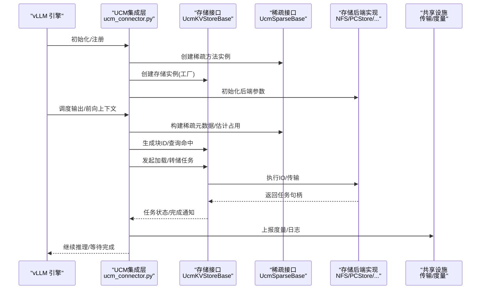
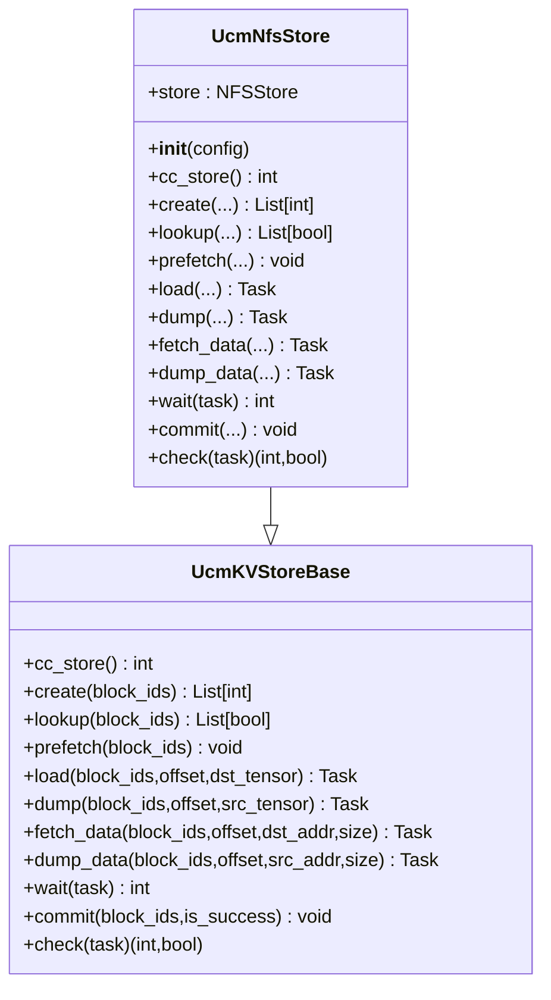
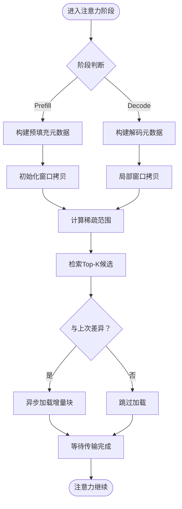
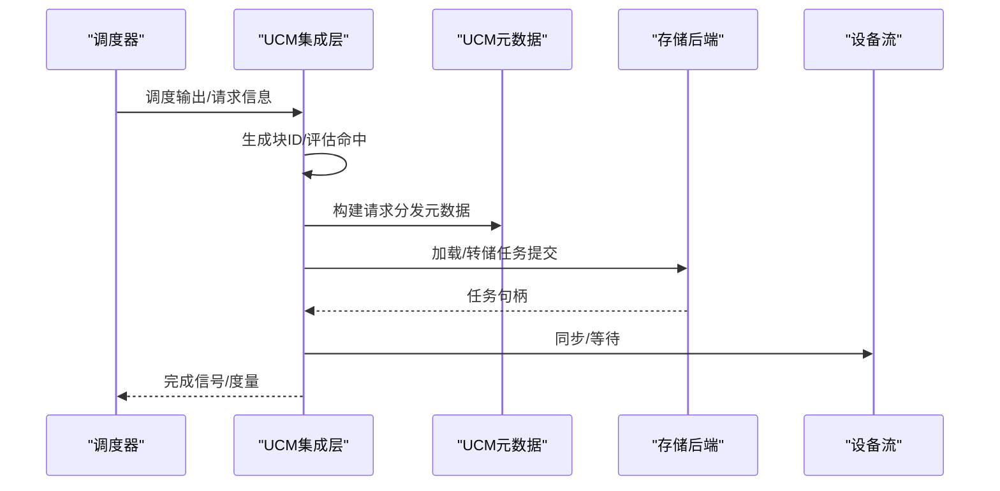
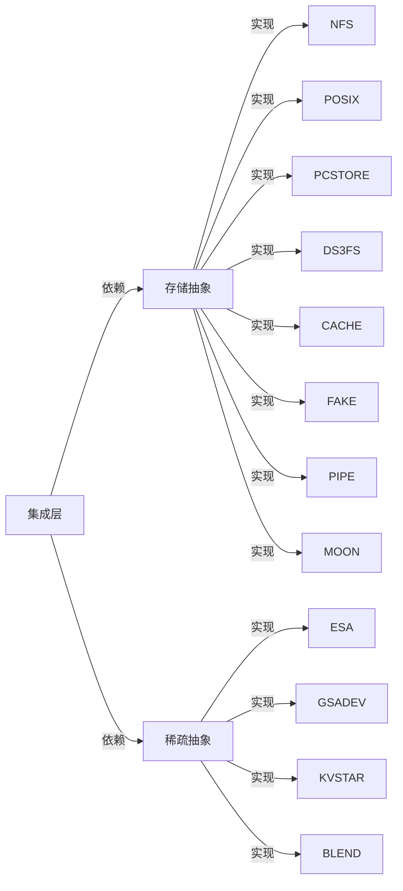

# 模块设计与职责

<cite>
**本文引用的文件**
- [ucm/__init__.py](file://ucm/__init__.py)
- [ucm/store/factory.py](file://ucm/store/factory.py)
- [ucm/store/ucmstore.py](file://ucm/store/ucmstore.py)
- [ucm/store/nfsstore/nfsstore_connector.py](file://ucm/store/nfsstore/nfsstore_connector.py)
- [ucm/store/posix/posix_store.py](file://ucm/store/posix/posix_store.py)
- [ucm/store/pcstore/pcstore_connector.py](file://ucm/store/pcstore/pcstore_connector.py)
- [ucm/store/cache/cache_store.cc](file://ucm/store/cache/cache_store.cc)
- [ucm/store/ds3fs/ds3fs_store.cc](file://ucm/store/ds3fs/ds3fs_store.cc)
- [ucm/store/fake/fake_store.cc](file://ucm/store/fake/fake_store.cc)
- [ucm/store/mooncakestore/mooncake_connector.py](file://ucm/store/mooncakestore/mooncake_connector.py)
- [ucm/store/pipeline/pipeline_store.py](file://ucm/store/pipeline/pipeline_store.py)
- [ucm/sparse/factory.py](file://ucm/sparse/factory.py)
- [ucm/sparse/base.py](file://ucm/sparse/base.py)
- [ucm/sparse/esa/esa.py](file://ucm/sparse/esa/esa.py)
- [ucm/sparse/gsa_on_device/gsa_on_device.py](file://ucm/sparse/gsa_on_device/gsa_on_device.py)
- [ucm/sparse/kvstar/multistep.py](file://ucm/sparse/kvstar/multistep.py)
- [ucm/sparse/blend/blend.py](file://ucm/sparse/blend/blend.py)
- [ucm/integration/vllm/ucm_connector.py](file://ucm/integration/vllm/ucm_connector.py)
- [ucm/shared/trans/cuda/cuda_device.cc](file://ucm/shared/trans/cuda/cuda_device.cc)
- [ucm/shared/metrics/cpy/metrics.py.cc](file://ucm/shared/metrics/cpy/metrics.py.cc)
</cite>

## 目录
1. [引言](#引言)
2. [项目结构](#项目结构)
3. [核心组件](#核心组件)
4. [架构总览](#架构总览)
5. [详细组件分析](#详细组件分析)
6. [依赖分析](#依赖分析)
7. [性能考量](#性能考量)
8. [故障排查指南](#故障排查指南)
9. [结论](#结论)
10. [附录：扩展与自定义指南](#附录扩展与自定义指南)

## 引言
本文件面向UCM（Unified Cache Management）项目的模块设计与职责，聚焦以下核心模块：
- ucm/store：统一KV缓存存储抽象与多种后端实现（NFS、POSIX、PCStore、DS3FS、Cache、Fake、Pipeline、Mooncake 等）
- ucm/sparse：稀疏注意力算法抽象与实现（ESA、GSA On Device、KVStar MultiStep、Blend）
- ucm/integration：与推理引擎（如vLLM）的集成桥接层
- ucm/shared：跨语言/平台的共享基础设施（传输、度量、日志等）

文档从设计理念、职责划分、接口设计、内部组织、模块间协作与数据流、依赖关系、接口规范、扩展与自定义实践、以及可维护性与可测试性等方面进行系统化阐述。

## 项目结构
UCM采用按“能力域”分层的模块化组织方式：
- ucm/store：存储域，提供统一KV缓存接口与多后端适配
- ucm/sparse：稀疏注意力域，提供统一稀疏策略接口与具体算法实现
- ucm/integration：集成域，连接推理引擎与存储/稀疏子系统
- ucm/shared：共享域，提供传输、度量、日志等通用能力

```mermaid
graph TB
subgraph "集成层"
INT["ucm/integration/vllm/ucm_connector.py"]
end
subgraph "存储层"
STORE_BASE["ucm/store/ucmstore.py"]
NFS["ucm/store/nfsstore/nfsstore_connector.py"]
POSIX["ucm/store/posix/posix_store.py"]
PCSTORE["ucm/store/pcstore/pcstore_connector.py"]
DS3FS["ucm/store/ds3fs/ds3fs_store.cc"]
CACHE["ucm/store/cache/cache_store.cc"]
FAKE["ucm/store/fake/fake_store.cc"]
PIPE["ucm/store/pipeline/pipeline_store.py"]
MOON["ucm/store/mooncakestore/mooncake_connector.py"]
FACTORY["ucm/store/factory.py"]
end
subgraph "稀疏层"
SPARSE_BASE["ucm/sparse/base.py"]
ESA["ucm/sparse/esa/esa.py"]
GSADEV["ucm/sparse/gsa_on_device/gsa_on_device.py"]
KVSTAR["ucm/sparse/kvstar/multistep.py"]
BLEND["ucm/sparse/blend/blend.py"]
SPARSE_FACTORY["ucm/sparse/factory.py"]
end
subgraph "共享层"
TRANS["ucm/shared/trans/cuda/cuda_device.cc"]
METRICS["ucm/shared/metrics/cpy/metrics.py.cc"]
end
INT --> STORE_BASE
INT --> SPARSE_BASE
FACTORY --> NFS
FACTORY --> POSIX
FACTORY --> PCSTORE
FACTORY --> DS3FS
FACTORY --> CACHE
FACTORY --> FAKE
FACTORY --> PIPE
FACTORY --> MOON
SPARSE_FACTORY --> ESA
SPARSE_FACTORY --> GSADEV
SPARSE_FACTORY --> KVSTAR
SPARSE_FACTORY --> BLEND
STORE_BASE --> TRANS
INT --> METRICS
```

图表来源
- [ucm/integration/vllm/ucm_connector.py](file://ucm/integration/vllm/ucm_connector.py#L1-L120)
- [ucm/store/ucmstore.py](file://ucm/store/ucmstore.py#L39-L205)
- [ucm/store/factory.py](file://ucm/store/factory.py#L34-L71)
- [ucm/sparse/base.py](file://ucm/sparse/base.py#L127-L323)
- [ucm/sparse/factory.py](file://ucm/sparse/factory.py#L13-L57)
- [ucm/shared/trans/cuda/cuda_device.cc](file://ucm/shared/trans/cuda/cuda_device.cc#L31-L83)
- [ucm/shared/metrics/cpy/metrics.py.cc](file://ucm/shared/metrics/cpy/metrics.py.cc#L31-L53)

章节来源
- [ucm/__init__.py](file://ucm/__init__.py#L25-L49)

## 核心组件
本节对四大核心模块进行职责与接口概览。

- ucm/store
  - 职责：提供统一KV缓存访问接口，屏蔽底层存储差异；支持创建、查找、预取、加载、转储、等待、提交、检查等操作；通过工厂模式注册并创建不同后端实例
  - 关键接口：UcmKVStoreBase 定义了完整的KV缓存传输生命周期接口
  - 关键实现：NFSStore、POSIXStore、PCStore、DS3FS、Cache、Fake、Pipeline、Mooncake 等
  - 工厂：UcmConnectorFactory 提供按名称注册与延迟导入机制

- ucm/sparse
  - 职责：在调度侧与工作侧分别暴露钩子，用于估计稀疏占用、构建元数据、执行注意力前后处理、管理请求生命周期等
  - 关键接口：UcmSparseBase 抽象了稀疏注意力的通用行为；UcmSparseRole 区分调度侧/工作侧角色
  - 关键实现：ESA、GSA On Device、KVStar MultiStep、Blend 等算法
  - 工厂：UcmSparseFactory 基于配置动态选择并实例化稀疏方法

- ucm/integration
  - 职责：作为vLLM与UCM存储/稀疏子系统的桥梁，负责请求哈希、块ID生成、任务编排、度量上报、错误处理等
  - 关键类：UCMDirectConnector/UCMLayerWiseConnector 实现具体的加载/保存流程与层间重叠策略

- ucm/shared
  - 职责：提供跨设备/平台的传输抽象（CUDA/NPU等）、度量采集与导出、日志基础设施
  - 关键点：传输设备/流/缓冲区抽象；Python-C++绑定的度量API

章节来源
- [ucm/store/ucmstore.py](file://ucm/store/ucmstore.py#L39-L205)
- [ucm/store/factory.py](file://ucm/store/factory.py#L34-L71)
- [ucm/sparse/base.py](file://ucm/sparse/base.py#L127-L323)
- [ucm/sparse/factory.py](file://ucm/sparse/factory.py#L13-L57)
- [ucm/integration/vllm/ucm_connector.py](file://ucm/integration/vllm/ucm_connector.py#L82-L220)
- [ucm/shared/trans/cuda/cuda_device.cc](file://ucm/shared/trans/cuda/cuda_device.cc#L31-L83)
- [ucm/shared/metrics/cpy/metrics.py.cc](file://ucm/shared/metrics/cpy/metrics.py.cc#L31-L53)

## 架构总览
UCM整体架构以“抽象接口 + 多实现 + 工厂注册 + 集成桥接”的方式组织，形成清晰的分层与解耦。

图表来源
- [ucm/integration/vllm/ucm_connector.py](file://ucm/integration/vllm/ucm_connector.py#L120-L220)
- [ucm/store/ucmstore.py](file://ucm/store/ucmstore.py#L39-L205)
- [ucm/store/factory.py](file://ucm/store/factory.py#L34-L71)
- [ucm/sparse/base.py](file://ucm/sparse/base.py#L127-L323)
- [ucm/sparse/factory.py](file://ucm/sparse/factory.py#L13-L57)

## 详细组件分析

### 存储模块（ucm/store）
- 设计理念
  - 以UcmKVStoreBase为统一抽象，屏蔽不同存储介质（NFS、POSIX、PCStore、DS3FS、Cache、Fake、Pipeline、Mooncake）的差异
  - 通过工厂模式实现按名注册与延迟导入，便于扩展新后端且不影响现有代码
  - 支持块级KV缓存的创建、查找、预取、加载、转储、等待、提交、检查等完整生命周期

- 接口设计（UcmKVStoreBase）
  - 基础能力：cc_store、create、lookup、prefetch
  - 数据传输：load、dump、fetch_data、dump_data
  - 任务控制：wait、commit、check
  - 参数与返回：明确block_ids、offset、张量指针/大小、任务句柄、布尔命中掩码、状态码

- 内部组织
  - Python侧抽象与C++侧实现分离，通过pybind或C API桥接
  - 后端实现遵循统一接口，保证调用一致性
  - 工厂注册表集中管理后端类型到类的映射

- 典型实现（NFS）
  - UcmNfsStore：封装ucmnfsstore.NFSStore，提供Alloc/Lookup/Load/Dump/Wait/Commit/Check等方法
  - 支持transfer相关配置（设备ID、IO大小、直通、并发流数、缓冲数等）

- 数据流
  - 请求侧：生成块ID → 查询命中 → 未命中则发起加载
  - 推理侧：按层/张量地址发起load_data/dump_data
  - 完成侧：wait任务 → commit确认/释放

图表来源
- [ucm/store/ucmstore.py](file://ucm/store/ucmstore.py#L39-L205)
- [ucm/store/nfsstore/nfsstore_connector.py](file://ucm/store/nfsstore/nfsstore_connector.py#L39-L132)

章节来源
- [ucm/store/ucmstore.py](file://ucm/store/ucmstore.py#L39-L205)
- [ucm/store/factory.py](file://ucm/store/factory.py#L34-L71)
- [ucm/store/nfsstore/nfsstore_connector.py](file://ucm/store/nfsstore/nfsstore_connector.py#L39-L132)

### 稀疏模块（ucm/sparse）
- 设计理念
  - UcmSparseBase定义调度侧与工作侧的钩子，支持在执行模型前后、注意力前后、FFN前后插入稀疏逻辑
  - 通过UcmSparseFactory基于配置动态选择算法，支持ESA、GSA On Device、KVStar MultiStep、Blend等

- 接口设计（UcmSparseBase）
  - 调度侧：request_begin、request_finished_in_scheduler、estimate_num_slots_sparsed、update_state_after_alloc、build_sparse_meta、allocate_slots
  - 工作侧：execute_begin/finished、attention_begin/finished、ffn_begin/finished、layer_begin/finished、request_finished_in_worker
  - 元数据：UcmSparseMetadata抽象，用于调度侧与工作侧通信

- 内部组织
  - UcmSparseFactory注册可用算法，按配置解析并实例化
  - 各算法实现各自的状态机与任务队列，协调存储后端的数据传输

- 典型实现（ESA）
  - 基于检索的稀疏注意力：在预填充/解码阶段根据窗口与比例选择关键块，异步拉取至本地缓存
  - 使用RetrievalWorker与ReprePool管理候选槽位与特征索引
  - 通过RequestHasher生成块ID，结合块级特征进行Top-K检索

图表来源
- [ucm/sparse/esa/esa.py](file://ucm/sparse/esa/esa.py#L364-L418)

章节来源
- [ucm/sparse/base.py](file://ucm/sparse/base.py#L127-L323)
- [ucm/sparse/factory.py](file://ucm/sparse/factory.py#L13-L57)
- [ucm/sparse/esa/esa.py](file://ucm/sparse/esa/esa.py#L421-L800)

### 集成模块（ucm/integration）
- 设计理念
  - 在vLLM中作为KVConnector，负责请求哈希、块ID生成、调度输出到UCM元数据的转换、任务编排与度量上报
  - 支持直接同步（load→forward→save）与层间重叠（layer-wise overlap）两种策略

- 关键流程
  - 注册KV缓存：根据模型/并行配置推导张量基址与块大小，创建存储实例
  - 命中评估：生成块ID并查询外部命中，统计命中块数
  - 任务编排：按需生成加载/转储任务，等待完成并上报指标
  - 错误处理：记录无效块ID，保障推理稳定性

图表来源
- [ucm/integration/vllm/ucm_connector.py](file://ucm/integration/vllm/ucm_connector.py#L397-L447)
- [ucm/integration/vllm/ucm_connector.py](file://ucm/integration/vllm/ucm_connector.py#L488-L562)
- [ucm/integration/vllm/ucm_connector.py](file://ucm/integration/vllm/ucm_connector.py#L566-L644)

章节来源
- [ucm/integration/vllm/ucm_connector.py](file://ucm/integration/vllm/ucm_connector.py#L82-L220)
- [ucm/integration/vllm/ucm_connector.py](file://ucm/integration/vllm/ucm_connector.py#L397-L447)
- [ucm/integration/vllm/ucm_connector.py](file://ucm/integration/vllm/ucm_connector.py#L488-L562)
- [ucm/integration/vllm/ucm_connector.py](file://ucm/integration/vllm/ucm_connector.py#L566-L644)

### 共享模块（ucm/shared）
- 设计理念
  - 提供跨设备/平台的传输抽象（CUDA/NPU等），统一设备设置、流与缓冲区管理
  - 提供Python-C++绑定的度量API，支持设置、创建、更新、获取与清空统计

- 关键实现
  - CUDA设备：设置设备、创建流/SM流、分配缓冲区
  - 度量：通过pybind绑定导出SetUp/CreateStats/UpdateStats/GetAllStatsAndClear

章节来源
- [ucm/shared/trans/cuda/cuda_device.cc](file://ucm/shared/trans/cuda/cuda_device.cc#L31-L83)
- [ucm/shared/metrics/cpy/metrics.py.cc](file://ucm/shared/metrics/cpy/metrics.py.cc#L31-L53)

## 依赖分析
- 模块内聚与耦合
  - store与sparse均通过抽象接口与集成层解耦，工厂模式降低新增实现的耦合成本
  - integration仅依赖抽象接口，不直接依赖具体后端，具备良好可替换性

- 外部依赖
  - vLLM：集成层依赖调度输出、注意力元数据、并行组等
  - PyTorch：张量指针/大小、设备同步
  - 平台：CUDA/NPU设备运行时

- 可能的循环依赖
  - 当前结构以抽象接口为边界，未见循环导入迹象

图表来源
- [ucm/store/ucmstore.py](file://ucm/store/ucmstore.py#L39-L205)
- [ucm/store/factory.py](file://ucm/store/factory.py#L34-L71)
- [ucm/sparse/base.py](file://ucm/sparse/base.py#L127-L323)
- [ucm/sparse/factory.py](file://ucm/sparse/factory.py#L13-L57)

章节来源
- [ucm/store/factory.py](file://ucm/store/factory.py#L34-L71)
- [ucm/sparse/factory.py](file://ucm/sparse/factory.py#L13-L57)

## 性能考量
- 传输优化
  - 通过分片/层粒度加载/转储减少单次IO压力，配合层间重叠提升吞吐
  - 支持直通IO、多流并发、缓冲池等参数调优

- 稀疏策略
  - ESA基于窗口与比例的Top-K检索，减少不必要的数据传输
  - GSA On Device利用设备侧哈希/检索，降低主机端开销

- 度量与可观测性
  - 集成层在加载/转储路径上统计请求数、块数、耗时与速率，并通过度量模块上报

[本节为通用指导，无需列出章节来源]

## 故障排查指南
- 常见问题
  - 加载失败：检查块ID是否有效、后端路径是否存在、权限与容量
  - 命中率低：核对块ID生成策略、哈希种子、TP并行配置
  - 传输卡顿：调整IO大小、流数量、缓冲数量；确认设备同步位置

- 定位手段
  - 查看集成层日志与度量统计
  - 使用无效块ID集合回传机制定位失败块
  - 分层等待与检查接口区分阻塞与非阻塞场景

章节来源
- [ucm/integration/vllm/ucm_connector.py](file://ucm/integration/vllm/ucm_connector.py#L522-L544)
- [ucm/integration/vllm/ucm_connector.py](file://ucm/integration/vllm/ucm_connector.py#L648-L658)

## 结论
UCM通过清晰的抽象接口、灵活的工厂注册、与推理引擎的深度集成，实现了KV缓存与稀疏注意力的高可扩展性与高性能。模块间职责边界明确，依赖关系简单，具备良好的可维护性与可测试性。建议在新增后端或算法时遵循现有接口与工厂模式，确保最小改动即可接入。

[本节为总结性内容，无需列出章节来源]

## 附录：扩展与自定义指南

### 新增存储后端（以NFS为例）
- 步骤
  - 实现UcmKVStoreBase接口（参考NFS实现）
  - 在工厂中注册名称与模块路径
  - 在配置中指定ucm_connector_name与ucm_connector_config

- 接口规范要点
  - 块ID类型与偏移语义一致
  - 任务句柄与wait/check返回值约定
  - 张量指针/大小传递方式与设备一致性

章节来源
- [ucm/store/ucmstore.py](file://ucm/store/ucmstore.py#L39-L205)
- [ucm/store/nfsstore/nfsstore_connector.py](file://ucm/store/nfsstore/nfsstore_connector.py#L39-L132)
- [ucm/store/factory.py](file://ucm/store/factory.py#L34-L71)

### 自定义稀疏算法
- 步骤
  - 继承UcmSparseBase，实现调度侧与工作侧钩子
  - 在工厂中注册算法名称与模块路径
  - 在配置中启用对应算法

- 最佳实践
  - 明确元数据结构与序列化/反序列化
  - 控制任务并发与等待时机，避免阻塞关键路径
  - 提供估算接口以辅助调度决策

章节来源
- [ucm/sparse/base.py](file://ucm/sparse/base.py#L127-L323)
- [ucm/sparse/factory.py](file://ucm/sparse/factory.py#L13-L57)

### 可维护性与可测试性建议
- 可维护性
  - 保持接口稳定，新增能力通过扩展而非修改
  - 工厂注册集中管理，避免硬编码路径
  - 日志分级与度量埋点标准化

- 可测试性
  - 为抽象接口提供Mock实现，隔离存储/稀疏后端
  - 单元测试覆盖关键路径（块ID生成、元数据构建、任务等待）
  - 集成测试验证端到端流程（加载/转储/等待/提交）

[本节为通用指导，无需列出章节来源]