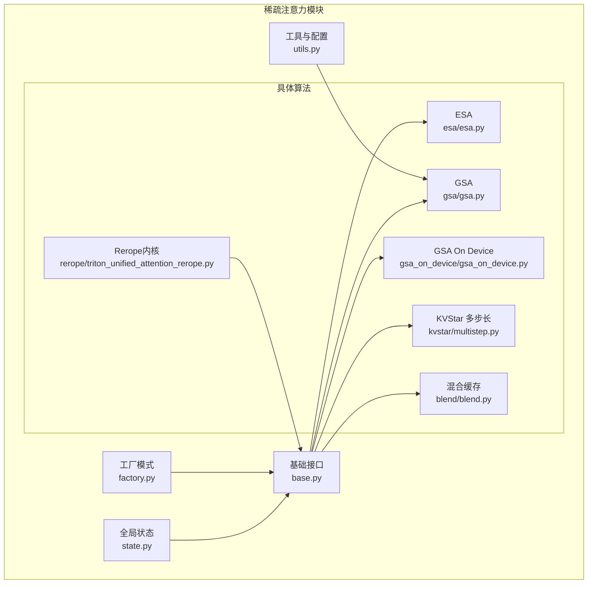
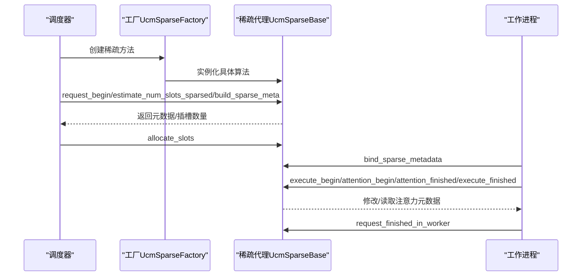
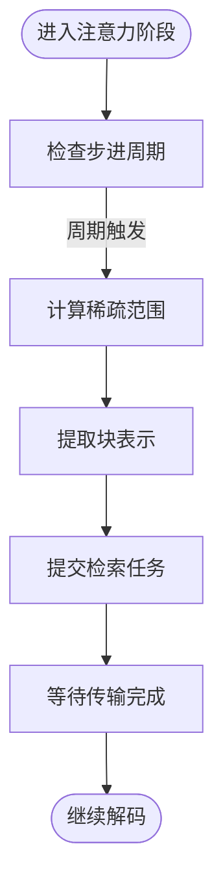
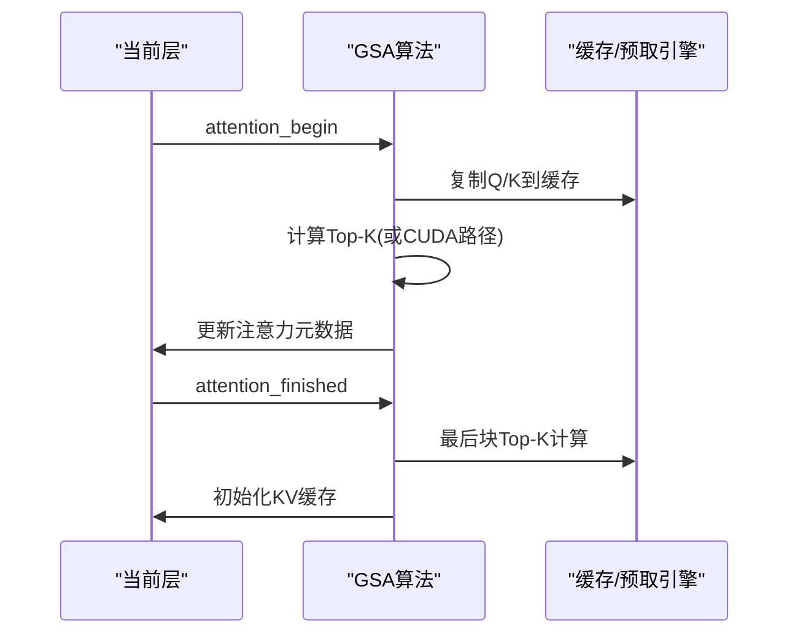
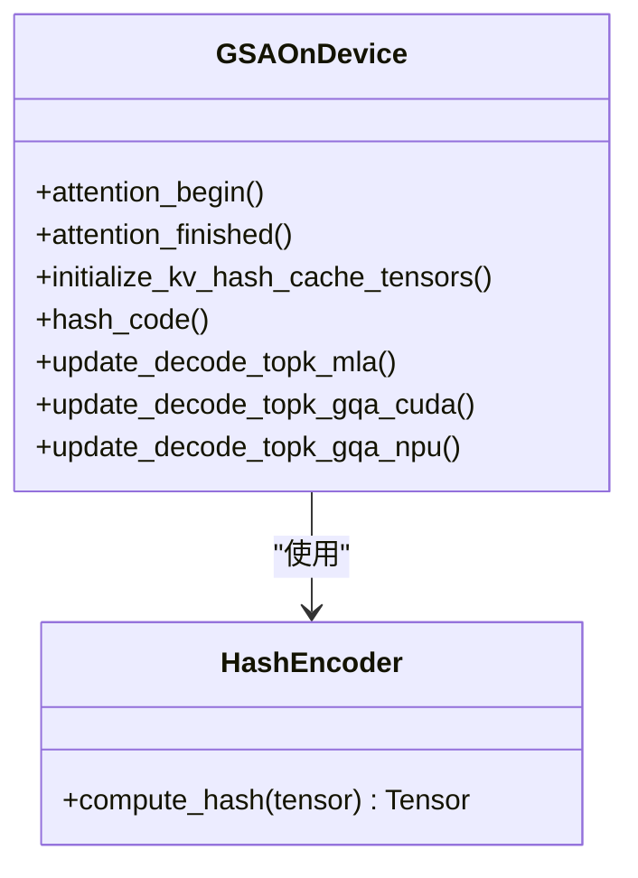
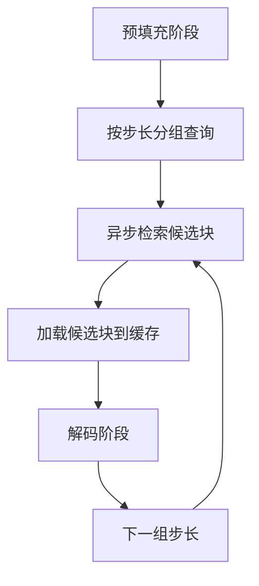
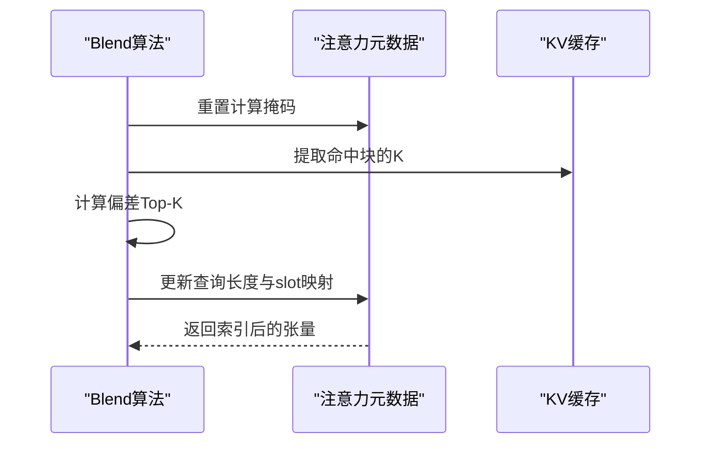
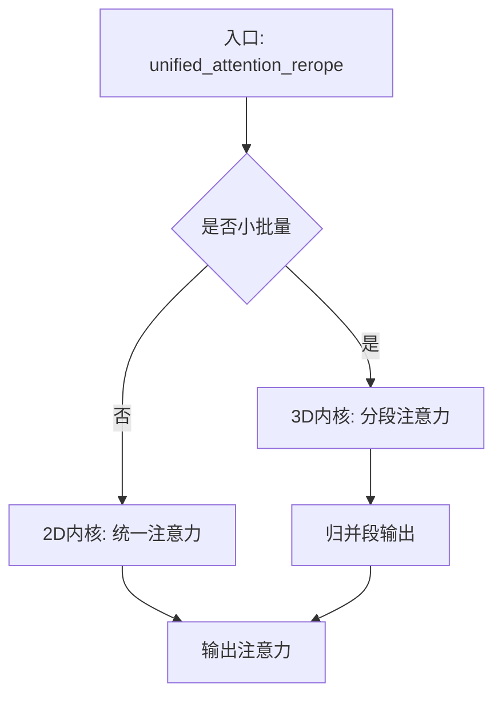
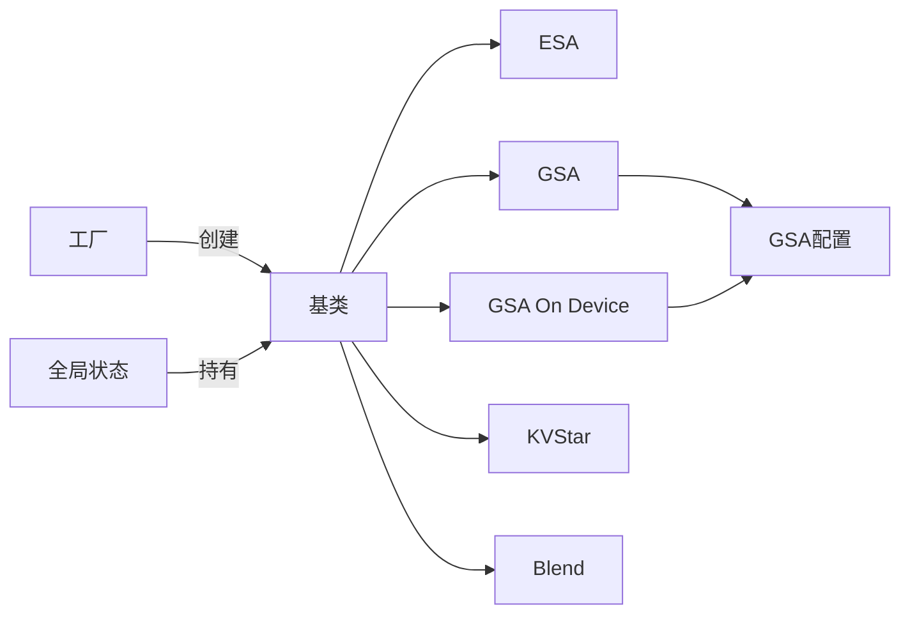

# 稀疏注意力模块设计

<cite>
**本文档引用的文件**
- [base.py](file://ucm/sparse/base.py)
- [factory.py](file://ucm/sparse/factory.py)
- [state.py](file://ucm/sparse/state.py)
- [utils.py](file://ucm/sparse/utils.py)
- [esa.py](file://ucm/sparse/esa/esa.py)
- [gsa.py](file://ucm/sparse/gsa/gsa.py)
- [gsa_on_device.py](file://ucm/sparse/gsa_on_device/gsa_on_device.py)
- [multistep.py](file://ucm/sparse/kvstar/multistep.py)
- [blend.py](file://ucm/sparse/blend/blend.py)
- [triton_unified_attention_rerope.py](file://ucm/sparse/rerope/triton_unified_attention_rerope.py)
- [offline_inference_esa.py](file://examples/offline_inference_esa.py)
- [offline_inference_gsaondevice.py](file://examples/offline_inference_gsaondevice.py)
</cite>

## 目录
1. [简介](#简介)
2. [项目结构](#项目结构)
3. [核心组件](#核心组件)
4. [架构总览](#架构总览)
5. [详细组件分析](#详细组件分析)
6. [依赖关系分析](#依赖关系分析)
7. [性能考虑](#性能考虑)
8. [故障排除指南](#故障排除指南)
9. [结论](#结论)

## 简介
本设计文档面向UCM稀疏注意力模块，系统阐述其整体架构与算法框架设计，涵盖稀疏算法基类设计、工厂模式实现，以及ESA、GSA、GSA On Device、KVStar、Blend、Rerope等具体算法的实现策略。文档重点说明各算法的设计原理、接口规范、性能特征与适用场景，并提供扩展指南与自定义算法实现示例，最后总结计算效率与内存优化策略。

## 项目结构
UCM稀疏注意力模块位于ucm/sparse目录下，采用按功能域划分的层次化组织方式：
- base.py：定义稀疏注意力抽象基类与元数据类型，统一调度器侧与工作进程侧的生命周期钩子
- factory.py：工厂模式注册与实例化稀疏算法
- state.py：全局状态管理与单Agent模式，贯穿调度器与工作进程
- utils.py：通用工具与参数配置（如GSA配置）
- 具体算法实现：
  - esa/esa.py：基于块表示的检索式稀疏注意力
  - gsa/gsa.py：基于Top-K与K预计算的稀疏注意力
  - gsa_on_device/gsa_on_device.py：设备侧哈希与Top-K加速
  - kvstar/multistep.py：多步长检索与异步加载
  - blend/blend.py：混合缓存策略
  - rerope/triton_unified_attention_rerope.py：Rerope注意力内核
- examples：使用示例脚本

**图表来源**
- [base.py](file://ucm/sparse/base.py#L127-L323)
- [factory.py](file://ucm/sparse/factory.py#L13-L57)
- [state.py](file://ucm/sparse/state.py#L23-L76)
- [utils.py](file://ucm/sparse/utils.py#L18-L65)
- [esa.py](file://ucm/sparse/esa/esa.py#L421-L821)
- [gsa.py](file://ucm/sparse/gsa/gsa.py#L475-L1166)
- [gsa_on_device.py](file://ucm/sparse/gsa_on_device/gsa_on_device.py#L99-L964)
- [multistep.py](file://ucm/sparse/kvstar/multistep.py#L645-L937)
- [blend.py](file://ucm/sparse/blend/blend.py#L149-L384)
- [triton_unified_attention_rerope.py](file://ucm/sparse/rerope/triton_unified_attention_rerope.py#L681-L885)

**章节来源**
- [base.py](file://ucm/sparse/base.py#L1-L323)
- [factory.py](file://ucm/sparse/factory.py#L1-L57)
- [state.py](file://ucm/sparse/state.py#L1-L110)
- [utils.py](file://ucm/sparse/utils.py#L1-L65)

## 核心组件
- 抽象基类UcmSparseBase：定义稀疏注意力算法的统一接口，覆盖调度器侧与工作进程侧的生命周期方法，包括请求开始/结束、执行前后、注意力前后、FFN前后、层前后等钩子，以及用于估算插槽数量、更新状态、构建稀疏元数据、分配插槽等能力
- 元数据类型UcmSparseMetadata：作为调度器与工作进程之间的通信载体
- 工厂UcmSparseFactory：通过名称注册与延迟导入机制，按配置动态创建具体稀疏算法实例
- 全局状态管理ensure_ucm_sparse_initialized/get_ucm_sparse：以单Agent模式在进程间共享稀疏代理实例，提供条件执行的便捷函数

关键接口要点：
- 调度器侧：request_begin、request_finished_in_scheduler、estimate_num_slots_sparsed、update_state_after_alloc、build_sparse_meta、allocate_slots
- 工作进程侧：bind_sparse_metadata/clear_sparse_metadata、execute_begin/execute_finished、attention_begin/attention_finished、ffn_begin/ffn_finished、layer_begin/layer_finished、request_finished_in_worker

**章节来源**
- [base.py](file://ucm/sparse/base.py#L127-L323)
- [factory.py](file://ucm/sparse/factory.py#L13-L57)
- [state.py](file://ucm/sparse/state.py#L27-L110)

## 架构总览
UCM稀疏注意力模块采用“抽象基类 + 工厂 + 全局状态”的架构，配合各算法的具体实现，形成可插拔的稀疏注意力体系。工厂负责按配置选择算法，全局状态确保调度器与工作进程共享同一算法实例；算法实现通过钩子接入推理流程的关键节点，完成KV缓存的稀疏化与高效加载。

**图表来源**
- [factory.py](file://ucm/sparse/factory.py#L30-L44)
- [state.py](file://ucm/sparse/state.py#L27-L69)
- [base.py](file://ucm/sparse/base.py#L287-L323)

## 详细组件分析

### ESA（检索式稀疏注意力）
- 设计原理：对长序列进行分块，提取块级表示，结合初始窗口与局部窗口，周期性地进行块检索与增量加载，减少解码阶段的全量KV访问
- 接口规范：实现build_sparse_meta以生成批次级元数据，attention_begin/attention_finished在注意力前后触发检索与加载，request_finished_in_worker释放资源
- 性能特征：通过块表示检索与异步传输降低带宽压力；支持MLA模型与非MLA模型差异处理
- 适用场景：长文本生成、视频理解等需要大上下文但解码阶段仍需高效的任务

**图表来源**
- [esa.py](file://ucm/sparse/esa/esa.py#L364-L420)

**章节来源**
- [esa.py](file://ucm/sparse/esa/esa.py#L421-L821)

### GSA（Top-K与K预计算稀疏注意力）
- 设计原理：在解码阶段对查询进行Top-K选择，结合K预计算与缓存，减少注意力计算复杂度；支持CUDA与CPU两种Top-K路径
- 接口规范：attention_begin/attention_finished在注意力前后复制Q/K到缓存，最后块计算Top-K并更新注意力元数据
- 性能特征：通过离线计算K均值与Top-K缓存显著降低解码时延；支持多步长预取与窗口控制
- 适用场景：长序列解码、高吞吐在线服务

**图表来源**
- [gsa.py](file://ucm/sparse/gsa/gsa.py#L627-L746)

**章节来源**
- [gsa.py](file://ucm/sparse/gsa/gsa.py#L475-L1166)
- [utils.py](file://ucm/sparse/utils.py#L18-L65)

### GSA On Device（设备侧哈希与Top-K加速）
- 设计原理：在设备侧（CUDA/NPU）利用哈希编码与汉明距离Top-K，直接在硬件上完成Top-K选择，避免主机端传输
- 接口规范：attention_begin/attention_finished在注意力前后写入/恢复哈希与块表，initialize_kv_hash_cache_tensors初始化哈希缓存
- 性能特征：显著降低主机-设备数据搬运；支持MLA与GQA两种模式；NPU路径包含专用缓冲区与切片逻辑
- 适用场景：GPU/NPU加速推理、低延迟在线服务

**图表来源**
- [gsa_on_device.py](file://ucm/sparse/gsa_on_device/gsa_on_device.py#L99-L964)

**章节来源**
- [gsa_on_device.py](file://ucm/sparse/gsa_on_device/gsa_on_device.py#L99-L964)

### KVStar（多步长检索与异步加载）
- 设计原理：在长预填充阶段采用多步长检索策略，将检索与传输异步化，解码阶段仅加载候选块，减少冗余传输
- 接口规范：ReqPerLayerState封装每请求每层的状态，包括块表示提取、检索任务提交、传输任务等待与结果加载
- 性能特征：通过异步检索与分组传输提升吞吐；支持维度裁剪与块内聚合以降低存储与计算开销
- 适用场景：超长序列预填充与解码混合场景

**图表来源**
- [multistep.py](file://ucm/sparse/kvstar/multistep.py#L356-L494)

**章节来源**
- [multistep.py](file://ucm/sparse/kvstar/multistep.py#L645-L937)

### Blend（混合缓存策略）
- 设计原理：对已命中块缓存的部分进行Top-K偏差评估，仅重算偏差最大的片段，其余部分复用黄金KV
- 接口规范：build_sparse_meta构建请求元信息，attention_begin计算Top-K并更新注意力元数据，execute_finished修正logits索引
- 性能特征：显著减少重算token数，提升吞吐；支持批内重索引与掩码更新
- 适用场景：多请求混合批、块缓存命中率高的场景

**图表来源**
- [blend.py](file://ucm/sparse/blend/blend.py#L226-L338)

**章节来源**
- [blend.py](file://ucm/sparse/blend/blend.py#L149-L384)

### Rerope（重Rope注意力内核）
- 设计原理：基于Triton实现的统一注意力内核，支持Rerope窗口切换、滑动窗口、SoftCap等特性，优化长序列注意力计算
- 接口规范：提供kernel_unified_attention_2d/kernel_unified_attention_3d/reduce_segments等内核，统一入口unified_attention_rerope
- 性能特征：通过分段注意力与运行时归一化减少数值不稳定；支持FP8与Alibi斜率
- 适用场景：长序列因果注意力、多段注意力融合

**图表来源**
- [triton_unified_attention_rerope.py](file://ucm/sparse/rerope/triton_unified_attention_rerope.py#L681-L885)

**章节来源**
- [triton_unified_attention_rerope.py](file://ucm/sparse/rerope/triton_unified_attention_rerope.py#L1-L885)

## 依赖关系分析
- 组件耦合与内聚：各算法均继承自UcmSparseBase，遵循统一接口，内聚于各自的数据流与计算策略；工厂与全局状态提供低耦合的创建与共享机制
- 直接与间接依赖：
  - 工厂依赖具体算法模块（延迟导入），通过名称注册
  - 全局状态依赖工厂与配置，提供单Agent实例
  - 各算法依赖基础接口与工具（如GSA配置）
- 外部依赖与集成点：
  - vLLM的ForwardContext、KVCache、SchedulerOutput等
  - 存储层（如NFS/Posix/UcmPipelineStore）通过连接器注入
  - Triton内核与设备侧算子（CUDA/NPU）

**图表来源**
- [factory.py](file://ucm/sparse/factory.py#L30-L57)
- [state.py](file://ucm/sparse/state.py#L27-L69)
- [base.py](file://ucm/sparse/base.py#L127-L323)
- [utils.py](file://ucm/sparse/utils.py#L18-L65)

**章节来源**
- [factory.py](file://ucm/sparse/factory.py#L1-L57)
- [state.py](file://ucm/sparse/state.py#L1-L110)
- [base.py](file://ucm/sparse/base.py#L1-L323)
- [utils.py](file://ucm/sparse/utils.py#L1-L65)

## 性能考虑
- 计算效率
  - GSA/GSA On Device通过Top-K与K预计算减少注意力计算量；GSA On Device进一步在设备侧完成Top-K，避免主机搬运
  - KVStar采用多步长异步检索与分组传输，降低带宽占用
  - Blend仅重算偏差最大片段，最大化复用已缓存KV
  - Rerope内核通过分段注意力与归一化减少数值问题
- 内存优化
  - GSA配置中的块大小、Top-K范围、预取块数等参数影响内存占用与带宽；utils提供自动对齐与尺寸计算
  - GSA On Device按模型自动选择配置文件，确保参数与硬件匹配
  - KVStar支持维度裁剪与块内聚合，降低存储需求
- 扩展性
  - 工厂模式支持新增算法注册；基类接口保证新算法无缝接入
  - 全局状态单Agent模式便于跨进程共享与调试

[本节为通用指导，无需特定文件引用]

## 故障排除指南
- 算法未启用
  - 检查KVTransferConfig中ucm_sparse_config配置项是否存在且名称正确
  - 确认环境变量ENABLE_SPARSE已设置为true
- 参数不匹配
  - GSA On Device需确保模型名与配置文件匹配，否则会抛出不支持模型异常
  - 检查块大小与序列长度约束，避免超出最大模型长度
- 设备侧错误
  - CUDA路径：确认设备可用与算子存在
  - NPU路径：检查自定义算子与缓冲区初始化
- 性能异常
  - 调整GSA配置（块大小、Top-K范围、预取块数）与KVStar的稀疏比例与步长
  - 对比不同算法在相同场景下的表现，选择最优方案

**章节来源**
- [gsa_on_device.py](file://ucm/sparse/gsa_on_device/gsa_on_device.py#L46-L97)
- [offline_inference_esa.py](file://examples/offline_inference_esa.py#L24-L104)
- [offline_inference_gsaondevice.py](file://examples/offline_inference_gsaondevice.py#L24-L102)

## 结论
UCM稀疏注意力模块通过抽象基类统一接口、工厂与全局状态实现灵活可插拔的架构，结合ESA、GSA、GSA On Device、KVStar、Blend、Rerope等多种算法策略，在长序列推理场景下实现了显著的性能与资源优化。开发者可根据任务特点选择合适算法，或基于基类扩展新的稀疏注意力实现。