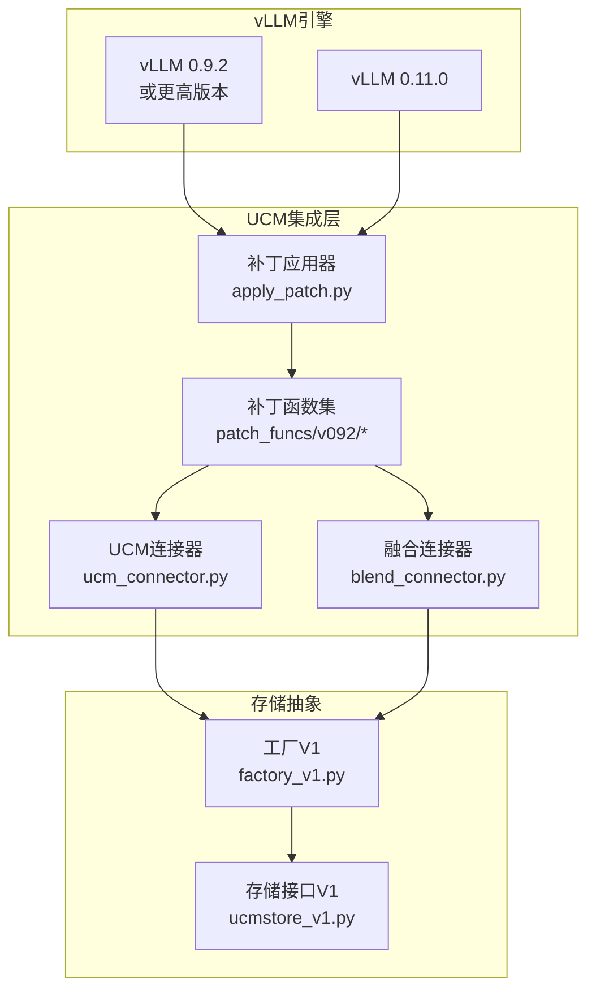
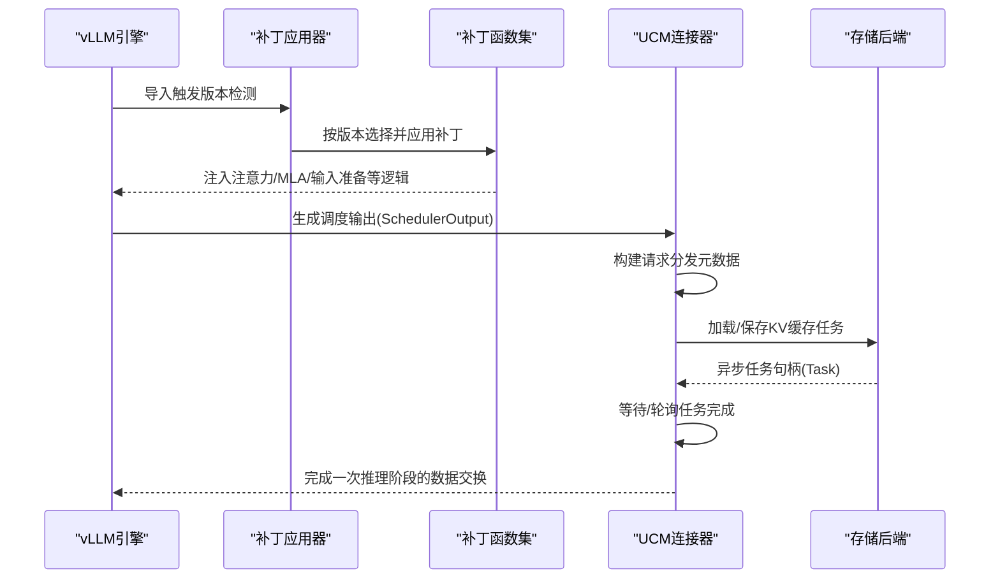
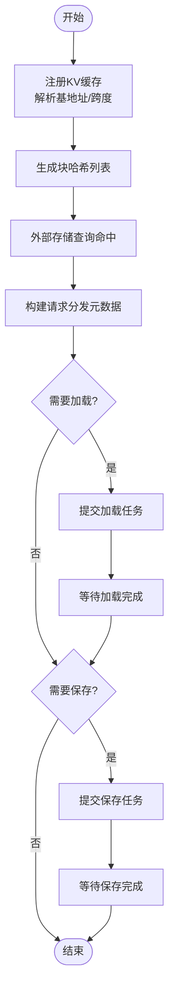
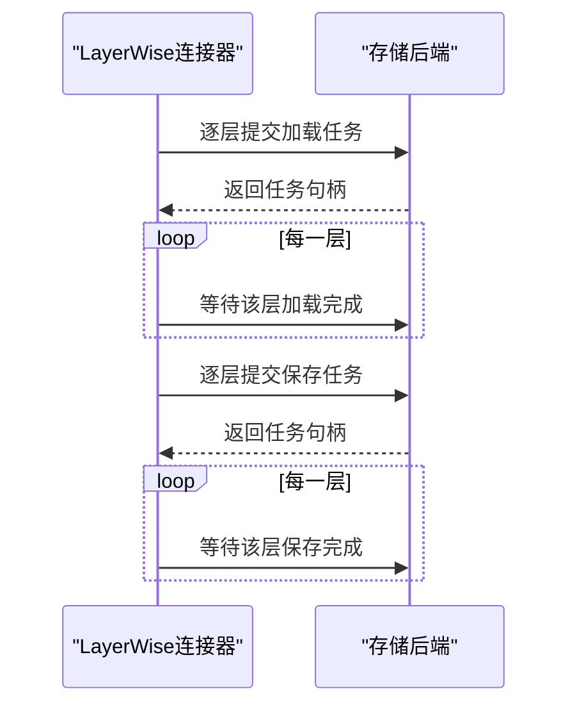
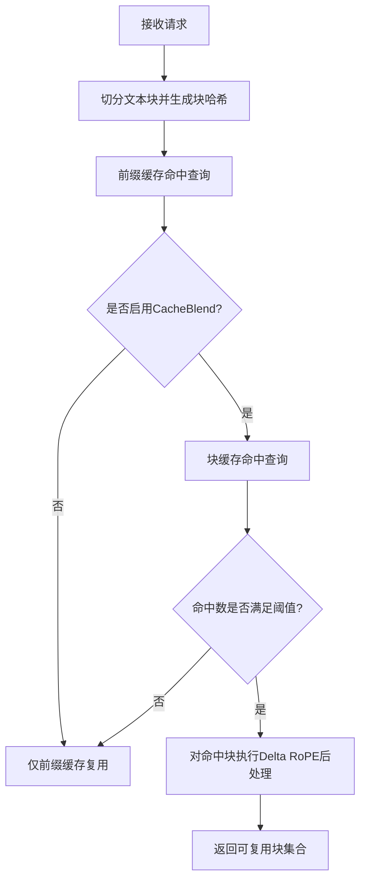
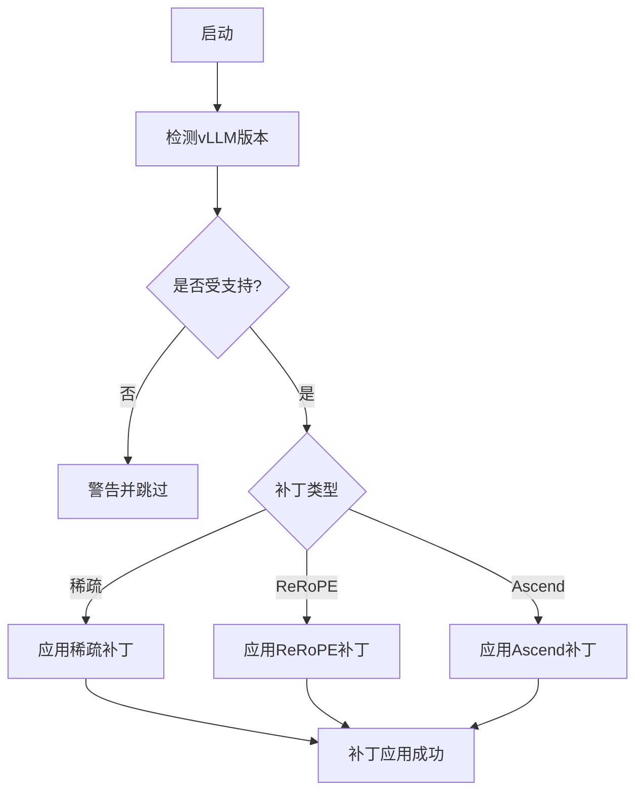
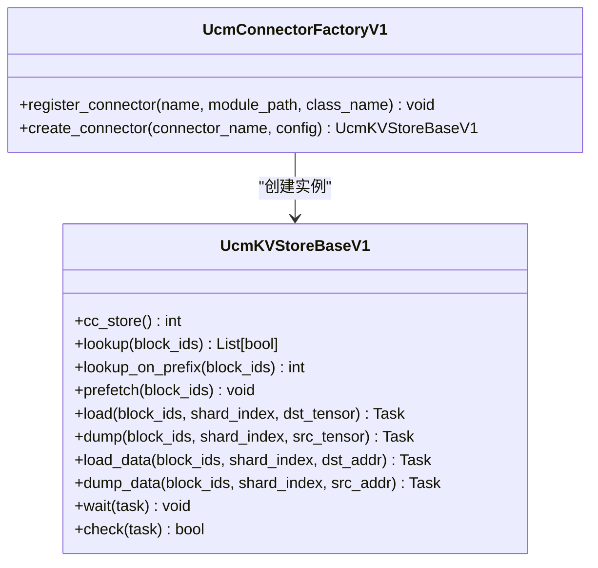
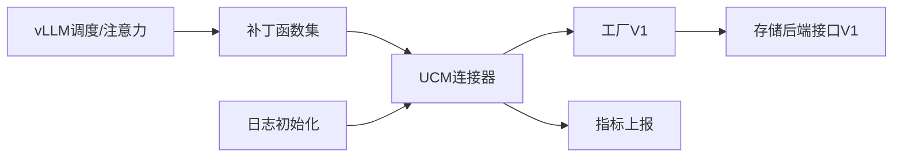

# 集成模块设计

<cite>
**本文引用的文件**
- [ucm/integration/vllm/ucm_connector.py](file://ucm/integration/vllm/ucm_connector.py)
- [ucm/integration/vllm/blend_connector.py](file://ucm/integration/vllm/blend_connector.py)
- [ucm/integration/vllm/patch/apply_patch.py](file://ucm/integration/vllm/patch/apply_patch.py)
- [ucm/integration/vllm/patch/patch_funcs/v092/vllm_patch.py](file://ucm/integration/vllm/patch/patch_funcs/v092/vllm_patch.py)
- [ucm/integration/vllm/patch/patch_funcs/v092/vllm_rerope_patch.py](file://ucm/integration/vllm/patch/patch_funcs/v092/vllm_rerope_patch.py)
- [ucm/integration/vllm/patch/patch_funcs/v092/vllm_ascend_patch.py](file://ucm/integration/vllm/patch/patch_funcs/v092/vllm_ascend_patch.py)
- [ucm/store/factory_v1.py](file://ucm/store/factory_v1.py)
- [ucm/store/ucmstore_v1.py](file://ucm/store/ucmstore_v1.py)
- [docs/source/getting-started/quickstart_vllm.md](file://docs/source/getting-started/quickstart_vllm.md)
- [examples/ucm_config_example.yaml](file://examples/ucm_config_example.yaml)
- [ucm/__init__.py](file://ucm/__init__.py)
</cite>

## 目录
1. [引言](#引言)
2. [项目结构](#项目结构)
3. [核心组件](#核心组件)
4. [架构总览](#架构总览)
5. [详细组件分析](#详细组件分析)
6. [依赖关系分析](#依赖关系分析)
7. [性能考量](#性能考量)
8. [故障排查指南](#故障排查指南)
9. [结论](#结论)
10. [附录](#附录)

## 引言
本设计文档聚焦于UCM（Unified Cache Management）在vLLM中的集成模块，系统阐述其整体架构、与vLLM引擎的对接方式、数据流转与状态管理、连接器设计模式、缓存融合连接器实现，以及版本适配补丁机制。文档同时提供配置指南与自定义集成示例，并给出性能影响与优化建议。

## 项目结构
ucm/integration/vllm目录包含以下关键子模块：
- 连接器：UCM主连接器与分块缓存融合连接器
- 补丁机制：自动检测并应用vLLM版本补丁，支持稀疏注意力、ReRoPE与Ascend平台
- 存储抽象：统一KV缓存存储接口与工厂注册

**图示来源**
- [ucm/integration/vllm/patch/apply_patch.py](file://ucm/integration/vllm/patch/apply_patch.py#L84-L118)
- [ucm/integration/vllm/patch/patch_funcs/v092/vllm_patch.py](file://ucm/integration/vllm/patch/patch_funcs/v092/vllm_patch.py#L39-L60)
- [ucm/integration/vllm/ucm_connector.py](file://ucm/integration/vllm/ucm_connector.py#L82-L162)
- [ucm/integration/vllm/blend_connector.py](file://ucm/integration/vllm/blend_connector.py#L121-L147)
- [ucm/store/factory_v1.py](file://ucm/store/factory_v1.py#L34-L57)
- [ucm/store/ucmstore_v1.py](file://ucm/store/ucmstore_v1.py#L41-L202)

**章节来源**
- [ucm/integration/vllm/ucm_connector.py](file://ucm/integration/vllm/ucm_connector.py#L82-L162)
- [ucm/integration/vllm/blend_connector.py](file://ucm/integration/vllm/blend_connector.py#L121-L147)
- [ucm/integration/vllm/patch/apply_patch.py](file://ucm/integration/vllm/patch/apply_patch.py#L84-L118)
- [ucm/store/factory_v1.py](file://ucm/store/factory_v1.py#L34-L57)
- [ucm/store/ucmstore_v1.py](file://ucm/store/ucmstore_v1.py#L41-L202)

## 核心组件
- UCMDirectConnector：直接同步加载/保存KV缓存，支持MLA/DLA与RoPE分离场景
- UCMLayerWiseConnector：逐层重叠加载/保存，提升吞吐
- UCMBlendConnector：基于分块哈希与前缀缓存的融合连接器，支持CacheBlend
- 补丁应用器：按vLLM版本自动应用稀疏注意力、ReRoPE或Ascend平台补丁
- 存储接口与工厂：统一KV缓存存储抽象，支持NFS/Pipeline等后端

**章节来源**
- [ucm/integration/vllm/ucm_connector.py](file://ucm/integration/vllm/ucm_connector.py#L82-L162)
- [ucm/integration/vllm/ucm_connector.py](file://ucm/integration/vllm/ucm_connector.py#L661-L751)
- [ucm/integration/vllm/blend_connector.py](file://ucm/integration/vllm/blend_connector.py#L121-L147)
- [ucm/integration/vllm/patch/apply_patch.py](file://ucm/integration/vllm/patch/apply_patch.py#L84-L118)
- [ucm/store/ucmstore_v1.py](file://ucm/store/ucmstore_v1.py#L41-L202)
- [ucm/store/factory_v1.py](file://ucm/store/factory_v1.py#L34-L57)

## 架构总览
UCM通过“连接器+补丁+存储抽象”的三层架构与vLLM集成：
- 补丁层：在运行时对vLLM关键模块进行猴子补丁，注入UCM稀疏注意力、ReRoPE与平台适配逻辑
- 连接器层：实现KV缓存的加载/保存调度与元数据构建，桥接vLLM调度输出与存储后端
- 存储层：统一接口屏蔽不同后端差异，工厂负责动态注册与实例化

**图示来源**
- [ucm/integration/vllm/patch/apply_patch.py](file://ucm/integration/vllm/patch/apply_patch.py#L139-L192)
- [ucm/integration/vllm/patch/patch_funcs/v092/vllm_patch.py](file://ucm/integration/vllm/patch/patch_funcs/v092/vllm_patch.py#L140-L400)
- [ucm/integration/vllm/ucm_connector.py](file://ucm/integration/vllm/ucm_connector.py#L397-L447)
- [ucm/store/ucmstore_v1.py](file://ucm/store/ucmstore_v1.py#L102-L179)

## 详细组件分析

### UCMDirectConnector 设计与数据流
- 请求哈希与块ID生成：基于请求特征与种子生成稳定块哈希，支持按块大小切分
- 注册KV缓存：解析vLLM KV张量基地址，计算块跨度与数据尺寸
- 调度元数据构建：根据调度输出与已命中块，生成加载/保存块映射
- 异步加载/保存：按vLLM块ID计算设备指针，提交存储后端任务并等待完成
- 错误处理：记录加载失败的块ID，便于后续重试或回退

**图示来源**
- [ucm/integration/vllm/ucm_connector.py](file://ucm/integration/vllm/ucm_connector.py#L167-L185)
- [ucm/integration/vllm/ucm_connector.py](file://ucm/integration/vllm/ucm_connector.py#L293-L348)
- [ucm/integration/vllm/ucm_connector.py](file://ucm/integration/vllm/ucm_connector.py#L397-L447)
- [ucm/integration/vllm/ucm_connector.py](file://ucm/integration/vllm/ucm_connector.py#L488-L564)
- [ucm/integration/vllm/ucm_connector.py](file://ucm/integration/vllm/ucm_connector.py#L566-L644)

**章节来源**
- [ucm/integration/vllm/ucm_connector.py](file://ucm/integration/vllm/ucm_connector.py#L82-L162)
- [ucm/integration/vllm/ucm_connector.py](file://ucm/integration/vllm/ucm_connector.py#L293-L348)
- [ucm/integration/vllm/ucm_connector.py](file://ucm/integration/vllm/ucm_connector.py#L397-L447)
- [ucm/integration/vllm/ucm_connector.py](file://ucm/integration/vllm/ucm_connector.py#L488-L564)
- [ucm/integration/vllm/ucm_connector.py](file://ucm/integration/vllm/ucm_connector.py#L566-L644)

### UCMLayerWiseConnector（逐层重叠）
- 逐层加载/保存：按层数分别提交任务，实现层间重叠，降低延迟
- 多后端适配：针对MLA/DLA/GQA场景，分别处理K/V或K/RoPE指针

**图示来源**
- [ucm/integration/vllm/ucm_connector.py](file://ucm/integration/vllm/ucm_connector.py#L661-L751)
- [ucm/integration/vllm/ucm_connector.py](file://ucm/integration/vllm/ucm_connector.py#L752-L800)

**章节来源**
- [ucm/integration/vllm/ucm_connector.py](file://ucm/integration/vllm/ucm_connector.py#L661-L751)
- [ucm/integration/vllm/ucm_connector.py](file://ucm/integration/vllm/ucm_connector.py#L752-L800)

### UCMBlendConnector（缓存融合）
- 分块哈希与前缀缓存：将请求切分为文本块，构建块级哈希
- 命中统计与阈值控制：仅当块命中超过阈值才进行CacheBlend
- Delta RoPE后处理：对命中块执行块级RoPE变换以复用缓存

**图示来源**
- [ucm/integration/vllm/blend_connector.py](file://ucm/integration/vllm/blend_connector.py#L148-L220)
- [ucm/integration/vllm/blend_connector.py](file://ucm/integration/vllm/blend_connector.py#L222-L259)
- [ucm/integration/vllm/blend_connector.py](file://ucm/integration/vllm/blend_connector.py#L325-L333)
- [ucm/integration/vllm/blend_connector.py](file://ucm/integration/vllm/blend_connector.py#L493-L499)

**章节来源**
- [ucm/integration/vllm/blend_connector.py](file://ucm/integration/vllm/blend_connector.py#L121-L147)
- [ucm/integration/vllm/blend_connector.py](file://ucm/integration/vllm/blend_connector.py#L148-L220)
- [ucm/integration/vllm/blend_connector.py](file://ucm/integration/vllm/blend_connector.py#L222-L259)
- [ucm/integration/vllm/blend_connector.py](file://ucm/integration/vllm/blend_connector.py#L325-L333)
- [ucm/integration/vllm/blend_connector.py](file://ucm/integration/vllm/blend_connector.py#L493-L499)

### 补丁应用机制与版本兼容
- 版本检测：自动探测vLLM版本，当前支持0.9.2；0.11.0仅需稀疏补丁
- 条件应用：根据环境变量启用稀疏、ReRoPE或Ascend平台补丁
- 导入钩子：若vLLM尚未导入，拦截导入并在首次导入时应用补丁

**图示来源**
- [ucm/integration/vllm/patch/apply_patch.py](file://ucm/integration/vllm/patch/apply_patch.py#L59-L118)
- [ucm/integration/vllm/patch/apply_patch.py](file://ucm/integration/vllm/patch/apply_patch.py#L139-L192)
- [ucm/integration/vllm/patch/patch_funcs/v092/vllm_patch.py](file://ucm/integration/vllm/patch/patch_funcs/v092/vllm_patch.py#L39-L60)
- [ucm/integration/vllm/patch/patch_funcs/v092/vllm_rerope_patch.py](file://ucm/integration/vllm/patch/patch_funcs/v092/vllm_rerope_patch.py#L36-L49)
- [ucm/integration/vllm/patch/patch_funcs/v092/vllm_ascend_patch.py](file://ucm/integration/vllm/patch/patch_funcs/v092/vllm_ascend_patch.py#L40-L54)

**章节来源**
- [ucm/integration/vllm/patch/apply_patch.py](file://ucm/integration/vllm/patch/apply_patch.py#L59-L118)
- [ucm/integration/vllm/patch/apply_patch.py](file://ucm/integration/vllm/patch/apply_patch.py#L139-L192)
- [ucm/integration/vllm/patch/patch_funcs/v092/vllm_patch.py](file://ucm/integration/vllm/patch/patch_funcs/v092/vllm_patch.py#L39-L60)
- [ucm/integration/vllm/patch/patch_funcs/v092/vllm_rerope_patch.py](file://ucm/integration/vllm/patch/patch_funcs/v092/vllm_rerope_patch.py#L36-L49)
- [ucm/integration/vllm/patch/patch_funcs/v092/vllm_ascend_patch.py](file://ucm/integration/vllm/patch/patch_funcs/v092/vllm_ascend_patch.py#L40-L54)

### 存储抽象与工厂注册
- 统一接口：UcmKVStoreBaseV1定义查找、预取、加载/保存、低层数据搬运与等待/轮询
- 工厂注册：通过名称与模块路径注册具体存储实现，按需动态加载

**图示来源**
- [ucm/store/ucmstore_v1.py](file://ucm/store/ucmstore_v1.py#L41-L202)
- [ucm/store/factory_v1.py](file://ucm/store/factory_v1.py#L34-L57)

**章节来源**
- [ucm/store/ucmstore_v1.py](file://ucm/store/ucmstore_v1.py#L41-L202)
- [ucm/store/factory_v1.py](file://ucm/store/factory_v1.py#L34-L57)

## 依赖关系分析
- 连接器依赖vLLM调度输出与KV缓存管理，通过补丁扩展注意力与MLA路径
- 存储后端通过工厂解耦，支持NFS/Pipeline等多后端
- 日志与指标：统一日志初始化与Prometheus指标上报

**图示来源**
- [ucm/integration/vllm/patch/patch_funcs/v092/vllm_patch.py](file://ucm/integration/vllm/patch/patch_funcs/v092/vllm_patch.py#L140-L400)
- [ucm/integration/vllm/ucm_connector.py](file://ucm/integration/vllm/ucm_connector.py#L142-L156)
- [ucm/store/factory_v1.py](file://ucm/store/factory_v1.py#L34-L57)
- [ucm/store/ucmstore_v1.py](file://ucm/store/ucmstore_v1.py#L41-L202)
- [ucm/__init__.py](file://ucm/__init__.py#L29-L49)

**章节来源**
- [ucm/integration/vllm/patch/patch_funcs/v092/vllm_patch.py](file://ucm/integration/vllm/patch/patch_funcs/v092/vllm_patch.py#L140-L400)
- [ucm/integration/vllm/ucm_connector.py](file://ucm/integration/vllm/ucm_connector.py#L142-L156)
- [ucm/store/factory_v1.py](file://ucm/store/factory_v1.py#L34-L57)
- [ucm/store/ucmstore_v1.py](file://ucm/store/ucmstore_v1.py#L41-L202)
- [ucm/__init__.py](file://ucm/__init__.py#L29-L49)

## 性能考量
- 层间重叠：LayerWise连接器通过逐层加载/保存减少等待时间
- 块粒度与批量：合理设置块大小与批量可提升I/O效率
- 设备同步：在保存前进行设备流同步，避免异步拷贝竞争
- 指标监控：通过Prometheus统计加载/保存速度与命中率，辅助调优

[本节为通用指导，无需特定文件引用]

## 故障排查指南
- 补丁未应用：确认vLLM版本与环境变量，检查导入钩子是否安装
- 连接器未创建存储：核对配置文件中的连接器名称与参数
- 加载失败块ID：使用连接器提供的错误块ID集合进行重试或降级
- 日志路径：通过环境变量设置日志目录与轮转参数

**章节来源**
- [ucm/integration/vllm/patch/apply_patch.py](file://ucm/integration/vllm/patch/apply_patch.py#L139-L192)
- [ucm/integration/vllm/ucm_connector.py](file://ucm/integration/vllm/ucm_connector.py#L648-L658)
- [ucm/__init__.py](file://ucm/__init__.py#L29-L49)

## 结论
UCM集成模块通过“自动补丁+连接器+存储抽象”实现了与vLLM的深度集成，覆盖了稀疏注意力、ReRoPE与多平台适配，并提供了灵活的缓存融合能力。借助工厂化的存储后端与完善的指标体系，可在生产环境中获得稳定的性能与可观测性。

## 附录

### 配置指南
- 快速开始：参考官方快速入门文档，选择合适的vLLM版本与安装方式
- 配置文件：在KVTransferConfig中指定UCM连接器模块路径与配置文件路径
- 功能开关：通过环境变量启用稀疏注意力与ReRoPE，按需设置日志路径

**章节来源**
- [docs/source/getting-started/quickstart_vllm.md](file://docs/source/getting-started/quickstart_vllm.md#L133-L237)
- [examples/ucm_config_example.yaml](file://examples/ucm_config_example.yaml#L1-L39)

### 自定义集成示例
- 新增存储后端：在工厂中注册新连接器类名与模块路径，实现UcmKVStoreBaseV1接口
- 扩展连接器：继承UCMDirectConnector或UCMLayerWiseConnector，重写特定阶段逻辑
- 补丁扩展：新增版本补丁函数集，更新补丁应用器的版本分支

**章节来源**
- [ucm/store/factory_v1.py](file://ucm/store/factory_v1.py#L34-L57)
- [ucm/store/ucmstore_v1.py](file://ucm/store/ucmstore_v1.py#L41-L202)
- [ucm/integration/vllm/patch/apply_patch.py](file://ucm/integration/vllm/patch/apply_patch.py#L84-L118)
- [ucm/integration/vllm/patch/patch_funcs/v092/vllm_patch.py](file://ucm/integration/vllm/patch/patch_funcs/v092/vllm_patch.py#L39-L60)