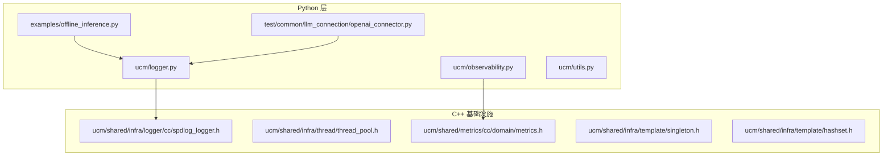
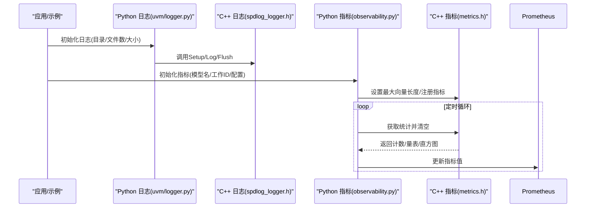
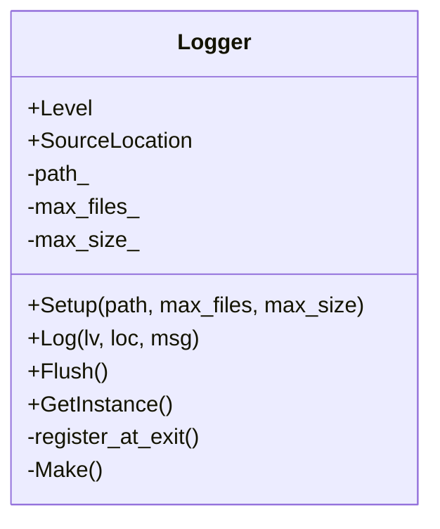
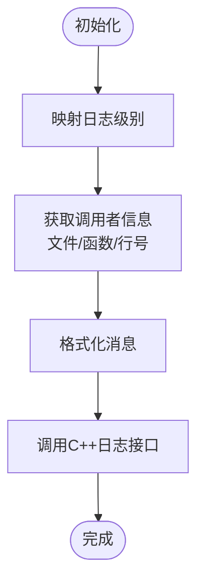
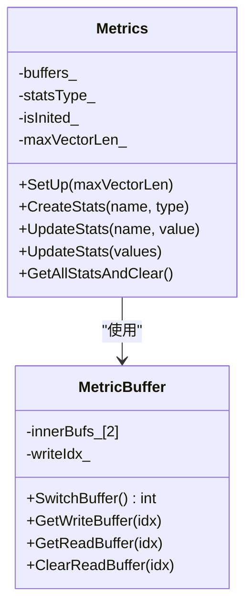
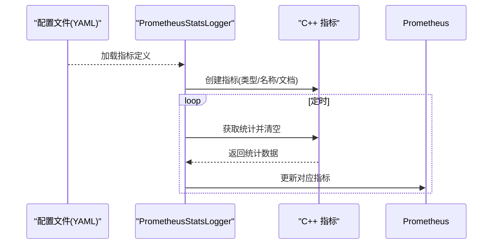
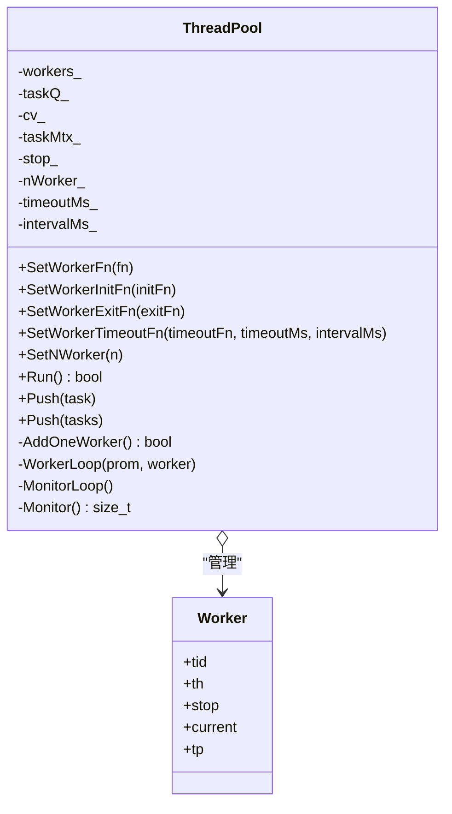
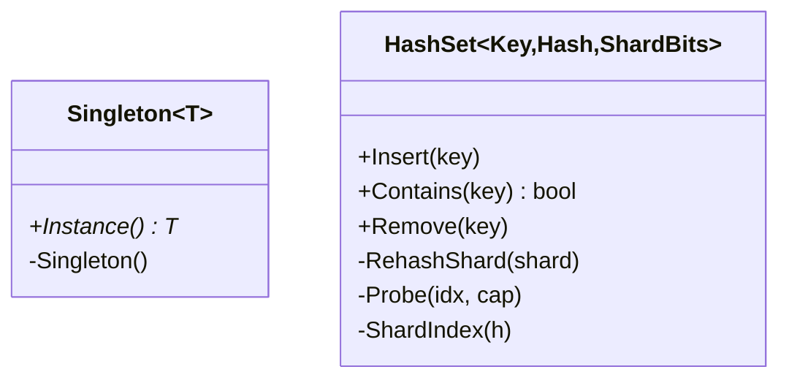
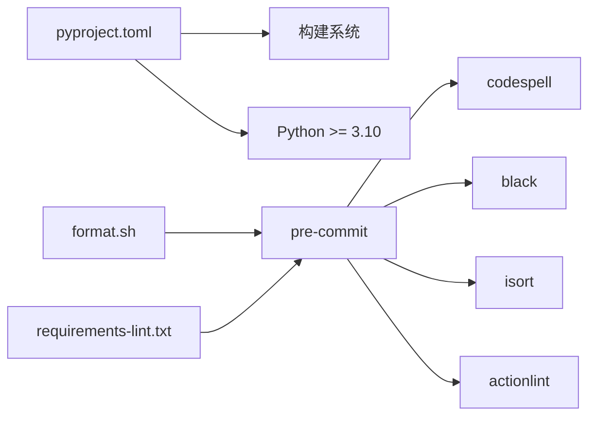

# 编码规范与约定

<cite>
**本文引用的文件**
- [.clang-format](file://.clang-format)
- [format.sh](file://format.sh)
- [.pre-commit-config.yaml](file://.pre-commit-config.yaml)
- [requirements-lint.txt](file://requirements-lint.txt)
- [pyproject.toml](file://pyproject.toml)
- [ucm/shared/infra/logger/cc/spdlog_logger.h](file://ucm/shared/infra/logger/cc/spdlog_logger.h)
- [ucm/shared/infra/thread/thread_pool.h](file://ucm/shared/infra/thread/thread_pool.h)
- [ucm/shared/metrics/cc/domain/metrics.h](file://ucm/shared/metrics/cc/domain/metrics.h)
- [ucm/shared/infra/template/singleton.h](file://ucm/shared/infra/template/singleton.h)
- [ucm/shared/infra/template/hashset.h](file://ucm/shared/infra/template/hashset.h)
- [ucm/logger.py](file://ucm/logger.py)
- [ucm/observability.py](file://ucm/observability.py)
- [ucm/utils.py](file://ucm/utils.py)
- [examples/offline_inference.py](file://examples/offline_inference.py)
- [test/common/llm_connection/openai_connector.py](file://test/common/llm_connection/openai_connector.py)
</cite>

## 目录
1. [简介](#简介)
2. [项目结构](#项目结构)
3. [核心组件](#核心组件)
4. [架构总览](#架构总览)
5. [详细组件分析](#详细组件分析)
6. [依赖关系分析](#依赖关系分析)
7. [性能考虑](#性能考虑)
8. [故障排查指南](#故障排查指南)
9. [结论](#结论)
10. [附录](#附录)

## 简介
本文件为UCM（统一缓存管理）项目的编码规范与约定文档，覆盖C++与Python代码的命名约定、文件组织结构、代码风格、模板元编程使用规范与最佳实践，以及基础设施组件（日志、指标、线程池等）的实现规范。同时提供代码格式化工具配置与使用指南，并给出代码审查检查清单与质量保证流程建议。

## 项目结构
- 语言与模块分布
  - C++基础设施：日志、指标、线程池、通用模板（单例、哈希集合、环形队列等）
  - Python应用层：日志桥接、可观测性（Prometheus）、配置加载、示例与测试连接器
  - 示例与测试：离线推理示例、OpenAI兼容连接器、测试用例
- 关键目录
  - ucm/shared/infra：C++基础设施组件
  - ucm/shared/metrics：C++指标域
  - ucm/logger.py、ucm/observability.py、ucm/utils.py：Python侧日志与指标桥接
  - examples、test：示例与测试

图表来源
- [ucm/logger.py](file://ucm/logger.py#L1-L84)
- [ucm/observability.py](file://ucm/observability.py#L1-L197)
- [ucm/shared/infra/logger/cc/spdlog_logger.h](file://ucm/shared/infra/logger/cc/spdlog_logger.h#L1-L78)
- [ucm/shared/infra/thread/thread_pool.h](file://ucm/shared/infra/thread/thread_pool.h#L1-L228)
- [ucm/shared/metrics/cc/domain/metrics.h](file://ucm/shared/metrics/cc/domain/metrics.h#L1-L120)
- [ucm/shared/infra/template/singleton.h](file://ucm/shared/infra/template/singleton.h#L1-L47)
- [ucm/shared/infra/template/hashset.h](file://ucm/shared/infra/template/hashset.h#L1-L137)
- [examples/offline_inference.py](file://examples/offline_inference.py#L1-L112)
- [test/common/llm_connection/openai_connector.py](file://test/common/llm_connection/openai_connector.py#L1-L305)

章节来源
- [ucm/logger.py](file://ucm/logger.py#L1-L84)
- [ucm/observability.py](file://ucm/observability.py#L1-L197)
- [ucm/shared/infra/logger/cc/spdlog_logger.h](file://ucm/shared/infra/logger/cc/spdlog_logger.h#L1-L78)
- [ucm/shared/infra/thread/thread_pool.h](file://ucm/shared/infra/thread/thread_pool.h#L1-L228)
- [ucm/shared/metrics/cc/domain/metrics.h](file://ucm/shared/metrics/cc/domain/metrics.h#L1-L120)
- [ucm/shared/infra/template/singleton.h](file://ucm/shared/infra/template/singleton.h#L1-L47)
- [ucm/shared/infra/template/hashset.h](file://ucm/shared/infra/template/hashset.h#L1-L137)
- [examples/offline_inference.py](file://examples/offline_inference.py#L1-L112)
- [test/common/llm_connection/openai_connector.py](file://test/common/llm_connection/openai_connector.py#L1-L305)

## 核心组件
- 日志系统
  - C++侧：基于第三方日志库的日志类，支持级别枚举、信号处理下的刷新、路径与轮转参数配置
  - Python侧：封装C++日志接口，提供便捷的初始化与调用
- 指标系统
  - C++侧：多缓冲无锁更新、类型注册、线程本地缓冲、读写切换
  - Python侧：通过Prometheus客户端动态注册指标，周期从C++缓冲拉取数据
- 线程池
  - C++侧：可配置工作函数、初始化/退出回调、超时监控、自愈重建
- 通用模板
  - 单例：线程安全静态实例
  - 哈希集合：分片哈希表，支持插入/查询/删除

章节来源
- [ucm/shared/infra/logger/cc/spdlog_logger.h](file://ucm/shared/infra/logger/cc/spdlog_logger.h#L31-L74)
- [ucm/logger.py](file://ucm/logger.py#L32-L75)
- [ucm/shared/metrics/cc/domain/metrics.h](file://ucm/shared/metrics/cc/domain/metrics.h#L39-L117)
- [ucm/observability.py](file://ucm/observability.py#L40-L196)
- [ucm/shared/infra/thread/thread_pool.h](file://ucm/shared/infra/thread/thread_pool.h#L41-L223)
- [ucm/shared/infra/template/singleton.h](file://ucm/shared/infra/template/singleton.h#L29-L42)
- [ucm/shared/infra/template/hashset.h](file://ucm/shared/infra/template/hashset.h#L37-L132)

## 架构总览
下图展示Python侧日志与指标桥接到C++基础设施的整体流程。

图表来源
- [ucm/logger.py](file://ucm/logger.py#L40-L75)
- [ucm/shared/infra/logger/cc/spdlog_logger.h](file://ucm/shared/infra/logger/cc/spdlog_logger.h#L59-L74)
- [ucm/observability.py](file://ucm/observability.py#L60-L196)
- [ucm/shared/metrics/cc/domain/metrics.h](file://ucm/shared/metrics/cc/domain/metrics.h#L80-L117)

## 详细组件分析

### 日志组件（C++）
- 设计要点
  - 级别枚举与源位置信息封装
  - 信号处理自动刷新，避免崩溃时丢失日志
  - 配置项：输出路径、最大文件数、单文件大小
- 使用建议
  - 统一通过单例入口调用
  - 在进程退出前显式Flush
  - 将错误信号处理纳入部署脚本或容器生命周期钩子

图表来源
- [ucm/shared/infra/logger/cc/spdlog_logger.h](file://ucm/shared/infra/logger/cc/spdlog_logger.h#L31-L74)

章节来源
- [ucm/shared/infra/logger/cc/spdlog_logger.h](file://ucm/shared/infra/logger/cc/spdlog_logger.h#L31-L74)

### 日志组件（Python桥接）
- 设计要点
  - 映射Python logging级别到C++级别
  - 自动定位调用者文件/行号/函数名
  - 注册进程退出时的刷新回调
- 使用建议
  - 通过工厂函数统一初始化
  - 在业务入口设置默认日志目录与大小

图表来源
- [ucm/logger.py](file://ucm/logger.py#L40-L75)

章节来源
- [ucm/logger.py](file://ucm/logger.py#L32-L75)

### 指标组件（C++）
- 设计要点
  - 双缓冲写指针，原子切换，降低读写竞争
  - 类型注册：计数器、量表、直方图
  - 线程本地缓冲，减少全局锁开销
- 使用建议
  - 启动时设置最大向量长度
  - 批量更新后统一清空，避免重复上报

图表来源
- [ucm/shared/metrics/cc/domain/metrics.h](file://ucm/shared/metrics/cc/domain/metrics.h#L39-L117)

章节来源
- [ucm/shared/metrics/cc/domain/metrics.h](file://ucm/shared/metrics/cc/domain/metrics.h#L39-L117)

### 指标组件（Python桥接）
- 设计要点
  - 从YAML配置动态注册指标（计数器/量表/直方图）
  - 多进程环境变量支持（Prometheus多进程目录）
  - 定时线程从C++缓冲拉取并更新Prometheus
- 使用建议
  - 配置文件中明确指标前缀与标签
  - 控制日志间隔，避免频繁I/O

图表来源
- [ucm/observability.py](file://ucm/observability.py#L40-L196)
- [ucm/shared/metrics/cc/domain/metrics.h](file://ucm/shared/metrics/cc/domain/metrics.h#L80-L117)

章节来源
- [ucm/observability.py](file://ucm/observability.py#L40-L196)

### 线程池（C++）
- 设计要点
  - 可插拔工作函数、初始化/退出回调
  - 超时检测与自愈：超时任务触发回调并重建工作线程
  - 停止令牌与条件变量协调
- 使用建议
  - 优先设置超时回调以保障稳定性
  - 合理设置工作线程数量，避免过度竞争

图表来源
- [ucm/shared/infra/thread/thread_pool.h](file://ucm/shared/infra/thread/thread_pool.h#L41-L223)

章节来源
- [ucm/shared/infra/thread/thread_pool.h](file://ucm/shared/infra/thread/thread_pool.h#L41-L223)

### 通用模板
- 单例（线程安全静态实例）
- 哈希集合（分片+开放定址，支持插入/查询/删除）

图表来源
- [ucm/shared/infra/template/singleton.h](file://ucm/shared/infra/template/singleton.h#L29-L42)
- [ucm/shared/infra/template/hashset.h](file://ucm/shared/infra/template/hashset.h#L37-L132)

章节来源
- [ucm/shared/infra/template/singleton.h](file://ucm/shared/infra/template/singleton.h#L29-L42)
- [ucm/shared/infra/template/hashset.h](file://ucm/shared/infra/template/hashset.h#L37-L132)

### 示例与测试中的日志使用
- 示例：在上下文管理器中记录引擎启动与退出
- 测试连接器：对SSE流解析失败进行日志记录

章节来源
- [examples/offline_inference.py](file://examples/offline_inference.py#L18-L44)
- [test/common/llm_connection/openai_connector.py](file://test/common/llm_connection/openai_connector.py#L25-L64)

## 依赖关系分析
- Python构建与版本
  - 构建系统：setuptools + cmake + wheel
  - 最低Python版本：3.10
- 代码格式化与检查
  - pre-commit钩子：拼写检查、Black格式化、isort导入排序、GitHub Actions语法检查
  - Shell脚本：一键运行所有钩子，CI模式下仅手动阶段

图表来源
- [pyproject.toml](file://pyproject.toml#L1-L22)
- [format.sh](file://format.sh#L1-L26)
- [.pre-commit-config.yaml](file://.pre-commit-config.yaml#L1-L29)
- [requirements-lint.txt](file://requirements-lint.txt#L1-L9)

章节来源
- [pyproject.toml](file://pyproject.toml#L1-L22)
- [format.sh](file://format.sh#L1-L26)
- [.pre-commit-config.yaml](file://.pre-commit-config.yaml#L1-L29)
- [requirements-lint.txt](file://requirements-lint.txt#L1-L9)

## 性能考虑
- 日志
  - 使用信号处理自动刷新，避免崩溃丢失
  - 合理设置文件大小与保留数量，避免磁盘压力
- 指标
  - 双缓冲与线程本地缓冲降低锁竞争
  - 批量清空策略减少同步成本
- 线程池
  - 超时监控与自愈机制提升稳定性
  - 合理设置工作线程数与任务粒度

## 故障排查指南
- 日志问题
  - 确认日志目录存在且有写权限
  - 检查信号处理是否生效（崩溃时应刷新）
- 指标问题
  - 确认Prometheus多进程目录已设置并可写
  - 检查指标前缀与标签是否一致
- 线程池问题
  - 观察超时回调是否被触发
  - 检查工作函数异常是否导致线程重建

章节来源
- [ucm/shared/infra/logger/cc/spdlog_logger.h](file://ucm/shared/infra/logger/cc/spdlog_logger.h#L49-L74)
- [ucm/observability.py](file://ucm/observability.py#L74-L96)
- [ucm/shared/infra/thread/thread_pool.h](file://ucm/shared/infra/thread/thread_pool.h#L179-L207)

## 结论
本规范明确了UCM项目在C++与Python层面的编码约定、基础设施组件实现规范与质量保障流程。遵循本文档有助于提升代码一致性、可维护性与稳定性。

## 附录

### C++命名约定与风格
- 文件与头文件
  - 头文件保护宏：UNIFIEDCACHE_<DIR>_<FILE>_H（大写，下划线）
  - 头文件扩展：.h/.hpp；实现扩展：.cc/.cpp
- 类与接口
  - 类名：驼峰命名（如Logger、ThreadPool）
  - 成员变量：带下划线后缀（如path_），静态成员不加下划线
  - 方法：驼峰命名（如Setup、Log、Run）
- 命名空间
  - C++：UC命名空间
  - 头文件保护：UCM头文件保护宏
- 模板与泛型
  - 模板参数：首字母大写（如Task、WorkerArgs）
  - 模板声明：强制换行，保持可读性
- 其他
  - 常量：全大写+下划线（如MAX_SIZE）
  - 枚举：强类型枚举（如Level）

章节来源
- [ucm/shared/infra/logger/cc/spdlog_logger.h](file://ucm/shared/infra/logger/cc/spdlog_logger.h#L24-L25)
- [ucm/shared/infra/thread/thread_pool.h](file://ucm/shared/infra/thread/thread_pool.h#L24-L25)

### Python命名约定与风格
- 模块与包
  - 包名：小写，使用下划线分隔（如shared.infra）
  - 模块名：小写，尽量简短（如logger.py）
- 类与方法
  - 类名：大驼峰（如Logger、PrometheusStatsLogger）
  - 函数/方法：小驼峰（如init_logger、update_stats）
- 常量与变量
  - 常量：全大写+下划线（如MAX_FILES）
  - 变量：小写+下划线（如log_config）
- 导入与类型注解
  - 使用typing模块进行类型注解
  - 导入顺序：标准库、第三方、项目内
- 文档字符串
  - 使用三引号字符串，描述参数、返回值与异常

章节来源
- [ucm/logger.py](file://ucm/logger.py#L40-L75)
- [ucm/observability.py](file://ucm/observability.py#L40-L196)

### 文件组织结构约定
- C++基础设施
  - 头文件集中于ucm/shared/infra/<subdir>/，按功能分层（logger、thread、metrics、template）
  - 实现文件位于同级cc/或具体设备目录（如cuda、ascend）
- Python应用层
  - ucm/logger.py、ucm/observability.py、ucm/utils.py置于ucm根目录
  - 示例与测试分别位于examples与test目录
- 配置与脚本
  - .clang-format、pyproject.toml、.pre-commit-config.yaml、format.sh、requirements-lint.txt置于仓库根目录

章节来源
- [ucm/shared/infra/logger/cc/spdlog_logger.h](file://ucm/shared/infra/logger/cc/spdlog_logger.h#L1-L78)
- [ucm/shared/infra/thread/thread_pool.h](file://ucm/shared/infra/thread/thread_pool.h#L1-L228)
- [ucm/logger.py](file://ucm/logger.py#L1-L84)
- [ucm/observability.py](file://ucm/observability.py#L1-L197)
- [pyproject.toml](file://pyproject.toml#L1-L22)
- [.pre-commit-config.yaml](file://.pre-commit-config.yaml#L1-L29)
- [format.sh](file://format.sh#L1-L26)

### 模板元编程使用规范与最佳实践
- 适用场景
  - 编译期计算与类型萃取
  - 无运行时开销的泛型算法（如HashSet分片）
- 最佳实践
  - 保持模板参数数量最小化
  - 对复杂模板提供特化版本并添加断言
  - 避免在头文件中定义非内联模板实现
  - 为模板类提供清晰的使用示例与边界条件说明

章节来源
- [ucm/shared/infra/template/hashset.h](file://ucm/shared/infra/template/hashset.h#L37-L49)
- [ucm/shared/infra/template/singleton.h](file://ucm/shared/infra/template/singleton.h#L29-L42)

### 基础设施组件实现规范
- 日志
  - 必须提供Setup/Log/Flush接口
  - 支持信号处理自动刷新
- 指标
  - 提供类型注册与批量更新接口
  - 支持多进程环境变量配置
- 线程池
  - 支持工作函数、初始化/退出回调
  - 提供超时监控与自愈能力

章节来源
- [ucm/shared/infra/logger/cc/spdlog_logger.h](file://ucm/shared/infra/logger/cc/spdlog_logger.h#L59-L74)
- [ucm/shared/metrics/cc/domain/metrics.h](file://ucm/shared/metrics/cc/domain/metrics.h#L93-L117)
- [ucm/shared/infra/thread/thread_pool.h](file://ucm/shared/infra/thread/thread_pool.h#L80-L120)

### 代码格式化工具配置与使用
- C++格式化
  - 基于Google风格，缩进宽度4，列限制100
  - 模板声明始终换行，指针对齐左对齐
- Python格式化
  - Black格式化，配合isort导入排序
- 运行方式
  - 一键脚本：pre-commit run --all-files
  - CI模式：pre-commit run --all-files --hook-stage manual

章节来源
- [.clang-format](file://.clang-format#L1-L36)
- [.pre-commit-config.yaml](file://.pre-commit-config.yaml#L1-L29)
- [format.sh](file://format.sh#L18-L26)
- [requirements-lint.txt](file://requirements-lint.txt#L1-L9)

### 代码审查检查清单
- 命名与风格
  - 是否符合C++/Python命名约定
  - 是否使用统一的文件组织结构
- 安全与健壮性
  - 是否处理异常与边界条件
  - 是否考虑竞态与资源释放
- 性能
  - 是否避免不必要的锁与拷贝
  - 是否合理使用线程池与缓冲
- 可观测性
  - 是否提供必要的日志与指标
  - 指标前缀与标签是否一致
- 工具链
  - 是否通过pre-commit检查
  - 是否满足格式化与类型检查要求

### 质量保证流程
- 开发阶段
  - 本地运行pre-commit钩子
  - 单元测试与集成测试通过
- 提交与合并
  - 代码审查通过
  - CI流水线通过（含格式化与类型检查）
- 发布与运维
  - 记录变更与影响范围
  - 监控日志与指标，及时响应告警