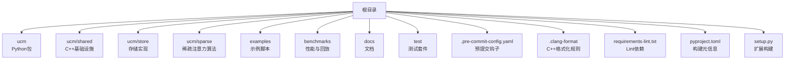
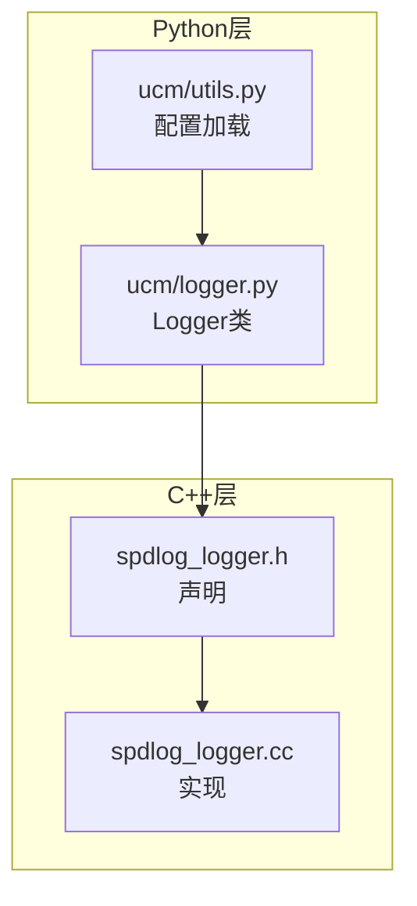
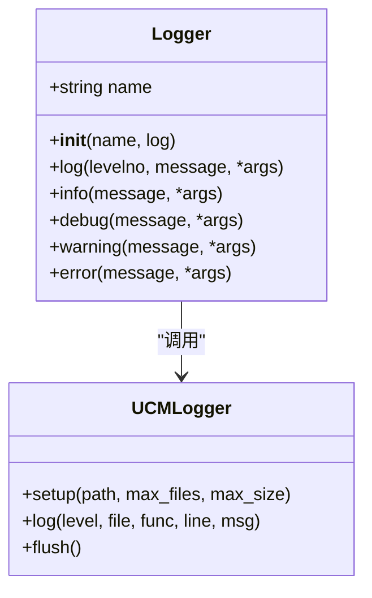
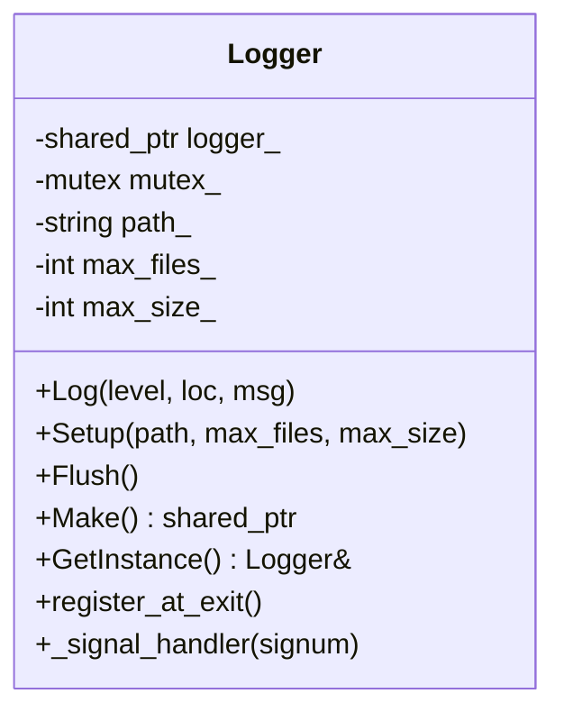
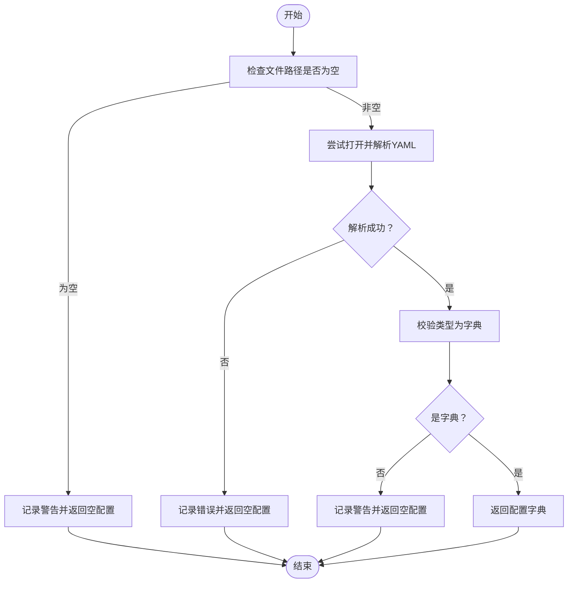
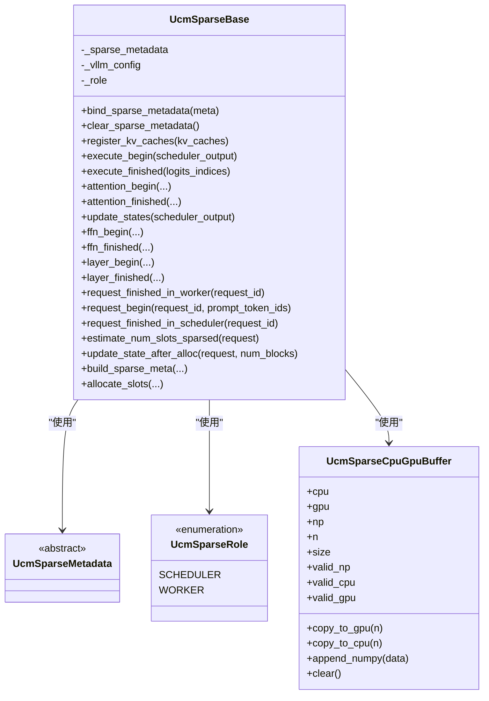
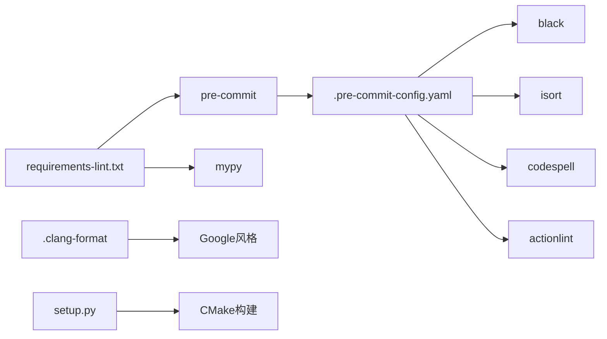

# 代码规范与最佳实践

<cite>
**本文引用的文件**
- [.pre-commit-config.yaml](file://.pre-commit-config.yaml)
- [.clang-format](file://.clang-format)
- [pyproject.toml](file://pyproject.toml)
- [requirements-lint.txt](file://requirements-lint.txt)
- [setup.py](file://setup.py)
- [ucm/logger.py](file://ucm/logger.py)
- [ucm/utils.py](file://ucm/utils.py)
- [ucm/shared/infra/logger/cc/spdlog_logger.cc](file://ucm/shared/infra/logger/cc/spdlog_logger.cc)
- [ucm/shared/infra/logger/cc/spdlog_logger.h](file://ucm/shared/infra/logger/cc/spdlog_logger.h)
- [ucm/sparse/base.py](file://ucm/sparse/base.py)
</cite>

## 目录
1. [引言](#引言)
2. [项目结构](#项目结构)
3. [核心组件](#核心组件)
4. [架构总览](#架构总览)
5. [详细组件分析](#详细组件分析)
6. [依赖关系分析](#依赖关系分析)
7. [性能考虑](#性能考虑)
8. [故障排查指南](#故障排查指南)
9. [结论](#结论)
10. [附录](#附录)

## 引言
本指南面向UCM（统一缓存管理）项目，提供系统化的代码规范与最佳实践，覆盖Python与C++两大语言栈，涵盖命名约定、格式化、静态检查、预提交钩子、错误处理与日志、性能与内存管理等方面。目标是提升代码一致性、可读性、可维护性与运行时稳定性。

## 项目结构
- Python侧：以包形式组织，核心模块位于ucm目录；示例与基准测试分别在examples与benchmarks；文档在docs；测试在test。
- C/C++侧：主要位于ucm/shared与ucm/store等子目录，采用CMake构建；部分CUDA核函数位于cu文件中。
- 预提交与格式化：通过.pre-commit-config.yaml与.clang-format进行统一约束；requirements-lint.txt定义了lint相关依赖；pyproject.toml描述构建元信息。

**图示来源**
- [setup.py](file://setup.py#L140-L153)
- [.pre-commit-config.yaml](file://.pre-commit-config.yaml#L1-L29)
- [.clang-format](file://.clang-format#L1-L36)
- [pyproject.toml](file://pyproject.toml#L1-L22)

**章节来源**
- [setup.py](file://setup.py#L140-L153)
- [.pre-commit-config.yaml](file://.pre-commit-config.yaml#L1-L29)
- [.clang-format](file://.clang-format#L1-L36)
- [pyproject.toml](file://pyproject.toml#L1-L22)

## 核心组件
- Python日志封装：提供统一Logger类，桥接底层C++日志设施，支持级别映射、调用者信息注入与默认配置。
- C++日志实现：基于spdlog的异步日志器，支持控制台与旋转文件双输出、环境变量动态级别、信号触发刷新。
- 配置加载：从YAML或终端参数加载UCM配置，提供默认值与错误日志。
- 稀疏注意力基类：定义调度端与工作端的生命周期钩子接口，便于扩展不同稀疏策略。

**章节来源**
- [ucm/logger.py](file://ucm/logger.py#L40-L75)
- [ucm/shared/infra/logger/cc/spdlog_logger.cc](file://ucm/shared/infra/logger/cc/spdlog_logger.cc#L47-L85)
- [ucm/shared/infra/logger/cc/spdlog_logger.h](file://ucm/shared/infra/logger/cc/spdlog_logger.h#L38-L74)
- [ucm/utils.py](file://ucm/utils.py#L40-L90)
- [ucm/sparse/base.py](file://ucm/sparse/base.py#L127-L323)

## 架构总览
下图展示Python层日志封装与C++日志实现之间的交互关系，以及配置加载流程。

**图示来源**
- [ucm/logger.py](file://ucm/logger.py#L40-L75)
- [ucm/shared/infra/logger/cc/spdlog_logger.h](file://ucm/shared/infra/logger/cc/spdlog_logger.h#L38-L74)
- [ucm/shared/infra/logger/cc/spdlog_logger.cc](file://ucm/shared/infra/logger/cc/spdlog_logger.cc#L47-L85)
- [ucm/utils.py](file://ucm/utils.py#L40-L90)

## 详细组件分析

### Python日志封装（Logger）
- 设计要点
  - 将Python logging级别映射到C++枚举级别。
  - 使用inspect获取调用者文件、行号与函数名，增强定位能力。
  - 初始化时设置日志目录、文件数与大小，并注册退出时刷新。
- 建议
  - 在业务模块中统一通过init_logger获取实例，避免重复初始化。
  - 对于高频日志，建议在调用前做级别判断，减少格式化开销。

**图示来源**
- [ucm/logger.py](file://ucm/logger.py#L40-L75)
- [ucm/shared/infra/logger/cc/spdlog_logger.cc](file://ucm/shared/infra/logger/cc/spdlog_logger.cc#L40-L91)
- [ucm/shared/infra/logger/cc/spdlog_logger.h](file://ucm/shared/infra/logger/cc/spdlog_logger.h#L38-L74)

**章节来源**
- [ucm/logger.py](file://ucm/logger.py#L40-L75)

### C++日志实现（spdlog_logger）
- 设计要点
  - 单例模式延迟创建日志器，支持并发安全。
  - 控制台与旋转文件双sink，支持按PID分目录输出。
  - 支持环境变量动态调整日志级别，异常兜底至默认logger。
  - 注册信号处理器，在异常信号时刷新日志。
- 建议
  - 生产环境可通过环境变量临时提高日志级别用于诊断。
  - 注意日志路径权限与磁盘配额，避免因IO失败影响主流程。

**图示来源**
- [ucm/shared/infra/logger/cc/spdlog_logger.h](file://ucm/shared/infra/logger/cc/spdlog_logger.h#L38-L74)
- [ucm/shared/infra/logger/cc/spdlog_logger.cc](file://ucm/shared/infra/logger/cc/spdlog_logger.cc#L47-L91)

**章节来源**
- [ucm/shared/infra/logger/cc/spdlog_logger.cc](file://ucm/shared/infra/logger/cc/spdlog_logger.cc#L47-L91)
- [ucm/shared/infra/logger/cc/spdlog_logger.h](file://ucm/shared/infra/logger/cc/spdlog_logger.h#L38-L74)

### 配置加载（Config）
- 设计要点
  - 支持从YAML文件、终端参数或默认值加载配置。
  - 对文件不存在、解析失败等情况进行日志提示并返回空配置。
- 建议
  - 在应用启动阶段尽早加载配置，确保后续组件可用。
  - 对关键配置项增加类型校验与范围检查。

**图示来源**
- [ucm/utils.py](file://ucm/utils.py#L40-L90)

**章节来源**
- [ucm/utils.py](file://ucm/utils.py#L40-L90)

### 稀疏注意力基类（UcmSparseBase）
- 设计要点
  - 定义调度端与工作端的生命周期钩子，便于在推理关键路径插入稀疏逻辑。
  - 提供CPU/GPU缓冲区辅助类，简化张量搬运。
- 建议
  - 新增稀疏算法时，优先复用现有钩子，保持与vLLM执行流一致。
  - 注意非阻塞拷贝后的同步需求，避免数据竞争。

**图示来源**
- [ucm/sparse/base.py](file://ucm/sparse/base.py#L39-L323)

**章节来源**
- [ucm/sparse/base.py](file://ucm/sparse/base.py#L127-L323)

## 依赖关系分析
- 构建与平台选择
  - setup.py根据环境变量选择运行时后端（cuda/ascend/musa/maca/simu），并可选开启稀疏功能。
  - CMake扩展负责编译C++/CUDA源码并安装组件。
- Lint与格式化
  - requirements-lint.txt声明pre-commit与mypy版本。
  - .pre-commit-config.yaml集成codespell、black、isort、actionlint等工具。
  - .clang-format采用Google风格，统一缩进、对齐与断行策略。

**图示来源**
- [requirements-lint.txt](file://requirements-lint.txt#L1-L9)
- [.pre-commit-config.yaml](file://.pre-commit-config.yaml#L1-L29)
- [.clang-format](file://.clang-format#L1-L36)
- [setup.py](file://setup.py#L89-L137)

**章节来源**
- [requirements-lint.txt](file://requirements-lint.txt#L1-L9)
- [.pre-commit-config.yaml](file://.pre-commit-config.yaml#L1-L29)
- [.clang-format](file://.clang-format#L1-L36)
- [setup.py](file://setup.py#L89-L137)

## 性能考虑
- 日志性能
  - C++侧使用异步日志器与双sink，降低阻塞；注意磁盘IO与文件轮转开销。
  - Python侧建议在高频路径前做级别判断，减少格式化与字符串拼接。
- 内存管理
  - 稀疏注意力缓冲区应显式清理，避免长期持有大张量。
  - 非阻塞拷贝后及时同步，避免后续计算等待。
- 平台选择
  - 根据硬件后端选择对应构建参数，避免模拟层带来的性能损耗。
- I/O与配置
  - 配置文件解析失败时快速降级为默认配置，保证启动可用性。

[本节为通用指导，无需具体文件分析]

## 故障排查指南
- 日志问题
  - 若日志未输出或级别不生效，检查环境变量与日志路径权限。
  - 发生异常信号时，确认信号处理器已触发刷新。
- 配置问题
  - 配置文件缺失或格式错误会记录告警并返回空配置，需检查路径与内容。
- 构建问题
  - 未设置PLATFORM会导致构建警告，按提示设置后再安装。

**章节来源**
- [ucm/shared/infra/logger/cc/spdlog_logger.cc](file://ucm/shared/infra/logger/cc/spdlog_logger.cc#L56-L76)
- [ucm/utils.py](file://ucm/utils.py#L40-L90)
- [setup.py](file://setup.py#L41-L66)

## 结论
通过统一的预提交与格式化策略、清晰的日志与配置加载机制、以及面向平台的构建体系，UCM项目在多语言混合开发场景下实现了良好的工程化实践。建议团队持续遵循本文规范，并在代码审查中重点检查命名一致性、错误处理完整性与性能敏感路径的健壮性。

[本节为总结，无需具体文件分析]

## 附录

### Python代码规范与最佳实践
- PEP 8与格式化
  - 使用black进行自动格式化，统一缩进、空行与行宽。
  - 使用isort按black配置排序导入，避免手动维护。
- 命名约定
  - 模块与包：小写短横线分隔（如ucm.store）。
  - 类：PascalCase；常量：UPPER_CASE；私有成员：_leading_underscore。
  - 函数与变量：snake_case；类型别名：TypeAlias。
- 错误处理与日志
  - 使用标准logging模块，结合Python日志封装统一输出。
  - 对外部资源（文件、网络）操作捕获具体异常并记录上下文。
- 代码审查检查清单
  - 是否遵循命名约定与导入排序？
  - 是否存在硬编码路径与魔法数字？
  - 是否对异常与边界条件进行了处理？
  - 是否在高频路径避免不必要的对象分配？

**章节来源**
- [.pre-commit-config.yaml](file://.pre-commit-config.yaml#L11-L21)
- [ucm/logger.py](file://ucm/logger.py#L40-L75)

### C++代码规范与最佳实践
- Google C++ Style Guide
  - 风格：基于Google风格，使用.clang-format统一。
  - 头文件：前置声明优先，避免不必要的头文件包含；按组排序include。
  - 命名空间：使用UC::Logger等限定作用域，避免污染全局。
  - 内存管理：优先使用智能指针；浅拷贝与深拷贝语义清晰；析构释放资源。
- 预提交与格式化
  - clang-format用于C/C++/CUDA文件，确保团队一致的排版。
- 代码审查检查清单
  - 是否符合Google风格与头文件组织？
  - 是否正确使用命名空间与限定符？
  - 是否存在悬空指针、越界访问与竞态条件？
  - 是否对异常路径与资源回收进行了充分测试？

**章节来源**
- [.clang-format](file://.clang-format#L1-L36)
- [ucm/shared/infra/logger/cc/spdlog_logger.h](file://ucm/shared/infra/logger/cc/spdlog_logger.h#L38-L74)
- [ucm/shared/infra/logger/cc/spdlog_logger.cc](file://ucm/shared/infra/logger/cc/spdlog_logger.cc#L47-L91)

### 预提交钩子配置与使用
- 工具与版本
  - pre-commit、black、isort、codespell、actionlint。
- 排除规则
  - 跳过JSONL/文本文件与特定目录；忽略拼写词典中的领域专用词汇。
- 使用方式
  - 在本地安装pre-commit并运行安装命令；在提交时自动执行各钩子。
  - 可在需要时使用手动阶段执行（manual）。

**章节来源**
- [.pre-commit-config.yaml](file://.pre-commit-config.yaml#L1-L29)
- [requirements-lint.txt](file://requirements-lint.txt#L1-L9)

### 代码审查检查清单（综合）
- 规范性
  - Python：PEP 8、导入排序、类型注解完善度。
  - C++：Google风格、头文件组织、命名空间使用。
- 可靠性
  - 错误处理：异常捕获、资源释放、边界检查。
  - 日志：级别恰当、上下文完整、性能友好。
- 可维护性
  - 命名清晰、模块职责单一、接口稳定。
- 性能
  - 避免热点路径上的昂贵操作；合理使用缓存与池化。
  - 对I/O与GPU拷贝进行批量化与异步化。

[本节为通用指导，无需具体文件分析]