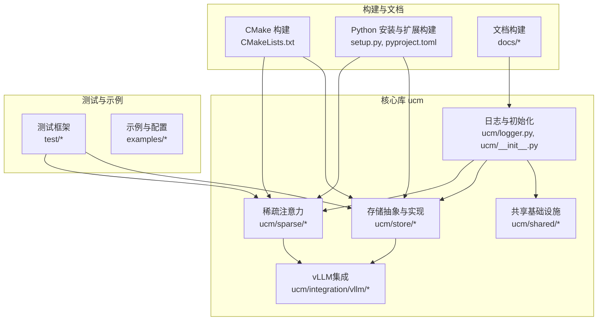
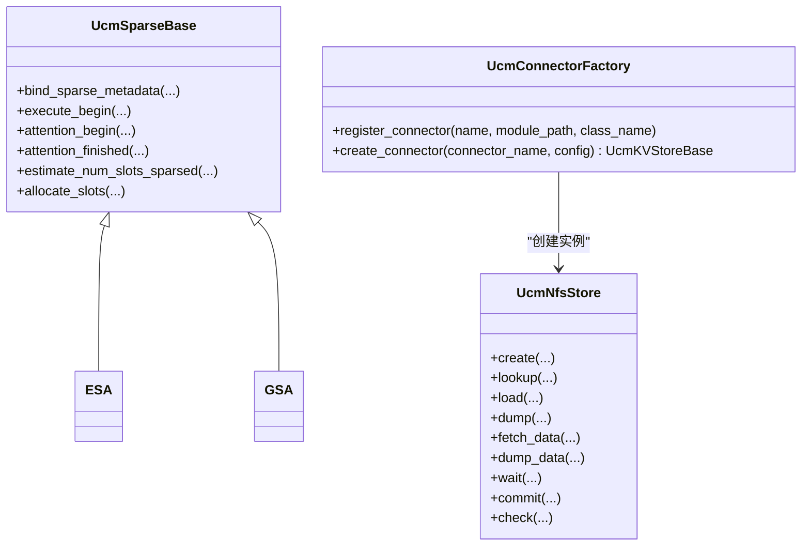
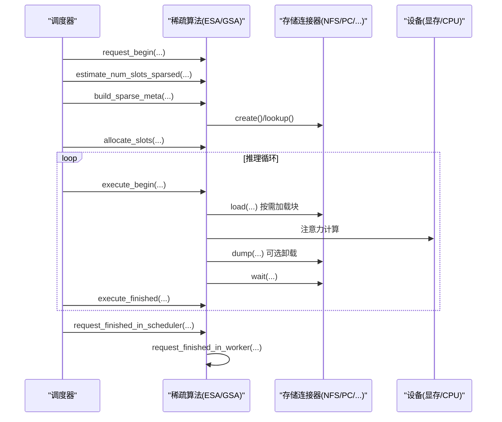
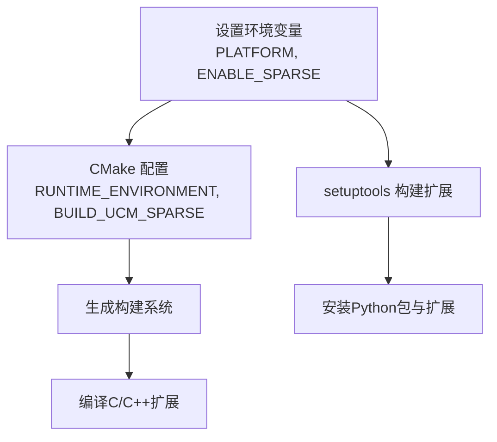

# 开发指南

<cite>
**本文引用的文件**
- [README.md](file://README.md)
- [setup.py](file://setup.py)
- [CMakeLists.txt](file://CMakeLists.txt)
- [pyproject.toml](file://pyproject.toml)
- [requirements-lint.txt](file://requirements-lint.txt)
- [format.sh](file://format.sh)
- [ucm/__init__.py](file://ucm/__init__.py)
- [ucm/logger.py](file://ucm/logger.py)
- [ucm/sparse/base.py](file://ucm/sparse/base.py)
- [ucm/store/factory.py](file://ucm/store/factory.py)
- [ucm/store/nfsstore/nfsstore_connector.py](file://ucm/store/nfsstore/nfsstore_connector.py)
- [ucm/sparse/esa/esa.py](file://ucm/sparse/esa/esa.py)
- [ucm/sparse/gsa/gsa.py](file://ucm/sparse/gsa/gsa.py)
- [docs/source/developer-guide/contribute.md](file://docs/source/developer-guide/contribute.md)
- [test/README.md](file://test/README.md)
</cite>

## 目录
1. [简介](#简介)
2. [项目结构](#项目结构)
3. [核心组件](#核心组件)
4. [架构总览](#架构总览)
5. [详细组件分析](#详细组件分析)
6. [依赖关系分析](#依赖关系分析)
7. [性能与调试](#性能与调试)
8. [扩展与自定义](#扩展与自定义)
9. [测试指南](#测试指南)
10. [贡献流程与代码审查](#贡献流程与代码审查)
11. [构建与发布](#构建与发布)
12. [结语](#结语)

## 简介
本指南面向UCM（Unified Cache Manager）的开发者，目标是帮助你快速搭建开发环境、理解代码结构与架构设计、掌握编码规范与最佳实践，并能高效地扩展存储后端、添加新的稀疏注意力算法、进行调试与性能分析、编写单元与集成测试、以及完成贡献流程与构建发布。

UCM的核心目标是持久化LLM的KV Cache并通过多种检索机制替换冗余计算，支持前缀缓存与多种训练-free的稀疏注意力方法，在长序列推理中显著降低延迟与显存占用。项目采用Python与C++混合实现，通过CMake与setuptools构建，结合pytest进行自动化测试。

## 项目结构
仓库采用模块化组织，主要目录与职责如下：
- ucm：核心库，包含稀疏注意力算法、存储抽象与连接器、共享基础设施（日志、度量、传输）、vLLM集成等
- ucm/sparse：各类稀疏注意力算法实现（ESA、GSA、GSADevice、KVStar、Blend、RerOPE等）
- ucm/store：存储后端抽象与具体实现（NFS、PCStore、DS3FS、Posix、Fake、Empty、Pipeline等），以及设备侧设备抽象
- ucm/shared：跨语言的日志、度量、线程池、模板工具等基础设施
- ucm/integration/vllm：与vLLM的集成桥接与补丁应用
- test：基于pytest的测试框架与用例
- examples：使用示例与配置样例
- benchmarks：性能基准与回放脚本
- docker：多平台容器化构建与运行
- docs：文档源码与构建脚本

图表来源
- [CMakeLists.txt](file://CMakeLists.txt#L1-L40)
- [setup.py](file://setup.py#L140-L153)
- [ucm/logger.py](file://ucm/logger.py#L72-L75)
- [ucm/__init__.py](file://ucm/__init__.py#L29-L48)

章节来源
- [README.md](file://README.md#L14-L54)
- [CMakeLists.txt](file://CMakeLists.txt#L1-L40)
- [setup.py](file://setup.py#L140-L153)

## 核心组件
- 日志与初始化：统一日志初始化与配置，确保跨模块一致的日志输出
- 存储工厂：通过注册表动态创建不同存储后端连接器，屏蔽具体实现差异
- 稀疏基类：定义稀疏注意力在调度器与工作进程两侧的钩子接口，统一调度与执行期行为
- vLLM集成：通过补丁与连接器将UCM能力无缝接入vLLM的调度与注意力路径

章节来源
- [ucm/logger.py](file://ucm/logger.py#L72-L75)
- [ucm/store/factory.py](file://ucm/store/factory.py#L34-L57)
- [ucm/sparse/base.py](file://ucm/sparse/base.py#L127-L323)
- [ucm/__init__.py](file://ucm/__init__.py#L29-L48)

## 架构总览
UCM采用“存储抽象 + 稀疏算法插件”的架构，通过统一的KVStore接口对接外部存储；稀疏算法以UcmSparseBase为基类，按需在调度器与工作进程两侧注入钩子，实现块级KV的按需加载与卸载。

图表来源
- [ucm/sparse/base.py](file://ucm/sparse/base.py#L127-L323)
- [ucm/store/factory.py](file://ucm/store/factory.py#L34-L57)
- [ucm/store/nfsstore/nfsstore_connector.py](file://ucm/store/nfsstore/nfsstore_connector.py#L39-L132)

## 详细组件分析

### 日志与初始化
- 初始化逻辑从环境变量读取日志路径与轮转参数，调用底层日志设施进行初始化
- 提供统一Logger封装，将Python日志映射到底层C++日志实现

章节来源
- [ucm/__init__.py](file://ucm/__init__.py#L29-L48)
- [ucm/logger.py](file://ucm/logger.py#L40-L75)

### 存储工厂与NFS连接器
- 工厂模式注册不同存储后端，延迟导入类，便于按需启用
- NFS连接器实现KV块的分配、查找、加载、卸载、等待与提交等操作，支持设备侧传输参数配置

章节来源
- [ucm/store/factory.py](file://ucm/store/factory.py#L34-L57)
- [ucm/store/nfsstore/nfsstore_connector.py](file://ucm/store/nfsstore/nfsstore_connector.py#L39-L132)

### 稀疏注意力基类与实现
- 基类定义了调度器侧与工作进程侧的钩子，如请求开始/结束、执行模型前后、注意力前后、FFN前后等
- ESA与GSA分别实现了不同的稀疏策略：ESA基于检索与增量加载，GSA基于Top-K与预取策略

图表来源
- [ucm/sparse/base.py](file://ucm/sparse/base.py#L185-L323)
- [ucm/store/nfsstore/nfsstore_connector.py](file://ucm/store/nfsstore/nfsstore_connector.py#L75-L122)
- [ucm/sparse/esa/esa.py](file://ucm/sparse/esa/esa.py#L421-L800)
- [ucm/sparse/gsa/gsa.py](file://ucm/sparse/gsa/gsa.py#L475-L800)

章节来源
- [ucm/sparse/base.py](file://ucm/sparse/base.py#L127-L323)
- [ucm/sparse/esa/esa.py](file://ucm/sparse/esa/esa.py#L421-L800)
- [ucm/sparse/gsa/gsa.py](file://ucm/sparse/gsa/gsa.py#L475-L800)

## 依赖关系分析
- 构建系统：CMake负责C/C++扩展与测试构建；setuptools与pyproject.toml管理Python包与扩展安装
- 平台选择：通过环境变量控制运行时环境（CUDA/Ascend/MUSA/MACA/SIMU），并可选择是否构建稀疏模块
- 文档与格式：requirements-lint.txt与format.sh提供统一的代码风格与检查工具链

图表来源
- [setup.py](file://setup.py#L109-L124)
- [CMakeLists.txt](file://CMakeLists.txt#L9-L14)

章节来源
- [setup.py](file://setup.py#L109-L124)
- [CMakeLists.txt](file://CMakeLists.txt#L9-L14)
- [pyproject.toml](file://pyproject.toml#L1-L22)
- [requirements-lint.txt](file://requirements-lint.txt#L1-L9)
- [format.sh](file://format.sh#L1-L26)

## 性能与调试
- 性能分析建议
  - 使用vLLM自带的性能分析工具与指标采集
  - 结合UCM内部度量模块（metrics）记录关键阶段耗时
  - 对稀疏算法关注检索延迟、数据传输带宽与块粒度对吞吐的影响
- 调试技巧
  - 启用更详细的日志级别，定位块加载/卸载异常
  - 在NFS/PCStore等后端开启传输参数校验，确认块ID与偏移正确
  - 在ESA/GSA中打印关键索引与Top-K结果，验证稀疏范围与窗口策略

[本节为通用指导，不直接分析具体文件]

## 扩展与自定义

### 扩展存储后端
- 新增后端步骤
  1) 实现UcmKVStoreBase接口（创建、查找、加载、卸载、等待、提交、检查）
  2) 在工厂中注册新连接器名称与模块路径
  3) 在配置中指定新连接器类型与参数
- 示例参考：NFS连接器的接口实现与参数解析

章节来源
- [ucm/store/factory.py](file://ucm/store/factory.py#L34-L57)
- [ucm/store/nfsstore/nfsstore_connector.py](file://ucm/store/nfsstore/nfsstore_connector.py#L39-L132)

### 添加新的稀疏算法
- 继承UcmSparseBase，实现调度器侧与工作进程侧钩子
- 在build_sparse_meta中构造元数据，用于工作进程侧按步加载
- 在attention_begin/finished中按需发起加载/卸载任务，并等待完成
- 在estimate_num_slots_sparsed中估算所需块数，配合KVCache管理器分配

章节来源
- [ucm/sparse/base.py](file://ucm/sparse/base.py#L127-L323)
- [ucm/sparse/esa/esa.py](file://ucm/sparse/esa/esa.py#L421-L800)
- [ucm/sparse/gsa/gsa.py](file://ucm/sparse/gsa/gsa.py#L475-L800)

### 自定义功能与钩子
- 可在execute_begin/finished、layer_begin/finished、ffn_begin/finished中插入自定义逻辑
- 注意与vLLM版本兼容性，遵循其调度与注意力接口约定

章节来源
- [ucm/sparse/base.py](file://ucm/sparse/base.py#L185-L282)

## 测试指南
- 测试框架
  - 基于pytest，支持多维标记（stage、feature、platform），自动报告与数据库持久化
  - 支持参数化测试场景，便于覆盖不同输入长度、并发度与平台
- 运行方式
  - 安装依赖后在test目录下执行pytest命令，或按标记筛选运行
- 最佳实践
  - 将公共工具放入common目录，测试用例集中在suites下
  - 使用fixture复用资源，使用装饰器导出测试结果

章节来源
- [test/README.md](file://test/README.md#L1-L236)

## 贡献流程与代码审查
- 提交变更流程
  - Fork仓库 → 创建分支 → 编写代码与文档 → 本地运行lint与格式化 → 提交PR
- 代码风格
  - Python遵循PEP 8；C++遵循Google C++ Style Guide
  - 使用pre-commit与format.sh统一格式化与静态检查
- 代码审查
  - PR需获得至少一位代码所有者批准，CI检查通过后方可合并
  - 文档更新需同步构建与预览

章节来源
- [docs/source/developer-guide/contribute.md](file://docs/source/developer-guide/contribute.md#L38-L145)
- [requirements-lint.txt](file://requirements-lint.txt#L1-L9)
- [format.sh](file://format.sh#L1-L26)

## 构建与发布
- Python安装与扩展构建
  - 设置PLATFORM（cuda/ascend/musa/maca/simu），可选ENABLE_SPARSE=true
  - 使用setuptools与CMake扩展构建，安装到Python环境中
- 文档构建
  - 在docs目录安装依赖后执行构建命令，生成HTML文档
- 发布流程
  - 版本号在setup与pyproject中维护，遵循语义化版本
  - CI可结合构建产物进行打包与发布

章节来源
- [setup.py](file://setup.py#L109-L137)
- [pyproject.toml](file://pyproject.toml#L1-L22)
- [docs/source/developer-guide/contribute.md](file://docs/source/developer-guide/contribute.md#L129-L141)

## 结语
本指南提供了从环境搭建到扩展开发、测试与发布的完整路径。建议在首次贡献前先完成本地开发环境与格式化工具的准备，再逐步深入到稀疏算法与存储后端的扩展实践。遇到问题时，优先查看日志与测试输出，并结合文档与现有实现进行对照分析。