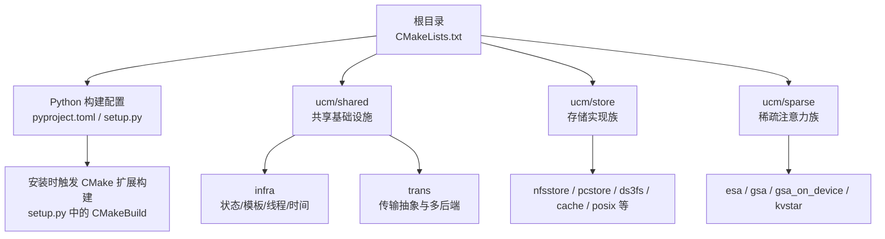
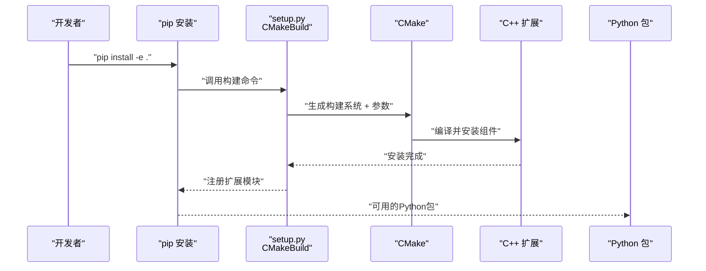
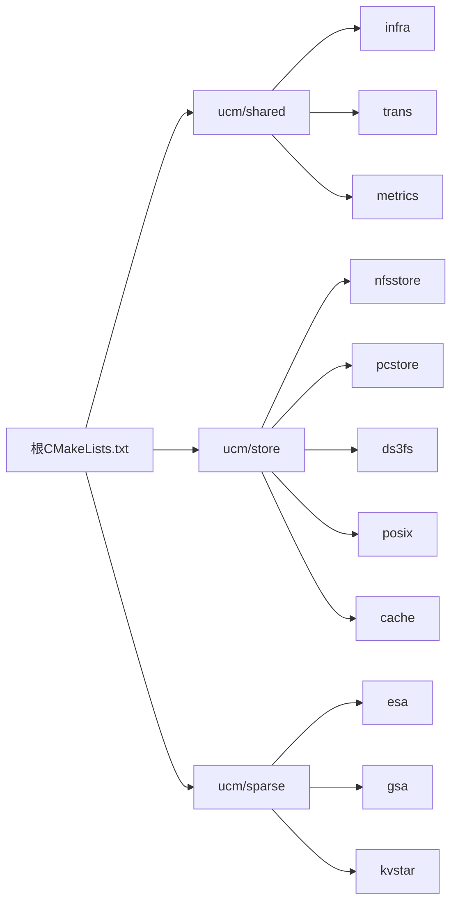

# 开发环境搭建

<cite>
**本文引用的文件**
- [README.md](file://README.md)
- [setup.py](file://setup.py)
- [pyproject.toml](file://pyproject.toml)
- [.pre-commit-config.yaml](file://.pre-commit-config.yaml)
- [requirements-lint.txt](file://requirements-lint.txt)
- [format.sh](file://format.sh)
- [CMakeLists.txt](file://CMakeLists.txt)
- [docker/Dockerfile](file://docker/Dockerfile)
- [test/requirements.txt](file://test/requirements.txt)
- [ucm/shared/CMakeLists.txt](file://ucm/shared/CMakeLists.txt)
- [ucm/sparse/CMakeLists.txt](file://ucm/sparse/CMakeLists.txt)
- [ucm/store/CMakeLists.txt](file://ucm/store/CMakeLists.txt)
- [ucm/shared/trans/CMakeLists.txt](file://ucm/shared/trans/CMakeLists.txt)
- [ucm/shared/infra/CMakeLists.txt](file://ucm/shared/infra/CMakeLists.txt)
- [ucm/sparse/esa/CMakeLists.txt](file://ucm/sparse/esa/CMakeLists.txt)
- [ucm/store/nfsstore/CMakeLists.txt](file://ucm/store/nfsstore/CMakeLists.txt)
</cite>

## 目录
1. [简介](#简介)
2. [项目结构](#项目结构)
3. [核心组件](#核心组件)
4. [架构总览](#架构总览)
5. [详细组件分析](#详细组件分析)
6. [依赖关系分析](#依赖关系分析)
7. [性能考虑](#性能考虑)
8. [故障排查指南](#故障排查指南)
9. [结论](#结论)
10. [附录](#附录)

## 简介
本指南面向UCM项目的开发者，提供从零搭建开发环境的完整流程，涵盖Python环境配置（虚拟环境、依赖安装与版本要求）、C++编译环境（CMake配置、编译器与第三方库）、Docker开发环境、IDE配置建议（VS Code、CLion）、预提交钩子（pre-commit）配置与使用、常见问题排查以及开发工具链安装与验证步骤。内容基于仓库中的构建脚本、配置文件与示例镜像进行整理，确保可复现与可维护。

## 项目结构
UCM采用“Python包 + CMake扩展”的混合构建方式：Python侧通过setuptools与pyproject.toml声明构建后端与依赖；C++侧通过CMake组织模块化子目录（共享基础设施、存储实现、稀疏算法等），并通过自定义构建命令在安装时执行CMake编译与安装。

图表来源
- [CMakeLists.txt](file://CMakeLists.txt#L1-L40)
- [ucm/shared/CMakeLists.txt](file://ucm/shared/CMakeLists.txt#L1-L6)
- [ucm/store/CMakeLists.txt](file://ucm/store/CMakeLists.txt#L1-L15)
- [ucm/sparse/CMakeLists.txt](file://ucm/sparse/CMakeLists.txt#L1-L5)

章节来源
- [CMakeLists.txt](file://CMakeLists.txt#L1-L40)
- [pyproject.toml](file://pyproject.toml#L1-L22)
- [setup.py](file://setup.py#L140-L153)

## 核心组件
- Python构建系统
  - 构建后端：setuptools + cmake（pyproject.toml）
  - 安装时CMake扩展：setup.py中定义CMakeBuild类，自动传入平台变量与构建选项
- CMake构建系统
  - 最低版本要求：3.18
  - C++标准：C++17
  - 关键选项：BUILD_UCM_STORE、BUILD_UCM_SPARSE、BUILD_UNIT_TESTS、BUILD_NUMA、DOWNLOAD_DEPENDENCE、RUNTIME_ENVIRONMENT
- 预提交与格式检查
  - 配置：.pre-commit-config.yaml
  - 依赖：requirements-lint.txt
  - 快捷脚本：format.sh

章节来源
- [pyproject.toml](file://pyproject.toml#L1-L22)
- [setup.py](file://setup.py#L89-L138)
- [CMakeLists.txt](file://CMakeLists.txt#L1-L40)
- [.pre-commit-config.yaml](file://.pre-commit-config.yaml#L1-L29)
- [requirements-lint.txt](file://requirements-lint.txt#L1-L9)
- [format.sh](file://format.sh#L1-L26)

## 架构总览
下图展示从源码到可运行包的关键路径：开发者在本地或容器中执行pip安装，安装脚本调用CMake构建C++扩展，并根据平台变量选择运行时后端；同时，测试与文档所需的Python依赖通过requirements文件管理。

图表来源
- [setup.py](file://setup.py#L89-L138)
- [CMakeLists.txt](file://CMakeLists.txt#L1-L40)

章节来源
- [setup.py](file://setup.py#L89-L138)
- [CMakeLists.txt](file://CMakeLists.txt#L1-L40)

## 详细组件分析

### Python环境配置
- 版本要求
  - Python >= 3.10（pyproject.toml与setup.py均声明）
- 虚拟环境
  - 建议使用venv或conda创建隔离环境
- 依赖安装
  - 开发与格式校验：pip install -r requirements-lint.txt
  - 测试相关：pip install -r test/requirements.txt
  - 可选：安装文档构建依赖（docs/requirements-docs.txt）
- 安装UCM
  - 在仓库根目录执行pip安装，会触发CMake扩展构建
  - 平台变量：通过环境变量PLATFORM指定（cuda/ascend/musa/maca/simu）
  - 稀疏功能：ENABLE_SPARSE=true启用BUILD_UCM_SPARSE

章节来源
- [pyproject.toml](file://pyproject.toml#L15-L16)
- [setup.py](file://setup.py#L146-L147)
- [requirements-lint.txt](file://requirements-lint.txt#L1-L9)
- [test/requirements.txt](file://test/requirements.txt#L1-L18)

### C++编译环境设置
- 编译器与CMake
  - CMake >= 3.18（pyproject.toml声明）
  - C++标准：C++17（CMakeLists.txt）
- 关键构建选项
  - RUNTIME_ENVIRONMENT：simu/ascend/musa/cuda（CMakeLists.txt）
  - BUILD_UCM_SPARSE：是否构建稀疏模块（默认关闭）
  - BUILD_NUMA：是否下载并构建numactl（sparse/esa中使用）
- 平台后端选择
  - setup.py中根据PLATFORM动态添加CMake参数
  - RUNTIME_ENVIRONMENT与trans/sparse/store子目录的条件编译联动
- 第三方库
  - 通过FetchContent或系统库引入（如numactl）
  - 日志与通用组件由ucm/shared子目录提供

章节来源
- [pyproject.toml](file://pyproject.toml#L2-L6)
- [CMakeLists.txt](file://CMakeLists.txt#L1-L40)
- [setup.py](file://setup.py#L103-L125)
- [ucm/shared/trans/CMakeLists.txt](file://ucm/shared/trans/CMakeLists.txt#L1-L14)
- [ucm/sparse/esa/CMakeLists.txt](file://ucm/sparse/esa/CMakeLists.txt#L1-L51)

### Docker开发环境
- 快速搭建
  - 使用docker/Dockerfile构建镜像，基于官方vLLM镜像
  - 自动设置PIP索引、安装UCM并应用vLLM补丁
- 运行与调试
  - 镜像入口为bash，便于交互式调试
  - 可挂载代码目录以支持热更新与迭代

章节来源
- [docker/Dockerfile](file://docker/Dockerfile#L1-L20)

### IDE配置建议
- VS Code
  - 推荐插件：Python、C/C++、CMake Tools、clang-format、pre-commit
  - 设置：启用clang-format、配置CMake Tools指向构建目录、同步C++标准与编译器
- CLion
  - 导入CMakeLists.txt作为项目
  - 配置C++标准为C++17，选择合适的构建类型（Release/Debug）
  - 为CMake扩展模块配置解释器与Python可执行文件路径

（本节为通用IDE配置建议，不直接分析具体文件）

### 预提交钩子（pre-commit）
- 安装与启用
  - 安装依赖：pip install -r requirements-lint.txt
  - 启用：pre-commit install
- 钩子清单
  - 代码拼写检查、Python格式化（black）、导入排序（isort）、GitHub Actions语法检查
- 手动运行
  - 全量检查：pre-commit run --all-files
  - 仅手动阶段：pre-commit run --all-files --hook-stage manual
- 快捷脚本
  - format.sh封装了命令检查与全量执行逻辑

章节来源
- [.pre-commit-config.yaml](file://.pre-commit-config.yaml#L1-L29)
- [requirements-lint.txt](file://requirements-lint.txt#L1-L9)
- [format.sh](file://format.sh#L1-L26)

### 开发工具链安装与验证
- Python工具链
  - pip、setuptools、wheel、CMake（pyproject.toml声明）
- C++工具链
  - CMake 3.18+、C++17编译器（clang/gcc均可）
- 验证步骤
  - 创建虚拟环境并激活
  - 安装依赖与UCM
  - 设置PLATFORM并执行一次构建
  - 运行format.sh进行格式检查

章节来源
- [pyproject.toml](file://pyproject.toml#L1-L7)
- [setup.py](file://setup.py#L146-L147)
- [format.sh](file://format.sh#L1-L26)

## 依赖关系分析
UCM的依赖分为三层：
- Python层：setuptools构建后端、pyproject.toml声明、setup.py扩展构建
- CMake层：根CMakeLists.txt统一配置，子目录按需开启功能
- 子模块层：shared（infra/trans/metrics/test）、store（nfs/pc/ds3fs/posix/cache等）、sparse（esa/gsa/kvstar等）

图表来源
- [CMakeLists.txt](file://CMakeLists.txt#L36-L39)
- [ucm/shared/CMakeLists.txt](file://ucm/shared/CMakeLists.txt#L1-L6)
- [ucm/store/CMakeLists.txt](file://ucm/store/CMakeLists.txt#L1-L15)
- [ucm/sparse/CMakeLists.txt](file://ucm/sparse/CMakeLists.txt#L1-L5)

章节来源
- [CMakeLists.txt](file://CMakeLists.txt#L36-L39)
- [ucm/shared/CMakeLists.txt](file://ucm/shared/CMakeLists.txt#L1-L6)
- [ucm/store/CMakeLists.txt](file://ucm/store/CMakeLists.txt#L1-L15)
- [ucm/sparse/CMakeLists.txt](file://ucm/sparse/CMakeLists.txt#L1-L5)

## 性能考虑
- 构建优化
  - Release模式默认启用-O3与安全强化标志
  - 可通过CMake参数调整编译器优化等级
- 功能开关
  - BUILD_UCM_SPARSE默认关闭，仅在需要时开启
  - BUILD_NUMA用于稀疏场景下的NUMA优化
- 运行时后端
  - 不同RUNTIME_ENVIRONMENT对应不同硬件后端，影响性能与可用特性

章节来源
- [CMakeLists.txt](file://CMakeLists.txt#L23-L31)
- [ucm/sparse/esa/CMakeLists.txt](file://ucm/sparse/esa/CMakeLists.txt#L1-L51)

## 故障排查指南
- 平台变量未设置
  - 现象：安装时打印警告提示未设置PLATFORM
  - 处理：设置环境变量PLATFORM为cuda/ascend/musa/maca之一
- CMake版本过低
  - 现象：CMake报错或功能不可用
  - 处理：升级至3.18及以上
- 缺少预提交工具
  - 现象：format.sh提示工具未安装
  - 处理：安装requirements-lint.txt中的依赖并执行pre-commit install
- 无法找到第三方库
  - 现象：sparse/esa构建时numactl失败
  - 处理：确保网络可访问或手动提供依赖；必要时关闭BUILD_NUMA
- Docker构建失败
  - 现象：pip安装或vLLM补丁应用失败
  - 处理：检查镜像基础版本与网络代理配置

章节来源
- [setup.py](file://setup.py#L41-L66)
- [pyproject.toml](file://pyproject.toml#L2-L6)
- [format.sh](file://format.sh#L4-L16)
- [ucm/sparse/esa/CMakeLists.txt](file://ucm/sparse/esa/CMakeLists.txt#L5-L48)
- [docker/Dockerfile](file://docker/Dockerfile#L1-L20)

## 结论
通过本指南，开发者可在本地或容器环境中快速搭建UCM开发环境。关键在于正确设置Python与CMake工具链、理解C++模块化结构与平台后端选择、启用并使用pre-commit进行质量保障。遇到问题时，优先检查平台变量、CMake版本与依赖安装情况。

## 附录
- 快速验证清单
  - Python >= 3.10、pip、setuptools、wheel、CMake 3.18+
  - 虚拟环境已创建并激活
  - 安装requirements-lint.txt与test/requirements.txt
  - 设置PLATFORM并执行pip安装
  - 运行format.sh完成格式检查
- 参考文档入口
  - 项目概览与特性说明见根目录README

章节来源
- [README.md](file://README.md#L14-L93)
- [test/requirements.txt](file://test/requirements.txt#L1-L18)