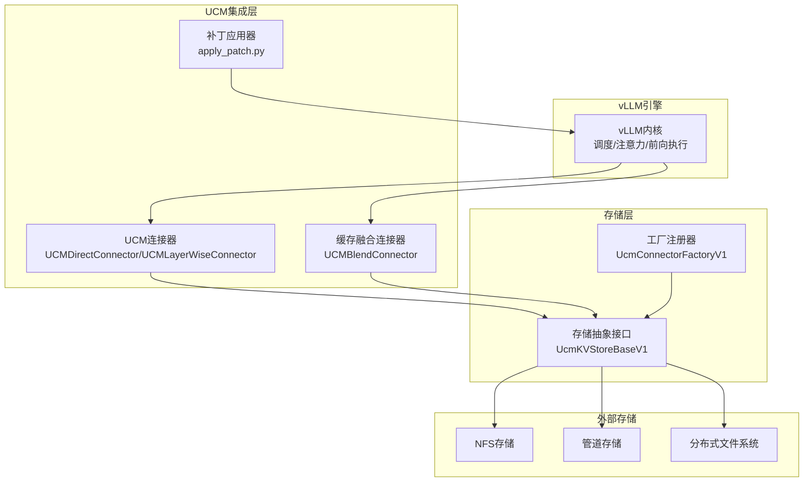
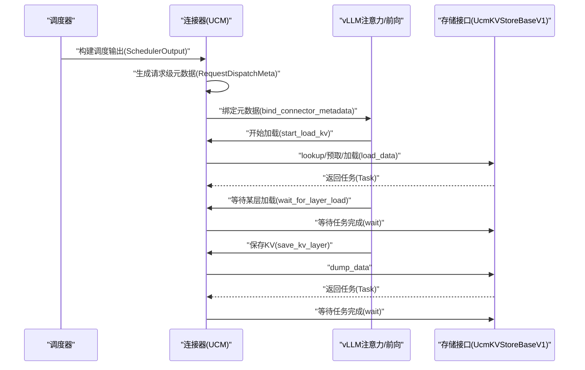
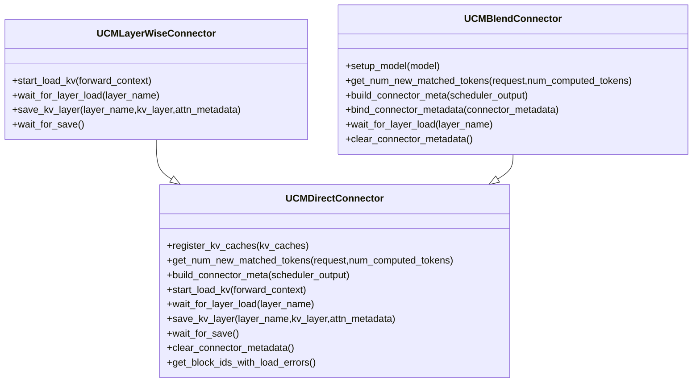
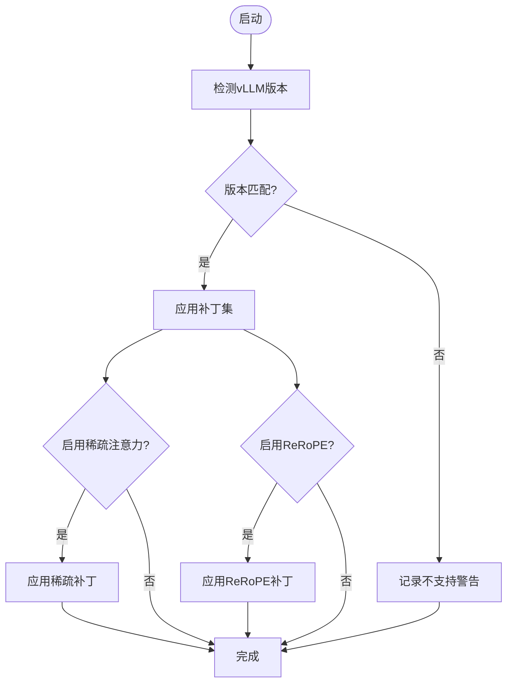
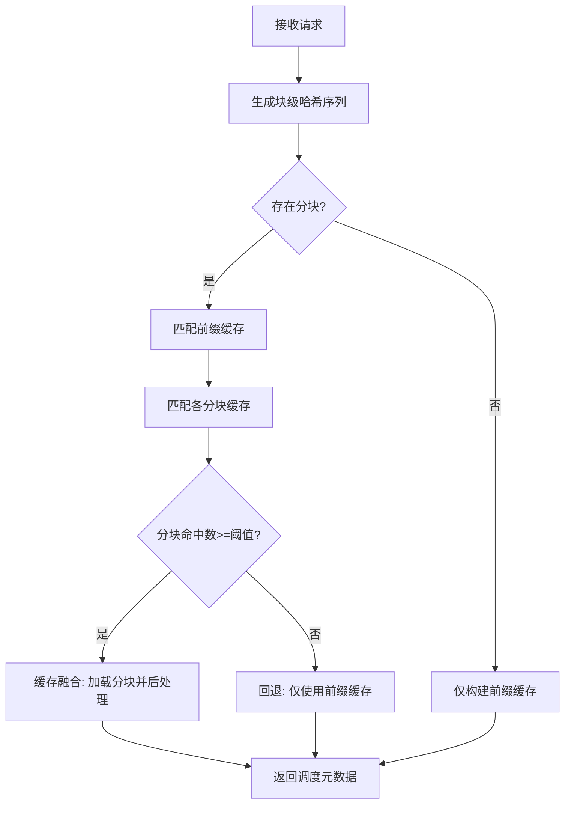
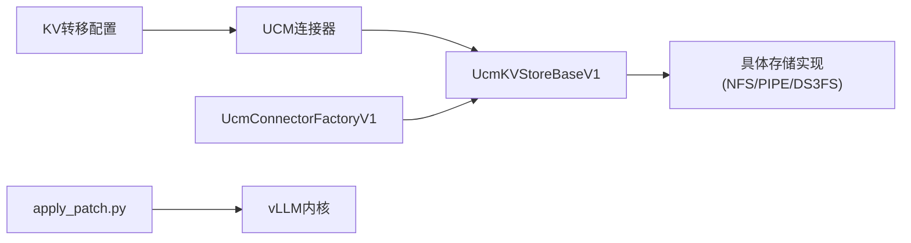

# vLLM集成扩展

<cite>
**本文档引用的文件**
- [ucm_connector.py](file://ucm/integration/vllm/ucm_connector.py)
- [blend_connector.py](file://ucm/integration/vllm/blend_connector.py)
- [apply_patch.py](file://ucm/integration/vllm/patch/apply_patch.py)
- [vllm_patch.py](file://ucm/integration/vllm/patch/patch_funcs/v092/vllm_patch.py)
- [vllm_rerope_patch.py](file://ucm/integration/vllm/patch/patch_funcs/v092/vllm_rerope_patch.py)
- [factory_v1.py](file://ucm/store/factory_v1.py)
- [ucmstore_v1.py](file://ucm/store\ucmstore_v1.py)
- [run_vllm.sh](file://examples/deployments/scripts/vllm/run_vllm.sh)
- [quickstart_vllm.md](file://docs/source/getting-started/quickstart_vllm.md)
- [extending_store.md](file://docs/source/developer-guide/extending_store.md)
- [ucm_config_example.yaml](file://examples/ucm_config_example.yaml)
- [test_offline_inference.py](file://test/suites/E2E/test_offline_inference.py)
</cite>

## 目录
1. [简介](#简介)
2. [项目结构](#项目结构)
3. [核心组件](#核心组件)
4. [架构总览](#架构总览)
5. [详细组件分析](#详细组件分析)
6. [依赖关系分析](#依赖关系分析)
7. [性能考虑](#性能考虑)
8. [故障排除指南](#故障排除指南)
9. [结论](#结论)
10. [附录](#附录)

## 简介
本指南面向希望在vLLM中集成UCM（Unified Cache Management）的开发者，系统讲解如何开发新的vLLM连接器适配器，包括连接器接口实现、生命周期管理、补丁机制工作原理（版本兼容性与补丁应用流程）、缓存融合连接器实现（多存储后端协调机制），以及与vLLM引擎的深度集成（注意力计算、KV缓存管理、推理调度）。文档还提供从基础连接器到高级功能扩展的完整集成示例、集成测试方法与性能优化建议。

## 项目结构
UCM vLLM集成主要由以下模块组成：
- 连接器层：UCM连接器与缓存融合连接器，负责KV缓存的加载、保存与调度元数据构建
- 补丁层：自动检测并应用vLLM版本特定的补丁，以启用UCM与vLLM的深度集成
- 存储层：统一的KV缓存存储抽象接口，支持多种存储后端（NFS、管道等）
- 配置与部署：通过脚本与配置文件启动带UCM的vLLM服务

图表来源
- [ucm_connector.py](file://ucm/integration/vllm/ucm_connector.py#L82-L1080)
- [blend_connector.py](file://ucm/integration/vllm/blend_connector.py#L121-L499)
- [apply_patch.py](file://ucm/integration/vllm/patch/apply_patch.py#L84-L192)
- [ucmstore_v1.py](file://ucm/store/ucmstore_v1.py#L41-L202)
- [factory_v1.py](file://ucm/store/factory_v1.py#L34-L66)

章节来源
- [ucm_connector.py](file://ucm/integration/vllm/ucm_connector.py#L1-L1080)
- [blend_connector.py](file://ucm/integration/vllm/blend_connector.py#L1-L499)
- [apply_patch.py](file://ucm/integration/vllm/patch/apply_patch.py#L1-L192)
- [ucmstore_v1.py](file://ucm/store/ucmstore_v1.py#L1-L202)
- [factory_v1.py](file://ucm/store/factory_v1.py#L1-L66)

## 核心组件
- UCMDirectConnector：直接同步式连接器，实现“加载→前向→保存”的同步流程，支持MLA/DSA/GQA模式与分层加载
- UCMLayerWiseConnector：分层重叠式连接器，在每层之间重叠加载/保存，提升并发度
- UCMBlendConnector：缓存融合连接器，支持分块缓存与前缀缓存的混合策略，结合RAG分块与增量融合
- UcmKVStoreBaseV1：存储抽象接口，定义查找、预取、加载/保存、等待等统一操作
- UcmConnectorFactoryV1：存储连接器工厂，按名称动态注册并创建具体存储实现
- 补丁应用器：自动检测vLLM版本并应用相应补丁，支持稀疏注意力与ReRoPE

章节来源
- [ucm_connector.py](file://ucm/integration/vllm/ucm_connector.py#L82-L1080)
- [blend_connector.py](file://ucm/integration/vllm/blend_connector.py#L121-L499)
- [ucmstore_v1.py](file://ucm/store/ucmstore_v1.py#L41-L202)
- [factory_v1.py](file://ucm/store/factory_v1.py#L34-L66)

## 架构总览
UCM通过连接器与vLLM的KV缓存传输接口对接，利用补丁机制在注意力前向与KV缓存写入点插入UCM逻辑，实现KV缓存的异步加载与保存。连接器根据调度输出构建请求级元数据，驱动存储层执行批量查找、加载与保存任务。

图表来源
- [ucm_connector.py](file://ucm/integration/vllm/ucm_connector.py#L397-L644)
- [ucmstore_v1.py](file://ucm/store/ucmstore_v1.py#L103-L189)

## 详细组件分析

### 连接器接口与生命周期管理
- 初始化阶段：解析vLLM配置、设备选择（CUDA/NPU）、连接器配置、指标日志器初始化
- 注册KV缓存：根据模型类型（MLA/DSA/GQA）与张量布局，计算基地址与块大小，创建主存储与可选的ROPE存储
- 请求匹配：基于请求输入生成哈希块ID序列，执行外部存储查找，统计命中数
- 调度元数据：根据调度输出与命中结果，生成每个请求的加载/保存块ID映射
- 加载/保存：将vLLM页表中的块ID转换为设备指针，异步发起加载/保存任务，等待完成并记录性能指标

图表来源
- [ucm_connector.py](file://ucm/integration/vllm/ucm_connector.py#L82-L1080)
- [blend_connector.py](file://ucm/integration/vllm/blend_connector.py#L121-L499)

章节来源
- [ucm_connector.py](file://ucm/integration/vllm/ucm_connector.py#L82-L1080)
- [blend_connector.py](file://ucm/integration/vllm/blend_connector.py#L121-L499)

### vLLM补丁机制与版本兼容性
- 自动检测：通过环境变量与导入钩子检测vLLM版本，支持0.9.2等版本
- 条件应用：根据是否启用稀疏注意力或ReRoPE，选择对应补丁集
- 补丁范围：覆盖调度输出、注意力层、KV缓存管理、模型运行器等关键模块，注入UCM所需的回调与元数据
- 平台适配：针对Ascend平台提供额外补丁

图表来源
- [apply_patch.py](file://ucm/integration/vllm/patch/apply_patch.py#L84-L192)
- [vllm_patch.py](file://ucm/integration/vllm/patch/patch_funcs/v092/vllm_patch.py#L39-L60)
- [vllm_rerope_patch.py](file://ucm/integration/vllm/patch/patch_funcs/v092/vllm_rerope_patch.py#L36-L49)

章节来源
- [apply_patch.py](file://ucm/integration/vllm/patch/apply_patch.py#L1-L192)
- [vllm_patch.py](file://ucm/integration/vllm/patch/patch_funcs/v092/vllm_patch.py#L1-L800)
- [vllm_rerope_patch.py](file://ucm/integration/vllm/patch/patch_funcs/v092/vllm_rerope_patch.py#L1-L800)

### 缓存融合连接器实现
- 分块缓存：识别以特定结束标记分隔的文本块，构建块级哈希序列
- 前缀缓存：优先匹配前缀块，最大化复用
- 混合策略：当块命中低于阈值时回退到前缀缓存；否则进行缓存融合以降低TTFT
- 后处理：对加载的块级K缓存执行增量RoPE变换，确保位置编码一致性

图表来源
- [blend_connector.py](file://ucm/integration/vllm/blend_connector.py#L148-L404)
- [blend_connector.py](file://ucm/integration/vllm/blend_connector.py#L261-L466)

章节来源
- [blend_connector.py](file://ucm/integration/vllm/blend_connector.py#L1-L499)

### 与vLLM引擎的深度集成
- 注意力计算：在注意力前向前后插入等待/保存回调，确保KV缓存按层正确加载与保存
- KV缓存管理：通过调度输出与连接器元数据，协调块分配与释放
- 推理调度：连接器参与请求调度决策，提供命中统计与性能指标

章节来源
- [vllm_patch.py](file://ucm/integration/vllm/patch/patch_funcs/v092/vllm_patch.py#L140-L400)
- [ucm_connector.py](file://ucm/integration/vllm/ucm_connector.py#L488-L644)

## 依赖关系分析
- 连接器依赖存储抽象接口与工厂注册器，实现多存储后端的统一接入
- 补丁应用器依赖vLLM版本信息与环境变量，动态选择补丁集
- 配置通过KV转移配置传递给vLLM，连接器从配置中读取存储后端与指标路径

图表来源
- [ucm_connector.py](file://ucm/integration/vllm/ucm_connector.py#L187-L221)
- [ucmstore_v1.py](file://ucm/store/ucmstore_v1.py#L41-L202)
- [factory_v1.py](file://ucm/store/factory_v1.py#L34-L66)
- [apply_patch.py](file://ucm/integration/vllm/patch/apply_patch.py#L84-L192)

章节来源
- [ucm_connector.py](file://ucm/integration/vllm/ucm_connector.py#L187-L221)
- [ucmstore_v1.py](file://ucm/store/ucmstore_v1.py#L41-L202)
- [factory_v1.py](file://ucm/store/factory_v1.py#L34-L66)
- [apply_patch.py](file://ucm/integration/vllm/patch/apply_patch.py#L84-L192)

## 性能考虑
- 异步I/O与流水线：连接器在注意力前向之前启动加载任务，在层间重叠保存，减少等待时间
- 分层加载：LayerWise连接器按层重叠，充分利用GPU内存带宽
- 指标监控：启用Prometheus指标收集，跟踪加载/保存速度、命中率等关键指标
- 设备选择：根据平台自动选择CUDA或NPU设备，保证同步原语与设备一致性

章节来源
- [ucm_connector.py](file://ucm/integration/vllm/ucm_connector.py#L488-L644)
- [ucm_connector.py](file://ucm/integration/vllm/ucm_connector.py#L661-L800)

## 故障排除指南
- 补丁应用失败：检查vLLM版本与环境变量，确认补丁集是否匹配
- 连接器初始化错误：检查存储后端路径、设备ID与分片参数
- 加载失败：查看无效块ID集合，定位具体请求与块ID
- 指标未显示：确认指标配置路径与日志路径设置

章节来源
- [apply_patch.py](file://ucm/integration/vllm/patch/apply_patch.py#L84-L192)
- [ucm_connector.py](file://ucm/integration/vllm/ucm_connector.py#L645-L658)

## 结论
UCM vLLM集成通过连接器与补丁机制实现了KV缓存的高效管理与推理加速。开发者可通过统一的存储接口扩展多存储后端，利用连接器的生命周期管理与缓存融合策略，实现从基础到高级的完整功能扩展。配合完善的测试与性能监控，可在生产环境中稳定落地。

## 附录

### 开发新vLLM连接器适配器步骤
- 继承连接器基类，实现请求匹配、调度元数据构建、加载/保存流程
- 在工厂中注册自定义存储连接器，确保按名称可创建实例
- 配置KV转移配置，指定连接器模块路径与角色
- 应用对应版本补丁，确保与vLLM内核的深度集成

章节来源
- [ucm_connector.py](file://ucm/integration/vllm/ucm_connector.py#L82-L1080)
- [factory_v1.py](file://ucm/store/factory_v1.py#L34-L66)
- [run_vllm.sh](file://examples/deployments/scripts/vllm/run_vllm.sh#L99-L107)

### 集成测试方法
- 离线推理测试：通过测试脚本验证HBM+SSD混合命中准确性
- 配置示例：参考示例配置文件，设置存储后端与稀疏注意力参数
- 日志与指标：通过日志与Prometheus指标验证连接器行为

章节来源
- [test_offline_inference.py](file://test/suites/E2E/test_offline_inference.py#L1-L200)
- [ucm_config_example.yaml](file://examples/ucm_config_example.yaml#L1-L39)
- [quickstart_vllm.md](file://docs/source/getting-started/quickstart_vllm.md#L154-L237)