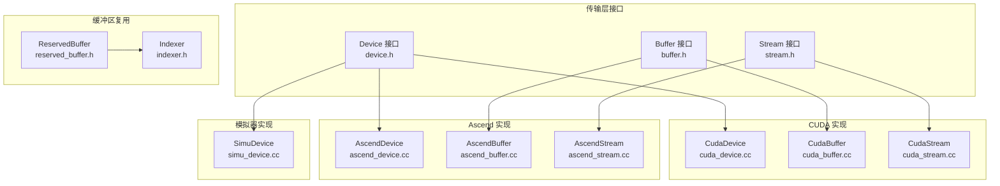
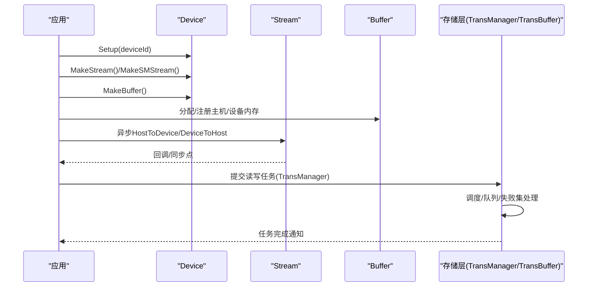
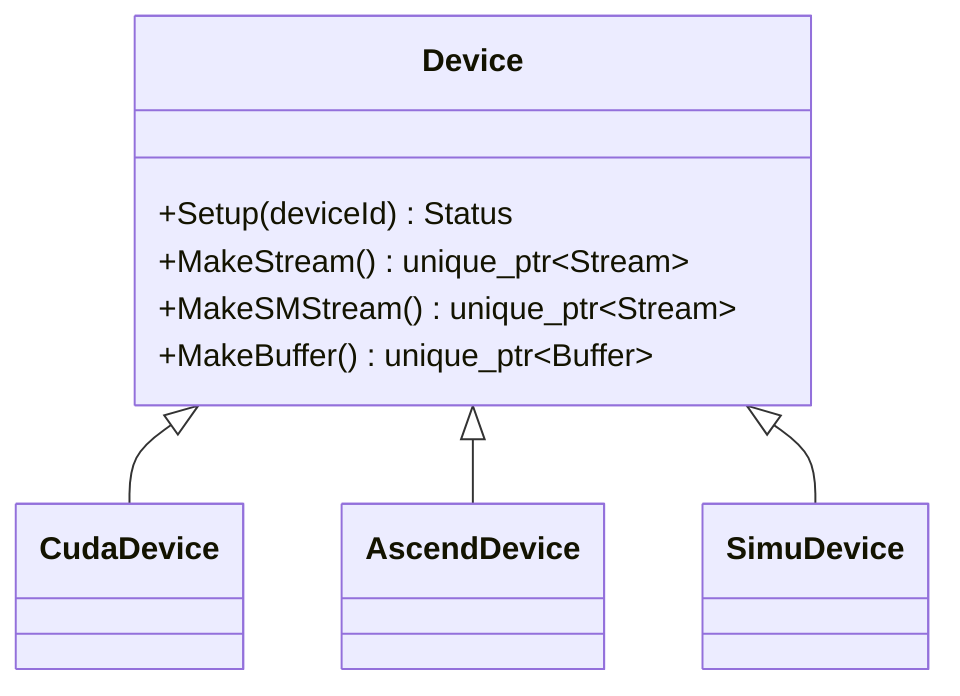
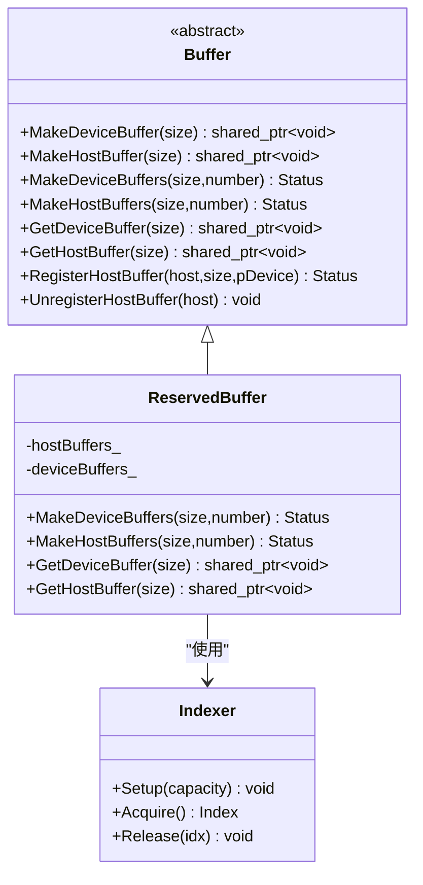
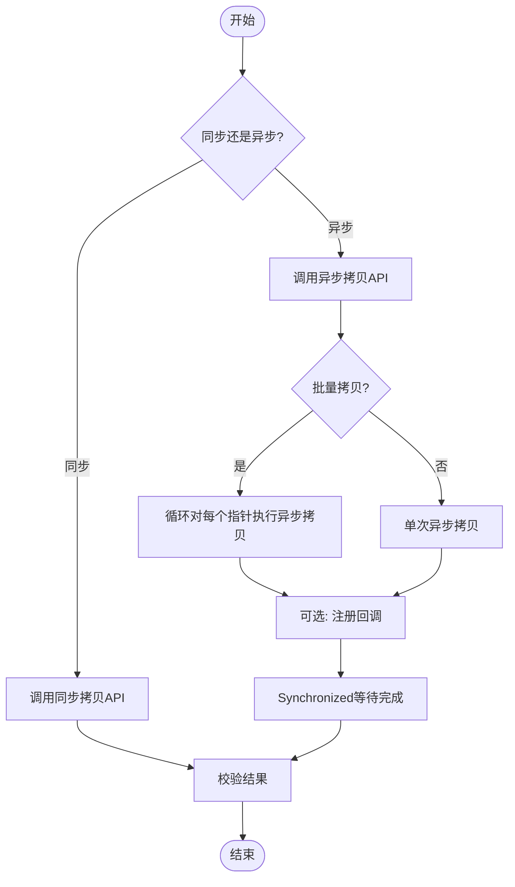
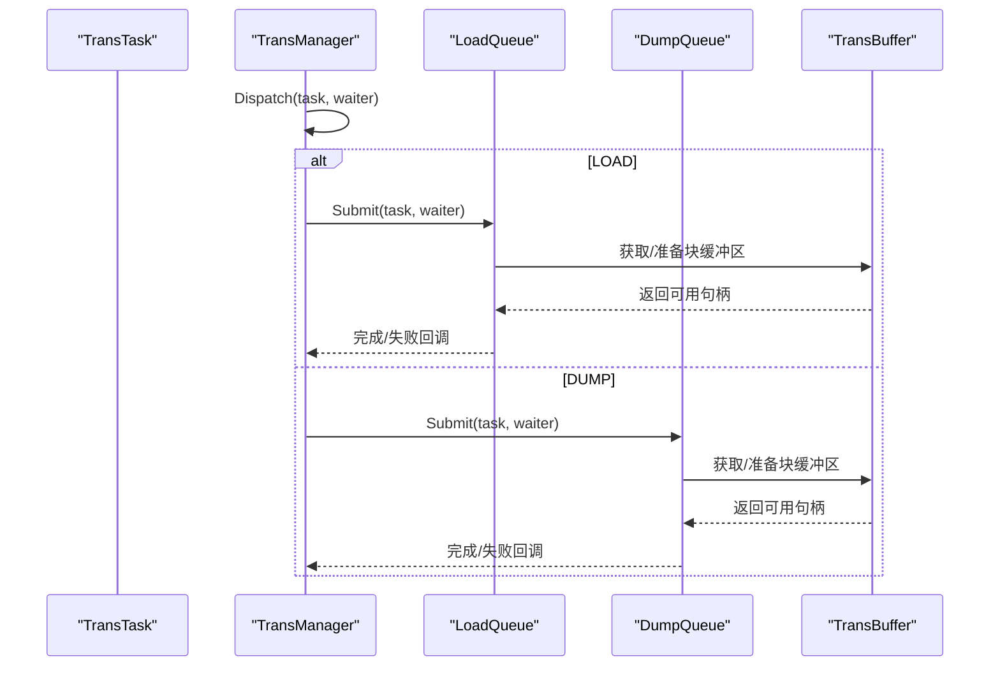
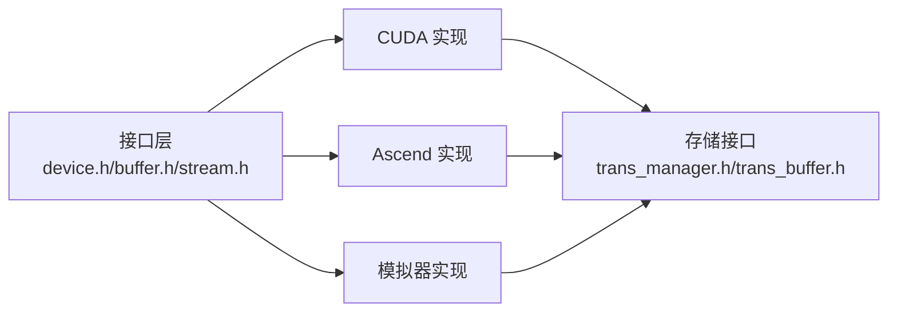

# 传输层扩展

<cite>
**本文引用的文件**
- [device.h](file://ucm/shared/trans/device.h)
- [buffer.h](file://ucm/shared/trans/buffer.h)
- [stream.h](file://ucm/shared/trans/stream.h)
- [cuda_device.cc](file://ucm/shared/trans/cuda/cuda_device.cc)
- [cuda_buffer.cc](file://ucm/shared/trans/cuda/cuda_buffer.cc)
- [cuda_stream.cc](file://ucm/shared/trans/cuda/cuda_stream.cc)
- [ascend_device.cc](file://ucm/shared/trans/ascend/ascend_device.cc)
- [ascend_buffer.cc](file://ucm/shared/trans/ascend/ascend_buffer.cc)
- [ascend_stream.cc](file://ucm/shared/trans/ascend/ascend_stream.cc)
- [simu_device.cc](file://ucm/shared/trans/simu/simu_device.cc)
- [indexer.h](file://ucm/shared/trans/detail/indexer.h)
- [reserved_buffer.h](file://ucm/shared/trans/detail/reserved_buffer.h)
- [trans_on_cuda_example.py](file://ucm/shared/test/example/trans/trans_on_cuda_example.py)
- [trans_test.cc](file://ucm/shared/test/case/trans/trans_test.cc)
- [trans_buffer.h](file://ucm/store/cache/cc/trans_buffer.h)
- [trans_manager.h](file://ucm/store/cache/cc/trans_manager.h)
- [factory.py](file://ucm/store/factory.py)
</cite>

## 目录
1. [简介](#简介)
2. [项目结构](#项目结构)
3. [核心组件](#核心组件)
4. [架构总览](#架构总览)
5. [组件详解](#组件详解)
6. [依赖关系分析](#依赖关系分析)
7. [性能考量](#性能考量)
8. [故障排查指南](#故障排查指南)
9. [结论](#结论)
10. [附录](#附录)

## 简介
本文件面向UCM传输层扩展的开发者，系统性阐述设备抽象层（Device/Buffer/Stream）的设计与实现，覆盖缓冲区管理、流处理机制、多硬件后端（CUDA、Ascend、模拟器）接入方式，并给出与存储系统的交互模式、任务调度与资源协调策略。文档同时提供从基础设备抽象到高性能数据传输的完整实现路径与最佳实践，帮助快速扩展新传输后端（如Ascend NPU/MUSA等）。

## 项目结构
传输层位于ucm/shared/trans目录下，采用“接口定义 + 平台实现”的分层设计：
- 接口层：device.h、buffer.h、stream.h 定义统一抽象
- CUDA实现：cuda_device.cc、cuda_buffer.cc、cuda_stream.cc
- Ascend实现：ascend_device.cc、ascend_buffer.cc、ascend_stream.cc
- 模拟器实现：simu_device.cc
- 缓冲区复用工具：indexer.h、reserved_buffer.h
- 测试与示例：trans_on_cuda_example.py、trans_test.cc
- 存储侧交互：trans_buffer.h、trans_manager.h
- 连接器工厂：factory.py

图表来源
- [device.h](file://ucm/shared/trans/device.h#L32-L38)
- [buffer.h](file://ucm/shared/trans/buffer.h#L32-L46)
- [stream.h](file://ucm/shared/trans/stream.h#L32-L53)
- [cuda_device.cc](file://ucm/shared/trans/cuda/cuda_device.cc#L41-L80)
- [cuda_buffer.cc](file://ucm/shared/trans/cuda/cuda_buffer.cc#L29-L56)
- [cuda_stream.cc](file://ucm/shared/trans/cuda/cuda_stream.cc#L28-L156)
- [ascend_device.cc](file://ucm/shared/trans/ascend/ascend_device.cc#L31-L61)
- [ascend_buffer.cc](file://ucm/shared/trans/ascend/ascend_buffer.cc#L29-L54)
- [ascend_stream.cc](file://ucm/shared/trans/ascend/ascend_stream.cc#L42-L175)
- [simu_device.cc](file://ucm/shared/trans/simu/simu_device.cc#L31-L58)
- [indexer.h](file://ucm/shared/trans/detail/indexer.h#L34-L94)
- [reserved_buffer.h](file://ucm/shared/trans/detail/reserved_buffer.h#L33-L95)

章节来源
- [device.h](file://ucm/shared/trans/device.h#L32-L38)
- [buffer.h](file://ucm/shared/trans/buffer.h#L32-L46)
- [stream.h](file://ucm/shared/trans/stream.h#L32-L53)

## 核心组件
- 设备接口 Device：负责初始化设备、创建流与缓冲区对象
- 缓冲区接口 Buffer：统一设备/主机内存分配、注册与回收
- 流接口 Stream：统一同步/异步数据搬运、回调与同步点

这些接口在CUDA、Ascend与模拟器中均有具体实现，保证上层逻辑对硬件透明。

章节来源
- [device.h](file://ucm/shared/trans/device.h#L32-L38)
- [buffer.h](file://ucm/shared/trans/buffer.h#L32-L46)
- [stream.h](file://ucm/shared/trans/stream.h#L32-L53)

## 架构总览
传输层通过Device工厂方法创建Stream与Buffer实例，Stream封装底层异步拷贝API，Buffer提供灵活的内存生命周期管理；存储层通过TransManager与TransBuffer协调任务与缓冲区，形成“设备无关 + 高效复用 + 可靠调度”的整体架构。

图表来源
- [cuda_device.cc](file://ucm/shared/trans/cuda/cuda_device.cc#L41-L80)
- [cuda_stream.cc](file://ucm/shared/trans/cuda/cuda_stream.cc#L28-L156)
- [cuda_buffer.cc](file://ucm/shared/trans/cuda/cuda_buffer.cc#L29-L56)
- [trans_manager.h](file://ucm/store/cache/cc/trans_manager.h#L35-L70)
- [trans_buffer.h](file://ucm/store/cache/cc/trans_buffer.h#L37-L115)

## 组件详解

### 设备抽象层（Device）
- 职责
  - 初始化目标设备上下文
  - 创建计算流（Compute Engine Stream）与特殊流（SM Stream）
  - 创建缓冲区对象
- 关键点
  - CUDA：设置设备、绑定CPU亲和、创建非阻塞流
  - Ascend：设置ACL设备、订阅回调线程、创建流
  - 模拟器：无实际设备，仅用于功能验证

图表来源
- [device.h](file://ucm/shared/trans/device.h#L32-L38)
- [cuda_device.cc](file://ucm/shared/trans/cuda/cuda_device.cc#L41-L80)
- [ascend_device.cc](file://ucm/shared/trans/ascend/ascend_device.cc#L31-L61)
- [simu_device.cc](file://ucm/shared/trans/simu/simu_device.cc#L31-L58)

章节来源
- [device.h](file://ucm/shared/trans/device.h#L32-L38)
- [cuda_device.cc](file://ucm/shared/trans/cuda/cuda_device.cc#L41-L80)
- [ascend_device.cc](file://ucm/shared/trans/ascend/ascend_device.cc#L31-L61)
- [simu_device.cc](file://ucm/shared/trans/simu/simu_device.cc#L31-L58)

### 缓冲区管理（Buffer 与 ReservedBuffer）
- Buffer接口
  - 设备/主机内存分配
  - 主机内存注册/解绑（加速跨端映射）
- ReservedBuffer实现
  - 将大块连续内存切分为固定大小槽位，使用Indexer进行无锁分配/回收
  - 支持GetDeviceBuffer/GetHostBuffer按需复用或扩容

图表来源
- [buffer.h](file://ucm/shared/trans/buffer.h#L32-L46)
- [reserved_buffer.h](file://ucm/shared/trans/detail/reserved_buffer.h#L33-L95)
- [indexer.h](file://ucm/shared/trans/detail/indexer.h#L34-L94)

章节来源
- [buffer.h](file://ucm/shared/trans/buffer.h#L32-L46)
- [reserved_buffer.h](file://ucm/shared/trans/detail/reserved_buffer.h#L33-L95)
- [indexer.h](file://ucm/shared/trans/detail/indexer.h#L34-L94)

### 流处理机制（Stream）
- 同步/异步搬运
  - HostToDevice/DeviceToHost 及其 Async 版本
  - 批量搬运支持数组指针与交错布局
- 回调与同步
  - AppendCallback 注册回调
  - Synchronized 等待流完成
- CUDA
  - 使用cudaMemcpy/cudaMemcpyAsync与回调
- Ascend
  - 使用aclrtMemcpy/aclrtMemcpyAsync与回调线程/订阅

图表来源
- [stream.h](file://ucm/shared/trans/stream.h#L32-L53)
- [cuda_stream.cc](file://ucm/shared/trans/cuda/cuda_stream.cc#L35-L156)
- [ascend_stream.cc](file://ucm/shared/trans/ascend/ascend_stream.cc#L55-L175)

章节来源
- [stream.h](file://ucm/shared/trans/stream.h#L32-L53)
- [cuda_stream.cc](file://ucm/shared/trans/cuda/cuda_stream.cc#L28-L156)
- [ascend_stream.cc](file://ucm/shared/trans/ascend/ascend_stream.cc#L42-L175)

### 多硬件后端实现要点

#### CUDA 后端
- 设备初始化：设置设备、绑定CPU亲和
- 流：创建非阻塞流，使用cudaMemcpyAsync与回调
- 缓冲区：cudaMalloc/cudaMallocHost，主机可注册以获得设备指针

章节来源
- [cuda_device.cc](file://ucm/shared/trans/cuda/cuda_device.cc#L33-L80)
- [cuda_stream.cc](file://ucm/shared/trans/cuda/cuda_stream.cc#L28-L156)
- [cuda_buffer.cc](file://ucm/shared/trans/cuda/cuda_buffer.cc#L29-L56)

#### Ascend 后端
- 设备初始化：设置ACL设备
- 流：创建流并启动回调线程订阅报告，使用aclrtMemcpyAsync与回调
- 缓冲区：高带宽设备内存、主机注册映射

章节来源
- [ascend_device.cc](file://ucm/shared/trans/ascend/ascend_device.cc#L31-L61)
- [ascend_stream.cc](file://ucm/shared/trans/ascend/ascend_stream.cc#L42-L175)
- [ascend_buffer.cc](file://ucm/shared/trans/ascend/ascend_buffer.cc#L29-L54)

#### 模拟器后端
- 无实际设备，便于单元测试与功能验证
- 适合作为新硬件后端的最小实现模板

章节来源
- [simu_device.cc](file://ucm/shared/trans/simu/simu_device.cc#L31-L58)

### 传输层与存储系统的交互
- TransManager
  - 负责加载/转储任务的提交与调度
  - 统一超时、分片大小、失败集合处理
- TransBuffer
  - 块级缓冲区句柄管理，支持所有权转移与Ready标记
  - 与TransManager配合完成数据就绪与消费

图表来源
- [trans_manager.h](file://ucm/store/cache/cc/trans_manager.h#L35-L70)
- [trans_buffer.h](file://ucm/store/cache/cc/trans_buffer.h#L37-L115)

章节来源
- [trans_manager.h](file://ucm/store/cache/cc/trans_manager.h#L35-L70)
- [trans_buffer.h](file://ucm/store/cache/cc/trans_buffer.h#L37-L115)

### 实现新传输后端（以Ascend为例）
- 步骤
  - 在ucm/shared/trans/xxx目录新增实现文件
  - 实现Device/Buffer/Stream的具体类，遵循接口约定
  - 在Device::MakeStream/MakeSMStream/MakeBuffer中返回对应实例
  - 在测试与示例中验证异步拷贝、回调与同步行为
- 示例参考
  - Ascend实现：设备设置、流创建与回调线程、异步拷贝与同步

章节来源
- [ascend_device.cc](file://ucm/shared/trans/ascend/ascend_device.cc#L31-L61)
- [ascend_stream.cc](file://ucm/shared/trans/ascend/ascend_stream.cc#L42-L175)
- [ascend_buffer.cc](file://ucm/shared/trans/ascend/ascend_buffer.cc#L29-L54)

### 内存管理、数据拷贝与异步操作实践
- 内存管理
  - 优先使用ReservedBuffer进行固定块复用，降低频繁分配开销
  - 对主机内存可注册以获得设备指针，减少地址转换成本
- 数据拷贝
  - 优先使用异步拷贝，结合批量搬运提升吞吐
  - 对于SM流，先将指针数组拷入设备，再进行scatter/gather搬运
- 异步操作
  - 使用AppendCallback在流完成时触发后续动作
  - 使用Synchronized确保一组操作完成后继续下一步

章节来源
- [reserved_buffer.h](file://ucm/shared/trans/detail/reserved_buffer.h#L54-L94)
- [buffer.h](file://ucm/shared/trans/buffer.h#L44-L45)
- [cuda_stream.cc](file://ucm/shared/trans/cuda/cuda_stream.cc#L56-L156)
- [ascend_stream.cc](file://ucm/shared/trans/ascend/ascend_stream.cc#L76-L175)

### 任务调度与资源协调
- 连接器工厂
  - 通过工厂注册与创建不同存储连接器，统一入口
- 存储层
  - TransManager根据任务类型分发至LoadQueue/DumpQueue
  - TransBuffer提供块级缓冲区句柄，支持Ready/Owner语义

章节来源
- [factory.py](file://ucm/store/factory.py#L34-L71)
- [trans_manager.h](file://ucm/store/cache/cc/trans_manager.h#L35-L70)
- [trans_buffer.h](file://ucm/store/cache/cc/trans_buffer.h#L37-L115)

## 依赖关系分析
- 低耦合接口层与高内聚平台实现分离
- Device作为工厂，屏蔽平台差异
- Stream/Buffer与平台库强耦合，但对外保持一致接口
- 存储层通过TransManager/TransBuffer与传输层解耦

图表来源
- [device.h](file://ucm/shared/trans/device.h#L32-L38)
- [buffer.h](file://ucm/shared/trans/buffer.h#L32-L46)
- [stream.h](file://ucm/shared/trans/stream.h#L32-L53)
- [cuda_device.cc](file://ucm/shared/trans/cuda/cuda_device.cc#L41-L80)
- [ascend_device.cc](file://ucm/shared/trans/ascend/ascend_device.cc#L31-L61)
- [simu_device.cc](file://ucm/shared/trans/simu/simu_device.cc#L31-L58)
- [trans_manager.h](file://ucm/store/cache/cc/trans_manager.h#L35-L70)
- [trans_buffer.h](file://ucm/store/cache/cc/trans_buffer.h#L37-L115)

## 性能考量
- 批量搬运优先：减少流切换与系统调用次数
- 固定块复用：避免频繁malloc/free
- 主机内存注册：降低跨端地址映射成本
- SM流适用场景：当需要以设备指针数组形式进行scatter/gather时
- 回调与同步：合理安排回调位置，避免过度同步导致流水线中断

## 故障排查指南
- 设备初始化失败
  - 检查设备ID合法性与驱动状态
  - CUDA：确认设备设置与NVML亲和设置
  - Ascend：确认ACL设备设置与回调线程订阅
- 拷贝失败
  - 校验指针有效性与内存对齐
  - 检查异步拷贝是否遗漏Synchronized
- 回调未触发
  - 确认流未被提前销毁
  - Ascend需确保回调线程已订阅
- 性能异常
  - 检查是否混用同步/异步API
  - 评估批大小与缓冲区复用命中率

章节来源
- [cuda_device.cc](file://ucm/shared/trans/cuda/cuda_device.cc#L33-L47)
- [ascend_device.cc](file://ucm/shared/trans/ascend/ascend_device.cc#L31-L37)
- [cuda_stream.cc](file://ucm/shared/trans/cuda/cuda_stream.cc#L139-L156)
- [ascend_stream.cc](file://ucm/shared/trans/ascend/ascend_stream.cc#L158-L175)

## 结论
传输层通过清晰的接口抽象与平台化实现，实现了对多硬件后端的一致支持。结合缓冲区复用、异步拷贝与回调机制，可在保证正确性的前提下最大化吞吐。存储层通过TransManager与TransBuffer提供了可靠的资源协调与任务调度能力。按照本文提供的扩展流程与最佳实践，可快速接入新硬件后端并稳定运行。

## 附录

### 快速上手：CUDA端到端示例
- 准备环境：CUDA设备可用，安装CuPy/Numpy
- 运行示例脚本，验证CE/SM流、同步/异步、批量搬运与带宽统计
- 参考路径：ucm/shared/test/example/trans/trans_on_cuda_example.py

章节来源
- [trans_on_cuda_example.py](file://ucm/shared/test/example/trans/trans_on_cuda_example.py#L245-L266)

### 单元测试参考
- C++测试：验证CE/SM流与批量搬运的正确性
- Python测试：验证异步回调与同步点

章节来源
- [trans_test.cc](file://ucm/shared/test/case/trans/trans_test.cc#L29-L141)
- [trans_on_cuda_example.py](file://ucm/shared/test/example/trans/trans_on_cuda_example.py#L85-L262)