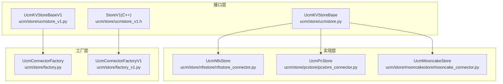
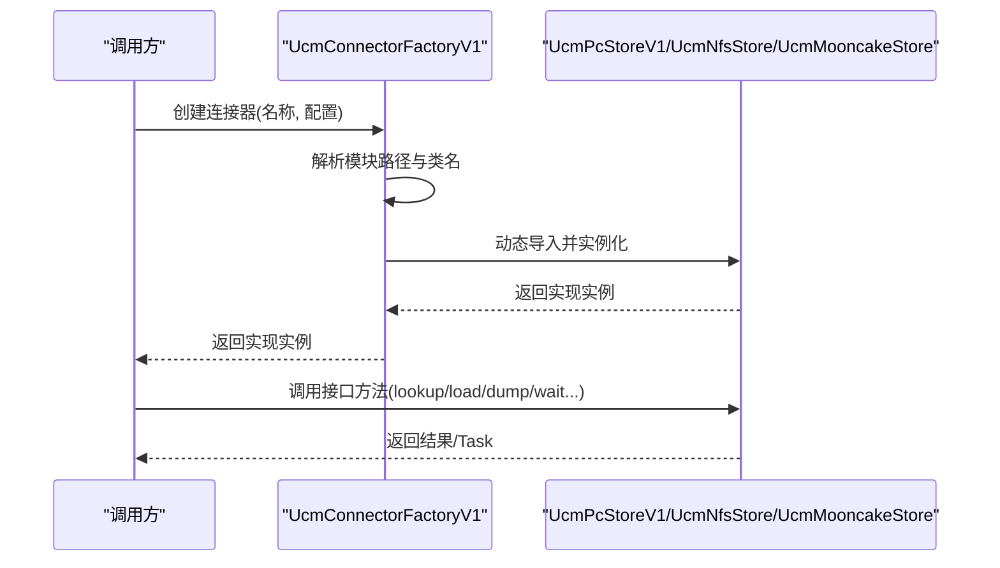
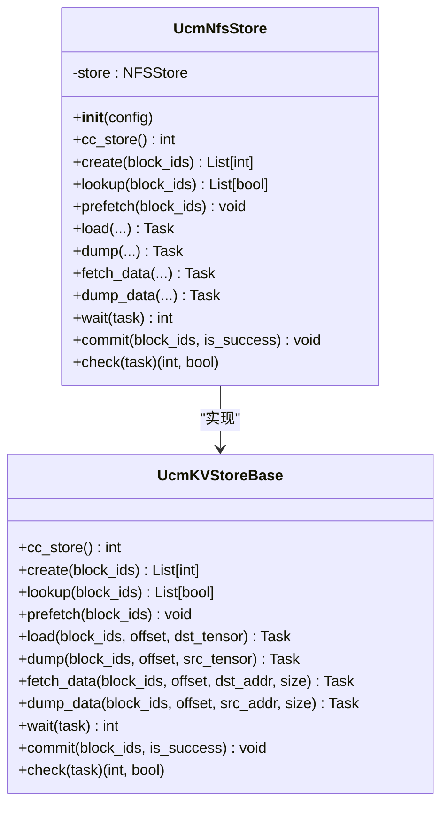
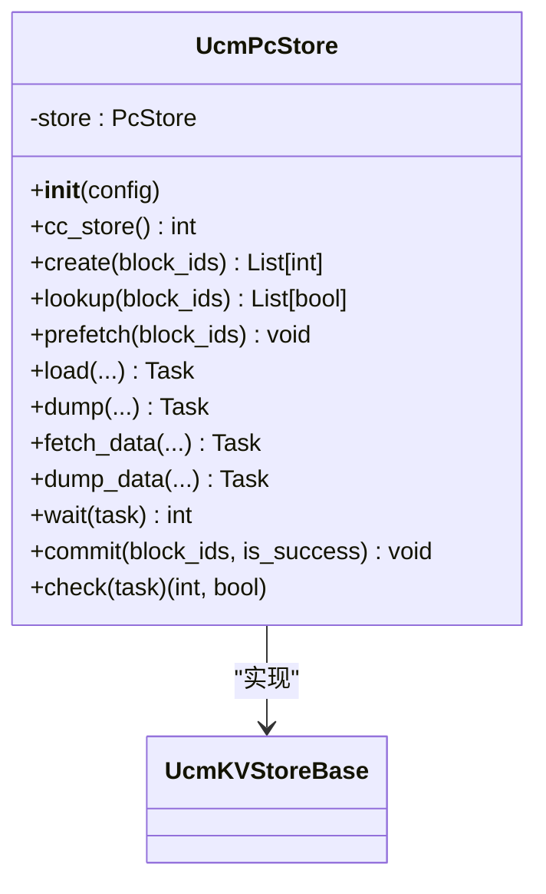
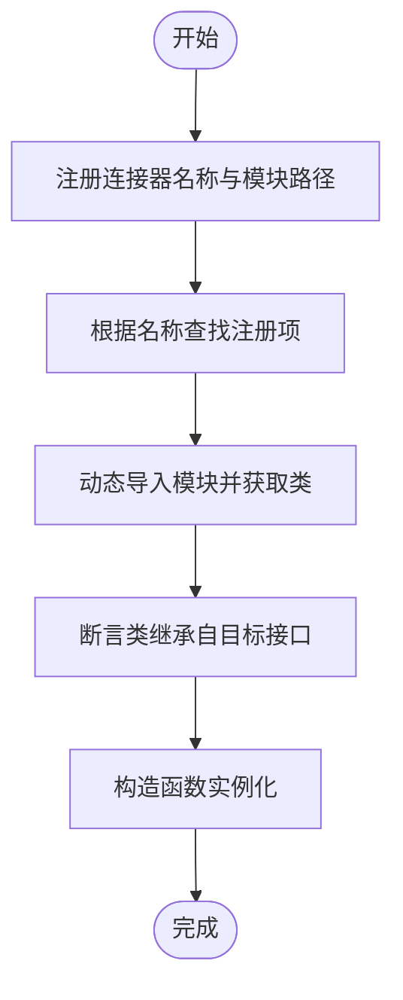
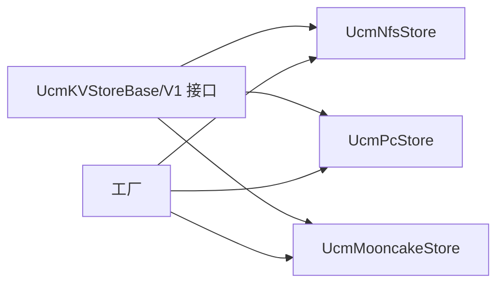

# 存储后端扩展

<cite>
**本文引用的文件**
- [ucm/store/ucmstore.py](file://ucm/store/ucmstore.py)
- [ucm/store/ucmstore_v1.py](file://ucm/store/ucmstore_v1.py)
- [ucm/store/ucmstore_v1.h](file://ucm/store/ucmstore_v1.h)
- [ucm/store/factory.py](file://ucm/store/factory.py)
- [ucm/store/factory_v1.py](file://ucm/store/factory_v1.py)
- [ucm/store/nfsstore/nfsstore_connector.py](file://ucm/store/nfsstore/nfsstore_connector.py)
- [ucm/store/pcstore/pcstore_connector.py](file://ucm/store/pcstore/pcstore_connector.py)
- [ucm/store/mooncakestore/mooncake_connector.py](file://ucm/store/mooncakestore/mooncake_connector.py)
- [docs/source/developer-guide/extending_store.md](file://docs/source/developer-guide/extending_store.md)
</cite>

## 目录
1. [简介](#简介)
2. [项目结构](#项目结构)
3. [核心组件](#核心组件)
4. [架构总览](#架构总览)
5. [详细组件分析](#详细组件分析)
6. [依赖分析](#依赖分析)
7. [性能考虑](#性能考虑)
8. [故障排查指南](#故障排查指南)
9. [结论](#结论)
10. [附录](#附录)

## 简介
本技术文档面向希望为UCM（Unified Cache Management）系统扩展“存储后端”的开发者，系统性阐述三类扩展方式与存储接口规范，覆盖：
- 纯Python扩展
- Python/C++混合扩展
- 纯C++扩展

文档重点包括：
- 存储接口的完整规范（lookup、prefetch、load、dump、fetch_data、dump_data、wait、commit、check、create、cc_store）
- 如何继承基类、实现抽象方法、完成工厂注册
- 不同扩展方法的性能特征、适用场景与最佳实践
- 内存管理、异常处理、线程安全等关键实现要点
- 测试方法与调试技巧

## 项目结构
UCM的存储后端位于ucm/store目录下，采用“接口定义 + 具体实现 + 工厂注册”的分层设计：
- 接口层：ucm/store/ucmstore.py（v0接口）、ucm/store/ucmstore_v1.py（v1接口）及ucm/store/ucmstore_v1.h（C++接口）
- 实现层：nfsstore、pcstore、mooncakestore等具体存储实现
- 工厂层：ucm/store/factory.py（v0接口工厂）、ucm/store/factory_v1.py（v1接口工厂）



图表来源
- [ucm/store/ucmstore.py](file://ucm/store/ucmstore.py#L39-L205)
- [ucm/store/ucmstore_v1.py](file://ucm/store/ucmstore_v1.py#L41-L202)
- [ucm/store/ucmstore_v1.h](file://ucm/store/ucmstore_v1.h#L122-L161)
- [ucm/store/nfsstore/nfsstore_connector.py](file://ucm/store/nfsstore/nfsstore_connector.py#L39-L132)
- [ucm/store/pcstore/pcstore_connector.py](file://ucm/store/pcstore/pcstore_connector.py#L39-L115)
- [ucm/store/mooncakestore/mooncake_connector.py](file://ucm/store/mooncakestore/mooncake_connector.py#L59-L368)
- [ucm/store/factory.py](file://ucm/store/factory.py#L34-L71)
- [ucm/store/factory_v1.py](file://ucm/store/factory_v1.py#L34-L66)

章节来源
- [ucm/store/ucmstore.py](file://ucm/store/ucmstore.py#L39-L205)
- [ucm/store/ucmstore_v1.py](file://ucm/store/ucmstore_v1.py#L41-L202)
- [ucm/store/ucmstore_v1.h](file://ucm/store/ucmstore_v1.h#L122-L161)
- [ucm/store/factory.py](file://ucm/store/factory.py#L34-L71)
- [ucm/store/factory_v1.py](file://ucm/store/factory_v1.py#L34-L66)

## 核心组件
本节聚焦存储接口的完整规范与职责边界。

- v0接口（Python）：UcmKVStoreBase
  - 职责：KV缓存空间管理、命中查询、预取、数据加载/卸载到设备、低层指针拷贝、任务等待/检查、提交/回滚、底层句柄导出
  - 关键方法：cc_store、create、lookup、prefetch、load、dump、fetch_data、dump_data、wait、commit、check
  - 返回值约定：成功通常返回0或Task对象；失败返回非0状态码或抛出异常

- v1接口（Python/C++）：UcmKVStoreBaseV1
  - 职责：与v0类似，但参数类型更严格（如block_ids使用bytes），支持前缀命中查询（lookup_on_prefix），提供更高性能的双层列表张量组织
  - 关键方法：cc_store、lookup、lookup_on_prefix、prefetch、load、dump、load_data、dump_data、wait、check

- C++接口（StoreV1）：ucm/store/ucmstore_v1.h
  - 职责：定义C++侧统一接口，便于高性能实现与原生集成
  - 关键方法：Lookup、LookupOnPrefix、Prefetch、Load、Dump、Check、Wait

章节来源
- [ucm/store/ucmstore.py](file://ucm/store/ucmstore.py#L39-L205)
- [ucm/store/ucmstore_v1.py](file://ucm/store/ucmstore_v1.py#L41-L202)
- [ucm/store/ucmstore_v1.h](file://ucm/store/ucmstore_v1.h#L122-L161)

## 架构总览
UCM通过工厂模式按名称动态加载存储实现，调用方仅依赖接口层，实现层可替换。



图表来源
- [ucm/store/factory_v1.py](file://ucm/store/factory_v1.py#L34-L66)
- [ucm/store/pcstore/pcstore_connector.py](file://ucm/store/pcstore/pcstore_connector.py#L39-L115)
- [ucm/store/nfsstore/nfsstore_connector.py](file://ucm/store/nfsstore/nfsstore_connector.py#L39-L132)
- [ucm/store/mooncakestore/mooncake_connector.py](file://ucm/store/mooncakestore/mooncake_connector.py#L59-L368)

## 详细组件分析

### 组件A：NFS存储实现（Python封装）
- 角色：基于底层NFSStore封装，实现UcmKVStoreBase接口
- 特点：
  - 使用PyTorch张量指针与大小进行数据传输
  - 支持设备直传配置（IO大小、直接IO、流数量、缓冲数量等）
  - 提供任务封装（NfsTask）与等待/检查机制
- 关键流程：初始化配置 → 建立底层Store → 实现接口方法 → 任务生命周期管理



图表来源
- [ucm/store/ucmstore.py](file://ucm/store/ucmstore.py#L39-L205)
- [ucm/store/nfsstore/nfsstore_connector.py](file://ucm/store/nfsstore/nfsstore_connector.py#L39-L132)

章节来源
- [ucm/store/nfsstore/nfsstore_connector.py](file://ucm/store/nfsstore/nfsstore_connector.py#L39-L132)

### 组件B：PC存储实现（Python封装）
- 角色：基于底层PcStore封装，实现UcmKVStoreBase接口
- 特点：
  - 支持唯一ID、本地rank大小、散射-聚集等高级传输特性
  - 张量指针与大小用于设备间数据传输
  - 提供任务封装与等待/检查机制
- 关键流程：解析配置 → 初始化PcStore → 实现接口方法 → 任务生命周期管理



图表来源
- [ucm/store/ucmstore.py](file://ucm/store/ucmstore.py#L39-L205)
- [ucm/store/pcstore/pcstore_connector.py](file://ucm/store/pcstore/pcstore_connector.py#L39-L115)

章节来源
- [ucm/store/pcstore/pcstore_connector.py](file://ucm/store/pcstore/pcstore_connector.py#L39-L115)

### 组件C：Mooncake存储实现（Python封装）
- 角色：基于外部Mooncake分布式存储封装，实现UcmKVStoreBase接口
- 特点：
  - 使用异步事件循环与Future管理任务
  - 通过safetensors序列化/反序列化张量
  - 支持线程安全的任务分配与超时控制
  - 部分接口未实现（如fetch_data/dump_data），需在上层规避
- 关键流程：初始化配置与事件循环 → 任务派发到异步循环 → Future结果等待 → 超时/取消处理

```mermaid
sequenceDiagram
participant Caller as "调用方"
participant Store as "UcmMooncakeStore"
participant Loop as "异步事件循环"
participant MC as "MooncakeDistributedStore"
Caller->>Store : load(block_ids, offset, dst_tensor)
Store->>Loop : 将协程任务派发到事件循环
Loop->>MC : get(hash)
MC-->>Loop : 返回字节数据
Loop->>Loop : safetensors反序列化为CPU张量
Loop-->>Store : 返回执行结果
Store-->>Caller : 返回Task
Caller->>Store : wait(task)
Store->>Store : 获取Future并等待/处理异常
Store-->>Caller : 返回状态码
```

图表来源
- [ucm/store/mooncakestore/mooncake_connector.py](file://ucm/store/mooncakestore/mooncake_connector.py#L170-L316)

章节来源
- [ucm/store/mooncakestore/mooncake_connector.py](file://ucm/store/mooncakestore/mooncake_connector.py#L59-L368)

### 组件D：工厂注册与动态加载
- UcmConnectorFactory（v0）：注册名称到模块路径+类名的映射，按名称动态导入并实例化
- UcmConnectorFactoryV1（v1）：注册名称到模块路径+类名的映射，按名称动态导入并实例化
- 注册示例参考：docs/source/developer-guide/extending_store.md 中的“注册你的Store”步骤



图表来源
- [ucm/store/factory.py](file://ucm/store/factory.py#L34-L71)
- [ucm/store/factory_v1.py](file://ucm/store/factory_v1.py#L34-L66)

章节来源
- [ucm/store/factory.py](file://ucm/store/factory.py#L34-L71)
- [ucm/store/factory_v1.py](file://ucm/store/factory_v1.py#L34-L66)

## 依赖分析
- 接口与实现解耦：实现类仅依赖接口层，通过工厂按名称动态加载
- 任务模型：各实现均以Task作为异步任务句柄，统一由wait/check管理
- 第三方依赖：Mooncake实现依赖外部MooncakeDistributedStore与safetensors



图表来源
- [ucm/store/ucmstore.py](file://ucm/store/ucmstore.py#L39-L205)
- [ucm/store/ucmstore_v1.py](file://ucm/store/ucmstore_v1.py#L41-L202)
- [ucm/store/nfsstore/nfsstore_connector.py](file://ucm/store/nfsstore/nfsstore_connector.py#L39-L132)
- [ucm/store/pcstore/pcstore_connector.py](file://ucm/store/pcstore/pcstore_connector.py#L39-L115)
- [ucm/store/mooncakestore/mooncake_connector.py](file://ucm/store/mooncakestore/mooncake_connector.py#L59-L368)
- [ucm/store/factory.py](file://ucm/store/factory.py#L34-L71)
- [ucm/store/factory_v1.py](file://ucm/store/factory_v1.py#L34-L66)

章节来源
- [ucm/store/ucmstore.py](file://ucm/store/ucmstore.py#L39-L205)
- [ucm/store/ucmstore_v1.py](file://ucm/store/ucmstore_v1.py#L41-L202)
- [ucm/store/nfsstore/nfsstore_connector.py](file://ucm/store/nfsstore/nfsstore_connector.py#L39-L132)
- [ucm/store/pcstore/pcstore_connector.py](file://ucm/store/pcstore/pcstore_connector.py#L39-L115)
- [ucm/store/mooncakestore/mooncake_connector.py](file://ucm/store/mooncakestore/mooncake_connector.py#L59-L368)
- [ucm/store/factory.py](file://ucm/store/factory.py#L34-L71)
- [ucm/store/factory_v1.py](file://ucm/store/factory_v1.py#L34-L66)

## 性能考虑
- 纯Python扩展
  - 优点：开发速度快，易于验证算法
  - 缺点：GIL限制，不适合高吞吐场景
  - 适用：原型验证、小规模测试
- Python/C++混合扩展
  - 优点：热点逻辑用C++实现，业务逻辑用Python编排
  - 适用：需要平衡开发效率与性能的场景
- 纯C++扩展
  - 优点：零Python运行时开销，资源可控，线程安全
  - 适用：生产级高性能场景
- 最佳实践
  - 明确内存边界：避免在Python层频繁分配/释放大块内存
  - 任务并发：合理设置传输队列与缓冲数量，避免阻塞
  - 异常安全：返回状态码而非抛出异常，便于上层统一处理
  - 线程安全：实现必须可被多线程并发调用

章节来源
- [docs/source/developer-guide/extending_store.md](file://docs/source/developer-guide/extending_store.md#L18-L27)

## 故障排查指南
- 初始化失败
  - 检查配置项是否齐全（如设备ID、IO大小、缓冲数量等）
  - 查看底层Setup返回码，定位具体错误
- 任务等待超时
  - Mooncake实现默认超时阈值较高，确认Future是否被取消或异常
  - 检查事件循环线程是否正常运行
- 数据一致性问题
  - 确认load/dump的block_ids与offset顺序一致
  - 校验张量形状与dtype匹配
- 并发问题
  - 确保任务ID唯一且不复用已完成任务
  - 在多线程环境下使用锁保护共享状态

章节来源
- [ucm/store/nfsstore/nfsstore_connector.py](file://ucm/store/nfsstore/nfsstore_connector.py#L40-L71)
- [ucm/store/pcstore/pcstore_connector.py](file://ucm/store/pcstore/pcstore_connector.py#L40-L62)
- [ucm/store/mooncakestore/mooncake_connector.py](file://ucm/store/mooncakestore/mooncake_connector.py#L103-L127)
- [ucm/store/mooncakestore/mooncake_connector.py](file://ucm/store/mooncakestore/mooncake_connector.py#L284-L316)

## 结论
UCM提供了清晰的存储接口与工厂机制，支持从纯Python到纯C++的多种扩展路径。选择扩展方式应综合考虑开发效率、性能需求与维护成本。无论采用哪种方式，都必须严格遵循接口规范、任务模型与并发约束，确保系统的稳定性与可扩展性。

## 附录

### 存储接口方法规范摘要
- v0接口（UcmKVStoreBase）
  - cc_store：返回底层Store指针
  - create：批量分配空间
  - lookup：批量命中查询
  - prefetch：预取到高速缓存
  - load：从存储加载到设备张量
  - dump：从设备张量写入存储
  - fetch_data：低层指针拷贝到设备
  - dump_data：低层指针拷贝自设备
  - wait：等待任务完成
  - commit：提交/回滚
  - check：非阻塞检查任务状态

- v1接口（UcmKVStoreBaseV1）
  - cc_store：返回底层Store指针
  - lookup：批量命中查询（bytes）
  - lookup_on_prefix：前缀命中查询（返回最大索引）
  - prefetch：预取到高速缓存
  - load：从存储加载到设备张量（双层列表）
  - dump：从设备张量写入存储（双层列表）
  - load_data：低层指针拷贝到设备（双层列表）
  - dump_data：低层指针拷贝自设备（双层列表）
  - wait：等待任务完成
  - check：非阻塞检查任务状态

章节来源
- [ucm/store/ucmstore.py](file://ucm/store/ucmstore.py#L39-L205)
- [ucm/store/ucmstore_v1.py](file://ucm/store/ucmstore_v1.py#L41-L202)
- [ucm/store/ucmstore_v1.h](file://ucm/store/ucmstore_v1.h#L122-L161)

### 扩展方法与示例路径
- 纯Python扩展
  - 继承UcmKVStoreBaseV1并实现所有抽象方法
  - 参考：docs/source/developer-guide/extending_store.md 的“Pure Python”章节
  - 工厂注册：参考docs中的注册示例

- Python/C++混合扩展
  - C++核心实现遵循StoreV1接口
  - Python绑定通过pybind11暴露给Python层
  - 参考：docs/source/developer-guide/extending_store.md 的“Hybrid Python/C++”章节

- 纯C++扩展
  - 完全在C++中实现接口，通过工厂函数导出
  - 参考：docs/source/developer-guide/extending_store.md 的“Pure C++”章节

章节来源
- [docs/source/developer-guide/extending_store.md](file://docs/source/developer-guide/extending_store.md#L30-L295)