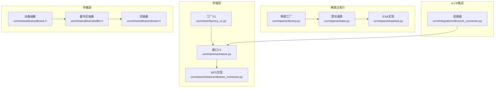
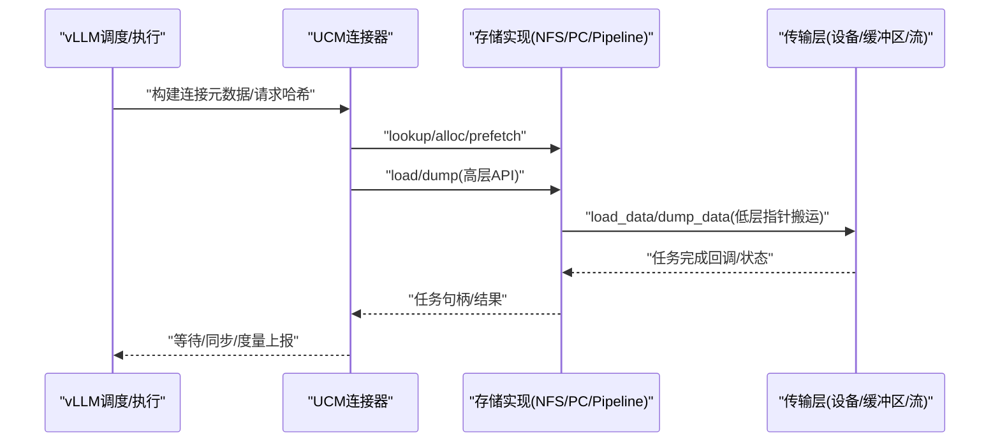
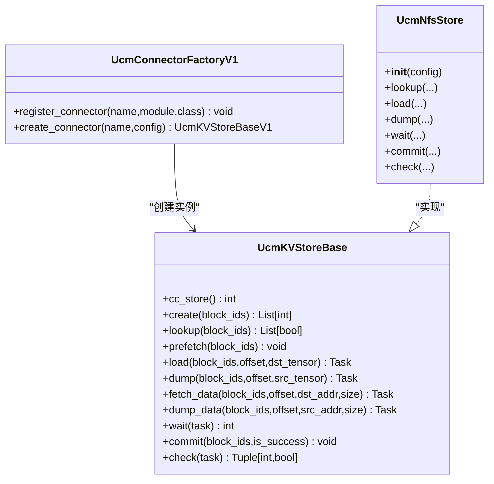
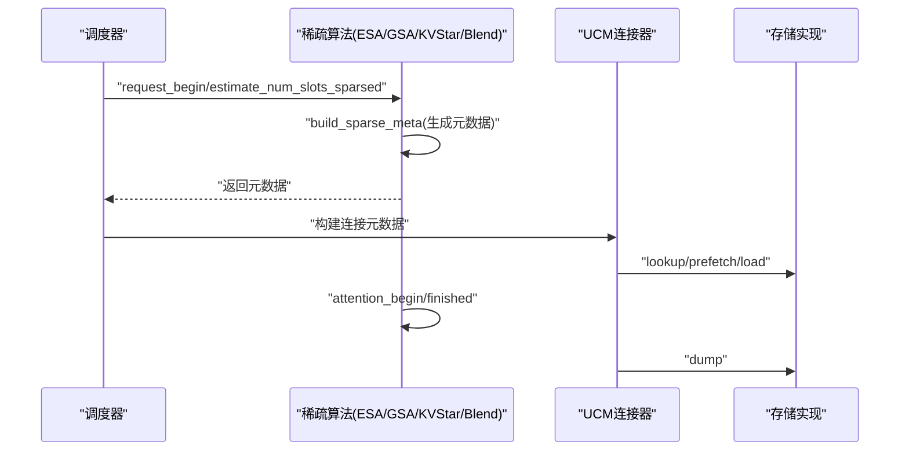
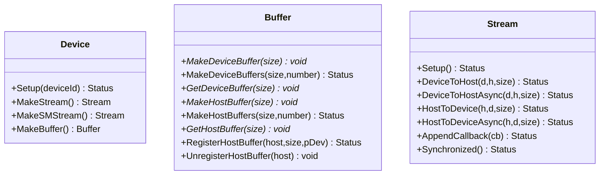
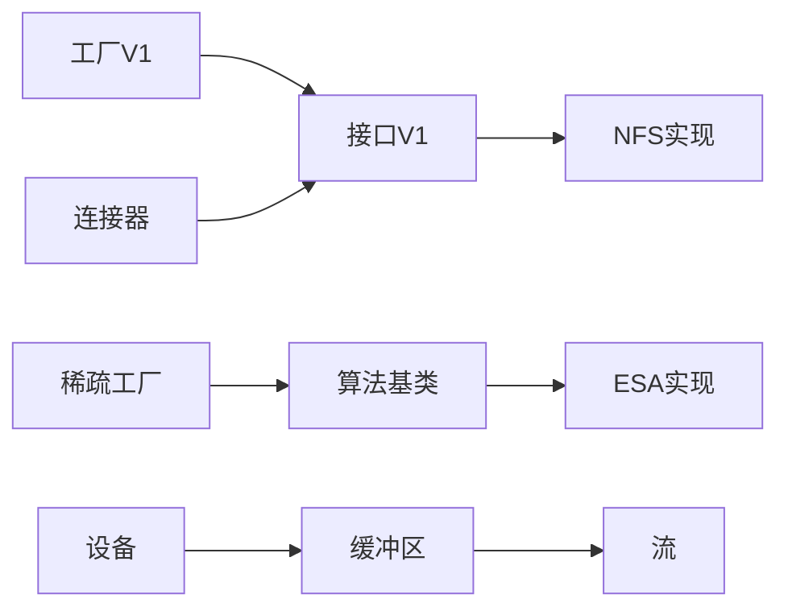

# 扩展开发指南

<cite>
**本文档引用的文件**
- [ucm/store/factory.py](file://ucm/store/factory.py)
- [ucm/store/factory_v1.py](file://ucm/store/factory_v1.py)
- [ucm/store/ucmstore.py](file://ucm/store/ucmstore.py)
- [ucm/store/nfsstore/nfsstore_connector.py](file://ucm/store/nfsstore/nfsstore_connector.py)
- [ucm/sparse/factory.py](file://ucm/sparse/factory.py)
- [ucm/sparse/base.py](file://ucm/sparse/base.py)
- [ucm/sparse/esa/esa.py](file://ucm/sparse/esa/esa.py)
- [ucm/integration/vllm/ucm_connector.py](file://ucm/integration/vllm/ucm_connector.py)
- [ucm/shared/trans/device.h](file://ucm/shared/trans/device.h)
- [ucm/shared/trans/buffer.h](file://ucm/shared/trans/buffer.h)
- [ucm/shared/trans/stream.h](file://ucm/shared/trans/stream.h)
- [ucm/utils.py](file://ucm/utils.py)
- [examples/offline_inference_blend.py](file://examples/offline_inference_blend.py)
- [test/suites/E2E/test_offline_inference_sparse.py](file://test/suites/E2E/test_offline_inference_sparse.py)
- [docs/source/developer-guide/extending_store.md](file://docs/source/developer-guide/extending_store.md)
</cite>

## 目录
1. [简介](#简介)
2. [项目结构](#项目结构)
3. [核心组件](#核心组件)
4. [架构总览](#架构总览)
5. [详细组件分析](#详细组件分析)
6. [依赖关系分析](#依赖关系分析)
7. [性能考量](#性能考量)
8. [故障排查指南](#故障排查指南)
9. [结论](#结论)
10. [附录](#附录)

## 简介
本指南面向希望在UCM（Unified Cache Manager）中进行扩展开发的工程师，系统讲解如何扩展存储后端、新增稀疏注意力算法、开发自定义传输层以及构建vLLM集成适配器。文档基于代码库的实际实现，提供可操作的步骤、最佳实践与测试方法，并明确兼容性与版本管理策略。

## 项目结构
UCM采用模块化架构，围绕“存储接口”“稀疏注意力工厂”“vLLM集成适配器”“传输层抽象”四大扩展点组织代码。关键目录与职责如下：
- 存储层：统一KV缓存存储接口与多种实现（NFS、PC、Pipeline等），通过工厂模式注册与创建
- 稀疏注意力：统一算法基类与工厂，支持ESA、GSA On Device、KVStar、Blend等
- vLLM集成：提供直接/分层两种连接器，负责调度与执行阶段的KV缓存加载/保存
- 传输层：抽象设备、缓冲区与流，支撑高性能数据搬运

图表来源
- [ucm/store/factory_v1.py](file://ucm/store/factory_v1.py#L34-L57)
- [ucm/store/ucmstore.py](file://ucm/store/ucmstore.py#L39-L205)
- [ucm/store/nfsstore/nfsstore_connector.py](file://ucm/store/nfsstore/nfsstore_connector.py#L39-L132)
- [ucm/sparse/factory.py](file://ucm/sparse/factory.py#L13-L56)
- [ucm/sparse/base.py](file://ucm/sparse/base.py#L127-L323)
- [ucm/sparse/esa/esa.py](file://ucm/sparse/esa/esa.py#L421-L821)
- [ucm/integration/vllm/ucm_connector.py](file://ucm/integration/vllm/ucm_connector.py#L82-L1080)
- [ucm/shared/trans/device.h](file://ucm/shared/trans/device.h#L32-L40)
- [ucm/shared/trans/buffer.h](file://ucm/shared/trans/buffer.h#L32-L46)
- [ucm/shared/trans/stream.h](file://ucm/shared/trans/stream.h#L32-L53)

章节来源
- [ucm/store/factory_v1.py](file://ucm/store/factory_v1.py#L34-L57)
- [ucm/store/ucmstore.py](file://ucm/store/ucmstore.py#L39-L205)
- [ucm/store/nfsstore/nfsstore_connector.py](file://ucm/store/nfsstore/nfsstore_connector.py#L39-L132)
- [ucm/sparse/factory.py](file://ucm/sparse/factory.py#L13-L56)
- [ucm/sparse/base.py](file://ucm/sparse/base.py#L127-L323)
- [ucm/sparse/esa/esa.py](file://ucm/sparse/esa/esa.py#L421-L821)
- [ucm/integration/vllm/ucm_connector.py](file://ucm/integration/vllm/ucm_connector.py#L82-L1080)
- [ucm/shared/trans/device.h](file://ucm/shared/trans/device.h#L32-L40)
- [ucm/shared/trans/buffer.h](file://ucm/shared/trans/buffer.h#L32-L46)
- [ucm/shared/trans/stream.h](file://ucm/shared/trans/stream.h#L32-L53)

## 核心组件
- 存储接口与工厂
  - 接口定义：统一KV缓存的创建、查找、预取、加载、转储、等待、提交、检查等能力
  - 工厂V1：按名称延迟加载模块与类，完成实例化
  - 示例实现：NFS存储适配器封装底层存储对象并实现接口
- 稀疏注意力
  - 基类：定义调度侧与工作侧钩子、元数据传递、状态更新等
  - 工厂：按名称注册算法类，按配置选择具体算法
  - 实现：ESA等算法在注意力前后插入检索与加载逻辑
- vLLM集成
  - 连接器：负责请求哈希、块ID生成、加载/保存任务编排与度量上报
  - 支持直接与分层两种流水线策略
- 传输层
  - 设备/缓冲区/流：抽象跨设备数据搬运，提供同步/异步接口

章节来源
- [ucm/store/ucmstore.py](file://ucm/store/ucmstore.py#L39-L205)
- [ucm/store/factory_v1.py](file://ucm/store/factory_v1.py#L34-L57)
- [ucm/store/nfsstore/nfsstore_connector.py](file://ucm/store/nfsstore/nfsstore_connector.py#L39-L132)
- [ucm/sparse/base.py](file://ucm/sparse/base.py#L127-L323)
- [ucm/sparse/factory.py](file://ucm/sparse/factory.py#L13-L56)
- [ucm/sparse/esa/esa.py](file://ucm/sparse/esa/esa.py#L421-L821)
- [ucm/integration/vllm/ucm_connector.py](file://ucm/integration/vllm/ucm_connector.py#L82-L1080)
- [ucm/shared/trans/device.h](file://ucm/shared/trans/device.h#L32-L40)
- [ucm/shared/trans/buffer.h](file://ucm/shared/trans/buffer.h#L32-L46)
- [ucm/shared/trans/stream.h](file://ucm/shared/trans/stream.h#L32-L53)

## 架构总览
下图展示了从vLLM到存储的调用链路，以及稀疏注意力算法在注意力前后的介入点。

图表来源
- [ucm/integration/vllm/ucm_connector.py](file://ucm/integration/vllm/ucm_connector.py#L397-L447)
- [ucm/integration/vllm/ucm_connector.py](file://ucm/integration/vllm/ucm_connector.py#L488-L561)
- [ucm/integration/vllm/ucm_connector.py](file://ucm/integration/vllm/ucm_connector.py#L566-L643)
- [ucm/store/ucmstore.py](file://ucm/store/ucmstore.py#L112-L167)
- [ucm/shared/trans/device.h](file://ucm/shared/trans/device.h#L32-L40)
- [ucm/shared/trans/buffer.h](file://ucm/shared/trans/buffer.h#L32-L46)
- [ucm/shared/trans/stream.h](file://ucm/shared/trans/stream.h#L32-L53)

## 详细组件分析

### 存储后端扩展（实现接口、工厂模式与注册）
- 实现步骤
  1) 继承接口类，实现所有抽象方法（创建、查找、预取、加载、转储、等待、提交、检查）
  2) 在工厂中注册新类型，提供模块路径与类名，工厂按名称延迟导入
  3) 在vLLM配置中指定新存储类型与参数
- 关键参考
  - 接口定义与方法签名：[ucm/store/ucmstore.py](file://ucm/store/ucmstore.py#L39-L205)
  - 工厂注册与创建：[ucm/store/factory_v1.py](file://ucm/store/factory_v1.py#L34-L57)
  - 示例实现（NFS）：[ucm/store/nfsstore/nfsstore_connector.py](file://ucm/store/nfsstore/nfsstore_connector.py#L39-L132)
  - 开发者指南（扩展存储）：[docs/source/developer-guide/extending_store.md](file://docs/source/developer-guide/extending_store.md#L30-L98)

图表来源
- [ucm/store/ucmstore.py](file://ucm/store/ucmstore.py#L39-L205)
- [ucm/store/factory_v1.py](file://ucm/store/factory_v1.py#L34-L57)
- [ucm/store/nfsstore/nfsstore_connector.py](file://ucm/store/nfsstore/nfsstore_connector.py#L39-L132)

章节来源
- [ucm/store/ucmstore.py](file://ucm/store/ucmstore.py#L39-L205)
- [ucm/store/factory_v1.py](file://ucm/store/factory_v1.py#L34-L57)
- [ucm/store/nfsstore/nfsstore_connector.py](file://ucm/store/nfsstore/nfsstore_connector.py#L39-L132)
- [docs/source/developer-guide/extending_store.md](file://docs/source/developer-guide/extending_store.md#L30-L98)

### 新增稀疏注意力算法（基类继承、接口实现与配置管理）
- 实现步骤
  1) 继承算法基类，至少实现请求生命周期钩子（调度侧/工作侧）
  2) 在工厂中注册算法名称与模块路径
  3) 在vLLM配置中通过ucm_sparse_config启用对应算法
- 关键参考
  - 算法基类与角色枚举：[ucm/sparse/base.py](file://ucm/sparse/base.py#L127-L323)
  - 工厂注册与创建：[ucm/sparse/factory.py](file://ucm/sparse/factory.py#L13-L56)
  - ESA实现示例（注意力前后钩子、元数据构建）：[ucm/sparse/esa/esa.py](file://ucm/sparse/esa/esa.py#L421-L821)
  - 配置解析（从KV配置读取ucm_sparse_config）：[ucm/sparse/factory.py](file://ucm/sparse/factory.py#L30-L44)
  - vLLM连接器中稀疏算法的绑定与调度：[ucm/integration/vllm/ucm_connector.py](file://ucm/integration/vllm/ucm_connector.py#L397-L447)

图表来源
- [ucm/sparse/base.py](file://ucm/sparse/base.py#L127-L323)
- [ucm/sparse/factory.py](file://ucm/sparse/factory.py#L13-L56)
- [ucm/sparse/esa/esa.py](file://ucm/sparse/esa/esa.py#L421-L821)
- [ucm/integration/vllm/ucm_connector.py](file://ucm/integration/vllm/ucm_connector.py#L397-L447)

章节来源
- [ucm/sparse/base.py](file://ucm/sparse/base.py#L127-L323)
- [ucm/sparse/factory.py](file://ucm/sparse/factory.py#L13-L56)
- [ucm/sparse/esa/esa.py](file://ucm/sparse/esa/esa.py#L421-L821)
- [ucm/integration/vllm/ucm_connector.py](file://ucm/integration/vllm/ucm_connector.py#L397-L447)

### 自定义传输层开发（设备抽象与缓冲区管理）
- 设计要点
  - 设备：提供流与缓冲区创建能力
  - 缓冲区：设备/主机缓冲区的创建与注册
  - 流：同步/异步的主机与设备间搬运接口
- 参考实现
  - 设备抽象：[ucm/shared/trans/device.h](file://ucm/shared/trans/device.h#L32-L40)
  - 缓冲区接口：[ucm/shared/trans/buffer.h](file://ucm/shared/trans/buffer.h#L32-L46)
  - 流接口：[ucm/shared/trans/stream.h](file://ucm/shared/trans/stream.h#L32-L53)

图表来源
- [ucm/shared/trans/device.h](file://ucm/shared/trans/device.h#L32-L40)
- [ucm/shared/trans/buffer.h](file://ucm/shared/trans/buffer.h#L32-L46)
- [ucm/shared/trans/stream.h](file://ucm/shared/trans/stream.h#L32-L53)

章节来源
- [ucm/shared/trans/device.h](file://ucm/shared/trans/device.h#L32-L40)
- [ucm/shared/trans/buffer.h](file://ucm/shared/trans/buffer.h#L32-L46)
- [ucm/shared/trans/stream.h](file://ucm/shared/trans/stream.h#L32-L53)

### 插件系统与扩展点识别
- 存储插件
  - 工厂注册：通过名称映射到模块与类，支持延迟导入
  - 典型扩展点：空间管理、持久化、层级传输、数据处理
- 稀疏注意力插件
  - 工厂注册：按名称注册算法类
  - 扩展点：请求生命周期钩子、元数据构建、注意力前后处理
- vLLM集成适配器
  - 连接器：请求哈希、块ID生成、任务编排、度量上报
  - 扩展点：调度/执行阶段的KV缓存加载/保存

章节来源
- [ucm/store/factory_v1.py](file://ucm/store/factory_v1.py#L34-L57)
- [ucm/sparse/factory.py](file://ucm/sparse/factory.py#L13-L56)
- [ucm/integration/vllm/ucm_connector.py](file://ucm/integration/vllm/ucm_connector.py#L82-L1080)

### vLLM集成适配器开发
- 关键流程
  - 请求哈希与块ID生成
  - 调度阶段：构建连接元数据，决定加载/转储块集合
  - 执行阶段：按层或整体进行加载/保存，等待任务完成
  - 度量上报：统计加载/保存耗时与吞吐
- 参考实现
  - 直连连接器：[ucm/integration/vllm/ucm_connector.py](file://ucm/integration/vllm/ucm_connector.py#L82-L1080)
  - 分层连接器：[ucm/integration/vllm/ucm_connector.py](file://ucm/integration/vllm/ucm_connector.py#L661-L800)

章节来源
- [ucm/integration/vllm/ucm_connector.py](file://ucm/integration/vllm/ucm_connector.py#L82-L1080)

## 依赖关系分析
- 存储层
  - 工厂依赖接口类，接口类被具体存储实现继承
  - NFS实现依赖底层存储对象并实现接口
- 稀疏注意力层
  - 工厂依赖算法基类，具体算法实现基类方法
  - 连接器在调度阶段读取配置并选择算法
- 传输层
  - 设备/缓冲区/流形成数据搬运栈，被存储实现复用

图表来源
- [ucm/store/factory_v1.py](file://ucm/store/factory_v1.py#L34-L57)
- [ucm/store/ucmstore.py](file://ucm/store/ucmstore.py#L39-L205)
- [ucm/store/nfsstore/nfsstore_connector.py](file://ucm/store/nfsstore/nfsstore_connector.py#L39-L132)
- [ucm/sparse/factory.py](file://ucm/sparse/factory.py#L13-L56)
- [ucm/sparse/base.py](file://ucm/sparse/base.py#L127-L323)
- [ucm/sparse/esa/esa.py](file://ucm/sparse/esa/esa.py#L421-L821)
- [ucm/integration/vllm/ucm_connector.py](file://ucm/integration/vllm/ucm_connector.py#L82-L1080)
- [ucm/shared/trans/device.h](file://ucm/shared/trans/device.h#L32-L40)
- [ucm/shared/trans/buffer.h](file://ucm/shared/trans/buffer.h#L32-L46)
- [ucm/shared/trans/stream.h](file://ucm/shared/trans/stream.h#L32-L53)

章节来源
- [ucm/store/factory_v1.py](file://ucm/store/factory_v1.py#L34-L57)
- [ucm/store/ucmstore.py](file://ucm/store/ucmstore.py#L39-L205)
- [ucm/store/nfsstore/nfsstore_connector.py](file://ucm/store/nfsstore/nfsstore_connector.py#L39-L132)
- [ucm/sparse/factory.py](file://ucm/sparse/factory.py#L13-L56)
- [ucm/sparse/base.py](file://ucm/sparse/base.py#L127-L323)
- [ucm/sparse/esa/esa.py](file://ucm/sparse/esa/esa.py#L421-L821)
- [ucm/integration/vllm/ucm_connector.py](file://ucm/integration/vllm/ucm_connector.py#L82-L1080)
- [ucm/shared/trans/device.h](file://ucm/shared/trans/device.h#L32-L40)
- [ucm/shared/trans/buffer.h](file://ucm/shared/trans/buffer.h#L32-L46)
- [ucm/shared/trans/stream.h](file://ucm/shared/trans/stream.h#L32-L53)

## 性能考量
- 存储后端
  - 优先选择C++纯实现以获得更高吞吐与更低延迟
  - 合理设置I/O大小、流数量与缓冲池规模
- 稀疏注意力
  - 注意力前后钩子应尽量减少同步阻塞，利用异步检索与加载
  - 控制检索步长与稀疏比例，避免过度I/O
- 传输层
  - 使用异步搬运接口，结合回调机制降低CPU占用
  - 合理划分设备/主机缓冲区，避免频繁分配释放

## 故障排查指南
- 存储相关
  - 查看工厂是否正确注册新类型，确认模块路径与类名一致
  - 检查接口实现是否完整覆盖所有抽象方法
  - 关注等待/检查接口的错误码与异常处理
- 稀疏注意力
  - 确认配置中的ucm_sparse_config与算法名称匹配
  - 校验元数据构建逻辑与注意力钩子的调用时机
- vLLM集成
  - 核对请求哈希种子与rank，确保块ID一致性
  - 检查连接器元数据生成与任务编排逻辑

章节来源
- [ucm/store/factory_v1.py](file://ucm/store/factory_v1.py#L34-L57)
- [ucm/store/ucmstore.py](file://ucm/store/ucmstore.py#L39-L205)
- [ucm/sparse/factory.py](file://ucm/sparse/factory.py#L30-L44)
- [ucm/integration/vllm/ucm_connector.py](file://ucm/integration/vllm/ucm_connector.py#L167-L185)

## 结论
通过接口抽象、工厂模式与清晰的扩展点，UCM为存储后端、稀疏注意力与传输层提供了高可扩展性。建议优先采用C++实现以满足生产级性能需求，并严格遵循配置管理与测试流程，确保扩展的稳定性与可维护性。

## 附录

### 扩展示例与测试方法
- 存储后端
  - 参考NFS实现作为模板，完成接口实现与工厂注册
  - 使用E2E测试套件验证加载/保存正确性
- 稀疏注意力
  - 参考ESA实现，补充调度侧与工作侧钩子
  - 在示例脚本中启用ucm_sparse_config进行功能验证
- vLLM集成
  - 使用连接器示例构建KVTransferConfig并运行离线推理

章节来源
- [ucm/store/nfsstore/nfsstore_connector.py](file://ucm/store/nfsstore/nfsstore_connector.py#L39-L132)
- [test/suites/E2E/test_offline_inference_sparse.py](file://test/suites/E2E/test_offline_inference_sparse.py#L382-L430)
- [examples/offline_inference_blend.py](file://examples/offline_inference_blend.py#L88-L135)

### 兼容性要求与版本管理策略
- vLLM版本适配
  - 通过补丁与适配器适配不同vLLM主版本（如0.9.x、0.11.x）
  - 保持连接器接口稳定，避免破坏性变更
- 配置兼容
  - 通过Config类统一加载外部YAML或终端传入配置
  - 保留默认配置回退路径，保证最小可用性
- 版本策略
  - 为每个vLLM版本维护独立适配分支
  - 对公共接口变更发布兼容性说明与迁移指南

章节来源
- [ucm/integration/vllm/ucm_connector.py](file://ucm/integration/vllm/ucm_connector.py#L125-L140)
- [ucm/utils.py](file://ucm/utils.py#L34-L91)