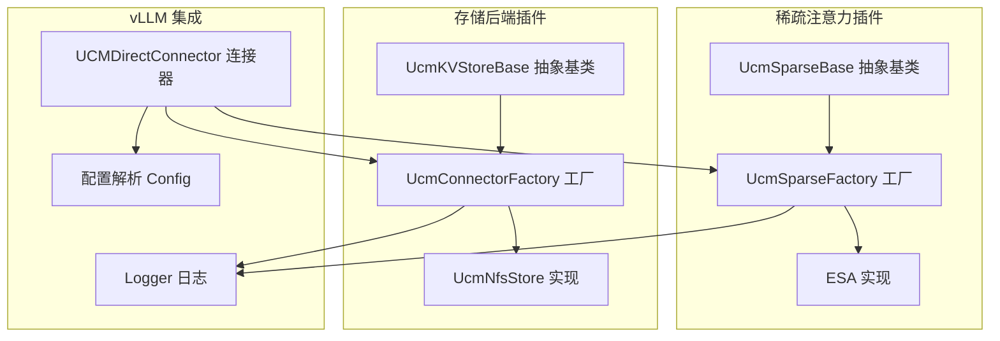
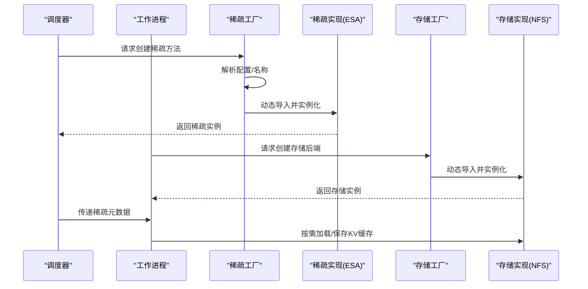
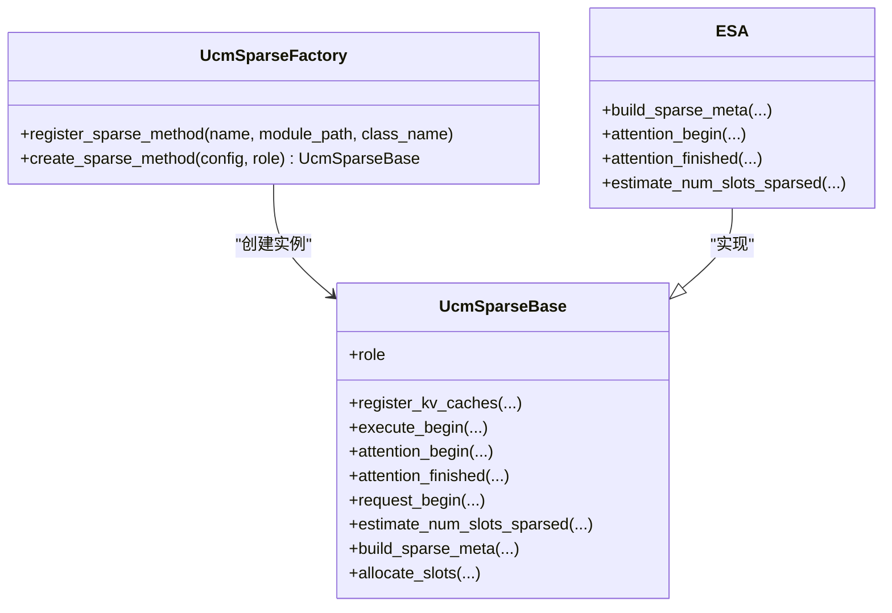
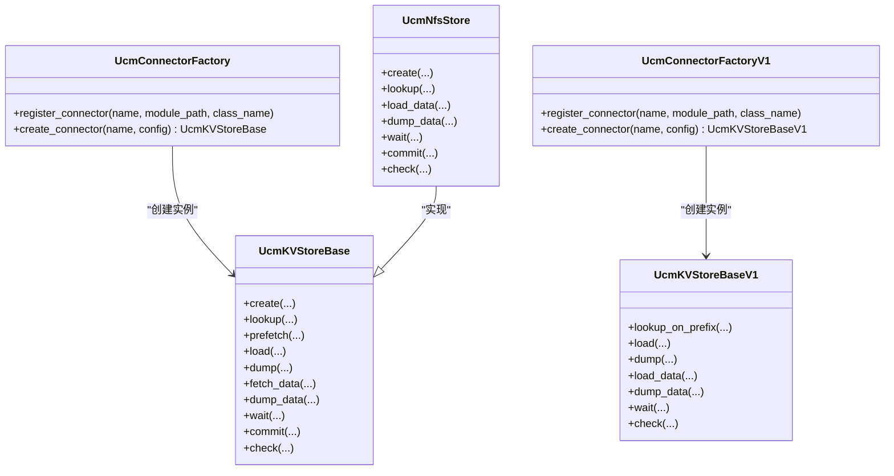
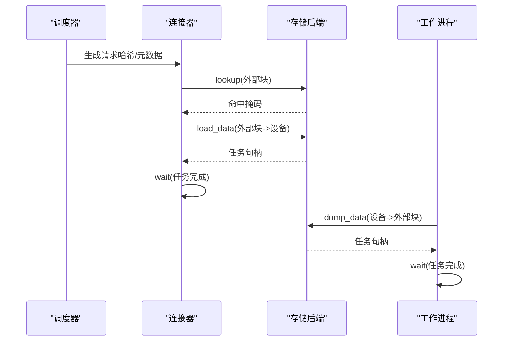
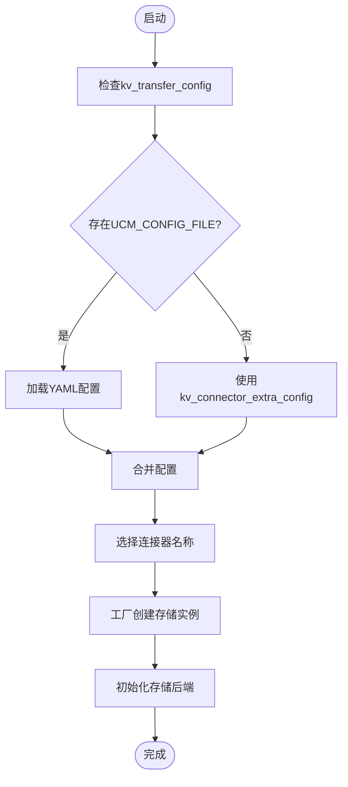
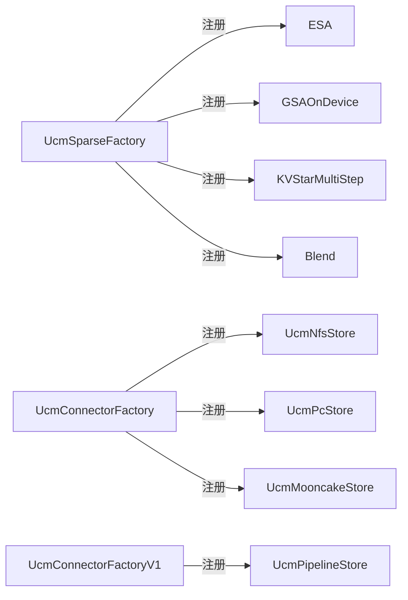
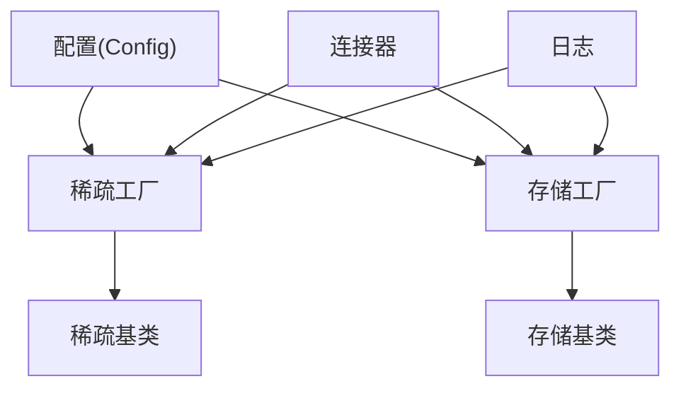

# 插件系统设计

<cite>
**本文引用的文件**
- [ucm/sparse/factory.py](file://ucm/sparse/factory.py)
- [ucm/store/factory.py](file://ucm/store/factory.py)
- [ucm/store/factory_v1.py](file://ucm/store/factory_v1.py)
- [ucm/sparse/base.py](file://ucm/sparse/base.py)
- [ucm/store/ucmstore.py](file://ucm/store/ucmstore.py)
- [ucm/store/ucmstore_v1.py](file://ucm/store/ucmstore_v1.py)
- [ucm/utils.py](file://ucm/utils.py)
- [ucm/integration/vllm/ucm_connector.py](file://ucm/integration/vllm/ucm_connector.py)
- [ucm/sparse/state.py](file://ucm/sparse/state.py)
- [ucm/store/nfsstore/nfsstore_connector.py](file://ucm/store/nfsstore/nfsstore_connector.py)
- [ucm/sparse/esa/esa.py](file://ucm/sparse/esa/esa.py)
- [ucm/logger.py](file://ucm/logger.py)
- [examples/ucm_config_example.yaml](file://examples/ucm_config_example.yaml)
- [ucm/store/pipeline/cpy/library_loader.h](file://ucm/store/pipeline/cpy/library_loader.h)
</cite>

## 目录
1. [引言](#引言)
2. [项目结构](#项目结构)
3. [核心组件](#核心组件)
4. [架构总览](#架构总览)
5. [详细组件分析](#详细组件分析)
6. [依赖关系分析](#依赖关系分析)
7. [性能考量](#性能考量)
8. [故障排查指南](#故障排查指南)
9. [结论](#结论)
10. [附录](#附录)

## 引言
本文件面向UCM（统一缓存管理）插件系统的设计与实现，围绕“工厂模式 + 动态加载”的架构理念，系统阐述插件系统的扩展点识别、注册与发现机制、配置与依赖注入、插件间协作与通信协议，并给出插件开发最佳实践、测试策略与调试方法。目标是帮助开发者在不修改核心框架的前提下，快速扩展存储后端、稀疏注意力算法与传输层能力。

## 项目结构
UCM插件系统主要分布在以下模块：
- 稀疏注意力插件：定义抽象基类与工厂，按需动态加载具体算法实现
- 存储后端插件：定义KV缓存存储抽象与工厂，支持多种后端（NFS、PC、Pipeline等）
- vLLM集成：通过连接器桥接调度器与工作进程，协调数据加载/保存
- 配置与日志：集中解析外部配置，提供统一日志入口
- 示例与文档：提供配置样例与扩展指南

图示来源
- [ucm/sparse/base.py](file://ucm/sparse/base.py#L127-L323)
- [ucm/sparse/factory.py](file://ucm/sparse/factory.py#L13-L57)
- [ucm/store/ucmstore.py](file://ucm/store/ucmstore.py#L39-L205)
- [ucm/store/factory.py](file://ucm/store/factory.py#L34-L71)
- [ucm/store/nfsstore/nfsstore_connector.py](file://ucm/store/nfsstore/nfsstore_connector.py#L39-L132)
- [ucm/integration/vllm/ucm_connector.py](file://ucm/integration/vllm/ucm_connector.py#L82-L220)
- [ucm/utils.py](file://ucm/utils.py#L34-L91)
- [ucm/logger.py](file://ucm/logger.py#L40-L84)

章节来源
- [ucm/sparse/factory.py](file://ucm/sparse/factory.py#L1-L57)
- [ucm/store/factory.py](file://ucm/store/factory.py#L1-L71)
- [ucm/store/factory_v1.py](file://ucm/store/factory_v1.py#L1-L66)
- [ucm/sparse/base.py](file://ucm/sparse/base.py#L1-L323)
- [ucm/store/ucmstore.py](file://ucm/store/ucmstore.py#L1-L205)
- [ucm/store/ucmstore_v1.py](file://ucm/store/ucmstore_v1.py#L1-L202)
- [ucm/utils.py](file://ucm/utils.py#L1-L91)
- [ucm/integration/vllm/ucm_connector.py](file://ucm/integration/vllm/ucm_connector.py#L1-L800)
- [ucm/logger.py](file://ucm/logger.py#L1-L84)
- [examples/ucm_config_example.yaml](file://examples/ucm_config_example.yaml#L1-L39)

## 核心组件
- 工厂模式与动态加载
  - 稀疏注意力工厂：通过名称映射到模块路径与类名，延迟导入并实例化具体算法
  - 存储工厂：同上，支持不同存储后端的注册与创建
- 抽象基类与扩展接口
  - 稀疏注意力：定义调度器侧与工作进程侧的生命周期钩子
  - 存储后端：定义KV块的创建、查找、预取、加载/保存、等待与提交等接口
- 配置与依赖注入
  - 从vLLM的KV传输配置中读取UCM相关参数，支持YAML文件与终端输入
  - 连接器根据配置选择并初始化对应存储后端
- 日志与可观测性
  - 统一日志封装，便于追踪插件初始化与运行状态

章节来源
- [ucm/sparse/factory.py](file://ucm/sparse/factory.py#L13-L57)
- [ucm/store/factory.py](file://ucm/store/factory.py#L34-L71)
- [ucm/store/factory_v1.py](file://ucm/store/factory_v1.py#L34-L66)
- [ucm/sparse/base.py](file://ucm/sparse/base.py#L127-L323)
- [ucm/store/ucmstore.py](file://ucm/store/ucmstore.py#L39-L205)
- [ucm/store/ucmstore_v1.py](file://ucm/store/ucmstore_v1.py#L41-L202)
- [ucm/utils.py](file://ucm/utils.py#L34-L91)
- [ucm/logger.py](file://ucm/logger.py#L40-L84)

## 架构总览
UCM插件系统采用“抽象接口 + 工厂注册 + 动态加载”的分层架构：
- 接口层：稀疏注意力与存储后端分别定义稳定的抽象接口
- 工厂层：集中注册与创建插件实例，屏蔽具体实现差异
- 集成层：vLLM连接器负责在调度器与工作进程之间传递元数据与控制流
- 配置层：统一解析外部配置，驱动插件选择与初始化

图示来源
- [ucm/sparse/factory.py](file://ucm/sparse/factory.py#L30-L44)
- [ucm/store/factory.py](file://ucm/store/factory.py#L49-L57)
- [ucm/integration/vllm/ucm_connector.py](file://ucm/integration/vllm/ucm_connector.py#L125-L220)
- [ucm/sparse/esa/esa.py](file://ucm/sparse/esa/esa.py#L421-L490)

## 详细组件分析

### 稀疏注意力插件体系
- 设计要点
  - 使用工厂注册具体算法（如ESA、GSAOnDevice、KVStarMultiStep、Blend），通过名称与模块路径映射，避免硬编码耦合
  - 通过抽象基类约束调度器侧与工作进程侧的生命周期钩子，确保跨进程协作一致性
- 关键流程
  - 初始化：根据配置选择算法，创建实例
  - 调度期：估计槽位、更新状态、构建元数据
  - 执行期：在注意力前后插入加载/释放逻辑，必要时触发检索与异步传输

图示来源
- [ucm/sparse/base.py](file://ucm/sparse/base.py#L127-L323)
- [ucm/sparse/factory.py](file://ucm/sparse/factory.py#L13-L57)
- [ucm/sparse/esa/esa.py](file://ucm/sparse/esa/esa.py#L421-L490)

章节来源
- [ucm/sparse/base.py](file://ucm/sparse/base.py#L1-L323)
- [ucm/sparse/factory.py](file://ucm/sparse/factory.py#L1-L57)
- [ucm/sparse/esa/esa.py](file://ucm/sparse/esa/esa.py#L1-L821)

### 存储后端插件体系
- 设计要点
  - 定义统一的KV缓存传输接口，覆盖批量创建、查找、预取、加载/保存、等待与提交
  - 支持v1接口以适配更细粒度的数据指针级传输
  - 工厂负责按名称注册与创建具体存储实现
- 典型实现
  - NFS存储：基于本地或远程文件系统，提供块级分配、查找与设备间数据搬运
  - Pipeline存储：通过动态库加载机制按需创建对象，适合复杂链路或第三方库集成

图示来源
- [ucm/store/ucmstore.py](file://ucm/store/ucmstore.py#L39-L205)
- [ucm/store/ucmstore_v1.py](file://ucm/store/ucmstore_v1.py#L41-L202)
- [ucm/store/factory.py](file://ucm/store/factory.py#L34-L71)
- [ucm/store/factory_v1.py](file://ucm/store/factory_v1.py#L34-L66)
- [ucm/store/nfsstore/nfsstore_connector.py](file://ucm/store/nfsstore/nfsstore_connector.py#L39-L132)

章节来源
- [ucm/store/ucmstore.py](file://ucm/store/ucmstore.py#L1-L205)
- [ucm/store/ucmstore_v1.py](file://ucm/store/ucmstore_v1.py#L1-L202)
- [ucm/store/factory.py](file://ucm/store/factory.py#L1-L71)
- [ucm/store/factory_v1.py](file://ucm/store/factory_v1.py#L1-L66)
- [ucm/store/nfsstore/nfsstore_connector.py](file://ucm/store/nfsstore/nfsstore_connector.py#L1-L132)

### vLLM集成与连接器
- 设计要点
  - 连接器在调度器侧生成请求哈希，构建请求元数据；在工作侧根据元数据发起异步加载/保存任务
  - 支持直接与逐层两种加载/保存策略，结合指标统计与错误处理
- 关键流程
  - 注册KV缓存：计算张量基地址，确定块大小与分片策略
  - 查询命中：对未命中的外部块进行查找与预取
  - 数据搬运：使用存储后端接口执行低层数据拷贝，支持同步与异步等待
  - 错误恢复：记录加载失败的块ID，便于后续重试或降级

图示来源
- [ucm/integration/vllm/ucm_connector.py](file://ucm/integration/vllm/ucm_connector.py#L397-L644)
- [ucm/store/ucmstore.py](file://ucm/store/ucmstore.py#L104-L180)

章节来源
- [ucm/integration/vllm/ucm_connector.py](file://ucm/integration/vllm/ucm_connector.py#L1-L800)
- [ucm/store/ucmstore.py](file://ucm/store/ucmstore.py#L1-L205)

### 配置管理与依赖注入
- 配置来源
  - 优先从外部YAML文件加载；若未提供，则回退到终端传入的kv_connector_extra_config
  - 默认使用NFS存储作为连接器
- 注入方式
  - 工厂通过名称映射到模块与类，动态导入并实例化
  - 连接器在运行时根据配置创建存储后端实例

图示来源
- [ucm/utils.py](file://ucm/utils.py#L63-L91)
- [ucm/store/factory.py](file://ucm/store/factory.py#L49-L57)
- [examples/ucm_config_example.yaml](file://examples/ucm_config_example.yaml#L10-L18)

章节来源
- [ucm/utils.py](file://ucm/utils.py#L1-L91)
- [examples/ucm_config_example.yaml](file://examples/ucm_config_example.yaml#L1-L39)

### 插件注册与发现机制
- 稀疏注意力
  - 工厂静态注册已支持的算法名称与模块路径
  - 创建时依据配置选择算法并实例化
- 存储后端
  - 工厂静态注册后端名称与模块路径
  - 运行时按名称创建具体实现
- 动态库加载（Pipeline）
  - 通过动态库加载器按符号创建对象，实现跨语言/跨库插件化

图示来源
- [ucm/sparse/factory.py](file://ucm/sparse/factory.py#L47-L57)
- [ucm/store/factory.py](file://ucm/store/factory.py#L60-L71)
- [ucm/store/factory_v1.py](file://ucm/store/factory_v1.py#L60-L66)
- [ucm/store/pipeline/cpy/library_loader.h](file://ucm/store/pipeline/cpy/library_loader.h#L69-L82)

章节来源
- [ucm/sparse/factory.py](file://ucm/sparse/factory.py#L1-L57)
- [ucm/store/factory.py](file://ucm/store/factory.py#L1-L71)
- [ucm/store/factory_v1.py](file://ucm/store/factory_v1.py#L1-L66)
- [ucm/store/pipeline/cpy/library_loader.h](file://ucm/store/pipeline/cpy/library_loader.h#L1-L94)

### 插件间协作与通信协议
- 协作模式
  - 调度器侧：生成请求哈希、估计槽位、构建稀疏元数据
  - 工作进程侧：绑定元数据、在注意力前后触发加载/保存
  - 存储后端：提供异步任务接口，支持轮询与等待
- 通信协议
  - 块ID：统一使用哈希标识外部块
  - 元数据：通过连接器在进程间传递
  - 任务句柄：用于等待与查询任务状态

章节来源
- [ucm/integration/vllm/ucm_connector.py](file://ucm/integration/vllm/ucm_connector.py#L125-L220)
- [ucm/sparse/base.py](file://ucm/sparse/base.py#L145-L176)
- [ucm/store/ucmstore.py](file://ucm/store/ucmstore.py#L104-L180)

## 依赖关系分析
- 松耦合
  - 工厂与实现解耦，通过名称与模块路径映射
  - 抽象接口隔离具体实现细节
- 可观测性
  - 统一日志封装，便于问题定位
- 可扩展性
  - 新增插件仅需实现接口并注册到工厂

图示来源
- [ucm/utils.py](file://ucm/utils.py#L34-L91)
- [ucm/sparse/factory.py](file://ucm/sparse/factory.py#L30-L44)
- [ucm/store/factory.py](file://ucm/store/factory.py#L49-L57)
- [ucm/integration/vllm/ucm_connector.py](file://ucm/integration/vllm/ucm_connector.py#L125-L220)
- [ucm/logger.py](file://ucm/logger.py#L40-L84)

章节来源
- [ucm/utils.py](file://ucm/utils.py#L1-L91)
- [ucm/sparse/factory.py](file://ucm/sparse/factory.py#L1-L57)
- [ucm/store/factory.py](file://ucm/store/factory.py#L1-L71)
- [ucm/integration/vllm/ucm_connector.py](file://ucm/integration/vllm/ucm_connector.py#L1-L800)
- [ucm/logger.py](file://ucm/logger.py#L1-L84)

## 性能考量
- 异步传输与批处理
  - 存储接口提供异步任务与批量操作，减少阻塞与系统调用开销
- 分片与并行
  - 支持按层/分片传输，结合多流与缓冲区提升吞吐
- 缓存与预取
  - 在查找命中后进行预取，降低后续访问延迟
- 指标监控
  - 提供加载/保存速率、请求/块数量等指标，辅助性能优化

章节来源
- [ucm/store/ucmstore.py](file://ucm/store/ucmstore.py#L104-L180)
- [ucm/integration/vllm/ucm_connector.py](file://ucm/integration/vllm/ucm_connector.py#L545-L644)

## 故障排查指南
- 常见问题
  - 插件未注册：检查工厂注册表与名称是否一致
  - 配置缺失：确认YAML路径或终端参数是否正确
  - 设备平台不支持：连接器会检测当前平台并报错
  - 加载失败：记录无效块ID，检查存储后端可用性与权限
- 调试建议
  - 启用日志，关注插件初始化与任务状态
  - 使用指标统计定位瓶颈
  - 对比直连与分层策略的性能差异

章节来源
- [ucm/integration/vllm/ucm_connector.py](file://ucm/integration/vllm/ucm_connector.py#L105-L114)
- [ucm/integration/vllm/ucm_connector.py](file://ucm/integration/vllm/ucm_connector.py#L648-L658)
- [ucm/logger.py](file://ucm/logger.py#L40-L84)

## 结论
UCM插件系统通过工厂模式与动态加载实现了高度可扩展的稀疏注意力与存储后端生态。抽象接口与统一配置驱动了跨进程协作与可观测性，配合异步传输与指标监控，能够在保证性能的同时快速迭代新能力。遵循本文的最佳实践与测试策略，可有效降低集成成本并提升稳定性。

## 附录
- 开发者指南
  - 新增稀疏算法：实现抽象基类并注册到工厂
  - 新增存储后端：实现存储接口并注册到工厂
  - 使用动态库：参考Pipeline加载器实现跨语言插件
- 测试策略
  - 单元测试：针对工厂注册、接口实现与连接器流程
  - 集成测试：端到端验证调度/工作进程协作与存储后端交互
  - 压力测试：评估异步传输与批处理在高并发下的表现

章节来源
- [ucm/sparse/factory.py](file://ucm/sparse/factory.py#L47-L57)
- [ucm/store/factory.py](file://ucm/store/factory.py#L60-L71)
- [ucm/store/pipeline/cpy/library_loader.h](file://ucm/store/pipeline/cpy/library_loader.h#L69-L82)