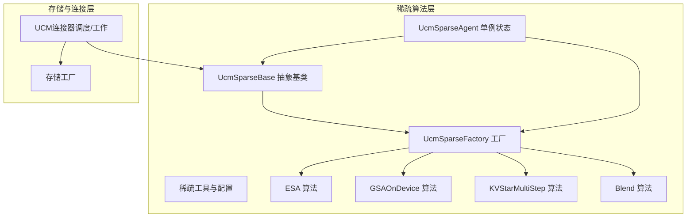
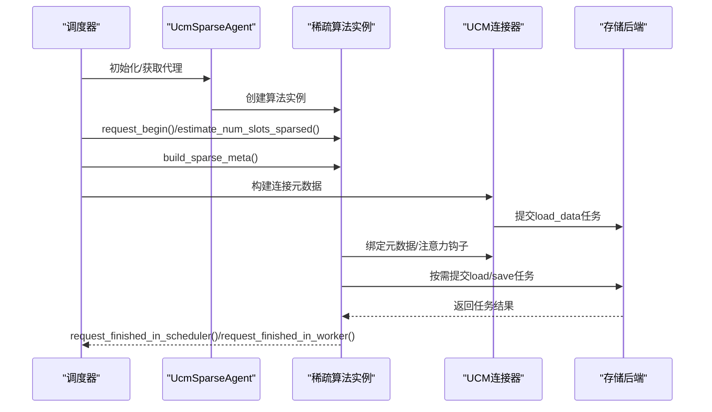
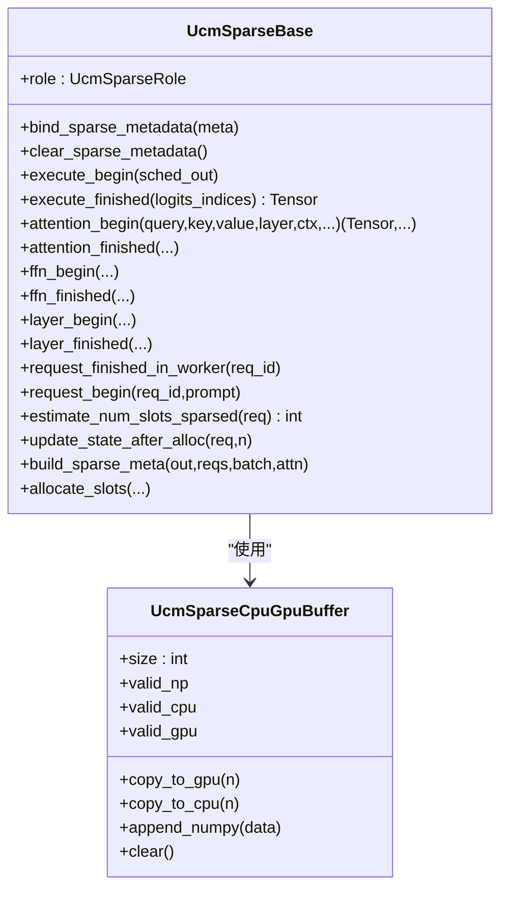
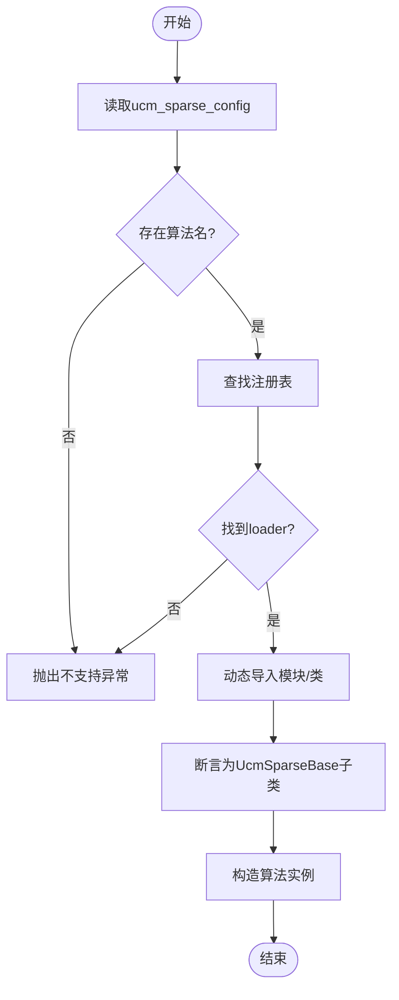
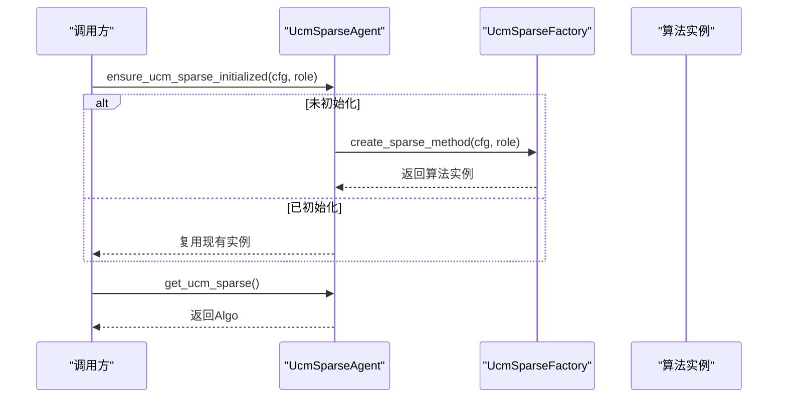
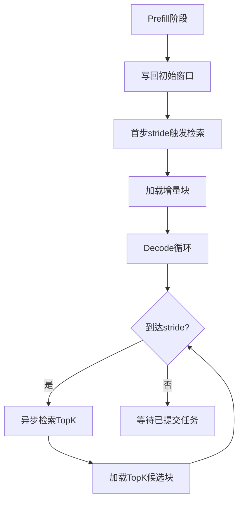
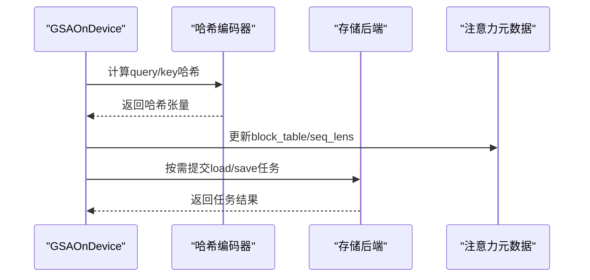
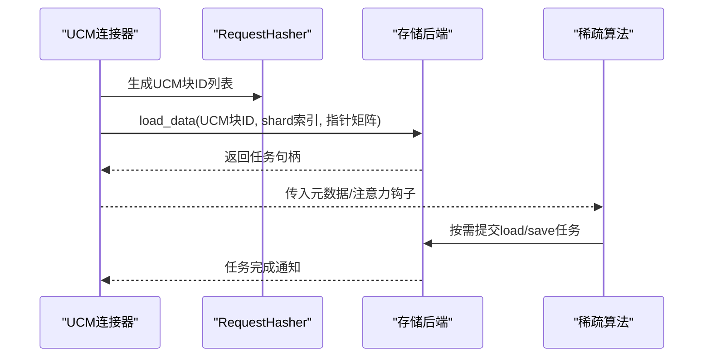
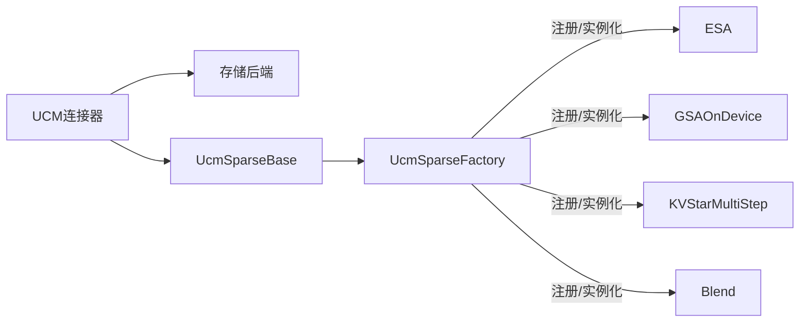

# 稀疏算法扩展

<cite>
**本文引用的文件**
- [ucm/sparse/base.py](file://ucm/sparse/base.py)
- [ucm/sparse/factory.py](file://ucm/sparse/factory.py)
- [ucm/sparse/state.py](file://ucm/sparse/state.py)
- [ucm/sparse/utils.py](file://ucm/sparse/utils.py)
- [ucm/sparse/esa/esa.py](file://ucm/sparse/esa/esa.py)
- [ucm/sparse/gsa_on_device/gsa_on_device.py](file://ucm/sparse/gsa_on_device/gsa_on_device.py)
- [ucm/sparse/kvstar/multistep.py](file://ucm/sparse/kvstar/multistep.py)
- [ucm/sparse/blend/blend.py](file://ucm/sparse/blend/blend.py)
- [ucm/store/factory.py](file://ucm/store/factory.py)
- [ucm/integration/vllm/ucm_connector.py](file://ucm/integration/vllm/ucm_connector.py)
- [ucm/utils.py](file://ucm/utils.py)
- [test/suites/E2E/test_offline_inference_sparse.py](file://test/suites/E2E/test_offline_inference_sparse.py)
- [examples/offline_inference_blend.py](file://examples/offline_inference_blend.py)
- [examples/offline_inference_esa.py](file://examples/offline_inference_esa.py)
</cite>

## 目录
1. [简介](#简介)
2. [项目结构](#项目结构)
3. [核心组件](#核心组件)
4. [架构总览](#架构总览)
5. [详细组件分析](#详细组件分析)
6. [依赖关系分析](#依赖关系分析)
7. [性能考虑](#性能考虑)
8. [故障排查指南](#故障排查指南)
9. [结论](#结论)
10. [附录](#附录)

## 简介
本指南面向希望在UCM（统一缓存管理）框架下扩展稀疏注意力算法的开发者，系统讲解如何继承稀疏算法基类、实现核心计算逻辑与接口规范，如何使用工厂模式进行算法注册与动态加载，如何管理稀疏算法状态与配置，以及如何与存储系统集成以实现高效的数据流转与性能优化。文档同时提供从基础模板到高性能实现的完整实践路径，并给出测试与基准测试方法。

## 项目结构
UCM稀疏注意力扩展位于ucm/sparse目录，包含抽象基类、工厂、状态管理、通用工具，以及多种具体算法实现（ESA、GSAOnDevice、KVStarMultiStep、Blend）。与存储系统的集成通过ucm/integration/vllm中的连接器完成，存储工厂位于ucm/store。

图表来源
- [ucm/sparse/base.py](file://ucm/sparse/base.py#L127-L323)
- [ucm/sparse/factory.py](file://ucm/sparse/factory.py#L13-L57)
- [ucm/sparse/state.py](file://ucm/sparse/state.py#L23-L76)
- [ucm/sparse/utils.py](file://ucm/sparse/utils.py#L1-L65)
- [ucm/sparse/esa/esa.py](file://ucm/sparse/esa/esa.py#L421-L821)
- [ucm/sparse/gsa_on_device/gsa_on_device.py](file://ucm/sparse/gsa_on_device/gsa_on_device.py#L99-L964)
- [ucm/sparse/kvstar/multistep.py](file://ucm/sparse/kvstar/multistep.py#L645-L937)
- [ucm/sparse/blend/blend.py](file://ucm/sparse/blend/blend.py#L149-L384)
- [ucm/integration/vllm/ucm_connector.py](file://ucm/integration/vllm/ucm_connector.py#L82-L1080)
- [ucm/store/factory.py](file://ucm/store/factory.py#L34-L71)

章节来源
- [ucm/sparse/base.py](file://ucm/sparse/base.py#L1-L323)
- [ucm/sparse/factory.py](file://ucm/sparse/factory.py#L1-L57)
- [ucm/sparse/state.py](file://ucm/sparse/state.py#L1-L110)
- [ucm/sparse/utils.py](file://ucm/sparse/utils.py#L1-L65)
- [ucm/integration/vllm/ucm_connector.py](file://ucm/integration/vllm/ucm_connector.py#L1-L1080)
- [ucm/store/factory.py](file://ucm/store/factory.py#L1-L71)

## 核心组件
- 抽象基类UcmSparseBase：定义稀疏注意力算法在调度端与工作端的生命周期钩子、元数据绑定、请求处理等接口规范。
- 工厂UcmSparseFactory：支持按名称延迟加载算法类，实现算法注册与动态实例化。
- 状态管理UcmSparseAgent：全局单例代理，负责初始化、获取与调用稀疏算法实例。
- 通用工具与配置：提供块大小、TopK参数、内存对齐等通用配置与工具函数。
- 具体算法实现：ESA、GSAOnDevice、KVStarMultiStep、Blend，覆盖不同场景下的稀疏策略。

章节来源
- [ucm/sparse/base.py](file://ucm/sparse/base.py#L127-L323)
- [ucm/sparse/factory.py](file://ucm/sparse/factory.py#L13-L57)
- [ucm/sparse/state.py](file://ucm/sparse/state.py#L23-L76)
- [ucm/sparse/utils.py](file://ucm/sparse/utils.py#L18-L65)

## 架构总览
UCM稀疏注意力的运行时流程如下：
- 初始化阶段：根据配置选择稀疏算法，通过工厂创建实例并注入到全局代理。
- 调度阶段：算法参与请求估算、分配槽位、构建元数据。
- 执行阶段：在注意力前后插入钩子，按需触发检索/加载/保存KV缓存。
- 存储交互：连接器将请求映射为UCM块ID，与存储后端进行异步任务提交与等待。

图表来源
- [ucm/sparse/state.py](file://ucm/sparse/state.py#L27-L69)
- [ucm/sparse/factory.py](file://ucm/sparse/factory.py#L30-L44)
- [ucm/integration/vllm/ucm_connector.py](file://ucm/integration/vllm/ucm_connector.py#L397-L447)
- [ucm/sparse/esa/esa.py](file://ucm/sparse/esa/esa.py#L648-L731)

## 详细组件分析

### 抽象基类与接口规范
- 角色与元数据：定义UcmSparseRole（调度/工作）与UcmSparseMetadata抽象类型，用于在调度与工作进程间传递元信息。
- 生命周期钩子：
  - 调度端：request_begin、estimate_num_slots_sparsed、update_state_after_alloc、build_sparse_meta、allocate_slots、request_finished_in_scheduler。
  - 工作端：bind_sparse_metadata、execute_begin/finished、attention_begin/finished、ffn_begin/finished、layer_begin/finished、request_finished_in_worker。
- 通用缓冲：UcmSparseCpuGpuBuffer提供CPU/GPU张量互拷贝与numpy视图封装，便于跨设备传输。

图表来源
- [ucm/sparse/base.py](file://ucm/sparse/base.py#L127-L323)

章节来源
- [ucm/sparse/base.py](file://ucm/sparse/base.py#L39-L126)
- [ucm/sparse/base.py](file://ucm/sparse/base.py#L127-L323)

### 工厂模式与动态加载
- 注册机制：UcmSparseFactory通过register_sparse_method按名称注册算法模块与类名，采用延迟导入避免启动时全量加载。
- 实例化：create_sparse_method从配置中解析ucm_sparse_config，选择首个键作为算法名，动态导入类并构造实例。
- 默认注册：内置注册ESA、GSAOnDevice、KVStarMultiStep、Blend等算法。

图表来源
- [ucm/sparse/factory.py](file://ucm/sparse/factory.py#L30-L44)

章节来源
- [ucm/sparse/factory.py](file://ucm/sparse/factory.py#L13-L57)

### 状态管理与单例代理
- 全局代理：ensure_ucm_sparse_initialized在首次调用时创建算法实例，后续复用；get_ucm_sparse提供安全访问。
- 便捷执行：maybe_execute_sparse_*系列函数在启用稀疏时透明调用算法层钩子，未启用时直接返回输入。
- 配置入口：从vllm_config.kv_transfer_config读取ucm_sparse_config决定是否启用稀疏。

图表来源
- [ucm/sparse/state.py](file://ucm/sparse/state.py#L27-L69)

章节来源
- [ucm/sparse/state.py](file://ucm/sparse/state.py#L23-L110)

### 通用工具与配置
- GSAConfig：维护块大小、窗口大小、TopK范围、预取块数等参数，并提供随块大小缩放的配置更新。
- 对齐与对齐：提供张量元素大小查询与按256字节对齐的实用函数，辅助内存布局优化。
- 默认阈值：定义默认块大小、TopK上下界、最大批大小、分段预填充阈值等常量。

章节来源
- [ucm/sparse/utils.py](file://ucm/sparse/utils.py#L18-L65)

### ESA（增强稀疏适配）
- 请求与元数据：ReqMeta记录请求的块ID、查询起始位置、输出长度、是否抢占等；ESASparseMetaData聚合批次级元数据。
- 层内状态：ReqStatePerLayer管理每请求每层的块表示、窗口、检索任务与传输任务，支持MLA与非MLA两种模式。
- 检索与传输：通过RetrievalWorker与存储后端异步检索TopK候选块，按需发起load任务并等待完成。
- 注意力钩子：在attention_begin/finished中按stride周期性触发检索与加载，结合初始/局部窗口确保稳定性。
- 分配与估算：estimate_num_slots_sparsed根据窗口与稀疏比例估算压缩后的序列长度，用于块分配。

图表来源
- [ucm/sparse/esa/esa.py](file://ucm/sparse/esa/esa.py#L364-L418)
- [ucm/sparse/esa/esa.py](file://ucm/sparse/esa/esa.py#L516-L606)

章节来源
- [ucm/sparse/esa/esa.py](file://ucm/sparse/esa/esa.py#L55-L123)
- [ucm/sparse/esa/esa.py](file://ucm/sparse/esa/esa.py#L169-L420)
- [ucm/sparse/esa/esa.py](file://ucm/sparse/esa/esa.py#L421-L821)

### GSAOnDevice（设备侧哈希TopK）
- 设备检测与配置：自动识别CUDA/NPU设备，按模型名定位配置文件，校验seq_len阈值与块大小整除关系。
- 哈希编码：在MLA/GQA模式下分别使用nope+rope或query进行哈希编码，生成紧凑的哈希缓存。
- TopK检索：在decode阶段按stride计算TopK块表，支持跳层与回滚层策略，更新注意力元数据以减少实际计算。
- 缓冲与对齐：使用UcmSparseCpuGpuBuffer在CPU/GPU间高效搬运数据，配合设备流同步保证正确性。

图表来源
- [ucm/sparse/gsa_on_device/gsa_on_device.py](file://ucm/sparse/gsa_on_device/gsa_on_device.py#L557-L623)
- [ucm/sparse/gsa_on_device/gsa_on_device.py](file://ucm/sparse/gsa_on_device/gsa_on_device.py#L665-L684)

章节来源
- [ucm/sparse/gsa_on_device/gsa_on_device.py](file://ucm/sparse/gsa_on_device/gsa_on_device.py#L99-L964)

### KVStarMultiStep（多步长KV星检索）
- 请求阶段：区分Prefill与Decode，按stride组织查询组，支持分段预填充离线查询卸载。
- 块表示：提取块级表示并裁剪维度，按稀疏比例选择候选块，异步检索TopK并加载至KV缓存。
- 窗口管理：维护初始窗口与局部窗口，确保边界稳定；支持MLA模式下的特殊处理。
- 传输协调：通过Task等待机制串行化块传输，避免竞争与越界。

章节来源
- [ucm/sparse/kvstar/multistep.py](file://ucm/sparse/kvstar/multistep.py#L184-L644)
- [ucm/sparse/kvstar/multistep.py](file://ucm/sparse/kvstar/multistep.py#L645-L937)

### Blend（缓存融合）
- 请求元数据：记录前缀、块组、后缀长度与命中掩码，计算需要重索引的token区间。
- TopK选择：对命中块对应的golden K与当前查询K计算偏差，选取TopK进行实际计算，其余标记为重算。
- 元数据更新：按需裁剪slot_mapping、重算query_start_loc与max_query_len，减少注意力计算量。
- FFN/Layer/Execute后处理：在FFN与层间按需重索引隐藏态与位置向量，最终修正logits索引。

章节来源
- [ucm/sparse/blend/blend.py](file://ucm/sparse/blend/blend.py#L149-L384)

### 与存储系统的集成
- 连接器职责：将请求映射为UCM块ID，生成加载/保存任务，协调异步等待与错误处理。
- 哈希策略：RequestHasher基于模型、并行规模、数据类型与rank生成稳定哈希，支持MLA/DFA场景。
- 层间/直接模式：支持逐层加载/保存（LayerWise）与整体加载/保存（Direct），并行度与延迟权衡。
- 任务提交：根据KV缓存指针与层偏移生成任务，提交给存储后端并统计吞吐指标。

图表来源
- [ucm/integration/vllm/ucm_connector.py](file://ucm/integration/vllm/ucm_connector.py#L167-L185)
- [ucm/integration/vllm/ucm_connector.py](file://ucm/integration/vllm/ucm_connector.py#L397-L447)
- [ucm/integration/vllm/ucm_connector.py](file://ucm/integration/vllm/ucm_connector.py#L488-L544)

章节来源
- [ucm/integration/vllm/ucm_connector.py](file://ucm/integration/vllm/ucm_connector.py#L65-L80)
- [ucm/integration/vllm/ucm_connector.py](file://ucm/integration/vllm/ucm_connector.py#L187-L221)
- [ucm/integration/vllm/ucm_connector.py](file://ucm/integration/vllm/ucm_connector.py#L488-L644)

## 依赖关系分析
- 算法依赖：各算法均继承UcmSparseBase，通过UcmSparseFactory注册与实例化；部分算法依赖存储后端（如ESA、KVStar）与连接器（如GSAOnDevice）。
- 存储工厂：UcmConnectorFactory支持按名称注册存储连接器，统一创建与管理。
- 配置解析：Config类从KVTransferConfig中提取ucm_sparse_config，兼容外部YAML与终端输入。

图表来源
- [ucm/sparse/factory.py](file://ucm/sparse/factory.py#L48-L57)
- [ucm/store/factory.py](file://ucm/store/factory.py#L34-L71)
- [ucm/integration/vllm/ucm_connector.py](file://ucm/integration/vllm/ucm_connector.py#L82-L1080)

章节来源
- [ucm/sparse/factory.py](file://ucm/sparse/factory.py#L13-L57)
- [ucm/store/factory.py](file://ucm/store/factory.py#L34-L71)
- [ucm/utils.py](file://ucm/utils.py#L34-L91)

## 性能考虑
- 异步传输：通过任务队列与等待机制，最大化I/O与计算重叠，降低解码延迟。
- 块粒度与对齐：合理设置块大小与内存对齐，减少碎片与带宽浪费。
- TopK策略：根据序列长度与模型特性动态调整TopK范围，平衡准确率与吞吐。
- 设备侧加速：GSAOnDevice在CUDA/NPU上利用哈希与TopK核，减少主机端开销。
- 窗口与stride：初始/局部窗口与检索stride控制稀疏范围，避免频繁重算与越界。

## 故障排查指南
- 算法未生效：检查ucm_sparse_config是否正确传入，确认UcmSparseAgent已初始化。
- 加载失败：查看连接器的无效块ID集合与错误日志，定位存储后端异常。
- 设备不匹配：确认设备类型与对应算子可用性（CUDA/NPU），检查哈希编码器与TopK核的设备一致性。
- 性能退化：核查块大小、TopK范围、stride设置，评估是否需要调整GSAConfig或算法参数。

章节来源
- [ucm/sparse/state.py](file://ucm/sparse/state.py#L62-L76)
- [ucm/integration/vllm/ucm_connector.py](file://ucm/integration/vllm/ucm_connector.py#L522-L544)
- [ucm/sparse/gsa_on_device/gsa_on_device.py](file://ucm/sparse/gsa_on_device/gsa_on_device.py#L106-L116)

## 结论
UCM稀疏注意力扩展通过清晰的抽象基类、灵活的工厂模式与全局状态代理，实现了可插拔的稀疏算法体系。结合连接器与存储后端的异步任务机制，能够在不同硬件平台与模型架构下实现高效的KV缓存检索与计算优化。开发者可基于UcmSparseBase快速实现新算法，并通过工厂与配置系统无缝接入现有推理流水线。

## 附录

### 开发步骤清单
- 继承UcmSparseBase并实现必要钩子（调度端/工作端）。
- 在UcmSparseFactory中注册算法名称与模块路径。
- 在配置中添加ucm_sparse_config，确保工厂可解析。
- 在连接器侧验证块ID生成与任务提交逻辑。
- 编写单元/集成测试，覆盖正常路径与异常路径。

章节来源
- [ucm/sparse/base.py](file://ucm/sparse/base.py#L287-L323)
- [ucm/sparse/factory.py](file://ucm/sparse/factory.py#L16-L29)
- [ucm/utils.py](file://ucm/utils.py#L63-L91)
- [ucm/integration/vllm/ucm_connector.py](file://ucm/integration/vllm/ucm_connector.py#L167-L185)

### 示例与基准测试
- 端到端测试：参考test_offline_inference_sparse.py中对ESA/GSA的测试用例，了解如何配置ucm_sparse_config并运行推理。
- 示例脚本：offline_inference_blend.py与offline_inference_esa.py展示了如何在vLLM中启用缓存融合与ESA稀疏策略。

章节来源
- [test/suites/E2E/test_offline_inference_sparse.py](file://test/suites/E2E/test_offline_inference_sparse.py#L382-L430)
- [examples/offline_inference_blend.py](file://examples/offline_inference_blend.py#L88-L135)
- [examples/offline_inference_esa.py](file://examples/offline_inference_esa.py#L63-L111)