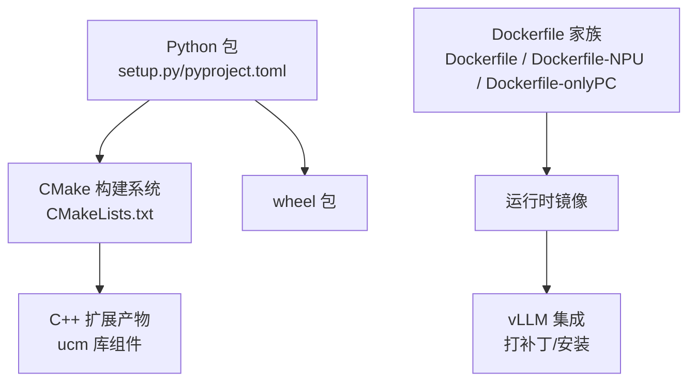
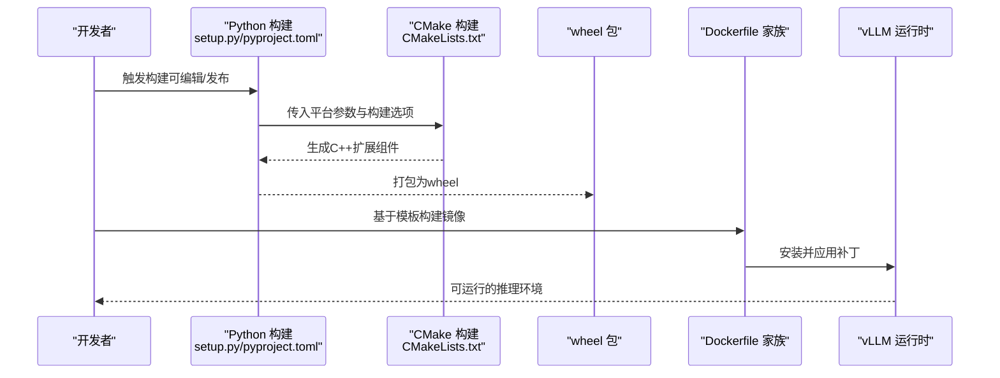
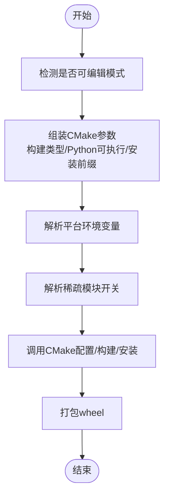
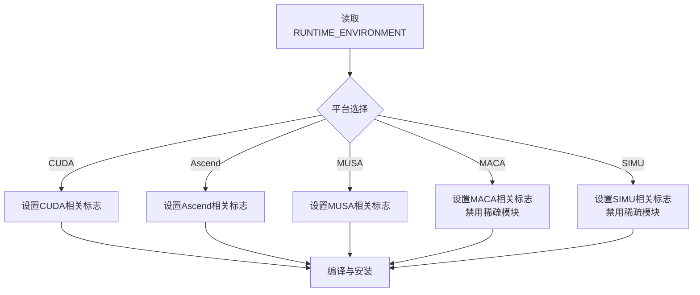
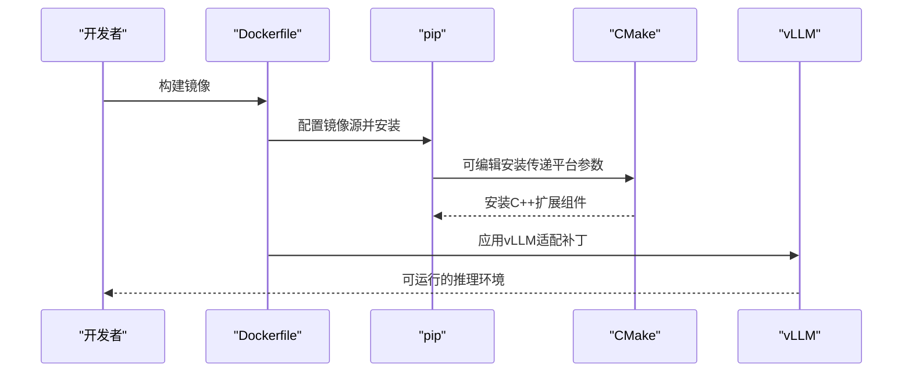
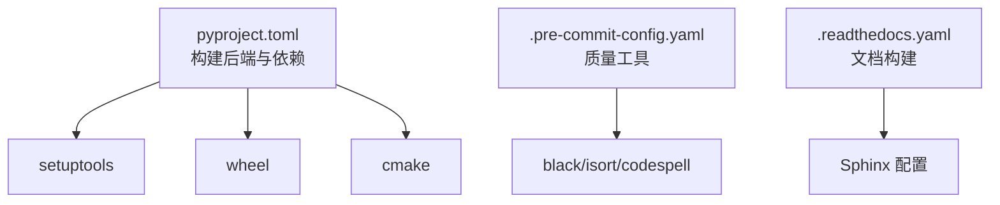

# 构建与发布

<cite>
**本文引用的文件**
- [setup.py](file://setup.py)
- [pyproject.toml](file://pyproject.toml)
- [CMakeLists.txt](file://CMakeLists.txt)
- [Dockerfile](file://docker/Dockerfile)
- [Dockerfile-NPU](file://docker/Dockerfile-NPU)
- [Dockerfile-onlyPC](file://docker/Dockerfile-onlyPC)
- [.pre-commit-config.yaml](file://.pre-commit-config.yaml)
- [requirements-lint.txt](file://requirements-lint.txt)
- [format.sh](file://format.sh)
- [.readthedocs.yaml](file://.readthedocs.yaml)
</cite>

## 目录
1. [简介](#简介)
2. [项目结构](#项目结构)
3. [核心组件](#核心组件)
4. [架构总览](#架构总览)
5. [详细组件分析](#详细组件分析)
6. [依赖关系分析](#依赖关系分析)
7. [性能考量](#性能考量)
8. [故障排查指南](#故障排查指南)
9. [结论](#结论)
10. [附录](#附录)

## 简介
本指南面向UCM项目的构建与发布流程，覆盖以下方面：
- Python包构建：基于setuptools与CMake扩展的wheel打包、版本管理与可编辑安装
- C++库构建：CMake配置、平台选择（CUDA/Ascend/MUSA/MACA/SIMU）、交叉编译与多平台支持
- Docker镜像：多阶段与多入口镜像构建、优化策略与运行时环境准备
- 持续集成与自动化发布：CI/CD建议、版本标签规范与发布流程
- 质量检查与验证：发布前清单、验证步骤
- 发布后监控与回滚：观测指标与回退策略
- 依赖管理与版本兼容：Python与CMake依赖、第三方工具链

## 项目结构
UCM采用“Python包 + CMake C++扩展”的混合构建体系：
- Python侧通过setup.py与pyproject.toml定义元数据、构建后端与动态字段
- CMake负责C++子模块的编译、链接与安装，由Python扩展命令驱动
- Dockerfile提供不同硬件平台的镜像构建脚本
- 预提交钩子与格式化脚本保障代码质量

图表来源
- [setup.py](file://setup.py#L140-L153)
- [pyproject.toml](file://pyproject.toml#L1-L22)
- [CMakeLists.txt](file://CMakeLists.txt#L1-L40)
- [Dockerfile](file://docker/Dockerfile#L1-L20)
- [Dockerfile-NPU](file://docker/Dockerfile-NPU#L1-L25)
- [Dockerfile-onlyPC](file://docker/Dockerfile-onlyPC#L1-L16)

章节来源
- [setup.py](file://setup.py#L140-L153)
- [pyproject.toml](file://pyproject.toml#L1-L22)
- [CMakeLists.txt](file://CMakeLists.txt#L1-L40)
- [Dockerfile](file://docker/Dockerfile#L1-L20)
- [Dockerfile-NPU](file://docker/Dockerfile-NPU#L1-L25)
- [Dockerfile-onlyPC](file://docker/Dockerfile-onlyPC#L1-L16)

## 核心组件
- Python构建与打包
  - 使用setuptools构建扩展模块，CMake扩展类驱动C++编译与安装
  - 支持可编辑安装模式，便于开发调试
  - 动态版本与依赖声明，通过pyproject.toml集中管理
- CMake构建系统
  - 统一C++标准与编译选项，启用安全强化标志
  - 通过RUNTIME_ENVIRONMENT选择目标平台（SIMU/CUDA/Ascend/MUSA/MACA）
  - 可选构建稀疏模块与单元测试
- Docker镜像
  - 提供CUDA/NPU/仅PC三种场景的镜像模板
  - 在容器内执行可编辑安装并应用vLLM适配补丁
- 质量与文档
  - 预提交钩子与格式化脚本，保障一致性
  - Read the Docs配置用于文档构建

章节来源
- [setup.py](file://setup.py#L83-L153)
- [pyproject.toml](file://pyproject.toml#L1-L22)
- [CMakeLists.txt](file://CMakeLists.txt#L1-L40)
- [Dockerfile](file://docker/Dockerfile#L1-L20)
- [Dockerfile-NPU](file://docker/Dockerfile-NPU#L1-L25)
- [Dockerfile-onlyPC](file://docker/Dockerfile-onlyPC#L1-L16)
- [.pre-commit-config.yaml](file://.pre-commit-config.yaml#L1-L29)
- [format.sh](file://format.sh#L1-L26)
- [.readthedocs.yaml](file://.readthedocs.yaml#L1-L23)

## 架构总览
下图展示从源码到可分发包与运行时镜像的关键路径。

图表来源
- [setup.py](file://setup.py#L89-L138)
- [pyproject.toml](file://pyproject.toml#L1-L22)
- [CMakeLists.txt](file://CMakeLists.txt#L1-L40)
- [Dockerfile](file://docker/Dockerfile#L1-L20)
- [Dockerfile-NPU](file://docker/Dockerfile-NPU#L1-L25)
- [Dockerfile-onlyPC](file://docker/Dockerfile-onlyPC#L1-L16)

## 详细组件分析

### Python包构建与wheel打包
- 关键点
  - CMake扩展类在构建阶段调用CMake，设置构建类型、Python可执行路径与安装前缀
  - 可编辑模式下，安装目录指向源码目录，便于本地迭代
  - 平台选择通过环境变量控制，未设置时输出警告提示
  - 支持稀疏模块开关，按需启用
- 版本管理
  - Python侧版本在setup.py中固定；CMake侧版本在根CMakeLists中定义
  - 建议保持两者一致或通过CI统一注入
- 依赖与后端
  - 构建后端为setuptools.build_meta，要求cmake与wheel
  - 动态依赖列表由pyproject.toml集中声明

图表来源
- [setup.py](file://setup.py#L89-L138)

章节来源
- [setup.py](file://setup.py#L83-L153)
- [pyproject.toml](file://pyproject.toml#L1-L22)

### CMake构建系统与多平台支持
- 关键点
  - 统一C++17标准与编译器标志，Debug/Release差异化
  - RUNTIME_ENVIRONMENT决定目标平台，SIMU/CUDA/Ascend/MUSA/MACA
  - 可选构建稀疏模块与单元测试
  - 导出编译命令以便IDE/工具链使用
- 交叉编译与多平台
  - 通过RUNTIME_ENVIRONMENT切换平台，结合各平台CMake工具链文件实现交叉编译
  - MACA平台默认关闭稀疏模块，SIMU平台默认关闭稀疏模块
- 安全与优化
  - 启用FORTIFY_SOURCE等安全强化
  - Release使用-O3优化与链接加固

图表来源
- [CMakeLists.txt](file://CMakeLists.txt#L14-L31)

章节来源
- [CMakeLists.txt](file://CMakeLists.txt#L1-L40)

### Docker镜像构建与优化
- 关键点
  - 提供CUDA、Ascend/NPU与仅PC三种Dockerfile模板
  - 在容器内执行可编辑安装，避免重复下载源码
  - 配置镜像源加速pip安装
  - 对Ascend场景设置LD_LIBRARY_PATH以加载驱动库
  - 安装后对vLLM与Ascend vLLM应用补丁
- 多阶段构建建议
  - 将编译与安装分离至独立阶段，减少最终镜像体积
  - 使用多阶段复制构建产物，仅保留必要运行时库
- 运行时优化
  - 固定基础镜像版本，确保可复现性
  - 合理设置工作目录与入口命令

图表来源
- [Dockerfile](file://docker/Dockerfile#L1-L20)
- [Dockerfile-NPU](file://docker/Dockerfile-NPU#L1-L25)
- [Dockerfile-onlyPC](file://docker/Dockerfile-onlyPC#L1-L16)

章节来源
- [Dockerfile](file://docker/Dockerfile#L1-L20)
- [Dockerfile-NPU](file://docker/Dockerfile-NPU#L1-L25)
- [Dockerfile-onlyPC](file://docker/Dockerfile-onlyPC#L1-L16)

### 持续集成与自动化发布
- 建议流程
  - 分支保护与PR检查：强制通过预提交钩子与静态检查
  - 多平台矩阵构建：分别在CUDA、Ascend、MUSA、MACA、SIMU环境下构建wheel
  - 文档构建：Read the Docs自动拉取最新分支构建文档
  - 自动发布：在标记版本后触发发布作业，上传至PyPI或制品仓库
- 版本标签规范
  - 建议采用语义化版本（如主.次.修订），并以v前缀（如v0.3.0）
  - 与Python与CMake版本保持一致，避免混淆
- 自动化要点
  - 在CI中设置PLATFORM与ENABLE_SPARSE，确保构建一致性
  - 使用缓存加速pip与CMake构建

章节来源
- [.pre-commit-config.yaml](file://.pre-commit-config.yaml#L1-L29)
- [.readthedocs.yaml](file://.readthedocs.yaml#L1-L23)
- [setup.py](file://setup.py#L140-L153)
- [CMakeLists.txt](file://CMakeLists.txt#L1-L40)

### 发布前质量检查清单
- 代码质量
  - 通过所有预提交钩子（拼写、格式、导入排序、配置校验）
  - 运行静态类型检查与shell脚本检查
- 构建验证
  - 在多种平台（CUDA/Ascend/MUSA/MACA/SIMU）上验证wheel可用
  - 验证可编辑安装与非可编辑安装均能正常加载扩展
- 集成验证
  - 在容器镜像中验证vLLM补丁应用成功
  - 端到端推理示例可运行
- 文档与元数据
  - README与文档构建无错误
  - 版本号与变更日志同步更新

章节来源
- [.pre-commit-config.yaml](file://.pre-commit-config.yaml#L1-L29)
- [requirements-lint.txt](file://requirements-lint.txt#L1-L9)
- [format.sh](file://format.sh#L1-L26)
- [.readthedocs.yaml](file://.readthedocs.yaml#L1-L23)

### 发布后监控与回滚策略
- 监控建议
  - 关注wheel安装失败率、导入异常与运行时崩溃
  - 结合观测指标（如推理延迟、内存占用）进行回归检测
- 回滚策略
  - 快速定位问题版本，回退至上一个稳定版本
  - 若为容器镜像问题，回滚至上一镜像版本并重新发布
  - 对补丁相关问题，临时移除补丁并回退到未打补丁版本

## 依赖关系分析
- Python构建后端
  - setuptools、wheel、cmake作为构建系统依赖
- 开发工具
  - pre-commit、black、isort、codespell等用于代码质量
- 文档构建
  - Read the Docs配置指定Python版本与Sphinx配置文件

图表来源
- [pyproject.toml](file://pyproject.toml#L1-L22)
- [.pre-commit-config.yaml](file://.pre-commit-config.yaml#L1-L29)
- [.readthedocs.yaml](file://.readthedocs.yaml#L1-L23)

章节来源
- [pyproject.toml](file://pyproject.toml#L1-L22)
- [.pre-commit-config.yaml](file://.pre-commit-config.yaml#L1-L29)
- [.readthedocs.yaml](file://.readthedocs.yaml#L1-L23)

## 性能考量
- 编译优化
  - Release模式启用-O3与安全强化，提升运行时性能与安全性
  - Debug模式便于调试，但不适用于生产
- 构建并发
  - CMake构建使用并行编译，缩短构建时间
- 镜像体积
  - 采用多阶段构建与最小化运行时依赖，降低镜像大小
- 依赖缓存
  - CI中缓存pip与CMake构建产物，提高重复构建效率

## 故障排查指南
- 平台未设置警告
  - 现象：构建时输出平台警告
  - 处理：在本地或CI中设置PLATFORM（cuda/ascend/musa/maca/simu）
- 可编辑安装失败
  - 现象：可编辑模式无法找到扩展
  - 处理：确认CMake已正确生成扩展并安装到构建目录
- Ascend运行时库缺失
  - 现象：导入扩展报找不到库
  - 处理：在容器中设置LD_LIBRARY_PATH指向Ascend工具链库目录
- vLLM补丁冲突
  - 现象：应用补丁时报错或运行异常
  - 处理：核对vLLM版本与补丁匹配，必要时清理并重试

章节来源
- [setup.py](file://setup.py#L41-L66)
- [setup.py](file://setup.py#L89-L138)
- [Dockerfile-NPU](file://docker/Dockerfile-NPU#L13-L15)
- [Dockerfile](file://docker/Dockerfile#L17-L18)

## 结论
本指南提供了UCM项目从源码到可分发包与运行时镜像的完整构建与发布路径。通过Python与CMake的协同、多平台支持与容器化部署，以及完善的质量与文档体系，能够高效、稳定地交付高质量版本。建议在CI中固化平台与版本参数，并建立完善的监控与回滚机制，确保线上稳定性。

## 附录
- 版本标签建议：v主.次.修订（如v0.3.0），与Python与CMake版本保持一致
- 推荐CI作业：多平台矩阵构建wheel、文档构建、预提交钩子检查
- 依赖版本锁定：在pyproject.toml与requirements中明确版本范围，避免漂移