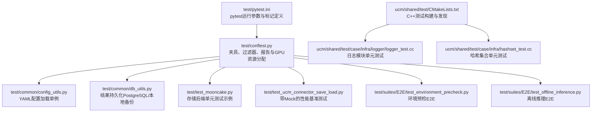
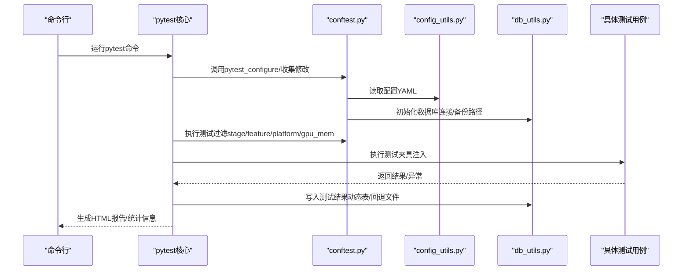
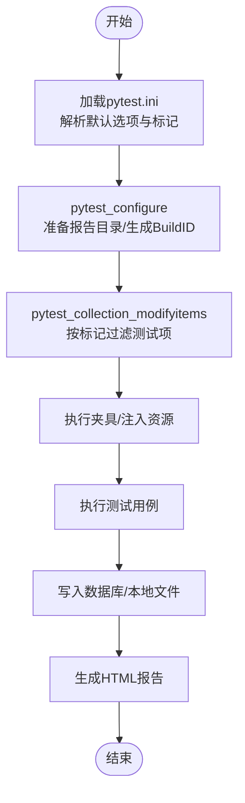
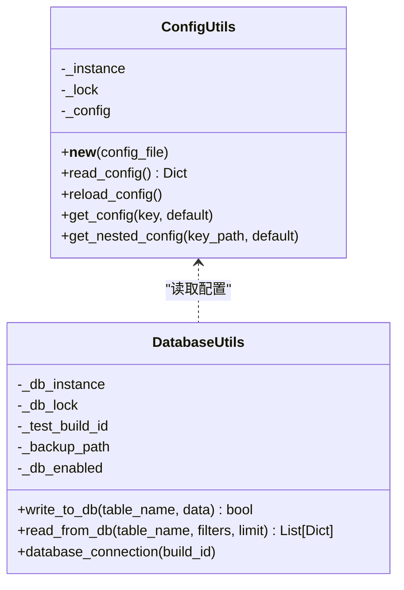
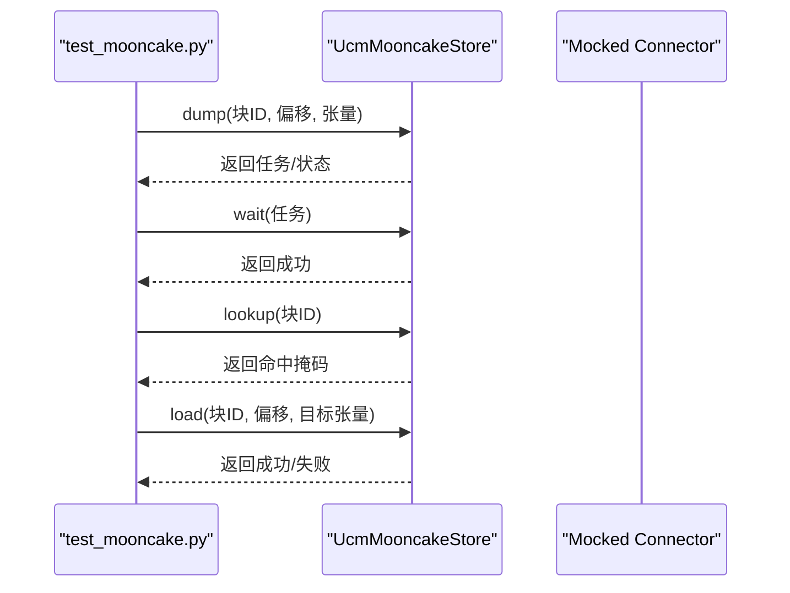
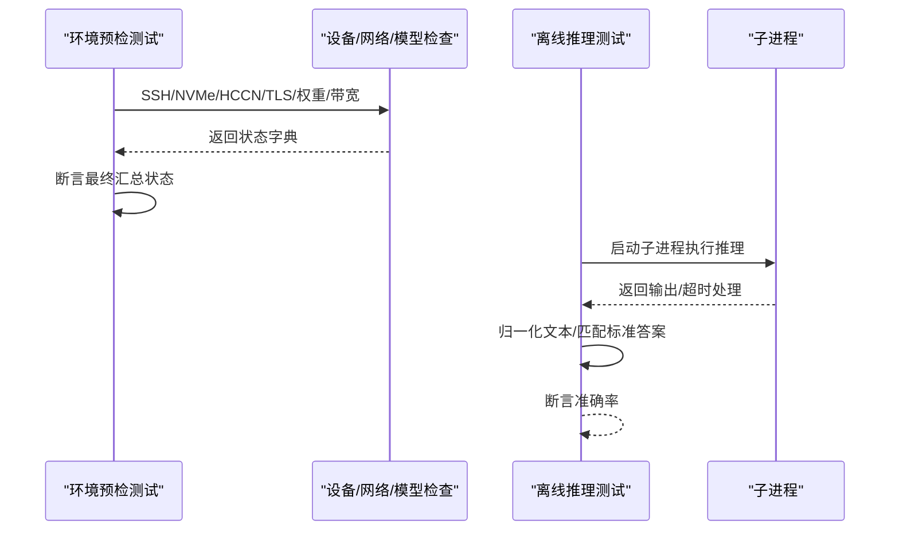
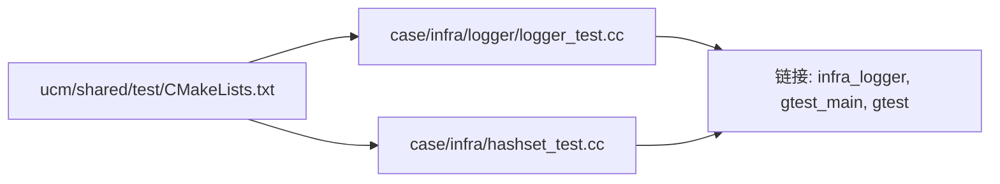
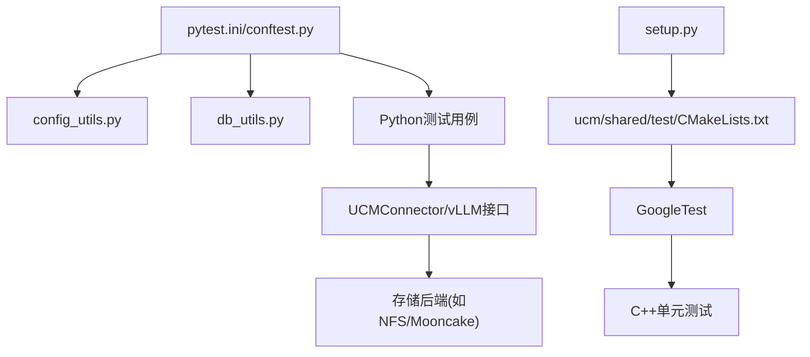

# 调试与测试

<cite>
**本文引用的文件**
- [test/README.md](file://test/README.md)
- [test/pytest.ini](file://test/pytest.ini)
- [test/conftest.py](file://test/conftest.py)
- [test/common/config_utils.py](file://test/common/config_utils.py)
- [test/common/db_utils.py](file://test/common/db_utils.py)
- [test/test_mooncake.py](file://test/test_mooncake.py)
- [test/test_ucm_connector_save_load.py](file://test/test_ucm_connector_save_load.py)
- [test/suites/E2E/test_environment_precheck.py](file://test/suites/E2E/test_environment_precheck.py)
- [test/suites/E2E/test_offline_inference.py](file://test/suites/E2E/test_offline_inference.py)
- [setup.py](file://setup.py)
- [pyproject.toml](file://pyproject.toml)
- [requirements-lint.txt](file://requirements-lint.txt)
- [ucm/shared/test/CMakeLists.txt](file://ucm/shared/test/CMakeLists.txt)
- [ucm/shared/test/case/infra/logger/logger_test.cc](file://ucm/shared/test/case/infra/logger/logger_test.cc)
- [ucm/shared/test/case/infra/hashset_test.cc](file://ucm/shared/test/case/infra/hashset_test.cc)
</cite>

## 目录
1. [简介](#简介)
2. [项目结构](#项目结构)
3. [核心组件](#核心组件)
4. [架构总览](#架构总览)
5. [详细组件分析](#详细组件分析)
6. [依赖关系分析](#依赖关系分析)
7. [性能考虑](#性能考虑)
8. [故障排除指南](#故障排除指南)
9. [结论](#结论)
10. [附录](#附录)

## 简介
本指南面向UCM项目的开发者与测试工程师，系统化地阐述如何在该仓库中开展调试与测试工作，覆盖单元测试（pytest）、集成测试与端到端测试（E2E）的组织方式、测试环境与数据准备、C++与Python代码的调试技巧、性能分析与瓶颈定位、常见问题排查以及测试覆盖率与持续集成配置建议。文档以仓库现有测试框架与样例为基础，结合实际源码路径进行说明，帮助读者快速上手并高效定位问题。

## 项目结构
UCM项目采用“Python测试框架 + CMake构建 + 多语言混合实现”的结构。测试体系位于test目录，包含：
- 测试框架与配置：pytest.ini、conftest.py、common配置与数据库工具
- 单元测试与E2E测试：按功能模块划分的测试套件
- C++共享库与单元测试：ucm/shared/test下基于GoogleTest的C++测试

**图表来源**
- [test/pytest.ini](file://test/pytest.ini#L1-L25)
- [test/conftest.py](file://test/conftest.py#L1-L214)
- [test/common/config_utils.py](file://test/common/config_utils.py#L1-L87)
- [test/common/db_utils.py](file://test/common/db_utils.py#L1-L283)
- [test/test_mooncake.py](file://test/test_mooncake.py#L1-L156)
- [test/test_ucm_connector_save_load.py](file://test/test_ucm_connector_save_load.py#L1-L600)
- [test/suites/E2E/test_environment_precheck.py](file://test/suites/E2E/test_environment_precheck.py#L1-L267)
- [test/suites/E2E/test_offline_inference.py](file://test/suites/E2E/test_offline_inference.py#L1-L229)
- [ucm/shared/test/CMakeLists.txt](file://ucm/shared/test/CMakeLists.txt#L1-L12)
- [ucm/shared/test/case/infra/logger/logger_test.cc](file://ucm/shared/test/case/infra/logger/logger_test.cc#L1-L145)
- [ucm/shared/test/case/infra/hashset_test.cc](file://ucm/shared/test/case/infra/hashset_test.cc#L1-L77)

**章节来源**
- [test/pytest.ini](file://test/pytest.ini#L1-L25)
- [test/conftest.py](file://test/conftest.py#L1-L214)
- [ucm/shared/test/CMakeLists.txt](file://ucm/shared/test/CMakeLists.txt#L1-L12)

## 核心组件
- 测试框架与运行时
  - pytest.ini定义了测试路径、命名规则、默认选项、日志级别与标记类型，确保统一的执行行为。
  - conftest.py提供全局钩子、测试过滤、报告生成、GPU资源选择与模型配置夹具等能力。
- 配置与持久化
  - config_utils.py提供线程安全的YAML配置单例，支持嵌套键访问。
  - db_utils.py负责PostgreSQL连接与动态表创建、写入与回退到本地JSONL文件的能力。
- 测试用例样例
  - test_mooncake.py展示对存储后端的单元测试思路（查找、存取一致性）。
  - test_ucm_connector_save_load.py演示带Mock的性能基准测试与多进程结果汇总。
  - E2E测试覆盖环境预检与离线推理场景，强调跨进程隔离与参数化。
- C++测试
  - GoogleTest驱动的C++单元测试，验证日志、哈希集合等基础设施模块。

**章节来源**
- [test/README.md](file://test/README.md#L1-L236)
- [test/pytest.ini](file://test/pytest.ini#L1-L25)
- [test/conftest.py](file://test/conftest.py#L1-L214)
- [test/common/config_utils.py](file://test/common/config_utils.py#L1-L87)
- [test/common/db_utils.py](file://test/common/db_utils.py#L1-L283)
- [test/test_mooncake.py](file://test/test_mooncake.py#L1-L156)
- [test/test_ucm_connector_save_load.py](file://test/test_ucm_connector_save_load.py#L1-L600)
- [test/suites/E2E/test_environment_precheck.py](file://test/suites/E2E/test_environment_precheck.py#L1-L267)
- [test/suites/E2E/test_offline_inference.py](file://test/suites/E2E/test_offline_inference.py#L1-L229)
- [ucm/shared/test/CMakeLists.txt](file://ucm/shared/test/CMakeLists.txt#L1-L12)
- [ucm/shared/test/case/infra/logger/logger_test.cc](file://ucm/shared/test/case/infra/logger/logger_test.cc#L1-L145)
- [ucm/shared/test/case/infra/hashset_test.cc](file://ucm/shared/test/case/infra/hashset_test.cc#L1-L77)

## 架构总览
下图展示了测试运行时的关键交互：pytest通过conftest注册钩子与夹具，加载配置与数据库连接，按标记过滤测试项，执行测试并记录结果，最终生成HTML报告与持久化数据。

**图表来源**
- [test/conftest.py](file://test/conftest.py#L114-L144)
- [test/common/config_utils.py](file://test/common/config_utils.py#L1-L87)
- [test/common/db_utils.py](file://test/common/db_utils.py#L136-L208)
- [test/pytest.ini](file://test/pytest.ini#L1-L25)

## 详细组件分析

### pytest框架与测试组织
- 命名与路径规则：通过pytest.ini限制搜索范围与命名模式，保证测试发现的一致性。
- 多维标记系统：stage、feature、platform、gpu_mem等标记用于分层筛选与资源约束。
- 自动化报告与持久化：HTML报告路径由配置决定，测试结果自动写入数据库或本地文件。

**图表来源**
- [test/pytest.ini](file://test/pytest.ini#L1-L25)
- [test/conftest.py](file://test/conftest.py#L36-L62)
- [test/conftest.py](file://test/conftest.py#L114-L144)
- [test/common/db_utils.py](file://test/common/db_utils.py#L136-L208)

**章节来源**
- [test/README.md](file://test/README.md#L86-L134)
- [test/pytest.ini](file://test/pytest.ini#L1-L25)
- [test/conftest.py](file://test/conftest.py#L36-L62)
- [test/conftest.py](file://test/conftest.py#L114-L144)

### 配置管理与数据库持久化
- 配置加载：ConfigUtils提供线程安全的单例实现，支持顶层与嵌套键访问，避免重复I/O。
- 数据持久化：db_utils在数据库禁用时自动回退至本地JSONL文件，动态建表并插入测试结果，便于后续分析。

**图表来源**
- [test/common/config_utils.py](file://test/common/config_utils.py#L1-L87)
- [test/common/db_utils.py](file://test/common/db_utils.py#L1-L283)

**章节来源**
- [test/common/config_utils.py](file://test/common/config_utils.py#L1-L87)
- [test/common/db_utils.py](file://test/common/db_utils.py#L136-L208)

### 单元测试：存储后端与Mock使用
- 存储后端测试：通过构造张量哈希作为块ID，验证查找、存取与重复写入的正确性。
- Mock与参数化：在性能基准脚本中使用unittest.mock.patch对分布式通信接口进行替换，确保测试可重复且不依赖真实集群。

**图表来源**
- [test/test_mooncake.py](file://test/test_mooncake.py#L29-L156)

**章节来源**
- [test/test_mooncake.py](file://test/test_mooncake.py#L1-L156)
- [test/test_ucm_connector_save_load.py](file://test/test_ucm_connector_save_load.py#L350-L362)

### 集成测试与端到端测试
- 环境预检：检查SSH登录、设备状态、网络连通性、TLS开关与模型权重存在性，并进行带宽测量。
- 离线推理：在不同参数组合下运行离线推理，分别验证仅SSD保存/加载与HBM+SSD混合命中场景的准确性，使用子进程隔离确保显存释放。

**图表来源**
- [test/suites/E2E/test_environment_precheck.py](file://test/suites/E2E/test_environment_precheck.py#L24-L267)
- [test/suites/E2E/test_offline_inference.py](file://test/suites/E2E/test_offline_inference.py#L146-L229)

**章节来源**
- [test/suites/E2E/test_environment_precheck.py](file://test/suites/E2E/test_environment_precheck.py#L1-L267)
- [test/suites/E2E/test_offline_inference.py](file://test/suites/E2E/test_offline_inference.py#L1-L229)

### C++单元测试与构建
- 构建与发现：ucm/shared/test/CMakeLists.txt启用BUILD_UNIT_TESTS后，自动发现并编译所有case/*.cc，链接gtest与目标库，使用gtest_discover_tests进行测试发现。
- 示例测试：logger_test.cc验证日志单例、日志级别与压缩文件数量；hashset_test.cc验证基本操作、并发插入与字符串键。

**图表来源**
- [ucm/shared/test/CMakeLists.txt](file://ucm/shared/test/CMakeLists.txt#L1-L12)
- [ucm/shared/test/case/infra/logger/logger_test.cc](file://ucm/shared/test/case/infra/logger/logger_test.cc#L1-L145)
- [ucm/shared/test/case/infra/hashset_test.cc](file://ucm/shared/test/case/infra/hashset_test.cc#L1-L77)

**章节来源**
- [ucm/shared/test/CMakeLists.txt](file://ucm/shared/test/CMakeLists.txt#L1-L12)
- [ucm/shared/test/case/infra/logger/logger_test.cc](file://ucm/shared/test/case/infra/logger/logger_test.cc#L1-L145)
- [ucm/shared/test/case/infra/hashset_test.cc](file://ucm/shared/test/case/infra/hashset_test.cc#L1-L77)

## 依赖关系分析
- Python侧
  - pytest生态：pytest.ini定义标记与发现规则；conftest.py提供钩子与夹具；config_utils与db_utils贯穿配置与持久化。
  - vLLM与存储后端：测试脚本直接调用UCMConnector与存储后端，部分接口通过Mock替换以适配无集群环境。
- C++侧
  - GoogleTest：通过CMake集成，自动发现测试用例并执行。
  - 平台变量：setup.py根据环境变量选择运行时平台（cuda/ascend/musa/maca/simu），影响CMake构建与扩展组件安装。

**图表来源**
- [test/pytest.ini](file://test/pytest.ini#L1-L25)
- [test/conftest.py](file://test/conftest.py#L1-L214)
- [test/common/config_utils.py](file://test/common/config_utils.py#L1-L87)
- [test/common/db_utils.py](file://test/common/db_utils.py#L1-L283)
- [test/test_ucm_connector_save_load.py](file://test/test_ucm_connector_save_load.py#L350-L362)
- [ucm/shared/test/CMakeLists.txt](file://ucm/shared/test/CMakeLists.txt#L1-L12)
- [setup.py](file://setup.py#L103-L125)

**章节来源**
- [test/pytest.ini](file://test/pytest.ini#L1-L25)
- [test/conftest.py](file://test/conftest.py#L1-L214)
- [setup.py](file://setup.py#L103-L125)

## 性能考虑
- 性能基准测试
  - 使用高精度计时器计算写/读吞吐，按批次大小与层数参数化，多轮取平均，减少抖动。
  - 通过多进程隔离与显存清空，避免缓存干扰。
- 资源与平台
  - conftest中的gpu_mem标记与随机GPU选择，确保测试在可用显存范围内执行。
  - setup.py的平台选择影响内核与设备后端，需与测试环境一致。
- 报告与可视化
  - HTML报告与数据库结果便于对比不同配置下的性能差异。

**章节来源**
- [test/test_ucm_connector_save_load.py](file://test/test_ucm_connector_save_load.py#L242-L423)
- [test/conftest.py](file://test/conftest.py#L166-L206)
- [setup.py](file://setup.py#L112-L125)

## 故障排除指南
- 配置与路径
  - 若配置文件缺失或格式错误，config_utils会打印警告并返回空配置；请检查YAML语法与键名。
- 数据库连接失败
  - db_utils在连接失败时回退到本地JSONL文件；检查数据库配置与网络连通性。
- GPU资源不足
  - 当可用显存不足时，测试会失败并提示；可通过调整gpu_mem标记或释放其他进程占用。
- 端到端测试超时
  - 离线推理测试设置了超时时间；若模型较大或存储较慢，适当增大超时或降低批大小。
- C++测试未发现
  - 确认已启用BUILD_UNIT_TESTS并正确安装gtest；检查CMakeLists路径与编译器版本。

**章节来源**
- [test/common/config_utils.py](file://test/common/config_utils.py#L40-L50)
- [test/common/db_utils.py](file://test/common/db_utils.py#L82-L96)
- [test/conftest.py](file://test/conftest.py#L199-L205)
- [test/suites/E2E/test_offline_inference.py](file://test/suites/E2E/test_offline_inference.py#L156-L178)
- [ucm/shared/test/CMakeLists.txt](file://ucm/shared/test/CMakeLists.txt#L1-L12)

## 结论
本指南基于UCM仓库现有的测试框架与样例，提供了从pytest配置、夹具与持久化、单元与E2E测试实践，到C++测试与平台构建的完整调试与测试路径。建议在日常开发中遵循标记化筛选、参数化与Mock策略、资源约束与报告输出的最佳实践，以提升测试效率与稳定性。

## 附录

### Python调试方法
- 命令行调试
  - 使用pytest的详细日志与捕获输出，结合--tb选项查看堆栈。
- IDE调试配置
  - 在IDE中配置pytest运行参数（如--stage/--feature/--platform），并设置断点于具体测试函数或夹具中。
- 日志级别
  - 通过pytest.ini设置日志级别，便于定位问题。

**章节来源**
- [test/pytest.ini](file://test/pytest.ini#L13-L15)
- [test/conftest.py](file://test/conftest.py#L114-L144)

### C++调试技巧
- 编译与链接
  - 使用CMake启用BUILD_UNIT_TESTS，确保gtest与目标库正确链接。
- 单元测试执行
  - 通过gtest_discover_tests自动发现测试用例；可在IDE中直接运行单个测试。
- 平台与内核
  - 通过setup.py设置平台变量，确保内核与设备后端匹配。

**章节来源**
- [ucm/shared/test/CMakeLists.txt](file://ucm/shared/test/CMakeLists.txt#L1-L12)
- [setup.py](file://setup.py#L112-L125)

### 测试覆盖率与持续集成
- 覆盖率
  - 可在CI中集成覆盖率工具（如pytest-cov），在测试完成后生成覆盖率报告。
- 持续集成
  - 建议在CI中固定Python版本与依赖，按平台变量构建并运行测试套件，结合数据库或本地备份进行结果归档。

**章节来源**
- [pyproject.toml](file://pyproject.toml#L1-L22)
- [requirements-lint.txt](file://requirements-lint.txt#L1-L9)