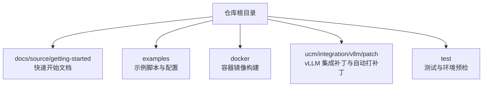
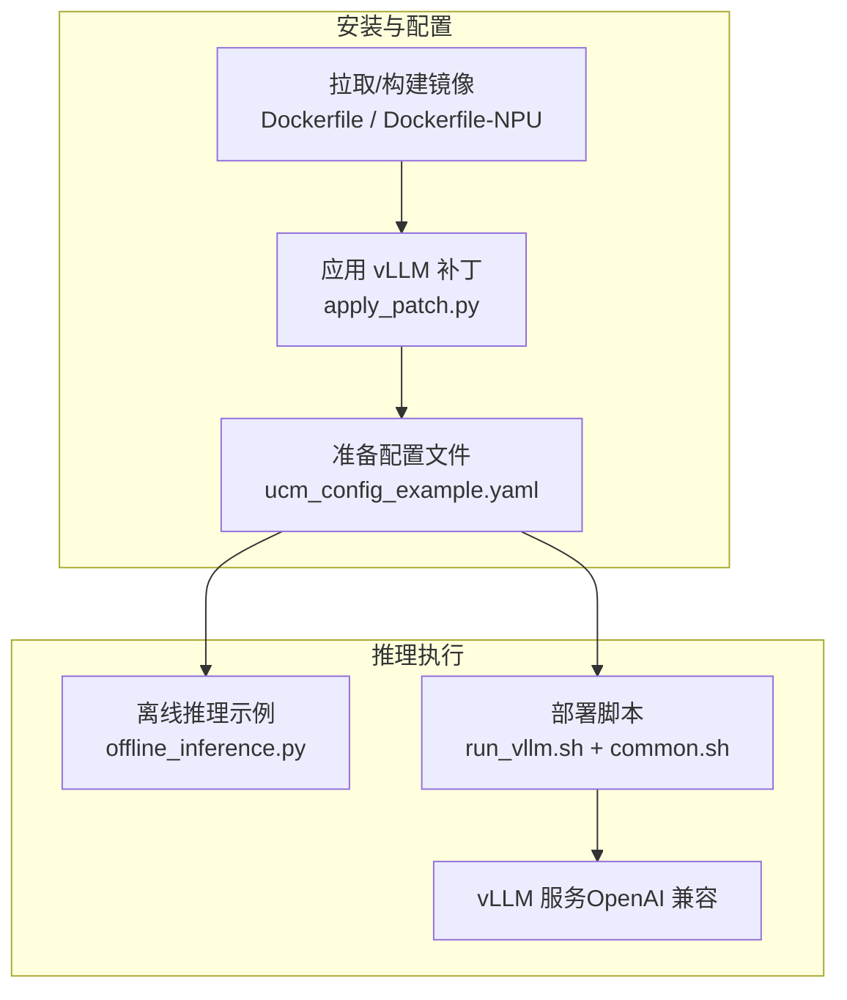
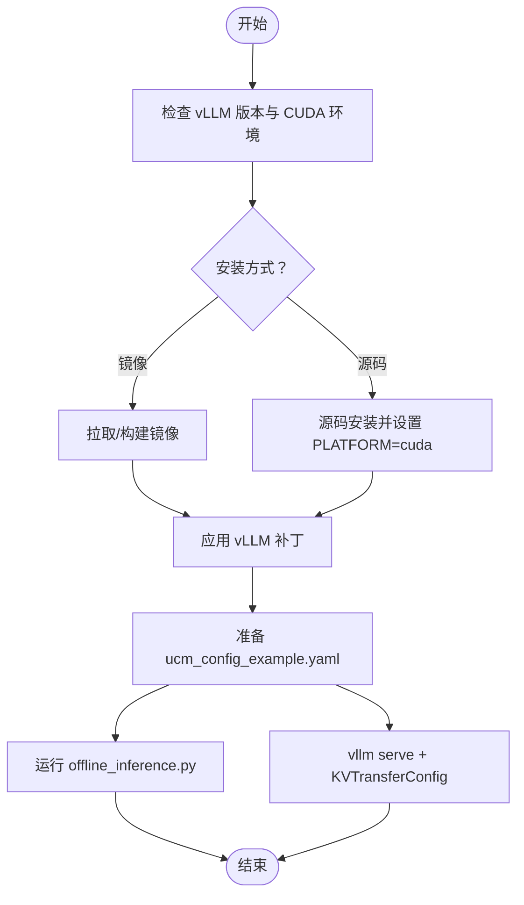
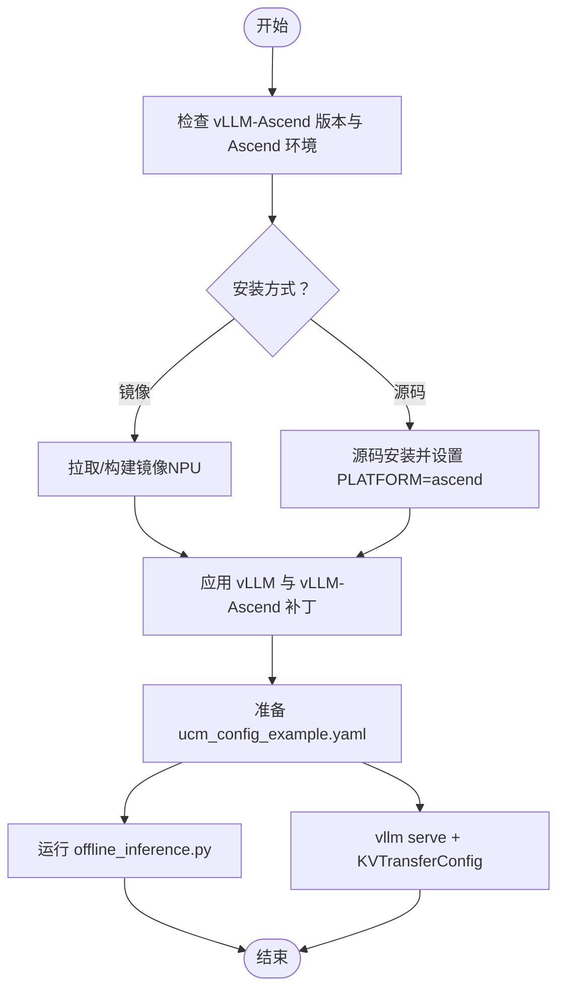
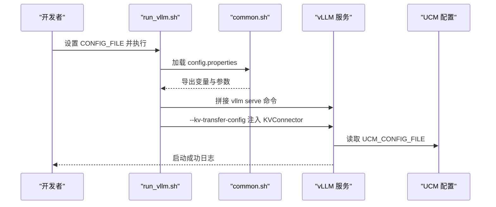
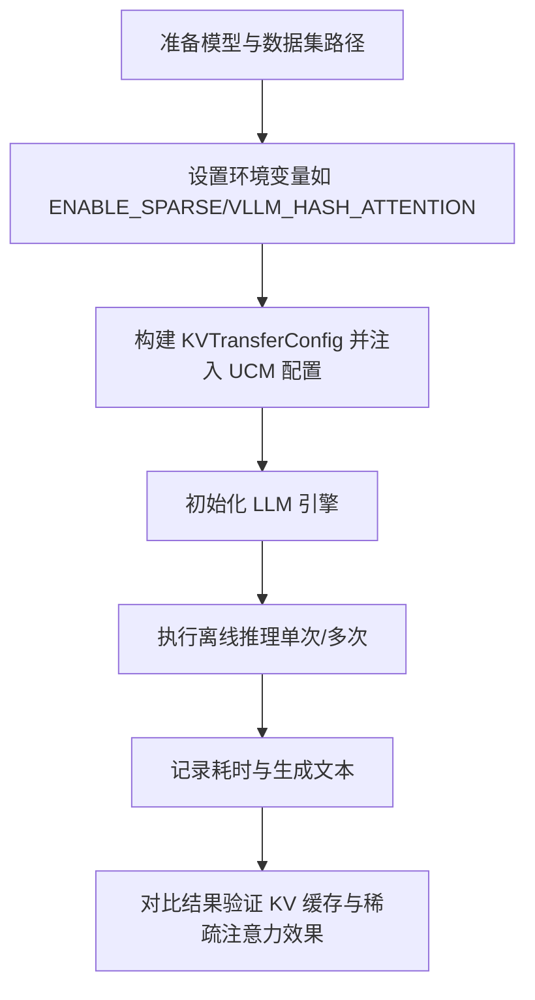
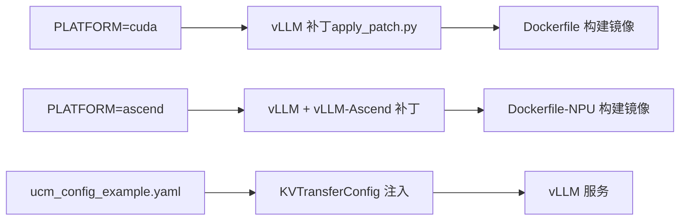
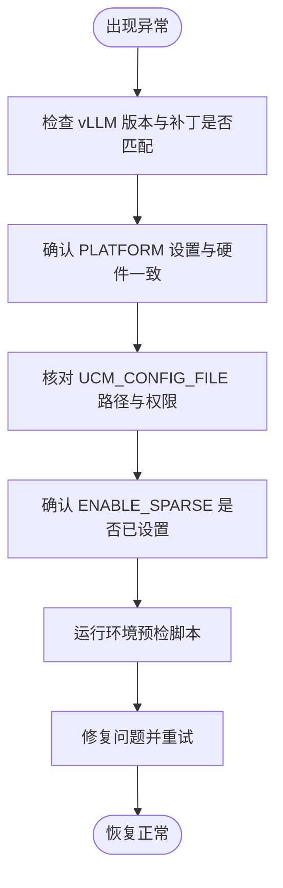

# 快速开始

<cite>
**本文引用的文件**   
- [README.md](file://README.md)
- [quickstart_vllm.md](file://docs/source/getting-started/quickstart_vllm.md)
- [quickstart_vllm_ascend.md](file://docs/source/getting-started/quickstart_vllm_ascend.md)
- [Dockerfile](file://docker/Dockerfile)
- [Dockerfile-NPU](file://docker/Dockerfile-NPU)
- [apply_patch.py](file://ucm/integration/vllm/patch/apply_patch.py)
- [common.sh](file://examples/deployments/scripts/vllm/common.sh)
- [run_vllm.sh](file://examples/deployments/scripts/vllm/run_vllm.sh)
- [ucm_config_example.yaml](file://examples/ucm_config_example.yaml)
- [offline_inference.py](file://examples/offline_inference.py)
- [offline_inference_blend.py](file://examples/offline_inference_blend.py)
- [offline_inference_gsaondevice.py](file://examples/offline_inference_gsaondevice.py)
- [run_env_preCheck.py](file://test/common/envPreCheck/run_env_preCheck.py)
- [config.yaml](file://test/config.yaml)
</cite>

## 目录
1. [简介](#简介)
2. [项目结构](#项目结构)
3. [核心组件](#核心组件)
4. [架构总览](#架构总览)
5. [详细组件分析](#详细组件分析)
6. [依赖关系分析](#依赖关系分析)
7. [性能注意事项](#性能注意事项)
8. [故障排查指南](#故障排查指南)
9. [结论](#结论)
10. [附录](#附录)

## 简介
本指南面向首次使用 Unified Cache Manager（UCM）的用户，提供在 vLLM（CUDA/NVIDIA 平台）与 vLLM-Ascend（NPU 平台）两种部署场景下的“快速开始”路径。内容覆盖环境准备、安装与配置、第一个推理示例运行，以及离线推理验证 KV 缓存与稀疏注意力功能的正确性。同时给出常见问题排查与环境验证步骤，帮助您在最短时间内完成端到端验证。

## 项目结构
- 文档与入门指南位于 docs/source/getting-started，分别提供 vLLM 与 vLLM-Ascend 的快速开始说明。
- 示例脚本与配置位于 examples，包括离线推理示例、部署脚本与配置样例。
- 容器化构建位于 docker，提供 CUDA 与 NPU 的官方 Dockerfile。
- vLLM 集成补丁与自动打补丁逻辑位于 ucm/integration/vllm/patch，支持按版本与平台自动应用所需补丁。
- 测试与环境预检工具位于 test，可辅助验证硬件与网络状态。

**章节来源**
- [README.md](file://README.md#L69-L72)

## 核心组件
- vLLM 集成与补丁
  - 通过 apply_patch.py 自动检测 vLLM 版本并应用对应补丁，支持 v0.9.2 及可选 ReRoPE 场景。
  - 支持 CUDA 与 Ascend 两套补丁组合，满足不同平台需求。
- 容器化安装
  - Dockerfile 与 Dockerfile-NPU 提供一键构建 UCM + vLLM 的镜像，并自动应用补丁。
- 配置系统
  - ucm_config_example.yaml 提供前缀缓存与稀疏注意力配置示例，支持在线 API 与离线推理两种模式。
- 推理示例
  - offline_inference.py 展示离线推理流程；offline_inference_blend.py 与 offline_inference_gsaondevice.py 演示 Cache Blend 与 GSAOnDevice 的使用方式。

**章节来源**
- [apply_patch.py](file://ucm/integration/vllm/patch/apply_patch.py#L84-L119)
- [Dockerfile](file://docker/Dockerfile#L13-L18)
- [Dockerfile-NPU](file://docker/Dockerfile-NPU#L13-L23)
- [ucm_config_example.yaml](file://examples/ucm_config_example.yaml#L1-L39)
- [offline_inference.py](file://examples/offline_inference.py#L18-L44)

## 架构总览
下图展示了从“安装与配置”到“推理执行”的整体流程，涵盖 vLLM 与 UCM 的集成点、补丁应用、配置注入与日志输出等关键环节。

**图表来源**
- [Dockerfile](file://docker/Dockerfile#L13-L18)
- [Dockerfile-NPU](file://docker/Dockerfile-NPU#L13-L23)
- [apply_patch.py](file://ucm/integration/vllm/patch/apply_patch.py#L84-L119)
- [ucm_config_example.yaml](file://examples/ucm_config_example.yaml#L1-L39)
- [offline_inference.py](file://examples/offline_inference.py#L18-L44)
- [run_vllm.sh](file://examples/deployments/scripts/vllm/run_vllm.sh#L46-L107)
- [common.sh](file://examples/deployments/scripts/vllm/common.sh#L3-L30)

## 详细组件分析

### vLLM（CUDA/NVIDIA）快速开始
- 前置条件
  - vLLM 版本要求：v0.9.1+，其中 v0.9.2 与 v0.11.0 对稀疏注意力有更好支持。
- 安装选项
  - 使用官方预构建镜像或从源码构建镜像（推荐）。
  - 从源码安装时需设置 PLATFORM=cuda，并在需要时启用稀疏模块。
- 应用补丁
  - 在 vLLM 源码目录应用适配补丁；v0.11.0 仅需稀疏注意力补丁；v0.9.x 可选择完整集成或仅稀疏注意力/ReRoPE。
- 配置
  - 使用 examples/ucm_config_example.yaml 配置前缀缓存与稀疏注意力参数。
- 启动推理
  - 离线推理：修改 offline_inference.py 中的 UCM_CONFIG_FILE 路径后直接运行。
  - 在线 API：通过 vllm serve 启动服务，传入 KVTransferConfig 与 UCM 配置文件路径。

**图表来源**
- [quickstart_vllm.md](file://docs/source/getting-started/quickstart_vllm.md#L4-L131)
- [Dockerfile](file://docker/Dockerfile#L13-L18)
- [apply_patch.py](file://ucm/integration/vllm/patch/apply_patch.py#L84-L119)
- [ucm_config_example.yaml](file://examples/ucm_config_example.yaml#L1-L39)
- [offline_inference.py](file://examples/offline_inference.py#L18-L44)

**章节来源**
- [quickstart_vllm.md](file://docs/source/getting-started/quickstart_vllm.md#L4-L131)
- [Dockerfile](file://docker/Dockerfile#L13-L18)
- [apply_patch.py](file://ucm/integration/vllm/patch/apply_patch.py#L84-L119)
- [ucm_config_example.yaml](file://examples/ucm_config_example.yaml#L1-L39)
- [offline_inference.py](file://examples/offline_inference.py#L18-L44)

### vLLM-Ascend（NPU）快速开始
- 前置条件
  - vLLM-Ascend 版本要求：v0.9.1+，其中 v0.9.2 支持稀疏注意力。
- 安装选项
  - 从源码安装时需设置 PLATFORM=ascend，并在需要时启用稀疏模块。
  - 使用官方预构建镜像并构建 UCM 镜像；NPU 镜像默认基于 openEuler 变体。
- 应用补丁
  - 先对 vLLM 应用标准补丁，再对 vLLM-Ascend 应用 Ascend 专用补丁。
- 配置
  - 使用 examples/ucm_config_example.yaml 配置前缀缓存与稀疏注意力参数。
- 启动推理
  - 离线推理：修改 offline_inference.py 中的 UCM_CONFIG_FILE 路径后直接运行。
  - 在线 API：通过 vllm serve 启动服务，传入 KVTransferConfig 与 UCM 配置文件路径。

**图表来源**
- [quickstart_vllm_ascend.md](file://docs/source/getting-started/quickstart_vllm_ascend.md#L4-L176)
- [Dockerfile-NPU](file://docker/Dockerfile-NPU#L13-L23)
- [apply_patch.py](file://ucm/integration/vllm/patch/apply_patch.py#L121-L136)
- [ucm_config_example.yaml](file://examples/ucm_config_example.yaml#L1-L39)
- [offline_inference.py](file://examples/offline_inference.py#L18-L44)

**章节来源**
- [quickstart_vllm_ascend.md](file://docs/source/getting-started/quickstart_vllm_ascend.md#L4-L176)
- [Dockerfile-NPU](file://docker/Dockerfile-NPU#L13-L23)
- [apply_patch.py](file://ucm/integration/vllm/patch/apply_patch.py#L121-L136)
- [ucm_config_example.yaml](file://examples/ucm_config_example.yaml#L1-L39)
- [offline_inference.py](file://examples/offline_inference.py#L18-L44)

### 部署脚本与配置注入
- run_vllm.sh 与 common.sh
  - 通过 config.properties 加载配置，拼接 vllm serve 参数，支持开启/关闭前缀缓存、分布式执行后端、图模式等。
  - 当启用 UCM 时，通过 --kv-transfer-config 注入 KVConnector 与 UCM 配置文件路径。
- 配置文件模板
  - ucm_config_example.yaml 提供前缀缓存与稀疏注意力配置示例，注释中给出启用方式与参数说明。

**图表来源**
- [run_vllm.sh](file://examples/deployments/scripts/vllm/run_vllm.sh#L3-L116)
- [common.sh](file://examples/deployments/scripts/vllm/common.sh#L3-L30)
- [ucm_config_example.yaml](file://examples/ucm_config_example.yaml#L1-L39)

**章节来源**
- [run_vllm.sh](file://examples/deployments/scripts/vllm/run_vllm.sh#L3-L116)
- [common.sh](file://examples/deployments/scripts/vllm/common.sh#L3-L30)
- [ucm_config_example.yaml](file://examples/ucm_config_example.yaml#L1-L39)

### 离线推理示例与功能验证
- offline_inference.py
  - 通过 KVTransferConfig 注入 UCMConnector 与配置文件路径，构建 LLM 引擎，执行两次相同提示以验证 KV 缓存命中与一致性。
- offline_inference_blend.py
  - 演示 Cache Blend 与 RAG 分块缓存策略，通过 pad 与 end token 标记实现块级缓存加载。
- offline_inference_gsaondevice.py
  - 演示 GSAOnDevice 稀疏注意力在设备侧的计算与检索，需设置 ENABLE_SPARSE 与 VLLM_HASH_ATTENTION 环境变量。

**图表来源**
- [offline_inference.py](file://examples/offline_inference.py#L18-L44)
- [offline_inference_blend.py](file://examples/offline_inference_blend.py#L87-L135)
- [offline_inference_gsaondevice.py](file://examples/offline_inference_gsaondevice.py#L64-L102)

**章节来源**
- [offline_inference.py](file://examples/offline_inference.py#L18-L44)
- [offline_inference_blend.py](file://examples/offline_inference_blend.py#L87-L135)
- [offline_inference_gsaondevice.py](file://examples/offline_inference_gsaondevice.py#L64-L102)

## 依赖关系分析
- 平台与补丁
  - CUDA：PLATFORM=cuda，应用 vLLM 适配补丁。
  - Ascend：PLATFORM=ascend，应用 vLLM 与 vLLM-Ascend 双补丁。
- 容器镜像
  - Dockerfile 与 Dockerfile-NPU 内部自动安装 UCM 并应用补丁，简化本地部署。
- 配置注入
  - 运行时通过 KVTransferConfig 将 UCM_CONFIG_FILE 注入 vLLM，实现前缀缓存与稀疏注意力的无缝接入。

**图表来源**
- [apply_patch.py](file://ucm/integration/vllm/patch/apply_patch.py#L84-L136)
- [Dockerfile](file://docker/Dockerfile#L13-L18)
- [Dockerfile-NPU](file://docker/Dockerfile-NPU#L13-L23)
- [ucm_config_example.yaml](file://examples/ucm_config_example.yaml#L1-L39)
- [run_vllm.sh](file://examples/deployments/scripts/vllm/run_vllm.sh#L99-L107)

**章节来源**
- [apply_patch.py](file://ucm/integration/vllm/patch/apply_patch.py#L84-L136)
- [Dockerfile](file://docker/Dockerfile#L13-L18)
- [Dockerfile-NPU](file://docker/Dockerfile-NPU#L13-L23)
- [ucm_config_example.yaml](file://examples/ucm_config_example.yaml#L1-L39)
- [run_vllm.sh](file://examples/deployments/scripts/vllm/run_vllm.sh#L99-L107)

## 性能注意事项
- 前缀缓存禁用参数
  - 在在线 API 启动时，若需测试 SSD 性能，可使用禁用前缀缓存参数；生产环境建议开启以提升吞吐。
- 日志路径
  - UCM 日志默认写入 vLLM 服务启动目录下的 log 子目录，可通过环境变量自定义日志路径。
- 图模式与分布式执行
  - 可通过 run_vllm.sh 的图模式与分布式执行后端参数优化性能，具体取决于硬件与任务规模。

**章节来源**
- [quickstart_vllm.md](file://docs/source/getting-started/quickstart_vllm.md#L208-L212)
- [run_vllm.sh](file://examples/deployments/scripts/vllm/run_vllm.sh#L66-L78)

## 故障排查指南
- 环境预检
  - 使用 test/common/envPreCheck/run_env_preCheck.py 进行 SSH 无密码登录、Ascend/NVIDIA 设备状态检查、链路连通性与拓扑验证。
  - 配置文件 test/config.yaml 提供测试框架所需的数据库、LLM 连接与环境预检参数模板。
- 常见问题定位
  - vLLM 版本不匹配：确认已应用与版本对应的补丁。
  - 平台设置错误：确保 PLATFORM=cuda 或 PLATFORM=ascend 与实际硬件一致。
  - 配置文件路径错误：确认 UCM_CONFIG_FILE 指向正确的 YAML 文件。
  - 稀疏模块未编译：在从源码安装时设置 ENABLE_SPARSE=TRUE 并重新编译。

**图表来源**
- [run_env_preCheck.py](file://test/common/envPreCheck/run_env_preCheck.py#L40-L80)
- [config.yaml](file://test/config.yaml#L36-L48)
- [apply_patch.py](file://ucm/integration/vllm/patch/apply_patch.py#L84-L119)

**章节来源**
- [run_env_preCheck.py](file://test/common/envPreCheck/run_env_preCheck.py#L40-L80)
- [config.yaml](file://test/config.yaml#L36-L48)
- [apply_patch.py](file://ucm/integration/vllm/patch/apply_patch.py#L84-L119)

## 结论
通过本快速开始指南，您可以在 vLLM（CUDA/NVIDIA）与 vLLM-Ascend（NPU）两种平台上完成 UCM 的安装、配置与推理验证。建议优先使用容器化安装以减少环境差异带来的问题，并结合离线推理示例验证 KV 缓存与稀疏注意力功能。遇到问题时，利用环境预检脚本与配置模板进行逐项排查，可显著提升定位效率。

## 附录
- 快速命令参考
  - 拉取/构建镜像：参考各平台 Dockerfile 的构建命令。
  - 应用补丁：在 vLLM 源码目录执行对应补丁应用命令。
  - 运行离线推理：修改 offline_inference.py 中的配置文件路径后执行。
  - 启动在线服务：使用 vllm serve 并通过 --kv-transfer-config 注入 KVConnector 与 UCM 配置文件路径。
- 配置文件模板
  - ucm_config_example.yaml 提供前缀缓存与稀疏注意力配置示例，便于快速上手。

**章节来源**
- [Dockerfile](file://docker/Dockerfile#L13-L18)
- [Dockerfile-NPU](file://docker/Dockerfile-NPU#L13-L23)
- [offline_inference.py](file://examples/offline_inference.py#L18-L44)
- [ucm_config_example.yaml](file://examples/ucm_config_example.yaml#L1-L39)